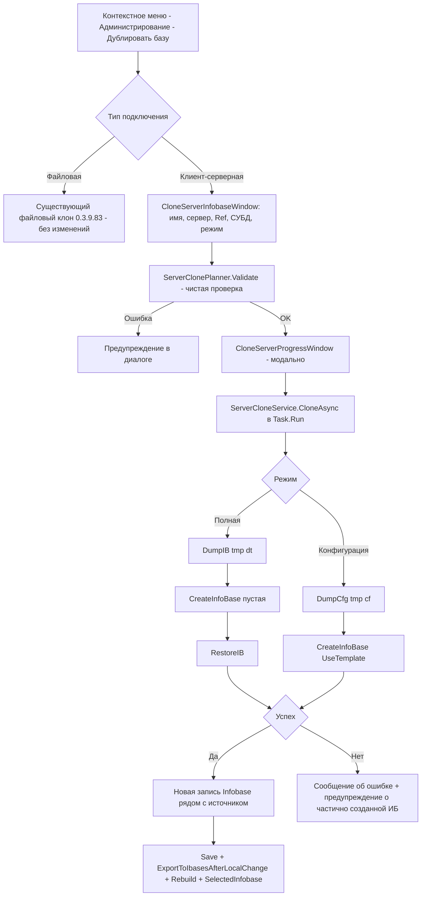

# PLAN — 0.3.9.100 — функция №10 «Клонирование клиент-серверной ИБ»

Репозиторий [`sivatorov/ConfigurationManagement`](https://github.com/sivatorov/ConfigurationManagement),
локальная копия `f:\Yandex.Disk\h\Configuration_Management`, ветка `main`, HEAD `700cee8` (0.3.9.99).

Режим: Архитектор (план) → задача-исполнитель в режиме **code**. Одна фича = одна задача = одна версия = один коммит.
Issue не создаётся (новая возможность). PLAN-файл остаётся untracked; CHANGELOG/README коммитятся.

---

## 1. Сводка

**Что делаем:** расширяем команду «Дублировать базу…» контекстного меню базы («Администрирование») на
**клиент-серверные ИБ**. Сейчас пункт активен только для файловых баз (`CanExecute` проверяет
`Connection.Type == File`). Для серверной базы команда открывает новый диалог «Дублировать серверную базу»,
пользователь задаёт имя клона, целевой сервер 1С / имя базы на сервере (Ref), СУБД и учётные данные,
и выбирает режим: **полная копия (данные + конфигурация)** или **только конфигурация**. После выполнения —
новая запись `Infobase` (тип ClientServer) добавляется в список рядом с источником. Поведение файлового
клона **не меняется**. Версия **0.3.9.100**.

**Механизм (выбор из вариантов ТЗ):** вариант **(c) — комбинация, пользователь выбирает режим в диалоге**:

- **Полная копия (.dt):**
  1. `DESIGNER /S"<источник>" /DumpIB <tmp>\dump.dt` — выгрузка данных + конфигурации;
  2. `CREATEINFOBASE` на целевом сервере (пустая база; `Srvr/Ref/DBMS/DBSrvr/DB/DBUID/DBPwd/CrSQLDB/SchJobDn`);
  3. `DESIGNER /S"<приёмник>" /RestoreIB <tmp>\dump.dt` — загрузка данных + конфигурации.
- **Только конфигурация:**
  1. `DESIGNER /S"<источник>" /DumpCfg <tmp>\config.cf` — выгрузка конфигурации;
  2. `CREATEINFOBASE` на целевом сервере **с `/UseTemplate"<tmp>\config.cf"`** — создание базы и загрузка
     конфигурации **одним запуском** (тот же путь, что уже реализован в окне создания ИБ из шаблона).

Оба режима используют **только существующие примитивы** `OneCLauncher` (`DumpIB`, `DumpCfg`, `RestoreIB` в enum
`DesignerBatchOperation` и `CreateInfoBase` с параметрами сервера/СУБД/`templatePath`) — **правки
`OneCLauncher`/`DesignerBatch` НЕ требуются**, что резко снижает риск регрессий. Вариант (a) «только .dt»
отвергнут: он не даёт быстрого режима «только конфигурация» (шаблон для пустой базы). Вариант (b) «только
конфигурация» отвергнут как единственный: ТЗ требует копию с данными. Реализуем оба (c), полный — по умолчанию.

| Параметр | Значение |
|---|---|
| Версия | 0.3.9.100 (4 поля csproj, строки 62–65) |
| Меню | Контекстное меню базы → «Администрирование» → «Дублировать базу» (обе платформы, пункт уже есть) |
| Режимы | «Данные и конфигурация» (DumpIB→Create→RestoreIB) / «Только конфигурация» (DumpCfg→Create с /UseTemplate) |
| Диалог | Новое окно `CloneServerInfobaseWindow` (WPF + Avalonia): имя, сервер/Ref, СУБД, группа, режим |
| Прогресс | Новое модальное окно `CloneServerProgressWindow` с этапами (по образцу `ConfigDiffProgressWindow`) |
| Тесты | Чистая логика планировщика `ServerClonePlanner` (имена, Ref, сборка параметров, валидация) — без 1С |
| Коммит | `feat: клонирование клиент-серверной ИБ; 0.3.9.100` |

---

## 2. Ключевые якоря кодовой базы (разведка выполнена)

### 2.1. Файловый клон (0.3.9.83) — образец записи и потока

- [`Services/InfobaseCloneHelper.cs`](Configuration%20Management/Services/InfobaseCloneHelper.cs) — чистая
  логика файлового клона: `ProposeCloneName` (**15–19**, «<Имя> — Копия»), `BuildTargetDirectory` (**26–48**),
  `CopyDirectory` (**55–80**), `GetDirectorySize` (**83–98**), `SanitizeFileName` (**100–107**).
  `ProposeCloneName` переиспользуем для серверного клона как есть.
- Команда WPF: [`ViewModels/MainViewModel.Commands.cs`](Configuration%20Management/ViewModels/MainViewModel.Commands.cs)
  — `CloneInfobaseCommand` **1565–1569** (`CanExecute: Connection.Type == File`), `ExecuteCloneInfobase`
  **1572–1654**: проверка каталога/IsRunning → `NameInputWindow` → `Confirm` → `Task.Run(CopyDirectory)` →
  глубокая копия записи через JSON (**1629–1640**: новый Id, чистая история, сброс флагов) → вставка в список
  после источника (**1642–1646**) → `Save(); RebuildGroupTree(); SelectedInfobase = clone; RefreshRunningFlags()`.
- Команда Avalonia: [`ViewModels/MainViewModel.Avalonia.Commands.cs`](Configuration%20Management/ViewModels/MainViewModel.Avalonia.Commands.cs)
  — **331–335** (CanExecute), `ExecuteCloneInfobase` **338–418** (зеркально: `SaveSilently(); RebuildTree()`).
  Обе реализации серверного клона разветвляются внутри `ExecuteCloneInfobase` по типу подключения.
- Пункт меню Avalonia: [`Views/MainWindow.Avalonia.Tree.cs`](Configuration%20Management/Views/MainWindow.Avalonia.Tree.cs)
  — `BuildRowContextMenu()` **1733+**, пункт в подменю «Администрирование» **1824**
  (`MenuAction("Clone.Title", _vm.CloneInfobaseCommand, null, "IconCopy", "#14B8A6")`); комментарий «для
  нефайловых баз команда запрещена (CanExecute) — пункт гаснет» — **обновить**.
- Пункт меню WPF: [`Views/MainWindow.xaml`](Configuration%20Management/Views/MainWindow.xaml) — **2376–2379**
  (в подменю «Администрирование», `Command="{Binding CloneInfobaseCommand}"`, иконка `ContentCopy`).
- `OnBaseContextMenu_Opened` ([`Views/MainWindow.Columns.cs`](Configuration%20Management/Views/MainWindow.Columns.cs) **74–125**)
  скрывает системные пункты в режиме «Пользователь» — пункт клонирования остаётся системным, правок не требует.

### 2.2. Создание ИБ (клиент-серверной в т.ч.) — переиспользуемая модель и сервис

- [`Models/CreateInfobaseRequest.cs`](Configuration%20Management/Models/CreateInfobaseRequest.cs) — модель
  параметров: `Name`, `FromTemplate`, `TemplatePath`, `PlatformVersion`, `IsFile`, `FilePath`, `Server`,
  `DatabaseName` (Ref), `Dbms`, `DbServer`, `DbName`, `DbUser`, `DbPassword`, `CreateSqlDatabase`,
  `BlockScheduledJobs`, `GroupPath`. **Поля серверной части — ровно то, что нужно диалогу клона.**
- [`Services/CreateInfobaseService.cs`](Configuration%20Management/Services/CreateInfobaseService.cs) — `TryCreate`
  **22–152**: валидация (имя, платформа, сервер+Ref), эвристика несовместимой версии на сервере (#91),
  вызов `OneCLauncher.CreateInfoBase`, сборка `Infobase` (**134–142**: новый Id, группа, платформа,
  разрядность из суффикса), сохранение последней версии. **Переиспользуем только паттерн**, сервис не трогаем.
- WPF-окно: [`Views/CreateInfobaseWindow.xaml.cs`](Configuration%20Management/Views/CreateInfobaseWindow.xaml.cs) —
  блок серверных полей (`ServerBox`, `RefBox`, `DbmsBox`, `DbServerBox`, `DbNameBox`, `DbUserBox`,
  `DbPwdBox`, `CreateDbCheck`, `BlockJobsCheck`), сборка запроса в `OnCreate_Click` **531–551**, обработка
  результатов `TryCreate` **553–601**. Выбор группы — `OnPickGroup_Click` **95–115** через `GroupPickerWindow`.
- Avalonia-окно: [`Views/CreateInfobaseWindow.Avalonia.cs`](Configuration%20Management/Views/CreateInfobaseWindow.Avalonia.cs) —
  те же поля **39–57**, список СУБД `DbmsValues` **81–84** (MSSQLServer, PostgreSQL, IBMDB2, OracleDatabase, SQLite).
- Вызов из VM (образец добавления результата в список): WPF [`ViewModels/MainViewModel.Commands.cs`](Configuration%20Management/ViewModels/MainViewModel.Commands.cs)
  **51–93** (`AddInfobase` → `CreateInfobaseWindow` → `Infobases.Add; Save; RebuildGroupTree; ExportToIbasesAfterLocalChange`);
  Avalonia [`ViewModels/MainViewModel.Avalonia.cs`](Configuration%20Management/ViewModels/MainViewModel.Avalonia.cs)
  **1326–1388** (`AddInfobase` → `CreateInfobase` → `_allInfobases.Add; SaveSilently; RebuildTree; ExportToIbasesAfterLocalChange`).

### 2.3. OneCLauncher: CreateInfoBase и пакетные операции DESIGNER

- [`Services/OneCLauncher.Arguments.cs`](Configuration%20Management/Services/OneCLauncher.Arguments.cs) —
  `CreateInfoBase(platformVersion, isFile, filePath, server, databaseName, templatePath, dbms, dbServer,
  dbName, dbUser, dbPassword, createSqlDatabase, blockScheduledJobs, timeoutMs = 5 мин)` **229–387**.
  Строка подключения серверной ИБ: `Srvr="…";Ref="…"` + опционально `DBMS/DBSrvr/DB/DBUID/DBPwd/CrSQLDB="Y"/SchJobDn="Y"`
  **290–312**; `/UseTemplate"<файл>"` **315–332**; ожидание `WaitForExit(timeoutMs)` **354**; cleanup созданного
  каталога при неудаче (для файловых; серверной — не касается) **349/356/364/378**; маскировка пароля
  `SensitiveDataMasker.MaskDbPassword` **372/385**.
- [`Services/OneCLauncher.Linux.Process.cs`](Configuration%20Management/Services/OneCLauncher.Linux.Process.cs) —
  та же сигнатура `CreateInfoBase` **375+** (Linux, те же ключи). Клиент-серверное создание уже работает на обеих платформах.
- [`Services/OneCLauncher.DesignerBatch.cs`](Configuration%20Management/Services/OneCLauncher.DesignerBatch.cs) —
  `enum DesignerBatchOperation` **19–46** (уже есть `DumpIB`, `DumpCfg`, `RestoreIB`, `LoadCfg`, `DumpConfigToFiles`);
  `RunDesignerBatch(infobase, operation, outputPath, credential)` **109–244**: поиск 1cv8, `IsDesignerBlocked`
  (**137–142**), проверка входных файлов для RestoreIB/LoadCfg (**178–183**), сборка opArg (**195–214**),
  лог `/Out` во временный файл (**220–221**), события `DesignerBatchStarted/Completed` (**234–235**).
  **Изменений в этом файле не требуется.**
- Паттерн ожидания завершения батча: [`Services/BackupService.cs`](Configuration%20Management/Services/BackupService.cs)
  — `RunAsync` **30–163** (DumpIB/DumpCfg), `RestoreAsync` **166–207** (RestoreIB), `WaitForCompletionAsync`
  **213–237** (TaskCompletionSource + фильтр по `info.Operation`/`OutputPath`, таймаут `DefaultTimeout = 60 мин` **18**).
- Тот же паттерн с маппингом ошибок в исключение: [`Services/ConfigurationDiffService.cs`](Configuration%20Management/Services/ConfigurationDiffService.cs)
  — `CompareAsync` **69–101** (tmp `cm_configdiff_<guid>` + `finally TryDeleteDirectory`), `WaitForBatchAsync`
  **203–229**, `TryDeleteDirectory` **232–243**, таймауты: батч 60 мин (**60**), CreateInfoBase 30 мин (**63**).
  **Это основной образец для нового `ServerCloneService`.**

### 2.4. Модели данных

- [`Models/ConnectionSettings.cs`](Configuration%20Management/Models/ConnectionSettings.cs) — `Type`, `Server`,
  `DatabaseName`, `FilePath`, `User`, `Password`, `AuthenticationMode` (**27–52**), `Port` (**54–55**),
  `WebUrl`, `BlockScheduledJobs` (**20–25**), `GetServerWithPort()` (**68–83**). СУБД-параметры
  (`dbms/dbServer/dbName/dbUser/dbPwd`) **в записи не сохраняются** — их запрашиваем в диалоге клона.
- [`Models/Infobase.cs`](Configuration%20Management/Models/Infobase.cs) — `IsRunning` **131–133**
  (индикатор «база запущена», 0.3.9.82) — используем как запрет клонирования.

### 2.5. Синхронизация ibases.v8i

- WPF: [`ViewModels/MainViewModel.cs`](Configuration%20Management/ViewModels/MainViewModel.cs) —
  `ExportToIbasesAfterLocalChange()` **1334–1363** (экспорт без импорта, при включённой настройке).
- Avalonia: [`ViewModels/MainViewModel.Avalonia.Sync.cs`](Configuration%20Management/ViewModels/MainViewModel.Avalonia.Sync.cs) **429+**.
- Примечание: текущий файловый клон вызывает только `Save()/SaveSilently()` без явного экспорта
  (**1651/412–413**); по ТЗ серии для серверного клона **явно вызываем `ExportToIbasesAfterLocalChange()`
  после добавления записи** (как в потоке создания ИБ, п. 2.2). Опционально — добавить её же в файловый
  клон для консистентности (по согласованию, не обязательно).

### 2.6. Окна прогресса (образцы)

- [`Views/ConfigDiffProgressWindow.cs`](Configuration%20Management/Views/ConfigDiffProgressWindow.cs) (**16–57**,
  WPF `#if WINDOWS`): модальное 420×140, `ProgressBar IsIndeterminate`, `SetStage` через Dispatcher (**49–56**).
- [`Views/ConfigDiffProgressWindow.Avalonia.cs`](Configuration%20Management/Views/ConfigDiffProgressWindow.Avalonia.cs)
  (**19–63**, `#if LINUX`): наследует `ModalWindowBase`, учёт `LinuxRendering.DisableAnimations` (**35–41**, issue #153),
  `Dispatcher.UIThread.Post` (**58–61**). Без кнопки «Отмена» — как все прогресс-окна серии.

### 2.7. Проект, локализация, документация

- [`Configuration Management.csproj`](Configuration%20Management/Configuration%20Management.csproj):
  версии **62–65**; Linux ItemGroup — паттерны явного подключения чистых файлов: ViewModels `Compile Include`
  (**358–361**), Models `Remove+Include` (**364–365**), Services `Remove+Include` (**369–376**);
  окна `*.Avalonia.cs` покрываются глобами.
- Локализация: [`ru.json`](Configuration%20Management/Localization/Languages/ru.json) — ключи `Clone.*`
  **176–183** (Title, NameTitle, NamePrompt, Confirm, SourceMissing, SourceRunning, Done, Failed);
  метки полей серверной ИБ `CreateInfobase.*` **1231–1237** (ServerLabel, RefLabel, DbmsLabel, DbServerLabel,
  DbNameLabel, DbUserLabel, DbPasswordLabel) — **переиспользуем**; `en.json` — симметрично (**176–183**).
- [`CHANGELOG.md`](CHANGELOG.md) — новая запись `## [0.3.9.100]` сверху (формат — как 0.3.9.99, со ссылками на файлы).
- [`README.md`](README.md) — бейдж версии строка **3**; пункт возможностей — после описания Config-Diff.

---

## 3. Детальное описание решения

### 3.1. Механизм копирования и обоснование

Выбран вариант **(c)**: диалог предлагает два режима, по умолчанию «Данные и конфигурация».

**Режим «Данные и конфигурация» (полная копия, 3 шага):**

```
[Источник] серверная ИБ (Srvr="srv";Ref="src")
   │ 1) DESIGNER /S"<источник>" /DumpIB"<tmp>\clone.dt"     (RunDesignerBatch DumpIB)
   ▼
<tmp>\clone.dt  ──►  2) CREATEINFOBASE Srvr="…";Ref="<клона>";DBMS=…;DBSrvr=…;DB=…;DBUID=…;DBPwd=…;CrSQLDB="Y"
                         (OneCLauncher.CreateInfoBase, isFile:false, пустая база)
   │ 3) DESIGNER /S"<приёмник>" /RestoreIB"<tmp>\clone.dt"  (RunDesignerBatch RestoreIB)
   ▼
[Клон] серверная ИБ: данные + конфигурация
```

**Режим «Только конфигурация» (2 шага):**

```
[Источник] ──► 1) DESIGNER /S"<источник>" /DumpCfg"<tmp>\config.cf"
   ▼
<tmp>\config.cf ──► 2) CREATEINFOBASE Srvr="…";Ref="<клона>";DBMS=… /UseTemplate"<tmp>\config.cf"
                       (создание базы и загрузка конфигурации одним запуском — путь уже обкатан
                        в CreateInfobaseWindow из шаблона, поле FromTemplate/TemplatePath)
   ▼
[Клон]: конфигурация без данных
```

**Обоснование выбора:**

1. **Все примитивы уже существуют.** `DumpIB`, `DumpCfg`, `RestoreIB` в enum
   [`OneCLauncher.DesignerBatch.cs`](Configuration%20Management/Services/OneCLauncher.DesignerBatch.cs:19)
   (строки 19–46), `CreateInfoBase` с серверной строкой подключения и `/UseTemplate` на обеих платформах
   (Windows `Arguments.cs:229`, Linux `Linux.Process.cs:375`). Правки `OneCLauncher` не нужны — нет риска
   сломать обкатанный конвейер выгрузок/восстановлений/создания.
2. **`.dt` — единственный штатный способ переноса данных** между серверными ИБ без COM/rac; `RestoreIB`
   в пустую только что созданную базу не требует отключения сеансов (их нет) и очистки списка пользователей
   (он пуст) — это снимает главные ограничения RestoreIB.
3. **«Только конфигурация» дешевле:** вместо тяжёлого `.dt` (размер сопоставим с базой) переносим только
   `.cf` и создаём базу с `/UseTemplate` одним запуском (а не «пустая база → /LoadCfg /UpdateDBCfg» — тот
   потребовал бы лишний запуск и семантику LoadCfg). Это тот же приём, что `ConfigurationDiffService` использует
   для временных ИБ из `.cf` (`ConfigDiffService.cs:121–128`).
4. **Ограничения режимов (документируем в диалоге/подсказке):**
   - полная копия требует свободного места под `<tmp>\clone.dt` (можно проверить через
     `DiskFreeSpaceHelper` — опциональное предупреждение) и прав на целевом кластере 1С/СУБД;
   - `RestoreIB` загружает в приёмник данные и конфигурацию целиком; пользователи 1С приёмника после
     восстановления — пусты (стандартное поведение платформы), поэтому наследуем только настройки
     авторизации **записи** списка (User/Password/AuthenticationMode), а не пользователей ИБ;
   - клон не получает историю запусков, избранное/закрепление, слоты хоткеев — как у файлового клона.

### 3.2. Диалог клона (`CloneServerInfobaseWindow`)

**Рекомендация по переиспользованию:** в v1 **не выносим** общий компонент серверных полей из
`CreateInfobaseWindow` (окно сложное: тип базы, дерево шаблонов, платформы; вынос затрагивал бы обкатанное
окно и оба XAML/AXAML — риск регрессий ради одной фичи). Вместо этого новое окно повторяет **блок серверных
полей** (≈10 полей) по образцу `CreateInfobaseWindow` и использует ту же модель данных
`CreateInfobaseRequest` (+ поле режима клона). Это соответствует стилю проекта (окна дублируются для WPF/Avalonia).

Файлы: `Views/CloneServerInfobaseWindow.xaml` + `.xaml.cs` (WPF, `#if WINDOWS`), `Views/CloneServerInfobaseWindow.Avalonia.cs`
(Linux, наследует `ModalWindowBase`). Поля:

| Поле | Префилл из источника | Ключ локализации |
|---|---|---|
| Имя клона | `InfobaseCloneHelper.ProposeCloneName(source.Name)` | `Clone.NameTitle` / `Clone.NamePrompt` |
| Сервер 1С | `source.Connection.Server` (+ `Port`, если ≠1541) | `CreateInfobase.ServerLabel` |
| Имя базы на сервере (Ref) | `ServerClonePlanner.SuggestRefName(...)` (см. 3.5) | `CreateInfobase.RefLabel` |
| СУБД | пусто, Editable ComboBox `DbmsValues` | `CreateInfobase.DbmsLabel` |
| Сервер СУБД / Имя БД | пусто | `CreateInfobase.DbServerLabel` / `DbNameLabel` |
| Пользователь / пароль СУБД | пусто | `CreateInfobase.DbUserLabel` / `DbPasswordLabel` |
| Создать БД на сервере СУБД | `true` | `CreateInfobase.CreateDb*` |
| Блокировать фоновые задания | `source.Connection.BlockScheduledJobs` | `CreateInfobase.BlockJobs*` |
| Группа в списке | `source.Group` (через `GroupPickerWindow`) | `CreateInfobase.GroupLabel` |
| Режим | Радиокнопки: «Данные и конфигурация» (по умолчанию) / «Только конфигурация» | `CloneServer.ModeFull` / `ModeConfig` |
| Версия платформы | `source.PlatformVersion` (+суффикс разрядности из `source.Architecture`) | `CreateInfobase.PlatformVersionLabel` |

Подсказка-предупреждение: «Полная копия переносит данные и может занять длительное время; для больших баз
убедитесь в свободном месте на диске» (ключ `CloneServer.FullHint`). По кнопке «Дублировать» окно собирает
`ServerCloneRequest` (см. 3.5) и валидирует его чистым планировщиком.

### 3.3. Поток выполнения и окно прогресса



- **Прогресс:** новое окно `Views/CloneServerProgressWindow.cs` (WPF) + `Views/CloneServerProgressWindow.Avalonia.cs`
  (Linux) — почти копия `ConfigDiffProgressWindow` (см. 2.6), заголовок `CloneServer.Title`, `SetStage`.
  Создаём новое, а не переиспользуем `ConfigDiffProgressWindow`: у того фиксированный заголовок `ConfigDiff.Title`
  и он уже в проде 0.3.9.99. Этапы (`IProgress<string>`):
  1. `CloneServer.StageDump` — «Выгрузка исходной базы…» (для обоих режимов);
  2. `CloneServer.StageCreate` — «Создание ИБ на сервере…»;
  3. `CloneServer.StageRestore` — «Загрузка данных в копию…» (только полный режим);
  4. `CloneServer.StageDone` — «Копия создана».
  Без кнопки «Отмена» (как все прогресс-окна серии): прерывание = закрытие приложения. Окно модальное,
  `ShowDialog`/`ShowDialogSync(OwnerWindow())`, затем `Task.Run(service.CloneAsync)` и закрытие по завершении.
- **Команда VM:** `ExecuteCloneInfobase` в обоих `Commands.cs` разветвляется:
  - `Connection.Type == File` → существующий путь (без изменений);
  - `Connection.Type == ClientServer` → `IsRunning`-проверка → диалог → прогресс → сервис → добавление записи.
  `CanExecute` обоих команд: `SelectedInfobase?.Connection?.Type is ConnectionType.File or ConnectionType.ClientServer`.

### 3.4. Новая запись в списке и ibases.v8i

- Клон строится как глубокая копия источника (JSON, как файловый клон `Commands.cs:1629`), затем:
  - `Id = Guid.NewGuid().ToString("N")`;
  - `Name = имя из диалога`;
  - `Connection = new ConnectionSettings { Type = ClientServer, Server = <сервер из диалога>, DatabaseName = <Ref из диалога>,
    Port = <из источника или диалога>, BlockScheduledJobs = <из диалога>, User/Password/AuthenticationMode = <из источника> }`
    — авторизации записи наследуем (это удобство запуска; пользователи 1С в самой ИБ после RestoreIB пусты);
  - `Group` = группа из диалога (по умолчанию — группа источника); теги наследуются автоматически глубокой копией;
  - сброс `IsFavorite/IsPinned/IsSelected/FavoriteHotkeyNumber`, `LastLaunchDate = null`,
    `LaunchHistory = new List<LaunchHistoryEntry>()`, `FileSizeBytes/FileLastWriteTimeUtc = null`;
  - `PlatformVersion`/`Architecture` — из источника (платформа создания клона).
- Вставка в `Infobases`/`_allInfobases` **после источника** (`IndexOf(source) + 1`), затем
  `Save()/SaveSilently()`, **`ExportToIbasesAfterLocalChange()`** (требование ТЗ, образец — поток создания
  ИБ `Commands.cs:87` / `Avalonia.cs:1383`), `RebuildGroupTree()/RebuildTree()`, `SelectedInfobase = clone`,
  `RefreshRunningFlags()`, лог `[clone] …`, инфо-диалог `Clone.Done`-аналог (`CloneServer.DoneFormat`).

### 3.5. Чистая логика — `ServerClonePlanner` (тестируемая, без 1С)

Новый статический класс `Services/ServerClonePlanner.cs`:

- `enum ServerCloneMode { FullCopy, ConfigurationOnly }` (в `Models/ServerCloneRequest.cs` вместе с запросом);
- `sealed class ServerCloneRequest` — `Source`, `CloneName`, `Mode`, `PlatformVersion`, `Server`,
  `DatabaseName` (Ref), `Dbms`, `DbServer`, `DbName`, `DbUser`, `DbPassword`, `CreateSqlDatabase`,
  `BlockScheduledJobs`, `GroupPath` (поля примитивные — сервис не зависит от UI);
- `ProposeCloneName(string)` → делегирует `InfobaseCloneHelper.ProposeCloneName` (единый формат «— Копия»);
- `SuggestRefName(string sourceDatabaseName, IEnumerable<string> existingRefNames)` → «<имя>_copy» с
  уникализацией («_copy», «_copy2», …) по известным локально Ref (сравнение регистронезависимое);
  пустое имя → «Clone». Здесь `existingRefNames` берётся из списка баз программы с тем же сервером —
  реальный список Ref на кластере недоступен без rac/COM, поэтому проверяем только локально известные;
- `BuildConnectionString(ServerCloneRequest)` → `Srvr="…";Ref="…"` + `DBMS/DBSrvr/DB/DBUID/DBPwd/CrSQLDB/SchJobDn`
  по образцу `OneCLauncher.Arguments.cs:290–312` (используется для отображения/тестов; фактическую команду
  собирает `OneCLauncher`);
- `BuildSourceSrvr(string serverWithPort, string refName)` → `"{server}\\{ref}"` (для DESIGNER `/S`);
- `Validate(ServerCloneRequest)` → `ServerCloneValidationError?` (EnterName / EnterServerAndRef / NoPlatform /
  MissingDbmsDetails при CreateSqlDatabase / None): чистая логика, зеркалит валидацию `CreateInfobaseService:24–38,69–72`;
- `DescribeSteps(ServerCloneRequest)` → последовательность этапов для прогресс-окна (для тестов).

### 3.6. Оркестратор — `ServerCloneService`

Новый класс `Services/ServerCloneService.cs` (обе платформы):

- `CloneAsync(ServerCloneRequest request, IProgress<string>? progress, CancellationToken ct)`:
  - корневой каталог `%TEMP%\cm_clonesrv_<guid>` (по образцу `cm_configdiff_<guid>`),
    внутри `clone.dt` / `config.cf`;
  - шаг «выгрузка»: `RunDesignerBatch(source, DumpIB|DumpCfg, tmpPath)` → `WaitForBatchAsync(...)`
    (копия паттерна `ConfigDiffService.cs:203–229`), таймаут 60 мин;
  - шаг «создание»: `OneCLauncher.CreateInfoBase(platform, isFile:false, server, refName,
    templatePath: config-only ? tmpCf : null, dbms…, createSqlDatabase…, timeoutMs: 30 мин)`
    — параметры из `request` (образец: `ConfigDiffService.cs:121–128` + `CreateInfobaseService.cs:95–108`);
  - шаг «загрузка» (только FullCopy): `RunDesignerBatch(target, RestoreIB, tmpDt)` → `WaitForBatchAsync`;
  - успех → возвращает `ConnectionSettings`/`Infobase`-скелет для вставки в список;
  - `finally { TryDeleteDirectory(tmpRoot) }` (копия `ConfigDiffService.cs:232–243`);
  - ошибки: `ServerCloneException(message)` с человекочитаемым текстом (см. 3.7).
- Примечание: `RunDesignerBatch` для приёмника требует временный объект `Infobase` с
  `Connection { Type=ClientServer, Server, DatabaseName }` — собираем в сервисе (как `CreateTempBase`
  в `ConfigDiffService.cs:186–196`, но серверный вариант), `IsDesignerBlocked` сработает корректно
  (для новой базы блокировок нет).

### 3.7. Ошибки и границы

| Ситуация | Поведение |
|---|---|
| База запущена (`source.IsRunning`) | Запрет до клонирования, сообщение `Clone.SourceRunning` + `RefreshRunningFlags()` (как файловый клон `Commands.cs:1585–1590`) |
| Исходная база недоступна/нет прав | Ошибка шага DumpIB/DumpCfg: exit code ≠ 0 → текст из `info.ErrorMessage` (хвост лога `/Out`, паттерн `CompleteDesignerBatch`/`ConfigDiffService`) → `CloneServer.ErrDumpFailedFormat` |
| Сервер 1С / СУБД недоступны, креды неверные | Ошибка `CreateInfoBase`: `created.Error` (маскировка пароля уже в `OneCLauncher`) → `CloneServer.ErrCreateFailedFormat` |
| Таймаут шага (большая база) | `WaitForBatchAsync` → null → `CloneServer.ErrTimeoutFormat`; CreateInfoBase → `Launcher.CreateTimeout` |
| Частичный откат (создание прошло, RestoreIB упал) | **Не удаляем** серверную ИБ автоматически (безопасного механизма удаления без rac/COM в приложении нет). Оставляем с предупреждением: сообщение «Копия на сервере может быть создана (без данных). Удалите её через консоль серверов 1С или в списке баз» — ключ `CloneServer.PartialCreatedWarning`; запись в список **не добавляется** |
| Параллельная операция DESIGNER | `RunDesignerBatch` вернёт false (причина в `IsDesignerBlocked`) → `CloneServer.ErrOperationBlocked` (переиспользовать текст `Launcher.ConfiguratorBlockedFormat`) |
| Недостаточно места под tmp (полный режим) | *(опционально)* предупреждение через `DiskFreeSpaceHelper` до старта |
| Отмена | В v1 нет кнопки «Отмена» (как прогресс-окна серии); `CancellationToken` прокидывается в сервис для корректного cleanup в `finally` |

---

## 4. Декомпозиция

### 4.1. Новые файлы

**Чистые (обе платформы; в Linux ItemGroup — явно):**
| Файл | Назначение |
|---|---|
| `Models/ServerCloneRequest.cs` | `enum ServerCloneMode { FullCopy, ConfigurationOnly }` + `sealed class ServerCloneRequest` (примитивные поля) |
| `Services/ServerClonePlanner.cs` | Чистая логика: `ProposeCloneName`, `SuggestRefName`, `BuildConnectionString`, `BuildSourceSrvr`, `Validate`, `DescribeSteps` |
| `Services/ServerCloneService.cs` | Оркестратор: tmp-каталог, шаги Dump→Create→Restore, `WaitForBatchAsync` (копия паттерна), маппинг ошибок, cleanup |
| `ConfigurationManagement.Tests/ServerClonePlannerTests.cs` | Юнит-тесты чистой логики (см. 4.4) |

**UI (WPF + Avalonia):**
| Файл | Назначение |
|---|---|
| `Views/CloneServerInfobaseWindow.xaml` + `.xaml.cs` | WPF-диалог клона (блок серверных полей по образцу CreateInfobaseWindow + режим) |
| `Views/CloneServerInfobaseWindow.Avalonia.cs` | Avalonia-версия (наследует `ModalWindowBase`) |
| `Views/CloneServerProgressWindow.cs` (`#if WINDOWS`) | WPF-прогресс с этапами (образец `ConfigDiffProgressWindow.cs`) |
| `Views/CloneServerProgressWindow.Avalonia.cs` (`#if LINUX`) | Avalonia-прогресс (образец `.Avalonia.cs`, учёт `LinuxRendering.DisableAnimations`) |

### 4.2. Правки существующих файлов

| Файл | Правка |
|---|---|
| `ViewModels/MainViewModel.Commands.cs` | `CloneInfobaseCommand` CanExecute **1569** → `File or ClientServer`; `ExecuteCloneInfobase` **1572–1654**: ветка ClientServer (диалог → прогресс → `ServerCloneService` → вставка записи + `ExportToIbasesAfterLocalChange`) |
| `ViewModels/MainViewModel.Avalonia.Commands.cs` | То же зеркально (**335**, **338–418**): `ShowDialogSync(OwnerWindow())`, `SaveSilently`, `RebuildTree` |
| `Views/MainWindow.Avalonia.Tree.cs` | Обновить комментарий у пункта **1824** (пункт теперь активен и для серверных баз) — код меню не меняется |
| `Views/MainWindow.xaml` | Комментарий у пункта **2376** — код не меняется (CanExecute управляет доступностью) |
| `Configuration Management.csproj` | Версии **62–65** → 0.3.9.100; Linux ItemGroup: `Compile Include` для `Models/ServerCloneRequest.cs`, `Remove+Include` для `Services/ServerClonePlanner.cs` и `Services/ServerCloneService.cs` (паттерн **369–376**) |
| `Localization/Languages/ru.json` + `en.json` | Блок `CloneServer.*` (см. 4.3); метки полей — переиспользование `CreateInfobase.*` (**1231–1237** ru) |
| `CHANGELOG.md` | Запись `## [0.3.9.100]` сверху со ссылками на файлы |
| `README.md` | Бейдж строки 3 + пункт возможностей после Config-Diff |

### 4.3. Ключи локализации (префикс `CloneServer.`)

- Окно: `Title` («Дублировать серверную базу»), `ModeFull` («Данные и конфигурация»),
  `ModeConfig` («Только конфигурация»), `ModeFullHint`, `ModeConfigHint`, `Create` («Дублировать»),
  `Cancel`;
- Этапы: `StageDump`, `StageCreate`, `StageRestore`, `StageDone`;
- Успех: `DoneFormat` («Создана копия базы «{0}».\nСервер: {1}\nБаза: {2}»);
- Ошибки: `ErrDumpFailedFormat`, `ErrCreateFailedFormat`, `ErrRestoreFailedFormat`, `ErrTimeoutFormat`,
  `ErrNoPlatform`, `PartialCreatedWarning`.
- Переиспользуем: `Clone.SourceRunning`, `Clone.NameTitle`, `Clone.NamePrompt`,
  `CreateInfobase.*` метки серверных полей, `Main.DlgBaseCreated*` (при желании).

### 4.4. Тесты (`ConfigurationManagement.Tests/ServerClonePlannerTests.cs`)

Чистые, без 1С:
1. `ProposeCloneName` — «<Имя> — Копия», пустое → «Копия» (совпадает с `InfobaseCloneHelperTests`).
2. `SuggestRefName` — «Бух_база» → «Бух_база_copy»; коллизии с локально известными Ref → «_copy2», «_copy3»;
   регистронезависимость; пустое имя → «Clone».
3. `BuildConnectionString` — полный набор полей (Srvr/Ref/DBMS/DBSrvr/DB/DBUID/DBPwd/CrSQLDB/SchJobDn);
   без опциональных полей — минимум `Srvr/Ref`; экранирование кавычки удвоением.
4. `BuildSourceSrvr` — «host:port\Ref» для DESIGNER `/S`.
5. `Validate` — пустое имя → EnterName; пустое Server/Ref → EnterServerAndRef; пустая платформа → NoPlatform;
   `CreateSqlDatabase && пустой Dbms/DbServer` → MissingDbmsDetails; корректный запрос → None.
6. `DescribeSteps` — FullCopy → 3 этапа; ConfigurationOnly → 2 этапа.

**Интеграционный тест** (реальный 1cv8 + кластер): **не включаем** (CI отсутствует; как и в серии 0.3.9.x) —
вместо него ручной сценарий (см. чек-лист).

### 4.5. Риски и зависимости

| Риск | Митигация |
|---|---|
| Изменение `CanExecute` команды клона затронет файловый поток | Ветвление по типу внутри `ExecuteCloneInfobase`; файловая ветка остаётся байт-в-байт прежней; пункт меню тот же |
| Режим «.dt» требует много места/времени | Этапы в прогресс-окне; таймаут 60 мин на батч; *(опционально)* проверка места через `DiskFreeSpaceHelper`; подсказка в диалоге |
| RestoreIB в неудачно созданную базу | База создаётся пустой и без сеансов — ограничение RestoreIB не срабатывает; при сбое — предупреждение о частично созданной ИБ, автоудаление не делаем |
| СУБД-параметры не хранятся в записи | Запрашиваем в диалоге; префилл только Server/Ref/Platform; валидация `Validate` |
| Дублирование блока серверных полей (не выносим компонент) | Осознанно: минимизируем правки обкатанного `CreateInfobaseWindow`; объём дублирования ~10 полей на две платформы |
| Linux: создание серверной ИБ и DESIGNER-ключи | Уже работают (`CreateInfoBase` Linux, `RunDesignerBatch` Linux); реальную проверку кластера на Linux делаем вручную; документируем, что сервер 1С обычно Windows |
| Порядок Ref/имени клона на сервере | Проверяем только локально известные Ref (`SuggestRefName`); занятый Ref на кластере выявит ошибка `CreateInfoBase` с понятным текстом |

### 4.6. Порядок исполнения (подзадачи)

1. Модель + планировщик: `Models/ServerCloneRequest.cs`, `Services/ServerClonePlanner.cs` + тесты (1–6 из 4.4).
2. Оркестратор: `Services/ServerCloneService.cs` (tmp, Dump→Create→Restore, ожидание батчей, ошибки, cleanup).
3. UI WPF: `CloneServerInfobaseWindow.xaml(.cs)`, `CloneServerProgressWindow.cs`, ветка в
   `MainViewModel.Commands.cs` (CanExecute + ExecuteCloneInfobase), комментарий в `MainWindow.xaml:2376`.
4. UI Avalonia: `CloneServerInfobaseWindow.Avalonia.cs`, `CloneServerProgressWindow.Avalonia.cs`, ветка в
   `MainViewModel.Avalonia.Commands.cs`, комментарий в `MainWindow.Avalonia.Tree.cs:1824`.
5. Локализация: `CloneServer.*` в ru.json + en.json.
6. Проект и документация: csproj (версия 62–65 + Linux ItemGroup), CHANGELOG, README.
7. Сборки (`dotnet build`, `dotnet build -p:ForceLinux=true`), `dotnet test`, ручная проверка, коммит.

---

## 5. Чек-лист обязательных шагов задачи-исполнителя

1. **Ветвление команды — ОБЕ платформы:** `CloneInfobaseCommand` CanExecute —
   `Type is File or ClientServer` ([`MainViewModel.Commands.cs:1569`](Configuration%20Management/ViewModels/MainViewModel.Commands.cs:1569),
   [`MainViewModel.Avalonia.Commands.cs:335`](Configuration%20Management/ViewModels/MainViewModel.Avalonia.Commands.cs:335)).
   `ExecuteCloneInfobase` для ClientServer: IsRunning-проверка → диалог → прогресс → сервис → вставка.
   Файловая ветка — **без изменений**.
2. **Новые чистые .cs — ЯВНО в Linux ItemGroup csproj:** `Models/ServerCloneRequest.cs`
   (`Compile Include`), `Services/ServerClonePlanner.cs` и `Services/ServerCloneService.cs`
   (`Remove+Include`, паттерн **369–376**). Окна `Views/*.Avalonia.cs` покрываются глобами.
3. **OneCLauncher НЕ трогаем** — enum, opArg, CreateInfoBase остаются как есть (все примитивы уже есть).
4. **Диалог клона (WPF + Avalonia):** имя (префилл «— Копия»), сервер/Ref (префилл из источника),
   СУБД-поля, группа (GroupPickerWindow), режим (радио, по умолчанию «Данные и конфигурация»),
   платформа (из источника); сборка `ServerCloneRequest`; валидация `ServerClonePlanner.Validate`.
5. **Прогресс:** `CloneServerProgressWindow` (WPF + Avalonia) по образцу `ConfigDiffProgressWindow`;
   этапы «Выгрузка → Создание → Загрузка»; без кнопки «Отмена».
6. **Новая запись:** глубокое копирование источника (JSON), новый Id, чистые история/флаги,
   `Connection { Type=ClientServer, Server, DatabaseName, Port, BlockScheduledJobs, User/Password/AuthenticationMode }`,
   теги/группа наследуются; вставка после источника; `Save()/SaveSilently()` +
   **`ExportToIbasesAfterLocalChange()`** + `RebuildGroupTree()/RebuildTree()` + `SelectedInfobase = clone` +
   `RefreshRunningFlags()`.
7. **Версия:** 4 поля csproj, строки 62–65 → `0.3.9.100`.
8. **Локализация:** блок `CloneServer.*` в `ru.json` И `en.json`; метки полей — через существующие
   `CreateInfobase.*`.
9. **CHANGELOG.md:** `## [0.3.9.100] — дата` сверху, раздел «Добавлено», ссылки на новые файлы
   (формат записей 0.3.9.99).
10. **README.md:** бейдж строки 3 (`0.3.9.99` → `0.3.9.100`) + пункт возможностей после Config-Diff.
11. **Тесты:** `ConfigurationManagement.Tests/ServerClonePlannerTests.cs` — пункты 1–6 раздела 4.4;
    `dotnet test` зелёный.
12. **Сборки:** `dotnet build` (WPF) и `dotnet build -p:ForceLinux=true` (Avalonia) — без ошибок и
    предупреждений. При CS2001 — удалить `obj/Debug` (известный глюк серии).
13. **Ручная проверка (обязательна, без неё коммит не делать):**
    - полная копия: серверная база → клон с данными; запуск клона из списка открывает Предприятие;
    - только конфигурация: клон создаётся без данных (пустая БД), конфигурация соответствует источнику;
    - файловый клон — поведение не изменилось (регресс-проверка);
    - запущенная исходная база → запрет с сообщением `Clone.SourceRunning`;
    - неверные креды СУБД / недоступный сервер → понятное сообщение из лога (пароль замаскирован);
    - сбой на шаге RestoreIB → предупреждение `PartialCreatedWarning`, временный каталог
      `cm_clonesrv_*` удалён, запись в список не добавлена;
    - Linux-сборка: та же проверка при наличии платформы/кластера либо подтверждение зелёной сборки.
14. **Коммит ОДИН:** `feat: клонирование клиент-серверной ИБ; 0.3.9.100` (без PLAN-файла — он untracked).