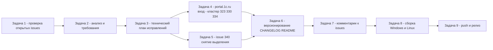

# PLAN 0.3.9.307 — обработка открытых issues #323, #330, #334, #340

Дата: 2026-10-05. Текущая версия: **0.3.9.306** (релиз от 2026-10-05). Следующая микро-версия: **0.3.9.307**.
Режим: Архитектор — только планирование, код НЕ изменяется. Реализация выполняется отдельными задачами (mode `code`) строго по этому плану.

Двухплатформенный проект: Windows/WPF (`#if WINDOWS`, `*.xaml`/`*.xaml.cs`) и Linux/Avalonia (`#if LINUX`, `*.Avalonia.cs`); общая логика (сервисы, модели, ViewModel) — общая.

---

## 1. Контекст и установленный рабочий процесс (по итогам анализа репозитория)

### 1.1 Текущее состояние

- Версия программы задаётся в **четырёх полях** [`Configuration Management.csproj`](Configuration%20Management/Configuration%20Management.csproj:62): `<Version>`, `<AssemblyVersion>`, `<FileVersion>`, `<InformationalVersion>` (сейчас все = `0.3.9.306`).
- История изменений — [`CHANGELOG.md`](CHANGELOG.md), формат `## [X.Y.Z.N] — YYYY-MM-DD`, разделы «Исправлено», ссылки на файлы кода, сводка `dotnet test` (последний прогон — **1759 тестов**, версия 0.3.9.306).
- [`README.md`](README.md): бейдж версии в шапке (строка 3, сейчас `0.3.9.306`) + раздел возможностей.
- Сборка: single-file publish — [`build-windows-single-file.ps1`](Configuration%20Management/build-windows-single-file.ps1) → `dist/win-x64/ConfigurationManagement.exe`, [`build-linux-single-file.ps1`](Configuration%20Management/build-linux-single-file.ps1) / `.sh` → `dist/linux-x64/ConfigurationManagement`. Кросс-сборка Linux из Windows: `dotnet build -p:BuildLinux=true` (в некоторых планах — `-p:ForceLinux=true`; уточнить актуальный ключ в текущих скриптах при реализации).
- .deb-пакет собирается на Windows скриптами [`publish/build_deb_win_0.3.9.306.py`](publish/build_deb_win_0.3.9.306.py), проверяется [`publish/check_deb_win_0.3.9.306.py`](publish/check_deb_win_0.3.9.306.py) (ар-члены, версия control, md5sums). Аналогичные пары скриптов создаются под каждую версию.
- Артефакты публикации в `publish/`: комментарии `comment-<номер>-<версия>.md`, тела релизов `release_body_<версия>.md`, вспомогательные `issue_<N>.json` / `issue_<N>_comments.json` / `issue_<N>_full.md`.
- Снимки состояния issues: `issues_live_state.json` (номер, заголовок, CommentsCount, LastCommentAuthor/Date/Preview), `issues_analysis.json` (действие: `fix`/`skip`, требование, последний комментарий), `issues_details.json` (полные описания и комментарии), `new_comments_after_1935.json`.
- `gh` CLI авторизован как `sivatorov` (см. `PLAN.md`). Резерв локального `.git` — `f:\Yandex.Disk\h\CM_clean`.

### 1.2 Установленные правила каждого цикла исправления

По образцу `PLAN.md` и `PLAN-0.3.9.302.md`:

1. Внести правку кода (обе платформы, где функция существует) + юнит-тесты.
2. Поднять версию во всех четырёх полях csproj.
3. Добавить запись в [`CHANGELOG.md`](CHANGELOG.md) и обновить [`README.md`](README.md) (бейдж версии).
4. Убедиться: `dotnet build` для Windows и Linux, `dotnet test` зелёный.
5. Один коммит на версию.
6. Опубликовать комментарий в issue через `gh issue comment <N> --body-file publish/comment-<N>-<версия>.md` — текст «Исправлено в версии **X.Y.Z.N**», «Что было», «Как исправлено», «Как проверить», ссылка на релиз.
7. **Issue НЕ закрывать.**
8. После всех исправлений — сборка обоих исполняемых файлов, `git push origin main`, создание ОДНОГО релиза `gh release create v<версия> dist/win-x64/ConfigurationManagement.exe dist/linux-x64/ConfigurationManagement --notes-file publish/release_body_<версия>.md`.

---

## 2. Снимок открытых issues (проверено напрямую через GitHub API, 2026-10-05 06:59 UTC)

На момент планирования открыто **4 issues**. Для каждого определён автор последнего комментария (просмотрены последние комментарии через REST `GET /repos/sivatorov/ConfigurationManagement/issues/<N>/comments?per_page=1&page=<всего>`).

| № | Issue | Автор issue | Комментариев | Последний комментарий (автор, дата UTC) | Критерий правила пользователя | Действие |
|---|-------|-------------|--------------|------------------------------------------|-------------------------------|----------|
| 1 | [#340](https://github.com/sivatorov/ConfigurationManagement/issues/340) «Снятие выделени после мультивыделения» | 7OH | 18 | **7OH**, 2026-10-05T06:15:18Z — «trace.json не пишется при закрытии меню» | (б) последний комментарий не от sivatorov | **fix** |
| 2 | [#334](https://github.com/sivatorov/ConfigurationManagement/issues/334) «Автообновление платформы» | 7OH | 16 | **7OH**, 2026-10-05T06:13:51Z — лог `retryAfterLoginStill302=true` | (б) последний комментарий не от sivatorov | **fix** |
| 3 | [#330](https://github.com/sivatorov/ConfigurationManagement/issues/330) «Скачивание и установка нужной версии платформы 1С из стартера» | Ollivhv | 17 | **7OH**, 2026-10-05T06:14:06Z — тот же лог `retryAfterLoginStill302=true` | (б) последний комментарий не от sivatorov | **fix** |
| 4 | [#323](https://github.com/sivatorov/ConfigurationManagement/issues/323) «Окно Проверка обновлений» | 7OH | 18 | **7OH**, 2026-10-05T06:14:26Z — тот же лог `retryAfterLoginStill302=true` | (б) последний комментарий не от sivatorov | **fix** |

> Issues без комментариев (критерий «а») на данный момент отсутствуют — все отобранные прошли по критерию «б».

### 2.1 Выводы по сути (для задачи анализа)

- **Кластер A — вход на portal.1c.ru (#334, #330, #323), общий корень.** После релиза 0.3.9.306 (фикс «фантомного успеха» входа) во всех трёх issue свежие логи показывают одну и ту же картину: `Вход запущен: результат=Success, повтор исходного запроса=True`, затем `Редирект 302 … retryAfterLoginStill302=true: после «успешного» входа повтор исходного запроса снова дал 302 на login.1c.ru; второй вход в рамках операции не выполняется` → `PlatformUpdate.Error.AuthRequired` / `Updates.AuthRequired`. Значит:
  - детектор фантомного успеха (0.3.9.306) работает, но **сам вход по-прежнему не проходит** (POST формы входа не приводит к валидной сессионной cookie / тикету CAS);
  - при `retryAfterLoginStill302=true` **второй вход не выполняется** — вероятно, нужно разрешить повторную попытку входа в рамках той же операции (свежая форма → новый `execution`/`lt`), а не только однократный ретрай;
  - требуют проверки гипотезы из PLAN-0.3.9.301: изменившаяся форма (отсутствие поля `lt`/CSRF в POST), HTTP/2 vs HTTP/1.1, отсутствие `Referer`/`Origin`, устаревший User-Agent.
- **Кластер B — #340 «Снятие выделения», восьмая попытка.** Последний комментарий 7OH: файл `trace.json` (имя по его предположению) не создаётся/не заполняется при закрытии контекстного меню; просьба — видеть в трассировке доступные переменные/флаги. В 0.3.9.306 диагностика переведена на постоянный файл `menuclose_trace.json` (JSON Lines, ~512 КБ) — пользователь создал файл `trace.json` вручную, но записи не появляются. Направление работы: сделать флаг трассировки «есть файл-флаг → писать подробный журнал событий клика/закрытия меню» (принять соглашение об имени файла, задокументировать в комментарии/README) и на основе нового журнала найти причину снятия выделения.

---

## 3. Правила работы с GitHub API (уточнённые)

### 3.1 Авторизация и инструменты

- Основной инструмент — **`gh` CLI** (Windows, установлен), авторизован как **sivatorov**. Публикация комментариев и релизов выполняется через `gh` (запись), чтение — через `gh api` (REST) либо напрямую REST `https://api.github.com/repos/sivatorov/ConfigurationManagement/...`.
- Переменная `GH_TOKEN` для скриптов-сборщиков описаний issues (в `build_issue_full.ps1` намеренно удаляется `Remove-Item Env:GH_TOKEN` — публичный репозиторий, чтение доступно без токена).
- Для записей (комментарий, релиз) токен обязателен — права `repo` (полный доступ к репозиторию). Перед началом задач-исполнителей выполнять проверку `gh auth status`.
- Лимиты: без токена — **60 запросов/час** на IP, с токеном — **5000/час**. Полный анализ 4 issues (описание + ~70 комментариев суммарно) укладывается в оба лимита, но для исключения сбоев задачи-исполнители работают с токеном.

### 3.2 Определение «комментарий от автора»

- «Автор» в правилах пользователя = **автор репозитория `sivatorov`** (подтверждено локальным `issues_analysis.json`: действие `skip` ставится, когда `LastCommentAuthor == "sivatorov"` — «ждём реакции пользователя»).
- Правило отбора: (а) `CommentsCount == 0` → fix по описанию; (б) `CommentsCount > 0` и последний комментарий (максимальный `created_at` в списке `GET .../issues/<N>/comments`) имеет `user.login != "sivatorov"` → fix по последним комментариям не от автора.
- Если последний комментарий от `sivatorov` — issue пропускается («ждём реакции пользователя»), правки не вносятся.

### 3.3 Формат комментария к issue

Текст в `publish/comment-<N>-<версия>.md` по образцу существующих (`comment-301-0.3.9.70.md`):

```
Исправлено в версии **0.3.9.XXX** (Windows/WPF и Linux/Avalonia).

**Что было.** ...
**Как исправлено.** ... (ссылки на файлы кода)
**Как проверить.** 1.. N шагов
**Тесты.** ...
Версия 0.3.9.XXX: [CHANGELOG](...), ссылка на релиз v0.3.9.XXX.
```

Публикация: `gh issue comment <N> --body-file publish/comment-<N>-<версия>.md`. **Issue не закрывать** (никаких `gh issue close`).

### 3.4 Формат релиза

- Тег предыдущих релизов: `v<версия>` (например `v0.3.9.306`). Проверка: `gh release list`.
- Тело — `publish/release_body_<версия>.md`: сводка по всем исправленным за цикл issues с номерами и краткими описаниями.
- Команда: `gh release create v<версия> dist/win-x64/ConfigurationManagement.exe dist/linux-x64/ConfigurationManagement --notes-file publish/release_body_<версия>.md`.

---

## 4. Декомпозиция на задачи (каждый пункт — отдельная задача)

Обозначения для каждой задачи: **Цель / Входные данные / Выходные артефакты / Критерии готовности**.

| № | Задача | Режим | Зависимости |
|---|--------|-------|-------------|
| 0 | Планирование (этот документ) | architect | — |
| 1 | Свежая проверка всех открытых issues | code | 0 |
| 2 | Анализ отобранных issues и формирование требований | code | 1 |
| 3 | Технический план исправлений по каждому issue | architect | 2 |
| 4 | Исправление кластера portal.1c.ru (#334/#330/#323) | code | 3 |
| 5 | Исправление #340 (снятие выделения) | code | 3 |
| 6 | Версионирование + CHANGELOG.md + README.md | code | 4, 5 |
| 7 | Комментарии к issues | code | 4, 5, 6 |
| 8 | Сборка исполняемых файлов Windows и Linux | code | 6 |
| 9 | Push изменений и создание релиза | code | 7, 8 |

### Задача 0. Планирование (выполнена этим документом)

**Цель:** получить согласованный план работ, декомпозицию и критерии готовности до начала изменений кода.
**Вход:** требования пользователя (п. 1–10), состояние репозитория, снимок открытых issues.
**Выход:** [`PLAN-0.3.9.307.md`](PLAN-0.3.9.307.md) (этот файл).
**Критерий готовности:** план согласован пользователем; зафиксированы порядок, стратегия версий и приоритеты (раздел 5, 8).

### Задача 1. Свежая проверка всех открытых issues на GitHub

**Цель:** получить актуальный (на момент старта) полный список открытых issues с числом комментариев и автором последнего комментария — без опоры на локальные снимки.
**Вход:** публичный REST GitHub; `gh auth status`.
**Действия:**
1. `gh issue list --state open --limit 100` (или `GET /issues?state=open&per_page=100`) — все открытые issues.
2. По каждому — `GET /issues/<N>/comments?per_page=100` (постранично при необходимости); вычислить `CommentsCount` и автора/дату последнего комментария.
3. Обновить локальные снимки: `issues_live_state.json`, `issues_details.json`, `new_comments_after_1935.json` (форматы сохранить).
4. Сформировать таблицу отбора по правилам раздела 3.2 и сохранить в `publish/issues_snapshot_<дата>.md`.

**Выход:** обновлённые JSON-снимки, `publish/issues_snapshot_*.md` со списком и признаком «fix/skip» по каждому issue.
**Критерии готовности:** список совпадает с фактическим состоянием GitHub на момент проверки; по каждому открытому issue известны CommentsCount, LastCommentAuthor, LastCommentDate; решение fix/skip обосновано правилом 3.2.

### Задача 2. Анализ отобранных issues и формирование требований

**Цель:** для каждого issue, отобранного по критериям (без комментариев — по описанию; последний комментарий не от автора — по последним комментариям), сформулировать однозначное требование к исправлению.
**Вход:** результат Задачи 1, `publish/issue_<N>_full.md` (полные описания+комментарии, генерируются `publish/build_issue_full.ps1`).
**Действия:**
1. Для каждого кандидата выписать: описание, цепочку комментариев, последний комментарий не от автора (если есть), скриншоты/логи.
2. Сгруппировать по общим корням (сейчас: кластер portal.1c.ru — #323/#330/#334; #340 — отдельно).
3. Зафиксировать требование в `issues_analysis.json` (поля `Action: fix`, `Requirement`, `LastCommentBody`).
4. Отметить, какие исправления требуют живой проверки пользователем (портал 1С, оконный стек) и какие проверяемы юнит-тестами.

**Выход:** обновлённый `issues_analysis.json`; раздел «требования» в плане по каждому issue.
**Критерии готовности:** по каждому отобранному issue сформулирован текст «что именно исправить» с опорой на описание/последний комментарий; определены общие корни и кластеры; помечены ограничения проверки.

### Задача 3. Технический план исправлений по каждому issue (архитектор)

**Цель:** детальный технический разбор (причина → файлы → изменения → тесты → риски) по каждому отобранному issue, как в `PLAN-0.3.9.302.md`/`PLAN-0.3.9.301.md`.
**Вход:** требования Задачи 2, код репозитория.
**Выход:** секции плана по кластерам A (#334/#330/#323) и B (#340) с точками кода, списком файлов, тестами и критериями проверки. **Результат — [`plans/PLAN-0.3.9.307-fixes.md`](plans/PLAN-0.3.9.307-fixes.md) (полный техплан, готов к передаче в задачи-исполнители 4–5).**
**Критерии готовности:** для каждого исправления определены: вероятная причина по коду, перечень изменяемых файлов (обе платформы), новые/изменённые тесты, ручной сценарий проверки, риски.

### Задача 4. Исправление кластера portal.1c.ru (#334, #330, #323)

**Цель:** добиться реального входа на portal.1c.ru программным способом (валидная сессионная cookie / тикет CAS), чтобы каталоги `releases.1c.ru` получались, а не завершались `AuthRequired` с `retryAfterLoginStill302=true`.
**Вход:** техплан [`plans/PLAN-0.3.9.307-fixes.md`](plans/PLAN-0.3.9.307-fixes.md) (раздел «Кластер A», правки A-1…A-6, тесты A3), PLAN-0.3.9.301 (гипотезы), логи пользователя из последних комментариев, код [`OneCUpdatesService.cs`](Configuration%20Management/Services/OneCUpdatesService.cs).
**Основные направления (уточняются в Задаче 3 по коду):**
1. Повторная попытка входа при `retryAfterLoginStill302` в рамках одной операции (свежая форма → новый `execution`/`lt`), вместо однократного ретрая; счётчик/лимит попыток вместо «отравляющего» флага.
2. Динамический сбор скрытых полей формы (`execution`, `lt`, CSRF) для POST.
3. Заголовки `Referer`/`Origin`, вариант HTTP/1.1 для login.1c.ru, актуальный User-Agent из версии приложения.
4. Честная диагностика: статусы AuthFailed/AuthRequired/NetworkError раздельно, анонимизированный лог тела 401.
5. Окна `PlatformUpdateWindow`/`PlatformDownloadWindow`/`UpdateCheckWindow` (WPF + Avalonia) и локализация ru/en.
**Выход:** код + юнит-тесты (`OneCUpdatesLoginFlowTests.cs`, `UpdateCheckCatalogTests.cs`, `PlatformUpdateServiceTests.cs`, `PlatformUpdateViewModelTests.cs`, `PlatformDownloadViewModelTests.cs`), запись CHANGELOG/README, коммит.
**Критерии готовности:** `dotnet test` зелёный; `dotnet build -p:BuildLinux=true` без ошибок; поведение «401 → повторная попытка → успех» покрыто тестом; при наличии живых учётных данных ИТС — проверка каталога проходит (иначе — помечено как требующее проверки пользователем, в комментарии к issue даны шаги).

### Задача 5. Исправление #340 (снятие выделения после мультивыделения/контекстного меню)

**Цель:** устранить снятие текущего выделения «через мгновение» после клика по другой строке при закрытии контекстного меню; обеспечить рабочую диагностику (файл `trace.json` / legacy `menuclose_trace.json` рядом с настройками) для верификации на машине пользователя.
**Вход:** техплан [`plans/PLAN-0.3.9.307-fixes.md`](plans/PLAN-0.3.9.307-fixes.md) (раздел «Кластер B», правки B-1…B-8, тесты B3), последний комментарий 7OH (про `trace.json`), история 8 попыток (0.3.9.277/291/299/300/302/304/305/306), код [`MainWindow.Hotkeys.cs`](Configuration%20Management/Views/MainWindow.Hotkeys.cs), [`MainWindow.Events.cs`](Configuration%20Management/Views/MainWindow.Events.cs), [`MainWindow.Tree.cs`](Configuration%20Management/Views/MainWindow.Tree.cs) и Avalonia-аналоги.
**Основные направления:**
1. Починить/расширить механизм трассировки: файл-флаг (согласовать имя: `menuclose_trace.json` — уже используется, `trace.json` — предложение пользователя; документировать) → подробный журнал событий клика, снимков, стабилизации `IsSelected` при каждом закрытии меню; записывать не только при экстремальных условиях.
2. По журналу пользователя (следующая итерация) — детерминированный фикс снятия выделения (кандидаты: повторная доставка «хвоста» MouseDown, виртуализация контейнеров, дубли строк «Закреплённые»/группа).
3. Обе платформы; юнит-тесты чистой логики (`BatchSelectionHelperTests.cs`, `MenuCloseTraceFormatTests.cs`), ручная проверка сценариев обязательна.
**Выход:** код + тесты, запись CHANGELOG/README, коммит.
**Критерии готовности:** журнал трассировки реально пишется при воспроизведении (подтверждается пользователем или локально); сценарии «мультивыделение → ПКМ → клик по другой строке» не снимают выделение; `dotnet test` зелёный; обе платформы собираются.

### Задача 6. Версионирование + CHANGELOG.md + README.md

**Цель:** выпустить изменения под новыми версиями и задокументировать их.
**Вход:** коммиты Задач 4–5.
**Стратегия версий (СОГЛАСОВАНО 2026-10-05):** один инкремент на исправление — кластер portal.1c.ru → **0.3.9.307**, #340 → **0.3.9.308**; итоговый релиз **v0.3.9.308** (в бинарниках обе версии изменений).
**Действия (для каждой версии):**
1. Поднять версию во всех четырёх полях [`Configuration Management.csproj`](Configuration%20Management/Configuration%20Management.csproj:62).
2. Запись в [`CHANGELOG.md`](CHANGELOG.md): `## [0.3.9.XXX] — 2026-10-05`, «Исправлено», ссылки на файлы, сводка тестов.
3. [`README.md`](README.md): бейдж версии (строка 3) + при необходимости раздел возможностей.
**Выход:** csproj с новыми версиями, обновлённые CHANGELOG.md и README.md, коммит(ы).
**Критерии готовности:** все четыре поля версии синхронны; CHANGELOG содержит записи по каждой исправленной теме с датой; бейдж README соответствует финальной версии; рабочий набор коммитов линеен.

### Задача 7. Комментарии к issues

**Цель:** сообщить в каждый исправленный issue, что исправлено и в какой версии.
**Вход:** версии из Задачи 6, тексты «что было / как исправлено» из Задач 4–5.
**Действия:** для каждого issue (#323, #330, #334, #340) создать `publish/comment-<N>-<версия>.md` по образцу 3.3 и опубликовать `gh issue comment <N> --body-file ...`. **Issue не закрывать.**
**Выход:** 4 опубликованных комментария + файлы в `publish/` (закоммитить).
**Критерии готовности:** в каждом комментарии указана версия исправления и шаги проверки; issues остались открытыми (проверить `gh issue view <N>` → `state: open`).

### Задача 8. Сборка исполняемых файлов Windows и Linux

**Цель:** собрать по одному исполняемому файлу для Windows и Linux из актуального `main`.
**Вход:** чистый `main` с коммитами Задач 4–6.
**Действия:**
1. Windows: `.\build-windows-single-file.ps1` → `dist/win-x64/ConfigurationManagement.exe`.
2. Linux: `.\build-linux-single-file.ps1` (из Windows, кросс-сборка) или `.sh` → `dist/linux-x64/ConfigurationManagement`.
3. (Опционально) `.deb`: `publish/build_deb_win_<версия>.py` + проверка `publish/check_deb_win_<версия>.py`.
4. Проверить версию в бинарниках (запуск/`VersionInfo`).
**Выход:** `dist/win-x64/ConfigurationManagement.exe`, `dist/linux-x64/ConfigurationManagement` (+ при желании `.deb`).
**Критерии готовности:** оба файла собраны, запускаются, версия = финальной; контрольная версия в имени файла/свойствах совпадает с csproj.

### Задача 9. Push изменений и создание релиза

**Цель:** выложить изменения на GitHub и создать новый релиз с обоими исполняемыми файлами.
**Вход:** результат Задачи 8, тело релиза.
**Действия:**
1. `git push origin main` (все коммиты и `publish/*.md`).
2. Подготовить `publish/release_body_<версия>.md` (сводка по #323/#330/#334/#340).
3. Уточнить формат тега: `gh release list` → тег `v<версия>`.
4. `gh release create v<версия> dist/win-x64/ConfigurationManagement.exe dist/linux-x64/ConfigurationManagement --notes-file publish/release_body_<версия>.md`.
5. Проверить: оба asset прикреплены, тело отображается, автообновление приложения находит новую версию.
**Выход:** коммиты на `origin/main`, релиз `v<версия>`.
**Критерии готовности:** `git status` чистый, `git log origin/main` содержит все коммиты цикла; релиз создан с двумя вложениями и телом; issues остаются открытыми.

---

## 5. Последовательность выполнения



**Порядок выбран так:**
- Сначала кластер portal.1c.ru (Задача 4): три issue закрываются одним корнем, причина подтверждена логами пользователя (`retryAfterLoginStill302`), есть готовые гипотезы из PLAN-0.3.9.301.
- Затем #340 (Задача 5): самая неопределённая (8-я попытка) — ставится после, чтобы цикл «фикс → комментарий → ответ пользователя с журналом» успевал по времени; начинается с починки диагностики.
- Задачи 4 и 5 затрагивают разные файлы (`OneCUpdatesService`/окна обновлений vs `MainWindow.*`), конфликт минимален; тем не менее версии присваиваются последовательно (0.3.9.307 → 0.3.9.308), коммиты линейны.
- Комментарии (Задача 7) — после присвоения версий; релиз (Задача 9) — строго последним.

---

## 6. Риски и ограничения

| Риск / ограничение | Влияние | Митигация |
|--------------------|---------|-----------|
| GitHub API rate limit без токена: 60 запросов/час | Прерывание анализа | Все запросы с токеном (5000/час); чтение порциями; кэшировать в JSON-снимки |
| `gh` не авторизован / нет прав записи | Невозможность комментировать и создавать релиз | Проверка `gh auth status` в Задаче 1; токен с правами `repo`; резерв — REST с `Authorization: Bearer` |
| **Запрет закрытия issues** (правило пользователя) | Нарушение процесса | Никаких `gh issue close`; контрольная проверка `state: open` в Задаче 7 |
| Версия в 4 полях csproj рассинхронизирована | Неверные метаданные релиза | Единая правка четырёх полей в Задаче 6; проверка `InformationalVersion` скриптами сборки .deb |
| Портал 1С не подтверждает вход (401/фантомный успех) даже после фикса | Проблема #323/#330/#334 не закрывается за один цикл | Диагностика без секретов, повторные попытки входа с лимитом, честные статусы; итерационный цикл «0.3.9.30X → комментарий → лог пользователя» |
| #340: 7 неудачных попыток до 0.3.9.306 | Восьмой фикс может не сработать «вслепую» | Сначала починить трассировку и получить журнал воспроизведения с машины пользователя; затем точечный фикс; юнит-тесты чистой логики |
| Кросс-сборка Linux из Windows требует правильного ключа (`BuildLinux`/`ForceLinux`) | Ошибка сборки | Проверить актуальный ключ в текущих скриптах при реализации Задачи 8 |
| Размер релизных вложений (~80 МБ exe, ~50 МБ Linux) | Долгая загрузка/лимиты GitHub | Стандартная процедура `gh release create` справляется; не дублировать вложения |
| Состояние локального `.git` | Потеря истории | Резерв `f:\Yandex.Disk\h\CM_clean`; перед push проверить `git status` и `git fetch` |
| Изменение состава открытых issues между планированием и выполнением | План устаревает | Задача 1 перепроверяет фактический список; план — живой документ, обновляется по результатам |

---

## 7. Оценка объёма работ и приоритеты

Без временных оценок, по сложности и охвату:

- **Приоритет 1 — кластер portal.1c.ru (#323, #330, #334).** Общий корень, три issue за один цикл. Охват: [`OneCUpdatesService.cs`](Configuration%20Management/Services/OneCUpdatesService.cs) (основное), `PlatformUpdateService.cs`, три ViewModel-а и три окна (WPF+Avalonia), локализация ru/en, 4–6 файлов тестов. Сложность: средняя, но требует живой проверки с учётными данными ИТС.
- **Приоритет 2 — #340 (снятие выделения).** Один issue, самая высокая неопределённость (8-я попытка). Охват: `MainWindow.*` (Hotkeys/Events/Tree + Avalonia-аналоги), `MenuCloseTrace*`, `BatchSelectionHelper`, тесты. Сложность: высокая; начинается с диагностики.
- **Низкий приоритет (вне скоупа на текущий цикл):** issues, где последний комментарий от sivatorov (если появятся) — только ожидание реакции; issues без комментариев (при появлении) — обычный цикл «fix по описанию».

Общий объём цикла: 2 кластера исправлений, ~1–2 новые версии, 4 комментария, 2 исполняемых файла, 1 релиз. Каждый пункт исполняется отдельной задачей (раздел 4), issues не закрываются.

---

## 8. Решения для согласования

1. **Стратегия версий (СОГЛАСОВАНО 2026-10-05):** 0.3.9.307 — кластер portal.1c.ru (#323/#330/#334); 0.3.9.308 — #340; итоговый релиз v0.3.9.308.
2. **Имя файла-флага трассировки для #340 (уточнить в Задаче 5):** использовать штатный `menuclose_trace.json` и объяснить в комментарии к issue (вместо предложенного пользователем `trace.json`), либо поддержать оба имени.
3. **Порядок исправлений (подтверждён выбором п. 1):** сначала portal.1c.ru, затем #340.
4. **Проверка кластера portal.1c.ru (уточнить в Задаче 4):** доступны ли живые учётные данные ИТС для проверки входа, или исправление публикуется с пометкой «проверьте и подтвердите» в комментарии.

---

## 9. Чек-лист завершения цикла

- [ ] Задачи 1–3 выполнены: актуальный снимок issues, требования, технические планы.
- [ ] Задача 4: исправление portal.1c.ru, тесты зелёные.
- [ ] Задача 5: исправление #340, диагностика работает, тесты зелёные.
- [ ] Задача 6: версии в csproj синхронны; CHANGELOG.md и README.md обновлены.
- [ ] Задача 7: комментарии в #323, #330, #334, #340 опубликованы; issues открыты.
- [ ] Задача 8: собраны `ConfigurationManagement.exe` и Linux-бинарник (+ .deb при желании).
- [ ] Задача 9: `git push origin main`; релиз `v<версия>` с двумя вложениями и телом; автообновление находит новую версию.