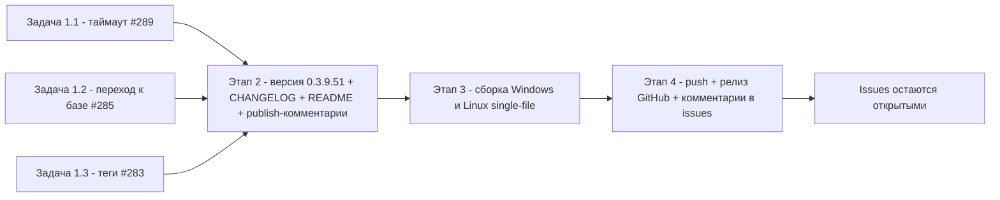

# PLAN — 0.3.9.51 «Управление конфигурациями 1С»

План работ по issues **#289, #285, #283** (требуют исправлений по критерию
«нет комментариев ИЛИ последний комментарий не от sivatorov») для репозитория
[`sivatorov/ConfigurationManagement`](https://github.com/sivatorov/ConfigurationManagement).

- Локальная копия: `f:\Yandex.Disk\h\Configuration_Management`.
- Текущая версия: **0.3.9.50** (четыре поля в `Configuration Management/Configuration Management.csproj`,
  верхняя запись `CHANGELOG.md` [0.3.9.50] от 2026-09-24).
- Режим: Архитектор (только планирование). Исправления выполняются **отдельными задачами**
  в режиме `code` (одно исправление = одна задача = один issue). Issues не закрываются,
  после исправления — только комментарий «что исправлено и в какой версии».
- Правило: после каждого изменения версия увеличивается, изменения описываются в CHANGELOG и README.

---

## 0. Контекст: где живёт код (результаты разведки)

### 0.1 #289 — таймаут проверки доступности (жёсткие 8 секунд)

| Что | Где |
|-----|-----|
| Жёсткий таймаут `8000` в проверке доступности | [`MainViewModel.Tools.cs:1058`](Configuration%20Management/ViewModels/MainViewModel.Tools.cs:1058) — `IsBaseAvailable(Infobase)` (метод **static**, вызывается из `RunAvailabilityCheckAsync` → `Parallel.ForEach`) |
| Общий для обеих платформ `CheckAvailability` / `RunAvailabilityCheckAsync` / `IsBaseAvailable` | [`MainViewModel.Tools.cs:967-1072`](Configuration%20Management/ViewModels/MainViewModel.Tools.cs:967) (общий файл, не под `#if`) |
| Avalonia-дубль `CheckAvailability` / `RunAvailabilityCheckAsync` | [`MainViewModel.Avalonia.Tools.cs:688-759`](Configuration%20Management/ViewModels/MainViewModel.Avalonia.Tools.cs:688) — вызывает тот же общий `IsBaseAvailable` |
| Уже существующая настройка таймаута COM | [`AppSettings.cs:147`](Configuration%20Management/Models/AppSettings.cs:147) — `ComDetectTimeoutMs`, по умолчанию **30000 мс** |
| Свойство `ComDetectTimeoutMs` (WPF) | [`MainViewModel.Commands.cs:1059`](Configuration%20Management/ViewModels/MainViewModel.Commands.cs:1059) |
| Свойство `ComDetectTimeoutMs` (Avalonia) | [`MainViewModel.Avalonia.cs:114`](Configuration%20Management/ViewModels/MainViewModel.Avalonia.cs:114) |
| UI настройки (окно «Настройки», поле «Таймаут определения свойств конфигурации») | [`SettingsWindow.xaml.cs:91`](Configuration%20Management/Views/SettingsWindow.xaml.cs:91), [`SettingsWindow.Avalonia.cs:564-604`](Configuration%20Management/Views/SettingsWindow.Avalonia.cs:564) |
| Резолвер таймаута для чтения свойств конфигурации (образец подхода) | [`ConfigurationInfoService.cs:172-189`](Configuration%20Management/Services/ConfigurationInfoService.cs:172) — `ResolveTimeoutMs` (issue #174) |
| Тексты с упоминанием «8 секунд» (обновить!) | Локализации: [`ru.json:172`](Configuration%20Management/Localization/Languages/ru.json:172) (`Main.CheckAvailabilityTooltip`), [`en.json:172`](Configuration%20Management/Localization/Languages/en.json:172); [`README.md:72,81`](README.md:72) |
| Шаблон комментария к issue | [`publish/comment-289-0.3.9.47.md`](publish/comment-289-0.3.9.47.md) |

**Вывод:** отдельная новая настройка не нужна — переиспользуем существующий
`ComDetectTimeoutMs` (уже есть в настройках и в UI окна настроек). Нужно лишь
убрать жёсткий `8000` из пути «Проверить доступность».

### 0.2 #285 — «Найти в списке»: переход к базе не доводит до строки

| Что | Где |
|-----|-----|
| WPF: `ExecuteFindInList` | [`MainViewModel.Commands.cs:1277-1300`](Configuration%20Management/ViewModels/MainViewModel.Commands.cs:1277): `IsListModeAll` → сброс поиска/тегов → `ExpandPathTo` → `RebuildGroupTree()` → `SelectedInfobase = ib` |
| WPF: раскрытие групп-предков | [`MainViewModel.Commands.cs:1302-1322`](Configuration%20Management/ViewModels/MainViewModel.Commands.cs:1302) — `ExpandPathTo` |
| WPF: восстановление выделения/прокрутки после пересборки | [`MainWindow.Tree.cs:234-333`](Configuration%20Management/Views/MainWindow.Tree.cs:234) — `RevealAndSelectAfterRebuild`. **Ключевое подозрение:** строки 298-300 — если `FindTreeViewItemForData(target)` вернул `null` (цель за пределами реализованного диапазона виртуализации), метод тихо выходит (`return`) БЕЗ прокрутки к цели. Также строки 273-274: группы, свёрнутые пользователем, НЕ раскрываются (`continue`), а из-за пересборки дерева цель может остаться скрытой |
| WPF: событие `TreeRebuilt` → `RestoreTreeKeyboardFocus` | [`MainWindow.xaml.cs:181-182`](Configuration%20Management/Views/MainWindow.xaml.cs:181), [`MainWindow.Tree.cs:211-224`](Configuration%20Management/Views/MainWindow.Tree.cs:211) |
| WPF: события пересборки | [`MainViewModel.Tools.cs:62-99`](Configuration%20Management/ViewModels/MainViewModel.Tools.cs:62) — `TreeRebuilding`/`TreeRebuilt` |
| Avalonia: `ExecuteFindInList` | [`MainViewModel.Avalonia.Commands.cs:166-187`](Configuration%20Management/ViewModels/MainViewModel.Avalonia.Commands.cs:166): `RebuildTree()` → `SelectedInfobase = ib` → `RevealFindInListRequested?.Invoke()` |
| Avalonia: событие и подписка окна | [`MainViewModel.Avalonia.cs:727`](Configuration%20Management/ViewModels/MainViewModel.Avalonia.cs:727), [`MainWindow.Avalonia.cs:227-229`](Configuration%20Management/Views/MainWindow.Avalonia.cs:227) |
| Avalonia: `RevealFindInList` | [`MainWindow.Avalonia.Scroll.cs:164-181`](Configuration%20Management/Views/MainWindow.Avalonia.Scroll.cs:164) — сбрасывает `_treeScrollOffset = null` и повторно ставит `SelectedItem`. **Ключевое подозрение:** если `RestoreTreeSelection` (Post Background, [`MainWindow.Avalonia.Scroll.cs:116-154`](Configuration%20Management/Views/MainWindow.Avalonia.Scroll.cs:116)) уже поставил `SelectedItem = target` до выполнения `RevealFindInList`, то блок `if (!ReferenceEquals(_tree.SelectedItem, target))` в `RevealFindInList` не срабатывает — строка не доводится до видимой области явно (надежда только на `AutoScrollToSelectedItem`, который мог не отработать из-за виртуализации/нераскрытой группы) |
| Тесты #285 (чистая логика) | [`EtapHotkeysFavoritesTests.cs:187-228`](ConfigurationManagement.Tests/EtapHotkeysFavoritesTests.cs:187) |
| Шаблоны комментариев | [`publish/comment-285-0.3.9.45.md`](publish/comment-285-0.3.9.45.md), [`publish/comment-285-0.3.9.43.md`](publish/comment-285-0.3.9.43.md) |

**Гипотеза регрессии:** симптом «раскрытие списка происходит, а переход к самой базе —
нет» совпадает с поведением `RevealAndSelectAfterRebuild` (WPF) и `RevealFindInList`
(Avalonia) для цели, чей контейнер не материализован (далеко за вьюпортом или внутри
группы, которая после пересборки снова считается свёрнутой). В 0.3.9.45 это чинилось
прицельно, но правки #287 (0.3.9.50, контекстное меню) или порядок событий могли
сломать/не покрыть сценарий «база в свёрнутой группе и далеко».

### 0.3 #283 — теги: убрать список с панели «Теги», добавить выбор в правке тегов в строке

| Что | Где |
|-----|-----|
| WPF XAML: раскрывающийся список на панели «Теги» (НУЖНО УБРАТЬ) | [`MainWindow.xaml:426-435`](Configuration%20Management/Views/MainWindow.xaml:426) — `ComboBox x:Name="TagFilterCombo"` + `OnTagFilterCombo_SelectionChanged` |
| WPF: обработчик комбобокса панели (УБРАТЬ) | [`MainWindow.Tags.cs:150-165`](Configuration%20Management/Views/MainWindow.Tags.cs:150) — `OnTagFilterCombo_SelectionChanged` |
| WPF XAML: поле правки тега в строке базы (ЗАМЕНИТЬ TextBox → ComboBox IsEditable) | [`MainWindow.xaml:1784-1794`](Configuration%20Management/Views/MainWindow.xaml:1784) — `TextBox x:Name="InlineTagBox"`; кнопка «+ тег» рядом: [`MainWindow.xaml:1771-1783`](Configuration%20Management/Views/MainWindow.xaml:1771) |
| WPF: обработчики inline-поля (`KeyDown`/`LostFocus`, `CommitInlineTag`, `CancelInlineTag`, `HideInlineTagBox`, `OnAddTagInline_Click`) | [`MainWindow.Tags.cs:33-148`](Configuration%20Management/Views/MainWindow.Tags.cs:33) — адаптировать под ComboBox |
| Avalonia: комбобокс панели (УБРАТЬ) | [`MainWindow.Avalonia.Tags.cs:331-354`](Configuration%20Management/Views/MainWindow.Avalonia.Tags.cs:331) (создание), строка 358 (добавление в `rows`), строка 412 (`ItemsSource`), [`MainWindow.Avalonia.cs:103-104`](Configuration%20Management/Views/MainWindow.Avalonia.cs:103) (поле `_tagFilterCombo`), [`MainWindow.Avalonia.Tags.cs:380`](Configuration%20Management/Views/MainWindow.Avalonia.Tags.cs:380) (проверка null в `RefreshTagFilterPanel`) |
| Avalonia: inline-поле в строке (ЗАМЕНИТЬ TextBox → ComboBox IsEditable) | [`MainWindow.Avalonia.Tags.cs:193-282`](Configuration%20Management/Views/MainWindow.Avalonia.Tags.cs:193) — `BuildAddTagButton`: `input = new TextBox` → ComboBox с `ItemsSource` из `AvailableTags`; `ShowEditor` должен перечитывать список |
| Источник списка существующих тегов | WPF/Avalonia общее: [`MainViewModel.Display.cs:186`](Configuration%20Management/ViewModels/MainViewModel.Display.cs:186) — `AvailableTags => Infobases.SelectMany(...)`, обновляется через `OnPropertyChanged(nameof(AvailableTags))` ([`MainViewModel.Display.cs:232`](Configuration%20Management/ViewModels/MainViewModel.Display.cs:232), [`MainViewModel.Tools.cs:1623`](Configuration%20Management/ViewModels/MainViewModel.Tools.cs:1623)) |
| Образец Editable-ComboBox с автодополнением в окне свойств базы | [`ConnectionSettingsWindow.xaml:276-277`](Configuration%20Management/Views/ConnectionSettingsWindow.xaml:276) — `TagInputBox` (`IsEditable`, `IsTextSearchEnabled=False`, `StaysOpenOnEdit=True`) |
| Ключ локализации `Main.TagFilterPick` (удалить/оставить) | [`ru.json:182`](Configuration%20Management/Localization/Languages/ru.json:182), [`en.json:182`](Configuration%20Management/Localization/Languages/en.json:182) |
| Шаблон комментария | [`publish/comment-283-0.3.9.46.md`](publish/comment-283-0.3.9.46.md) |

**Вывод:** список с панели фильтров удаляем полностью (WPF XAML + обработчик, Avalonia
поле/построение/ItemsSource). Вместо TextBox в строке базы — Editable ComboBox с
`ItemsSource=AvailableTags`, свободный ввод сохраняется (можно добавить новый тег),
Enter/Esc/LostFocus поведение переносится без изменений.

---

## 1. Этап 1 — исправления кода (3 отдельных задачи в режиме code)

> Каждая задача = один issue = один коммит. После каждого коммита — комментарий в issue
> («Исправлено в версии …»). Версия поднимается ОДИН раз (в финальной задаче — см. этап 2);
> вариант «версия в каждой задаче» потребовал бы трёх промежуточных версий и трёх релизов,
> что противоречит контексту «версия 0.3.9.51 после пакета исправлений». **Решение по версии
> выносится в этап 2** (см. п. 2.1), задачи этапа 1 нумерацию не трогают.

### Задача 1.1 — #289: таймаут проверки доступности из настроек

**Файлы:**
- `Configuration Management/ViewModels/MainViewModel.Tools.cs` — `IsBaseAvailable` (1057-1058), `RunAvailabilityCheckAsync` (995-1037)
- `Configuration Management/ViewModels/MainViewModel.Avalonia.Tools.cs` — только если потребуется (вызывает общий `IsBaseAvailable`, отдельной правки обычно не нужно)
- `Configuration Management/Localization/Languages/ru.json` и `en.json` — строка `Main.CheckAvailabilityTooltip` (убрать «до 8 с на базу», написать «таймаут из настроек»)
- `README.md` — раздел «Проверка доступности баз» (строки 72, 81)

**Подход:**
1. `IsBaseAvailable` сделать instance-методом (убрать `static`) и читать таймаут из
   существующего свойства `ComDetectTimeoutMs` (есть на обеих платформах):
   `connector.ReadConfigurationInfo(ib, timeoutMs: ComDetectTimeoutMs) is not null`.
2. Минимум-граница уже гарантирована геттерами `ComDetectTimeoutMs` (`Math.Max(1000, …)`),
   отдельный `ResolveTimeoutMs` не нужен, но можно продублировать защиту `Math.Max(1000, ComDetectTimeoutMs)`
   для надёжности (аналогично `ConfigurationInfoService.ResolveTimeoutMs`, issue #174).
3. Проверить, что `IsBaseAvailable` больше нигде не вызывается как static (поиск
   `IsBaseAvailable(`), и обновить вызов в `RunAvailabilityCheckAsync` (оба файла —
   WPF и Avalonia дубли этого метода).
4. Обновить тексты: tooltip кнопки (локализация), README (строки 72, 81), комментарий
   в CHANGELOG/comment.

**Риски:**
- Изменение сигнатуры `IsBaseAvailable` — проверить все вызовы (тесты/код).
- Таймаут по умолчанию 30 с вместо 8 с: при большом числе клиент-серверных баз проверка
  станет дольше. Это ожидаемо (пожелание 7OH); параллелизм 4 сохраняет ограничение.
- Avalonia: для Linux COM-коннектор недоступен — ветка клиент-сервер на Linux не меняется.

**Как проверить:**
- Windows: Настройки → «Таймаут определения свойств конфигурации» = 20000 мс →
  «Проверить доступность всех баз» → у недоступной КС-базы результат появляется не раньше
  ~20 с (или успевает подключиться за 20 с).
- Убедиться, что tooltip кнопки больше не обещает «8 секунд».
- Linux/Avalonia: собрать и убедиться, что проверка файловых/веб-баз работает как раньше.

### Задача 1.2 — #285: доводить переход до строки базы («Найти в списке»)

**Файлы:**
- WPF: `Configuration Management/Views/MainWindow.Tree.cs` (`RevealAndSelectAfterRebuild`, 234-333; возможно `QueueScrollSelectedIntoView`/`DeferredScrollSelectedIntoView`, 344-367; `ScrollSelectedIntoView`, 373+)
- WPF: `Configuration Management/Views/MainWindow.xaml.cs` (подписка на `TreeRebuilt`, 181-182 — при необходимости)
- Avalonia: `Configuration Management/Views/MainWindow.Avalonia.Scroll.cs` (`RevealFindInList`, 164-181; `RestoreTreeSelection`, 116-154)
- Avalonia: `Configuration Management/ViewModels/MainViewModel.Avalonia.Commands.cs` (`ExecuteFindInList`, 166-187) — при необходимости
- Тесты: `ConfigurationManagement.Tests/EtapHotkeysFavoritesTests.cs`

**Диагностика (выполнить первой в задаче):**
1. Воспроизвести на обеих платформах: база в свёрнутой группе глубоко в списке →
   Ctrl+T из «Избранного»/«Закреплённых» → фиксировать: переход вкладки? раскрытие групп?
   выделение? прокрутка? (по шагам).
2. WPF: проверить, что при цели за пределами реализованного диапазона
   `FindTreeViewItemForData(target)` возвращает `null` и `RevealAndSelectAfterRebuild`
   выходит без прокрутки (строки 298-300) — поставить временный лог или отладить.
3. Avalonia: проверить порядок `RestoreTreeSelection` (Post Background) → `RevealFindInList`
   (Post Background): совпал ли уже `SelectedItem` к моменту `RevealFindInList`, и
   отработал ли `AutoScrollToSelectedItem`.

**Подход к исправлению (WPF):**
- В `RevealAndSelectAfterRebuild`, если контейнер цели не найден первым проходом
  (`item is null`), НЕ выходить молча, а запланировать «добирающий» проход на
  `DispatcherPriority.ApplicationIdle`: повторить `MainTree.UpdateLayout()`,
  `FindTreeViewItemForData(target)`, при успехе — `ApplySelection` + `item.BringIntoView()`
  (или `ScrollSelectedIntoView(item)`), при неудаче — выйти.
- Для цели внутри свёрнутой пользователем группы: в пути именно «Найти в списке»
  раскрытие уже делает `ExpandPathTo` в `ExecuteFindInList` (снимает ключи свёрнутых
  групп). Убедиться, что после `RebuildGroupTree()` состояние не восстанавливается
  обратно (проверить, что `_collapsedGroups` очищен до пересборки — сейчас снятие ключа
  делается ДО `RebuildGroupTree`, это корректно). Если выяснится, что группа снова
  свёрнута — снять ключи ПОВТОРНО после пересборки (в `ExecuteFindInList` после
  `RebuildGroupTree()` вызвать повторный `ExpandPathTo(ib)` перед `SelectedInfobase = ib`).
- Опционально: в `ExecuteFindInList` после `RebuildGroupTree()` дополнительно вызвать
  `QueueScrollSelectedIntoView`/прямую прокрутку к цели, чтобы не зависеть от одного прохода.

**Подход к исправлению (Avalonia):**
- В `RevealFindInList` после установки `SelectedItem` явно доводить строку до видимой
  области: искать контейнер через `_tree.ContainerFromItem(target)` и вызывать
  `BringIntoView()`; если контейнер ещё не создан — повторять отложенно (второй
  `Dispatcher.UIThread.Post` на `DispatcherPriority.Background`/`ApplicationIdle` или
  `DispatcherTimer` на 1 кадр), с ограничением количества попыток (например, 3).
- Убедиться, что `AutoScrollToSelectedItem` у дерева включён, либо вместо него использовать
  явную прокрутку (надёжнее для целей далеко за вьюпортом).
- Не ломать существующий кейс #252 (возврат позиции после «Нет») — `_treeScrollOffset = null`
  в `RevealFindInList` оставить.

**Риски:**
- «Добирающий» проход может «прыгнуть» мимо цели при Recycling-виртуализации (WPF):
  захват по данным (`DataContext`/ссылке `Infobase`), а не по контейнеру; защита
  `try/catch` и отсечка попыток.
- Регрессия #252/#255 (прокрутка «прыгает» после правки свойств, листание клавишами):
  изменения должны затрагивать только путь `RevealFindInList`/недостижимую цель, а не
  штатное восстановление после пересборки.
- Avalonia: повторные Post могут срабатывать до материализации контейнера — число попыток
  ограничить.

**Как проверить:**
- Сценарий регрессии (обе платформы): база в «Избранном» → Ctrl+T → вкладка «Все базы»,
  группа раскрыта, строка базы ВЫДЕЛЕНА и В ВИДИМОЙ ОБЛАСТИ (прокрутка довела).
- Граничный случай: база в свёрнутой группе, группа глубоко в конце длинного списка
  (500+ баз) — Ctrl+T должен раскрыть цепочку и прокрутить к строке.
- Юнит-тесты: `dotnet test` (EtapHotkeysFavoritesTests) зелёные; при желании добавить
  тест чистой логики (например, что `ExpandPathTo` снимает ключи свёрнутых групп —
  если это можно покрыть без UI).

### Задача 1.3 — #283: теги — убрать список с панели «Теги», добавить выбор в правку тегов в строке

**Файлы:**
- WPF: `Configuration Management/Views/MainWindow.xaml` (удалить `TagFilterCombo` 426-435; заменить `InlineTagBox` 1784-1794 на `ComboBox IsEditable`)
- WPF: `Configuration Management/Views/MainWindow.Tags.cs` (удалить `OnTagFilterCombo_SelectionChanged` 150-165; адаптировать inline-обработчики под ComboBox: `OnAddTagInline_Click`, `CommitInlineTag`, `CancelInlineTag`, `HideInlineTagBox`, `OnInlineTagBox_KeyDown/LostFocus`)
- Avalonia: `Configuration Management/Views/MainWindow.Avalonia.Tags.cs` (удалить комбобокс панели 331-354, 358, 412; заменить `input TextBox` в `BuildAddTagButton` 193-282 на Editable ComboBox; `ShowEditor` — перечитывать `ItemsSource`)
- Avalonia: `Configuration Management/Views/MainWindow.Avalonia.cs` (удалить поле `_tagFilterCombo` 103-104 и его использование в `RefreshTagFilterPanel`)
- Локализация: `ru.json`/`en.json` — решить судьбу `Main.TagFilterPick` (удалить как неиспользуемый; либо оставить, если используется где-то ещё — проверить поиском)
- README.md — раздел возможностей про теги

**Подход (WPF):**
1. Удалить блок `<ComboBox x:Name="TagFilterCombo" …/>` из панели «Теги» и обработчик
   `OnTagFilterCombo_SelectionChanged` (возврат к состоянию «только чипы»).
2. `InlineTagBox`: `TextBox` → `ComboBox` с `IsEditable="True"`, `IsTextSearchEnabled="False"`
   (иначе Enter при редактировании ведёт себя иначе), `StaysOpenOnEdit="True"`,
   `ItemsSource="{Binding AvailableTags}"` (DataContext строки базы — но привязка к
   ViewModel окна: `RelativeSource AncestorType=Window` + `DataContext.AvailableTags`,
   как у соседних команд), те же размеры/тема (`ModernComboBox`), `KeyDown`/`LostFocus`
   обработчики сохранить.
3. В `MainWindow.Tags.cs` обновить сигнатуры: `CommitInlineTag(ComboBox?)`,
   `CancelInlineTag(ComboBox?)`, `HideInlineTagBox(ComboBox)`; текст берётся из
   `combo.Text` (свободный ввод), `combo.SelectedItem` не обязателен. `OnAddTagInline_Click`
   — поиск `ComboBox` вместо `TextBox` (общий `FindVisualChild<ComboBox>`), фокус + `SelectAll`.
4. В `ShowEditor`-эквиваленте WPF (клик «+ тег») список `AvailableTags` уже свежий через
   binding — отдельное обновление не требуется; при сомнении вызвать
   `_viewModel.RefreshAvailableTags()`.

**Подход (Avalonia):**
1. Удалить `_tagFilterCombo` (поле, создание, добавление в `rows`, обновление `ItemsSource`
   в `RefreshTagFilterPanel`), вернуть панель к «заголовок + чипы».
2. В `BuildAddTagButton`: `input` → `ComboBox` с `IsEditable`/`PlaceholderText`,
   `ItemsSource` = `_vm.AvailableTags.ToList()` (перечитывать в `ShowEditor` — новые теги
   видны сразу, как в окне свойств), `Text` для свободного ввода; обработчики
   `KeyDown` (Enter/Esc), `LostFocus` сохранить, `IsDropDownOpen = true` при показе
   редактора (чтобы список был виден сразу).
3. `Commit()` использует `input.Text` (без обрезания до SelectedItem), пустая строка — отмена.

**Риски:**
- Editable ComboBox в WPF перехватывает Enter/стрелки: `IsTextSearchEnabled=False` и
  ручная обработка `KeyDown` (Enter) обязательны; проверить, что добавление нового тега
  (свободный текст, которого нет в списке) работает.
- Потеря фокуса: WPF `LostFocus` + `Dispatcher.BeginInvoke(Input)` уже откладывает
  коммит — сохранить; Avalonia — `Dispatcher.UIThread.Post`.
- Удаление `Main.TagFilterPick`: проверить поиском все использования, чтобы не получить
  MissingResource.

**Как проверить:**
- Панель «Теги» главного окна: нет выпадающего списка, только чипы (и кнопка сброса).
- Строка базы: кнопка «+ тег» → раскрывается поле ввода с выпадающим списком
  существующих тегов; выбор тега из списка добавляет его; ввод нового текста + Enter
  тоже добавляет; Esc отменяет; потеря фокуса сохраняет введённое.
- Новый тег сразу виден и в чипах панели, и в списке поля строки (после сохранения).
- Обе платформы: Windows/WPF и Linux/Avalonia.

---

## 2. Этап 2 — версия 0.3.9.51, CHANGELOG, README, комментарии к issues

### 2.1 Предварительная проверка
- Перед поднятием версии проверить, что **0.3.9.50 уже выложен в релизах GitHub**:
  `gh release view 0.3.9.50` (или страница
  https://github.com/sivatorov/ConfigurationManagement/releases).
- Если 0.3.9.50 ещё не выпущен — остановиться и согласовать нумерацию с пользователем
  (варианты: выпустить 0.3.9.50 как есть, затем 0.3.9.51; либо «дожать» в 0.3.9.50).
- Локальная ветка `main`, HEAD чистый перед началом.

### 2.2 Файлы
- `Configuration Management/Configuration Management.csproj` — четыре поля:
  `<Version>`, `<AssemblyVersion>`, `<FileVersion>`, `<InformationalVersion>` = **0.3.9.51**
  (строки 62-65).
- `CHANGELOG.md` — новая запись сверху:
  `## [0.3.9.51] — 2026-09-25`, разделы в формате существующих записей:
  - «Исправлено»: #289 (таймаут из настроек вместо 8 с), #285 (переход к строке базы),
    #283 (список убран с панели «Теги», выбор добавлен в правку тегов в строке);
  - «Версия»: блок про четыре поля csproj (как в записях 0.3.9.49/0.3.9.50).
  - Ссылки на файлы в формате `[Файл](Configuration%20Management/...)`.
- `README.md`:
  - раздел «Проверка доступности баз» (строки 54-83): таймаут «до 8 секунд» →
    «задаётся настройкой „Таймаут определения свойств конфигурации" (по умолчанию 30 с)»;
  - раздел «Возможности» (строка 12): при необходимости упомянуть «Найти в списке (Ctrl+T)»
    и правку тегов прямо в строке базы с выбором из существующих.
- Новые файлы в `publish/` (по образцам существующих):
  - `publish/comment-289-0.3.9.51.md` — «Исправлено в версии 0.3.9.51: таймаут проверки
    доступности клиент-серверных баз берётся из настроек („Таймаут определения свойств
    конфигурации", по умолчанию 30 с) вместо жёстких 8 секунд. Увеличьте значение в
    Настройки, если ваши базы подключаются дольше 30 с.» + как проверить;
  - `publish/comment-285-0.3.9.51.md` — «Исправлено в версии 0.3.9.51: после „Найти в
    списке" (Ctrl+T) строка базы теперь гарантированно выделяется и прокручивается в
    видимую область, в т.ч. для баз в свёрнутых группах в конце длинного списка» + как проверить;
  - `publish/comment-283-0.3.9.51.md` — «Исправлено в версии 0.3.9.51: выпадающий список
    убран с панели „Теги" (там снова только чипы), а выбор из существующих тегов добавлен
    в поле правки тегов в строке базы (кнопка „+ тег")» + как проверить;
  - `publish/release_body_0.3.9.51.md` — тело релиза по образцу
    `publish/release_body_0.3.9.50.md`: заголовок `## [0.3.9.51] — 2026-09-25`, краткое
    вступление, разделы «Исправлено» по трём issues со ссылками, «Файлы для установки».
- Коммит: `0.3.9.51: таймаут проверки доступности из настроек (#289), переход к базе (#285), теги (#283)`.

### 2.3 Комментарии в issues
- После коммита (и до/после публикации релиза — по решению пользователя) опубликовать:
  `gh issue comment 289 --body-file "publish/comment-289-0.3.9.51.md"` (аналогично 285, 283).
- **Issues не закрывать.**

---

## 3. Этап 3 — сборка single-file (Windows и Linux)

### 3.1 Windows
```
cd "Configuration Management"
./build-windows-single-file.ps1
```
- Результат: `Configuration Management/dist/win-x64/ConfigurationManagement.exe`
  (self-contained single-file, только exe).
- Требования: Windows + .NET SDK 10 (>= 10.0.400).
- Для быстрой проверки синтаксиса: `SKIP_PUBLISH=1`.

### 3.2 Linux
```
cd "Configuration Management"
FORCE_LINUX=1 ./build-linux-single-file.sh   # кросс-сборка из Windows
# либо на Linux: ./build-linux-single-file.sh
```
- Результат: `Configuration Management/dist/linux-x64/ConfigurationManagement`
  (single-file, self-contained, chmod +x ставится скриптом).
- На Windows возможна кросс-сборка с `FORCE_LINUX=1` (передаёт `-p:ForceLinux=true`).

### 3.3 Проверка перед публикацией
- `dotnet build` обеих конфигураций и `dotnet test` (папка `ConfigurationManagement.Tests`) —
  зелёные.
- Запустить собранные exe/бинарник, проверить: заголовок окна показывает 0.3.9.51,
  проверку доступности, Ctrl+T, теги.

---

## 4. Этап 4 — публикация и релиз GitHub

Порядок команд (ветка `main`, репозиторий `sivatorov/ConfigurationManagement`):

1. Статус и диф:
   ```
   git status
   git log --oneline -5
   ```
2. Коммиты уже сделаны в этапах 1-2 (один коммит на issue + коммит версии/документов).
   Если ещё не коммитили — сделать по одному на задачу.
3. Push:
   ```
   git push origin main
   ```
4. Создать тег и релиз через `gh` (тело из `publish/release_body_0.3.9.51.md`):
   ```
   gh release create 0.3.9.51 \
     "Configuration Management/dist/win-x64/ConfigurationManagement.exe" \
     "Configuration Management/dist/linux-x64/ConfigurationManagement" \
     --title "0.3.9.51" \
     --notes-file "publish/release_body_0.3.9.51.md"
   ```
   (тег `0.3.9.51` создастся автоматически из названия релиза; если политика проекта —
   сначала `git tag 0.3.9.51 && git push origin 0.3.9.51`, то сделать явно.)
5. Проверить релиз: `gh release view 0.3.9.51`.
6. Комментарии в issues (если не публиковались на этапе 2):
   ```
   gh issue comment 289 --body-file "publish/comment-289-0.3.9.51.md"
   gh issue comment 285 --body-file "publish/comment-285-0.3.9.51.md"
   gh issue comment 283 --body-file "publish/comment-283-0.3.9.51.md"
   ```
7. Issues **не закрывать**; в комментарии указать «Исправлено в версии 0.3.9.51».

Примечание: артефакты `dist/` в git не коммитятся (сборка воспроизводима скриптами),
в релиз бинарники прикладываются как assets.

---

## 5. Порядок выполнения и зависимости



- Задачи 1.1-1.3 независимы и могут выполняться в любом порядке (разные файлы;
  единственное пересечение — локализации и README, решается на этапе 2).
- Этап 2 зависит от этапа 1 (нужен итоговый список изменений для CHANGELOG/комментариев).
- Этап 3 зависит от этапа 2 (версия должна быть поднята до сборки).
- Этап 4 зависит от этапа 3 (артефакты).

---

## 6. Чек-лист результата

- [ ] #289: таймаут проверки доступности из `ComDetectTimeoutMs`, тексты без «8 секунд»
- [ ] #285: Ctrl+T выделяет и прокручивает строку базы на обеих платформах (в т.ч. свёрнутая группа, длинный список)
- [ ] #283: на панели «Теги» только чипы; в правке тегов в строке — выпадающий список существующих тегов + свободный ввод
- [ ] Версия 0.3.9.51 во всех четырёх полях csproj
- [ ] CHANGELOG.md — запись [0.3.9.51]
- [ ] README.md — раздел «Проверка доступности баз» и возможности обновлены
- [ ] `publish/comment-{289,285,283}-0.3.9.51.md` и `publish/release_body_0.3.9.51.md` созданы
- [ ] dotnet build + dotnet test зелёные; обе сборки single-file прошли
- [ ] Релиз 0.3.9.51 создан с assets; комментарии в issues опубликованы; issues НЕ закрыты