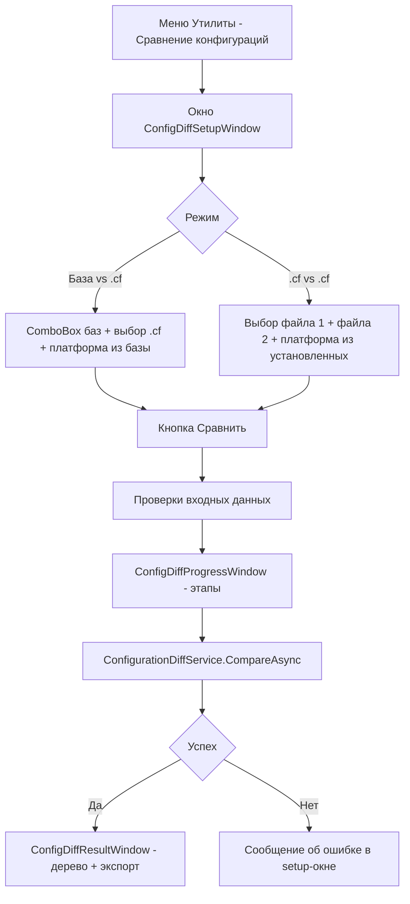

# PLAN — 0.3.9.99 — функция №9 «Сравнение конфигураций (Config-Diff)»

Репозиторий [`sivatorov/ConfigurationManagement`](https://github.com/sivatorov/ConfigurationManagement),
локальная копия `f:\Yandex.Disk\h\Configuration_Management`, ветка `main`, HEAD `9ad5830` (0.3.9.98).

Режим: Архитектор (план) → задача-исполнитель в режиме **code**. Одна фича = одна задача = одна версия = один коммит.
Issue не создаётся (новая возможность). PLAN-файл остаётся untracked; CHANGELOG/README коммитятся.

---

## 1. Сводка

**Что делаем:** команда «Сравнение конфигураций…» в меню «Утилиты» — сравнение конфигурации выбранной базы
с эталонным файлом `.cf` ИЛИ двух файлов `.cf` между собой; результат — отчёт об отличиях по объектам метаданных
(добавленные / изменённые / удалённые, сгруппированные по типам), без открытия графического конфигуратора.
Экспорт отчёта в CSV и TXT. Версия **0.3.9.99**.

**Механизм (выбор из вариантов ТЗ):** вариант **(a)** — универсальный конвейер «выгрузка → файлы XML»:
- каждый `.cf` распаковывается в **временную файловую ИБ** (один запуск 1cv8: `CREATEINFOBASE File=... /UseTemplate"<file.cf>"` — уже реализовано в `OneCLauncher.CreateInfoBase`, переиспользуем);
- из временной ИБ и из реальной базы конфигурация выгружается ключом **`/DumpConfigToFiles <dir>`** в каноническое дерево XML-файлов;
- **чистое сравнение двух деревьев** (без 1С): объекты метаданных по относительным путям `Configuration/<Тип>/<Имя>`,
  содержимое — SHA-256; объекты делятся на добавленные / изменённые / удалённые / без изменений;
- вариант (b) отвергнут: он не покрывает режим «.cf ↔ .cf»; вариант (c) — графический конфигуратор — отвергнут (нет интерактива, цель — автономный отчёт).

Оба режима («База ↔ .cf» и «.cf ↔ .cf») идут через один и тот же pipeline — только «левая» часть может быть
реальной базой (тогда шаг создания временной ИБ для неё не нужен). На Linux работают те же ключи 1cv8.

| Параметр | Значение |
|---|---|
| Версия | 0.3.9.99 (4 поля csproj, строки 62–65) |
| Меню | «Утилиты» → «Сравнение конфигураций…» (обе платформы) |
| Режимы | «База ↔ файл .cf», «Файл .cf ↔ файл .cf» |
| Отчёт | Окно: дерево «Тип метаданных → объект» + сводка; экспорт CSV (через `CsvExporter`) и TXT |
| Прогресс | Модальное окно с индетерминированным баром и этапами (по образцу `DetectConfigProgressWindow`) |
| Тесты | Чистая логика (обход выгрузки, хэши, сравнение деревьев, локализация типов, CSV/TXT) — без реальных 1С-операций |
| Коммит | `feat: сравнение конфигураций (Config-Diff); 0.3.9.99` |

---

## 2. Ключевые якоря кодовой базы (разведка выполнена)

### 2.1. OneCLauncher / пакетные операции DESIGNER

- [`Services/OneCLauncher.DesignerBatch.cs`](Configuration%20Management/Services/OneCLauncher.DesignerBatch.cs)
  - `enum DesignerBatchOperation` — строки **19–41** (DumpIB, DumpCfg, TestAndRepair, RestoreIB, LoadCfg `/LoadCfg"..."/UpdateDBCfg`, LockIB, UnlockIB, RepositoryUpdate). **Сюда добавить `DumpConfigToFiles`.**
  - `DesignerBatchInfo.OperationLabel` — **85–96** (switch по enum) — добавить ветку для нового значения.
  - `RunDesignerBatch` — **103–221**; сборка `opArg` — **172–191** (ключи вида `/DumpCfg"path"`, проверка `IsSafeCliValue`); создание каталога назначения для DumpIB/DumpCfg — **138–154**; проверка существования входного файла для RestoreIB/LoadCfg — **155–160**.
  - `CompleteDesignerBatch` — **267–306**: успех = exit code 0 + (для DumpIB/DumpCfg) файл создан и непуст — **276–282**. Для DumpConfigToFiles успех = exit 0 + каталог существует и содержит `ConfigDumpInfo.xml`.
  - `IsDesignerBlocked` — **377–399** (блокирует параллельные операции DESIGNER и уже запущенный конфигуратор той же базы — это желаемо: сравнение идёт последовательно).
  - `ReadLogFile` — **309–352**, `TruncateLogTail` — **355–361** (сообщения об ошибках из лога 1С).
- [`Services/OneCLauncher.Linux.DesignerBatch.cs`](Configuration%20Management/Services/OneCLauncher.Linux.DesignerBatch.cs)
  - тот же `enum DesignerBatchOperation` — **20–42**; `OperationLabel` — **66–77**; `RunDesignerBatch` — **81+**; `opArg` — **122–133**; success-проверка — **218–219**. **Правки симметричны Windows-версии.**
- [`Services/OneCLauncher.Arguments.cs`](Configuration%20Management/Services/OneCLauncher.Arguments.cs)
  - `CreateInfoBase` — **229–386**: файловая ИБ `File="..."` (**260–278**), `templatePath` → `/UseTemplate"<файл>"` (**315–331**), `IsSafeCliValue` (**325**), ожидание процесса **5 минут** (`WaitForExit(5 * 60 * 1000)` — **353**), разбор exit code и stderr (**360–372**), `SensitiveDataMasker.MaskDbPassword` (**371, 384**), cleanup созданного каталога при неудаче (**349, 356, 364, 378**). **Это готовый инструмент для временной ИБ из .cf.**
- [`Services/OneCLauncher.Linux.Process.cs`](Configuration%20Management/Services/OneCLauncher.Linux.Process.cs) — Linux-версия `CreateInfoBase` (**375+**), та же сигнатура.
- [`Services/OneCLaunchArgumentParser.cs`](Configuration%20Management/Services/OneCLaunchArgumentParser.cs) — **33–40** список известных ключей (`/RestoreIB`, `/DumpIB`, `/DumpCfg`, `/LoadCfg`, `/CheckConfig`, `/CreateInfobase`…). Не обязательно, но полезно добавить `/DumpConfigToFiles` для распознавания служебного режима процесса.

### 2.2. Сервисы-образцы паттернов

- [`Services/BackupService.cs`](Configuration%20Management/Services/BackupService.cs)
  - `RunAsync` — **30–163** (запуск `RunDesignerBatch` + ожидание через событие `DesignerBatchCompleted`); **самый важный образец** — `WaitForCompletionAsync` — **213–237**: `TaskCompletionSource` + подписка на `DesignerBatchCompleted`, фильтр по `info.Operation` и `info.OutputPath`, таймаут `DefaultTimeout = 60 мин` (**18**). Эту логику перенести в новый сервис сравнения (свой приватный аналог — меньше вторжений).
- [`Services/ConfigUpdateService.cs`](Configuration%20Management/Services/ConfigUpdateService.cs) — **44–53**: тот же паттерн для `LoadCfg`.
- [`Services/CreateInfobaseService.cs`](Configuration%20Management/Services/CreateInfobaseService.cs) — **22–152**: `TryCreate` с `FromTemplate`/`templatePath` (**28–34, 47–53**) — подтверждение, что путь «создать ИБ из .cf» уже обкатан в UI.
- [`Services/CsvExporter.cs`](Configuration%20Management/Services/CsvExporter.cs) — **12–84**: `Escape`, `JoinRow`, `BuildDocument`, `WriteFile` (UTF-8 BOM, «;») — переиспользовать для экспорта отчёта.
- [`Services/PlatformVersionService.cs`](Configuration%20Management/Services/PlatformVersionService.cs) — **33**: `FindInstalledVersions()`; интерфейс [`Services/IPlatformVersionService.cs`](Configuration%20Management/Services/IPlatformVersionService.cs) — **5**. Нужен для селектора платформы в режиме «.cf ↔ .cf» (платформа, которой создаётся временная ИБ).
- [`Services/ComReadHost.cs`](Configuration%20Management/Services/ComReadHost.cs) — только Windows, для diff **не нужен** (это отдельный путь «чтение имени/версии конфигурации»); имя/версию конфигурации можно показать в отчёте опционально через `ConfigurationInfoService`, но не обязательно для v1.

### 2.3. Меню «Утилиты» и команды VM

- WPF: [`Views/MainWindow.xaml`](Configuration%20Management/Views/MainWindow.xaml) — ContextMenu кнопки «Утилиты» **660–740**; блок «Статистика использования» (**730–734**), затем `<Separator/>` (**735**). Новый пункт вставить после 734, перед Separator.
- Avalonia: [`Views/MainWindow.Avalonia.Tree.cs`](Configuration%20Management/Views/MainWindow.Avalonia.Tree.cs) — `BuildUtilitiesMenu()` **1624+**; `MenuAction("Stats.Title", _vm.UsageStatisticsCommand, ...)` — **1705**; затем `MenuSeparator()` — **1707**. Новый пункт — после 1705. Хелперы: `MenuAction(...)`, `MenuIcon(...)`, `ThemedIconAndText(...)` (**1560–1578**).
- WPF-команда (образец): [`ViewModels/MainViewModel.Tools.cs`](Configuration%20Management/ViewModels/MainViewModel.Tools.cs) — `ProcessInspectorCommand`/`ExecuteProcessInspector` **2389–2401**, `UsageStatisticsCommand` **2412–2422** (файл целиком `#if WINDOWS`): свойство `ICommand XxxCommand => _xxxCommand ??= new RelayCommand(_ => ExecuteXxx());` и модальное открытие окна с `Owner = Application.Current.MainWindow`.
- Avalonia-команда (образец): [`ViewModels/MainViewModel.Avalonia.Tools.cs`](Configuration%20Management/ViewModels/MainViewModel.Avalonia.Tools.cs) — **1369–1396**: `window.ShowDialogSync(OwnerWindow())` (файл `#if LINUX`).

### 2.4. Окна прогресса (образец для ConfigDiffProgressWindow)

- [`Views/DetectConfigProgressWindow.cs`](Configuration%20Management/Views/DetectConfigProgressWindow.cs) — **15–56** (WPF, `#if WINDOWS`): модальное окно 380×140, `ProgressBar IsIndeterminate`, `SetStage(string)` потокобезопасно через Dispatcher (**49–55**).
- [`Views/DetectConfigProgressWindow.Avalonia.cs`](Configuration%20Management/Views/DetectConfigProgressWindow.Avalonia.cs) — **18–61** (Linux): наследует `ModalWindowBase`, учёт `Services.LinuxRendering.DisableAnimations` (**34–41**, issue #153), `Dispatcher.UIThread.Post` (**59**).

### 2.5. Проект, локализация, документация

- [`Configuration Management.csproj`](Configuration%20Management/Configuration%20Management.csproj)
  - версии: **62–65** (4 поля);
  - Linux ItemGroup (**193+**): чистые ViewModels подключаются явно `Compile Include` (**284–352**, например `UsageStatisticsViewModel.cs` 351); чистые Services — паттерн `Remove+Include` (**370–389+**, например `CsvExporter` 374–375, `DiskFreeSpaceHelper` 389); окна Avalonia `*.Avalonia.cs` покрываются глобами (см. правила серии);
  - `InternalsVisibleTo` для тестов — **93**;
  - локализация `LogicalName cm_lang_` — **130–131**.
- [`Localization/Languages/ru.json`](Configuration%20Management/Localization/Languages/ru.json) (2091 строка) и [`Localization/Languages/en.json`](Configuration%20Management/Localization/Languages/en.json) (2092 строки): формат `"Ключ": "Значение"`, обращение через `LocalizationManager.T("Ключ")`. Добавить блок `ConfigDiff.*` + `Launcher.OperationDumpConfigToFiles`.
- [`CHANGELOG.md`](CHANGELOG.md) — последняя запись `## [0.3.9.98]` (**12**); новую вставить сверху (после строки 10). Формат — длинный абзац с **ссылками на файлы** (пример записи 0.3.9.98, строки 12–43).
- [`README.md`](README.md) — бейдж версии строка **3** (заменить `0.3.9.98` → `0.3.9.99`); пункт возможностей — после «Статистика использования баз» (**63**), перед «Системные уведомления» (**64**).
- Тесты: [`ConfigurationManagement.Tests/`](ConfigurationManagement.Tests/) — xunit, чистые классы без 1С (образцы: `CsvExporterTests.cs`, `DiskFreeSpaceHelperTests.cs`, `ScheduleCatchUpTests.cs`).

---

## 3. Детальное описание решения

### 3.1. Механизм сравнения и его обоснование

**Выбран вариант (a)** (обоснование — см. сводку). Конвейер:

```
[Источник ЛЕВЫЙ]                          [Источник ПРАВЫЙ]
  .cf-файл                                  .cf-файл
    │ CREATEINFOBASE File="<tmp>\ib"          │ (аналогично)
    │   /UseTemplate"<file.cf>"  (1 запуск)   │
    ▼                                         ▼
  временная файловая ИБ                      временная файловая ИБ
    │ DESIGNER /F <tmp>\ib                    │ DESIGNER /F <tmp>\ib
    │   /DumpConfigToFiles "<tmp>\dumpL>"     │   /DumpConfigToFiles "<tmp>\dumpR>"
    ▼                                         ▼
  каталог XML-выгрузки (dumpL)               каталог XML-выгрузки (dumpR)
    └──► ЧИСТОЕ сравнение деревьев (без 1С): ConfigurationDiffEngine
              • объект = относительный путь "Configuration/<Тип>/<Имя>" (файл .xml или каталог объекта)
              • содержимое = SHA-256 (по файлу или по агрегату файлов каталога)
              • результат: Added / Changed / Removed / Unchanged по типам
```

Для режима «База ↔ .cf» левый источник — **реальная база**: шаг временной ИБ пропускается,
сразу `DESIGNER <connection аргументы базы> /DumpConfigToFiles "<tmp>\dumpL>"`.
Правый `.cf` обрабатывается через временную ИБ как выше.

**Почему `CREATEINFOBASE /UseTemplate`, а не «пустая ИБ + /LoadCfg»:** `/UseTemplate"<file.cf>"` выполняет
создание ИБ и загрузку конфигурации **одним запуском 1cv8** и уже реализован в `OneCLauncher.CreateInfoBase`
(обе платформы, обкатан в окне создания ИБ). Путь «пустая ИБ → `/LoadCfg`» требует лишнего запуска и правки
семантики `LoadCfg` (сейчас он всегда идёт с `/UpdateDBCfg`, что неприемлемо для временной базы).

**Почему не сравнивать .cf напрямую как ZIP:** внутренняя структура `.cf` не документирована и меняется между
версиями платформы; `DumpConfigToFiles` — канонический, стабильный формат, одинаковый для базы и для `.cf`,
и именно он делает возможным единый pipeline «база ↔ файл».

**Новое значение enum** `DesignerBatchOperation.DumpConfigToFiles` в обоих `DesignerBatch`-файлах:
- `opArg`: `/DumpConfigToFiles"<dir>"` (каталог создаётся заранее, как для DumpIB/DumpCfg — строки 138–154 / 97–107);
- `OperationLabel` → ключ `Launcher.OperationDumpConfigToFiles`;
- success-проверка в `CompleteDesignerBatch` (Windows **276–282**, Linux **218–219**): exit code 0 + каталог существует и непуст (наличие `ConfigDumpInfo.xml`).

**Важно про таймаут `CreateInfoBase`:** жёсткий `WaitForExit(5 * 60 * 1000)` (**353**). Для очень больших
конфигураций (сотни МБ .cf) создание временной ИБ может превысить 5 минут. Рекомендуемая малая правка:
вынести таймаут в параметр `int timeoutMs = 5 * 60 * 1000` у `CreateInfoBase` (Windows **229** и Linux **375**)
и вызывать его из нового сервиса с `timeoutMs = 30 * 60 * 1000`. Если исполнитель хочет минимизировать правки —
допустимо оставить 5 минут и задокументировать ограничение в окне; решение на усмотрение исполнителя, но
рекомендуется вынос таймаута (обратно совместимо).

### 3.2. Модель отчёта о различиях

Объект метаданных верхнего уровня идентифицируется парой **(тип, имя)**:
- `TypeDir` — имя каталога первого уровня внутри `Configuration/` выгрузки `DumpConfigToFiles`
  (`Document`, `Catalog`, `ChartOfCharacteristicTypes`, `InformationRegister`, `CommonModule`, `Role`,
  `WebService`, `Extension`…);
- `Name` — имя объекта (файл `<Name>.xml` или каталог `<Name>/` с подфайлами).

Служебные файлы корня выгрузки: `ConfigDumpInfo.xml` — игнорируется; корневой `Configuration.xml` — не является
объектом, но его изменение важно как сигнал «изменилась конфигурация в целом» — выносится **отдельной строкой
в шапке отчёта** (флаг `RootFileChanged`), а не засоряет таблицу объектов. Вложенные объекты (реквизиты, формы,
табличные части) **не выделяются в отдельные строки** в этой версии — они учитываются хэшем родительского объекта
(объект помечается «изменён», если изменился любой его файл). Это соответствует ТЗ (уровень объектов метаданных).

Ключи модели (файл `Models/ConfigurationDiffModel.cs`):
- `enum DiffChangeKind { Added, Changed, Removed, Unchanged }`;
- `sealed record MetadataObject(string TypeDir, string Name, DiffChangeKind Kind, int FileCount, long TotalBytes)`;
- `sealed record ConfigurationDiffResult(string LeftLabel, string RightLabel, IReadOnlyList<MetadataObject> Objects, bool RootFileChanged, TimeSpan Elapsed)`
  + вычисляемая сводка `AddedCount / ChangedCount / RemovedCount / UnchangedCount` (по типам — в VM);
- внутренний `sealed record ConfigurationSnapshot(string RootPath, Dictionary<string,string> ObjectHashes, bool RootFileChanged)`
  (ключ объекта — относительный путь, значение — SHA-256, для каталога — SHA-256 по отсортированному агрегату `relPath|hash`).

**Человекочитаемые имена типов** — класс `Services/MetadataTypeLocalizer.cs`:
- статический словарь «каталог выгрузки → ключ локализации» для всех стандартных каталогов
  (`Document`→`ConfigDiff.Type.Document`, `Catalog`→`ConfigDiff.Type.Catalog`, … полный список ~25 типов ниже);
- неизвестный каталог — возвращать как есть (fallback);
- метод `GetDisplayName(string typeDir, Func<string,string> t)` принимает локализатор колбэком (как
  `DiskFreeSpaceHelper` — резолвер колбэком) — это делает класс тестируемым без LocalizationManager;
- порядок типов в отчёте — фиксированный список (порядок словаря), неизвестные — в конце.

### 3.3. Форматы отчёта и экспорт

1. **Окно результата** (`ConfigDiffResultWindow`): шапка (что с чем сравнивали, время, строка «Конфигурация в целом: изменена/не изменена»), сводка «Добавлено: X · Изменено: Y · Удалено: Z · Без изменений: N», TreeView «Тип метаданных (кол-во) → объекты» с колонками «Имя | Статус | Файлов | Размер». Статусы раскрашены (добавлен — зелёный, изменён — янтарный, удалён — красный).
2. **Экспорт CSV** — кнопка → `SaveFileDialog` → `CsvExporter.WriteFile(path, rows)`; колонки: `Тип;Имя;Статус;Файлов;Размер,байт`. Имя файла по умолчанию `ConfigDiff_ГГГГ-ММ-ДД.csv`.
3. **Экспорт TXT** — кнопка → текстовый отчёт: заголовок, сводка, блочная группировка по типам (по образцу гистограммы статистики — без внешних библиотек).

Формирование строк — чистый класс `Services/ConfigurationDiffReporter.cs` (`BuildCsvRows(result, localizer)`,
`BuildText(result, localizer)`), покрыт тестами.

### 3.4. Рабочий процесс в UI



Детали:
- **Setup-окно** (WPF `ConfigDiffSetupWindow.xaml(.cs)`, Avalonia `ConfigDiffSetupWindow.Avalonia.cs`): две
  RadioButton-группы режимов; в режиме 1 — ComboBox баз (превыбор — текущая выбранная база главного окна) +
  выбор `.cf`; в режиме 2 — два выбора `.cf`; в обоих — строка платформы 1С (режим 1: «из базы» + опционально
  переопределить; режим 2: ComboBox из `PlatformVersionService.FindInstalledVersions()`, по умолчанию
  `Settings.LastFileCreatePlatformVersion`, если есть). Фильтр файлов — `*.cf`.
- **Кнопка «Сравнить»**: валидация (файл существует и `.cf`, база выбрана, платформа выбрана) → открыть
  модальное `ConfigDiffProgressWindow` → `Task.Run(() => service.CompareAsync(...))` с колбэком этапов
  (`IProgress<string>`: «Создание временной базы…», «Выгрузка конфигурации (1/2)…», «Сравнение…») →
  по завершении закрыть прогресс и открыть `ConfigDiffResultWindow` (setup-окно остаётся открытым позади или
  закрывается — на усмотрение исполнителя, рекомендуется закрыть setup после успешного старта сравнения);
  при ошибке — прогресс закрыть, показать сообщение (как в `RepositoryBatchUpdate`: человекочитаемый текст
  ошибки + хвост лога 1С, до 3000 символов — паттерн `TruncateLogTail`).
- **Окно результата** (WPF `ConfigDiffResultWindow.xaml(.cs)`, Avalonia `.Avalonia.cs`): чистый VM
  `ConfigDiffResultViewModel` (узлы: тип → объекты, сводка, команды экспорта через `SaveFileDialog`);
  кнопки «Экспорт CSV…», «Экспорт TXT…», «Закрыть».
- **Команда VM**: `ConfigDiffCommand` в `MainViewModel.Tools.cs` (WPF, **по образцу 2389–2401**) и
  `MainViewModel.Avalonia.Tools.cs` (Avalonia, **по образцу 1369–1396**) — открывает setup-окно модально.
- **Пункт меню**: WPF `MainWindow.xaml` после строки 734 (иконка materialDesign `PackIcon Kind="FileCompare"`
  или `Compare`, цвет #06B6D4); Avalonia `BuildUtilitiesMenu()` после строки 1705
  (`MenuAction("ConfigDiff.Title", _vm.ConfigDiffCommand, null, "IconCompare", "#06B6D4")`).
  Иконку `IconCompare` при возможности добавить в `Themes/Icons.xaml` + `Icons.axaml` (по образцу существующих);
  допустимо переиспользовать существующую (`IconFileExport`/`IconDatabaseExport`) — решение исполнителя.

### 3.5. Временные файлы, очистка, обработка ошибок

- Корневой каталог операции: `Path.Combine(Path.GetTempPath(), "cm_configdiff_" + Guid.NewGuid().ToString("N"))`,
  внутри: `ib` (файловая ИБ для каждого .cf: `ibL`, `ibR`), `dumpL`, `dumpR`, логи `/Out` (генерируются как
  системные `1c_batch_<guid>.log` — так делает `RunDesignerBatch`, удаляет сам).
- **Очистка**: `try/finally` в `ConfigurationDiffService.CompareAsync` — рекурсивное удаление корневого каталога
  в `finally`; при отмене (`CancellationToken`) — тоже. `CreateInfoBase` уже сам чистит только что созданный
  каталог ИБ при неудаче (строки 349/356/364/378) — не конфликтует.
- **Ошибки** (человекочитаемые, через локализацию):
  - 1cv8 не найден → сообщение как у `Launcher.CreateExeNotFound` / `Launcher.ConfiguratorExeNotFound` (берём
    из кода возврата `CreateInfoBase`/`RunDesignerBatch`);
  - битый `.cf` → exit code CREATEINFOBASE ≠ 0 → текст из stderr/лога (маскировка пароля через
    `SensitiveDataMasker` — в `CreateInfoBase` уже есть);
  - занятая база / параллельная операция → `RunDesignerBatch` вернёт false (причина в `IsDesignerBlocked`,
    ключ `Launcher.AnotherOperationRunningFormat` / `Launcher.ConfiguratorForBaseRunning`) — показать как есть;
  - таймаут операции → сообщение по образцу `Backup.Timeout` (новый ключ `ConfigDiff.TimeoutFormat`);
  - база в монопольном режиме / недоступна → лог `/Out` (паттерн `CompleteDesignerBatch.ErrorMessage`).
- Отмена: кнопка «Отмена» в окне прогресса → `CancellationTokenSource.Cancel()` → убить текущий процесс 1cv8
  (как `CreateInfoBase` при таймауте: `process.Kill(true)`)? Процессы запускаются через `RunDesignerBatch`
  (асинхронный, fire-and-forget). Для v1 допустимо: **окно прогресса без кнопки «Отмена»** (как
  `DetectConfigProgressWindow`) — прерывание сравнения = закрытие окна приложения. Это упрощает управление
  процессами и согласуется с существующими паттернами (прогресс-окна 0.3.9.x без отмены).

### 3.6. Требования к платформе 1С

- `DumpConfigToFiles`, `CREATEINFOBASE /UseTemplate` поддерживаются всеми актуальными версиями 8.3.x
  (и 8.2.x); на Linux — те же ключи (1cv8 — консольная утилита).
- Сравнение не требует открытия графического конфигуратора и не модифицирует исходные базы.
- Выгрузка конфигурации из реальной базы не требует монопольного режима, но требует, чтобы база не была
  в монопольном режиме/под блокировкой сеансов — иначе ошибка из лога (см. 3.5).

---

## 4. Декомпозиция

### 4.1. Новые файлы

**Чистые (обе платформы; в Linux ItemGroup — явно):**
| Файл | Назначение |
|---|---|
| `Models/ConfigurationDiffModel.cs` | Записи-модели отчёта (`DiffChangeKind`, `MetadataObject`, `ConfigurationDiffResult`, внутренний `ConfigurationSnapshot`) |
| `Services/ConfigurationDiffEngine.cs` | Чистое сравнение: `BuildSnapshot(dir)` (обход выгрузки, SHA-256, игнор `ConfigDumpInfo.xml`, `RootFileChanged` по корневому `Configuration.xml`), `Compare(left, right) → ConfigurationDiffResult` |
| `Services/MetadataTypeLocalizer.cs` | Словарь «каталог → ключ локализации», `GetDisplayName(typeDir, t)` с fallback |
| `Services/ConfigurationDiffReporter.cs` | Сборка строк CSV (через `CsvExporter`) и TXT-отчёта |
| `Services/ConfigurationDiffService.cs` | Оркестратор: временный каталог, `PrepareSnapshotFromCf(cf, platform, tmpRoot, progress, ct)` (CreateInfoBase + DumpConfigToFiles), `PrepareSnapshotFromBase(ib, tmpRoot, progress, ct)`, `CompareAsync(left, right, mode, progress, ct)`; `WaitForBatchAsync` (копия паттерна `BackupService.WaitForCompletionAsync`); cleanup и маппинг ошибок |
| `ViewModels/ConfigDiffResultViewModel.cs` | Чистый VM результата: узлы дерева (тип → объекты), сводка, подготовка данных экспорта |

**UI (WPF + Avalonia):**
| Файл | Назначение |
|---|---|
| `Views/ConfigDiffSetupWindow.xaml` + `.xaml.cs` | WPF окно выбора режима/файлов/базы/платформы |
| `Views/ConfigDiffSetupWindow.Avalonia.cs` | Avalonia-версия |
| `Views/ConfigDiffResultWindow.xaml` + `.xaml.cs` | WPF окно отчёта (TreeView, экспорт CSV/TXT) |
| `Views/ConfigDiffResultWindow.Avalonia.cs` | Avalonia-версия |
| `Views/ConfigDiffProgressWindow.cs` (`#if WINDOWS`) | WPF окно прогресса (образец `DetectConfigProgressWindow.cs`) |
| `Views/ConfigDiffProgressWindow.Avalonia.cs` (`#if LINUX`) | Avalonia-версия (образец `DetectConfigProgressWindow.Avalonia.cs`, учёт `LinuxRendering.DisableAnimations`) |
| `ConfigurationManagement.Tests/ConfigurationDiffTests.cs` | Юнит-тесты чистой логики |

### 4.2. Правки существующих файлов

| Файл | Правка |
|---|---|
| `Services/OneCLauncher.DesignerBatch.cs` | enum + `OperationLabel` + `opArg` `/DumpConfigToFiles"dir"` + success-проверка по каталогу (строки 19–41, 85–96, 172–191, 276–282) |
| `Services/OneCLauncher.Linux.DesignerBatch.cs` | симметричная правка (строки 20–42, 66–77, 122–133, 218–219) |
| `Services/OneCLauncher.Arguments.cs` / `OneCLauncher.Linux.Process.cs` | *(рекомендуется)* параметр `timeoutMs` у `CreateInfoBase` (строка 229 / 375, вызов `WaitForExit` 353) |
| `Services/OneCLaunchArgumentParser.cs` | *(опционально)* добавить `/DumpConfigToFiles` в список известных ключей (33–40) |
| `Views/MainWindow.xaml` | пункт меню «Утилиты» после строки 734 |
| `Views/MainWindow.Avalonia.Tree.cs` | пункт в `BuildUtilitiesMenu()` после строки 1705 |
| `ViewModels/MainViewModel.Tools.cs` | `ConfigDiffCommand` + `ExecuteConfigDiff()` (WPF) |
| `ViewModels/MainViewModel.Avalonia.Tools.cs` | `ConfigDiffCommand` + `ExecuteConfigDiff()` (Avalonia, `ShowDialogSync(OwnerWindow())`) |
| `Themes/Icons.xaml` + `Themes/Icons.axaml` | *(рекомендуется)* иконка `IconCompare` (или переиспользовать существующую) |
| `Localization/Languages/ru.json` + `en.json` | блок `ConfigDiff.*` + `Launcher.OperationDumpConfigToFiles` |
| `Configuration Management.csproj` | версии 62–65 → 0.3.9.99; Linux ItemGroup: `Compile Include` для `Models/ConfigurationDiffModel.cs`, `ViewModels/ConfigDiffResultViewModel.cs`; `Remove+Include` для новых чистых `Services/*.cs` (паттерн `CsvExporter` 374–375) |
| `CHANGELOG.md` | запись `## [0.3.9.99] — 2026-09-28` со ссылками на файлы (сверху, перед строкой 12) |
| `README.md` | бейдж строки 3 + пункт возможностей после строки 63 |

### 4.3. Ключи локализации (префикс `ConfigDiff.`)

- Структура: `Title`, `ModeBaseVsCf`, `ModeCfVsCf`, `SelectBase`, `SelectCfLeft`, `SelectCfRight`, `Browse`,
  `Platform`, `PlatformFromBase`, `PlatformOverrideHint`, `Compare`, `Cancel`;
- Этапы прогресса: `StageCreateTemp`, `StageDumpLeft`, `StageDumpRight`, `StageCompare`;
- Отчёт: `SummaryFormat` (`Добавлено: {0} · Изменено: {1} · Удалено: {2} · Без изменений: {3}`),
  `StatusAdded`, `StatusChanged`, `StatusRemoved`, `StatusUnchanged`, `ColumnName`, `ColumnStatus`,
  `ColumnFiles`, `ColumnSize`, `RootChanged`, `RootUnchanged`, `FilesCountFormat`, `ExportCsv`, `ExportTxt`,
  `Close`;
- Типы (`ConfigDiff.Type.<Каталог>`): `Document`, `Catalog`, `ChartOfCharacteristicTypes`,
  `ChartOfAccounts`, `ChartOfCalculationTypes`, `Constant`, `Enum`, `InformationRegister`,
  `AccumulationRegister`, `AccountingRegister`, `CalculationRegister`, `BusinessProcess`, `Task`,
  `DataProcessor`, `DocumentJournal`, `Report`, `Role`, `CommonModule`, `SessionParameter`,
  `FunctionalOption`, `EventSubscription`, `ScheduledJob`, `FilterCriterion`, `WebService`, `HttpService`,
  `ExternalDataSource`, `SettingsStorage`, `Sequence`, `CommonPicture`, `Extension` (+ fallback — имя каталога);
- Ошибки: `ErrNoCf`, `ErrCfNotExists`, `ErrNoBase`, `ErrNoPlatform`, `ErrOperationFailedFormat`,
  `ErrTimeoutFormat`, `ErrPlatformNotFound`.
- Дополнительно: `Launcher.OperationDumpConfigToFiles`.

### 4.4. Тесты (`ConfigurationManagement.Tests/ConfigurationDiffTests.cs`)

Чистые, без реальных 1С-операций (строим фейковые каталоги выгрузки на лету во временной папке теста):
1. `BuildSnapshot` — корректный обход структуры `DumpConfigToFiles`: файл-объект и каталог-объект с подфайлами;
   игнор `ConfigDumpInfo.xml`; `RootFileChanged` для корневого `Configuration.xml`.
2. `Compare` — добавленный / удалённый / изменённый (правка содержимого файла) / без изменений; изменение
   одного подфайла каталога-объекта → `Changed` всего объекта.
3. Детерминизм: один и тот же вход → одинаковые хэши; сравнение не зависит от порядка файлов на диске
   (агрегат каталога сортируется).
4. Регистрозависимость путей (имя `Test` ≠ `test`).
5. `MetadataTypeLocalizer` — известные каталоги → ожидаемое имя через фейк-локализатор; неизвестный каталог → fallback (как есть).
6. `ConfigurationDiffReporter` — CSV-строки (заголовок + строки объектов, экранирование «;» и кавычек),
   TXT-отчёт содержит сводку и все объекты.

**Интеграционный тест** (реальный 1cv8): **не включаем** — CI отсутствует, запуск платформы на машине
разработчика недетерминирован и долог; вместо него — ручной сценарий проверки (см. чек-лист). Это соответствует
существующей практике проекта (все тесты — чистые).

### 4.5. Риски и зависимости

| Риск | Митигация |
|---|---|
| 5-минутный таймаут `CreateInfoBase` на больших .cf | Вынос таймаута в параметр (`timeoutMs`), вызов с 30 мин; либо документировать лимит в окне |
| Создание временной ИБ из .cf — медленная операция (минуты на больших конфигурациях) | Окно прогресса с этапом «Создание временной базы…»; операции последовательны (`IsDesignerBlocked` исключает параллельные запуски 1cv8) |
| База занята/в монопольном режиме → `/DumpConfigToFiles` упадёт | Человекочитаемое сообщение из лога `/Out` (паттерн `CompleteDesignerBatch`); предварительная проверка `IsDesignerBlocked` уже в `RunDesignerBatch` |
| Разница форматов выгрузки между версиями платформы | Сравнение по относительным путям + хэшам без разбора XML — формат выгрузки стабилен; любые новые каталоги типов попадают как неизвестные (fallback) |
| Расширения конфигурации (`Extensions/`) в базе и их отсутствие в .cf поставки | Обрабатываются как обычный тип «Расширения» — разница будет видна в отчёте (ожидаемо) |
| Шум от корневого `Configuration.xml` (версия конфигурации меняется почти всегда) | Не попадает в таблицу объектов; выводится отдельной строкой-флагом в шапке отчёта |
| Два DESIGNER-запуска подряд (CreateInfoBase + DumpConfigToFiles) для каждого .cf | Последовательная цепочка, таймауты на каждом шаге; при сбое — cleanup каталога в `finally` |
| Linux: `/DumpConfigToFiles` в `ArgumentList`-запуске | Правка симметрична Windows (opArg-строка), проверка реальным запуском на Linux при финальной сборке |

### 4.6. Порядок исполнения (подзадачи)

1. Инфраструктура DESIGNER: `DumpConfigToFiles` в обоих `DesignerBatch` (+label, +opArg, +success) и
   *(рекомендуется)* `timeoutMs` в `CreateInfoBase`.
2. Модель + движок: `Models/ConfigurationDiffModel.cs`, `Services/ConfigurationDiffEngine.cs` + тесты (1–4 из 4.4).
3. Локализация типов: `Services/MetadataTypeLocalizer.cs` + ключи `ConfigDiff.Type.*` в ru/en + тест (5).
4. Репортер: `Services/ConfigurationDiffReporter.cs` + тест (6).
5. Оркестратор: `Services/ConfigurationDiffService.cs` (temp-каталог, снапшоты, ожидание батчей, ошибки, cleanup).
6. UI WPF: setup/result/progress-окна, команда VM, пункт меню `MainWindow.xaml`, иконка.
7. UI Avalonia: три `*.Avalonia.cs`-окна, команда в `MainViewModel.Avalonia.Tools.cs`, пункт в `BuildUtilitiesMenu`.
8. Проект и документация: csproj (версия + Linux ItemGroup), CHANGELOG, README.
9. Сборки (`dotnet build`, `dotnet build -p:ForceLinux=true`), `dotnet test`, ручная проверка, коммит.

---

## 5. Чек-лист обязательных шагов задачи-исполнителя

1. **Новый пункт меню «Утилиты» — ОБЕ платформы:** WPF `MainWindow.xaml` (после строки 734) и Avalonia
   `BuildUtilitiesMenu()` (после строки 1705). Команда `ConfigDiffCommand` в обоих `Tools.cs`.
2. **Новые чистые .cs — ЯВНО в Linux ItemGroup csproj:** `Models/ConfigurationDiffModel.cs`,
   `ViewModels/ConfigDiffResultViewModel.cs` (`Compile Include`), `Services/ConfigurationDiffEngine.cs`,
   `Services/MetadataTypeLocalizer.cs`, `Services/ConfigurationDiffReporter.cs`, `Services/ConfigurationDiffService.cs`
   (паттерн `Remove+Include`, как `CsvExporter` 374–375). Окна `Views/*.Avalonia.cs` покрываются глобами.
3. **Правки OneCLauncher на ОБЕИХ платформах:** enum `DumpConfigToFiles`, `OperationLabel`, `opArg`,
   success-проверка по каталогу с `ConfigDumpInfo.xml`.
4. **Версия:** 4 поля csproj, строки 62–65 → `0.3.9.99`.
5. **Локализация:** блок `ConfigDiff.*` + `Launcher.OperationDumpConfigToFiles` в `ru.json` И `en.json`.
6. **CHANGELOG.md:** `## [0.3.9.99] — 2026-09-28` сверху, раздел «Добавлено», ссылки на новые файлы
   (формат записей 0.3.9.95–0.3.9.98).
7. **README.md:** бейдж строки 3 (`0.3.9.98` → `0.3.9.99`) + пункт возможностей после строки 63.
8. **Тесты:** `ConfigurationManagement.Tests/ConfigurationDiffTests.cs` — пункты 1–6 раздела 4.4;
   `dotnet test` зелёный.
9. **Сборки:** `dotnet build` (WPF) и `dotnet build -p:ForceLinux=true` (Avalonia) — без ошибок и предупреждений.
   При CS2001 — удалить `obj/Debug` (известный глюк серии).
10. **Ручная проверка (обязательна, без неё коммит не делать):**
    - режим «База ↔ .cf»: сравнить базу с её же выгрузкой `.cf` → «без изменений» (или минимум отличий);
    - режим «.cf ↔ .cf»: две разные версии одной конфигурации → виден состав Added/Changed/Removed по типам;
    - экспорт CSV открывается в Excel корректно (кириллица);
    - битый `.cf` и недоступная база → понятное сообщение об ошибке;
    - временный каталог `cm_configdiff_*` не остаётся после успеха и после ошибки;
    - Linux-сборка: тот же сценарий на Linux (при наличии платформы) либо проверка что сборка зелёная
      и команда открывает окно с корректным сообщением об отсутствии платформы.
11. **Коммит ОДИН:** `feat: сравнение конфигураций (Config-Diff); 0.3.9.99` (без PLAN-файла — он untracked).