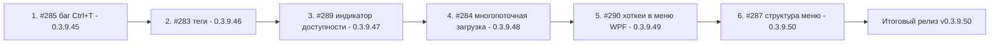

# PLAN — «Управление конфигурациями 1С»

План работ по issues **#283, #284, #285, #287, #289, #290** для репозитория
[`sivatorov/ConfigurationManagement`](https://github.com/sivatorov/ConfigurationManagement)
(локальная копия: `f:\Yandex.Disk\h\Configuration_Management`, ветка `main`, HEAD `93b096c`,
текущая версия **0.3.9.44**).

Документ подготовлен в режиме Архитектор: только планирование. Issues не закрываются,
комментарии не публикуются — это делают задачи-исполнители (mode `code`) по правилам ниже.

---

## 1. Контекст и правила работы

- Проект — гибрид **WPF (Windows, net10.0-windows)** и **Avalonia (Linux, net10.0)**, single-file publish,
  сборка через [`build-windows-single-file.ps1`](Configuration%20Management/build-windows-single-file.ps1)
  и [`build-linux-single-file.ps1`](Configuration%20Management/build-linux-single-file.ps1)
  / [`build-linux-single-file.sh`](Configuration%20Management/build-linux-single-file.sh).
  Имена артефактов: `dist/win-x64/ConfigurationManagement.exe` и `dist/linux-x64/ConfigurationManagement`.
- Версия задаётся в ЧЕТЫРЁХ полях [`Configuration Management.csproj`](Configuration%20Management/Configuration%20Management.csproj:62):
  `<Version>`, `<AssemblyVersion>`, `<FileVersion>`, `<InformationalVersion>` (все = `0.3.9.44` на HEAD).
- `gh` авторизован как `sivatorov`. Локальный `.git` восстановлен из свежего клона
  (резерв — `f:\Yandex.Disk\h\CM_clean`).
- Артефакты публикации: комментарии — `publish/comment-<номер>-<версия>.md`,
  тела релизов — `publish/release_body_<версия>.md` (см. существующие файлы).

### Обязательные шаги каждой задачи-исправления (одно исправление = одна задача, один issue)

1. Внести правку кода (обе платформы, где применимо).
2. Поднять версию во всех четырёх полях `Configuration Management.csproj` (следующая из списка ниже).
3. Добавить запись в [`CHANGELOG.md`](CHANGELOG.md) (формат: `## [X.Y.Z.N] — YYYY-MM-DD`,
   разделы «Новое/Исправлено», «Версия»; ссылки на файлы — как в записях 0.3.9.43/0.3.9.44).
4. Обновить [`README.md`](README.md): бейдж версии в шапке (строка 3 — замечено расхождение:
   сейчас там `0.3.9.43`, а версия уже `0.3.9.44`) и при необходимости раздел возможностей.
5. Убедиться, что сборка проходит для обеих платформ (`dotnet build`; Linux — `-p:ForceLinux=true`)
   и тесты зелёные (`dotnet test`, особенно `EtapHotkeysFavoritesTests` для #285).
6. Закоммитить (один коммит на версию).
7. Опубликовать комментарий в issue через `gh issue comment <N> --body-file publish/comment-<N>-<версия>.md`
   («что исправлено и в какой версии»). Файл комментария сохранить в `publish/`.
8. **Issue НЕ закрывать.**

---

## 2. Декомпозиция: задачи, версии, файлы, риски

| № | Issue | Версия | Суть | Ключевые файлы | Зависимости / риски |
|---|-------|--------|------|----------------|---------------------|
| 1 | [#285](https://github.com/sivatorov/ConfigurationManagement/issues/285) | **0.3.9.45** | Баг: «Найти в списке» (Ctrl+T) не работает из Избранного и Закреплённых | VM команд, дерево, хоткеи, тесты | Нет зависимостей. Риск: ссылочная нестабильность Infobase при перестроении дерева |
| 2 | [#283](https://github.com/sivatorov/ConfigurationManagement/issues/283) | **0.3.9.46** | Баг: новый тег не появляется в списке/фильтре; добавить список тегов ещё в одном месте | ConnectionSettingsViewModel/Window, фильтры тегов VM, MainWindow.Tags | Нет зависимостей. Риск: пересечение с #287/#290 по MainWindow.* незначительное |
| 3 | [#289](https://github.com/sivatorov/ConfigurationManagement/issues/289) | **0.3.9.47** | Индикатор «идёт проверка», интерактивная отдача результатов, пояснение механики проверки доступности | CheckAvailability в VM, Infobase, иконки, статус-бар, локализация | Нет зависимостей. Риск: серверные таймауты (8 с/база); менять аккуратно, чтобы не соврать пользователю |
| 4 | [#284](https://github.com/sivatorov/ConfigurationManagement/issues/284) | **0.3.9.48** | Многопоточная загрузка обновления (HTTP Range, N сегментов) | UpdateService.cs, UpdateService.Avalonia.cs, UpdateAvailableWindow, (новый) ParallelDownloader | Самый рискованный фикс. Падать должен в однопоточный fallback; прогресс/докачка не должны сломаться |
| 5 | [#290](https://github.com/sivatorov/ConfigurationManagement/issues/290) | **0.3.9.49** | Хоткеи не отображаются в меню Windows (WPF) | Themes/LightTheme.xaml, Themes/DarkTheme.xaml (шаблон ModernMenuItem) | Выполнять ДО #287: оба трогают меню/стили. Риск: ширина меню, регрессия тем |
| 6 | [#287](https://github.com/sivatorov/ConfigurationManagement/issues/287) | **0.3.9.50** | Новая структура контекстного меню базы: подменю, тонкие разделители, перенос «Консоль серверов» в «Утилиты» | MainWindow.xaml (ContextMenu), MainWindow.Columns.cs, MainWindow.Avalonia.Tree.cs (BuildRowContextMenu/BuildUtilitiesMenu), стили Separator | После #290 (стили готовы). Риск: логика OnBaseContextMenu_Opened и режим «Пользователь» |

> #286 исключён из работ (реализован в 0.3.9.44, последний комментарий от автора).

---

## 3. Детально по каждому issue

### 3.1 #285 «Найти в списке» (баг Ctrl+T) — версия 0.3.9.45

**Симптом:** пункт меню и хоткей есть, но «по нажатию ничего не происходит» — ни из
Избранного, ни из Закреплённых.

**Текущая реализация:**
- WPF: [`MainViewModel.ExecuteFindInList`](Configuration%20Management/ViewModels/MainViewModel.Commands.cs:1277)
  — переключает `IsListModeAll`, сбрасывает поиск/теги, раскрывает путь групп
  ([`ExpandPathTo`](Configuration%20Management/ViewModels/MainViewModel.Commands.cs:1299)),
  затем `SelectedInfobase = ib; RebuildGroupTree();`.
- Avalonia: [`MainViewModel.Avalonia.ExecuteFindInList`](Configuration%20Management/ViewModels/MainViewModel.Avalonia.Commands.cs:166) + `RebuildTree()`.
- Регистрация хоткея: [`MainWindow.Hotkeys.cs:83`](Configuration%20Management/Views/MainWindow.Hotkeys.cs:83),
  [`MainWindow.Avalonia.Hotkeys.cs:147`](Configuration%20Management/Views/MainWindow.Avalonia.Hotkeys.cs:147).
- Пункты меню: [`MainWindow.xaml:2004`](Configuration%20Management/Views/MainWindow.xaml:2004),
  [`MainWindow.Avalonia.Tree.cs:1678`](Configuration%20Management/Views/MainWindow.Avalonia.Tree.cs:1678).

**Вероятные причины (проверить в порядке перечисления):**
1. **Ссылочная нестабильность Infobase.** Во вкладках «Избранное/Закреплённые» выделенный
   экземпляр `Infobase` после переключения на «Все базы» и перестроения дерева может не совпадать
   с экземпляром в новой коллекции → выделение/прокрутка не срабатывают.
2. **Порядок операций.** `SelectedInfobase = ib` ставится до `RebuildGroupTree()`; если пересборка
   сбрасывает `SelectedInfobase`, результат теряется. Проверить `RevealAndSelectAfterRebuild`
   (прокрутка после пересборки) и её вызов.
3. **CanExecute.** `FindInListCommand` разрешён только при `SelectedInfobase != null`
   ([`MainViewModel.Avalonia.Commands.cs:77`](Configuration%20Management/ViewModels/MainViewModel.Avalonia.Commands.cs:77));
   убедиться, что выделение фиксируется в режимах Favorites/Pinned (не сбрасывается на null).
4. **WPF KeyBinding Ctrl+T** конфликтует с другим контролом/привязкой — проверить фактическую
   регистрацию и фокус (класс-обработчики ESC меню не должны перехватывать).

**Объём работ:** воспроизвести на обеих платформах → найти причину → исправить (как минимум:
после пересборки повторно установить `SelectedInfobase` на актуальный экземпляр из списка «Все»
и вызвать прокрутку; обеспечить стабильность выделения из Избранного/Закреплённых) →
добавить/расширить юнит-тест [`EtapHotkeysFavoritesTests.cs`](ConfigurationManagement.Tests/EtapHotkeysFavoritesTests.cs) →
поднять версию, CHANGELOG/README, коммит, комментарий в issue.

**Файлы:** `ViewModels/MainViewModel.Commands.cs`, `ViewModels/MainViewModel.cs`
(`IsListModeAll`, `RebuildGroupTree`, `SelectedInfobase`), `Views/MainWindow.Tree.cs`
(прокрутка/выделение), `Views/MainWindow.Hotkeys.cs`; Avalonia: `ViewModels/MainViewModel.Avalonia.Commands.cs`,
`Views/MainWindow.Avalonia.Hotkeys.cs`, `Views/MainWindow.Avalonia.Tree.cs`;
тесты `ConfigurationManagement.Tests/EtapHotkeysFavoritesTests.cs`.

---

### 3.2 #283 «Правка тегов» — версия 0.3.9.46

**Симптомы:** (1) вновь добавленный тег не отображается в списке/фильтре; (2) пожелание —
показать/использовать список тегов ещё в одном месте.

**Текущая реализация:**
- Окно правки базы: [`ConnectionSettingsViewModel`](Configuration%20Management/ViewModels/ConnectionSettingsViewModel.cs:131)
  — `Tags`, `AvailableTags` (автодополнение), `AddTag()`/`RemoveTag()`.
- Панель фильтров главного окна: WPF [`RefreshTagFilterItems`](Configuration%20Management/ViewModels/MainViewModel.Display.cs:199),
  Avalonia [`RebuildTagFilters`](Configuration%20Management/ViewModels/MainViewModel.Avalonia.cs:958).
- Inline-добавление тега в строке базы: [`MainViewModel.AddTagInline`](Configuration%20Management/ViewModels/MainViewModel.Tools.cs:1428),
  WPF UI [`MainWindow.Tags.cs`](Configuration%20Management/Views/MainWindow.Tags.cs).

**Вероятные причины:**
1. После сохранения правки базы панель фильтров тегов не пересобирается (или пересобирается,
   но новый тег скрыт сортировкой/кэшем). Проверить путь «правка базы → сохранение»:
   [`MainViewModel.Commands.cs:295`](Configuration%20Management/ViewModels/MainViewModel.Commands.cs:295)
   вызывает `PruneActiveTagFilters()` + `RefreshTagFilterItems()` — убедиться, что он выполняется
   и для добавления нового тега, а не только удаления.
2. `AvailableTags` в окне правки задаётся один раз и не обновляется после `AddTag` →
   автодополнение не видит только что добавленный тег.
3. **«Список и вот тут тоже»** — уточнить у пользователя точное место (кандидаты: панель
   фильтров главного окна — уже есть; окно правки базы; колонка/область тегов строки;
   возможно, речь о списке всех тегов рядом с полем ввода в окне свойств). Задача-исполнитель
   должна воспроизвести баг и принять решение по второму месту, опираясь на формулировку
   7OH и скриншоты issue.

**Объём работ:** воспроизвести баг (обе платформы) → обеспечить обновление панели фильтров
и списка `AvailableTags` сразу после добавления → добавить список/выбор тегов во второе место
(согласовать с текстом issue) → поднять версию, CHANGELOG/README, коммит, комментарий.

**Файлы:** `ViewModels/ConnectionSettingsViewModel.cs`, `Views/ConnectionSettingsWindow.xaml`
(+ `.cs`/`.Avalonia.cs`), `ViewModels/MainViewModel.Display.cs`, `ViewModels/MainViewModel.Tools.cs`,
`Views/MainWindow.Tags.cs`, `Views/MainWindow.Avalonia.Tags.cs`, `Views/MainWindow.xaml`
(шаблон тегов строки), `Localization/LocalizationSource.cs` (новые ключи ru/en).

---

### 3.3 #289 «Индикатор проверки доступности» — версия 0.3.9.47

**Текущая реализация:**
- WPF: [`MainViewModel.CheckAvailability`](Configuration%20Management/ViewModels/MainViewModel.Tools.cs:962):
  `Task.Run` → собрать ВСЕ результаты → один раз применить `SetCheckedAvailability` + `Refresh`.
- Avalonia: [`MainViewModel.Avalonia.CheckAvailability`](Configuration%20Management/ViewModels/MainViewModel.Avalonia.Tools.cs:682) (тот же паттерн).
- Механика проверки: [`IsBaseAvailable`](Configuration%20Management/ViewModels/MainViewModel.Tools.cs:998):
  - файловая база — наличие каталога/файла по пути (`FileBaseExists`);
  - клиент-серверная — попытка внешнего COM-подключения `ReadConfigurationInfo(ib, timeoutMs: 8000)`
    через процесс-агент `ComReadHost`;
  - веб-база — заполненность адреса.

**Причина «почти все базы красные при работающем конфигураторе» (для ответа в issue):**
конфигуратор запускается 1cv8 локально и не проверяет подключение так, как внешний COM-коннектор.
Для клиент-серверных баз проверка = реальное внешнее подключение к базе с таймаутом 8 секунд на базу;
при многих базах это даёт длинную очередь и массовые «красные» (COM-коннектор недоступен
в окружении пользователя, сетевые задержки/брандмауэр, нет права на внешнее соединение).
Красная иконка НЕ означает «база не запускается конфигуратором».

**Что сделать:**
1. **Состояние «идёт проверка»:** у проверяемых баз — значок ожидания/серый (новый `StatusIconKey`,
   например «Checking», и цвет). Сброс в «расчётное» состояние (`SetCheckedAvailability(null)`) до старта.
2. **Интерактивная отдача:** публиковать результат по каждой базе по мере готовности (Dispatcher в UI),
   а не одним пакетом в конце; прогресс в строке состояния «Проверка: i из N…».
3. **Пояснение механики** в комментарии к issue + подсказка (ToolTip) у кнопки проверки.
4. Рассмотреть: ограниченный параллелизм проверки (`Parallel.ForEachAsync` с лимитом ~4), сокращение
   таймаута, опционально лёгкую проверку доступности сервера (DNS/порт 1541) — аккуратно, чтобы
   не выдавать ложные результаты.

**Файлы:** `ViewModels/MainViewModel.Tools.cs`, `ViewModels/MainViewModel.Avalonia.Tools.cs`,
`Models/Infobase.cs` (`SetCheckedAvailability`/`StatusIconKey`/`StatusColorHex`),
`Themes/Icons.xaml` + `Themes/Icons.axaml` (иконка ожидания), `Views/MainWindow.xaml`,
`Views/MainWindow.Avalonia.cs` (кнопка), `Localization/LocalizationSource.cs`.

---

### 3.4 #284 «Скорость скачивания на Windows» — версия 0.3.9.48

**Текущая реализация:** [`UpdateService.DownloadAsync`](Configuration%20Management/Services/UpdateService.cs:243)
+ [`DownloadChunkAsync`](Configuration%20Management/Services/UpdateService.cs:292):
однопоточный GET, докачка через HTTP Range (12 попыток), буфер 1 МБ, прогресс только на смене
процента (фикс 0.3.9.39). Опыт 7OH: провайдер режет скорость на одно соединение
(браузер однопоточно — та же низкая скорость; менеджер с 10 потоками — максимум).

**Стратегия многопоточной загрузки (описание подхода):**

1. **Определить размер файла.** Перед загрузкой — `GET` с `Range: bytes=0-0` (либо первый
   запрос уже несёт `Content-Range` total). Если размер неизвестен/сервер без Range — **fallback**
   на текущий однопоточный путь (не ломать существующее поведение).
2. **Разбить на N сегментов** (по умолчанию **8**, параметризуемо константой/настройкой):
   границы `[start_i .. end_i]` делением общего размера; последний сегмент заканчивается
   на `total-1`.
3. **Параллельная загрузка сегментов.** Каждый сегмент — отдельный `Task` + отдельный
   `HttpRequestMessage` c `RangeHeaderValue(start_i, end_i)`; запись в свой частичный файл
   `<dest>.<i>.part` (проще и безопаснее общего файла со случайным доступом; отдельные файлы
   позволяют докачивать каждый сегмент независимо). Ограничение параллелизма — `SemaphoreSlim(N)`
   и общий `CancellationTokenSource` (отмена при сбое одного сегмента).
4. **Докачка и устойчивость.** Каждый `.part` продолжает качаться со своего места (Range от
   текущего размера части) при повторе попытки — сохраняется устойчивость к обрывам, как сейчас
   для одного файла. Максимальное число попыток на сегмент — как сейчас (12).
5. **Прогресс.** Агрегированный процент = сумма скачанного по всем сегментам / общий размер;
   событие `DownloadProgressChanged` — не чаще раза на целый процент (защита от просадки скорости,
   фикс #284/0.3.9.39 сохраняется).
6. **Сборка.** После успеха всех сегментов склеить `.part` в финальный файл (последовательный
   `FileStream` copy), удалить части, проверить итоговый размер `== total`. Имя файла и точки
   интеграции (`DownloadNewExeCoreAsync`, `UpdateAvailableWindow`, статус-бар) не меняются.
7. **Linux (Avalonia).** [`UpdateService.Avalonia.cs`](Configuration%20Management/Services/UpdateService.Avalonia.cs)
   имеет собственную реализацию загрузки (~строка 628). Желательно вынести общую логику в новый
   класс [`Services/ParallelDownloader.cs`](Configuration%20Management/Services/ParallelDownloader.cs)
   (без `#if`-зависимостей) и использовать в обеих платформах; минимально допустимо — повторить
   паттерн в Linux-файле. Основной фокус — Windows (как в issue).
8. **Лимиты и риски.** GitHub поддерживает Range и допускает несколько соединений; для надёжности
   ограничить N=8 и агрессивно фолбэчить при первом `200` вместо `206` или при отсутствии
   `Content-Length` (прокси/сжатие). Не использовать `HttpClient` с общим `Timeout` для чтения
   тела — задавать таймаут чтения на сегмент.

**Файлы:** `Services/UpdateService.cs`, `Services/UpdateService.Avalonia.cs`,
`Services/UpdateAvailableWindow.xaml.cs` (прогресс — интерфейс не меняется),
(новый) `Services/ParallelDownloader.cs`, тесты (чистая логика разбиения/склейки, без сети).

---

### 3.5 #290 «Хоткеи и меню» — версия 0.3.9.49

**Причина найдена (при анализе кода):** кастомный WPF-шаблон `ModernMenuItem` в
[`LightTheme.xaml:790`](Configuration%20Management/Themes/LightTheme.xaml:790) и
[`DarkTheme.xaml:678`](Configuration%20Management/Themes/DarkTheme.xaml:678) содержит Grid всего
из трёх колонок — **Icon | Header | SubmenuArrow** — и **не отображает `InputGestureText`**.
В XAML хоткеи уже привязаны (`InputGestureText="{Binding HotkeyEnterprise}"` и т.д. в
[`MainWindow.xaml`](Configuration%20Management/Views/MainWindow.xaml:1953)), но шаблон их не рендерит.
В Avalonia пункты строятся через `MenuAction(..., gesture, ...)`, где
[`InputGesture`](Configuration%20Management/Views/MainWindow.Avalonia.Tree.cs:1727) задаётся
стандартному шаблону — поэтому «в Linux красиво с хоткеем».

**Что сделать:**
1. Добавить в шаблон `ModernMenuItem` четвёртую колонку `Auto` с `TextBlock`, привязанным к
   `InputGestureText` (или `ContentPresenter ContentSource="InputGestureText"`), стиль — вторичный
   текст (`TextSecondaryBrush`, размер ~12), отступ слева ~16–24 px.
2. Скрывать жестовую колонку, если `InputGestureText` пуст (триггер на пустую строку), чтобы
   пункты без хоткея не растягивали меню.
3. Проверить: пункты с подменю (`Role=SubmenuHeader`, стрелка), вложенные меню («Очистить кэш»),
   меню «Утилиты», высота пунктов (как у строки). Обе темы (светлая/тёмная) синхронно.
4. Регрессии ESC/закрытия меню (issues #261/#270) не затрагиваются — обработка не меняется.

**Файлы:** `Themes/LightTheme.xaml`, `Themes/DarkTheme.xaml` (дублируются стили — править оба).
Avalonia не трогаем.

---

### 3.6 #287 «Структура контекстного меню» — версия 0.3.9.50

**Где строятся меню:**
- WPF: контекстное меню дерева — [`MainWindow.xaml:1950-2067`](Configuration%20Management/Views/MainWindow.xaml:1950);
  меню «Утилиты» — [`MainWindow.xaml:594-635`](Configuration%20Management/Views/MainWindow.xaml:594);
  включение/выключение пунктов — [`MainWindow.Columns.cs:73`](Configuration%20Management/Views/MainWindow.Columns.cs:73) (`OnBaseContextMenu_Opened`).
- Avalonia: [`BuildRowContextMenu`](Configuration%20Management/Views/MainWindow.Avalonia.Tree.cs:1632),
  [`BuildUtilitiesMenu`](Configuration%20Management/Views/MainWindow.Avalonia.Tree.cs:1562).

**Что сделать (по пожеланию issue):**
1. **Подменю «Обновление и связь»**: Запуск «1С:Предприятие», Запуск «Конфигуратор»,
   Обновить информацию о конфигурации, Проверка обновлений 1С (F9), Связь с обновлением
   (`ConfigLink`), Регистрация COM-коннектора (Windows).
2. **Подменю «Администрирование»**: Проверка целостности (chdbfl), Блокировка сеансов,
   временная блокировка приложения (группировку уточнить при реализации).
3. **Подменю «Резервирование»**: Сценарии резервирования, Выполнить сценарий,
   Список выгрузок/Восстановление, Выгрузка .dt/.cf, История запусков.
4. **«Очистить кэш»** — существующее подменю, остаётся.
5. **Разделители тоньше** — переопределить стиль `Separator` контекстных меню на обеих платформах
   (меньше высота/отступы, 1px линия).
6. **Высота пункта с подменю = высоте обычной строки** (проверить отступы `Padding` шаблона).
7. **«Консоль администрирования серверов»** перенести из контекстного меню базы в общее меню
   «Утилиты» (WPF: убрать из XAML дерева, добавить в ContextMenu кнопки «Утилиты»;
   Avalonia: перенести из `BuildRowContextMenu` в `BuildUtilitiesMenu`).
8. **После «Список типовых конфигураций»** (в «Утилитах») добавить разделитель
   (WPF: [`MainWindow.xaml:616`](Configuration%20Management/Views/MainWindow.xaml:616);
   Avalonia: [`Tree.cs:1571-1575`](Configuration%20Management/Views/MainWindow.Avalonia.Tree.cs:1571)).
9. Сохранить логику `OnBaseContextMenu_Opened` (по `Tag`, типу базы) и ограничения режима
   функциональности «Пользователь» (запуск/избранное/закрепление).

**Файлы:** `Views/MainWindow.xaml`, `Views/MainWindow.Columns.cs`, `Views/MainWindow.Avalonia.Tree.cs`,
`Themes/LightTheme.xaml` + `DarkTheme.xaml` (Separator), `Themes/ControlThemes.Avalonia.cs` /
`ControlDefaults.axaml`, `Localization/LocalizationSource.cs` (подписи подменю).

---

## 4. Порядок выполнения и параллельность

**Строго последовательно (нельзя совмещать):**
- Интеграция версий в `main`: коммиты 0.3.9.45 → 0.3.9.46 → … → 0.3.9.50 — линейная история,
  уникальные номера версий, CHANGELOG/README и комментарии issues по одному на версию.
- Выпуск релиза — строго последним, после всех шести коммитов.
- **#290 перед #287** (оба трогают меню и стили: LightTheme/DarkTheme, MainWindow.xaml, Tree.cs,
  Localization). Выполнение в обратном порядке гарантированно даёт конфликты.
- **#284 и #289** обе меняют `MainViewModel.*`/сервисы — делать последовательно, не в параллельных ветках одновременно.

**Допустимая параллельность (по желанию, в отдельных ветках с последовательным merge):**
- Пары независимых по файлам задач: `{#285, #283}`, `{#283, #289}`, `{#285, #289}`.
- Однако из-за правила «один коммит на версию в main» рекомендуется простой последовательный
  конвейер (см. диаграмму) — он минимизирует риск и упрощает откаты.

**Порядок выбран так:** сначала баги (#285, #283), затем UX-доработка (#289), затем самый
рискованный фикс (#284), в конце — работа с меню (#290 → #287), чтобы новая структура меню
сразу рендерилась с хоткеями и тонкими разделителями.

---

## 5. Контрольный чек-лист завершения каждого issue

Для каждой задачи (0.3.9.45 … 0.3.9.50):

- [ ] Правка внесена на обеих платформах (WPF и Avalonia), где функция существует.
- [ ] Баг/пожелание воспроизведены и проверены вручную; для #285 добавлен/обновлён юнит-тест.
- [ ] Версия поднята во всех четырёх полях `Configuration Management.csproj` (строки 62–65).
- [ ] Запись добавлена в `CHANGELOG.md` (формат как у 0.3.9.43/0.3.9.44, с датой и ссылками на файлы).
- [ ] Обновлён `README.md` (бейдж версии, при необходимости — раздел возможностей).
- [ ] `dotnet build` проходит для Windows (WPF) и Linux (`-p:ForceLinux=true`).
- [ ] `dotnet test` зелёный (весь набор).
- [ ] Один коммит на версию создан (сообщение вида «0.3.9.45: …»).
- [ ] Файл комментария `publish/comment-<номер>-<версия>.md` создан по образцу существующих.
- [ ] Комментарий опубликован в issue через `gh issue comment <N> --body-file …` («что исправлено и в какой версии»).
- [ ] **Issue НЕ закрыт.**

---

## 6. Контрольный чек-лист итогового релиза

- [ ] Все 6 задач завершены; в `main` последовательные коммиты 0.3.9.45…0.3.9.50; рабочее дерево чистое.
- [ ] Собран Windows single-file: `.\build-windows-single-file.ps1` → `dist/win-x64/ConfigurationManagement.exe`.
- [ ] Собран Linux single-file: `.\build-linux-single-file.ps1` (из Windows, ForceLinux) или
      `build-linux-single-file.sh` (из Linux) → `dist/linux-x64/ConfigurationManagement`.
- [ ] Версия в бинарниках = 0.3.9.50 (проверка `VersionInfo.Display()`, свойства файла/запуск).
- [ ] Подготовлено тело релиза `publish/release_body_0.3.9.50.md` (по образцу `release_body_0.3.9.44.md`,
      сводка по всем шести issue).
- [ ] Уточнён формат тега предыдущих релизов (`gh release list` — ожидается `v<версия>`), тег создан
      для `v0.3.9.50` (или формата предыдущих).
- [ ] Создан ОДИН релиз: `gh release create v0.3.9.50 dist/win-x64/ConfigurationManagement.exe
      dist/linux-x64/ConfigurationManagement --notes-file publish/release_body_0.3.9.50.md`.
- [ ] Релиз проверен: оба asset прикреплены, тело релиза отображается, автообновление приложения
      находит новую версию (IsNewerThan по тегу).
- [ ] `git push origin main` выполнен (все коммиты и `publish/*.md` на GitHub).
- [ ] Issues остаются открытыми (по правилам работы).

---

## 7. Примечания и риски проекта

- **Локализация:** новые подписи («Обновление и связь», «Администрирование», «Резервирование»,
  статусы проверки доступности и т.п.) добавляются в `Localization/LocalizationSource.cs` в ru и en.
- **Темы дублируются:** `LightTheme.xaml` и `DarkTheme.xaml` содержат одинаковые стили — правки
  меню/разделителей обязательны в обоих файлах.
- **`README.md`:** замечено расхождение бейджа (0.3.9.43 при версии 0.3.9.44) — каждая задача
  обновляет бейдж до своей версии.
- **Комментарии и тела релизов** сохраняются в `publish/` и коммитятся вместе с изменениями.
- **Git:** при любых сомнениях в состоянии `.git` использовать резерв `f:\Yandex.Disk\h\CM_clean`.