# PLAN — цикл 0.3.9.101–0.3.9.109 — обработка issues #304–#312

Репозиторий [`sivatorov/ConfigurationManagement`](https://github.com/sivatorov/ConfigurationManagement),
локальная копия `f:\Yandex.Disk\h\Configuration_Management`, ветка `main`, HEAD = 0.3.9.100
(ahead 10 от origin/main — незапушенные коммиты, пуш в финальной задаче).

Режим: Архитектор (план) → цепочка задач-исполнителей в режиме **code**.
**Один issue = одна задача = одна версия = один коммит.** Issues НЕ закрываются.
План-файл остаётся untracked (plans/ в .codeassistantignore); CHANGELOG/README коммитятся.

---

## 1. Сводка

Обрабатываем 9 открытых issues (#304–#312), по одному пункту на задачу, в порядке
зависимостей (сначала простые независимые баги, затем правки одного окна создания ИБ,
затем крупная фича скриптов, в конце — сборка и релиз):

| № | Версия  | Issue | Суть | Сложность |
|---|---------|-------|------|-----------|
| 1 | 0.3.9.101 | #304 | Регресс выбора папки платформы при переключении разрядности | низкая |
| 2 | 0.3.9.102 | #309 | Пропал горизонтальный скролл списка баз | низкая |
| 3 | 0.3.9.103 | #311 | Колонка «Последняя копия» не отключается из настроек | низкая |
| 4 | 0.3.9.104 | #310 | Подсветка «не отвечающих» процессов (точка оранжевая/красная) | средняя |
| 5 | 0.3.9.105 | #312 | Ошибка командной палитры Ctrl+K + пункт в меню | низкая/средняя |
| 6 | 0.3.9.106 | #306 | Кнопка копирования имени базы кластера в имя ИБ | низкая |
| 7 | 0.3.9.107 | #307 | Флажок «Запретить локальное распознавание речи» | средняя |
| 8 | 0.3.9.108 | #305 | Компактный макет создания серверной ИБ + порт СУБД/подсказка PostgreSQL | средняя |
| 9 | 0.3.9.109 | #308 | «Сценарии»: настройка сценариев, подстановка свойств, «Выполнить скрипт» (F5) | высокая |
| 10 | 0.3.9.109 | релиз | Сборка Windows+Linux single-file, пуш, релиз v0.3.9.109 | средняя |

```mermaid
flowchart LR
    A[0.3.9.101 #304 выбор папки платформы] --> B[0.3.9.102 #309 горизонт. скролл]
    B --> C[0.3.9.103 #311 колонка Последняя копия]
    C --> D[0.3.9.104 #310 подсветка зависших]
    D --> E[0.3.9.105 #312 командная палитра]
    E --> F[0.3.9.106 #306 кнопка копирования]
    F --> G[0.3.9.107 #307 запрет распознавания речи]
    G --> H[0.3.9.108 #305 компактный макет + порт СУБД]
    H --> I[0.3.9.109 #308 сценарии]
    I --> J[Релиз v0.3.9.109]
```

Общие требования К КАЖДОЙ задаче (кроме финальной):
1. Реализация на обеих платформах (Windows/WPF + Linux/Avalonia).
2. Поднять версию в `Configuration Management.csproj` (строки 62–65: Version/AssemblyVersion/FileVersion/InformationalVersion).
3. Запись в CHANGELOG.md (сверху, формат как у прошлых версий) и обновить бейдж версии в README.md (строка 3).
4. Тесты: `dotnet test` зелёный; новые/обновлённые тесты — по таблице ниже.
5. Комментарий в issue: файл `publish/comment-NNN-0.3.9.XXX.md` + публикация:
   `gh api repos/sivatorov/ConfigurationManagement/issues/NNN/comments -f body=@publish/comment-NNN-0.3.9.XXX.md`
   (текст: что исправлено и в какой версии; issue НЕ закрывать).
6. Один коммит (без пуша). Коммит-сообщение по образцу: `fix: ...; 0.3.9.XXX` / `feat: ...; 0.3.9.XXX`.
7. В конце задачи — запустить следующую задачу через `new_task(mode=code)` с инструкцией
   следующего пункта (сообщения-инструкции — в разделе 4).

---

## 2. Ключевые якоря кодовой базы (разведка выполнена)

### Общее
- Версия: [`Configuration Management.csproj`](Configuration%20Management/Configuration%20Management.csproj:62) — 4 поля, строки 62–65.
- Локализация: `Configuration Management/Localization/Languages/ru.json`, `en.json`.
- Формат комментариев/релизов: `publish/comment-*.md`, `publish/release_body_*.md`.

### #304 — PlatformVersionPickerWindow
- WPF: [`Views/PlatformVersionPickerWindow.xaml.cs`](Configuration%20Management/Views/PlatformVersionPickerWindow.xaml.cs)
  — `RefreshTree()` 51–67 (после перестроения вызывает `SelectCurrent(_currentVersion)`),
  `OnArchFilter_Changed` 117–124, `OnPlatformsTree_SelectedItemChanged` 142–157
  (пишет только `_selectedVersion`, НЕ обновляет `_currentVersion`), `SelectCurrent` 223–231,
  `FindBestNode` 240–266 (логика частичных версий из #251).
- Avalonia: [`Views/PlatformVersionPickerWindow.Avalonia.cs`](Configuration%20Management/Views/PlatformVersionPickerWindow.Avalonia.cs)
  — зеркальные методы (RefreshTree ~309, SelectCurrent ~444).
- Корень регресса: при выборе папки/линии `_selectedVersion` = «8.3 (64)» и т.п., а
  `_currentVersion` остаётся прежней; при переключении фильтра разрядности `RefreshTree()`
  повторно выделяет узел по старой `_currentVersion` → «перескакивает на папку выше».

### #305–#307 — создание ИБ
- WPF-окно: [`Views/CreateInfobaseWindow.xaml`](Configuration%20Management/Views/CreateInfobaseWindow.xaml:63)
  (ServerPanel: ServerBox 65, RefBox 67, DbmsBox 69–75, DbServerBox 77, DbNameBox ~79, DbUserBox ~81,
  DbPwdBox 83, CreateDbCheck 84–86, BlockJobsCheck 87–88), обработчик создания
  [`Views/CreateInfobaseWindow.xaml.cs`](Configuration%20Management/Views/CreateInfobaseWindow.xaml.cs:531)
  (сборка `CreateInfobaseRequest`), выбор платформы 214–226.
- Avalonia-окно: [`Views/CreateInfobaseWindow.Avalonia.cs`](Configuration%20Management/Views/CreateInfobaseWindow.Avalonia.cs)
  (поля 39–57, DbmsValues 81–84, сборка запроса 750+).
- Модель: [`Models/CreateInfobaseRequest.cs`](Configuration%20Management/Models/CreateInfobaseRequest.cs)
  (поле для #307 — добавить `ForbidSpeechRecognition`; для #305 — `DbPort`/готовую строку).
- Сервис: [`Services/CreateInfobaseService.cs`](Configuration%20Management/Services/CreateInfobaseService.cs:22)
  (TryCreate 22–152; серверная ветка 67–123; блокировка фоновых заданий как образец проброса флага).
- Запуск создания: [`Services/OneCLauncher.Arguments.cs`](Configuration%20Management/Services/OneCLauncher.Arguments.cs)
  (CreateInfoBase 229–387; серверная строка 290–312), Linux: [`Services/OneCLauncher.Linux.Process.cs`](Configuration%20Management/Services/OneCLauncher.Linux.Process.cs:375).

### #308 — сценарии (образцы)
- Резервные сценарии как ОБРАЗЕЦ: [`Models/BackupScenario.cs`](Configuration%20Management/Models/BackupScenario.cs),
  [`Services/BackupScenarioStore.cs`](Configuration%20Management/Services/BackupScenarioStore.cs)
  (JSON-хранилище `backups/scenarios`, санитизация имени файла по Id),
  окна [`Views/BackupScenariosWindow.xaml.cs`](Configuration%20Management/Views/BackupScenariosWindow.xaml.cs)
  и `.Avalonia.cs` (модальность issue #291, скины ModernMenuItem/ModalWindowBase),
  [`Views/BackupScenarioEditWindow.xaml.cs`](Configuration%20Management/Views/BackupScenarioEditWindow.xaml.cs).
- Меню «Утилиты» WPF: [`Views/MainWindow.xaml`](Configuration%20Management/Views/MainWindow.xaml:709)
  («Сценарии резервирования» 709–711, «Выполнить резервирование» 712–713) — новый пункт «Настройка сценариев» после 712.
- Меню «Утилиты» Avalonia: [`Views/MainWindow.Avalonia.Tree.cs`](Configuration%20Management/Views/MainWindow.Avalonia.Tree.cs:1690)
  (Backup.ScenariosTitle 1692, Backup.RunTitle 1693) — вставить после 1693.
- Контекстное меню базы Avalonia: `BuildRowContextMenu()` [`MainWindow.Avalonia.Tree.cs`](Configuration%20Management/Views/MainWindow.Avalonia.Tree.cs:1733)
  — «Запустить конфигуратор»; WPF — контекстное меню базы в `MainWindow.xaml` (пункт «Запустить конфигуратор»).
- Хоткеи: WPF [`Views/MainWindow.Hotkeys.cs`](Configuration%20Management/Views/MainWindow.Hotkeys.cs:85),
  Avalonia [`Views/MainWindow.Avalonia.Hotkeys.cs`](Configuration%20Management/Views/MainWindow.Avalonia.Hotkeys.cs:148);
  конфигурация `Models/AppSettings.cs` (HotkeyCommandPalette 427 и т.д.).
- Выполнение внешних команд: [`Services/ExternalCommandRunner.cs`](Configuration%20Management/Services/ExternalCommandRunner.cs)
  (`RunAsync` 52–80, `RunDetached` ~86, `BuildShellCommand` 34–44) — переиспользовать для запуска сценариев.
- VM-команды: [`ViewModels/MainViewModel.Backup.cs`](Configuration%20Management/ViewModels/MainViewModel.Backup.cs)
  (ShowBackupScenariosCommand 47–48, ExecuteShowBackupScenarios 60–73) — образец команд «Утилит».
- Палитра команд: `MainViewModel.Commands.cs` 1521–1552 (palette.backup-scenarios) — добавить palette.scripts.

### #309 — горизонтальный скролл
- Avalonia: [`Views/MainWindow.Avalonia.cs`](Configuration%20Management/Views/MainWindow.Avalonia.cs:1209)
  — `ScrollViewer.SetHorizontalScrollBarVisibility(_tree, ScrollBarVisibility.Disabled)` — вероятный регресс
  после добавления колонок (0.3.9.86/90).
- WPF: список баз в `Views/MainWindow.xaml` (дерево/колонки ~строки 890–1220) — проверить ScrollViewer
  списка и ColumnDefinitions.

### #310 — подсветка зависших
- Модель процесса: [`Services/IRunningInfobasesService.cs`](Configuration%20Management/Services/IRunningInfobasesService.cs:6)
  (`RunningOneCProcess(string ProcessName, string CommandLine)`) — добавить признак «не отвечает».
- Windows: [`Services/RunningInfobasesService.Windows.cs`](Configuration%20Management/Services/RunningInfobasesService.Windows.cs:17)
  — WMI; можно получать PID и проверять `Process.Responding` (по PID).
- Linux: [`Services/RunningInfobasesService.Linux.cs`](Configuration%20Management/Services/RunningInfobasesService.Linux.cs:18)
  — /proc; аналога Responding нет → эвристика по состоянию (state D/Z из /proc/PID/stat) либо
  документированное ограничение (на Linux точка остаётся зелёной).
- Монитор: [`ViewModels/MainViewModel.Running.cs`](Configuration%20Management/ViewModels/MainViewModel.Running.cs:65)
  (ApplyRunningProcesses 65–85), [`Models/Infobase.cs`](Configuration%20Management/Models/Infobase.cs:131)
  (IsRunning 131–139, IsRunningTooltip 143–146).
- Отображение WPF: [`Views/MainWindow.xaml`](Configuration%20Management/Views/MainWindow.xaml:1888)
  (Ellipse 7×7, Visibility=IsRunning, ToolTip=IsRunningTooltip) — цвет/состояние через конвертер или тройное состояние.
- Отображение Avalonia: [`Views/MainWindow.Avalonia.Tree.cs`](Configuration%20Management/Views/MainWindow.Avalonia.Tree.cs:344)
  (runningDot 348–362, цвет #22C55E, Bind IsVisible) — цвет по статусу.

### #311 — колонка «Последняя копия»
- VM: [`ViewModels/MainViewModel.Display.cs`](Configuration%20Management/ViewModels/MainViewModel.Display.cs:691)
  (ApplyDisplaySettings 691–735, showLastBackupColumn; SetColumnVisible 743–760 — работает, т.к. явно передаёт ключ).
- WPF настройки: [`Views/SettingsWindow.Display.cs`](Configuration%20Management/Views/SettingsWindow.Display.cs:77)
  (ColumnVisible 77–90 — LastBackup читается; InitializeColumnOrder 93–107) + место сохранения
  (обработчик OK вкладки «Отображение»: вероятно LastBackup не передаётся в ApplyDisplaySettings —
  проверить и починить).
- Avalonia настройки: [`Views/SettingsWindow.Avalonia.cs`](Configuration%20Management/Views/SettingsWindow.Avalonia.cs:982)
  (orderItems с ColumnVisible; проверить передачу ShowLastBackupColumn при сохранении).
- Разметка колонки: `Views/MainWindow.xaml` (LastBackupColumn 893–898, заголовок 1055–1057,
  сплиттер 1194–1199, ячейки 1468/1721/1910).
- Рабочий путь (образец): контекстное меню заголовка → `OnColumnHeaderContextMenu_Hide` → `SetColumnVisible`.

### #312 — командная палитра
- VM-команда WPF: [`ViewModels/MainViewModel.Commands.cs`](Configuration%20Management/ViewModels/MainViewModel.Commands.cs:1433)
  (ExecuteShowCommandPalette 1433+, BuildPaletteSource 1489+); Avalonia: [`ViewModels/MainViewModel.Avalonia.Commands.cs`](Configuration%20Management/ViewModels/MainViewModel.Avalonia.Commands.cs:233).
- Окно: [`Views/CommandPaletteWindow.xaml.cs`](Configuration%20Management/Views/CommandPaletteWindow.xaml.cs:27)
  (WPF, ShowDialogFor 119–126), [`Views/CommandPaletteWindow.Avalonia.cs`](Configuration%20Management/Views/CommandPaletteWindow.Avalonia.cs:31).
- Хоткей: WPF `Views/MainWindow.Hotkeys.cs` 86, Avalonia `Views/MainWindow.Avalonia.Hotkeys.cs` 149,
  `Models/AppSettings.cs` 427 (HotkeyCommandPalette).
- Тесты уже есть: [`ConfigurationManagement.Tests/CommandPaletteViewModelTests.cs`](ConfigurationManagement.Tests/CommandPaletteViewModelTests.cs).

---

## 3. Детали задач

### Задача 1 — 0.3.9.101, issue #304
**Что:** исправить регресс: при выборе «папки» (частичной версии «8.3»/«8.3.27») в
PlatformVersionPickerWindow и переключении фильтра разрядности (x32/x64/все) выделение
«перескакивает на папку выше». Причина: `RefreshTree()` выделяет узел по `_currentVersion`,
которая не обновляется после выбора пользователем.
**Как:** в обработчике выбора (WPF `OnPlatformsTree_SelectedItemChanged` 142–157; Avalonia-аналог)
обновлять `_currentVersion = _selectedVersion`. Проверить оба сценария: выбор листа (полная версия)
и выбор папки; сортировка и фильтр не должны сбрасывать выбор.
**Affected:** `Views/PlatformVersionPickerWindow.xaml.cs`, `Views/PlatformVersionPickerWindow.Avalonia.cs`.
**Тесты:** ручная проверка (обе платформы): выбрать «8.3» → переключить x32/x64 → выделение остаётся
на «8.3», результат «8.3 (32/64)»; выбрать полную версию → фильтры не сбрасывают.
**Комментарий:** `publish/comment-304-0.3.9.101.md`.

### Задача 2 — 0.3.9.102, issue #309
**Что:** вернуть горизонтальный скролл списка баз (пропал после добавления новых колонок).
**Как:** Avalonia — `MainWindow.Avalonia.cs:1209` Disabled → Auto (убедиться, что вертикальный
скролл и фиксированная колонка «Название» не ломаются). WPF — проверить ScrollViewer списка
и минимальные ширины колонок; при необходимости HorizontalScrollBarVisibility=Auto.
**Affected:** `Views/MainWindow.Avalonia.cs`, `Views/MainWindow.xaml` (+ при необходимости `MainWindow.Columns.cs`).
**Тесты:** ручная проверка: при узком окне появляется горизонтальная прокрутка, «Название»
остаётся видимой, колонки достижимы.
**Комментарий:** `publish/comment-309-0.3.9.102.md`.

### Задача 3 — 0.3.9.103, issue #311
**Что:** колонка «Последняя копия» должна отключаться в «Настройки → Отображение → Колонки»
(сейчас остаётся; отключается только через контекстное меню заголовка).
**Как:** найти место сохранения вкладки «Колонки» (WPF `SettingsWindow` — вызов
`ApplyDisplaySettings`, проверить передачу `showLastBackupColumn` из `ColumnOrderItem Visible`
для ключа "LastBackup"; Avalonia `SettingsWindow.Avalonia.cs:982+` — то же). Убедиться, что
`MainViewModel.ShowLastBackupColumn` меняется и сохраняется.
**Affected:** `Views/SettingsWindow.Display.cs`, `Views/SettingsWindow.Avalonia.cs`,
`ViewModels/MainViewModel.Display.cs` (при необходимости).
**Тесты:** ручная проверка: отключить «Последнюю копию» в настройках → колонка пропадает и
после перезапуска; включить обратно.
**Комментарий:** `publish/comment-311-0.3.9.103.md`.

### Задача 4 — 0.3.9.104, issue #310
**Что:** если процесс базы «не отвечает» — точка у имени базы оранжевая/красная вместо зелёной.
**Как:**
1. `RunningOneCProcess` += `bool IsResponding` (по умолчанию true).
2. Windows: в `RunningInfobasesService.Windows.cs` получить PID и проверить `Process.Responding`
   (Process.GetProcessById(Pid) в try/catch; недоступность → true).
3. Linux: определить эвристику по /proc/<pid>/stat (state 'D' — uninterruptible sleep →
   «не отвечает»; иначе true) либо документировать ограничение; статус «не отвечает» — false.
4. `Infobase`: новое свойство `IsNotResponding` + tooltip; `MainViewModel.Running.cs` —
   ApplyRunningProcesses сопоставляет статус.
5. Отображение: WPF `MainWindow.xaml:1888` — цвет точки через конвертер (зелёный #22C55E /
   оранжевый #F59E0B / красный #EF4444); Avalonia `MainWindow.Avalonia.Tree.cs:348` — привязка цвета.
**Affected:** `Services/IRunningInfobasesService.cs`, `Services/RunningInfobasesService.Windows.cs`,
`Services/RunningInfobasesService.Linux.cs`, `ViewModels/MainViewModel.Running.cs`,
`Models/Infobase.cs`, `Views/MainWindow.xaml`, `Views/MainWindow.Avalonia.Tree.cs`, конвертеры.
**Тесты:** юнит-тест на классификацию статуса (чистый метод: running+responding →
зелёная; running+not responding → оранжевая/красная); парсинг-тесты Linux-эвристики.
**Комментарий:** `publish/comment-310-0.3.9.104.md`.

### Задача 5 — 0.3.9.105, issue #312
**Что:** починить Ctrl+K (ошибка) и добавить пункт «Командная палитра» в меню с хоткеем.
**Как:**
1. Найти причину ошибки: обернуть `ExecuteShowCommandPalette`/`BuildPaletteSource` в try-catch
   с логированием; проверить возможные исключения (пустой список, приватные базы, null-команды).
2. Добавить пункт меню: WPF `MainWindow.xaml` (например, в меню «Поиск»/«Вид» или в «Утилиты»)
   с `InputGestureText="{Binding HotkeyCommandPalette}"` и командой `CommandPaletteCommand`;
   Avalonia — в соответствующее меню (`MainWindow.Avalonia.Tree.cs` / меню верхней панели).
3. Палитра в списке команд палитры самой себя не добавляет (избежать рекурсии).
**Affected:** `ViewModels/MainViewModel.Commands.cs`, `ViewModels/MainViewModel.Avalonia.Commands.cs`,
`Views/MainWindow.xaml`, `Views/MainWindow.Avalonia.Tree.cs` (или аналог меню Avalonia),
при необходимости `Views/CommandPaletteWindow.xaml.cs`/`.Avalonia.cs`.
**Тесты:** дополнить `CommandPaletteViewModelTests` (пустой источник, фильтрация, Enter/Esc);
ручная проверка Ctrl+K на обеих платформах.
**Комментарий:** `publish/comment-312-0.3.9.105.md`.

### Задача 6 — 0.3.9.106, issue #306
**Что:** в окне создания серверной ИБ кнопка рядом с полем «Имя базы на сервере» (RefBox),
копирующая его значение в поле «Имя информационной базы» (NameBox).
**Как:** WPF `CreateInfobaseWindow.xaml` — кнопка-иконка в строке RefBox (Grid с TextBox+кнопкой),
обработчик в `.xaml.cs`; Avalonia `CreateInfobaseWindow.Avalonia.cs` — аналогично; локализация
ru/en (ключ `CreateInfobase.CopyRefToName`).
**Affected:** `Views/CreateInfobaseWindow.xaml`, `Views/CreateInfobaseWindow.xaml.cs`,
`Views/CreateInfobaseWindow.Avalonia.cs`, `Localization/Languages/ru.json`, `en.json`.
**Тесты:** ручная проверка: ввести имя в Ref → клик → Name заполнен; имя в Name не перезатирается
при очистке Ref.
**Комментарий:** `publish/comment-306-0.3.9.106.md`.

### Задача 7 — 0.3.9.107, issue #307
**Что:** флажок «Запретить локальное распознавание речи» при создании ИБ (как в типовом стартере).
**Как:**
1. `CreateInfobaseRequest` += `bool ForbidSpeechRecognition`.
2. Флажок в окнах создания (WPF + Avalonia), рядом с `BlockJobsCheck`.
3. Проброс в `CreateInfobaseService.TryCreate` и `OneCLauncher.CreateInfoBase`
   (обе платформы; формат передачи — выяснить в ходе реализации: параметр CREATEINFOBASE /
   настройка ИБ; как минимум сохранить флаг в `ConnectionSettings`/записи ИБ).
**Affected:** `Models/CreateInfobaseRequest.cs`, `Services/CreateInfobaseService.cs`,
`Services/OneCLauncher.Arguments.cs`, `Services/OneCLauncher.Linux.Process.cs`,
`Views/CreateInfobaseWindow.xaml(.cs)`, `Views/CreateInfobaseWindow.Avalonia.cs`, локализация.
**Тесты:** юнит-тест проброса флага в модель/строку создания (если удаётся изолировать);
ручная проверка.
**Комментарий:** `publish/comment-307-0.3.9.107.md`.

### Задача 8 — 0.3.9.108, issue #305
**Что:** переработка окна создания серверной ИБ: (1) компактный макет без прокрутки —
секции/две колонки либо страницы (имя/папка/версия | подключение | галочки); (2) порт СУБД
в одной строке с адресом; (3) помощь в формировании строки для PostgreSQL
(«localhost port=5433», а не «localhost:5433»).
**Как:**
1. Переработать ServerPanel в сетку 2×N / секции; уменьшить вертикальный размер.
2. `CreateInfobaseRequest` += порт; чистый helper `BuildDbServerString(dbms, server, port)`:
   PostgreSQL → `server port=NNNN`, MSSQL → `server,NNNN`, иначе `server`.
3. UI: поле порта рядом с DbServerBox + живая подсказка-пример под полем (меняется по DbmsBox),
   для PostgreSQL — автосборка `host port=NNNN`.
4. Сборка строки в `CreateInfobaseService`/окне; локализация.
**Affected:** `Views/CreateInfobaseWindow.xaml`, `Views/CreateInfobaseWindow.xaml.cs`,
`Views/CreateInfobaseWindow.Avalonia.cs`, `Models/CreateInfobaseRequest.cs`,
`Services/CreateInfobaseService.cs` (или чистый helper), локализация.
**Тесты:** юнит-тесты helper (PostgreSQL с портом/без, MSSQL с портом, пустой порт);
ручная проверка макета обеих платформ.
**Комментарий:** `publish/comment-305-0.3.9.108.md`.

### Задача 9 — 0.3.9.109, issue #308
**Что:** новая функциональность «Сценарии»:
1. Меню «Утилиты» → пункт «Настройка сценариев» (после «Выполнить резервирования»).
2. Окно списка сценариев (добавить/изменить/удалить), по образцу `BackupScenariosWindow`
   (модальность #291, скины ModernMenuItem).
3. Сценарий: имя, путь запускаемого файла, параметры (список строк) с подстановкой свойств базы:
   `%name%`, `%connection.server%`, текущая дата в пользовательском формате, вложенные структуры
   через точку (`%connection.server%`); выбор базы для реальных примеров; двойной клик по
   параметру вставляет его в позицию курсора поля параметров.
4. Контекстное меню базы → «Выполнить скрипт» после «Запустить конфигуратор», хоткей F5.
5. Окно выбора скрипта с подсказкой полной командной строки (с подстановкой для выбранной базы);
   запуск двойным кликом.
**Как (декомпозиция внутри задачи):**
1. Чистые модели: `Models/ScriptScenario.cs` (Id, Name, FilePath, Parameters List<string>);
2. `Services/ScriptScenarioStore.cs` + `IScriptScenarioStore` (JSON, по образцу BackupScenarioStore),
   регистрация в `AppServices.cs`;
3. `Services/ScriptParameterResolver.cs` — чистая подстановка (тестируемая);
4. Окна `ScriptScenariosWindow`, `ScriptScenarioEditWindow`, `ScriptPickWindow` (WPF + Avalonia,
   по образцу Backup*; ModalWindowBase/ModernMenuItem);
5. VM `ViewModels/MainViewModel.Scripts.cs` + `.Avalonia.Scripts.cs` (команды: ShowScriptsSettings,
   RunScriptForSelected, хоткей F5);
6. Меню: WPF `MainWindow.xaml:712` (после Backup.RunTitle) и Avalonia `MainWindow.Avalonia.Tree.cs:1693`;
7. Контекстное меню базы: WPF + Avalonia `BuildRowContextMenu` (пункт после «Запустить конфигуратор»,
   F5); хоткеи WPF `MainWindow.Hotkeys.cs`/Avalonia `MainWindow.Avalonia.Hotkeys.cs`;
8. Запуск через `ExternalCommandRunner` (RunAsync/RunDetached), лог запуска;
9. Локализация ru/en.
**Affected (новые):** `Models/ScriptScenario.cs`, `Services/ScriptScenarioStore.cs`,
`Services/ScriptParameterResolver.cs`, `Views/ScriptScenariosWindow.*`, `Views/ScriptScenarioEditWindow.*`,
`Views/ScriptPickWindow.*`, `ViewModels/MainViewModel.Scripts.cs`, `ViewModels/MainViewModel.Avalonia.Scripts.cs`;
**Affected (существующие):** `AppServices.cs`, `Views/MainWindow.xaml`, `Views/MainWindow.Avalonia.Tree.cs`,
`Views/MainWindow.Hotkeys.cs`, `Views/MainWindow.Avalonia.Hotkeys.cs`, локализация.
**Тесты:** `ScriptParameterResolverTests` (подстановка %name%, %connection.server%, вложенные ключи,
дата/формат, неизвестный ключ остаётся или пустой), `ScriptScenarioStoreTests` (CRUD, санитизация,
перезапись), построение примера командной строки.
**Комментарий:** `publish/comment-308-0.3.9.109.md`.

### Задача 10 — релиз v0.3.9.109
**Что:** собрать по 1 исполняемому файлу для Windows и Linux, выложить на GitHub, создать релиз.
**Как:**
1. `dotnet test` (все тесты зелёные) + `dotnet build` обе платформы.
2. Сборка: `powershell -File "Configuration Management/build-windows-single-file.ps1"` (Windows)
   и `bash "Configuration Management/build-linux-single-file.sh"` (Linux) — по инструкциям из
   `publish/`/README; бинарники: `ConfigurationManagement.exe` и `ConfigurationManagement-linux-x64`.
3. `publish/release_body_0.3.9.109.md` по образцу `release_body_0.3.9.90.md` (сводка по 9 пунктам,
   таблица файлов, версия, счётчик тестов).
4. `git add -A && git commit` (если остались незакоммиченные файлы) + `git push origin main`
   (запушутся и 10 существующих ahead-коммитов).
5. `gh release create v0.3.9.109 <exe> <linux> --title "Управление конфигурациями 1С — v0.3.9.109" --notes-file publish/release_body_0.3.9.109.md`.
6. Issues #304–#312 НЕ закрывать; при необходимости — итоговый комментарий в issue с версией.

---

## 4. Инструкции цепочки задач (для new_task, mode=code)

Каждая задача-исполнитель в конце своего выполнения вызывает
`new_task(mode="code", message=<инструкция следующей задачи>, todos=<чеклист следующей задачи>)`.
Ниже — ключевые факты, которые должны быть в каждом сообщении:

- Репозиторий: локальная копия `f:/Yandex.Disk/h/Configuration_Management`, ветка main.
- Версии: следующая версия указана в инструкции; поднять 4 поля в
  `Configuration Management.csproj` (строки 62–65).
- После изменений: запись в CHANGELOG.md сверху, бейдж версии в README.md (строка 3).
- Комментарий в issue: создать `publish/comment-NNN-0.3.9.XXX.md` и опубликовать
  `gh api repos/sivatorov/ConfigurationManagement/issues/NNN/comments -f body=@publish/comment-NNN-0.3.9.XXX.md`.
- Issue НЕ закрывать. Один коммит на задачу, без пуша (пуш — финальная задача).
- `dotnet test` должен быть зелёным.
- По завершении — запустить следующую задачу через new_task (mode=code) с её инструкцией.

---

## 5. Риски и примечания

- Незапушенные коммиты (ahead 10): не трогать до финального пуша; в финальной задаче пушить всё.
- #307: механизм «запрета распознавания речи» в CREATEINFOBASE требует проверки в документации 1С —
  в случае отсутствия прямого ключа сохранять флаг в записи ИБ (ConnectionSettings) и передавать
  при запуске; ограничение описать в комментарии к issue.
- #310 на Linux: нет прямого аналога `Process.Responding` — реализовать эвристику (state D) либо
  документировать ограничение; не задерживать цикл.
- #305: изменение макета окна создания ИБ — после него обязательно прогнать ручные сценарии
  создания файловой и серверной ИБ (обе платформы), чтобы не сломать шаблонный путь (.cf/.dt).
- #308 — самая крупная задача; выполнять строго по образцам Backup*-окон (модальность, скины),
  чистую логику (резолвер/хранилище) покрыть юнит-тестами.