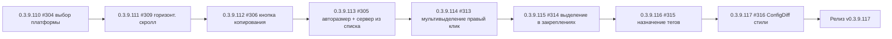

# PLAN — цикл 0.3.9.110–0.3.9.117 — обработка issues #304/#305/#306/#309/#313/#314/#315/#316

Репозиторий [`sivatorov/ConfigurationManagement`](https://github.com/sivatorov/ConfigurationManagement),
локальная копия `f:\Yandex.Disk\h\Configuration_Management`, ветка `main`, HEAD = 0.3.9.109
(commit 7547519, синхронизирован с origin). Первый цикл 0.3.9.101–0.3.9.109 завершён:
релиз v0.3.9.109 опубликован; автор issues (7OH) оставил новые комментарии в #304/#305/#306/#309
и создал новые issues #313/#314/#315/#316.

Режим: Архитектор (план) → цепочка задач-исполнителей в режиме **code**.
**Один issue = одна задача = одна версия = один коммит.** Issues НЕ закрываются (их закрывает автор).
План-файл остаётся untracked (plans/ в .codeassistantignore); CHANGELOG/README коммитятся.

---

## 1. Сводка

Обрабатываем 8 открытых issues, по одному пункту на задачу, в порядке, заданном
пользователем: сначала регрессы (#304, #309), затем окно создания ИБ (#306, #305),
затем мультивыделение/закрепления (#313, #314), затем теги и стили (#315, #316),
в конце — сборка и релиз:

| № | Версия  | Issue | Суть | Сложность |
|---|---------|-------|------|-----------|
| 1 | 0.3.9.110 | #304 | Регресс: выбор 8.5.1 + фильтр x64 → выделение «скачет» на 8.5 (исправление 0.3.9.101 неполное) | средняя |
| 2 | 0.3.9.111 | #309 | Горизонтальный скролл есть, но extent не хватает до последней (новой) колонки | средняя |
| 3 | 0.3.9.112 | #306 | Кнопка копирования должна стоять у поля «Наименование» и копировать из «Имя базы на сервере» | низкая |
| 4 | 0.3.9.113 | #305 | Окно создания серверной ИБ: авторазмер под содержимое + выбор сервера 1С из списка | средняя |
| 5 | 0.3.9.114 | #313 | Мультивыделение Ctrl+Click: правый клик теряет первую базу выделения | средняя |
| 6 | 0.3.9.115 | #314 | Лишнее выделение: строка списка дублируется на закреплённые (pinned) | средняя |
| 7 | 0.3.9.116 | #315 | Назначение тега: выбор из списка существующих тегов с мультивыбором | средняя |
| 8 | 0.3.9.117 | #316 | ConfigDiff: надписи не читаются (цвета текста не привязаны к теме) | низкая |
| 9 | 0.3.9.117 | релиз | Сборка Windows+Linux single-file, пуш, релиз v0.3.9.117 | средняя |

Общие требования К КАЖДОЙ задаче (кроме финальной):
1. Реализация на обеих платформах (Windows/WPF + Linux/Avalonia).
2. Поднять версию в `Configuration Management.csproj` (строки 62–65: Version/AssemblyVersion/FileVersion/InformationalVersion).
3. Запись в CHANGELOG.md (сверху, формат как у прошлых версий) и обновить бейдж версии в README.md (строка 3).
4. Тесты: `dotnet test` зелёный + `dotnet build -p:BuildLinux=true` без ошибок (компиляция Linux-ветки обязательна после каждого изменения).
5. Комментарий в issue: файл `publish/comment-NNN-0.3.9.XXX.md` + публикация:
   `gh api repos/sivatorov/ConfigurationManagement/issues/NNN/comments -f body=@publish/comment-NNN-0.3.9.XXX.md`
   (текст: что исправлено и в какой версии; issue НЕ закрывать).
6. Один коммит (без пуша). Коммит-сообщение по образцу: `fix: ...; 0.3.9.XXX` / `feat: ...; 0.3.9.XXX`.
7. В конце задачи — запустить следующую задачу через `new_task(mode=code)` с инструкцией
   следующего пункта (сообщения-инструкции — в разделе 4).

---

## 2. Ключевые якоря кодовой базы (разведка выполнена 2026-09-28)

### Общее
- Версия: [`Configuration Management.csproj`](Configuration%20Management/Configuration%20Management.csproj:62) — 4 поля, строки 62–65.
- Локализация: `Configuration Management/Localization/Languages/ru.json`, `en.json`.
- Формат комментариев/релизов: `publish/comment-*.md`, `publish/release_body_*.md`.

### #304 — PlatformVersionPickerWindow (выбор версии платформы)
- WPF: [`Views/PlatformVersionPickerWindow.xaml.cs`](Configuration%20Management/Views/PlatformVersionPickerWindow.xaml.cs)
  — `RefreshTree()` 51–67 (BeginInvoke Loaded → ExpandAll → `SelectCurrent(_currentVersion)`),
  `OnArchFilter_Changed` 117–124, `OnSortAsc/Desc_Click` 126–140,
  `OnPlatformsTree_SelectedItemChanged` 142–161 (после 0.3.9.101 пишет и `_selectedVersion`, и `_currentVersion`),
  `BuildResult` 168–179, `SelectCurrent` 227–235, `FindBestNode` 244–270, `FindExactLeaf` 292–303,
  `MatchesCurrent` 305–313 (сравнивает ТОЛЬКО версию, без разрядности), `FilterByArchitecture` 69–85.
- Avalonia: [`Views/PlatformVersionPickerWindow.Avalonia.cs`](Configuration%20Management/Views/PlatformVersionPickerWindow.Avalonia.cs)
  — зеркальные методы: `RefreshTree` 310–322 (синхронный вызов `SelectCurrent(tree)`),
  `SelectionChanged` 191–207 (обновляет `_currentVersion`), `SelectCurrent` 357–369,
  `FindBestNode` 391–416, `FindExactLeaf` 434–444, `FilterByArchitecture` 324–339,
  `OnTreeContainerPrepared` 535–554 (выделение листа по мере раскрытия предков).
- Сервис дерева: [`Services/PlatformVersionService.cs`](Configuration%20Management/Services/PlatformVersionService.cs:673)
  — `BuildGroupedTree` 673–728 (линия → группа сборок → лист; лист всегда есть, даже для 3-частной версии);
  `ParseVariant` 593–612 (по умолчанию возвращает arch="32", даже без суффикса!).
- Ключевые подозрения регресса (сценарий 7OH «была 8.5.4, выбрал 8.5.1, x64 → выделяет 8.5»):
  1. `FilterByArchitecture` для x64 пропускает `label == "x64" || label == ""`, но вариант БЕЗ суффикса
     `ParseVariant` считает x32 (`label = "x32"`) → версия без явной метки исчезает из фильтра x64,
     выбранный узел в новом дереве отсутствует.
  2. `FindExactLeaf`/`MatchesCurrent` игнорируют разрядность → при двух сборках одной версии
     (x32+x64) может быть выбран не тот лист.
  3. Нет fallback: если выбранный узел не найден в отфильтрованном дереве, `SelectCurrent` ничего
     не делает — визуально выбор «скачет», а `_selectedVersion` уже сброшен перестроением ItemsSource.
  4. WPF: `RefreshTree` идёт через BeginInvoke(Loaded) — между установкой ItemsSource и восстановлением
     выбора SelectionChanged приходит с null (сбрасывает `_selectedVersion`).

### #309 — горизонтальный скролл списка
- Avalonia: [`Views/MainWindow.Avalonia.cs`](Configuration%20Management/Views/MainWindow.Avalonia.cs:1289)
  — внешний `listArea` (ScrollViewer, Horizontal=Auto, Vertical=Disabled), `_listScroll` 1295;
  внутренняя прокрутка дерева: `ScrollViewer.SetHorizontalScrollBarVisibility(_tree, Hidden)` 1211.
- Avalonia колонки: [`Views/MainWindow.Avalonia.Columns.cs`](Configuration%20Management/Views/MainWindow.Avalonia.Columns.cs:666)
  — `UpdateListMinWidth()` 666–689 (`_listContent.MinWidth = nameWidth + lead + padding*2 + values`),
  `AddListColumns` ~865–885 (колонки данных с `Width = GridLength(columns[i].Width)` + MinWidth).
- Avalonia синхронизация полосы: [`Views/MainWindow.Avalonia.Scroll.cs`](Configuration%20Management/Views/MainWindow.Avalonia.Scroll.cs:35)
  — `AttachVerticalScrollBar` 35–105 (внутренняя горизонталь держится на нуле, extent даёт внешний listArea).
- WPF: [`Views/MainWindow.xaml`](Configuration%20Management/Views/MainWindow.xaml:69)
  — `CardScrollViewer` 69–118 (Horizontal=Auto), `DbHeaderScroll` 809–811 (Hidden/Disabled),
  `HeaderGrid MinWidth={ActualWidth MainTree}` 817, `MainTree` 1254+ (`ScrollViewer.HorizontalScrollBarVisibility=Auto`).
- Комментарий 7OH: «скрол появился, но его размера не хватает, чтобы хоть немного на новую колонку хватило».
  Подозрение: `UpdateListMinWidth()` не учитывает ВСЕ видимые колонки (например, колонку «Действия»
  или добавленную в 0.3.9.86/90 новую колонку), либо применяется не к тому контейнеру, и внутренний
  ScrollViewer дерева сжимает контент до вьюпорта → внешний extent = ширина окна.

### #306 — кнопка копирования в окне создания ИБ
- WPF: [`Views/CreateInfobaseWindow.xaml`](Configuration%20Management/Views/CreateInfobaseWindow.xaml:77)
  — кнопка `OnCopyRefToName_Click` СТОИТ у поля RefBox («Имя базы на сервере», строки 78–89);
  поле NameBox («Наименование») — строки 46–47 (без кнопки).
  Обработчик: [`Views/CreateInfobaseWindow.xaml.cs`](Configuration%20Management/Views/CreateInfobaseWindow.xaml.cs:542)
  — `OnCopyRefToName_Click` 542–547 (копирует RefBox → NameBox; пустой Ref не затирает Name).
- Avalonia: [`Views/CreateInfobaseWindow.Avalonia.cs`](Configuration%20Management/Views/CreateInfobaseWindow.Avalonia.cs:285)
  — `copyRef` 285–294 (у _refBox), `CopyRefToName()` 833–838 (Ref → Name), `_nameBox` 40.
- Требование 7OH: кнопка должна стоять у ВТОРОГО поля («Наименование», NameBox) и копировать
  из ПЕРВОГО («Имя базы на сервере», RefBox). Направление копирования не меняется (Ref → Name),
  меняется только место кнопки (и, возможно, текст тултипа).

### #305 — окно создания серверной ИБ: авторазмер + выбор сервера 1С из списка
- WPF окно: [`Views/CreateInfobaseWindow.xaml`](Configuration%20Management/Views/CreateInfobaseWindow.xaml:9)
  — Width=620 Height=640 MinHeight=420 MaxHeight=800 ResizeMode=CanResizeWithGrip; ScrollViewer 36–37;
  ServerPanel (компактный макет 0.3.9.108): ServerBox 76 (TextBox!), RefBox 83, DbmsBox 91, DbServerBox/DbPortBox 121–126.
- Avalonia окно: [`Views/CreateInfobaseWindow.Avalonia.cs`](Configuration%20Management/Views/CreateInfobaseWindow.Avalonia.cs:49)
  — `_serverBox` 49 (TextBox), `_refBox` 50; конструктор 96–138: пустой режим — SizeToContent.Height + CanResize=false;
  шаблонный — Height=640/MinHeight=420/MaxHeight=800/CanResize=true.
- Вызовы окна: WPF [`ViewModels/MainViewModel.Commands.cs`](Configuration%20Management/ViewModels/MainViewModel.Commands.cs:73)
  — `new CreateInfobaseWindow(fromTemplate, platformVersions, defaultGroupPath, groups)`;
  Avalonia [`ViewModels/MainViewModel.Avalonia.cs`](Configuration%20Management/ViewModels/MainViewModel.Avalonia.cs:1365)
  — `new CreateInfobaseWindow(fromTemplate, InstalledPlatformVersions(), defaultGroupPath, _groups)`.
- Образец «сервер из списка»: окно правки базы `ConnectionSettingsWindow` принимает
  `availableServers` (конструктор [`Views/ConnectionSettingsWindow.xaml.cs`](Configuration%20Management/Views/ConnectionSettingsWindow.xaml.cs:40),
  `_viewModel.SetAvailableServers` 67), список формируется:
  WPF `GetAvailableServers()` [`ViewModels/MainViewModel.Commands.cs`](Configuration%20Management/ViewModels/MainViewModel.Commands.cs:145);
  Avalonia `AvailableServers()` [`ViewModels/MainViewModel.Avalonia.cs`](Configuration%20Management/ViewModels/MainViewModel.Avalonia.cs:1471)
  (уникальные серверы всех клиент-серверных баз).
- Требования 7OH: (а) окно само подгоняет высоту под содержимое, чтобы всё влезало без прокрутки
  (SizeToContent/расчёт высоты, с учётом MaxHeight=800 и MinHeight=420; при переключении типа
  File↔ClientServer контент меняется — пересчёт); (б) поле «Сервер 1С» — выбор из списка
  известных серверов (ComboBox IsEditable, как DbmsBox), плюс свободный ввод.

### #313 — мультивыделение: правый клик теряет первую базу
- Avalonia: [`Controls/LeveledTreeView.Avalonia.cs`](Configuration%20Management/Controls/LeveledTreeView.Avalonia.cs:83)
  — `OnRowPointerPressed` 83–136: Ctrl+Click → `vm.ToggleBatchSelection(rowBase, "Ctrl")` (109–113);
  Shift+Left → `vm.SelectRange(...)` (115–123); иначе `SelectRow(row)` + e.Handled (125–126),
  ClearBatchSelection ТОЛЬКО для левой кнопки (130–135). `SelectRow` 169–178.
- WPF: [`Views/MainWindow.Events.cs`](Configuration%20Management/Views/MainWindow.Events.cs:538)
  — правый клик `OnInfobaseTree_PreviewMouseRightButtonDown` 538–561 (IsSelected=true + SelectedInfobase,
  batch НЕ трогает); левый клик `OnInfobaseTree_PreviewMouseLeftButtonDown` 570–675 (Ctrl+Click → ToggleBatchSelection 614–621,
  Shift → SelectRange 624–630, обычный → ClearBatchSelection + ApplySelection 631–636).
- VM: [`ViewModels/MainViewModel.Batch.cs`](Configuration%20Management/ViewModels/MainViewModel.Batch.cs:58)
  — `ToggleBatchSelection` 58–71, `SelectRange` ~72–105, `ClearBatchSelection` 108–115,
  `SetBatchSelected` 120–127 (Id-набор + флаг IsBatchSelected).
- Контекстное меню: Avalonia [`Views/MainWindow.Avalonia.Tree.cs`](Configuration%20Management/Views/MainWindow.Avalonia.Tree.cs:1733)
  — `BuildRowContextMenu`, блок «Для выделенных (N)» ~1779–1781; WPF — контекстное меню в `MainWindow.xaml`
  (пункт «Для выделенных», обработчики `OnBatchAssignTag_Click` и т.п. [`Views/MainWindow.Events.cs`](Configuration%20Management/Views/MainWindow.Events.cs:709)).
- Гипотезы: правый клик меняет SelectedItem/SelectedInfobase → обработчик смены выбора
  (Avalonia `OnTreeSelectionChanged` [`Views/MainWindow.Avalonia.Events.cs`](Configuration%20Management/Views/MainWindow.Avalonia.Events.cs:154);
  WPF `OnMainTree_SelectedItemChanged`) где-то переписывает/сбрасывает batch-набор; либо
  повторный ToggleBatchSelection из-за дублирования базы в «Закреплённых» (база в наборе,
  правый клик по другой копии той же базы → toggle её обратно). Проверить цепочку событий
  правого клика и не уменьшается ли `_batchSelectedIds` (первая база).

### #314 — лишнее выделение в закреплениях
- Механизм закрепления: `Infobase.IsPinned` ([`Models/Infobase.cs`](Configuration%20Management/Models/Infobase.cs:81)),
  узел «Закреплённые» = `GroupNodeViewModel` c `PinnedMarker` ([`ViewModels/GroupNodeViewModel.cs`](Configuration%20Management/ViewModels/GroupNodeViewModel.cs:24));
  построение дерева: WPF [`ViewModels/MainViewModel.Theme.cs`](Configuration%20Management/ViewModels/MainViewModel.Theme.cs:679)
  (pinnedNode, закреплённая база кладётся в «Закреплённые» ПРЯМЫМ экземпляром Infobase — дубль данных в дереве!);
  Avalonia [`ViewModels/MainViewModel.Avalonia.cs`](Configuration%20Management/ViewModels/MainViewModel.Avalonia.cs:836)
  + обёртка [`ViewModels/PinnedInfobaseItem.Avalonia.cs`](Configuration%20Management/ViewModels/PinnedInfobaseItem.Avalonia.cs:23)
  (уникальные данные — issue #301).
- Разметка выделения WPF: [`Views/MainWindow.xaml`](Configuration%20Management/Views/MainWindow.xaml:2128)
  — `ItemContainerStyle` 2128–2308; триггеры подсветки: DataTrigger на `IsSelected` модели/родителя
  (1396–1398, 1643–1649, 2283–2285). Так как закреплённая база в WPF — ОДИН объект в двух узлах,
  штатные триггеры по данным могут красить обе копии.
- Avalonia: `ContainerForItemPreparedOverride` [`Controls/LeveledTreeView.Avalonia.cs`](Configuration%20Management/Controls/LeveledTreeView.Avalonia.cs:576)
  — заглушка подсветки; `ContainerForItem`/`ContainerForItemWithin` 460–511 (первая копия = «Закреплённые»);
  комментарий 7OH «выделяются все закрепленные» — проверить подсветку всего узла «Закреплённые»
  (GroupNodeViewModel.IsSelected) и синхронизацию SelectedItems.
- Решение: WPF — перенести механизм уникальных данных как в Avalonia (обёртка PinnedInfobaseItem)
  ИЛИ перевести подсветку на строго контейнерный принцип (код-behind, как Avalonia SelectRow);
  Avalonia — проверить, что выбор строки не подсвечивает узел «Закреплённые» целиком.

### #315 — назначение тега: выбор из списка с мультивыбором
- Текущий диалог: `NameInputWindow` (WPF [`Views/NameInputWindow.xaml.cs`](Configuration%20Management/Views/NameInputWindow.xaml.cs:20),
  Avalonia [`Views/NameInputWindow.Avalonia.cs`](Configuration%20Management/Views/NameInputWindow.Avalonia.cs:25)) —
  одно текстовое поле.
- Точки вызова: WPF [`Views/MainWindow.Events.cs`](Configuration%20Management/Views/MainWindow.Events.cs:710)
  — `OnBatchAssignTag_Click` 710–724 (NameInputWindow → `AssignTagToBatch` → ClearBatchSelection);
  Avalonia [`Views/MainWindow.Avalonia.Tree.cs`](Configuration%20Management/Views/MainWindow.Avalonia.Tree.cs:1915)
  — `OnBatchAssignTagClick` 1915–1926 (то же).
- VM: [`ViewModels/MainViewModel.BatchCommands.cs`](Configuration%20Management/ViewModels/MainViewModel.BatchCommands.cs:27)
  — `AssignTagToBatch(string?)` 27+; Avalonia-аналог [`ViewModels/MainViewModel.Avalonia.BatchCommands.cs`](Configuration%20Management/ViewModels/MainViewModel.Avalonia.BatchCommands.cs:26).
- Источник существующих тегов: WPF `AvailableTags` (уникальные теги всех баз — передаётся в
  ConnectionSettingsWindow), Avalonia `TagFilterItems` ([`ViewModels/MainViewModel.Avalonia.cs`](Configuration%20Management/ViewModels/MainViewModel.Avalonia.cs:407)).
- Требование 7OH: «По хорошему тут должен быть выбор из списка. По идеальному - выбрать можно будет
  сразу несколько тегов». Новое окно-чеклист (список существующих тегов с CheckBox + поле ввода
  нового тега) на обеих платформах; VM-метод назначения нескольких тегов (или цикл AssignTagToBatch).

### #316 — ConfigDiff: нечитаемые надписи
- Avalonia: [`Views/ConfigDiffSetupWindow.Avalonia.cs`](Configuration%20Management/Views/ConfigDiffSetupWindow.Avalonia.cs:69)
  — TextBlock'и БЕЗ привязки Foreground к теме (описание 72–78, метки 91/106/111/115, hint 118–121;
  только `_errorText` 124 с жёстким цветом). [`Views/ConfigDiffResultWindow.Avalonia.cs`](Configuration%20Management/Views/ConfigDiffResultWindow.Avalonia.cs:41)
  — то же (header 41–48, meta 51–53, summary 55–62, typeHeader 68–75, объекты 144–162 с Opacity).
- WPF: [`Views/ConfigDiffSetupWindow.xaml`](Configuration%20Management/Views/ConfigDiffSetupWindow.xaml:19)
  — Style TargetType=TextBlock → TextPrimaryBrush (есть!); [`Views/ConfigDiffResultWindow.xaml`](Configuration%20Management/Views/ConfigDiffResultWindow.xaml:20)
  — то же. Проверить обе WPF-версии на светлой/тёмной теме и ProgressWindow
  ([`Views/ConfigDiffProgressWindow.cs`](Configuration%20Management/Views/ConfigDiffProgressWindow.cs),
  [`Views/ConfigDiffProgressWindow.Avalonia.cs`](Configuration%20Management/Views/ConfigDiffProgressWindow.Avalonia.cs)).
- Эталон: остальные окна Avalonia привязывают текст к теме через
  `ThemeBrushes.Bind(tb, TextBlock.ForegroundProperty, "TextPrimaryBrush"/"TextSecondaryBrush")`
  (примеры: GroupPickerWindow.Avalonia.cs:592, ActualReleasesWindow.Avalonia.cs:318, SettingsWindow.Avalonia.cs:3377).
- Решение: во всех ConfigDiff-окнах (обе платформы) привязать цвета текста к теме (или добавить
  оконный Style как в WPF); проверить читаемость в обеих темах.

---

## 3. Детали задач

### Задача 1 — 0.3.9.110, issue #304
**Что:** устранить неполное исправление 0.3.9.101: сценарий «текущая версия 8.5.4 → выбрать 8.5.1
(лист или группу сборок) → переключить фильтр x64 → выделение уходит на папку 8.5 (или теряется)».
**Как:**
1. Воспроизвести сценарий на обеих платформах (WPF и Avalonia), зафиксировать, какой узел
   выделяется и какое значение у `_currentVersion`/`_selectedVersion` на каждом шаге.
2. Исправить логику восстановления выбора в `RefreshTree`/`SelectCurrent`:
   - поиск точного ЛИСТА с учётом разрядности (`FindExactLeaf`/`MatchesCurrent` — сравнивать
     version+arch, а не только version);
   - при отсутствии выбранного узла в отфильтрованном дереве — fallback на родительский узел
     (группа сборок → линия), но так, чтобы результат диалога не терялся;
   - не сбрасывать `_selectedVersion` во время перестроения (WPF: восстановление до BeginInvoke
     или сохранение результата отдельным полем).
3. Проверить влияние `FilterByArchitecture` (варианты без явного суффикса разрядности при фильтре
   x64 — ParseVariant считает их x32): при необходимости «без метки» пропускать в x64 (как линию
   «8.3» в стартере) либо корректно помечать недоступность.
4. Сохранить поведение #251 (частичная версия в режиме «Все» — без суффикса) и #142 (выбор листа/папки).
**Affected:** `Views/PlatformVersionPickerWindow.xaml.cs`, `Views/PlatformVersionPickerWindow.Avalonia.cs`,
при необходимости `Services/PlatformVersionService.cs` (вынести helper поиска узла для тестов).
**Тесты:** ручная проверка сценария 7OH на обеих платформах (текущая 8.5.4 → 8.5.1 → x64 →
выделение на 8.5.1; фильтры x32/x64/«Все»; сортировка; лист и папка). Если логика вынесена в
чистый helper — юнит-тест: поиск листа по версии+разрядности, группа сборок, fallback.
**Комментарий:** `publish/comment-304-0.3.9.110.md`.

### Задача 2 — 0.3.9.111, issue #309
**Что:** горизонтальный скролл есть, но не прокручивает до конца — extent меньше фактической
ширины колонок (не хватает «на новую колонку»).
**Как:**
1. Avalonia: проверить `UpdateListMinWidth()` ([`MainWindow.Avalonia.Columns.cs`](Configuration%20Management/Views/MainWindow.Avalonia.Columns.cs:666))
   — сумма ширин должна включать ВСЕ видимые колонки (`ListColumns()` + «Действия» + колонка имени +
   ведущие кнопки); сверить с фактическим `Extent.Width` внешнего `listArea`; убедиться, что
   `_listContent.MinWidth` доходит до внутреннего ScrollViewer дерева (иначе он сжимает контент).
2. WPF: проверить `MainTree` (`ScrollViewer.HorizontalScrollBarVisibility=Auto`) и `HeaderGrid`
   (`MinWidth=ActualWidth(MainTree)`); при необходимости задать минимальную ширину контента списка
   по сумме колонок (аналог UpdateListMinWidth) — проверить `MainWindow.Columns.cs`.
3. Проверить синхронизацию заголовка с данными при горизонтальной прокрутке (обе платформы) и
   Shift+колесо (Avalonia `MainWindow.Avalonia.Events.cs:64-85`).
**Affected:** `Views/MainWindow.Avalonia.Columns.cs`, `Views/MainWindow.Avalonia.cs`, `Views/MainWindow.xaml`,
`Views/MainWindow.Columns.cs` (при необходимости).
**Тесты:** ручная проверка: узкое окно → полоса прокрутки доходит до последней колонки, заголовок
синхронен, «Название» остаётся достижимой. При выносе расчёта ширины — юнит-тест суммы ширин колонок.
**Комментарий:** `publish/comment-309-0.3.9.111.md`.

### Задача 3 — 0.3.9.112, issue #306
**Что:** кнопка копирования стоит не у того поля: нужна у поля «Наименование» (NameBox),
копирующая из «Имя базы на сервере» (RefBox).
**Как:**
1. WPF: [`CreateInfobaseWindow.xaml`](Configuration%20Management/Views/CreateInfobaseWindow.xaml:46) —
   обернуть NameBox в Grid (TextBox + кнопка-иконка ContentCopy, как у RefBox сейчас, строки 78–89);
   убрать кнопку из строки RefBox (вернуть простой TextBox); обработчик `OnCopyRefToName_Click`
   (542–547) оставить (направление Ref→Name сохраняется).
2. Avalonia: [`CreateInfobaseWindow.Avalonia.cs`](Configuration%20Management/Views/CreateInfobaseWindow.Avalonia.cs:285) —
   перенести кнопку `copyRef` к строке `_nameBox`, убрать у `_refBox`; `CopyRefToName()` (833–838) оставить.
3. Обновить тултип/локализацию `CreateInfobase.CopyRefToName` (ru/en), чтобы отражал направление
   («вставить имя базы на сервере в наименование»), если текст неоднозначен.
**Affected:** `Views/CreateInfobaseWindow.xaml`, `Views/CreateInfobaseWindow.xaml.cs`,
`Views/CreateInfobaseWindow.Avalonia.cs`, `Localization/Languages/ru.json`, `en.json`.
**Тесты:** ручная проверка: ввести Ref → клик у «Наименования» → Name заполнен; пустой Ref не
затирает Name; кнопки у Ref больше нет.
**Комментарий:** `publish/comment-306-0.3.9.112.md`.

### Задача 4 — 0.3.9.113, issue #305
**Что:** (а) окно создания серверной ИБ должно само подгонять размер, чтобы всё влезало без
прокрутки; (б) «Сервер 1С» выбирается из списка известных серверов (как при правке базы), а не
только ручным вводом.
**Как:**
1. Авторазмер (WPF): в XAML заменить фиксированную `Height=640` на `SizeToContent="Height"`
   (сохранить Width=620, MinHeight=420, MaxHeight=800, CanResizeWithGrip); проверить, что при
   переключении TypeBox (файловая ↔ клиент-серверная) и TemplatePanel окно пересчитывает высоту.
   Avalonia: пустой режим уже `SizeToContent.Height` — оставить; шаблонный (с деревом шаблонов)
   перевести на `SizeToContent.Height` + MaxHeight=800 (вместо фикс. 640), сохранив CanResize.
2. Выбор сервера 1С из списка:
   - WPF: `ServerBox` (TextBox, строка 76) → `ComboBox IsEditable` (как DbmsBox), ItemsSource =
     availableServers; Avalonia: `_serverBox` (TextBox, строка 49) → ComboBox IsEditable.
   - Пробросить список: новый параметр `IEnumerable<string>? availableServers` в конструктор
     `CreateInfobaseWindow` (WPF xaml.cs:36, Avalonia .cs:96); обновить вызовы:
     WPF [`MainViewModel.Commands.cs`](Configuration%20Management/ViewModels/MainViewModel.Commands.cs:73)
     (`GetAvailableServers()`), Avalonia [`MainViewModel.Avalonia.cs`](Configuration%20Management/ViewModels/MainViewModel.Avalonia.cs:1365)
     (`AvailableServers()`).
   - Чтение значения при создании: `ServerBox.Text`/`_serverBox.Text` (у editable ComboBox так же).
3. Не ломать компактный макет 0.3.9.108, живую подсказку DBSrvr и порт СУБД; прогнать сценарии
   создания файловой и серверной ИБ (шаблонный путь .cf/.dt тоже).
**Affected:** `Views/CreateInfobaseWindow.xaml`, `Views/CreateInfobaseWindow.xaml.cs`,
`Views/CreateInfobaseWindow.Avalonia.cs`, `ViewModels/MainViewModel.Commands.cs`,
`ViewModels/MainViewModel.Avalonia.cs`, локализация (при необходимости).
**Тесты:** ручная проверка: окно открывается без вертикальной прокрутки и само подстраивается при
смене типа; сервер выбирается из списка и вводится вручную; создание серверной ИБ с выбранным
сервером; существующие тесты `CreateInfobaseDbServerStringTests` зелёные.
**Комментарий:** `publish/comment-305-0.3.9.113.md`.

### Задача 5 — 0.3.9.114, issue #313
**Что:** при мультивыделении Ctrl+Click правый клик «теряет первую базу» из набора.
**Как:**
1. Воспроизвести на обеих платформах: Ctrl+клик по 2–3 базам → правый клик (по строке/по
   выделенной) → проверить набор `_batchSelectedIds` до/после и содержимое блока «Для выделенных».
2. Проследить цепочку правого клика:
   - WPF: `OnInfobaseTree_PreviewMouseRightButtonDown` (Events.cs:538) → `SelectedItemChanged`
     (`OnMainTree_SelectedItemChanged`) → ContextMenuOpening; найти, где сбрасывается первая база
     (возможно, повторный ToggleBatchSelection из-за дубля базы в «Закреплённых», либо
     ClearBatchSelection в обработчике смены выбора).
   - Avalonia: `LeveledTreeView.OnRowPointerPressed` (83–136) → `SelectRow` → `SelectedItemChanged`
     (`OnTreeSelectionChanged` Events.cs:154) → `BuildRowContextMenu` (Avalonia.Tree.cs:1733).
3. Исправить так, чтобы правый клик НЕ менял batch-набор (только основное выделение под курсором);
   поведение Shift-диапазона и обычного клика не менять.
**Affected:** `Controls/LeveledTreeView.Avalonia.cs`, `Views/MainWindow.Events.cs`,
`Views/MainWindow.Avalonia.Events.cs`, `Views/MainWindow.Avalonia.Tree.cs` (BuildRowContextMenu),
`Views/MainWindow.xaml` (контекстное меню WPF), `ViewModels/MainViewModel.Batch.cs` (при необходимости).
**Тесты:** ручная проверка обеих платформ: Ctrl+2-3 базы → правый клик → меню содержит все базы,
ни одна не теряется; Ctrl+клик по уже выбранной — снимает её; Shift-диапазон работает.
**Комментарий:** `publish/comment-313-0.3.9.114.md`.

### Задача 6 — 0.3.9.115, issue #314
**Что:** при выделении строки в списке подсвечивается её копия в узле «Закреплённые»; при
выделении одной закреплённой базы «выделяются все закреплённые».
**Как:**
1. Разобраться с механизмом подсветки выделения:
   - WPF: закреплённая база = ОДИН объект `Infobase` в двух узлах («Закреплённые» + своя группа);
     проверить DataTrigger'ы в `ItemContainerStyle` (MainWindow.xaml:1396–1398, 1643–1649, 2283–2285) —
     не красят ли они обе копии по данным. Решение-эталон: как в Avalonia (#301) — обёртка
     `PinnedInfobaseItem` (уникальные данные у каждой строки) либо подсветка строго по контейнеру
     (выбор через code-behind без триггеров по данным).
   - Avalonia: обёртка уже есть; проверить подсветку узла «Закреплённые» целиком
     (`GroupNodeViewModel.IsSelected`), `ContainerForItemPreparedOverride` (LeveledTreeView.Avalonia.cs:576)
     и синхронизацию SelectedItems.
2. Убедиться, что клик по строке в списке и по строке в «Закреплённых» подсвечивает ровно одну
   строку (обе платформы), и команды правой панели работают по реальной базе.
**Affected:** `Views/MainWindow.xaml` (ItemContainerStyle/триггеры), `Controls/LeveledTreeView.Avalonia.cs`,
`Views/MainWindow.Tree.cs` (WPF helpers), `ViewModels/GroupNodeViewModel.cs`,
`ViewModels/GroupNodeViewModel.Avalonia.cs`, `ViewModels/PinnedInfobaseItem.Avalonia.cs` (при необходимости).
**Тесты:** ручная проверка обеих платформ: выделение закреплённой базы в списке не подсвечивает
«Закреплённые» и наоборот; выделение одной базы не красит все закреплённые; клавиатурная
навигация и «Найти в списке» (#285/#301) не регрессируют.
**Комментарий:** `publish/comment-314-0.3.9.115.md`.

### Задача 7 — 0.3.9.116, issue #315
**Что:** диалог назначения тега (для мультивыделения) вместо текстового ввода — выбор из списка
существующих тегов с мультивыбором (+ возможность ввести новый).
**Как:**
1. Новое окно `TagPickWindow` (WPF `Views/TagPickWindow.xaml(.cs)`, Avalonia `Views/TagPickWindow.Avalonia.cs`
   на `ModalWindowBase`, как `GroupPickerWindow`/`BackupScenariosWindow`): список существующих тегов
   с CheckBox (мультивыбор), поле ввода нового тега (+ «Добавить»), OK/Отмена; результат —
   выбранные теги.
2. Источник тегов: WPF — `AvailableTags` (передать как параметр или читать через VM);
   Avalonia — `TagFilterItems.Select(t => t.Name)`.
3. Заменить вызовы NameInputWindow: WPF `OnBatchAssignTag_Click` (Events.cs:710–724),
   Avalonia `OnBatchAssignTagClick` (Avalonia.Tree.cs:1915–1926); добавить в VM метод
   `AssignTagsToBatch(IEnumerable<string>)` (WPF + Avalonia BatchCommands) — добавить каждый тег
   каждой базе (регистронезависимо, без дублей), затем ClearBatchSelection.
4. Локализация ru/en (заголовок, подсказка, «выбрано N»), CHANGELOG/README.
**Affected (новые):** `Views/TagPickWindow.xaml`, `Views/TagPickWindow.xaml.cs`,
`Views/TagPickWindow.Avalonia.cs`;
**Affected (существующие):** `Views/MainWindow.Events.cs`, `Views/MainWindow.Avalonia.Tree.cs`,
`ViewModels/MainViewModel.BatchCommands.cs`, `ViewModels/MainViewModel.Avalonia.BatchCommands.cs`,
локализация.
**Тесты:** ручная проверка: выбор 1..N тегов → применяются все; новый тег можно ввести; пустой
выбор → отмена. При изоляции — юнит-тест добавления нескольких тегов (без дублей, регистронезависимо).
**Комментарий:** `publish/comment-315-0.3.9.116.md`.

### Задача 8 — 0.3.9.117, issue #316
**Что:** в окнах ConfigDiff все надписи не читаются (цвета текста не привязаны к теме —
вероятно, белый текст на светлой подложке).
**Как:**
1. Avalonia: в `ConfigDiffSetupWindow.Avalonia.cs` и `ConfigDiffResultWindow.Avalonia.cs` привязать
   Foreground всех TextBlock/заголовков к теме через `ThemeBrushes.Bind(tb, TextBlock.ForegroundProperty,
   "TextPrimaryBrush"/"TextSecondaryBrush")` (образцы: GroupPickerWindow.Avalonia.cs:592, ActualReleasesWindow.Avalonia.cs:318);
   статусы (Added/Changed/Removed) — как сейчас (жёсткие цвета #22C55E/#F59E0B/#EF4444).
2. WPF: проверить, что оконные стили `Style TargetType="TextBlock"` (ConfigDiffSetupWindow.xaml:19,
   ConfigDiffResultWindow.xaml:20) реально применяются (динамические ресурсы определены в теме);
   при необходимости продублировать явные Foreground.
3. Проверить `ConfigDiffProgressWindow` (`.cs` и `.Avalonia.cs`) и оба режима темы (светлая/тёмная)
   на обеих платформах.
**Affected:** `Views/ConfigDiffSetupWindow.Avalonia.cs`, `Views/ConfigDiffResultWindow.Avalonia.cs`,
`Views/ConfigDiffSetupWindow.xaml`, `Views/ConfigDiffResultWindow.xaml`,
`Views/ConfigDiffProgressWindow.cs`, `Views/ConfigDiffProgressWindow.Avalonia.cs`.
**Тесты:** ручная проверка обеих платформ, светлая и тёмная схемы: все надписи читаемы
(заголовок, описание, метки полей, подсказки, строки результата, статусы).
**Комментарий:** `publish/comment-316-0.3.9.117.md`.

### Задача 9 — релиз v0.3.9.117
**Что:** собрать по 1 исполняемому файлу Windows и Linux, выложить на GitHub, создать релиз.
**Как:**
1. `dotnet test` (все тесты зелёные) + `dotnet build -p:BuildLinux=true` (обе ветки компилируются).
2. Сборка: `powershell -File "Configuration Management/build-windows-single-file.ps1"` (Windows)
   и `bash "Configuration Management/build-linux-single-file.sh"` (Linux); бинарники:
   `ConfigurationManagement.exe` и `ConfigurationManagement-linux-x64` (по инструкциям первого цикла).
3. `publish/release_body_0.3.9.117.md` по образцу `release_body_0.3.9.109.md` (сводка по 8 пунктам,
   таблица файлов, версия, счётчик тестов).
4. `git add -A && git commit` (при необходимости) + `git push origin main`.
5. `gh release create v0.3.9.117 <exe> <linux> --title "Управление конфигурациями 1С — v0.3.9.117" --notes-file publish/release_body_0.3.9.117.md`.
6. Issues #304/#305/#306/#309/#313/#314/#315/#316 НЕ закрывать; при необходимости — итоговый
   комментарий с версией.

---

## 4. Инструкции цепочки задач (для new_task, mode=code)

Каждая задача-исполнитель в конце своего выполнения вызывает
`new_task(mode="code", message=<инструкция следующей задачи>, todos=<чеклист следующей задачи>)`.
Ключевые факты, которые должны быть в каждом сообщении:

- Репозиторий: локальная копия `f:/Yandex.Disk/h/Configuration_Management`, ветка main.
- Версия: следующая версия указана в инструкции; поднять 4 поля в
  `Configuration Management.csproj` (строки 62–65).
- После изменений: запись в CHANGELOG.md сверху, бейдж версии в README.md (строка 3).
- Проверки: `dotnet test` зелёный + `dotnet build -p:BuildLinux=true` без ошибок.
- Комментарий в issue: создать `publish/comment-NNN-0.3.9.XXX.md` и опубликовать
  `gh api repos/sivatorov/ConfigurationManagement/issues/NNN/comments -f body=@publish/comment-NNN-0.3.9.XXX.md`.
- Issue НЕ закрывать. Один коммит на задачу, без пуша (пуш — финальная задача).
- По завершении — запустить следующую задачу через new_task (mode=code) с её инструкцией
  (тексты инструкций — в деталях задач раздела 3; порядок: #304 → #309 → #306 → #305 →
  #313 → #314 → #315 → #316 → релиз).

---

## 5. Риски и примечания

- #304 и #314 связаны с тем, что закреплённая база присутствует в дереве дважды (в WPF — одним
  объектом данных). Меняя логику выделения, обязательно прогнать регресс-сценарии #301/#285/#252
  (выделение, «Найти в списке», восстановление прокрутки).
- #313 и #314 могут иметь общий корень (синхронизация SelectedItem/SelectedItems при дубле базы) —
  если в #313 корень найден как «дубль в закреплениях», часть правок перекрывается с #314;
  каждая задача правит свою версию (0.3.9.114 и 0.3.9.115) — коммиты остаются раздельными.
- #305: изменение размера окна и типа поля «Сервер» — после него обязательно прогнать ручные
  сценарии создания файловой и серверной ИБ, включая шаблонный путь (.cf/.dt) и режим из шаблона.
- #309: правки ширины/скролла затрагивают выравнивание заголовка колонок (issue #214/#255) —
  после изменения прогнать синхронность шапки и данных при горизонтальной прокрутке.
- #316: жёсткие цвета статусов (#22C55E и т.п.) допустимы в обеих темах (как в WPF-версии),
  менять их не нужно — только цвета основного текста.
- Команды gh и окружение проверены пользователем: gh авторизован (repo, workflow), remote/push
  работают; финальный пуш выполняет последняя задача (релиз).