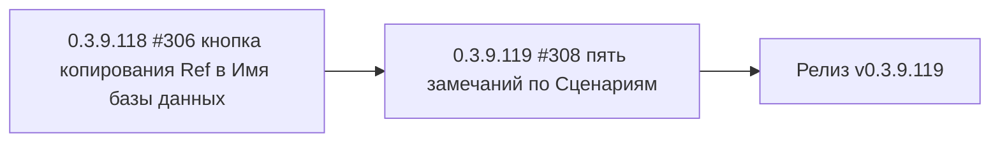

# PLAN — цикл 0.3.9.118–0.3.9.119 — обработка issues #306/#308

Репозиторий [`sivatorov/ConfigurationManagement`](https://github.com/sivatorov/ConfigurationManagement),
локальная копия `f:\Yandex.Disk\h\Configuration_Management`, ветка `main`, HEAD = 0.3.9.117
(commit d91b366, синхронизирован с origin). Второй цикл 0.3.9.110–0.3.9.117 завершён:
релиз v0.3.9.117 опубликован; автор issues (7OH) оставил новые комментарии в #306 и #308.

Режим: Архитектор (план) → цепочка задач-исполнителей в режиме **code**.
**Один issue = одна задача = одна версия = один коммит.** Issues НЕ закрываются (их закрывает автор).
План-файл остаётся untracked (plans/ в .codeassistantignore); CHANGELOG/README коммитятся.

---

## 1. Сводка

Обрабатываем 2 открытых issues. #306 — перенос кнопки копирования на другое поле (одна простая
задача). #308 — 5 замечаний по функциональности «Сценарии»; все пять закрываются ОДНОЙ версией
0.3.9.119: замечания относятся к одной фиче и пересекаются по файлам
(`ScriptScenarioEditWindow.*` правится для пунктов а/в/г/д, `ScriptParameterResolver` — для б),
поэтому разбиение на отдельные версии нецелесообразно (конфликты правок одних файлов,
мусор в истории и CHANGELOG). В конце — сборка, пуш и релиз v0.3.9.119:

| № | Версия  | Issue | Суть | Сложность |
|---|---------|-------|------|-----------|
| 1 | 0.3.9.118 | #306 | Кнопка копирования: источник «Имя базы на сервере» (RefBox), приёмник «Имя базы данных» (DbNameBox); «Наименование» не трогать | низкая |
| 2 | 0.3.9.119 | #308 | 5 замечаний: (а) двойной клик вставляет токен без описания; (б) резолвер принимает все ключи + пароль; (в) комбобокс «База для примера» показывает имя базы; (г) редактирование не плодит копию; (д) свойство «Скрывать окно скрипта» | средняя |
| 3 | 0.3.9.119 | релиз | Сборка Windows+Linux single-file, пуш, релиз v0.3.9.119 | средняя |

Общие требования К КАЖДОЙ задаче (кроме финальной):
1. Реализация на обеих платформах (Windows/WPF + Linux/Avalonia).
2. Поднять версию в `Configuration Management.csproj` (строки 62–65: Version/AssemblyVersion/FileVersion/InformationalVersion).
3. Запись в CHANGELOG.md (сверху, формат как у прошлых версий) и обновить бейдж версии в README.md (строка 3).
4. Тесты: `dotnet test` зелёный + `dotnet build -p:BuildLinux=true` без ошибок (компиляция Linux-ветки обязательна после каждого изменения).
5. Комментарий в issue: файл `publish/comment-NNN-0.3.9.XXX.md` + публикация:
   `gh api repos/sivatorov/ConfigurationManagement/issues/NNN/comments -f body=@publish/comment-NNN-0.3.9.XXX.md`
   (текст: что исправлено и в какой версии; issue НЕ закрывать).
6. Один коммит (без пуша). Коммит-сообщение по образцу: `fix: ...; 0.3.9.XXX` / `feat: ...; 0.3.9.XXX`.
7. В конце задачи — запустить следующую задачу через `new_task(mode=code)` с инструкцией
   следующего пункта (сообщения-инструкции — в разделе 4).

---

## 2. Ключевые якоря кодовой базы (разведка выполнена 2026-09-28)

### Общее
- Версия: [`Configuration Management.csproj`](Configuration%20Management/Configuration%20Management.csproj:62) — 4 поля, строки 62–65.
- Локализация: `Configuration Management/Localization/Languages/ru.json`, `en.json`.
  В ru.json есть несколько блоков `CreateInfobase.*` (строки ~880, ~1232, ~1404) с дублирующимися
  ключами; `CreateInfobase.CopyRefToName` определён один раз (ru.json:1264).
- Формат комментариев/релизов: `publish/comment-*.md`, `publish/release_body_*.md`.

### #306 — кнопка копирования в окне создания ИБ
- WPF: [`Views/CreateInfobaseWindow.xaml`](Configuration%20Management/Views/CreateInfobaseWindow.xaml:46)
  — кнопка `OnCopyRefToName_Click` стоит у поля «Наименование» (NameBox, строки 46–59) и копирует
  Ref → Name (правка 0.3.9.112). Новое требование 7OH: источник «Имя базы (Ref)» = RefBox,
  приёмник «Имя базы данных» = DbNameBox (строки 132–133, правая колонка ServerPanel);
  «Наименование» не трогать.
  Обработчик: [`Views/CreateInfobaseWindow.xaml.cs`](Configuration%20Management/Views/CreateInfobaseWindow.xaml.cs:549)
  — `OnCopyRefToName_Click` 549–554 (пустой Ref не затирает приёмник — поведение сохранить).
- Avalonia: [`Views/CreateInfobaseWindow.Avalonia.cs`](Configuration%20Management/Views/CreateInfobaseWindow.Avalonia.cs:207)
  — кнопка `copyRef` у `_nameBox` (207–223), `CopyRefToName()` 843–848 (Ref → Name);
  `_dbNameBox` выводится в rightCol (строка 361). Перенести кнопку к `_dbNameBox`.
- Сборка запроса: `DbName = _dbNameBox.Text` (Avalonia:890, WPF xaml.cs:622) — поле уже читается,
  менять не нужно.

### #308 — Сценарии: 5 замечаний

**(а) Двойной клик вставляет «токен — описание» вместо токена**
- WPF [`Views/ScriptScenarioEditWindow.xaml.cs`](Configuration%20Management/Views/ScriptScenarioEditWindow.xaml.cs:48)
  — `TokensList.ItemsSource = AvailableTokens.Select(t => t.Token + " — " + T(t.LocalizationKey))`
  (48–50); обработчик `TokensList_MouseDoubleClick` 90–104 вставляет выбранную СТРОКУ целиком.
- Avalonia [`Views/ScriptScenarioEditWindow.Avalonia.cs`](Configuration%20Management/Views/ScriptScenarioEditWindow.Avalonia.cs:128)
  — то же (128–130), `InsertTokenAtCaret` 185–199.
- VM [`ViewModels/ScriptScenarioEditViewModel.cs`](Configuration%20Management/ViewModels/ScriptScenarioEditViewModel.cs:33)
  — `AvailableTokens` уже хранит объекты `ScriptTokenHint` (Token + LocalizationKey).
  Исправить: ItemsSource = объекты `ScriptTokenHint`, отображение «Token — описание» через
  DataTemplate/ItemTemplate, вставлять только `hint.Token`.

**(б) Резолвер принимает не все ключи + нет пароля**
- [`Services/ScriptParameterResolver.cs`](Configuration%20Management/Services/ScriptParameterResolver.cs:31)
  — `BuildValueMap` 31–53: статический список без `password`. `ConnectionSettings.Password` есть
  ([`Models/ConnectionSettings.cs`](Configuration%20Management/Models/ConnectionSettings.cs:38)).
  Требование 7OH: подставлять ЛЮБЫЕ ключи (включая будущие свойства) + пароль.
- Решение: явные ключи для всех текущих свойств (`connection.password`, `password`,
  `connection.blockScheduledJobs`, `connection.forbidSpeechRecognition`,
  `connection.authenticationMode`, `connection.useOsAuthentication`) + динамический проход
  рефлексией по публичным свойствам `ConnectionSettings`/`Infobase` (ключи `connection.<имя>` и
  `<имя>` в нижнем регистре) — будущие свойства подхватятся автоматически; явные ключи
  перезаписывают динамические. Рефлексию кэшировать (static), чтение значений в try/catch.
  Поведение неизвестного ключа (leaveUnknown=true) не менять.

**(в) Комбобокс «База для примера подстановок» показывает не то**
- Avalonia [`ScriptScenarioEditWindow.Avalonia.cs`](Configuration%20Management/Views/ScriptScenarioEditWindow.Avalonia.cs:145)
  — `_exampleBaseCombo.ItemsSource = _infobases;` БЕЗ ItemTemplate/DisplayMemberPath, а
  [`Models/Infobase.cs`](Configuration%20Management/Models/Infobase.cs:12) НЕ переопределяет
  `ToString()` → в комбобоксе отображается полное имя типа («что-то не то»).
  Исправить: DisplayMemberPath/ItemTemplate на `Name`; `SelectedItem = _infobases.FirstOrDefault()`
  уже есть (146).
- WPF [`ScriptScenarioEditWindow.xaml.cs`](Configuration%20Management/Views/ScriptScenarioEditWindow.xaml.cs:61)
  — `DisplayMemberPath = nameof(Infobase.Name)` есть, но `SelectedItem` не выставляется →
  при открытии окна комбобокс пуст, а превью строится по первой базе (`SelectedExampleBase`
  110–113). Выставить `SelectedIndex = 0` / `SelectedItem = FirstOrDefault` для согласованности
  отображения и превью.

**(г) Редактирование сценария создаёт копию**
- WPF [`ScriptScenarioEditWindow.xaml.cs`](Configuration%20Management/Views/ScriptScenarioEditWindow.xaml.cs:140)
  — `Ok_Click`: всегда `var scenario = new ScriptScenario();` → новый Id даже при редактировании
  существующего (переданный `scenario` используется только для предзаполнения VM).
- Avalonia [`ScriptScenarioEditWindow.Avalonia.cs`](Configuration%20Management/Views/ScriptScenarioEditWindow.Avalonia.cs:232)
  — то же в `OkClicked`.
- Исправить: сохранить переданный `scenario` как поле `_sourceScenario`; при OK —
  если `_sourceScenario is not null`, применять поля к нему (`Result = _sourceScenario`),
  иначе создавать новый. `ScriptScenarioStore.Save` по тому же Id перезапишет тот же файл
  (тест `Save_SameId_OverwritesExistingFile` уже есть) — дублей не будет.

**(д) Свойство «Скрывать окно скрипта»**
- [`Models/ScriptScenario.cs`](Configuration%20Management/Models/ScriptScenario.cs:10) — добавить
  `bool HideWindow { get; set; } = true;` (галку ставим = окно скрыто; сняли = окно видимо).
- [`Services/ExternalCommandRunner.cs`](Configuration%20Management/Services/ExternalCommandRunner.cs:111)
  — `CreateStartInfo` жёстко `CreateNoWindow = true` (115–121). Добавить параметр
  `createNoWindow = true` в `CreateStartInfo`, `RunAsync` и `RunDetached` (существующие вызовы
  pre/post-команд функции №8 не меняют поведения — default true).
- Запуск сценариев: [`ViewModels/MainViewModel.Scripts.cs`](Configuration%20Management/ViewModels/MainViewModel.Scripts.cs:96)
  и [`ViewModels/MainViewModel.Avalonia.Scripts.cs`](Configuration%20Management/ViewModels/MainViewModel.Avalonia.Scripts.cs:90)
  — `RunDetached(commandLine)` → `RunDetached(commandLine, createNoWindow: !scenario.HideWindow)`.
- Windows: `cmd.exe` с `CreateNoWindow=false` покажет консольное окно. Linux: `/bin/sh` без
  терминала окно не создаёт (ограничение — документировать в комментарии к issue).
- UI: чекбокс «Скрывать окно» в `ScriptScenarioEditWindow` (WPF + Avalonia), свойство в
  `ScriptScenarioEditViewModel` (+ `ApplyTo` переносит его).

### Прочие якоря
- Регистрация сервиса: [`AppServices.cs`](Configuration%20Management/AppServices.cs:35)
  (`AddSingleton<IScriptScenarioStore, ScriptScenarioStore>()`) — ничего менять не нужно.
- Окна списка/выбора: [`Views/ScriptScenariosWindow.xaml.cs`](Configuration%20Management/Views/ScriptScenariosWindow.xaml.cs:71)
  (`Edit_Click` передаёт `item.Scenario` — Id сохранён, баг только в EditWindow),
  [`Views/ScriptPickWindow.xaml.cs`](Configuration%20Management/Views/ScriptPickWindow.xaml.cs:22);
  Avalonia-версии зеркальны (`ShowDialogSync`).
- Тесты: [`ScriptParameterResolverTests.cs`](ConfigurationManagement.Tests/ScriptParameterResolverTests.cs:13),
  [`ScriptScenarioStoreTests.cs`](ConfigurationManagement.Tests/ScriptScenarioStoreTests.cs:14),
  [`ExternalCommandRunnerTests.cs`](ConfigurationManagement.Tests/ExternalCommandRunnerTests.cs:14)
  — расширяются (см. задачи).

---

## 3. Детали задач

### Задача 1 — 0.3.9.118, issue #306
**Что:** перенести кнопку копирования к полю «Имя базы данных» (DbNameBox): источник — «Имя базы
на сервере» (RefBox), приёмник — «Имя базы данных». Поле «Наименование» (NameBox) больше не
трогается. Пустой Ref не затирает приёмник (поведение сохранить).

**Как:**
1. WPF [`CreateInfobaseWindow.xaml`](Configuration%20Management/Views/CreateInfobaseWindow.xaml:46):
   - строки 46–59: убрать Grid с кнопкой у NameBox — вернуть простой
     `<TextBox x:Name="NameBox" Style="{DynamicResource ModernTextBox}" Margin="0,0,0,12"/>`;
   - строки 132–133: обернуть DbNameBox в Grid (TextBox `*` + кнопка 30×30
     `Style=IconButton`, иконка ContentCopy, `ToolTip="{loc:Loc CreateInfobase.CopyRefToDbName}"`).
2. WPF [`CreateInfobaseWindow.xaml.cs`](Configuration%20Management/Views/CreateInfobaseWindow.xaml.cs:549):
   `OnCopyRefToName_Click` → `OnCopyRefToDbName_Click`: `if (!string.IsNullOrWhiteSpace(RefBox.Text)) DbNameBox.Text = RefBox.Text.Trim();`.
3. Avalonia [`CreateInfobaseWindow.Avalonia.cs`](Configuration%20Management/Views/CreateInfobaseWindow.Avalonia.cs:207):
   - строки 207–223: убрать `copyRef` из nameRow (оставить `_nameBox`);
   - строка 361: для `_dbNameBox` собрать Grid (TextBox + Button IconButton с иконкой Copy,
     ToolTip `CreateInfobase.CopyRefToDbName`), клик → `CopyRefToDbName()`;
   - `CopyRefToName()` (843–848) → `CopyRefToDbName()`: `_refBox` → `_dbNameBox`.
4. Локализация: заменить ключ `CreateInfobase.CopyRefToName` на `CreateInfobase.CopyRefToDbName`
   («Скопировать имя базы на сервере в имя базы данных» / «Copy server base name to database
   name») в ru.json (1264) и en.json (найти аналог поиском `Copy`); обновить использование
   в WPF/Avalonia.
5. CHANGELOG.md сверху, бейдж версии README.md (строка 3).

**Affected:** `Views/CreateInfobaseWindow.xaml`, `Views/CreateInfobaseWindow.xaml.cs`,
`Views/CreateInfobaseWindow.Avalonia.cs`, `Localization/Languages/ru.json`, `en.json`.

**Тесты:** `dotnet test` зелёный (существующие `CreateInfobaseDbServerStringTests` и др.),
`dotnet build -p:BuildLinux=true`; ручная проверка: ввести Ref → клик у «Имя базы данных» →
поле заполнено; пустой Ref не затирает; кнопки у «Наименования» больше нет.

**Комментарий:** `publish/comment-306-0.3.9.118.md`.

### Задача 2 — 0.3.9.119, issue #308 (5 замечаний)
Внутренний порядок: (б) резолвер → (г) сохранение → (а) двойной клик → (в) комбобокс →
(д) HideWindow → локализация/токены → тесты. После каждого подпункта — `dotnet build -p:BuildLinux=true`.

**(б) ScriptParameterResolver — все ключи + пароль**
1. [`ScriptParameterResolver.cs`](Configuration%20Management/Services/ScriptParameterResolver.cs:31)
   `BuildValueMap`: добавить `map["connection.password"] = conn.Password ?? ""`,
   `map["password"] = conn.Password ?? ""`; добавить явные ключи оставшихся свойств
   (`connection.blockScheduledJobs`, `connection.forbidSpeechRecognition`,
   `connection.authenticationMode`, `connection.useOsAuthentication`, `connection.port` уже есть).
2. Динамические ключи: кэшированный (static, Lazy) список публичных свойств
   `ConnectionSettings` и `Infobase` (рефлексия `GetProperties`); для каждого — ключ
   `<имя-свойства-в-нижнем-регистре>` и для ConnectionSettings дополнительно
   `connection.<имя>`; значения через ToString()/CultureInfo.InvariantCulture в try/catch.
   Явные ключи (в т.ч. `name`, `connection.server` и т.д.) пишутся ПОСЛЕ динамики и перезаписывают её.
3. Поведение неизвестного ключа не менять (leaveUnknown=true → остаётся как есть).

**(г) Редактирование без дублей**
1. WPF [`ScriptScenarioEditWindow.xaml.cs`](Configuration%20Management/Views/ScriptScenarioEditWindow.xaml.cs:127):
   поле `private readonly ScriptScenario? _sourceScenario;` (= scenario из конструктора);
   в `Ok_Click`: `if (_sourceScenario is not null) { _vm.ApplyTo(_sourceScenario); Result = _sourceScenario; }
   else { var created = new ScriptScenario(); _vm.ApplyTo(created); Result = created; }`.
2. Avalonia [`ScriptScenarioEditWindow.Avalonia.cs`](Configuration%20Management/Views/ScriptScenarioEditWindow.Avalonia.cs:219)
   — то же в `OkClicked`.
3. Убедиться, что `ScriptScenarioEditViewModel.ApplyTo` НЕ трогает Id (сейчас не трогает) —
   Store.Save с тем же Id перезапишет файл, дублей не будет.

**(а) Двойной клик вставляет только токен**
1. Обе платформы: `TokensList/_tokensList.ItemsSource = ScriptScenarioEditViewModel.AvailableTokens`
   (объекты `ScriptTokenHint`). Для отображения «%token% — описание»:
   - WPF: DataTemplate в XAML (TextBlock Token SemiBold + TextBlock « — » + TextBlock Description,
     цвет описания `TextSecondaryBrush`);
   - Avalonia: ItemTemplate (StackPanel Orientation=Horizontal, TextBlock'и, описание —
     `ThemeBrushes.Bind(..., "TextSecondaryColorBrush")`).
   Чтобы в шаблоне было готовое описание, в окнах построить копии
   `new ScriptTokenHint(t.Token, T(t.LocalizationKey))` либо добавить в `ScriptTokenHint`
   свойство `Description` (на усмотрение реализатора; `LocalizationKey` можно оставить).
2. Обработчики вставки (`TokensList_MouseDoubleClick` 90–104 / `InsertTokenAtCaret` 185–199):
   `if (TokensList.SelectedItem is ScriptTokenHint hint) token = hint.Token;` — вставлять ТОЛЬКО токен.

**(в) Комбобокс «База для примера подстановок»**
1. Avalonia [`ScriptScenarioEditWindow.Avalonia.cs`](Configuration%20Management/Views/ScriptScenarioEditWindow.Avalonia.cs:145):
   задать отображение имени базы: `_exampleBaseCombo.DisplayMemberPath = nameof(Infobase.Name)`
   или ItemTemplate; `SelectedItem = _infobases.FirstOrDefault()` уже есть.
2. WPF [`ScriptScenarioEditWindow.xaml.cs`](Configuration%20Management/Views/ScriptScenarioEditWindow.xaml.cs:61):
   после `ItemsSource` выставить `ExampleBaseCombo.SelectedIndex = 0` (если список непуст) —
   комбобокс и превью должны показывать одну и ту же базу.
3. Проверить, что `UpdatePreview` использует именно `SelectedExampleBase` (SelectedItem is Infobase),
   логику не менять.

**(д) Свойство «Скрывать окно скрипта»**
1. [`Models/ScriptScenario.cs`](Configuration%20Management/Models/ScriptScenario.cs:10):
   `public bool HideWindow { get; set; } = true;` (+ XML-док: true — окно скрыто,
   false — консольное окно видимо).
2. [`ViewModels/ScriptScenarioEditViewModel.cs`](Configuration%20Management/ViewModels/ScriptScenarioEditViewModel.cs:46):
   свойство `HideWindow` (инициализируется из scenario в конструкторе, default true);
   `ApplyTo` переносит `scenario.HideWindow = HideWindow`.
3. Окна: чекбокс «Скрывать окно скрипта» (WPF `CheckBox` рядом с полем пути/внизу формы,
   Avalonia — аналогично в BuildRoot); привязка к VM.HideWindow (WPF TwoWay, Avalonia — чтение
   в `OkClicked` и запись в VM при изменении, как NameBox/FilePath).
4. [`Services/ExternalCommandRunner.cs`](Configuration%20Management/Services/ExternalCommandRunner.cs:111):
   `CreateStartInfo(string fileName, string arguments, bool createNoWindow = true)`;
   `RunAsync(string? command, int timeoutMs, bool createNoWindow = true, CancellationToken ct = default)`;
   `RunDetached(string? command, bool createNoWindow = true)`. Для тестируемости сделать
   `CreateStartInfo` публичным (например, `public static ProcessStartInfo CreateProcessStartInfo(
   string? command, bool createNoWindow = true)`), старый приватный удалить.
5. Запуск: [`MainViewModel.Scripts.cs`](Configuration%20Management/ViewModels/MainViewModel.Scripts.cs:96)
   и [`MainViewModel.Avalonia.Scripts.cs`](Configuration%20Management/ViewModels/MainViewModel.Avalonia.Scripts.cs:90):
   `ExternalCommandRunner.RunDetached(commandLine, createNoWindow: !scenario.HideWindow)`.
6. В комментарий к issue — примечание: на Linux `/bin/sh` выполняется без терминала, видимое
   окно зависит от окружения (в рамки задачи не входит).

**Локализация и токены**
- `AvailableTokens` += `%connection.password%` (Script.TokenConnectionPassword «пароль
  подключения» / "connection password") и `%password%` (Script.TokenPassword «пароль» / "password").
- Ключ `Script.HideWindow` («Скрывать окно скрипта» / "Hide script window").
- ru.json/en.json — синхронно.

**Affected:** `Models/ScriptScenario.cs`, `Services/ScriptParameterResolver.cs`,
`Services/ExternalCommandRunner.cs`, `ViewModels/ScriptScenarioEditViewModel.cs`,
`Views/ScriptScenarioEditWindow.xaml`, `Views/ScriptScenarioEditWindow.xaml.cs`,
`Views/ScriptScenarioEditWindow.Avalonia.cs`, `ViewModels/MainViewModel.Scripts.cs`,
`ViewModels/MainViewModel.Avalonia.Scripts.cs`, `Localization/Languages/ru.json`, `en.json`.

**Тесты:**
- `ScriptParameterResolverTests`: `%connection.password%`/`%password%` подставляются; карта
  содержит `connection.password`; инвариант: для КАЖДОГО публичного свойства `ConnectionSettings`
  существует ключ `connection.<имя>` (покрывает «будущие» свойства); неизвестный ключ
  по-прежнему остаётся как есть.
- `ScriptScenarioStoreTests`: дополнить/добавить тест «перезапись того же Id не плодит файлы»
  (после повторного Save изменённого объекта `LoadAll` → 1 элемент с прежним Id и новыми полями).
- Новый `ScriptScenarioEditViewModelTests`: `ApplyTo` существующего сценария сохраняет Id и
  обновляет поля; у нового сценария Id генерируется; `HideWindow` переносится.
- `ExternalCommandRunnerTests`: `CreateProcessStartInfo` — на Windows при `createNoWindow:false`
  → `CreateNoWindow == false`, по умолчанию → `true` (гейт по ОС, как у остальных тестов).
- `dotnet test` зелёный + `dotnet build -p:BuildLinux=true` без ошибок; ручная проверка:
  двойной клик вставляет только `%name%`; превью соответствует выбранной базе; редактирование
  не создаёт второй сценарий; при снятой галке «Скрывать окно» на Windows появляется окно cmd.

**Комментарий:** `publish/comment-308-0.3.9.119.md` (по всем 5 пунктам + версия).

### Задача 3 — релиз v0.3.9.119
**Что:** собрать по 1 исполняемому файлу Windows и Linux, выложить на GitHub, создать релиз.
**Как:**
1. `dotnet test` (все тесты зелёные) + `dotnet build -p:BuildLinux=true` (обе ветки компилируются).
2. Сборка: `powershell -File "Configuration Management/build-windows-single-file.ps1"` (Windows)
   и `bash "Configuration Management/build-linux-single-file.sh"` (Linux); бинарники:
   `ConfigurationManagement.exe` и `ConfigurationManagement-linux-x64` (по инструкциям циклов 1–2).
3. `publish/release_body_0.3.9.119.md` по образцу `release_body_0.3.9.117.md` (сводка по 2 пунктам:
   #306 и #308-5 замечаний, таблица файлов, версия, счётчик тестов).
4. `git add -A && git commit` (если остались незакоммиченные файлы) + `git push origin main`
   (запушутся и незапушенные коммиты 0.3.9.118/0.3.9.119).
5. `gh release create v0.3.9.119 <exe> <linux> --title "Управление конфигурациями 1С — v0.3.9.119" --notes-file publish/release_body_0.3.9.119.md`.
6. Issues #306/#308 НЕ закрывать.

---

## 4. Инструкции цепочки задач (для new_task, mode=code)

Каждая задача-исполнитель в конце своего выполнения вызывает
`new_task(mode="code", message=<инструкция следующей задачи>, todos=<чеклист следующей задачи>)`.
Ключевые факты, которые должны быть в каждом сообщении:

- Репозиторий: локальная копия `f:/Yandex.Disk/h/Configuration_Management`, ветка main.
- Версия: следующая версия указана в инструкции; поднять 4 поля в
  `Configuration Management.csproj` (строки 62–65).
- После изменений: запись в CHANGELOG.md сверху, бейдж версии в README.md (строка 3).
- Проверки: `dotnet test` зелёный + `dotnet build -p:BuildLinux=true` без ошибок.
- Комментарий в issue: создать `publish/comment-NNN-0.3.9.XXX.md` и опубликовать
  `gh api repos/sivatorov/ConfigurationManagement/issues/NNN/comments -f body=@publish/comment-NNN-0.3.9.XXX.md`.
- Issue НЕ закрывать. Один коммит на задачу, без пуша (пуш — финальная задача).
- По завершении — запустить следующую задачу через new_task (mode=code) с её инструкцией
  (порядок: #306 (0.3.9.118) → #308 (0.3.9.119) → релиз v0.3.9.119).
- Детали задач — в разделе 3 этого плана (`plans/PLAN-0.3.9.118-119.md`).

---

## 5. Риски и примечания

- #306: в ru.json несколько блоков `CreateInfobase.*` с дублирующимися ключами — новый ключ
  `CopyRefToDbName` добавлять рядом с текущим `CopyRefToName` (ru.json:1264) и в en.json
  (найти аналог поиском «Copy»); не плодить третий блок.
- #308: (а) в WPF обработчик двойного клика срабатывает и по пустому месту ListBox — guard
  `SelectedItem is ScriptTokenHint` обязателен; (в) правка касается ТОЛЬКО окна редактирования —
  `ScriptPickWindow` уже строит превью по переданной базе и его отображение не менять;
  (г) после правки проверить, что store не хранит копии сценария со «старым» именем (двойной
  файл с одинаковым Id невозможен — SanitizeId детерминирован).
- #308 (д): `RunAsync`/`RunDetached` используются pre/post-командами запуска базы (функция №8) —
  добавление параметра `createNoWindow = true` по умолчанию НЕ меняет их поведение; проверить
  `ExternalCommandRunnerTests` (BuildShellCommand не зависит от флага).
- #308 (б): рефлексия — кэшировать список свойств (не читать GetProperties на каждый вызов);
  значения приводить `ToString(CultureInfo.InvariantCulture)`; исключения при чтении значения
  свойства — пропускать ключ (не ронять BuildValueMap).
- Регресс: после #306 прогнать создание серверной ИБ (ручной сценарий, обе платформы) —
  направление копирования меняется, макет правой колонки затрагивается.
- Команды gh и окружение проверены пользователем: gh авторизован (repo, workflow), remote/push
  работают; финальный пуш выполняет последняя задача (релиз).