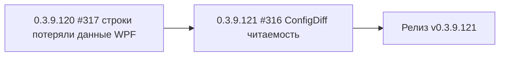

# PLAN — цикл 0.3.9.120–0.3.9.121 — обработка issues #317/#316

Репозиторий [`sivatorov/ConfigurationManagement`](https://github.com/sivatorov/ConfigurationManagement),
локальная копия `f:\Yandex.Disk\h\Configuration_Management`, ветка `main`, HEAD = 0.3.9.119
(commit 300f3ea, синхронизирован с origin). Третий цикл 0.3.9.118–0.3.9.119 завершён:
релиз v0.3.9.119 опубликован; автор issues (7OH) протестировал, оставил новый комментарий
в #316 («Пока без изменений» + 2 скриншота) и создал новый issue #317 (регресс: «Строки
потеряли данные 3.9.117», скриншот, без текста).

Режим: Архитектор (план) → цепочка задач-исполнителей в режиме **code**.
**Один issue = одна задача = одна версия = один коммит.** Issues НЕ закрываются (их закрывает автор).
План-файл остаётся untracked (plans/ в .codeassistantignore); CHANGELOG/README коммитятся.

---

## 1. Сводка

Обрабатываем 2 открытых issues в порядке, заданном пользователем: сначала регресс (#317),
затем доработку читаемости ConfigDiff (#316). Оба — «доводка» предыдущих исправлений:

| № | Версия  | Issue | Суть | Сложность |
|---|---------|-------|------|-----------|
| 1 | 0.3.9.120 | #317 | Регресс WPF: строки баз в дереве «потеряли данные» — DataTemplate строки перестал применяться автоматически после добавления `x:Key` в 0.3.9.115 (#314) | средняя |
| 2 | 0.3.9.121 | #316 | Надписи окон ConfigDiff по-прежнему не читаются у автора: добить все нечитаемые места (радио-кнопки, комбобоксы, статусные цвета) на обеих платформах | средняя |
| 3 | 0.3.9.121 | релиз | Сборка Windows+Linux single-file, пуш, релиз v0.3.9.121 | средняя |



Общие требования К КАЖДОЙ задаче (кроме финальной):
1. Реализация на обеих платформах (Windows/WPF + Linux/Avalonia), где применимо.
2. Поднять версию в `Configuration Management.csproj` (строки 62–65: Version/AssemblyVersion/FileVersion/InformationalVersion).
3. Запись в CHANGELOG.md (сверху, формат как у прошлых версий) и обновить бейдж версии в README.md (строка 3).
4. Тесты: `dotnet test` зелёный + `dotnet build -p:BuildLinux=true` без ошибок (компиляция Linux-ветки обязательна после каждого изменения).
5. Комментарий в issue: файл `publish/comment-NNN-0.3.9.XXX.md` + публикация:
   `gh api repos/sivatorov/ConfigurationManagement/issues/NNN/comments -f body=@publish/comment-NNN-0.3.9.XXX.md`
   (текст: что исправлено и в какой версии; issue НЕ закрывать).
6. Один коммит (без пуша). Коммит-сообщение по образцу: `fix: ...; 0.3.9.XXX`.
7. В конце задачи — запустить следующую задачу через `new_task(mode=code)` с инструкцией
   следующего пункта (сообщения-инструкции — в разделе 4).

---

## 2. Ключевые якоря кодовой базы (разведка выполнена 2026-09-28)

### Общее
- Версия: [`Configuration Management.csproj`](Configuration%20Management/Configuration%20Management.csproj:62) — 4 поля, строки 62–65.
- Формат комментариев/релизов: `publish/comment-*.md`, `publish/release_body_*.md`
  (образцы: `comment-314-0.3.9.115.md`, `comment-316-0.3.9.117.md`, `release_body_0.3.9.119.md`).
- Данные issue из GitHub API (2026-09-28): #317 — скриншот 710×898, 0 комментариев;
  #316 — комментарий 7OH 14:12 с двумя скриншотами (745×713 и 355×131) и текстом «Пока без изменений».
  Прямое скачивание вложений headless-браузером GitHub блокирует (403) — разбор по коду + чек-лист ниже.

### #317 — регресс: «строки потеряли данные» (Windows/WPF)

**Механизм строк дерева (WPF):**
- [`Views/MainWindow.xaml`](Configuration%20Management/Views/MainWindow.xaml:1254) — `LeveledTreeView x:Name="MainTree"`,
  `ItemTemplate`/`HeaderTemplate` НЕ заданы ни в XAML, ни в коде: шаблон заголовка каждой строки
  выбирается автоматически по типу DataContext (стандартный WPF-механизм implicit data templates).
- [`Views/MainWindow.xaml`](Configuration%20Management/Views/MainWindow.xaml:1342) — `HierarchicalDataTemplate`
  для `GroupNodeViewModel` (без `x:Key` — авто по типу, работает).
- [`Views/MainWindow.xaml`](Configuration%20Management/Views/MainWindow.xaml:1601) —
  `<DataTemplate x:Key="InfobaseRowTemplate" DataType="{x:Type models:Infobase}">` — ЕДИНСТВЕННЫЙ шаблон
  строки базы (~540 строк, все привязки колонок: `NameDisplay`, `ServerDatabaseDisplay`, теги, кнопки).
  **`x:Key` добавлен в 0.3.9.115 (issue #314)** ради переиспользования строкой «Закреплённые»
  (комментарий в XAML:1597–1600 прямо это говорит).
- [`Views/MainWindow.xaml`](Configuration%20Management/Views/MainWindow.xaml:2136) —
  `<DataTemplate DataType="{x:Type vm:PinnedInfobaseItem}">` → `<ContentControl Content="{Binding Base}"
  ContentTemplate="{StaticResource InfobaseRowTemplate}"/>` (без `x:Key` — авто по типу, работает).
- [`ViewModels/PinnedInfobaseItem.cs`](Configuration%20Management/ViewModels/PinnedInfobaseItem.cs:24) —
  обёртка с единственным свойством `Base`.
- [`ViewModels/GroupNodeViewModel.cs`](Configuration%20Management/ViewModels/GroupNodeViewModel.cs:346) —
  `PopulateItems`: в узел «Закреплённые» (`PinnedMarker`) кладутся `PinnedInfobaseItem`, в обычные группы — `Infobase`.

**Вероятная причина (главная гипотеза):**
В WPF DataTemplate, у которого задан `x:Key`, НЕ применяется автоматически по `DataType` —
автовыбор по типу работает только для шаблонов БЕЗ `x:Key` (документация MS: «If you do not specify
an x:Key for the DataTemplate and specify a value for the DataType, the DataTemplate is applied to
every object of the specified type»). После добавления `x:Key` в 0.3.9.115 обычные строки `Infobase`
(во всех узлах: группы, «Без группы», плоский режим) лишились шаблона и отображаются как `ToString()`
(пустая/имя типа) — «строки потеряли данные». Строки «Закреплённых» при этом работают (шаблон берётся
по ключу через `ContentControl`). Скриншот 710×898 (вертикальный, весь список) согласуется с этой картиной.

**План Б (если гипотеза не подтвердится):** если после фикса окажется, что сломаны именно строки
«Закреплённых» (а основные были ок), то причина — в `ContentControl Content="{Binding Base}"`:
проверить DataContext внутри `InfobaseRowTemplate` (должен быть `Base`, а не `PinnedInfobaseItem`)
и отсутствие локальных `DataContext`/`Source` на родительских элементах шаблона.

**Avalonia:** регресса нет — строки строятся программно по реальной базе:
[`Views/MainWindow.Avalonia.Tree.cs`](Configuration%20Management/Views/MainWindow.Avalonia.Tree.cs:34)
`BuildTreeRow` → `BuildInfobaseRow(pinned.Base)` (строки 38–43). Обёртка разворачивается во всех
точках (клики, выбор, DnD, теги, поиск контейнера). Правки не требуются; проверить, что
`PinnedInfobaseItem` нигде не попадает в Binding напрямую.

**Исправление (рекомендуемое, минимальный дифф):** вернуть авто-применение шаблона для `Infobase`,
сохранив `x:Key` для переиспользования. Рядом с шаблоном `PinnedInfobaseItem` (после строки 2139)
добавить обёрточный шаблон:
```xml
<!-- Автовыбор для обычных строк: WPF не применяет шаблон по DataType, если задан x:Key
     (регресс 0.3.9.115, issue #317). Обёртка оставляет x:Key для строки «Закреплённые». -->
<DataTemplate DataType="{x:Type models:Infobase}">
    <ContentControl Content="{Binding}" ContentTemplate="{StaticResource InfobaseRowTemplate}"/>
</DataTemplate>
```
Все привязки внутри `InfobaseRowTemplate` получат DataContext = сама база; RelativeSource
`AncestorType=TreeViewItem`/`Window` продолжают работать (ContentControl не прерывает поиск
предков по визуальному дереву). Проверить, что высота строки не изменилась (ContentControl
Stretch по умолчанию) и что `DataTrigger Binding="{Binding IsBatchSelected}"` (XAML:1648)
срабатывает (DataContext = Infobase).

**Affected:** `Views/MainWindow.xaml`. При необходимости (по результатам диагностики) —
`ViewModels/PinnedInfobaseItem.cs`, `Views/MainWindow.Tree.cs` (UnwrapInfobase) — но ожидается,
что менять их не придётся.

**Тесты:** `dotnet test` (зелёный), `dotnet build -p:BuildLinux=true`; при желании добавить юнит-тест
инварианта `GroupNodeViewModel.PopulateItems` (узел `PinnedMarker` содержит `PinnedInfobaseItem`,
обычные группы — `Infobase`) в `Etap13ListStateTests`/новый `GroupNodeViewModelTests`. Ручная проверка:
обычные строки во всех узлах и режимах показывают имя и колонки; строки «Закреплённых» — тоже;
выделение, теги, DnD, «Найти в списке» работают.

### #316 — ConfigDiff: надписи не читаются (комментарий 7OH «Пока без изменений»)

Что уже привязано к теме в 0.3.9.117:
- WPF [`ConfigDiffSetupWindow.xaml`](Configuration%20Management/Views/ConfigDiffSetupWindow.xaml:18) —
  implicit `Style TargetType="TextBlock"` → `TextPrimaryBrush`; описание/hint — `TextSecondaryBrush`;
  `ErrorText` — жёсткий `#EF4444`.
- WPF [`ConfigDiffResultWindow.xaml`](Configuration%20Management/Views/ConfigDiffResultWindow.xaml:19) —
  то же; `StatusTextStyle` (строки 26–39) — жёсткие статусные цвета.
- WPF [`ConfigDiffProgressWindow.cs`](Configuration%20Management/Views/ConfigDiffProgressWindow.cs:45) —
  `_stageText.SetResourceReference(Foreground, "TextPrimaryBrush")`.
- Avalonia [`ConfigDiffSetupWindow.Avalonia.cs`](Configuration%20Management/Views/ConfigDiffSetupWindow.Avalonia.cs:70) —
  description, метки, hint, ItemTemplate `_basesBox` — `ThemeBrushes.Bind(...)`;
  **RadioButton'ы `_modeBaseRadio`/`_modeCfRadio` (строки 83–89) Foreground НЕ привязан**;
  `_errorText` — жёсткий красный.
- Avalonia [`ConfigDiffResultWindow.Avalonia.cs`](Configuration%20Management/Views/ConfigDiffResultWindow.Avalonia.cs:42) —
  header/meta/summary/typeHeader/name/files/size — привязаны; `StatusBrush(obj.Kind)` (177–183) —
  жёсткие цвета (`#22C55E`/`#F59E0B`/`#EF4444`/`#94A3B8`).
- Avalonia [`ConfigDiffProgressWindow.Avalonia.cs`](Configuration%20Management/Views/ConfigDiffProgressWindow.Avalonia.cs:51) —
  привязан.

Кандидаты «не читается» (чек-лист для реализатора, скриншоты 745×713 ≈ результат/настройка,
355×131 ≈ окно прогресса):
1. **WPF SetupWindow: RadioButton'ы режима** ([`ConfigDiffSetupWindow.xaml`](Configuration%20Management/Views/ConfigDiffSetupWindow.xaml:33)) —
   `Foreground` не задан; наследуется от `Control.Foreground` окна (не задан → системный).
   Добавить в `Window.Resources` стиль `TargetType="RadioButton"` → `Foreground="{DynamicResource TextPrimaryBrush}"`.
2. **WPF SetupWindow: ComboBox'ы `BasesBox`/`PlatformBox`** — текст выбранного элемента и
   выпадающего списка: убедиться, что MaterialDesign-тема даёт читаемый цвет в обеих схемах;
   при необходимости задать `Foreground` у `ComboBox` и/или `Style TargetType="ComboBoxItem"`.
3. **Статусы объектов (обе платформы)**: жёсткие цвета; на СВЕТЛОЙ теме `#F59E0B` (янтарный) и
   `#94A3B8` (серый) читаются плохо. Рассмотреть: тематические кисти статусов
   (`StatusAddedBrush`/`StatusChangedBrush`/`StatusRemovedBrush` в теме, светлая/тёмная варианты)
   либо более тёмные оттенки (например `#16A34A`/`#D97706`/`#DC2626`), читаемые в обеих схемах.
   Учесть, что в 0.3.9.117 статусы оставлены намеренно — зафиксировать решение в комментарии к issue.
4. **Avalonia SetupWindow: RadioButton'ы** — привязать `Foreground` через
   `ThemeBrushes.Bind(_modeBaseRadio, Control.ForegroundProperty, "TextPrimaryBrush")` (и `_modeCfRadio`),
   либо убедиться, что FluentTheme наследует цвет корректно (в остальных окнах радио-кнопки не биндят —
   вероятно, ок, но проверить на тёмной схеме).
5. **Avalonia ResultWindow/SetupWindow: ComboBox `_platformBox`/`_basesBox`** — выбранный текст и
   выпадающий список в обеих схемах.
6. **Оба ProgressWindow** — проверить фактический цвет текста этапа и видимость полосы на светлой/тёмной.
7. Просмотреть вложения #316 (например, открыть issue в браузере глазами или `curl -L` со
   значением `User-Agent`/`Referer`) и сверить с устранёнными местами; если авторское изображение
   указывает на конкретные надписи — закрыть именно их.

**Affected (ожидаемо):** `Views/ConfigDiffSetupWindow.xaml`, `Views/ConfigDiffSetupWindow.Avalonia.cs`,
`Views/ConfigDiffResultWindow.xaml`, `Views/ConfigDiffResultWindow.Avalonia.cs`,
при необходимости `Themes/*` (кисти статусов) и `Views/ConfigDiffProgressWindow.*`.

**Тесты:** `dotnet test` зелёный + `dotnet build -p:BuildLinux=true`; при выносе палитры статусов в
helper — юнит-тест (наличие кистей в обеих схемах / значения цветов). Ручная проверка: пройти
весь поток ConfigDiff («Сервис → Сравнение конфигураций») на Windows и Linux, светлая+тёмная темы:
описание, радио-кнопки, метки, комбобоксы (выбранный + выпадающий), подсказки, шапка/сводка отчёта,
строки объектов, статусы, текст этапа прогресса.

---

## 3. Детали задач

### Задача 1 — 0.3.9.120, issue #317
**Что:** восстановить отображение данных строк дерева на Windows/WPF (регресс 0.3.9.115):
обычные строки `Infobase` снова получают шаблон строки базы.
**Как:**
1. Диагностика (1 шаг, без правок): проверить гипотезу в коде — в `MainWindow.xaml` есть ровно два
   шаблона для строк базы: `x:Key="InfobaseRowTemplate"` (1601, с `x:Key` → НЕ авто) и
   `DataType=PinnedInfobaseItem` (2136, без `x:Key` → авто). `ItemTemplate` у `LeveledTreeView` не задан.
   Вывод: обычные строки `Infobase` не находят шаблон автоматически → «потеряли данные».
2. В `Views/MainWindow.xaml` сразу ПОСЛЕ закрытия шаблона `PinnedInfobaseItem` (строка 2139) добавить
   обёрточный шаблон (см. раздел 2, блок «Исправление»):
   `<DataTemplate DataType="{x:Type models:Infobase}"><ContentControl Content="{Binding}"
   ContentTemplate="{StaticResource InfobaseRowTemplate}"/></DataTemplate>` + поясняющий комментарий.
3. Не менять шаблон `PinnedInfobaseItem` и механизм `x:Key` — строка «Закреплённые» продолжает работать.
4. Проверить отсутствие регрессий в разметке: высота строк, `DataTrigger IsBatchSelected`,
   RelativeSource-привязки (`LeveledTreeView.Level`, `IsSelected`, `DataContext.CompactMode`).
5. CHANGELOG.md сверху, бейдж версии README.md (строка 3), версия в csproj 62–65 → 0.3.9.120.
6. `dotnet test` + `dotnet build -p:BuildLinux=true`.
7. Комментарий: `publish/comment-317-0.3.9.120.md` (что было, причина, как исправлено, версия; issue не закрывать).
8. Коммит: `fix: возвращено авто-применение шаблона строки базы (регресс 0.3.9.115); 0.3.9.120` (без пуша).
9. Запустить задачу 2 через `new_task(mode=code)`.

**Affected:** `Views/MainWindow.xaml` (+ по результатам диагностики, минимально).

### Задача 2 — 0.3.9.121, issue #316
**Что:** устранить ВСЕ оставшиеся нечитаемые надписи окон ConfigDiff на обеих платформах
(после 0.3.9.117 автор: «Пока без изменений»).
**Как (чек-лист, сверяясь со скриншотами #316):**
1. WPF [`ConfigDiffSetupWindow.xaml`](Configuration%20Management/Views/ConfigDiffSetupWindow.xaml:18):
   добавить в `Window.Resources` стиль `RadioButton` → `Foreground={DynamicResource TextPrimaryBrush}`;
   проверить и при необходимости поправить текст ComboBox'ов (выбранный элемент и выпадающий список).
2. WPF [`ConfigDiffResultWindow.xaml`](Configuration%20Management/Views/ConfigDiffResultWindow.xaml:26):
   статусные цвета — сделать читаемыми в обеих схемах (тематические кисти либо тёмные оттенки);
   проверить, что implicit TextBlock-стиль достаёт до DataTemplate TreeView (если нет — явный
   `Foreground` в шаблонах строк 90–110).
3. Avalonia [`ConfigDiffSetupWindow.Avalonia.cs`](Configuration%20Management/Views/ConfigDiffSetupWindow.Avalonia.cs:83):
   привязать `Foreground` радио-кнопок; проверить ComboBox'ы.
4. Avalonia [`ConfigDiffResultWindow.Avalonia.cs`](Configuration%20Management/Views/ConfigDiffResultWindow.Avalonia.cs:177):
   `StatusBrush` — читаемые цвета в обеих схемах (синхронно с WPF).
5. Проверить оба `ConfigDiffProgressWindow` (текст этапа + полоса) на светлой/тёмной.
6. Сверить со скриншотами автора (745×713 и 355×131): определить какие окна на них и убедиться,
   что показанные надписи читаемы после фикса.
7. CHANGELOG.md сверху, бейдж версии README.md, версия csproj → 0.3.9.121.
8. `dotnet test` + `dotnet build -p:BuildLinux=true`.
9. Комментарий: `publish/comment-316-0.3.9.121.md` (перечень устранённых мест на обеих платформах + версия).
10. Коммит: `fix: ConfigDiff — читаемость надписей во всех окнах и темах; 0.3.9.121` (без пуша).
11. Запустить задачу 3 через `new_task(mode=code)`.

**Affected (ожидаемо):** `Views/ConfigDiffSetupWindow.xaml`, `Views/ConfigDiffSetupWindow.Avalonia.cs`,
`Views/ConfigDiffResultWindow.xaml`, `Views/ConfigDiffResultWindow.Avalonia.cs`, при необходимости
`Themes/*` (кисти статусов).

### Задача 3 — релиз v0.3.9.121
**Что:** собрать по 1 исполняемому файлу Windows и Linux, выложить на GitHub, создать релиз.
**Как:**
1. `dotnet test` (все зелёные) + `dotnet build -p:BuildLinux=true` (обе ветки компилируются).
2. Сборка: `powershell -File "Configuration Management/build-windows-single-file.ps1"` (Windows)
   и `bash "Configuration Management/build-linux-single-file.sh"` (Linux); бинарники:
   `dist/win-x64/ConfigurationManagement.exe` и `dist/linux-x64/ConfigurationManagement-linux-x64`.
3. `publish/release_body_0.3.9.121.md` по образцу `release_body_0.3.9.119.md`
   (сводка по 2 пунктам: #317 и #316, таблица файлов, версия, счётчик тестов).
4. `git add -A && git commit` (если остались незакоммиченные файлы) + `git push origin main`
   (запушутся и незапушенные коммиты 0.3.9.120/0.3.9.121).
5. `gh release create v0.3.9.121 <exe> <linux> --title "Управление конфигурациями 1С — v0.3.9.121" --notes-file publish/release_body_0.3.9.121.md`.
6. Issues #317/#316 НЕ закрывать.

---

## 4. Сообщения-инструкции для new_task(mode=code)

### Задача 2 (0.3.9.121, #316) — в конце Задачи 1
«Задача 2 цикла 0.3.9.120–121. План: plans/PLAN-0.3.9.120-121.md, раздел "Задача 2 — 0.3.9.121, issue #316".
Реализуй исправление читаемости окон ConfigDiff на обеих платформах (чек-лист в разделе), подними
версию в csproj до 0.3.9.121, обнови CHANGELOG.md и README.md (бейдж), прогони dotnet test и
dotnet build -p:BuildLinux=true, создай publish/comment-316-0.3.9.121.md и опубликуй комментарий
в issue #316 (gh api ... /issues/316/comments -f body=@...), сделай один коммит без пуша. Issues не
закрывать. Затем запусти new_task(mode=code) с инструкцией Задачи 3 (релиз) из плана.»

### Задача 3 (релиз) — в конце Задачи 2
«Задача 3 цикла 0.3.9.120–121 (финальная). План: plans/PLAN-0.3.9.120-121.md, раздел
"Задача 3 — релиз v0.3.9.121". Собери single-file бинарники Windows (build-windows-single-file.ps1)
и Linux (build-linux-single-file.sh), создай publish/release_body_0.3.9.121.md по образцу
release_body_0.3.9.119.md, запушь origin/main (коммиты 0.3.9.120/0.3.9.121), создай релиз
gh release create v0.3.9.121. Issues #317/#316 не закрывать. Цепочка завершена — доложи результат.»