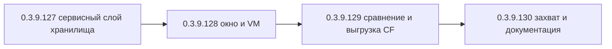

# PLAN — цикл 0.3.9.127–0.3.9.130 — «Обозреватель хранилища конфигурации»

Репозиторий [`sivatorov/ConfigurationManagement`](https://github.com/sivatorov/ConfigurationManagement),
локальная копия `f:\Yandex.Disk\h\Configuration_Management`, ветка `main`.
Локальный HEAD — 0.3.9.126 (csproj строки 62–65, CHANGELOG, бейдж README строка 3).
План начинается с версии **0.3.9.127** (по заданию; перед стартом работ синхронизироваться
с origin: `git pull` — если в origin уже есть 0.3.9.127, перенумеровать цикл с 0.3.9.128).

Режим: Архитектор (план) → цепочка задач-исполнителей в режиме **code** (new_task по одному на этап,
созданы единовременно из этого плана). **Один этап = одна версия = один коммит.**
План-файл остаётся untracked (plans/ в .codeassistantignore); CHANGELOG/README/csproj коммитятся.
Релиз/публикация в этот цикл НЕ входит (автор сам).

---

## 1. Сводка

Новая функция «Обозреватель хранилища конфигурации»: окно «Хранилище конфигурации…»
(меню «Утилиты») для **выбранной ИБ с заполненным адресом хранилища** (иначе команда
недоступна). Окно работает с хранилищем конфигурации 1С целиком через пакетный режим
**DESIGNER** (запуск 1cv8 с ключами хранилища, без интерактивного конфигуратора —
та же механика, что у «Пакетного обновления из хранилищ» 0.3.9.88):

- подключение к хранилищу: адрес/имя из `Infobase.Repository`, логин/пароль — из учётных
  данных базы (`InfobaseAuthResolver.ResolveRepository`) с возможностью ручного ввода пароля;
  **пароль НЕ сохраняется на диск** (решение планирования, как в мониторе серверов 0.3.9.124);
- список версий хранилища (номер, дата, автор, комментарий) — через отчёт по истории
  `/ConfigurationRepositoryReport` (см. раздел 3 — разведка платформы; формат файла отчёта
  уточняется экспериментально на этапе 1; при недоступности текстового формата — окно
  показывает одну запись «Актуальная (последняя) версия» — ограничение фиксируется в UI и README);
- просмотр состава версии (список объектов с типами и владельцами) — выгрузка версии
  `/ConfigurationRepositoryDumpCfg -v N` в .cf, распаковка во временную ИБ и `DumpConfigToFiles`
  (переиспользуется инфраструктура ConfigurationDiff 0.3.9.99) + новый чистый обход дерева
  выгрузки `ConfigurationDiffEngine.BuildObjectList`;
- сравнение двух версий хранилища между собой и выбранной версии с текущей конфигурацией
  базы — переиспользование `ConfigurationDiffService` (режимы CfVsCf / BaseVsCf), результат —
  существующее окно отчёта с экспортом CSV/TXT;
- выгрузка выбранной версии в файл .cf (`/ConfigurationRepositoryDumpCfg "file.cf" -v N`);
- захват объекта/всех объектов («Захватить») и отмена захвата («Отменить захват»)
  (`/ConfigurationRepositoryLock` / `/ConfigurationRepositoryUnlock`; выборочный захват через
  XML-файл `-objects` — экспериментально, формат не документирован; комментарий операции —
  локально в журнал окна и историю запусков, т.к. платформа не принимает комментарий
  при Lock/Unlock);
- темизация окна (светлая/тёмная, DynamicResource WPF + ThemeBrushes.Bind Avalonia),
  локализация ru/en;
- статусы/ошибки — человекочитаемые (лог /Out конфигуратора, как в пакетном обновлении).

| № | Версия  | Этап | Суть | Сложность |
|---|---------|------|------|-----------|
| 1 | 0.3.9.127 | Сервисный слой хранилища | Модели + пакетные операции DESIGNER (DumpCfg/Report/Lock/Unlock) + сборка аргументов + маскирование пароля + парсер отчёта истории + BuildObjectList + разведка реальных ключей на установленной платформе + юнит-тесты | большая |
| 2 | 0.3.9.128 | Окно и ViewModel | `RepositoryBrowserWindow` (WPF+Avalonia), `RepositoryBrowserViewModel`, роу-модели, команда меню «Утилиты» (CanExecute по выбранной базе с хранилищем), локализация, темизация, пароль в памяти | большая |
| 3 | 0.3.9.129 | Сравнение и выгрузка .cf | Сравнение версий между собой и с базой через `ConfigurationDiffService` (окно прогресса + отчёт CSV/TXT), выгрузка версии в .cf через SaveFileDialog, статусы/ошибки, тесты VM | средняя |
| 4 | 0.3.9.130 | Захват/отмена и финализация | `Lock/Unlock` (все объекты / выбранные из состава), локальный комментарий, история запусков, README-раздел, финализация CHANGELOG/локализации, dotnet test + build -p:BuildLinux=true, ручной чек-лист | средняя |

Общие требования К КАЖДОЙ задаче:
1. Реализация на обеих платформах (Windows/WPF + Linux/Avalonia), где применимо; чистые
   сервисы/VM — без платформенных зависимостей (одна реализация), окна — пара WPF `.xaml`
   / Avalonia `.Avalonia.cs`.
2. Поднять версию в [`Configuration Management.csproj`](Configuration%20Management/Configuration%20Management.csproj:62)
   (строки 62–65: Version/AssemblyVersion/FileVersion/InformationalVersion).
3. Запись в CHANGELOG.md (сверху, формат как у прошлых версий) и обновить бейдж версии в
   README.md (строка 3).
4. Тесты: `dotnet test` зелёный (459 текущих + новые) и `dotnet build -p:BuildLinux=true` без
   ошибок (компиляция Linux-ветки обязательна после каждого изменения).
5. Один коммит (без пуша). Сообщение по образцу: `feat: ...; 0.3.9.XXX`.
6. Задачи-исполнители созданы архитектором единовременно (см. раздел 5): каждая задача
   исполняется независимо и НЕ создаёт следующую (цепочка уже существует).

---

## 2. Ключевые якоря кодовой базы (разведка выполнена 2026-09-28)

### Общее
- Версия: [`Configuration Management.csproj`](Configuration%20Management/Configuration%20Management.csproj:62) —
  4 поля, строки 62–65. Локальный HEAD — 0.3.9.126.
- Регистрация сервисов DI: [`AppServices.cs`](Configuration%20Management/AppServices.cs:14) —
  общий блок (строки 20–75) для обеих платформ; чистые сервисы регистрируются в общем
  блоке (образец: `IRacClient → RacClient`, строки 61–63), UI-зависимые — под `#if WINDOWS` / `#else`.
- Локализация: [`LocalizationManager.cs`](Configuration%20Management/Localization/LocalizationManager.cs:60) —
  ключи-строки в `Localization/Languages/ru.json` и `en.json`, вызов `LocalizationManager.T("Key")`,
  fallback ru→en→ключ. Образцы блоков ключей: `RepoUpdate.*` (ru.json:50), `ServerMonitor.*`
  (ru.json:1669), `ConfigDiff.*` (ru.json:2262).
- Темизация WPF: `{DynamicResource TextPrimaryBrush}` / `TextSecondaryBrush` / `CardBackgroundBrush` /
  `ItemHoverBrush` / `BorderBrush`; implicit `Style TargetType="TextBlock"` (образец:
  [`Views/ProcessInspectorWindow.xaml`](Configuration%20Management/Views/ProcessInspectorWindow.xaml:11)).
- Темизация Avalonia: [`Themes/ThemeBrushes.Avalonia.cs`](Configuration%20Management/Themes/ThemeBrushes.Avalonia.cs:14) —
  `ThemeBrushes.Bind(target, property, "BrushKey")`; статусные цвета: `#16A34A` (ок), `#D97706`
  (предупреждение), `#DC2626` (опасно), `#64748B` (нейтрально).
- Маскирование секретов: [`Services/SensitiveDataMasker.cs`](Configuration%20Management/Services/SensitiveDataMasker.cs:6) —
  существующие `MaskDbPassword` (DBPwd) и `MaskRacPassword` (`--password=`). Для хранилища
  добавить маску `/ConfigurationRepositoryP "..."` (см. этап 1; критично, т.к. командная
  строка операции попадает в `DesignerBatchInfo.CommandLine` и при ошибке — в сообщение).

### Пакетное обновление из хранилищ (0.3.9.88) — образец механики и журнала
- VM: [`ViewModels/RepositoryBatchUpdateViewModel.cs`](Configuration%20Management/ViewModels/RepositoryBatchUpdateViewModel.cs:137) —
  `RunAsync` (строки 196–291): последовательный прогон, `WaitForCompletionAsync` по событию
  `OneCLauncher.DesignerBatchCompleted` (строки 298–321), построчный `AppendLog` через
  `SynchronizationContext` (324–336), `AddLaunchHistory("RepoUpdate", ...)` (265–267, 281–283).
- Сборка аргументов: [`Services/OneCLauncher.Arguments.Shared.cs`](Configuration%20Management/Services/OneCLauncher.Arguments.Shared.cs:185) —
  `BuildRepositoryUpdateArgument`: `/ConfigurationRepositoryF "путь" /ConfigurationRepositoryN "u"
  /ConfigurationRepositoryP "p" /ConfigurationRepositoryUpdateCfg /UpdateDBCfg`;
  путь строится из `Repository.Server + RepositoryName` (строки 191–193), учётные данные —
  `InfobaseAuthResolver.ResolveRepository` (199), безопасность значений — `IsSafeCliValue` (28–31).
- Пакетный запуск: [`Services/OneCLauncher.DesignerBatch.cs`](Configuration%20Management/Services/OneCLauncher.DesignerBatch.cs:19) —
  enum `DesignerBatchOperation` (9 значений), `RunDesignerBatch(infobase, operation, outputPath)`
  (строка 109): поиск exe, `IsDesignerBlocked` (137), ветки `opArg` (195–214), `/Out`-лог (220–221),
  `DesignerBatchInfo.CommandLine = $"{exePath} {arguments}"` (233 — **сюда попадёт пароль хранилища**),
  `CompleteDesignerBatch` (290–336): успех по ExitCode + проверка файла, при ошибке — текст лога
  + `CommandLine` в `ErrorMessage`. Linux-ветка: [`Services/OneCLauncher.Linux.DesignerBatch.cs`](Configuration%20Management/Services/OneCLauncher.Linux.DesignerBatch.cs:37)
  (аналогичный enum и ветки opArg, общий блок аргументов — Arguments.Shared.cs).
- Команда меню WPF: [`ViewModels/MainViewModel.Tools.cs`](Configuration%20Management/ViewModels/MainViewModel.Tools.cs:2469) —
  `RepositoryBatchUpdateCommand` (CanExecute: `Infobases.Any(b => b.Repository.HasServer)`),
  `ExecuteRepositoryBatchUpdate` (2473–2494: отбор баз, Confirm, `new RepositoryBatchUpdateWindow(withRepo)`).
- Пункт меню WPF: [`Views/MainWindow.xaml`](Configuration%20Management/Views/MainWindow.xaml:736) —
  `<MenuItem Header="{loc:Loc RepoUpdate.Title}" Command="{Binding RepositoryBatchUpdateCommand}" ...>`
  внутри подменю «Утилиты».
- Пункт меню Avalonia: [`Views/MainWindow.Avalonia.Tree.cs`](Configuration%20Management/Views/MainWindow.Avalonia.Tree.cs:1716) —
  `menu.Items.Add(MenuAction("RepoUpdate.Title", _vm.RepositoryBatchUpdateCommand, null, "IconCloudDownload", "#06B6D4"));`
  внутри `BuildUtilitiesMenu()` (строки 1632–1731).
- Окно прогресса/журнала: [`Views/RepositoryBatchUpdateWindow.xaml.cs`](Configuration%20Management/Views/RepositoryBatchUpdateWindow.xaml.cs:27)
  и [`Views/RepositoryBatchUpdateWindow.Avalonia.cs`](Configuration%20Management/Views/RepositoryBatchUpdateWindow.Avalonia.cs:35).

### ConfigurationDiff (0.3.9.99) — переиспользуемая инфраструктура выгрузки/сравнения
- Оркестратор: [`Services/ConfigurationDiffService.cs`](Configuration%20Management/Services/ConfigurationDiffService.cs:57) —
  `CompareAsync(ConfigurationDiffRequest, IProgress<string>?, CancellationToken)` (69–101):
  снимки из .cf (`PrepareSnapshotFromCf`: CREATEINFOBASE с `/UseTemplate` → `DumpConfigToFiles`,
  строки 103–133) и из базы (`PrepareSnapshotFromBase`: сразу `DumpConfigToFiles`, 135–150);
  `ConfigurationDiffRequest { Mode, Base, LeftCfPath, RightCfPath, PlatformVersion, LeftLabel, RightLabel }`
  (19–41); `ConfigDiffMode.BaseVsCf` / `CfVsCf`; `ConfigurationDiffException` (44–47);
  `WaitForBatchAsync` (203–229), таймаут 60 мин (60).
- Движок: [`Services/ConfigurationDiffEngine.cs`](Configuration%20Management/Services/ConfigurationDiffEngine.cs:14) —
  `BuildSnapshot(dumpDir)` (обход `Configuration/<Тип>/<Имя>`, SHA-256, `ConfigurationSnapshot`),
  `Compare(left, right, labels, elapsed)` (75–139), `MetadataTypeLocalizer` — локализация имён типов.
- Модели: [`Models/ConfigurationDiffModel.cs`](Configuration%20Management/Models/ConfigurationDiffModel.cs:47) —
  `ConfigurationDiffResult(LeftLabel, RightLabel, Objects, RootFileChanged, Elapsed)`,
  `MetadataObject(TypeDir, Name, Kind, FileCount, TotalBytes)` (30–39).
- Отчёт: [`Services/ConfigurationDiffReporter.cs`](Configuration%20Management/Services/ConfigurationDiffReporter.cs:31) —
  `BuildCsvRows(result, t)` / `BuildText(result, t)`.
- Окна: `Views/ConfigDiffSetupWindow.xaml(.cs)/.Avalonia.cs` (валидация, вызов сервиса + прогресс,
  открытие результата), `Views/ConfigDiffProgressWindow.cs` (WPF: indeterminate + SetStage,
  DynamicResource `TextPrimaryBrush`) + `.Avalonia.cs`, `Views/ConfigDiffResultWindow.xaml(.cs)/.Avalonia.cs`
  (таблица + экспорт CSV/TXT), `ViewModels/ConfigDiffResultViewModel.cs` (113–118: BuildCsvRows/BuildTextReport).
- Тесты-образец: [`ConfigurationManagement.Tests/ConfigurationDiffTests.cs`](ConfigurationManagement.Tests/ConfigurationDiffTests.cs:15) —
  выгрузки строятся на лету во временной папке, `FakeT`-локализатор, `ConfigurationDiffEngine.ConfigDumpInfoFileName`.

### Учётные данные и модель базы
- [`Models/RepositorySettings.cs`](Configuration%20Management/Models/RepositorySettings.cs:8) —
  `Server`, `RepositoryName`, `User`, `Password`, `HasServer`, `AddressDisplay`.
- [`Models/Infobase.cs`](Configuration%20Management/Models/Infobase.cs:257) — `Infobase.Repository`.
- [`Services/InfobaseAuthResolver.cs`](Configuration%20Management/Services/InfobaseAuthResolver.cs:57) —
  `ResolveRepository(infobase, out repositoryUser, out repositoryPassword)` — прямой возврат
  логина/пароля хранилища из свойств базы.
- Команды с CanExecute по выбранной базе (образец для новой команды):
  [`ViewModels/MainViewModel.Commands.cs`](Configuration%20Management/ViewModels/MainViewModel.Commands.cs:592) —
  `DumpConfigurationCfCommand` (`_ => SelectedInfobase != null`); в Avalonia — 
  [`ViewModels/MainViewModel.Avalonia.Tools.cs`](Configuration%20Management/ViewModels/MainViewModel.Avalonia.Tools.cs:1439)
  (обновление CanExecute команд при смене состояния, образец `RaiseCanExecuteChanged`).

---

## 3. Разведка платформенных возможностей: операции хранилища в пакетном режиме DESIGNER

Проверено по официальному руководству администратора 1С:Предприятие 8.3.24 (Appendix 7,
«Command-line options in Designer batch mode» → «Working with the Configuration Repository»,
kb.1ci.com) и зеркалам справки 1С (yellow-erp.com/help/1cv8, zif3_*). **Вывод: полноценная
работа с хранилищем конфигурации в пакетном режиме DESIGNER СУЩЕСТВУЕТ**, включая историю,
выгрузку версий, захват/отмену захвата.

### 3.1. Существующие ключи (реальные, проверены по документации)

| Ключ | Назначение | Параметры |
|---|---|---|
| `/ConfigurationRepositoryF "<путь>"` | Подключение к хранилищу | путь: `tcp://сервер:порт/имя` или файловый каталог |
| `/ConfigurationRepositoryN "<имя>"` | Пользователь хранилища | — |
| `/ConfigurationRepositoryP "<пароль>"` | Пароль хранилища | — |
| `/ConfigurationRepositoryDumpCfg "<файл.cf>"` | Выгрузка конфигурации хранилища в .cf | `[-v <номер версии>]`; `-v` не указан или `-1` → последняя версия |
| `/ConfigurationRepositoryUpdateCfg` | Обновление конфигурации из хранилища | `[-v <версия>] [-revised] [-force] [-objects <XML>]` |
| `/ConfigurationRepositoryLock` | Захват объектов для редактирования | `[-objects <XML-файл списка>] [-revised]`; без `-objects` — захват всех объектов |
| `/ConfigurationRepositoryUnlock` | Отмена захвата | `[-objects <XML-файл списка>] [-force]` |
| `/ConfigurationRepositoryReport "<файл>"` | **Отчёт по истории хранилища** | `[-NBegin <№ версии>] [-NEnd <№ версии>] [-GroupByObject] [-GroupByComment]`; вывод — табличный документ (в примерах `.mxl`) |
| `/ConfigurationRepositoryCommit` | Фиксация изменений | `[-objects <XML>] [-comment "<текст>"] [-keepLocked] [-force]` |
| Прочие | AddUser, CopyUsers, Create, ClearCache(-Global/-Local), OptimizeData, SetLabel, UnbindCfg | (не используются в этом цикле) |

**Ключа `/DumpConfigurationRepository` НЕ существует.** Истории как текстовой таблицы в stdout
нет — только файл отчёта `/ConfigurationRepositoryReport` (табличный документ; примеры вызова
из документации: `DESIGNER /F"ИБ" /ConfigurationRepositoryF "хранилище" /ConfigurationRepositoryN
"Администратор" /ConfigurationRepositoryReport "D:\ByObject.mxl" -NBegin 1 -NEnd 2`).
`rac` к хранилищу НЕ применяется (хранилище — не кластер; rac управляет кластерами).

### 3.2. Что реализуемо штатно (войдёт в этапы)

1. **Подключение и авторизация** — `/ConfigurationRepositoryF/N/P` (уже собирается в
   [`OneCLauncher.Arguments.Shared.cs`](Configuration%20Management/Services/OneCLauncher.Arguments.Shared.cs:185)).
2. **Выгрузка конкретной версии в .cf** — `/ConfigurationRepositoryDumpCfg "файл.cf" -v N`
   (без `-v`/`-v -1` — актуальная). ✓
3. **Состав версии** (объекты с типами и владельцами) — выгруженный .cf распаковывается
   существующей инфраструктурой (CREATEINFOBASE с `/UseTemplate` → `/DumpConfigToFiles` →
   `ConfigurationDiffEngine.BuildSnapshot`), добавляется новый чистый обход полного дерева
   `BuildObjectList` (верхний уровень + вложенные объекты с владельцем). ✓
4. **Сравнение версий между собой и с базой** — две выгрузки `DumpCfg -v N1` / `-v N2` +
   `ConfigurationDiffService.CompareAsync` (CfVsCf / BaseVsCf) → существующий отчёт CSV/TXT. ✓
5. **Захват/отмена захвата** — `/ConfigurationRepositoryLock` / `Unlock` (без `-objects` —
   все объекты; с `-objects` — выбранные, формат XML-файла НЕ документирован — эксперимент). ✓
6. **Отчёт по истории** — `/ConfigurationRepositoryReport "файл" [-NBegin N] [-NEnd N]`
   формирует отчёт по версиям (номер, дата, автор, комментарий). ⚠ **Формат файла**:
   табличный документ (в примерах `.mxl`). Возможность текстового вывода (`.txt`/`.html`)
   проверяется экспериментально на этапе 1. Если текстовый формат недоступен/нечитаем —
   история в окне ограничивается одной записью «Актуальная (последняя) версия» (получение
   состава через `DumpCfg` без `-v`), а сравнение двух произвольных версий недоступно
   (ограничение фиксируется в UI-hint и README).

### 3.3. Ограничения платформы (зафиксировать)

- **Комментарий при захвате/отмене** платформа НЕ принимает (комментарий — только у
  `/ConfigurationRepositoryCommit -comment`, фиксация вне рамок функции). Комментарий операции
  ведётся локально: журнал окна + `AddLaunchHistory`.
- **Команды выполняются на базе**: примеры документации используют `DESIGNER /F"ИБ"
  /ConfigurationRepositoryF ...` — операции хранилища запускаются как пакетные операции
  конфигуратора для выбранной ИБ (механика `RunDesignerBatch` уже это поддерживает).
  Для Lock/Unlock/Report конфигурация базы должна быть связана с хранилищем; при невозможности —
  человекочитаемая ошибка из лога `/Out`.
- **Блокировка запуска конфигуратора** (`IsDesignerBlocked`): база не должна быть запущена;
  иначе операция не стартует (как в пакетном обновлении).
- **Выборочный захват** (`-objects <XML>`) зависит от недокументированного формата файла —
  гарантирован захват всех объектов; выборочный — по итогам эксперимента (если формат не
  удалось установить — в UI кнопка «Захватить выбранные» недоступна, остаётся «Захватить все»).
- **Пароль в командной строке**: `/ConfigurationRepositoryP` попадает в `CommandLine`
  (`DesignerBatchInfo`, строка 233) и при ошибке — в `ErrorMessage` (строка 335). Обязательно
  маскировать (см. этап 1, SensitiveDataMasker).

---

## 4. Декомпозиция на этапы

### Этап 1 — 0.3.9.127: сервисный слой хранилища (модели, аргументы, пакетные операции, парсер отчёта)

**Цель:** чистый, тестируемый слой работы с хранилищем через пакетный DESIGNER без UI:
модели версии/объекта, новые `DesignerBatchOperation` (DumpCfg/Report/Lock/Unlock), сборка
аргументов (включая `-v`), маскирование пароля, парсер отчёта истории, полный обход
выгрузки (`BuildObjectList`), сервис-оркестратор. Плюс **разведка на реальной платформе**
(формат файла отчёта истории, поведение `-v`, XML-список `-objects`) с фиксацией результатов.

**Новые файлы:**
- `Configuration Management/Models/RepositoryModels.cs` — POCO:
  - `RepositoryVersion { int Number; DateTime Date; string Author; string Comment; bool IsCurrent; }`
    (номер, дата, автор, комментарий — из отчёта истории; `IsCurrent` — для пометки актуальной);
  - `RepositoryObjectInfo { string TypeDir; string Name; string Owner; bool IsTopLevel; }`
    (тип-каталог выгрузки, имя объекта, владелец для вложенных объектов, флаг верхнего уровня).
- `Configuration Management/Services/RepositoryHistoryParser.cs` — ЧИСТЫЙ парсер отчёта
  истории хранилища (текстовый вывод `/ConfigurationRepositoryReport`):
  - `ParseReport(string text)` → `IReadOnlyList<RepositoryVersion>`; формат строк определяется
    по фактическому выводу на этапе разведки (номер версии, дата, автор, комментарий);
    устойчивость: кривые строки пропускаются, отсутствие колонок → default;
  - если текстовый формат недоступен — парсер не используется, фиксируется ограничение
    (см. риски): `RepositoryHistoryParser` остаётся с документацией «unavailable», а окно
    (этап 2) работает с актуальной версией.
- `Configuration Management/Services/RepositoryStorageService.cs` — оркестратор (образец —
  `ConfigurationDiffService`), методы (все через `RunDesignerBatch` + `WaitForBatchAsync`):
  - `Task<string> DumpVersionToCfAsync(Infobase ib, int? version, string cfPath, IProgress<string>?, CancellationToken)`
    — `/ConfigurationRepositoryDumpCfg "cf" [-v N]`; возвращает путь .cf; исключения
    `RepositoryStorageException` (человекочитаемое сообщение, образец — `ConfigurationDiffException`);
  - `Task<IReadOnlyList<RepositoryObjectInfo>> LoadVersionObjectsAsync(Infobase ib, int? version, string platformVersion, IProgress<string>?, CancellationToken)`
    — DumpCfg во временный .cf → распаковка (CreateInfoBase + DumpConfigToFiles, переиспользование
    приёмов `ConfigurationDiffService.PrepareSnapshotFromCf`) → `ConfigurationDiffEngine.BuildObjectList`;
    временный каталог удаляется в `finally`;
  - `Task<IReadOnlyList<RepositoryVersion>> GetHistoryAsync(Infobase ib, int? nBegin, int? nEnd, IProgress<string>?, CancellationToken)`
    — `/ConfigurationRepositoryReport "файл" [-NBegin] [-NEnd]` + парсер; при недоступности
    текстового формата — возвращает одну запись `{ Number = -1, Comment = "...", IsCurrent = true }`
    (актуальная версия, детали — через DumpCfg без `-v`);
  - `Task LockAsync(Infobase ib, string? objectsXmlPath, CancellationToken)` и
    `Task UnlockAsync(Infobase ib, string? objectsXmlPath, CancellationToken)` —
    `/ConfigurationRepositoryLock [-objects "..."]` / `Unlock [-objects "..."]`;
  - общий таймаут (константа, например 60 мин — как `ConfigurationDiffService.BatchTimeout`).
- `Configuration Management/Services/IRepositoryStorageService.cs` — интерфейс (для VM-тестов).

**Изменяемые:**
- `Configuration Management/Services/OneCLauncher.Arguments.Shared.cs`:
  - вынести общий блок `F/N/P` из `BuildRepositoryUpdateArgument` (строки 191–207) в новый
    приватный/внутренний метод `BuildRepositoryArguments(Infobase, out user, out pwd)` → строка
    ` /ConfigurationRepositoryF "путь" /ConfigurationRepositoryN "u" /ConfigurationRepositoryP "p"`;
    `BuildRepositoryUpdateArgument` переиспользует его (поведение не меняется);
  - новые методы сборки аргументов:
    - `BuildRepositoryDumpCfgArgument(Infobase, string cfPath, int? version)` →
      `... /ConfigurationRepositoryDumpCfg"путь.cf"` + (version.HasValue ? ` -v N` : "");
    - `BuildRepositoryReportArgument(Infobase, string reportPath, int? nBegin, int? nEnd)` →
      `... /ConfigurationRepositoryReport"путь"` + ` -NBegin N` / ` -NEnd N`;
    - `BuildRepositoryLockArgument(Infobase, string? objectsXml)` / `BuildRepositoryUnlockArgument(...)` →
      `... /ConfigurationRepositoryLock` + (objectsXml safe ? ` -objects"путь"` : "");
    - ВАЖНО: параметры `-v`/`-objects`/`-NBegin`/`-NEnd` — с дефисом и пробелом перед значением
      (уникальная грамматика repository-команд; НЕ как `/DumpIB"path"`). Значения — через
      `IsSafeCliValue` (пароль/путь с «"» не подставляются).
- `Configuration Management/Services/OneCLauncher.DesignerBatch.cs` + `OneCLauncher.Linux.DesignerBatch.cs`:
  - enum `DesignerBatchOperation`: + `RepositoryDumpCfg`, `RepositoryReport`, `RepositoryLock`,
    `RepositoryUnlock` (+ метки локализации `Launcher.OperationRepository*` в обоих файлах);
  - ветки `opArg` для новых операций (вызов методов Arguments.Shared);
  - `CompleteDesignerBatch`: проверки успеха — DumpCfg: ExitCode 0 + `.cf` существует и не пуст;
    Report: ExitCode 0 + файл отчёта существует и не пуст; Lock/Unlock: ExitCode 0;
  - **маскирование пароля в `DesignerBatchInfo.CommandLine`** для repository-операций
    (через новый `SensitiveDataMasker.MaskRepositoryPassword` — см. ниже), чтобы пароль
    `/ConfigurationRepositoryP "..."` не попал в `ErrorMessage` при ошибке.
- `Configuration Management/Services/SensitiveDataMasker.cs`: добавить
  `MaskRepositoryPassword(string)` — regex для `/ConfigurationRepositoryP"..."` (и, при
  необходимости, `-Pwd"..."`), замена значения на `***`; применить при формировании CommandLine.
- `Configuration Management/Services/ConfigurationDiffEngine.cs`: новый чистый метод
  `BuildObjectList(string dumpDir)` → `IReadOnlyList<RepositoryObjectInfo>`:
  верхний уровень — как `BuildSnapshot` (ключи `Configuration/<Тип>/<Имя>`), плюс вложенные
  объекты: для каждого каталога-объекта обход его подкаталогов (`Forms/`, `Attributes/`,
  `Templates/`, `Commands/`, …) и файлов `<Имя>.xml` в них → владелец = объект верхнего уровня;
  типы локализуются через `MetadataTypeLocalizer`.
- `Configuration Management/AppServices.cs`: регистрация в ОБЩЕМ блоке (обе платформы):
  `services.AddSingleton<IRepositoryStorageService, RepositoryStorageService>();` (рядом с IRacClient, ~строка 63).

**Тесты:** `ConfigurationManagement.Tests/RepositoryStorageTests.cs` (или несколько файлов):
- сборка аргументов: `BuildRepositoryDumpCfgArgument` с `-v` и без; `BuildRepositoryReportArgument`
  с NBegin/NEnd; Lock/Unlock с `-objects`; **в собранной строке аргументов пароля нет в
  открытом виде после маскирования**;
- `SensitiveDataMasker.MaskRepositoryPassword`: пароль заменяется, путь не искажается;
- `RepositoryHistoryParser.ParseReport`: фиксированные строки отчёта (номер/дата/автор/комментарий,
  русские имена, пустые поля, кривые строки — не падать);
- `ConfigurationDiffEngine.BuildObjectList`: временная выгрузка на лету (образец
  `ConfigurationDiffTests.BuildSnapshot_WalksFilesAndDirectories`): верхний уровень + вложенные
  с владельцами, локализация типов, игнор `ConfigDumpInfo.xml`.

**Разведка на этапе 1 (поручение реализатору, на установленной платформе с реальным хранилищем):**
- прогнать `/ConfigurationRepositoryReport` с расширениями `.mxl`, `.txt`, `.html` — определить
  фактический формат и читаемость; зафиксировать результат в комментарии кода и, если формат
  текстовый, дополнить тесты парсера реальными строками;
- проверить поведение `-v` (`DumpCfg -v 1`, `-v -1`, заведомо большего номера) и `-NBegin/-NEnd`;
- проверить XML-файл списка объектов для `-objects` (формат не документирован) — при успехе
  зафиксировать формат в комментарии и тесте-образце;
- результаты — в комментариях кода и заметках этапа (CHANGELOG не перегружать).

**Изменяемые:** `AppServices.cs`, `OneCLauncher.*`, `SensitiveDataMasker.cs`,
`ConfigurationDiffEngine.cs`, `csproj` (0.3.9.127), `CHANGELOG.md`, `README.md` (бейдж строка 3).
**Коммит:** `feat: обозреватель хранилища конфигурации — сервисный слой (пакетные операции DESIGNER, парсер истории); 0.3.9.127`.

### Этап 2 — 0.3.9.128: окно «Хранилище конфигурации» и ViewModel (подключение, версии, состав)

**Цель:** рабочее окно: панель подключения (адрес/пользователь/пароль), список версий
(номер/дата/автор/комментарий; при ограничении формата отчёта — одна запись «Актуальная
версия»), панель состава выбранной версии (тип/имя/владелец), кнопки «Подключить»/«Обновить»,
статус-строка. Действия (сравнение/выгрузка/захват) — этапы 3–4.

**Новые файлы:**
- `Configuration Management/ViewModels/RepositoryBrowserViewModel.cs` — чистая VM (образец —
  `ServerMonitorViewModel` / `ProcessInspectorViewModel`):
  - вход: `Infobase` (выбранная база), DI: `IRepositoryStorageService`, `IDialogService`,
    `Action<Action>? dispatchToUi` (null — тесты);
  - свойства подключения: `RepositoryAddress` (readonly, `Repository.AddressDisplay`),
    `UserName` (readonly из `ResolveRepository`), `Password` (в памяти; из базы или ручной ввод;
    **НЕ сохраняется на диск**), `IsBusy`, `StatusText`, `ErrorMessage`, `HasConnected`;
  - коллекции: `ObservableCollection<RepositoryVersionRow> Versions`, `SelectedVersionRow? SelectedVersion`,
    `ObservableCollection<RepositoryObjectRow> Objects`, `IsObjectsLoading`;
  - команды: `ConnectCommand` (проверка доступа + загрузка истории через `GetHistoryAsync`),
    `RefreshCommand` (перезагрузка истории), `SelectVersionCommand` (загрузка состава через
    `LoadVersionObjectsAsync`, флаг занятости через `Interlocked` — образец
    `ProcessInspectorViewModel.cs:80`);
  - статус/ошибки — в статус-строку, окно не ронять; прогресс этапов — через `IProgress<string>`
    (окно прогресса — см. ниже).
- `Configuration Management/ViewModels/RepositoryVersionRow.cs`, `RepositoryObjectRow.cs` —
  роу-модели с форматированием (дата локально, тип через `MetadataTypeLocalizer`, комментарий
  с переносами).
- `Configuration Management/Views/RepositoryBrowserWindow.xaml` + `.xaml.cs` (WPF):
  верхняя панель (TextBox адрес readonly, TextBox пользователь readonly, PasswordBox пароль,
  ModernButton «Подключить»/«Обновить»/«Закрыть»), DataGrid версий (колонки №/Дата/Автор/
  Комментарий), DataGrid состава (Тип/Имя/Владелец), статус-строка; стили —
  `{DynamicResource ...}`, implicit `Style TargetType="TextBlock"`; PasswordBox в WPF не биндится —
  код-бихайнд передаёт `PasswordBox.Password` в VM при подключении (образец — окна с паролями проекта);
  кнопки действий этапов 3–4 — добавить на этапах 3–4 (заготовки disabled).
- `Configuration Management/Views/RepositoryBrowserWindow.Avalonia.cs` (Linux): `ModalWindowBase`,
  ListBox + `FuncDataTemplate<...>` для версий и объектов, `ThemeBrushes.Bind`,
  `BuildActionButton` — по образцу `ProcessInspectorWindow.Avalonia.cs`.
- `Configuration Management/Views/RepositoryProgressWindow.cs` + `.Avalonia.cs` — indeterminate
  прогресс с текстом этапа (по образцу `ConfigDiffProgressWindow`, WPF — DynamicResource
  `TextPrimaryBrush`).

**Изменяемые:**
- `ViewModels/MainViewModel.Tools.cs` (WPF): команда `RepositoryBrowserCommand` →
  `ExecuteRepositoryBrowser` (окно `new RepositoryBrowserWindow(SelectedInfobase, passwordCallback?)`
  или конструктор окна получает VM-фабрику из `AppServices`; CanExecute:
  `_ => SelectedInfobase is { Repository.HasServer: true }`; обновление CanExecute при смене
  выделения — как в других командах с SelectedInfobase, см. якоря раздела 2);
  рядом с `RepositoryBatchUpdateCommand` (строки 2469–2494).
- `ViewModels/MainViewModel.Avalonia.Tools.cs` (Linux): то же (`ShowDialogSync(OwnerWindow())`).
- `Views/MainWindow.xaml` (WPF): в «Утилитах» рядом со строкой 736 пункт «Хранилище
  конфигурации…» (`RepositoryBrowser.Title`, команда `RepositoryBrowserCommand`,
  иконка по образцу соседних пунктов, например `SourceBranch`/`DatabaseOutline`).
- `Views/MainWindow.Avalonia.Tree.cs` (Linux): `BuildUtilitiesMenu` (~строка 1716) — тот же пункт.
- `Localization/Languages/ru.json`, `en.json`: ключи `RepositoryBrowser.*` (Title, Address, User,
  Password, Connect, Refresh, Close, Versions, Objects, Columns.*, Status.*, Empty*, Errors.*,
  Hint, HistoryUnavailable* и т.д.).
- `AppServices.cs` — без изменений (этап 1); при необходимости `services.AddTransient<RepositoryBrowserViewModel>()`
  по образцу `SettingsViewModel` (не обязательно — окно может создавать VM с сервисами из `AppServices`).

**Тесты:** `dotnet test` зелёный + `dotnet build -p:BuildLinux=true`. Мини-тесты VM:
дефолты (пустые коллекции, адрес из базы, команды существуют), CanExecute-логика команды меню
(база с хранилищем / без / не выбрана), выбор версии → запрос состава (fake `IRepositoryStorageService`),
пароль не попадает в свойства, сохраняемые на диск (нет новых полей в `AppSettings`).
**Коммит:** `feat: обозреватель хранилища конфигурации — окно и ViewModel; 0.3.9.128`.

### Этап 3 — 0.3.9.129: сравнение версий (между собой и с базой) и выгрузка .cf

**Цель:** действия над выбранной версией: сравнение двух версий хранилища между собой,
сравнение версии с текущей конфигурацией базы (переиспользование `ConfigurationDiffService`),
выгрузка версии в файл .cf. Результат сравнения — существующее окно `ConfigDiffResultWindow`
с экспортом CSV/TXT.

- В `RepositoryBrowserViewModel`:
  - команды: `CompareVersionsCommand` (нужны две выбранные версии; при ограниченной истории —
    недоступна), `CompareWithBaseCommand` (выбранная версия ↔ текущая конфигурация базы),
    `DumpVersionToCfCommand` (выбранная версия → .cf через SaveFileDialog);
  - выполнение: подготовка .cf обеих сторон через `IRepositoryStorageService.DumpVersionToCfAsync`
    во временный каталог (`%TEMP%\cm_repo_<guid>`), затем `new ConfigurationDiffService().CompareAsync`
    с режимом `CfVsCf` (две версии) / `BaseVsCf` (версия ↔ база, `LeftLabel = "Хранилище vN"`,
    `RightLabel = "База <имя>"`); прогресс — `RepositoryProgressWindow` (переиспользование приёмов
    `ConfigDiffSetupWindow.xaml.cs:180–211`); результат — `new ConfigDiffResultWindow(result)`.
    Временный каталог удаляется в `finally`;
  - `DumpVersionToCf`: SaveFileDialog (образец имени `<ИмяБД>_v<N>.cf`), вызов DumpVersionToCfAsync,
    статус успеха + `AddLaunchHistory("RepositoryBrowser", ...)` с путём и временем;
  - ошибки — `RepositoryStorageException`/`ConfigurationDiffException` → статус-строка + ShowWarning.
- Окна: кнопки «Сравнить с базой», «Сравнить версии», «Выгрузить в .cf» в `RepositoryBrowserWindow`
  (WPF/Avalonia), видимость/доступность по `SelectedVersion` и наличию истории.
- Локализация: ключи действий/подтверждений/ошибок (`RepositoryBrowser.Compare*`, `.DumpCf*`,
  `.NoTwoVersions`, `.Err*`).
- Тесты: `ConfigurationManagement.Tests/RepositoryBrowserViewModelTests.cs` — команды сравнения
  (fake `IRepositoryStorageService` + реальный `ConfigurationDiffService` НЕ запускается: сравнительная
  часть — на уровне вызовов/диалогов; проверка аргументов выгрузки версий: `DumpVersionToCfAsync`
  вызывается с нужными номерами), выгрузка .cf (SaveFileDialog мокается через `IDialogService`
  или фабрику диалогов — по образцу проекта), обработка ошибок, статусы.
**Коммит:** `feat: обозреватель хранилища конфигурации — сравнение версий, выгрузка .cf; 0.3.9.129`.

### Этап 4 — 0.3.9.130: захват/отмена захвата, документация, финализация

**Цель:** действия «Захватить» / «Отменить захват» (все объекты или выбранные из состава),
локальный комментарий операции, журнал истории запусков; README-раздел; финализация
CHANGELOG/локализации; полный прогон тестов/сборки; ручной чек-лист.

- В `RepositoryStorageService`: методы `LockAsync`/`UnlockAsync` уже на этапе 1; на этом этапе
  в VM: команды `LockAllCommand`, `UnlockAllCommand`, `LockSelectedCommand`/`UnlockSelectedCommand`
  (по `SelectedObject`; доступны только при установленном формате XML-списка — см. разведку этапа 1):
  - подтверждение через `IDialogService.Confirm` (тексты локализации: захват блокирует объекты
    для других пользователей; отмена захвата перезаписывает локальные изменения — предупреждение);
  - поле комментария (в окне, диалог ввода или строка ввода на панели) — комментарий пишется
    в журнал окна и `AddLaunchHistory("RepositoryBrowser", ...)`, платформе НЕ передаётся
    (ограничение 3.3);
  - выполнение через `IRepositoryStorageService.LockAsync/UnlockAsync`, обновление состава после
    операции, ошибки — статус-строка.
- Окна: кнопки «Захватить все», «Отменить захват», «Захватить выбранные» (если доступно) +
  поле комментария в `RepositoryBrowserWindow` (WPF/Avalonia).
- README.md: раздел «Возможности» — пункт «Хранилище конфигурации (меню „Утилиты“)»:
  подключение, версии и состав, сравнение с базой/между версиями (экспорт CSV/TXT), выгрузка
  версии в .cf, захват/отмена захвата; отметить механику (пакетный DESIGNER, ключи
  `/ConfigurationRepositoryF/N/P`, `/ConfigurationRepositoryDumpCfg -v`, `/Lock`, `/Unlock`,
  `/Report`), безопасность пароля (не сохраняется), ограничение по истории (если формат
  отчёта нечитаем — «актуальная версия» и запрет сравнения версий).
- CHANGELOG.md: итоговая запись 0.3.9.130 (или дополнения записей этапов 1–3 — по факту коммитов).
- Локализация: выверить все ключи `RepositoryBrowser.*` в ru.json/en.json.
- Проверки: `dotnet test` (459 + новые зелёные), `dotnet build -p:BuildLinux=true`.
- Ручной чек-лист (Windows + Linux, светлая/тёмная тема, ru/en): подключение к реальному
  хранилищу (файловое и tcp://), список версий (или ограниченный режим), состав версии,
  сравнение «версия ↔ база» и «версия ↔ версия» (CSV/TXT), выгрузка .cf и открытие его
  в конфигураторе, захват всех/выбранных, отмена захвата, ошибки (неверный пароль, база
  без связи с хранилищем, запущенная база), закрытие окна без утечек.
- Дефекты, найденные при ручной проверке, фиксируются отдельными коммитами в пределах
  0.3.9.130 (правило «один этап = одна версия = один коммит» допускает правки в пределах
  версии, т.к. релиза нет).
**Коммит:** `feat: обозреватель хранилища конфигурации — захват/отмена захвата, документация; 0.3.9.130`.

---

## 5. Сообщения-инструкции для задач-исполнителей (переданы в new_task mode=code)

> Общая шапка для каждого сообщения: «Задача этапа N цикла 0.3.9.127–0.3.9.130 (обозреватель
> хранилища конфигурации). Репозиторий sivatorov/ConfigurationManagement, локальная копия
> f:\Yandex.Disk\h\Configuration_Management, ветка main. Перед началом: git pull (синхронизация
> с origin). Требования: обе платформы (Windows/WPF + Linux/Avalonia), версия в
> Configuration Management.csproj строки 62–65 → 0.3.9.XXX, запись в CHANGELOG.md сверху,
> бейдж README.md строка 3, dotnet test зелёный + dotnet build -p:BuildLinux=true, один коммит
> без пуша. План-файл: plans/PLAN-0.3.9.127-130.md (прочитать, разделы 2–4). Задачи созданы
> архитектором единовременно — следующую задачу НЕ создавать (цепочка уже существует).»

### Задача 1 (0.3.9.127) — сервисный слой хранилища
Прочитать план, разделы 2–3 и Этап 1. Реализовать:
1. `Models/RepositoryModels.cs` — `RepositoryVersion { Number, Date, Author, Comment, IsCurrent }`,
   `RepositoryObjectInfo { TypeDir, Name, Owner, IsTopLevel }`.
2. `Services/SensitiveDataMasker.cs` — `MaskRepositoryPassword` (regex `/ConfigurationRepositoryP"..."`,
   замена на `***`); применить при формировании `DesignerBatchInfo.CommandLine` для repository-операций.
3. `Services/OneCLauncher.Arguments.Shared.cs` — вынести общий блок `F/N/P` в
   `BuildRepositoryArguments(Infobase, out user, out pwd)` (переиспользовать в
   `BuildRepositoryUpdateArgument` и новых методах); новые: `BuildRepositoryDumpCfgArgument(ib, cfPath, int? version)`
   (`... /ConfigurationRepositoryDumpCfg"path"` + ` -v N`), `BuildRepositoryReportArgument(ib, reportPath, nBegin, nEnd)`
   (`... /ConfigurationRepositoryReport"path"` + ` -NBegin N` + ` -NEnd N`),
   `BuildRepositoryLockArgument(ib, objectsXml?)` / `BuildRepositoryUnlockArgument(ib, objectsXml?)`
   (`... /ConfigurationRepositoryLock` + ` -objects"path"`). Параметры `-v/-objects/-NBegin/-NEnd` —
   с дефисом и пробелом перед значением; значения через `IsSafeCliValue`.
4. `Services/OneCLauncher.DesignerBatch.cs` и `OneCLauncher.Linux.DesignerBatch.cs` — новые
   `DesignerBatchOperation`: `RepositoryDumpCfg`, `RepositoryReport`, `RepositoryLock`, `RepositoryUnlock`;
   ветки `opArg`; метки `Launcher.OperationRepository*`; проверки успеха в `CompleteDesignerBatch`
   (DumpCfg: .cf существует и не пуст; Report: файл отчёта существует; Lock/Unlock: ExitCode 0);
   маскирование пароля в CommandLine.
5. `Services/RepositoryHistoryParser.cs` — чистый парсер текстового отчёта истории →
   `IReadOnlyList<RepositoryVersion>` (формат по фактическому выводу; кривые строки не валят).
6. `Services/ConfigurationDiffEngine.cs` — новый метод `BuildObjectList(string dumpDir)` →
   `IReadOnlyList<RepositoryObjectInfo>` (верхний уровень + вложенные объекты с владельцем,
   типы через `MetadataTypeLocalizer`).
7. `Services/IRepositoryStorageService.cs` + `Services/RepositoryStorageService.cs` — методы
   `DumpVersionToCfAsync`, `LoadVersionObjectsAsync`, `GetHistoryAsync`, `LockAsync`, `UnlockAsync`;
   ожидание завершения через событие `DesignerBatchCompleted` (копия паттерна
   `ConfigurationDiffService.WaitForBatchAsync`), таймаут 60 мин; `RepositoryStorageException`;
   временные каталоги удаляются в `finally`.
8. `AppServices.cs` — `services.AddSingleton<IRepositoryStorageService, RepositoryStorageService>();`
   в общем блоке (рядом с IRacClient).
9. Тесты `ConfigurationManagement.Tests/RepositoryStorageTests.cs`: сборка аргументов (включая
   `-v`, отсутствие открытого пароля после маскирования), `MaskRepositoryPassword`,
   `RepositoryHistoryParser.ParseReport` (фиксированные строки), `BuildObjectList`
   (временная выгрузка на лету, верхний уровень + вложенные с владельцами).
10. **Разведка на реальной платформе** (обязательно): на установленной 1С с реальным хранилищем
    прогнать `/ConfigurationRepositoryReport` с расширениями `.mxl`/`.txt`/`.html`, `/ConfigurationRepositoryDumpCfg`
    c `-v 1`/`-v -1`/заведомо большим номером, XML-список `-objects` для Lock/Unlock; результаты
    (формат отчёта, читаемость, поведение `-v`) зафиксировать в комментариях кода и тестах-образцах;
    при недоступности текстового формата отчёта — `GetHistoryAsync` возвращает одну запись
    «Актуальная (последняя) версия» (Number=-1, IsCurrent=true) — решение зафиксировать в комментарии.
11. Версия 0.3.9.127, CHANGELOG, README-бейдж, dotnet test, build -p:BuildLinux=true.
12. Коммит `feat: обозреватель хранилища конфигурации — сервисный слой (пакетные операции DESIGNER, парсер истории); 0.3.9.127`.
13. Следующую задачу НЕ создавать (цепочка создана архитектором).

### Задача 2 (0.3.9.128) — окно и ViewModel
Прочитать план (Этап 2). Реализовать: `ViewModels/RepositoryBrowserViewModel.cs` (+ роу-модели
`RepositoryVersionRow`/`RepositoryObjectRow`), окна `Views/RepositoryBrowserWindow.xaml`/`.xaml.cs`
(WPF) и `.Avalonia.cs` (Linux) — панель подключения (адрес/пользователь readonly из базы,
PasswordBox пароль в памяти, кнопки Подключить/Обновить/Закрыть), DataGrid/ListBox версий
(№/Дата/Автор/Комментарий), панель состава версии (Тип/Имя/Владелец), статус-строка;
`Views/RepositoryProgressWindow.cs` + `.Avalonia.cs` (по образцу ConfigDiffProgressWindow);
команда `RepositoryBrowserCommand` в `MainViewModel.Tools.cs` (WPF) и
`MainViewModel.Avalonia.Tools.cs` (Linux) с CanExecute `SelectedInfobase is { Repository.HasServer: true }`
и обновлением CanExecute при смене выделения; пункты меню «Утилиты» в
`Views/MainWindow.xaml` (рядом со строкой 736) и `Views/MainWindow.Avalonia.Tree.cs` (~строка 1716);
ключи `RepositoryBrowser.*` в ru.json/en.json; темизация (DynamicResource / ThemeBrushes.Bind);
пароль НЕ сохранять (новых полей в AppSettings НЕТ); мини-тесты VM (дефолты, адрес из базы,
выбор версии → fake `IRepositoryStorageService`, CanExecute); версия 0.3.9.128, CHANGELOG,
README-бейдж, dotnet test, build -p:BuildLinux=true;
коммит `feat: обозреватель хранилища конфигурации — окно и ViewModel; 0.3.9.128`.
Следующую задачу НЕ создавать.

### Задача 3 (0.3.9.129) — сравнение и выгрузка .cf
Прочитать план (Этап 3). Реализовать в `RepositoryBrowserViewModel`:
`CompareVersionsCommand` (две выбранные версии, CfVsCf), `CompareWithBaseCommand`
(версия ↔ база, BaseVsCf: LeftLabel «Хранилище vN», RightLabel «База <имя>»),
`DumpVersionToCfCommand` (SaveFileDialog, имя `<ИмяБД>_v<N>.cf`, AddLaunchHistory);
выполнение: `IRepositoryStorageService.DumpVersionToCfAsync` обеих сторон во временный каталог
`%TEMP%\cm_repo_<guid>` → `ConfigurationDiffService.CompareAsync` → `ConfigDiffResultWindow`
(экспорт CSV/TXT уже внутри); прогресс — `RepositoryProgressWindow` (приёмы
`ConfigDiffSetupWindow.xaml.cs:180–211`); временный каталог удаляется в `finally`;
ошибки (`RepositoryStorageException`/`ConfigurationDiffException`) — статус-строка + ShowWarning;
кнопки действий в обоих окнах; локализация; тесты
`ConfigurationManagement.Tests/RepositoryBrowserViewModelTests.cs` (fake IRepositoryStorageService:
аргументы выгрузки версий, обработка ошибок, статусы); версия 0.3.9.129, CHANGELOG,
README-бейдж, dotnet test, build -p:BuildLinux=true;
коммит `feat: обозреватель хранилища конфигурации — сравнение версий, выгрузка .cf; 0.3.9.129`.
Следующую задачу НЕ создавать.

### Задача 4 (0.3.9.130) — захват/отмена захвата и финализация
Прочитать план (Этап 4). Реализовать в `RepositoryBrowserViewModel` команды
`LockAllCommand`/`UnlockAllCommand` (+ `LockSelectedCommand`/`UnlockSelectedCommand`, только
если на этапе 1 установлен формат XML-списка `-objects`): подтверждение через
`IDialogService.Confirm` (предупреждения: блокировка для других пользователей / перезапись
локальных изменений), поле комментария операции (локально: журнал окна + `AddLaunchHistory`,
платформе НЕ передаётся — ограничение 3.3), выполнение через
`IRepositoryStorageService.LockAsync/UnlockAsync`, обновление состава, ошибки — статус-строка;
кнопки + поле комментария в окнах (WPF/Avalonia); README-раздел «Хранилище конфигурации
(меню „Утилиты“)» (механика DESIGNER-ключей, безопасность пароля, ограничение по истории —
если применимо); финализация CHANGELOG (0.3.9.130), выверка `RepositoryBrowser.*` в en.json;
`dotnet test` (459+новые) + `dotnet build -p:BuildLinux=true`; ручной чек-лист (подключение,
версии/состав, сравнение, выгрузка .cf, захват/отмена, ошибки, обе платформы, ru/en,
светлая/тёмная тема); дефекты — отдельными коммитами в пределах 0.3.9.130;
коммит `feat: обозреватель хранилища конфигурации — захват/отмена захвата, документация; 0.3.9.130`.
Следующую задачу НЕ создавать.

---

## 6. Риски и ограничения

| Риск / ограничение | Влияние | Смягчение |
|---|---|---|
| Формат файла `/ConfigurationRepositoryReport` (mxl?) нечитаем программно | История версий (№/дата/автор/комментарий) и сравнение двух версий недоступны | Разведка на этапе 1 (расширения .txt/.html); при неудаче — режим «актуальная версия» (DumpCfg без -v): состав, сравнение с базой, выгрузка .cf работают; ограничение в UI-hint и README |
| Формат XML-файла `-objects` для выборочного Lock/Unlock не документирован | Выборочный захват может не работать | Эксперимент на этапе 1; при неудаче — только «Захватить все» (Lock без -objects); кнопка выборочного захвата скрывается |
| Комментарий при Lock/Unlock платформа не принимает | «Захват с комментарием» из ТЗ не передаётся в хранилище | Комментарий — локально (журнал окна + AddLaunchHistory); фиксация с комментарием (Commit) — вне рамок цикла |
| Пароль хранилища попадает в `CommandLine`/`ErrorMessage` при ошибке | Утечка секрета в UI/журнале | Маскирование `SensitiveDataMasker.MaskRepositoryPassword` при формировании CommandLine (этап 1) |
| Грамматика repository-параметров (`-v`, `-objects`, дефис + пробел) отличается от обычных ключей `/Key"value"` | Неверная командная строка → ошибки платформы | Отдельные методы сборки + юнит-тесты строк аргументов |
| Операции требуют базу, связанную с хранилищем (примеры DESIGNER /F"ИБ" + F/N/P) | Lock/Unlock/Report могут не работать для несвязанной базы | Человекочитаемая ошибка из лога /Out; hint в окне |
| Конфигуратор блокируется, если база запущена (`IsDesignerBlocked`) | Операция не стартует | Предупреждение как в пакетном обновлении (SkipRunning) |
| Распаковка .cf версии во временную ИБ медленная на больших конфигурациях | Долгие операции | Окно прогресса с этапами; таймаут 60 мин |
| `-v` с несуществующим номером — поведение не документировано | Ошибка при выборе версии из кривого отчёта | Разведка этапа 1; обработка ошибки платформы в статус-строку |

---

## 7. Зависимости

- Этап 1 (0.3.9.127) — фундамент: без него нет ни одной операции (аргументы, пакетные операции,
  сервис). Также зависит от существующих: `OneCLauncher.RunDesignerBatch` (0.3.9.88/0.3.9.99),
  `ConfigurationDiffEngine` (0.3.9.99), `SensitiveDataMasker` (0.3.9.121+).
- Этап 2 (0.3.9.128) зависит от этапа 1 (сервис) и от существующих шаблонов окон/VM
  (`ServerMonitorWindow`, `ProcessInspectorWindow` — 0.3.9.124/0.3.9.93).
- Этап 3 (0.3.9.129) зависит от этапов 1–2 и от `ConfigurationDiffService`/`ConfigDiffResultWindow`
  (0.3.9.99, без изменений).
- Этап 4 (0.3.9.130) зависит от этапов 1–3 (Lock/Unlock-методы заложены на этапе 1).