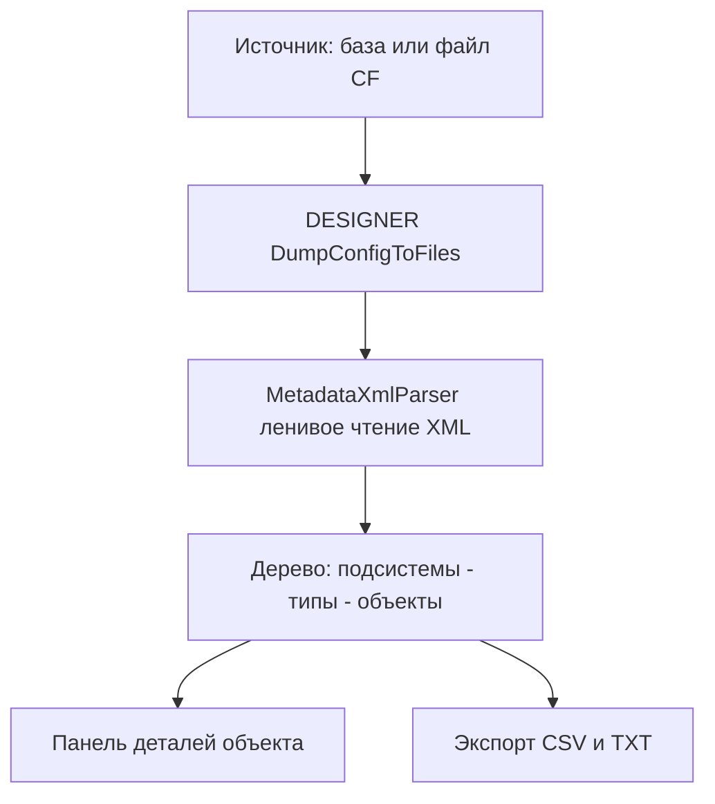

# PLAN — цикл 0.3.9.132–0.3.9.136 — «Обозреватель метаданных конфигурации»

Репозиторий [`sivatorov/ConfigurationManagement`](https://github.com/sivatorov/ConfigurationManagement),
локальная копия `f:\Yandex.Disk\h\Configuration_Management`, ветка `main`.
Локальный HEAD — 0.3.9.131 (csproj строки 62–65, CHANGELOG, бейдж README строка 3, тесты 542/542).
План начинается с версии **0.3.9.132** (по заданию; перед стартом работ синхронизироваться
с origin: `git pull` — если в origin уже есть 0.3.9.132, перенумеровать цикл с 0.3.9.133).

Режим: Архитектор (план) → цепочка задач-исполнителей в режиме **code** (new_task по одному на этап,
созданы единовременно из этого плана). **Один этап = одна версия = один коммит.**
План-файл остаётся untracked (plans/ в .codeassistantignore); CHANGELOG/README/csproj коммитятся.
Релиз/публикация в этот цикл НЕ входит (автор сам).

---

## 1. Сводка

Новая функция «Обозреватель метаданных»: окно «Обозреатель метаданных…» (меню «Утилиты») —
просмотр дерева метаданных конфигурации 1С **без интерактивного конфигуратора**: выгрузка
конфигурации в XML через `/DumpConfigToFiles` (переиспользуется инфраструктура сравнения
конфигураций 0.3.9.99: CREATEINFOBASE `/UseTemplate` для .cf, `RunDesignerBatch`, ожидание по
событию `DesignerBatchCompleted`), затем **чистый ленивый парсер XML-выгрузки** (без 1С):

- **источник данных**: выбранная ИБ (`DumpConfigToFiles` напрямую) ИЛИ файл `.cf`
  (распаковка во временную файловую ИБ `CREATEINFOBASE /UseTemplate` + `DumpConfigToFiles`);
  чтение уже построенных снимков `ConfigurationDiff` НЕ используется — снимки сравнения
  удаляются после операции (решение планирования, §3.5);
- **дерево метаданных**: Конфигурация → подсистемы (вложенные, состав из `Content`) →
  типы объектов (Справочники, Документы, Регистры, Отчёты, Обработки и т.д. — словарь
  `MetadataTypeLocalizer`) → объекты; объекты вне подсистем — раздел «Без подсистемы».
  **Ленивая загрузка**: подсистемы при раскрытии, типы при раскрытии подсистемы, объекты
  при раскрытии типа; детали объекта — по запросу при выборе;
- **детали объекта** (панель справа): имя, синоним, комментарий, число реквизитов /
  табличных частей / форм / команд (по именам файлов в подкаталогах `Attributes/`,
  `TabularSections/`, `Forms/`, `Commands/` — без чтения тел модулей), признак
  иерархичности/упорядоченной иерархичности (`Properties/Hierarchical`,
  `OrderedHierarchical`), суммарный размер файлов объекта, относительный путь в выгрузке;
- **шапка окна**: имя конфигурации и её версия (из корневого `Configuration.xml`);
- **поиск по имени** (по мере ввода, без учёта регистра, с подсветкой совпадений и
  автоматическим раскрытием совпадающих путей; при пустом/коротком запросе — режим дерева),
  **фильтр по типу** (ComboBox «Все типы» + типы из `MetadataTypeLocalizer`);
- **экспорт списка** в CSV/TXT (переиспользование `CsvExporter` и форматов отчёта
  сравнения — заголовок `Тип;Имя;Синоним;Комментарий;Реквизиты;ТЧ;Формы;Иерархический;
  Файлов;Размер;Путь`);
- **индикатор прогресса** при выгрузке (окно по образцу `ConfigDiffProgressWindow`),
  статус-строка, темизация (DynamicResource WPF / ThemeBrushes.Bind Avalonia),
  локализация ru/en;
- **объём выборки**: полное дерево большой конфигурации может быть тяжёлым — ленивая
  загрузка узлов, детали по запросу, модули/макеты не читаются (только факт существования),
  временный каталог выгрузки удаляется при закрытии окна.

| № | Версия  | Этап | Суть | Сложность |
|---|---------|------|------|-----------|
| 1 | 0.3.9.132 | Сервисный слой обозревателя | Модели + `MetadataExplorerService` (DumpFromBase/DumpFromCf, ожидание, таймаут, удаление) + чистый `MetadataXmlParser` (заголовок, типы, объекты, детали, подсистемы) + разведка формата выгрузки на реальной платформе + DI + юнит-тесты | большая |
| 2 | 0.3.9.133 | Окно и ViewModel, ленивое дерево | `MetadataExplorerWindow` (WPF+Avalonia), `MetadataExplorerViewModel`, роу-узлы дерева с ленивой загрузкой, панель деталей, окно прогресса, команда меню «Утилиты», локализация, темизация, очистка временного каталога при закрытии, тесты VM | большая |
| 3 | 0.3.9.134 | Поиск и фильтры | Поиск по имени по мере ввода (debounce, подсветка, автораскрытие), фильтр по типу, индекс объектов, статусы «найдено N из M», тесты фильтрации | средняя |
| 4 | 0.3.9.135 | Экспорт CSV/TXT и документация | `MetadataExplorerReporter` (CSV/TXT, переиспользование `CsvExporter`), кнопки экспорта в окне, README-раздел, финализация локализации | средняя |
| 5 | 0.3.9.136 | Интеграция со сравнением и финализация | Кнопка «Обозреватель метаданных» в `ConfigDiffResultWindow` (режим База↔.cf: предвыбор базы), ограничения объёма (подсказка, лимит результатов поиска), ручной чек-лист, финальный CHANGELOG | средняя |




Общие требования К КАЖДОЙ задаче:
1. Реализация на обеих платформах (Windows/WPF + Linux/Avalonia), где применимо; чистые
   сервисы/VM — без платформенных зависимостей (одна реализация), окна — пара WPF `.xaml`
   / Avalonia `.Avalonia.cs`.
2. Поднять версию в [`Configuration Management.csproj`](Configuration%20Management/Configuration%20Management.csproj:62)
   (строки 62–65: Version/AssemblyVersion/FileVersion/InformationalVersion).
3. Запись в CHANGELOG.md (сверху, формат как у прошлых версий) и обновить бейдж версии в
   README.md (строка 3).
4. Тесты: `dotnet test` зелёный (542 текущих + новые) и `dotnet build -p:BuildLinux=true` без
   ошибок (компиляция Linux-ветки обязательна после каждого изменения).
5. Один коммит (без пуша). Сообщение по образцу: `feat: ...; 0.3.9.XXX`.
6. Задачи-исполнители созданы архитектором единовременно (см. раздел 5): каждая задача
   исполняется независимо и НЕ создаёт следующую (цепочка уже существует).

---

## 2. Ключевые якоря кодовой базы (разведка выполнена 2026-09-28)

### Общее
- Версия: [`Configuration Management.csproj`](Configuration%20Management/Configuration%20Management.csproj:62) —
  4 поля, строки 62–65. Локальный HEAD — 0.3.9.131.
- Регистрация сервисов DI: [`AppServices.cs`](Configuration%20Management/AppServices.cs:14) —
  общий блок (строки 20–75) для обеих платформ; чистые сервисы регистрируются в общем
  блоке (образцы: `IRacClient → RacClient` 61–63, `IRepositoryStorageService →
  RepositoryStorageService` 64–67), UI-зависимые — под `#if WINDOWS` / `#else`.
- Локализация: [`LocalizationManager.cs`](Configuration%20Management/Localization/LocalizationManager.cs:60) —
  ключи-строки в `Localization/Languages/ru.json` и `en.json`, вызов `LocalizationManager.T("Key")`,
  fallback ru→en→ключ. Образцы блоков ключей: `ConfigDiff.*` (ru.json:2262), `RepositoryBrowser.*`.
- Темизация WPF: `{DynamicResource TextPrimaryBrush}` / `TextSecondaryBrush` / `CardBackgroundBrush` /
  `ItemHoverBrush` / `BorderBrush`; implicit `Style TargetType="TextBlock"` (образец:
  [`Views/ProcessInspectorWindow.xaml`](Configuration%20Management/Views/ProcessInspectorWindow.xaml:11)).
- Темизация Avalonia: [`Themes/ThemeBrushes.Avalonia.cs`](Configuration%20Management/Themes/ThemeBrushes.Avalonia.cs:14) —
  `ThemeBrushes.Bind(target, property, "BrushKey")`; статусные цвета: `#16A34A` (ок), `#D97706`
  (предупреждение), `#DC2626` (опасно), `#64748B` (нейтрально).
- Базовый VM: [`ViewModels/ViewModelBase.cs`](Configuration%20Management/ViewModels/ViewModelBase.cs:10) —
  `SetProperty`, `Loc` для `{Binding Loc[Key]}`.
- Формат плана-образца: [`plans/PLAN-0.3.9.127-130.md`](plans/PLAN-0.3.9.127-130.md) (та же структура).

### Инфраструктура выгрузки /DumpConfigToFiles (0.3.9.99) — ПЕРЕИСПОЛЬЗОВАНИЕ
- Оркестратор: [`Services/ConfigurationDiffService.cs`](Configuration%20Management/Services/ConfigurationDiffService.cs:57):
  - `CompareAsync` (69–101): корневой каталог `%TEMP%\cm_configdiff_<guid>` (81), удаление в `finally` (96–99);
  - `PrepareSnapshotFromCf` (103–133): `OneCLauncher.CreateInfoBase(platformVersion, isFile: true, filePath, null, null, templatePath: cfPath, timeoutMs: CreateInfoBaseTimeoutMs)` (121–128), затем `DumpAndSnapshot`;
  - `PrepareSnapshotFromBase` (135–150): сразу `DumpAndSnapshot`;
  - `DumpAndSnapshot` (152–183): `OneCLauncher.RunDesignerBatch(infobase, DesignerBatchOperation.DumpConfigToFiles, dumpDir)` (165–168) → `WaitForBatchAsync` → `ConfigurationDiffEngine.BuildSnapshot`;
  - `CreateTempBase` (185–196): файловая ИБ из platformVersion + каталога;
  - `WaitForBatchAsync` (203–229): `TaskCompletionSource` + событие `OneCLauncher.DesignerBatchCompleted`, фильтр по `info.Operation == operation && info.OutputPath == outputPath`, таймаут `BatchTimeout` (60 мин, строка 60);
  - `TryDeleteDirectory` (231–243): рекурсивное удаление, ошибки игнорируются.
  - **Вывод**: для обозревателя нужен ОДИН снимок без сравнения и БЕЗ удаления каталога до закрытия окна — новые методы выгрузки кладём в отдельный `MetadataExplorerService` (копия паттернов: `CreateTempBase` + `WaitForBatchAsync` + `TryDeleteDirectory`), чтобы не менять семантику `ConfigurationDiffService`.
- Движок: [`Services/ConfigurationDiffEngine.cs`](Configuration%20Management/Services/ConfigurationDiffEngine.cs:14):
  - константы `ConfigDumpInfoFileName` (17), `RootConfigurationFileName` (20), `ConfigurationDirName = "Configuration"` (23);
  - `BuildSnapshot` (33–68): обход `Configuration/<Тип>/<Имя>` — файл или каталог;
  - `BuildObjectList` (82–125) + `AddNestedObjects` (134–152): верхний уровень + вложенные объекты в подкаталогах объекта (`Forms/`, `Attributes/`, `Templates/`, `Commands/`, `Ext/`…) — **готовый образец обхода дерева выгрузки** (этап 1).
- Лаунчер: [`Services/OneCLauncher.DesignerBatch.cs`](Configuration%20Management/Services/OneCLauncher.DesignerBatch.cs):
  - `enum DesignerBatchOperation` (19–69), значение `DumpConfigToFiles` (41–45);
  - `RunDesignerBatch(infobase, operation, outputPath)` (136–296): поиск exe, `IsDesignerBlocked` (165–170), создание каталога выгрузки (198–214), сборка `opArg` `/DumpConfigToFiles"dir"` (232–260), `/Out`-лог (266–267), события `DesignerBatchStarted/Completed`;
  - `CompleteDesignerBatch` (342–400): успех DumpConfigToFiles = exit 0 + каталог существует + есть `ConfigDumpInfo.xml` (371–376);
  - `IsDesignerBlocked` (471–493): параллельные DESIGNER-операции и запущенный конфигуратор базы блокируют старт;
  - `CreateInfoBase` — в [`Services/OneCLauncher.Arguments.cs`](Configuration%20Management/Services/OneCLauncher.Arguments.cs:229) (Windows) и `OneCLauncher.Linux.Process.cs` (Linux), таймаут по умолчанию 5 мин — вызываем с `30 * 60 * 1000` (как `CreateInfoBaseTimeoutMs`, ConfigurationDiffService:63).

### Меню «Утилиты» и команды VM
- WPF-команда-образец: [`ViewModels/MainViewModel.Tools.cs`](Configuration%20Management/ViewModels/MainViewModel.Tools.cs:2683) —
  `ConfigDiffCommand => _configDiffCommand ??= new RelayCommand(_ => ExecuteConfigDiff());`,
  `ExecuteConfigDiff` (2686–2701): установленные платформы + `new ConfigDiffSetupWindow(...) { Owner = Application.Current.MainWindow }.ShowDialog()`.
- Avalonia-команда: [`ViewModels/MainViewModel.Avalonia.Tools.cs`](Configuration%20Management/ViewModels/MainViewModel.Avalonia.Tools.cs:1369) —
  образец `window.ShowDialogSync(OwnerWindow())` (файл `#if LINUX`).
- Пункт меню WPF: [`Views/MainWindow.xaml`](Configuration%20Management/Views/MainWindow.xaml:777) —
  `<MenuItem Header="{loc:Loc ConfigDiff.Title}" Command="{Binding ConfigDiffCommand}" ...>`
  внутри подменю «Утилиты»; рядом RepositoryBrowser (741).
- Пункт меню Avalonia: [`Views/MainWindow.Avalonia.Tree.cs`](Configuration%20Management/Views/MainWindow.Avalonia.Tree.cs:1740) —
  `menu.Items.Add(MenuAction("ConfigDiff.Title", _vm.ConfigDiffCommand, null, "IconCompare", "#06B6D4"));`
  внутри `BuildUtilitiesMenu()`; рядом RepositoryBrowser (1719).
- Команда активна всегда (источник выбирается в окне) — CanExecute-логика не нужна.

### Окна-образцы
- Setup + прогресс: [`Views/ConfigDiffSetupWindow.xaml.cs`](Configuration%20Management/Views/ConfigDiffSetupWindow.xaml.cs:128) —
  `OnCompare_Click`: валидация → `new ConfigDiffProgressWindow { Owner = this }` (180) → `Task.Run(() => service.CompareAsync(request, progressAdapter))` (188–189) → результат/ошибка; `ConfigDiffProgressWindow.SetStage` потокобезопасно.
- Результат + экспорт: [`Views/ConfigDiffResultWindow.xaml.cs`](Configuration%20Management/Views/ConfigDiffResultWindow.xaml.cs:33) —
  `OnExportCsv_Click` (33–58): `SaveFileDialog` → `CsvExporter.WriteFile(path, _vm.BuildCsvRows())`;
  `OnExportTxt_Click` (60–85): `File.WriteAllText(path, _vm.BuildTextReport(), Encoding.UTF8)`.
- Чистая VM результата: [`ViewModels/ConfigDiffResultViewModel.cs`](Configuration%20Management/ViewModels/ConfigDiffResultViewModel.cs:76) —
  `BuildCsvRows()` / `BuildTextReport()` через [`Services/ConfigurationDiffReporter.cs`](Configuration%20Management/Services/ConfigurationDiffReporter.cs:14) (`BuildCsvRows` 31–58, `BuildText` 65–104; колбэк-локализатор `Func<string,string> t` — тестируемость).
- VM с делегатами для тестов (ГЛАВНЫЙ ОБРАЗЕЦ для нового VM): [`ViewModels/RepositoryBrowserViewModel.cs`](Configuration%20Management/ViewModels/RepositoryBrowserViewModel.cs:89) —
  конструктор `(Infobase, IRepositoryStorageService, IDialogService, Action<Action>? dispatchToUi, ..., Func<...>? compareAsync)`; флаг занятости `Interlocked` (329–363), статус/ошибки через `ApplyError`/`BuildErrorMessage`, `TryDeleteDirectory` временного каталога в `finally` (416–420).
- Роу-модели: [`ViewModels/RepositoryObjectRow.cs`](Configuration%20Management/ViewModels/RepositoryObjectRow.cs:9) —
  локализация типа через `MetadataTypeLocalizer.GetDisplayName(TypeDir, LocalizationManager.T)`.
- Локализатор типов: [`Services/MetadataTypeLocalizer.cs`](Configuration%20Management/Services/MetadataTypeLocalizer.cs:14) —
  словарь «каталог выгрузки → ключ локализации» (31 тип), `GetDisplayName` (53–64), `SortTypes` (70–85).
- Модели снимков: [`Models/ConfigurationDiffModel.cs`](Configuration%20Management/Models/ConfigurationDiffModel.cs:30) —
  `MetadataObject(TypeDir, Name, Kind, FileCount, TotalBytes)` (30–39), внутренние `ConfigurationSnapshot` (76–79), `SnapshotObjectInfo` (82).

### Проект, тесты
- Linux ItemGroup: [`Configuration Management.csproj`](Configuration%20Management/Configuration%20Management.csproj:193):
  чистые сервисы — паттерн `Remove+Include` (образцы ConfigurationDiff* 406–416, CsvExporter 447–448);
  чистые VM — `Compile Include` (образцы RepositoryBrowser* 387–392, ConfigDiffResultViewModel 401);
  окна Avalonia — глоб `Views\*Window.Avalonia.cs` (512–513); WPF code-behind — `Compile Remove` (258–260, 252).
- Тесты-образец: [`ConfigurationManagement.Tests/ConfigurationDiffTests.cs`](Configuration%20Management/ConfigurationManagement.Tests/ConfigurationDiffTests.cs:15) —
  выгрузка строится на лету во временной папке (21–28), `FakeT`-локализатор (31–37), хелперы `CreateDump`/`WriteFile`.
- Экспорт CSV: [`Services/CsvExporter.cs`](Configuration%20Management/Services/CsvExporter.cs:12) — UTF-8 BOM, разделитель «;», `WriteFile`.
- Существующая модель дерева метаданных: [`Models/MetadataNode.cs`](Configuration%20Management/Models/MetadataNode.cs:57) +
  `Infobase.MetadataRoot` (Models/Infobase.cs:597) заполняются из COM-диалога свойств базы — **для обозревателя НЕ используются** (источник — XML-выгрузка, структура «подсистемы→типы→объекты» иная); отметить в комментарии нового кода, чтобы не путать с `Infobase.MetadataRoot`.

---

## 3. Разведка формата XML-выгрузки /DumpConfigToFiles (что реально извлекаемо)

Каталог выгрузки (известно по ConfigurationDiffEngine + документации платформы; детали
головного XML уточняются экспериментально на этапе 1):

```
<dump>/
├── ConfigDumpInfo.xml                  служебный: версия платформы, сформировавшая выгрузку
├── Configuration.xml                   корневой XML конфигурации:
│     <MetaDataObject><Configuration><Properties>
│       <Name>…</Name> <Synonym>…</Synonym> <Comment>…</Comment> <Version>1.2.3.4</Version> …
│     </Properties><ChildObjects>…</ChildObjects></Configuration></MetaDataObject>
└── Configuration/
    ├── Subsystem/<Имя>.xml             подсистема: Properties + ChildObjects/Subsystem (вложенные)
    │                                    + <Content><v8:item><v8:content>Catalog.Контрагенты</v8:content>…
    ├── Document/<Имя>.xml              файловый объект (нет подчинённых): головной XML с Properties
    │                                    и ChildObjects (реквизиты/формы ВКЛЮЧЕНЫ в этот файл)
    ├── Catalog/<Имя>/                  каталог-объект (есть подчинённые):
    │     ├── <Имя>.xml                 головной XML объекта (Properties: Name/Synonym/Comment/
    │     │                              Hierarchical/OrderedHierarchical; ChildObjects-списки)
    │     ├── Attributes/*.xml          реквизиты (по одному файлу на реквизит)
    │     ├── TabularSections/*.xml     табличные части
    │     ├── Forms/*.xml (или Forms/<Форма>/)  формы (+ модуль формы в подкаталоге)
    │     ├── Templates/*.xml           шаблоны
    │     ├── Commands/*.xml            команды
    │     └── Ext/Modules/*.xml         модули объекта — тела НЕ читаем, только факт существования
    └── <остальные типы по словарю MetadataTypeLocalizer>/
```

Извлекаемое БЕЗ разбора модулей:
1. **Имя и версия конфигурации** — `Configuration.xml` → `Configuration/Properties/Name`, `Version` (шапка окна).
2. **Список типов и объектов** — каталоги первого уровня `Configuration/` + записи в них
   (обход как `ConfigurationDiffEngine.BuildSnapshot`/`BuildObjectList`); имя, признак
   «каталог-объект» (есть подчинённые), суммарный размер файлов, относительный путь.
3. **Синоним, комментарий, иерархичность** — головной XML объекта:
   `Properties/Synonym` (формат `<Synonym><v8:item><v8:lang>ru</v8:lang><v8:content>…</v8:content>
   </v8:item>…</Synonym>` — берём item текущей локали, fallback первый), `Properties/Comment`,
   `Properties/Hierarchical` / `OrderedHierarchical` (справочники, планы видов характеристик
   и т.п.; для остальных типов поля нет → false).
4. **Число реквизитов / табличных частей / форм / команд / шаблонов** — по именам файлов
   `*.xml` в подкаталогах объекта (`Attributes/`, `TabularSections/`, `Forms/`, `Commands/`,
   `Templates/`) +, если объект файловый, по элементам `ChildObjects` головного XML
   (надёжный путь — подсчёт по подкаталогам; файловый случай — по ChildObjects).
5. **Дерево подсистем и состав** — `Configuration/Subsystem/*.xml`: вложенность через
   `ChildObjects/Subsystem`, состав через `Content/v8:item/v8:content` (полные имена
   `Тип.Имя` — сопоставляются с объектами по `TypeDir.Name`; объект может входить в
   несколько подсистем).
6. **Размер и путь** — из обхода файловой системы (панель деталей: «Файлов: N, Размер: X,
   Путь: Configuration/Catalog/Имя»).

НЕ извлекаемо (ограничение, фиксируется в README и UI-hint):
- содержимое модулей (тексты кода), макетов, содержимое форм — только факт существования;
- права ролей, предопределённые элементы (в v1 не разбираются);
- связи объектов (подчинённые справочники) — только фактические подчинённые (Attributes и т.п.).

Устойчивость парсера: отсутствующие файлы/теги → default; кривой/битый XML → частичный
результат (не ронять окно); неизвестные типы — как есть (fallback `MetadataTypeLocalizer`).

---

## 4. Декомпозиция на этапы

### Этап 1 — 0.3.9.132: сервисный слой обозревателя (выгрузка + парсер XML)

**Цель:** чистый, тестируемый слой: модели выгрузки/объекта/подсистемы, сервис выгрузки
одной стороны (`MetadataExplorerService` — копия паттернов `ConfigurationDiffService` без
сравнения и без удаления каталога до вызова `Dispose`), ленивый парсер XML-выгрузки
(`MetadataXmlParser`), регистрация в DI. Плюс **разведка на реальной платформе** (фактическая
структура выгрузки, расположение головного XML в каталоге-объекте, формат `Synonym`/`Content`/
`Hierarchical`) с фиксацией результатов в комментариях кода и тестах-образцах.

**Новые файлы:**
- `Configuration Management/Models/MetadataExplorerModels.cs` — POCO:
  - `MetadataObjectSummary { string TypeDir; string Name; bool HasNested; int FileCount; long TotalBytes; string RelPath; }`
    (каталог-объект или файл, размер, путь `Configuration/<Тип>/<Имя>`);
  - `MetadataObjectDetails { string Name; string Synonym; string Comment; bool IsHierarchical; bool IsOrderedHierarchical; int AttributeCount; int TabularSectionCount; int FormCount; int CommandCount; int TemplateCount; long TotalBytes; string RelPath; }`;
  - `MetadataSubsystem { string Name; string Synonym; string Comment; string Key; IReadOnlyList<string> ContentKeys; IReadOnlyList<MetadataSubsystem> Children; }`
    (Key = `Subsystem.<ПолноеИмя>`; ContentKeys = полные имена объектов вида `Catalog.Контрагенты`);
  - `MetadataDump { string RootPath; string ConfigurationName; string ConfigurationVersion; void Delete(); }`
    (Delete = рекурсивное удаление каталога, ошибки игнорируются — образец
    `ConfigurationDiffService.TryDeleteDirectory`).
- `Configuration Management/Services/IMetadataExplorerService.cs` — интерфейс (для VM-тестов).
- `Configuration Management/Services/MetadataExplorerService.cs` — оркестратор выгрузки
  (образец `ConfigurationDiffService`), методы:
  - `Task<MetadataDump> DumpFromBaseAsync(Infobase infobase, IProgress<string>? progress, CancellationToken ct)`
    — каталог `%TEMP%\cm_metaeplorer_<guid>`, `RunDesignerBatch(DumpConfigToFiles)` +
    `WaitForBatchAsync` (событие `DesignerBatchCompleted`, таймаут 60 мин), заголовок из
    `MetadataXmlParser.ParseConfigurationHeader`;
  - `Task<MetadataDump> DumpFromCfAsync(string cfPath, string platformVersion, IProgress<string>?, CancellationToken ct)`
    — `CreateInfoBase(platformVersion, isFile: true, ibDir, null, null, templatePath: cfPath, timeoutMs: 30*60*1000)`
    → временная ИБ → `DumpConfigToFiles` (переиспользование приёмов
    `ConfigurationDiffService.PrepareSnapshotFromCf`); каталог НЕ удаляется (живёт, пока открыто окно);
  - исключение `MetadataExplorerException` (человекочитаемое, образец `ConfigurationDiffException`);
  - `WaitForBatchAsync`/`TryDeleteDirectory` — приватные копии паттернов.
- `Configuration Management/Services/MetadataXmlParser.cs` — ЧИСТЫЙ ленивый парсер
  (`System.Xml.Linq`, устойчивый к битому XML; без зависимостей от 1С/UI):
  - `MetadataDumpHeader ParseConfigurationHeader(string dumpRoot)` → имя/версия конфигурации
    из `Configuration.xml` (null-safe);
  - `IReadOnlyList<string> EnumerateTypeDirs(string dumpRoot)` → каталоги `Configuration/`
    (порядок — `MetadataTypeLocalizer.SortTypes`);
  - `IReadOnlyList<MetadataObjectSummary> EnumerateObjects(string dumpRoot, string typeDir)`
    → записи каталога типа (обход как `BuildSnapshot`/`BuildObjectList`: файл `<Имя>.xml`
    или каталог `<Имя>/` с суммой размеров и числом файлов; игнор служебных);
  - `MetadataObjectDetails ReadObjectDetails(string dumpRoot, string typeDir, string name)`
    → головной XML (файловый объект `<TypeDir>/<Имя>.xml`; каталог-объект —
    `<TypeDir>/<Имя>/<Имя>.xml`; **оба варианта проверить на разведке**): Properties
    (Name/Synonym/Comment/Hierarchical/OrderedHierarchical) + счётчики подчинённых:
    по подкаталогам `Attributes/`, `TabularSections/`, `Forms/`, `Commands/`, `Templates/`
    (число файлов `*.xml`) +, для файлового объекта, по `ChildObjects` головного XML;
    тела модулей (`Ext/Modules`) НЕ читаются;
  - `IReadOnlyList<MetadataSubsystem> ReadSubsystems(string dumpRoot)` → дерево подсистем
    (Properties + `ChildObjects/Subsystem` + `Content/v8:item/v8:content`);
  - все методы null-safe, отсутствующие данные → default; параметры-«имена файлов» без
    расширения нормализуются через `Path.GetFileNameWithoutExtension` (образец
    `AddNestedObjects` ConfigurationDiffEngine:144–149).
- `Configuration Management/AppServices.cs` — в ОБЩЕМ блоке (рядом с `IRepositoryStorageService`,
  ~строка 67): `services.AddSingleton<IMetadataExplorerService, MetadataExplorerService>();`.

**Изменяемые:**
- `Configuration Management/Configuration Management.csproj` — Linux ItemGroup (строки 406–416
  и далее): `Remove+Include` для новых чистых файлов (`MetadataExplorerModels.cs`,
  `IMetadataExplorerService.cs`, `MetadataExplorerService.cs`, `MetadataXmlParser.cs`);
  версия 0.3.9.132 (строки 62–65).
- `CHANGELOG.md`, `README.md` (бейдж строки 3).

**Тесты:** `ConfigurationManagement.Tests/MetadataExplorerTests.cs` (и/или
`MetadataXmlParserTests.cs`), образец `ConfigurationDiffTests` (выгрузка на лету, FakeT):
- `ParseConfigurationHeader`: имя/версия из фикстуры; отсутствие файла → дефолт;
- `EnumerateTypeDirs`: порядок по `MetadataTypeLocalizer.SortTypes`, неизвестные типы — в конце;
- `EnumerateObjects`: файловый объект и каталог-объект (суммарный размер, FileCount, HasNested);
- `ReadObjectDetails`: синоним (первый item / по языку), комментарий, иерархичность;
  счётчики реквизитов/ТЧ/форм/команд по подкаталогам; файловый объект с ChildObjects;
  битый XML → дефолт без исключения;
- `ReadSubsystems`: вложенные подсистемы, Content-ключи, пустой Content;
- сервис: построение пути `cm_metaeplorer_<guid>`, `MetadataDump.Delete()` удаляет каталог
  (без запуска 1С — только логика каталогов).

**Разведка на этапе 1 (поручение реализатору, на установленной платформе):**
- прогнать `/DumpConfigToFiles` для небольшой базы или маленького .cf; зафиксировать:
  расположение головного XML в каталоге-объекте (`<Имя>/<Имя>.xml`? или иначе), подкаталоги
  вложенных объектов, формат `Synonym` (`v8:item`/`v8:lang`/`v8:content`), `Content` подсистем
  (форма `v8:content` или `Ref=`), наличие `Hierarchical`/`OrderedHierarchical`;
- результаты — в комментариях кода и тестах-образцах (реальные строки фикстур).

**Коммит:** `feat: обозреватель метаданных — сервисный слой (выгрузка и парсер XML); 0.3.9.132`.

### Этап 2 — 0.3.9.133: окно «Обозреватель метаданных» и ViewModel (ленивое дерево, детали)

**Цель:** рабочее окно: панель источника (база ИЛИ файл .cf + кнопка «Загрузить»), окно
прогресса выгрузки, ленивое дерево «Конфигурация → подсистемы → типы → объекты» (раздел
«Без подсистемы»), панель деталей выбранного объекта, статус-строка; очистка временного
каталога при закрытии окна. Поиск/фильтр — этап 3, экспорт — этап 4 (кнопки-заготовки disabled).

**Новые файлы:**
- `Configuration Management/ViewModels/MetadataTreeNodeViewModel.cs` — узел дерева:
  - `enum MetadataTreeNodeKind { Root, Subsystem, NoSubsystemGroup, Type, Object }`;
  - свойства: Kind, DisplayName (локализованный), CountText («(N)»), `ObservableCollection<MetadataTreeNodeViewModel> Children`,
    `HasChildren`, `IsExpanded`, `IsSelected`, Parent, `IsLoaded` (ленивая загрузка,
    `EnsureLoaded()` идемпотентна), ссылки `MetadataObjectSummary`/`MetadataSubsystem`;
  - поисковая пометка `IsMatch` (для подсветки на этапе 3 — заготовка).
- `Configuration Management/ViewModels/MetadataExplorerViewModel.cs` — чистая VM (образец
  `RepositoryBrowserViewModel`):
  - вход: `Infobase? selectedBase`, `IReadOnlyList<Infobase> bases`, `IMetadataExplorerService service`,
    `IDialogService dialogs`, `Action<Action>? dispatchToUi` (null — тесты);
  - панель источника: `SourceMode` (Base/Cf), `Bases` (ComboBox, превыбор selectedBase),
    `CfPath`, `LoadCommand` (валидация → `DumpFromBaseAsync`/`DumpFromCfAsync` с прогрессом →
    `ApplyDump` строит корень дерева: узел «Конфигурация <имя> <версия>» → узел «Подсистемы»
    (из `ReadSubsystems`, лениво) + узел «Без подсистемы» (типы → объекты, лениво); при
    отсутствии подсистем — узел «Все объекты»);
  - шапка: `ConfigurationTitle` = «<имя> <версия>» (из `MetadataDump`);
  - детали: `SelectedObject` → `ObjectDetails` (синоним/комментарий/счётчики/размер/путь),
    форматирование размера как в отчёте сравнения (байты);
  - статус-строка/ошибки (`MetadataExplorerException`/`ConfigurationDiffException`-стиль),
    флаг занятости через `Interlocked` (образец RepositoryBrowserViewModel:329–363);
  - `Dispose()` — `_dump?.Delete()` (удаление временного каталога; вызывается окном в Closed);
  - событие `StageChanged` (для окна прогресса).
- `Configuration Management/Views/MetadataExplorerWindow.xaml` + `.xaml.cs` (WPF):
  верхняя панель: RadioButton «База»/«Файл .cf», ComboBox баз, TextBox+«Обзор…» для .cf,
  ModernButton «Загрузить», шапка конфигурации, статус-строка; основная область:
  `GridSplitter` + `TreeView` (узлы с `TextBlock` DisplayName) + панель деталей справа
  (имя, синоним, комментарий, счётчики, размер, путь); кнопки «Экспорт CSV…»/«Экспорт TXT…»
  — заготовки disabled; стили `{DynamicResource ...}`, implicit `Style TargetType="TextBlock"`;
  событие `TreeViewItem.Expanded` → `EnsureLoaded()` узла; закрытие окна → `_vm.Dispose()`.
- `Configuration Management/Views/MetadataExplorerWindow.Avalonia.cs` (Linux): `ModalWindowBase`,
  `TreeView` + `TreeDataTemplate`/`FuncDataTemplate` (LevelTree, по образцу
  `MainWindow.Avalonia.Tree.cs` и `ProcessInspectorWindow.Avalonia.cs`), `ThemeBrushes.Bind`,
  обработка раскрытия узлов; `Closed` → Dispose.
- `Configuration Management/Views/MetadataExplorerProgressWindow.cs` + `.Avalonia.cs` —
  indeterminate + `SetStage(string)` (образец `ConfigDiffProgressWindow`, WPF — DynamicResource
  `TextPrimaryBrush`).

**Изменяемые:**
- `ViewModels/MainViewModel.Tools.cs` (WPF): команда `MetadataExplorerCommand` →
  `ExecuteMetadataExplorer`: `new MetadataExplorerWindow(Infobases.ToList(), SelectedInfobase, ...)
  { Owner = Application.Current.MainWindow }.ShowDialog()` (рядом с `ExecuteConfigDiff`, 2686–2701);
  активна всегда.
- `ViewModels/MainViewModel.Avalonia.Tools.cs` (Linux): то же (`ShowDialogSync(OwnerWindow())`).
- `Views/MainWindow.xaml` (WPF): в «Утилитах» после строки 777 пункт «Обозреватель метаданных…»
  (`MetadataExplorer.Title`, команда, иконка по образцу соседних, например
  `PackIcon Kind="DatabaseSearch"`/`Sitemap`, цвет `#8B5CF6`/`#06B6D4`).
- `Views/MainWindow.Avalonia.Tree.cs` (Linux): `BuildUtilitiesMenu` после строки 1740 —
  тот же пункт (`MenuAction("MetadataExplorer.Title", _vm.MetadataExplorerCommand, null, "IconSitemap"/"IconCompare", "#06B6D4")`).
- `Localization/Languages/ru.json`, `en.json`: ключи `MetadataExplorer.*` (Title, SourceBase,
  SourceCf, Browse, Load, Status.*, Details.*, Columns/FieldLabels, Errors.*, Empty.*, Hint,
  NoSubsystems и т.д.); блок рядом с `ConfigDiff.*`.
- `Configuration Management/Configuration Management.csproj` — Linux ItemGroup: `Compile Include`
  для `MetadataExplorerViewModel.cs`, `MetadataTreeNodeViewModel.cs`; `Compile Remove` для
  `MetadataExplorerWindow.xaml.cs` (WPF code-behind); окно прогресса `MetadataExplorerProgressWindow.cs`
  — `Compile Remove` + Avalonia-версия покрыта глобом `*Window.Avalonia.cs`; версия 0.3.9.133.
- `CHANGELOG.md`, `README.md` (бейдж).

**Тесты:** `ConfigurationManagement.Tests/MetadataExplorerViewModelTests.cs` (fake
`IMetadataExplorerService` + временная выгрузка на лету):
- дефолты (пустые коллекции, шапка пуста, команды существуют), выбор источника (база/.cf),
  валидация (пустой путь .cf → ошибка), `LoadCommand` строит корень (подсистемы + «Без
  подсистемы»), ленивое раскрытие узла (EnsureLoaded подгружает детей один раз),
  выбор объекта → детали, `Dispose` вызывает `Delete` (каталог удалён), ошибки — статус-строка.
- `dotnet test` зелёный + `dotnet build -p:BuildLinux=true`.

**Коммит:** `feat: обозреватель метаданных — окно, ViewModel и ленивое дерево; 0.3.9.133`.

### Этап 3 — 0.3.9.134: поиск по имени и фильтр по типу

**Цель:** поиск по имени объекта по мере ввода (без учёта регистра, debounce ~300 мс,
подсветка совпадений, автораскрытие путей), фильтр по типу (ComboBox), статус «найдено N из M».

- В `MetadataExplorerViewModel`:
  - `SearchText` (TextBox), `DebounceSearch` (CancellationTokenSource + Task.Delay(300) —
    образец паттерна debounce в проекте, напр. поиск командной палитры `CommandPaletteViewModel`),
    `SearchResultsCount`, `IsSearchActive`; `TypeFilter` + `AvailableTypes` (из
    `MetadataTypeLocalizer.SortTypes`), `ApplyFilters()`;
  - **индекс объектов**: при первом поиске лениво догружается недостающая часть дерева
    (последовательно `EnumerateObjects` по всем типам всех подсистем + «Без подсистемы»;
    прогресс в статус-строке «Индексация… N объектов»); плоский список
    `IReadOnlyList<MetadataObjectSummary>` с путями; повторные поиски — по индексу;
  - фильтрация: `Contains` без учёта регистра (OrdinalIgnoreCase); совпадающие объекты
    помечаются `IsMatch`, их пути раскрываются (узлы `IsExpanded = true` от корня);
  - ограничение: максимум результатов (константа, например 500) — при превышении статус
    «Результатов много, уточните запрос»;
  - пустой/короткий запрос (менее 2 символов) — режим дерева без подсветки.
- Окна (WPF/Avalonia): поле поиска с кнопкой «Очистить», ComboBox фильтра типа, подсветка
  совпадений в дереве (WPF: `TextBlock` с `Run`/Background через DataTemplate по `IsMatch`;
  Avalonia: BackgroundBrush по `IsMatch` через `ThemeBrushes.Bind`/DataTrigger).
- Локализация: `MetadataExplorer.Search.*`, `.TypeFilter.All`, `.Status.FoundFormat`,
  `.Status.Indexing`, `.Status.TooManyResults`.
- Тесты: `MetadataExplorerSearchTests.cs` — фильтрация без учёта регистра, подсветка `IsMatch`,
  фильтр по типу, совместное действие, debounce-функция (чистая), лимит результатов,
  пустой запрос, индекс догружает недостающие типы (fake-парсер/временная выгрузка).

**Коммит:** `feat: обозреватель метаданных — поиск по имени и фильтр по типу; 0.3.9.134`.

### Этап 4 — 0.3.9.135: экспорт CSV/TXT и документация

**Цель:** экспорт видимого списка объектов в CSV/TXT (переиспользование `CsvExporter` и
форматов отчёта сравнения), кнопки экспорта в окне, README-раздел, финализация локализации.

- `Services/MetadataExplorerReporter.cs` — чистый класс (образец `ConfigurationDiffReporter`,
  локализация колбэком `Func<string,string> t`):
  - `BuildCsvRows(IReadOnlyList<MetadataExportRow> rows, Func<string,string> t)` — заголовок
    «Тип;Имя;Синоним;Комментарий;Реквизиты;Табличные части;Формы;Команды;Иерархический;
    Файлов;Размер,байт;Путь в выгрузке»;
  - `BuildText(header, IReadOnlyList<MetadataExportRow> rows, Func<string,string> t)` —
    шапка (источник: база/.cf, конфигурация, версия, дата), блочная группировка по типам;
  - `MetadataExportRow { TypeDir, Name, Synonym, Comment, AttributeCount, TabularSectionCount,
    FormCount, CommandCount, IsHierarchical, FileCount, TotalBytes, RelPath }` (собирается
    из деталей; при необходимости детали догружаются массово с прогрессом в статус-строке).
- VM: `BuildExportRows()` (текущее представление: с учётом поиска/фильтра), команды
  `ExportCsvCommand`/`ExportTxtCommand`.
- Окна (WPF/Avalonia): кнопки «Экспорт CSV…»/«Экспорт TXT…» — `SaveFileDialog`
  (предлагаемое имя `Metadata_ГГГГ-ММ-ДД.csv/.txt`) → `CsvExporter.WriteFile` /
  `File.WriteAllText(..., Encoding.UTF8)` (образец `ConfigDiffResultWindow.xaml.cs:33–85`);
  Avalonia — через `IDialogService.SaveFileDialog` (образец `RepositoryBrowserViewModel.DumpVersionToCfAsync`).
- README.md: пункт «Возможности» — «Обозреватель метаданных (меню „Утилиты“)»: источник
  (база или .cf), механика `/DumpConfigToFiles` без конфигуратора, дерево подсистем, детали
  объекта, поиск/фильтр, экспорт CSV/TXT, ограничение (только метаданные, модули не
  разбираются; большие конфигурации — время выгрузки).
- CHANGELOG.md: запись 0.3.9.135; выверка `MetadataExplorer.*` в ru.json/en.json.
- Тесты: `MetadataExplorerReporterTests.cs` — CSV-строки (заголовок, экранирование через
  `CsvExporter`), TXT-блоки (шапка, группировка по типам), локализация колбэком, пустой список.

**Коммит:** `feat: обозреватель метаданных — экспорт CSV/TXT и документация; 0.3.9.135`.

### Этап 5 — 0.3.9.136: интеграция со сравнением конфигураций и финализация

**Цель:** кнопка «Обозреватель метаданных» в окне отчёта сравнения (режим «База ↔ .cf» —
предвыбор левой базы), ограничения объёма (подсказка перед выгрузкой, лимит результатов
поиска уже на этапе 3), ручной чек-лист, финальный CHANGELOG.

- `Views/ConfigDiffResultWindow.xaml(.cs)` / `.Avalonia.cs`: кнопка «Обозреватель метаданных»
  в панели действий; доступна, если окно знает левую базу (режим `BaseVsCf`): конструктор
  окна дополняется опциональным параметром `Infobase? baseForExplorer` (вызывающий —
  `ConfigDiffSetupWindow.OnCompare_Click` передаёт `baseSelected` в режиме BaseVsCf, для
  CfVsCf — null; изменения НЕ ломают существующие вызовы — параметр опционален);
  по нажатию — открывается `MetadataExplorerWindow` с предвыбранной базой и сразу загрузкой
  (`LoadCommand.Execute(null)`), Owner = текущее окно.
- `MetadataExplorerViewModel`: при старте выгрузки из базы — быстрая проверка доступности/
  блокировки: если `OneCLauncher.IsDesignerBlocked(base, out reason)` — предупреждение через
  `IDialogService.Confirm` («база запущена / идёт другая операция — продолжить?»; как в
  пакетном обновлении); подсказка в окне «Выгрузка большой конфигурации может занять время
  (модули не разбираются)» — ключ `MetadataExplorer.Hint.LargeConfig`.
- Ограничения объёма: статус после выгрузки — «Выгружено: N файлов, X МБ» (суммарно по
  каталогу выгрузки, быстрое сканирование) — пользователь видит масштаб; поиск — лимит 500
  результатов (этап 3).
- README/CHANGELOG: финализация (запись 0.3.9.136, дополнение раздела обозревателя —
  интеграция со сравнением).
- Проверки: `dotnet test` (542 + новые зелёные), `dotnet build -p:BuildLinux=true`.
- Ручной чек-лист (Windows + Linux, светлая/тёмная тема, ru/en): загрузка из базы и из .cf,
  дерево подсистем (вложенные, «Без подсистемы»), детали объекта (синоним/комментарий/
  счётчики/иерархичность/размер/путь), поиск (подсветка, автораскрытие, лимит), фильтр по
  типу, экспорт CSV/TXT (открытие в Excel/редакторе), закрытие окна удаляет `%TEMP%\cm_metaeplorer_*`,
  ошибки (запущенная база, нет платформы, битый .cf), кнопка «Обозреватель метаданных» в
  отчёте сравнения; дефекты — отдельными коммитами в пределах 0.3.9.136 (правило «один этап =
  одна версия = один коммит» допускает правки в пределах версии, т.к. релиза нет).

**Коммит:** `feat: обозреватель метаданных — интеграция со сравнением и финализация; 0.3.9.136`.

---

## 5. Сообщения-инструкции для задач-исполнителей (переданы в new_task mode=code)

> Общая шапка для каждого сообщения: «Задача этапа N цикла 0.3.9.132–0.3.9.136 (обозреватель
> метаданных конфигурации). Репозиторий sivatorov/ConfigurationManagement, локальная копия
> f:\Yandex.Disk\h\Configuration_Management, ветка main. Перед началом: git pull (синхронизация
> с origin). Требования: обе платформы (Windows/WPF + Linux/Avalonia), версия в
> Configuration Management.csproj строки 62–65 → 0.3.9.XXX, запись в CHANGELOG.md сверху,
> бейдж README.md строка 3, dotnet test зелёный (542 текущих + новые) + dotnet build
> -p:BuildLinux=true, один коммит без пуша. План-файл: plans/PLAN-0.3.9.132-136.md (прочитать,
> разделы 2–4). Задачи созданы архитектором единовременно — следующую задачу НЕ создавать
> (цепочка уже существует).»

### Задача 1 (0.3.9.132) — сервисный слой обозревателя
Прочитать план, разделы 2–3 и Этап 1. Реализовать:
1. `Models/MetadataExplorerModels.cs` — `MetadataObjectSummary`, `MetadataObjectDetails`,
   `MetadataSubsystem`, `MetadataDump` (+`Delete()`), `MetadataExplorerException`.
2. `Services/MetadataXmlParser.cs` — чистый парсер: `ParseConfigurationHeader`,
   `EnumerateTypeDirs`, `EnumerateObjects`, `ReadObjectDetails`, `ReadSubsystems`;
   null-safe, битый XML не роняет; счётчики подчинённых по подкаталогам `Attributes/`,
   `TabularSections/`, `Forms/`, `Commands/`, `Templates/` (+ для файлового объекта — по
   `ChildObjects` головного XML); головной XML каталога-объекта — `<TypeDir>/<Имя>/<Имя>.xml`
   (подтвердить на разведке); модули (`Ext/Modules`) не читаются.
3. `Services/IMetadataExplorerService.cs` + `Services/MetadataExplorerService.cs` —
   `DumpFromBaseAsync(Infobase, IProgress<string>?, CancellationToken)` и
   `DumpFromCfAsync(string cfPath, string platformVersion, IProgress<string>?, CancellationToken)`;
   каталог `%TEMP%\cm_metaeplorer_<guid>`; ожидание по событию `DesignerBatchCompleted`
   (копия `ConfigurationDiffService.WaitForBatchAsync`), таймаут 60 мин; `CreateInfoBase`
   с timeoutMs = 30 мин; каталог НЕ удалять до `MetadataDump.Delete()`.
4. `AppServices.cs` — `services.AddSingleton<IMetadataExplorerService, MetadataExplorerService>();`
   в общем блоке (~строка 67).
5. `Configuration Management.csproj` — Linux ItemGroup: `Remove+Include` новых чистых файлов;
   версия 0.3.9.132.
6. Тесты `MetadataExplorerTests.cs` / `MetadataXmlParserTests.cs` (образец `ConfigurationDiffTests`:
   выгрузка на лету, FakeT): заголовок, типы, объекты, детали (синоним/комментарий/
   иерархичность/счётчики), подсистемы (вложенные, Content), устойчивость к битому XML,
   `MetadataDump.Delete()`.
7. **Разведка на реальной платформе**: `/DumpConfigToFiles` на маленькой базе/.cf —
   зафиксировать фактическую структуру (головной XML каталога-объекта, `Synonym`, `Content`,
   `Hierarchical`) в комментариях кода и фикстурах тестов.
8. Версия 0.3.9.132, CHANGELOG, README-бейдж, dotnet test, build -p:BuildLinux=true.
9. Коммит `feat: обозреватель метаданных — сервисный слой (выгрузка и парсер XML); 0.3.9.132`.
10. Следующую задачу НЕ создавать.

### Задача 2 (0.3.9.133) — окно, ViewModel, ленивое дерево
Прочитать план (Этап 2). Реализовать: `ViewModels/MetadataTreeNodeViewModel.cs` (Kind, Children,
`EnsureLoaded()`, IsExpanded/IsSelected/IsMatch-заготовка); `ViewModels/MetadataExplorerViewModel.cs`
(панель источника база/.cf, `LoadCommand` с прогрессом, корень «Конфигурация → Подсистемы +
Без подсистемы»/«Все объекты», детали выбранного объекта, статус-строка, `Dispose()` →
`MetadataDump.Delete()`; образец — `RepositoryBrowserViewModel`); окна
`Views/MetadataExplorerWindow.xaml`/`.xaml.cs` (WPF: TreeView + GridSplitter + панель деталей,
Expanded → EnsureLoaded, Closed → Dispose, кнопки экспорта — disabled-заготовки) и
`Views/MetadataExplorerWindow.Avalonia.cs` (TreeView + TreeDataTemplate, ThemeBrushes.Bind,
Closed → Dispose); `Views/MetadataExplorerProgressWindow.cs` + `.Avalonia.cs` (образец
`ConfigDiffProgressWindow`); команда `MetadataExplorerCommand` в `MainViewModel.Tools.cs`
(WPF, рядом с ExecuteConfigDiff 2686–2701) и `MainViewModel.Avalonia.Tools.cs` (Linux,
ShowDialogSync); пункты меню «Утилиты» в `Views/MainWindow.xaml` (после строки 777) и
`Views/MainWindow.Avalonia.Tree.cs` (после строки 1740); ключи `MetadataExplorer.*` в
ru.json/en.json; темизация; csproj Linux (Compile Include VM, Compile Remove WPF code-behind);
версия 0.3.9.133, CHANGELOG, README-бейдж, тесты `MetadataExplorerViewModelTests.cs`
(fake IMetadataExplorerService + временная выгрузка: дефолты, загрузка, ленивое раскрытие,
детали, Dispose удаляет каталог, ошибки), dotnet test, build -p:BuildLinux=true;
коммит `feat: обозреватель метаданных — окно, ViewModel и ленивое дерево; 0.3.9.133`.
Следующую задачу НЕ создавать.

### Задача 3 (0.3.9.134) — поиск и фильтры
Прочитать план (Этап 3). Реализовать в `MetadataExplorerViewModel`: `SearchText` (debounce
300 мс, CancellationTokenSource), ленивый индекс объектов (догрузка всех типов при первом
поиске, прогресс «Индексация…»), фильтрация OrdinalIgnoreCase, `IsMatch`-подсветка,
автораскрытие путей, лимит 500 результатов, статус «найдено N из M»; `TypeFilter` +
`AvailableTypes` (MetadataTypeLocalizer.SortTypes); окна: поле поиска + «Очистить»,
ComboBox типа, подсветка совпадений (WPF: DataTemplate по IsMatch; Avalonia: BackgroundBrush);
локализация `MetadataExplorer.Search.*`/`.TypeFilter.*`/`.Status.*`; csproj Linux при
необходимости; версия 0.3.9.134, CHANGELOG, README-бейдж, тесты `MetadataExplorerSearchTests.cs`
(регистронезависимость, IsMatch, фильтр типа, совместное действие, лимит, пустой запрос,
индекс догружает типы), dotnet test, build -p:BuildLinux=true;
коммит `feat: обозреватель метаданных — поиск по имени и фильтр по типу; 0.3.9.134`.
Следующую задачу НЕ создавать.

### Задача 4 (0.3.9.135) — экспорт CSV/TXT и документация
Прочитать план (Этап 4). Реализовать: `Services/MetadataExplorerReporter.cs` (BuildCsvRows/
BuildText, локализация колбэком; заголовок «Тип;Имя;Синоним;Комментарий;Реквизиты;Табличные
части;Формы;Команды;Иерархический;Файлов;Размер,байт;Путь в выгрузке»; TXT — шапка с
источником/конфигурацией/версией/датой + блочная группировка по типам); в VM —
`BuildExportRows()` (текущее представление с учётом поиска/фильтра), `ExportCsvCommand`/
`ExportTxtCommand`; кнопки в обоих окнах (WPF: SaveFileDialog + `CsvExporter.WriteFile`/
`File.WriteAllText` — образец `ConfigDiffResultWindow.xaml.cs:33–85`; Avalonia: через
`IDialogService.SaveFileDialog`); README-раздел «Обозреватель метаданных (меню „Утилиты“)»
(механика, дерево, детали, поиск/фильтр, экспорт, ограничение «модули не разбираются»);
финализация локализации en.json; версия 0.3.9.135, CHANGELOG, README-бейдж, тесты
`MetadataExplorerReporterTests.cs` (CSV-заголовок/экранирование, TXT-блоки, пустой список,
локализация колбэком), dotnet test, build -p:BuildLinux=true;
коммит `feat: обозреватель метаданных — экспорт CSV/TXT и документация; 0.3.9.135`.
Следующую задачу НЕ создавать.

### Задача 5 (0.3.9.136) — интеграция со сравнением и финализация
Прочитать план (Этап 5). Реализовать: в `ConfigDiffSetupWindow.OnCompare_Click`
(`Views/ConfigDiffSetupWindow.xaml.cs:128`) — при успешном результате в режиме BaseVsCf
передавать левую базу в `ConfigDiffResultWindow` (опциональный параметр конструктора —
не ломать существующие вызовы); кнопка «Обозреватель метаданных» в
`ConfigDiffResultWindow.xaml(.cs)`/`.Avalonia.cs` (доступна при наличии базы; открывает
`MetadataExplorerWindow` с предвыбором базы и сразу загрузкой); в `MetadataExplorerViewModel`
— проверка `OneCLauncher.IsDesignerBlocked(base, out reason)` перед выгрузкой из базы
(подтверждение через `IDialogService.Confirm`), подсказка о времени выгрузки
(`MetadataExplorer.Hint.LargeConfig`), статус «Выгружено: N файлов, X МБ» после загрузки;
README/CHANGELOG финализация (0.3.9.136); ручной чек-лист (обе платформы, ru/en, темы:
загрузка из базы/.cf, дерево, детали, поиск, фильтр, экспорт, очистка %TEMP%, ошибки,
кнопка в отчёте сравнения); дефекты — отдельными коммитами в пределах 0.3.9.136; dotnet test,
build -p:BuildLinux=true;
коммит `feat: обозреватель метаданных — интеграция со сравнением и финализация; 0.3.9.136`.
Следующую задачу НЕ создавать.

---

## 6. Риски и ограничения

| Риск / ограничение | Влияние | Смягчение |
|---|---|---|
| Выгрузка `/DumpConfigToFiles` большой конфигурации (ERP) — гигабайты XML, десятки минут | Долгая загрузка, диск | Окно прогресса с этапами; таймаут 60 мин; подсказка перед стартом; статус «выгружено N файлов»; каталог удаляется при закрытии окна |
| Формат головного XML объекта (расположение в каталоге-объекте, `Synonym` как `v8:item`, `Content` подсистем, `Hierarchical`) не совпадает с предположениями | Парсер возвращает пустые детали | Разведка на этапе 1 (реальная выгрузка на установленной платформе) с фиксацией в фикстурах тестов; устойчивый парсер (default вместо исключения) |
| Модули/макеты не разбираются | Нет текстов кода в обозревателе | Ограничение фиксируется в README и UI-hint; цель функции — метаданные |
| Объект входит в несколько подсистем | Дублирование в дереве | Допустимо (как в конфигураторе 1С), дубликаты помечаются; раздел «Без подсистемы» не содержит подсистемные объекты |
| Конфигурация без подсистем | Пустой узел «Подсистемы» | Узел «Все объекты» (типы → объекты) |
| Битый .cf / недоступная база / нет платформы | Ошибка загрузки | Человекочитаемые `MetadataExplorerException` из лога `/Out` (паттерн `CompleteDesignerBatch.ErrorMessage`); статус-строка |
| База запущена / идёт другая DESIGNER-операция (`IsDesignerBlocked`) | Запуск не стартует | Предупреждение через `IDialogService.Confirm` (этап 5); текст из `Launcher.AnotherOperationRunningFormat` |
| Большое дерево в памяти (тысячи объектов) | Тормоза UI | Ленивая загрузка узлов; детали по запросу; лимит результатов поиска (500); индекс объектов строится по мере необходимости |
| Полный обход для индекса поиска медленный на больших конфигурациях | Задержка поиска | Прогресс «Индексация…» в статус-строке; повторные поиски — по индексу; короткий запрос (< 2 символов) не запускает поиск |
| `ConfigDiffResultWindow` меняется на этапе 5 (кнопка/параметр) | Регрессия существующего окна | Опциональный параметр конструктора (обратная совместимость); существующие тесты сравнения не затрагиваются |
| Осиротевшие временные каталоги `cm_metaeplorer_*` при аварийном закрытии | Мусор в %TEMP% | `Delete()` в `Closed` + повторная попытка удаления (как `TryDeleteDirectory`); ошибки игнорируются |
| Перенос времени: 5 версий подряд, каждая с тестами и сборкой обеих платформ | Накопление долга | Каждый этап автономен (сервис → окно → поиск → экспорт → интеграция); план фиксирует входы/выходы каждого этапа |