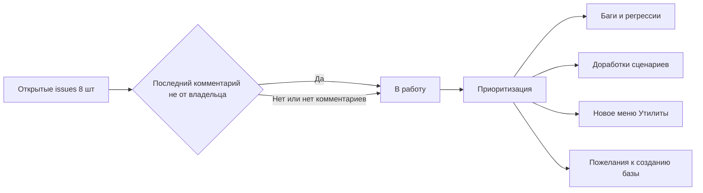
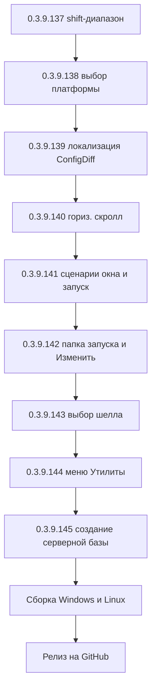

# PLAN — цикл 0.3.9.137–0.3.9.145 — обработка открытых issues (после 0.3.9.136)

Репозиторий [`sivatorov/ConfigurationManagement`](https://github.com/sivatorov/ConfigurationManagement),
локальная копия `f:\Yandex.Disk\h\Configuration_Management`, ветка `main`.
Локальный HEAD — **0.3.9.136** (CHANGELOG от 2026-09-29, цикл 0.3.9.132–136 завершён).
План начинается с версии **0.3.9.137** (перед стартом синхронизироваться с origin: `git pull`;
если в origin уже есть 0.3.9.137 — перенумеровать цикл).

Режим: Архитектор (план) → задачи-исполнители в режиме **code** (`new_task` по одному на этап).
**Один этап = одна версия = один коммит.** План-файл остаётся untracked (`plans/` в
.codeassistantignore); CHANGELOG/README/csproj коммитятся. Issues самостоятельно НЕ закрывать
(закрывает автор после подтверждения пользователем); после каждого исправления — комментарий
к issue «что исправлено и в какой версии».

Данные о issues получены через GitHub REST API без токена
(`https://api.github.com/repos/sivatorov/ConfigurationManagement/issues?...` — публичный доступ;
проверка `gh auth` в режиме архитектора недоступна, при публикации комментариев исполнитель
должен использовать `gh`/токен). Снапшот на 2026-09-29 10:31 UTC.

---

## 1. Сводка

| № | Issue | Заголовок | Коммент. | Последний комментарий | Отобран | Источник требований |
|---|-------|-----------|----------|-----------------------|---------|---------------------|
| 1 | [#318](https://github.com/sivatorov/ConfigurationManagement/issues/318) | Структура меню Утилиты | 0 | — | **ДА** | Описание issue |
| 2 | [#316](https://github.com/sivatorov/ConfigurationManagement/issues/316) | ConfigDiff | 4 | @7OH: «Локализация без изменений — ключи вместо значений» | **ДА** | Последний комментарий @7OH |
| 3 | [#314](https://github.com/sivatorov/ConfigurationManagement/issues/314) | Лишнее выделение | 3 | @7OH: «3.9.121 — выделение с шифтом всё ещё выделяет Закрепления» | **ДА** | Последний комментарий @7OH |
| 4 | [#313](https://github.com/sivatorov/ConfigurationManagement/issues/313) | Для выделенных | 2 | @7OH: «Пока всё на месте» | *условно* | Подтверждение пользователя — код не требуется |
| 5 | [#309](https://github.com/sivatorov/ConfigurationManagement/issues/309) | Пропал горизонтальный скрол | 4 | @7OH: «3.9.121 — пока без изменений» | **ДА** | Последний комментарий @7OH + предпоследний с деталями |
| 6 | [#308](https://github.com/sivatorov/ConfigurationManagement/issues/308) | Пожелание — Скрипты | 7 | @7OH: п.6–п.9 (окно по содержимому, HideWindow, папка запуска, кнопка «Изменить», выбор шелла) | **ДА** | Последние два комментария @7OH |
| 7 | [#305](https://github.com/sivatorov/ConfigurationManagement/issues/305) | Создание серверной базы | 7 | @7OH: запоминать «Сервер СУБД», клик по подсказке localhost | **ДА** | Последний комментарий @7OH + предпоследний (сервер с портом) |
| 8 | [#304](https://github.com/sivatorov/ConfigurationManagement/issues/304) | Выбор папки в выборе платформы 2 | 4 | @7OH: «перескакивает на 8.5 при смене разрядности» | **ДА** | Последний комментарий @7OH |

Критерий отбора (по заданию): комментариев нет ИЛИ последний комментарий не от `sivatorov`.
Issues, где последний комментарий от владельца, пропущены — их сейчас нет среди открытых
(все 8 открытых issues попали в отбор по формальному критерию; #313 — только подтверждение
работоспособности, см. раздел 3.4).



---

## 2. Общие требования к КАЖДОЙ задаче

1. Реализация на обеих платформах (Windows/WPF + Linux/Avalonia), где применимо; чистые
   сервисы/VM — без платформенных зависимостей, окна — пара WPF `.xaml` / Avalonia `.Avalonia.cs`.
2. Инкремент версии в [`Configuration Management.csproj`](../Configuration%20Management/Configuration%20Management.csproj)
   (строки 62–65: Version/AssemblyVersion/FileVersion/InformationalVersion) на 1 патч.
3. Запись в CHANGELOG.md (сверху, формат как у прошлых версий) и обновление бейджа версии
   в README.md (строка 3).
4. Тесты: `dotnet test` зелёный и `dotnet build -p:BuildLinux=true` без ошибок.
5. Один коммит (без пуша). Сообщение по образцу: `fix: ...; 0.3.9.XXX`.
6. После каждого исправления — подготовить текст комментария к issue
   (`publish/comment-{N}-0.3.9.XXX.md` по образцу существующих) и добавить комментарий через
   `gh issue comment` / API. Issue не закрывать.
7. Все пункты плана перед исполнением сверить с фактическим кодом (адреса строк могут
   сместиться после 0.3.9.136).

---

## 3. Детали по отобранным issues

### 3.1. Issue #314 — «Лишнее выделение» (регрессия, приоритет 1)

**Источник требований:** последний комментарий @7OH от 2026-09-28: «3.9.121 — выделение с
шифтом всё ещё выделяет Закрепления». Предыстория: 0.3.9.115 ввёл обёртку
[`Views/PinnedInfobaseItem`](../Configuration%20Management/ViewModels/PinnedInfobaseItem.cs)
(уникальные данные строки узла «Закреплённые») и `UnwrapInfobase` для кликов; однако
Shift-диапазон продолжает захватывать закреплённые копии.

**Анализ (разведка выполнена):** Shift-клик в WPF идёт через
[`Views/MainWindow.Events.cs`](../Configuration%20Management/Views/MainWindow.Events.cs:645)
→ `_viewModel.SelectRange(_viewModel.SelectedInfobase, infobase, VisibleInfobasesInOrder())`.
`SelectRange` ([`ViewModels/MainViewModel.Batch.cs`](../Configuration%20Management/ViewModels/MainViewModel.Batch.cs:80))
помечает диапазон по **Id** базы (`SetBatchSelected(order[i], true)`). Если
`VisibleInfobasesInOrder()` включает строки узла «Закреплённые» (обёртки, развёрнутые до
реальной базы), закреплённая копия той же базы попадает в диапазон и подсвечивается —
дубли по Id дают «подсветку Закреплений» даже при одном выделении.

**Изменения:**
- Найти определение `VisibleInfobasesInOrder()` (WPF; вероятно
  [`Views/MainWindow.Tree.cs`](../Configuration%20Management/Views/MainWindow.Tree.cs) или
  `MainWindow.Events.cs`) и аналогичный «видимый порядок» для Shift-ветки Avalonia
  ([`Controls/LeveledTreeView.Avalonia.cs`](../Configuration%20Management/Controls/LeveledTreeView.Avalonia.cs:112));
- исключить из видимого порядка строки узла «Закреплённые» (либо дедуплицировать по Id,
  оставляя позицию основной копии в группе) — закреплённая копия не должна участвовать
  в построении диапазона;
- убедиться, что клик по закреплённой строке в начале диапазона работает корректно
  (якорь должен указывать на реальную базу, не на обёртку).

**Файлы:** `ViewModels/MainViewModel.Batch.cs`, `Views/MainWindow.Events.cs`,
`Views/MainWindow.Tree.cs`, `Controls/LeveledTreeView.Avalonia.cs`,
`ViewModels/PinnedInfobaseItem.cs`.

**Риски:** сломать обычный Ctrl/Shift-выбор и контекстное меню «Для выделенных (N)…»;
затронуть «Найти в списке» (#285) и DnD. Минимизация: точечное изменение построения
порядка + ручной чек-лист мультивыделения.

---

### 3.2. Issue #304 — «Выбор папки в выборе платформы 2» (регрессия, приоритет 1)

**Источник требований:** последний комментарий @7OH: «Пока всё на месте — перескакивает на
8.5 при смене разрядности». Сценарий: текущая 8.5.4 → выбрать 8.5.1 (лист или папку) →
переключить фильтр разрядности на x64 → выделение уходит на линию 8.5.

**Анализ:** в 0.3.9.110 выбранный узел, отсутствующий в отфильтрованном дереве, заменяется
fallback-узлом того же семейства (линия 8.5). Пользователь считает это неправильным: 8.5.1
должна оставаться доступной при фильтре x64. Причины кандидаты:
- `FilterByArchitecture`/`ParseVariant` помечают вариант без суффикса как x32 — если у 8.5.1
  нет x64-сборки, папка/лист исчезает, fallback уводит на линию 8.5;
- либо `FindBestNode`/`MatchesCurrent` не находят точный лист «8.5.1 (64)» из-за сравнения
  только текста версии без учёта суффикса разрядности.

**Изменения:**
- воспроизвести сценарий и определить фактическую причину (диагностика в тестах);
- доработать [`Services/PlatformVersionService.cs`](../Configuration%20Management/Services/PlatformVersionService.cs):
  лист/папка «8.5.1» должны сохранять выбор при переключении разрядности (для папки —
  показывать её, если в семействе есть хоть один видимый вариант; fallback — только когда
  выбранная версия действительно полностью отфильтрована);
- пополнить [`ConfigurationManagement.Tests/PlatformVersionPickerTests.cs`](../ConfigurationManagement.Tests/PlatformVersionPickerTests.cs)
  сценариями «8.5.4 → 8.5.1 → x64».

**Файлы:** `Services/PlatformVersionService.cs`, `Views/PlatformVersionPickerWindow.xaml.cs`,
`Views/PlatformVersionPickerWindow.Avalonia.cs`, `ConfigurationManagement.Tests/PlatformVersionPickerTests.cs`.

**Риски:** изменить поведение #251/#142 (суффикс разрядности в результате диалога). Тесты
фиксируют прежние ожидания — новые сценарии добавлять рядом, старые не ломать.

---

### 3.3. Issue #316 — «ConfigDiff» (баг UI, приоритет 2)

**Источник требований:** последний комментарий @7OH + скриншот: «Локализация без изменений —
ключи вместо значений» (в окнах «Сравнение конфигураций» показываются ключи локализации,
а не их значения; 0.3.9.121).

**Анализ:** в 0.3.9.117/121 исправлена темизация окон ConfigDiff; проблема локализации не
закрыта. Вероятные причины: элементы новых окон привязаны к `{Binding Loc[...]}`/
`LocalizationManager.T(...)` ключам, которых нет в `ru.json`/`en.json` (fallback отдаёт сам
ключ), либо используются литералы с неправильными ключами.

**Изменения:**
- ревизия всех текстовых элементов окон
  [`Views/ConfigDiffSetupWindow.xaml`](../Configuration%20Management/Views/ConfigDiffSetupWindow.xaml)
  (+ `.Avalonia.cs`), [`Views/ConfigDiffResultWindow.xaml`](../Configuration%20Management/Views/ConfigDiffResultWindow.xaml)
  (+ `.Avalonia.cs`), [`Views/ConfigDiffProgressWindow.*`](../Configuration%20Management/Views/ConfigDiffProgressWindow.xaml);
- найти недостающие/битые ключи (`ConfigDiff.*`, `MetadataExplorer.*` и др.) и добавить их
  в [`Localization/Languages/ru.json`](../Configuration%20Management/Localization/Languages/ru.json)
  и `en.json` (наборы ключей должны совпадать);
- проверить, что ни один UI-элемент окон сравнения не показывает имя ключа.

**Файлы:** окна ConfigDiff (WPF+Avalonia), `Localization/Languages/ru.json`, `en.json`.

**Риски:** расхождение наборов ru/en; правки только словарей, логика не меняется — низкий риск.

---

### 3.4. Issue #313 — «Для выделенных» (подтверждено пользователем, код НЕ требуется)

**Источник требований:** последний комментарий @7OH от 2026-09-28: «Пока всё на месте» —
исправление 0.3.9.114 (Ctrl+клик → правый клик больше не теряет первую базу) подтверждено.

**Действия:** код не менять. По усмотрению владельца — уведомительный комментарий с просьбой
закрыть issue (самостоятельно НЕ закрывать). Версия для этого этапа НЕ выделяется.

---

### 3.5. Issue #309 — «Пропал горизонтальный скрол» (баг UI, приоритет 2)

**Источник требований:** последний комментарий @7OH: «3.9.121 — пока без изменений»;
предпоследний: «Скрол появился, но его размера не хватает, чтобы хоть немного на новую
колонку хватило» + скриншот.

**Анализ:** исправления 0.3.9.102 (включение полосы) и 0.3.9.111 (расчёт минимальной ширины
через [`Views/ListMinWidthCalculator.cs`](../Configuration%20Management/Views/ListMinWidthCalculator.cs))
не устранили проблему для конфигурации пользователя. Кандидаты: сумма колонок считается по
видимым колонкам на момент пересчёта, но часть колонок имеет «звёздные»/авто-ширины или
скрывается динамически; либо extent внешней полосы WPF не пересчитывается после загрузки
настроек колонок; либо фиксированная колонка «Название» в расчёте занимает больше, чем
реально.

**Изменения:**
- воспроизвести на наборе колонок из скриншота; проверить, равен ли `Extent.Width`
  сумме ширин всех колонок (WPF `MainWindow.Scroll.cs`/`MainWindow.Columns.cs`,
  Avalonia `MainWindow.Avalonia.Scroll.cs`/`MainWindow.Avalonia.Columns.cs`);
- при необходимости пересчитывать `UpdateTreeMinWidth`/`SyncListWidthToViewport` после
  загрузки настроек колонок и при любом изменении видимости/ширин;
- расширить [`ConfigurationManagement.Tests/ListMinWidthCalculatorTests.cs`](../ConfigurationManagement.Tests/ListMinWidthCalculatorTests.cs)
  сценарием «последняя колонка достижима при сумме ширин > вьюпорта».

**Файлы:** `Views/ListMinWidthCalculator.cs`, `Views/MainWindow.Columns.cs`,
`Views/MainWindow.Scroll.cs`, `Views/MainWindow.Avalonia.Columns.cs`,
`Views/MainWindow.Avalonia.Scroll.cs`, `ConfigurationManagement.Tests/ListMinWidthCalculatorTests.cs`.

**Риски:** ложная горизонтальная полоса (регресс #255) — проверять отсутствие полосы при
помещающихся колонках; синхронизация заголовка со строками (#214).

---

### 3.6. Issue #308 — «Пожелание — Скрипты» (доработки, приоритет 3)

**Источник требований:** последние два комментария @7OH (0.3.9.119/0.3.9.121):
- п.2 (вопрос): «будут ли все доступные свойства базы доступны» — ответ дан в 0.3.9.119,
  нужен развёрнутый комментарий-уточнение (динамические свойства через рефлексию);
- п.3: «глюк на месте — вместо имени базы — ключ» в комбобоксе «База для примера
  подстановок» (регресс на одной из платформ после 0.3.9.119);
- п.6: окно редактора сценария сделать «по содержимому», чтобы не было скролла;
- диагностика: при снятой галке «Скрывать окно скрипта» окно PowerShell не появляется
  (в логах команда запущена);
- п.7: новый параметр сценария — «Папка запуска» (WorkingDirectory);
- п.8: кнопка «Изменить» в окне выбора сценария перед запуском;
- п.9: переключатель шелла (cmd / powershell) или не форсировать cmd.

**Анализ:**
- п.3: [`Views/ScriptScenarioEditWindow.Avalonia.cs`](../Configuration%20Management/Views/ScriptScenarioEditWindow.Avalonia.cs:44)
  — `_exampleBaseCombo` без ItemTemplate (см. строки 160+); в 0.3.9.119 добавлен шаблон —
  проверить, не потерялся ли он при сборке цикла, либо не задаётся `SelectedIndex=0`
  на одной из платформ;
- п.6: окно имеет `Height = 680; MinHeight = 580` (строка 58–60) — перевести на
  `SizeToContent.Height` (как сделано в CreateInfobaseWindow 0.3.9.113);
- HideWindow: [`Services/ExternalCommandRunner.cs`](../Configuration%20Management/Services/ExternalCommandRunner.cs:54)
  использует `UseShellExecute = false` — GUI-приложение без консоли, `CreateNoWindow=false`
  окна не создаёт. Для видимого окна на Windows нужен `UseShellExecute = true`
  (запуск через shell с новым окном);
- п.7/п.8/п.9: модель [`Models/ScriptScenario.cs`](../Configuration%20Management/Models/ScriptScenario.cs),
  окна редактора и выбора, резолвер командной строки.

**Изменения (разбиваются на 3 версии, см. раздел 4):**
1. п.6 (размер окна) + п.3 (комбобокс имени базы) + HideWindow через `UseShellExecute`;
2. п.7 («Папка запуска»: поле модели, UI в редакторе WPF/Avalonia, `WorkingDirectory`
   в `ProcessStartInfo`, подстановка в превью) + п.8 (кнопка «Изменить» в
   [`Views/ScriptPickWindow.xaml`](../Configuration%20Management/Views/ScriptPickWindow.xaml)
   и `.Avalonia.cs`, открывает редактор с сохранением сценария);
3. п.9 (поле «Интерпретатор» в сценарии: Авто / cmd / PowerShell / sh — и сборка командной
   строки с учётом шелла, не форсировать cmd) + комментарий-ответ на п.2.

**Файлы:** `Models/ScriptScenario.cs`, `Views/ScriptScenarioEditWindow.xaml`(+`.xaml.cs`)/`.Avalonia.cs`,
`Views/ScriptPickWindow.xaml`(+`.xaml.cs`)/`.Avalonia.cs`, `Services/ExternalCommandRunner.cs`,
`ViewModels/MainViewModel.Scripts.cs`, `ViewModels/MainViewModel.Avalonia.Scripts.cs`,
`ViewModels/ScriptScenarioEditViewModel.cs`, `Localization/Languages/ru.json`, `en.json`,
`ConfigurationManagement.Tests/ScriptParameterResolverTests.cs`, `ScriptScenarioStoreTests.cs`.

**Риски:** изменение `ExternalCommandRunner` затрагивает post/pre-команды баз и CLI
(поведение по умолчанию `createNoWindow=true` сохранить); модель сценария — миграция старых
JSON-файлов (новые поля опциональны, дефолты сохраняют поведение); п.9 — различие
Windows/Linux в синтаксисе командных строк.

---

### 3.7. Issue #318 — «Структура меню Утилиты» (пожелание, приоритет 4)

**Источник требований:** описание issue (комментариев нет). Пользователь предлагает
сгруппировать разросшееся меню «Утилиты» в подменю, чтобы пункты не уходили за нижний край
экрана. Целевая структура (из описания):

```
Командная палитра
── разделитель ──
Актуальные релизы
Консоль администрирования серверов
── разделитель ──
Блокировка приложения
▶ Опции блокировки
    Открыть приватные базы
    Сменить пароль блокировки
    ── разделитель ──
    Выполнить резервирование
── разделитель ──
▶ Информация
    Центр обслуживания
    ── разделитель ──
    Список типовых конфигураций
    ── разделитель ──
    Задания по расписанию
    Сценарии резервирования
    ── разделитель ──
    Настройка сценариев
    ── разделитель ──
    Статистика использования
▶ Операции
    Сравнение конфигураций
    ── разделитель ──
    Обновление из хранилищ
    ── разделитель ──
    Экспорт списка баз в CSV …
    ── разделитель ──
    Инспектор процессов 1С
    Завершить процессы 1С
    ── разделитель ──
    Удалить отсутствующие файловые базы
── разделитель ──
Проверить обновления
```

**Решение по неупомянутым пунктам** (Монитор серверов 1С, Консоль внешняя,
Обозреватель хранилища, Пакетное обновление из хранилищ, Экспорт HTML/JSON, Импорт JSON,
Обозреватель метаданных): разместить логично, минимально инвазивно: «Монитор серверов 1С»
и «Консоль администрирования серверов (внешняя)» остаются на верхнем уровне рядом с
«Актуальными релизами»; «Обозреватель метаданных» — в «Операции» сразу после «Сравнения
конфигураций»; «Обозреватель хранилища» и «Пакетное обновление из хранилищ» — в «Операции»
в блоке хранилищ; «Экспорт HTML/JSON» и «Импорт JSON» — в «Операции» в блоке экспорта.
Окончательное расположение согласуется с сохранением высоты меню — главная цель #318.

**Изменения:**
- WPF: [`Views/MainWindow.xaml`](../Configuration%20Management/Views/MainWindow.xaml)
  (блок меню «Утилиты», строки ~666–789): вложенные `MenuItem` + `Separator` по схеме выше;
- Avalonia: [`Views/MainWindow.Avalonia.Tree.cs`](../Configuration%20Management/Views/MainWindow.Avalonia.Tree.cs)
  (`BuildUtilitiesMenu()`, строки ~1632–1768): вложенные `MenuItem.Items.Add(...)`;
- новые ключи локализации заголовков подменю (`Utilities.Submenu.LockOptions`,
  `Utilities.Submenu.Information`, `Utilities.Submenu.Operations`) в ru.json/en.json.

**Файлы:** `Views/MainWindow.xaml`, `Views/MainWindow.Avalonia.Tree.cs`,
`Localization/Languages/ru.json`, `en.json`.

**Риски:** потеря хоткеев/иконок при переносе пунктов; расхождение WPF/Avalonia;
зависимость от команд VM (только перегруппировка, команды не менять).

---

### 3.8. Issue #305 — «Создание серверной базы» (пожелания, приоритет 5)

**Источник требований:** последний комментарий @7OH (2026-09-29): «Сервер СУБД — запоминать
последний введённый и подставлять при следующем открытии; клик по подсказке “Например
localhost” подставляет localhost» + предпоследний: «выбор сервера 1С должен быть один в один
как в окне правки свойств базы — вместе с портом».

**Анализ:** 0.3.9.108/113 уже дали компактный макет, порт СУБД и выбор сервера 1С из списка
(`ComboBox IsEditable`). Остались:
- персистентность последнего «Сервер СУБД» (+ порт) между сессиями — хранение в настройках
  приложения (по образцу других persisted-настроек);
- подсказка-пример под полем «Сервер СУБД» становится кликабельной и подставляет значение;
- согласование выбора сервера 1С с окном правки свойств базы: там сервер выбирается вместе
  с портом (`server:port`). В окне создания сейчас список без порта — привести к тому же
  виду: `AvailableServers()`/`GetAvailableServers()` должны отдавать строки с портом, при
  выборе разносить на `Srvr`/порт.

**Файлы:** `Views/CreateInfobaseWindow.xaml`(+`.xaml.cs`)/`.Avalonia.cs`,
`Models/CreateInfobaseRequest.cs`, `Services/CreateInfobaseService.cs`,
`ViewModels/MainViewModel.Commands.cs` (GetAvailableServers),
`ViewModels/MainViewModel.Avalonia.cs` (AvailableServers),
`Views/ConnectionSettingsWindow.xaml.cs` (образец списка серверов с портом), настройки
приложения (хранилище persisted-значений), `ConfigurationManagement.Tests/CreateInfobaseDbServerStringTests.cs`.

**Риски:** изменение формата строки сервера (`server` → `server:port`) может затронуть
команду `CREATEINFOBASE` — тесты `BuildDbServerString` фиксируют формат; порт сервера 1С не
смешивать с портом СУБД.

---

## 4. Порядок работ (этапы и версии)

Приоритет — сначала подтверждённые регрессии (#314, #304), затем баги UI (#316, #309),
затем доработки #308 (3 этапа), затем пожелания #318 и #305.

| № | Версия | Issue | Этап | Суть | Сложность |
|---|--------|-------|------|------|-----------|
| 1 | 0.3.9.137 | #314 | Shift-диапазон | Исключить закреплённые копии из видимого порядка диапазона (WPF; контроль Avalonia), тесты/чек-лист | средняя |
| 2 | 0.3.9.138 | #304 | Выбор версии платформы | Сохранение выбора 8.5.1 при смене разрядности, доработка PlatformVersionService, тесты | средняя |
| 3 | 0.3.9.139 | #316 | Локализация ConfigDiff | Недостающие ключи ru/en во всех окнах сравнения, ревизия привязок | малая |
| 4 | 0.3.9.140 | #309 | Горизонтальный скролл | Диагностика extent, пересчёт min-width после загрузки колонок, тесты | средняя |
| 5 | 0.3.9.141 | #308 | Сценарии: окна и запуск | Окно редактора по содержимому (п.6), фикс комбобокса базы (п.3), видимое окно через UseShellExecute (HideWindow) | средняя |
| 6 | 0.3.9.142 | #308 | Сценарии: папка и правка | «Папка запуска» (п.7) + кнопка «Изменить» в окне выбора (п.8) | средняя |
| 7 | 0.3.9.143 | #308 | Сценарии: шелл | Выбор интерпретатора cmd/PowerShell/sh (п.9) + комментарий-ответ на п.2 | средняя |
| 8 | 0.3.9.144 | #318 | Меню «Утилиты» | Подменю «Опции блокировки»/«Информация»/«Операции», WPF+Avalonia, локализация | средняя |
| 9 | 0.3.9.145 | #305 | Создание серверной базы | Запоминание сервера СУБД, клик по подсказке, выбор сервера 1С с портом | средняя |



---

## 5. Финальные шаги цикла

1. После 0.3.9.145 — сборка исполняемых файлов:
   - Windows: [`build-windows-single-file.ps1`](../Configuration%20Management/build-windows-single-file.ps1);
   - Linux: [`build-linux-single-file.sh`](../Configuration%20Management/build-linux-single-file.sh)
     (либо их ps1-аналоги для Windows-хоста);
   - пакеты Linux: `package/linux/appimage.sh`, `package/linux/deb/build-deb.sh`.
2. Новый релиз на GitHub (tag `v0.3.9.145`), тело релиза по образцу
   [`publish/release_body_*.md`](../publish/), вложения — собранные файлы.
3. Комментарии к issues: убедиться, что каждый обработанный issue получил комментарий
   «исправлено в версии X.Y.Z» (черновики в `publish/comment-{N}-0.3.9.XXX.md`).
4. Issues не закрывать — закрытие за автором после подтверждения пользователем.
5. Обновить снапшот `publish/issues_snapshot_YYYY-MM-DD.md` по завершении цикла.

## 6. Итог

- Отобрано для исправления: **7 issues** (#318, #316, #314, #309, #308, #305, #304).
- #313 — подтверждено пользователем, код не требуется (уведомительный комментарий опционален).
- Ожидаемый объём: 9 версий (0.3.9.137–0.3.9.145), одна версия = один коммит, после каждой —
  инкремент версии, CHANGELOG.md, README.md (бейдж), комментарий к issue.
- Перед началом каждого этапа — `git pull` и сверка адресов строк с фактическим кодом.