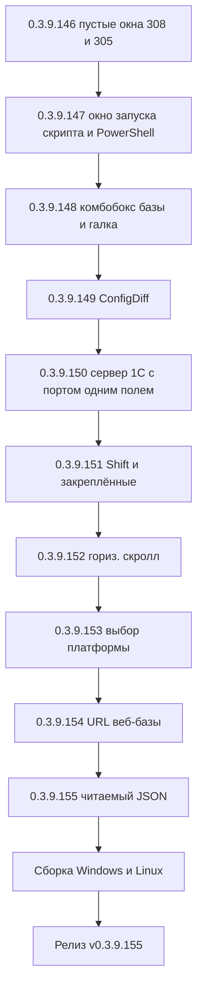

# PLAN — цикл 0.3.9.146–0.3.9.155 — обработка открытых issues (после 0.3.9.145)

Репозиторий [`sivatorov/ConfigurationManagement`](https://github.com/sivatorov/ConfigurationManagement),
локальная копия `f:\Yandex.Disk\h\Configuration_Management`, ветка `main`.
Локальный HEAD — **0.3.9.145** (CHANGELOG от 2026-09-29, цикл 0.3.9.137–145 завершён).
План начинается с **0.3.9.146** (перед стартом синхронизироваться с origin: `git pull`;
если в origin уже есть 0.3.9.146+ — перенумеровать цикл).

Режим: Архитектор (план) → задачи-исполнители в режиме **code** (`new_task` по одному на этап).
**Один этап = одна версия = один коммит.** План-файл остаётся untracked (`plans/` в
.codeassistantignore); CHANGELOG/README/csproj коммитятся. Issues самостоятельно НЕ закрывать
(закрывает автор после подтверждения пользователем); после каждого исправления — комментарий
к issue «что исправлено и в какой версии».

Данные о issues получены через GitHub REST API (публичный доступ, снапшот 2026-09-29 ~15:20 UTC).
Все 8 открытых issues требуют исправления; последний комментарий от @7OH, кроме #319/#320
(комментариев нет).

---

## 1. Сводка цикла

| № | Версия | Issue | Суть | Приоритет |
|---|--------|-------|------|-----------|
| 1 | 0.3.9.146 | #308 п.14:34 + #305 п.14:31 | Регресс «пустое незакрываемое окно»: авторазмер ScriptScenarioEditWindow и CreateInfobaseWindow (общий корень SizeToContent) | 1 — блокер тестирования |
| 2 | 0.3.9.147 | #308 п.14:43 + п.15:05 | Окно выполнения скрипта не появляется (инверсия createNoWindow) + PowerShell: «&&» недопустим | 1 |
| 3 | 0.3.9.148 | #308 п.14:37 + п.14:39 | Комбобокс базы показывает «ключ» (превью пусто) + перенос галки «Скрывать окно» к «Интерпретатору» | 1 |
| 4 | 0.3.9.149 | #316 | ConfigDiff: выбранная база «ключом» + авторазмер окна настройки | 2 |
| 5 | 0.3.9.150 | #305 п.14:25 | Единое поле «Сервер 1С:порт» + подъём окна при уходе за экран | 2 |
| 6 | 0.3.9.151 | #314 | Shift-диапазон всё ещё подсвечивает «Закреплённые» | 2 |
| 7 | 0.3.9.152 | #309 | Горизонтальный скролл не доходит до последней колонки | 2 |
| 8 | 0.3.9.153 | #304 | Выбор 8.5.1 перескакивает на 8.5 при смене разрядности | 3 |
| 9 | 0.3.9.154 | #319 | URL веб-серверной базы не показывается в колонке «Сервер/База» | 3 |
| 10 | 0.3.9.155 | #320 | Русские буквы в новых JSON-файлах сценариев пишутся как \uXXXX | 3 |

---

## 2. Общие требования к КАЖДОМУ этапу

1. Реализация на обеих платформах (Windows/WPF + Linux/Avalonia), где применимо; чистые
   сервисы/VM — без платформенных зависимостей; окна — пара WPF `.xaml` / Avalonia `.Avalonia.cs`.
2. Инкремент версии в [`Configuration Management.csproj`](../Configuration%20Management/Configuration%20Management.csproj)
   (строки 62–65: Version/AssemblyVersion/FileVersion/InformationalVersion) на 1 патч.
3. Запись в CHANGELOG.md (сверху, формат как у прошлых версий) и обновление бейджа версии
   в README.md (строка 3).
4. Тесты: `dotnet test` зелёный и `dotnet build -p:BuildLinux=true` без ошибок.
5. Один коммит (без пуша). **Запрещены ключевые слова автозакрытия issues**: в теле и
   заголовке коммита НЕ использовать паттерны `fix: #N`, `fixes #N`, `close #N`, `closes #N`,
   `resolve #N`, `resolves #N` (GitHub автоматически закрывает issue, а закрытие за автором).
   Образец сообщения: `0.3.9.146: окна редактора сценария и создания ИБ — устранён регресс пустого окна`
   (упоминание issue без «fix/close» допускается, безопаснее — просто номер версии).
6. После каждого исправления — черновик комментария `publish/comment-{N}-0.3.9.XXX.md` по образцу
   существующих и публикация `gh issue comment {N} --body-file publish/comment-{N}-0.3.9.XXX.md`.
   Issue НЕ закрывать.
7. Все пункты плана перед исполнением сверить с фактическим кодом (адреса строк могут
   сместиться).

---

## 3. Диагностика общего корня «пустое незакрываемое окно» (подготовка к 0.3.9.146)

Признаки (обе формы): надписи на миг появляются и пропадают, кнопки недоступны/не видны,
закрыть можно только Alt-F4; окно «странное» и при открытии, и при изменении типа.

Изменения-кандидаты, после которых регресс проявился:
- 0.3.9.141 — `ScriptScenarioEditWindow` переведён с фиксированной высоты на
  `SizeToContent="Height"` + `MaxHeight=800` (WPF XAML строка 6, Avalonia строка 68);
- 0.3.9.113 — то же сделано для `CreateInfobaseWindow` (WPF XAML строка 9, Avalonia);
- 0.3.9.145 — в `CreateInfobaseWindow` добавлены поля «Сервер 1С» + «Порт сервера 1С»
  (`ServerBox`/`ServerPortBox`) — макет стал шире/ниже.

Шаги диагностики (выполняет исполнитель до правок, временно, в debug-сборке):
1. Воспроизвести: «Утилиты → Настройка сценариев → Изменить», «Выбор скрипта (F5) → Изменить»,
   «Создание базы» (оба типа). Зафиксировать: происходит на WPF, Avalonia или обеих.
2. Замерить в `Loaded`/`ContentRendered`/`Opened` (и отложенно, `Dispatcher`/`Post`):
   `ActualHeight`, `DesiredSize.Height`, `Height`, `MinHeight`, `MaxHeight` окна и корневого
   контейнера; залогировать порядок (писать в debug-лог приложения).
3. Проверить связь с модальной цепочкой: открытие редактора из `ScriptPickWindow.ShowDialog`
   (владелец — модальное окно) против открытия из `ScriptScenariosWindow` (владелец — главное).
   Если пустое окно воспроизводится в обоих — виноват сам авторазмер, а не цепочка.
4. Проверить гипотезу «окно стало огромным и кнопки ушли за экран»: сравнить измеренную высоту
   с высотой рабочей области; при необходимости выставить `Top=0` и измерить снова.

Ожидаемый вывод: `SizeToContent="Height"` даёт вырожденный результат в конкретном сценарии
(например, контент с `ScrollViewer` внутри измеряется с бесконечной высотой, а клампинг
`MaxHeight` срабатывает после первого кадра, из-за чего «надписи на миг появляются»).
Рабочее решение ниже — явная схема управления высотой вместо `SizeToContent`.

---

## 4. Этапы

### 4.1. 0.3.9.146 — Регресс «пустое незакрываемое окно» (#308 п.14:34, #305 п.14:31)

**Цель:** окна редактора сценария и создания ИБ открываются с видимым контентом и кнопками
в любом сценарии показа (обычный список, окно выбора, создание базы, смена типа).

**Файлы:**
- [`Views/ScriptScenarioEditWindow.xaml`](../Configuration%20Management/Views/ScriptScenarioEditWindow.xaml) —
  заменить `SizeToContent="Height"` на надёжную схему (см. ниже); сохранить внутренний
  `ScrollViewer`, `MinHeight="560"`, `MaxHeight="800"`.
- [`Views/ScriptScenarioEditWindow.Avalonia.cs`](../Configuration%20Management/Views/ScriptScenarioEditWindow.Avalonia.cs) —
  убрать `SizeToContent = SizeToContent.Height`; задать `Height = 680` (или расчёт после `Opened`).
- [`Views/CreateInfobaseWindow.xaml`](../Configuration%20Management/Views/CreateInfobaseWindow.xaml) —
  `SizeToContent="Height"` → `Height="620"` (сохранить `MinHeight="420"`, `MaxHeight="800"`).
- [`Views/CreateInfobaseWindow.xaml.cs`](../Configuration%20Management/Views/CreateInfobaseWindow.xaml.cs) и
  [`Views/CreateInfobaseWindow.Avalonia.cs`](../Configuration%20Management/Views/CreateInfobaseWindow.Avalonia.cs) —
  метод пересчёта высоты при смене типа (`OnTypeChanged`/`UpdateMode`): высота по содержимому,
  клампинг `[MinHeight, MaxHeight]`, подъём окна в рабочую область (см. 4.5 — тот же helper).

**Предлагаемая надёжная схема (единая для окон этого цикла):**
- окно открывается с явной стартовой высотой (прежние рабочие значения: 680 редактор, 620 создание ИБ);
- при необходимости подстроить под контент — вычислить высоту ОДИН раз после первой отрисовки
  (WPF `ContentRendered`, Avalonia `Opened` + `Dispatcher.Post`): `height = clamp(content.ActualHeight + chrome, MinHeight, MaxHeight)`,
  затем зафиксировать (`SizeToContent="Manual"` / высоту не трогать);
- если такой вариант даёт внутренний скролл — это норма (скролл был и до 0.3.9.141; требование
  «по содержимому» вторично относительно работоспособного окна).

**Опционально:** чистый helper `WindowHeightClamp.Compute(desired, min, max)` в общих
`Services/` (без UI-зависимостей) + юнит-тесты — чтобы WPF и Avalonia использовали одну логику.

**Тесты:** юнит-тесты на сам авторазмер отсутствуют (UI). Добавить тесты на helper, если он
вынесен (`WindowHeightClampTests`). Обязательно: `dotnet test` целиком зелёный; ручной чек-лист ниже.

**CHANGELOG (пункты):**
> Исправлено: пустое незакрываемое окно редактора сценария и окна создания ИБ — регресс
> авторазмера окон (issue #308, #305). Авторазмер `SizeToContent=Height` мог схлопывать окно
> при модальном показе; вместо него окна открываются с явной высотой и при необходимости
> подстраиваются после первой отрисовки с ограничением по рабочей области экрана.

**README:** обновить только бейдж версии (строка 3), как на каждом этапе.

**Комментарий к issue #308:** «Исправлено в версии 0.3.9.146… окно редактора сценария больше
не схлопывается при „Изменить“ (из окна выбора и из списка): надписи и кнопки видны, окно
закрывается как обычно. Причина — регресс авторазмера… Как проверить: шаги…».
**Комментарий к issue #305:** «Исправлено в версии 0.3.9.146… „странное окно“ при открытии
создания ИБ устранено (общий с редактором сценариев корень — авторазмер). Как проверить…».

**Ручная проверка:**
1. Настройка сценариев → Добавить и Изменить — окно с полями и кнопками OK/Отмена.
2. F5 при нескольких сценариях → Изменить — то же.
3. Создание базы: оба типа; переключение «Файловая ↔ Клиент-серверная» — высота меняется,
   окно не уходит за нижний край (см. также 0.3.9.150).
4. Закрытие: кнопки, ESC, Alt-F4.
5. Повторить на Windows (WPF) и Linux (Avalonia).

**Риски:** смена фиксированной высоты на низких экранах даёт внутренний скролл (приемлемо);
если корень окажется не в `SizeToContent` (например, в модальной цепочке) — вывод диагностики
раздела 3 обязателен до правок.

---

### 4.2. 0.3.9.147 — #308: окно запуска скрипта и сборка команды для PowerShell

**Цель:** при снятой галке «Скрывать окно» консольное окно появляется; командная строка
в логе/превью корректна для выбранного интерпретатора (без `&&` в PowerShell).

**Файлы:**
- [`ViewModels/MainViewModel.Scripts.cs`](../Configuration%20Management/ViewModels/MainViewModel.Scripts.cs) —
  строка `createNoWindow: !scenario.HideWindow` → `createNoWindow: scenario.HideWindow`
  (сейчас инверсия: снятая галка скрывает окно).
- [`ViewModels/MainViewModel.Avalonia.Scripts.cs`](../Configuration%20Management/ViewModels/MainViewModel.Avalonia.Scripts.cs) —
  то же исправление.
- [`Services/ScriptParameterResolver.cs`](../Configuration%20Management/Services/ScriptParameterResolver.cs) —
  `BuildCommandLine`/`BuildCommandLineWithShell`: разделитель между префиксом `cd "…"` и командой
  зависит от интерпретатора: `cmd`/`sh` → `&&`, `PowerShell` → `;`. Сигнатура получает
  `ScriptShell shell` (+ `bool isWindows` для Auto). Обновить вызовы: превью в
  [`Services/ScriptScenarioEditViewModel`](../Configuration%20Management/ViewModels/ScriptScenarioEditViewModel.cs)
  (нет — VM в ViewModels), редакторе и окне выбора, лог в `MainViewModel.Scripts.cs`.
- [`ViewModels/ScriptScenarioEditViewModel.cs`](../Configuration%20Management/ViewModels/ScriptScenarioEditViewModel.cs) —
  `BuildExampleCommandLine` использует `scenario.Shell` при построении.

**Тесты:**
- [`ScriptParameterResolverTests.cs`](../ConfigurationManagement.Tests/ScriptParameterResolverTests.cs):
  `BuildCommandLine` с `WorkingDirectory` для `PowerShell` → `cd "…"; …`; для `Cmd`/`Sh` → `cd "…" && …`;
  без рабочей папки разделитель не появляется; `Auto` на Windows/Linux.
- [`ExternalCommandRunnerTests.cs`](../ConfigurationManagement.Tests/ExternalCommandRunnerTests.cs):
  `CreateProcessStartInfo`/`RunDetached` — флаг `CreateNoWindow` соответствует `createNoWindow` параметру
  (регрессия инверсии).

**CHANGELOG (пункты):**
> Исправлено: запуск сценариев (issue #308) — при снятой галке «Скрывать окно» консольное окно
> теперь действительно появляется (была инверсия флага); командная строка для PowerShell
> собирается с разделителем `;` вместо `&&` (cmd/sh — как раньше, `&&`).

**Комментарий к issue #308:** «Исправлено в версии 0.3.9.147… п. „окно не появляется“ — причиной
была инверсия флага; п. „&& в PowerShell“ — сборка командной строки теперь шелл-зависимая…
Как проверить: снять галку, запустить F5 — окно cmd/PowerShell появляется; выбрать PowerShell
и задать „Папку запуска“ — в логе команда вида `powershell -NoProfile -Command cd "…"; …`,
запуск этой строки в PowerShell не даёт ошибки про `&&`».

**Ручная проверка:**
1. Сценарий с `HideWindow=false` → F5 → видимое окно (Windows).
2. Сценарий с рабочей папкой и `Shell=PowerShell` → лог содержит `;` между `cd` и командой.
3. Скопировать строку из лога в powershell.exe вручную — выполняется без ошибки «&&».
4. `Shell=Auto` на Windows — по-прежнему `cmd /c … && …`.

**Риски:** правка `BuildCommandLine` влияет на превью во всех окнах сценариев (покрыто тестами);
PowerShell 7 поддерживает `&&`, но целевой `powershell.exe` (5.1) — нет, поэтому `;` безопаснее.

---

### 4.3. 0.3.9.148 — #308: комбобокс базы «ключ» и расположение галки

**Цель:** «База для примера подстановок» показывает имя выбранной базы, превью командной
строки заполнено; галка «Скрывать окно» в одной строке с «Интерпретатор».

**Файлы:**
- [`Views/ScriptScenarioEditWindow.xaml`](../Configuration%20Management/Views/ScriptScenarioEditWindow.xaml):
  - `ExampleBaseCombo`: явный `ItemTemplate` (`<DataTemplate><TextBlock Text="{Binding Name}"/></DataTemplate>`)
    вместо `DisplayMemberPath` из code-behind;
  - перенос `HideWindowCheckBox` в одну строку с `ShellCombo` (общий `Grid`: колонки «комбо» +
    «галка», вертикальное центрирование).
- [`Views/ScriptScenarioEditWindow.xaml.cs`](../Configuration%20Management/Views/ScriptScenarioEditWindow.xaml.cs):
  убрать `DisplayMemberPath`; выбор первой базы устанавливать/переустанавливать после `Loaded`;
  на время отладки — временный лог типа `SelectedItem` (удалить до коммита).
- [`Views/ScriptScenarioEditWindow.Avalonia.cs`](../Configuration%20Management/Views/ScriptScenarioEditWindow.Avalonia.cs):
  аналогично: проверить порядок `ItemsSource → ItemTemplate → SelectedIndex`; при необходимости
  выбрать базу в `Opened`; перенос галки в одну строку с комбобоксом интерпретатора.

**Причина «ключа» (общая с #316):** закрытый комбобокс рисует выбранный элемент до применения
шаблона/пути отображения и показывает `ToString()` объекта (у `Infobase` нет переопределения —
это имя типа, похожее на «ключ»). Явный `ItemTemplate` в XAML и установка выбора ПОСЛЕ
применения шаблона устраняют проблему. Для точной диагностики — лог типа и текста SelectedItem.

**Тесты:** юнит-тестов на ComboBox нет; добавить при возможности тест на выбор базы в
`ScriptScenarioEditViewModel` (fallback первой базы). Полный `dotnet test` зелёный.

**CHANGELOG (пункты):**
> Исправлено: редактор сценария (issue #308) — комбобокс «База для примера подстановок»
> снова показывает имя базы (а не имя типа/ключ), превью командной строки заполняется;
> галка «Скрывать окно скрипта» перенесена в одну строку с «Интерпретатор».

**Комментарий к issue #308:** «Исправлено в версии 0.3.9.148… п. „выбранная база ключом“ —
причина: закрытый комбобокс показывал ToString() элемента до применения шаблона; теперь
задан явный ItemTemplate и выбор восстанавливается после показа окна; п. „перенести галку“ —
галка на строке «Интерпретатор». Как проверить…».

**Ручная проверка:**
1. Редактор сценария → комбобокс баз: закрытый элемент показывает имя базы.
2. При выборе любой базы превью меняется и не пустое.
3. Галка «Скрывать окно» — на одной строке с «Интерпретатор» (обе платформы).
4. «Изменить» из окна выбора (F5) — комбобокс работает так же.

**Риски:** изменение XAML-шаблона комбобокса — проверить, что не сломан двойной клик по токенам
и превью (функциональность та же).

---

### 4.4. 0.3.9.149 — #316: ConfigDiff — «ключ» выбранной базы и авторазмер окна

**Цель:** в окне настройки сравнения выбранная база показывается именем; внизу нет пустого места.

**Файлы:**
- [`Views/ConfigDiffSetupWindow.xaml`](../Configuration%20Management/Views/ConfigDiffSetupWindow.xaml):
  `BasesBox` — заменить `DisplayMemberPath="Name"` на явный `ItemTemplate` с `{Binding Name}`;
  размер окна: `Height="520"` → схема из 4.1 (стартовая высота или одноразовый авторазмер),
  `ResizeMode` остаётся `NoResize` (или `CanResize`, по вкусу — главное без пустоты внизу).
- [`Views/ConfigDiffSetupWindow.xaml.cs`](../Configuration%20Management/Views/ConfigDiffSetupWindow.xaml.cs):
  выбор `selectedBase` устанавливать по экземпляру из `_infobases` (по `Id`), после наполнения
  `ItemsSource`; при сомнениях — временный лог типа `SelectedItem`.
- [`Views/ConfigDiffSetupWindow.Avalonia.cs`](../Configuration%20Management/Views/ConfigDiffSetupWindow.Avalonia.cs):
  то же: выбор по Id из списка, установка после `ItemsSource`/`ItemTemplate` (текущий
  `FuncDataTemplate<Infobase>` оставить); `Height=540` → та же схема высоты.

**Тесты:** UI не покрыт; логика выбора остаётся в окне. Добавить при возможности чистый helper
«выбор базы по Id из списка» и тест; полный `dotnet test` зелёный.

**CHANGELOG (пункты):**
> Исправлено: окно настройки сравнения конфигураций (issue #316) — выбранная база в комбобоксе
> отображается именем (не ключом); окно подстраивает высоту под содержимое, пустое место
> внизу устранено.

**Комментарий к issue #316:** «Исправлено в версии 0.3.9.149… выбранная база — по имени;
окно — по содержимому. Как проверить: открыть «Сравнить конфигурации», выбрать базу — в
комбобоксе имя; форма без пустоты внизу; переключить режимы „База ↔ .cf“ / „.cf ↔ .cf“ —
высота меняется под контент».

**Ручная проверка:**
1. «Сравнение конфигураций» — закрытый комбобокс «База» показывает имя выбранной базы.
2. Переключение режимов — блоки полей показываются/скрываются, пустого места внизу нет.
3. Сравнение запускается (валидация по выбранной базе работает).

**Риски:** расхождения ru/en не трогать (исправлены в 0.3.9.139); не повторить регресс окна
из 4.1 — использовать ту же схему высоты.

---

### 4.5. 0.3.9.150 — #305: единое поле «Сервер 1С:порт» и подъём окна

**Цель:** выбор сервера 1С — одним полем `server:port`, как в окне правки свойств базы;
окно не уходит за нижний край при смене типа.

**Файлы:**
- [`Views/CreateInfobaseWindow.xaml`](../Configuration%20Management/Views/CreateInfobaseWindow.xaml):
  объединить `ServerBox` + `ServerPortBox` в один редактируемый `ComboBox` со строками
  `server:port` (образец — окно правки свойств, [`Views/ConnectionSettingsWindow.xaml.cs`](../Configuration%20Management/Views/ConnectionSettingsWindow.xaml.cs));
  убрать поле порта из макета (макет компактнее — помогает и с «пустым окном»).
- [`Views/CreateInfobaseWindow.xaml.cs`](../Configuration%20Management/Views/CreateInfobaseWindow.xaml.cs):
  `OnServerBox_SelectionChanged` — разносить `server:port` на `Srvr`/порт (логика разбора —
  чистая функция, см. тесты); `OnTypeChanged` — пересчёт высоты и подъём окна в рабочую область
  (WPF: `SystemParameters.WorkArea`, скорректировать `Top`).
- [`Views/CreateInfobaseWindow.Avalonia.cs`](../Configuration%20Management/Views/CreateInfobaseWindow.Avalonia.cs):
  зеркально (Avalonia: `Screens.ScreenFromWindow(...).WorkingArea`).
- [`Models/CreateInfobaseRequest.cs`](../Configuration%20Management/Models/CreateInfobaseRequest.cs):
  при необходимости — helper разбора `server:port` (или в `CreateInfobaseService`).
- [`Services/CreateInfobaseService.cs`](../Configuration%20Management/Services/CreateInfobaseService.cs):
  чистый `ParseServerPort("server:port", out server, out port)`.

**Тесты:**
- [`CreateInfobaseDbServerStringTests.cs`](../ConfigurationManagement.Tests/CreateInfobaseDbServerStringTests.cs):
  обновить/добавить кейсы разбора `server:port` (сервер без порта, с портом, лишние двоеточия);
  существующие тесты `BuildDbServerString` (СУБД) остаются без изменений.

**CHANGELOG (пункты):**
> Изменено: создание серверной базы (issue #305) — сервер 1С снова выбирается одним полем
> `server:port`, как в окне правки свойств базы (отдельное поле порта убрано); при смене типа
> окно поднимается, если нижняя часть уходит за край экрана.

**Комментарий к issue #305:** «Исправлено в версии 0.3.9.150… сервер 1С — одним полем вида
`server:port` (как в правке свойств): при выборе порт попадает в подключение, поле не обрезается;
окно проверяет положение после изменения размера и поднимается в рабочую область. Как проверить…».

**Ручная проверка:**
1. Создание базы → «Клиент-серверная» → поле «Сервер 1С»: строки `server:port`, при выборе
   заполнено одно поле (не только порт).
2. Создать базу — `Srvr` и порт попадают в команду и в параметры подключения.
3. Переместить главное окно к нижнему краю экрана → «Создание базы» → сменить тип:
   окно не уходит за экран.
4. Проверить запоминание «Сервера СУБД» и подсказку (функции 0.3.9.145 не сломаны).

**Риски:** формат строки `server:port` используется и для превью команды — тесты фиксируют;
порт сервера 1С не смешивать с портом СУБД (разные поля модели).

---

### 4.6. 0.3.9.151 — #314: Shift-диапазон и подсветка «Закреплённых»

**Цель:** Shift-диапазон не подсвечивает строки узла «Закреплённые».

**Анализ (подтверждено кодом):** исправление 0.3.9.137 исключило обёртки `PinnedInfobaseItem`
из видимого порядка, но закреплённая строка РЕНДЕРИТ реальный `Infobase` через
`ContentControl` (WPF) / `InfobaseRowCard` с подпиской на `IsBatchSelected` (Avalonia).
Когда база попадает в диапазон (её основная копия — в группе), `SetBatchSelected` выставляет
`IsBatchSelected=true` на реальной базе → закреплённая копия той же базы подсвечивается
вместе с группой. «Всё ещё выделяет закрепление с шифтом» — это подсветка закреплённых копий
баз, легитимно попавших в диапазон.

**Файлы:**
- [`Views/MainWindow.xaml`](../Configuration%20Management/Views/MainWindow.xaml) — строка около 1710:
  `DataTrigger Binding="{Binding IsBatchSelected}"` в ветке строки узла «Закреплённые»
  (ContentControl → Base) должен НЕ подсвечивать закреплённую копию. Вариант: ветке закреплённой
  строки задать свой фон мультивыделения через обёртку `PinnedInfobaseItem`
  (фасадное свойство, НЕ отражающее реальную базу) либо не показывать пакетную подсветку
  в этом узле вообще.
- [`ViewModels/PinnedInfobaseItem.cs`](../Configuration%20Management/ViewModels/PinnedInfobaseItem.cs) —
  при необходимости добавить фасадное свойство пакетного состояния строки (не влияющее на базу).
- [`Controls/InfobaseRowCard.Avalonia.cs`](../Configuration%20Management/Controls/InfobaseRowCard.Avalonia.cs) и
  [`Views/MainWindow.Avalonia.Tree.cs`](../Configuration%20Management/Views/MainWindow.Avalonia.Tree.cs) —
  строки 209–222: подписка на `IsBatchSelected` реальной базы; для строки «Закреплённых»
  подписку не вешать (или вести на фасад обёртки).
- Сохранить текущее поведение якоря: клик по закреплённой строке разворачивает обёртку до
  реальной базы (`UnwrapInfobase`) — диапазон строится от основной копии.

**Тесты:** UI-подсветка не покрывается юнит-тестами; поведение `SelectRange`/`VisibleInfobasesInOrder`
уже покрыто/проверяется. Обновить при необходимости тесты `Etap13ListStateTests`/`IbasesSyncOrderResolverTests`
только если затронуты. Ручной чек-лист обязателен.

**CHANGELOG (пункты):**
> Исправлено: мультивыделение (issue #314) — Shift-диапазон больше не подсвечивает строки
> узла «Закреплённые»: подсветка пакетного выбора закреплённой копии больше не зависит от
> общей базы (WPF и Avalonia).

**Комментарий к issue #314:** «Исправлено в версии 0.3.9.151… причина: закреплённая строка
рендерит ту же базу, что и строка группы, поэтому пакетная подсветка реальной базы
зажигала и её копию; теперь состояние строки «Закреплённых» независимо. Как проверить:
закрепить 2–3 базы, Shift-диапазон ниже — закрепления не подсвечиваются; Ctrl-клик по
закреплённой строке и обычный выбор работают как раньше».

**Ручная проверка:**
1. Пины A, B, C; клик по базе X ниже, Shift+клик по Y — подсвечены только X…Y.
2. База A входит в диапазон — её строка в «Закреплённых» НЕ подсвечена.
3. Клик по закреплённой строке A (без модификаторов) — выделена основная копия; Shift дальше —
   диапазон от A.
4. Ctrl+клики и «Для выделенных (N)…» — как раньше; DnD и «Найти в списке» не сломаны.

**Риски:** если пользователь хочет видеть пакетную подсветку и в «Закреплённых» (тогда
требование формулируется иначе) — уточнить в комментарии к issue; не сломать одинарное
выделение (0.3.9.115).

---

### 4.7. 0.3.9.152 — #309: горизонтальный скролл до последней колонки

**Цель:** полоса прокрутки доходит до конца последней видимой колонки.

**Анализ:** исправления 0.3.9.102/0.3.9.111/0.3.9.140 не помогли в конфигурации пользователя
(скрытые колонки, длинные названия). Кандидаты: (а) `Extent.Width` внешней полосы не
пересчитывается после загрузки настроек колонок/после изменения видимости; (б) звёздные
ширины колонок считаются до пересчёта в пиксели; (в) `ListMinWidthCalculator.Compute` вызывается
не во всех точках изменения ширины.

**Файлы:**
- [`Views/ListMinWidthCalculator.cs`](../Configuration%20Management/Views/ListMinWidthCalculator.cs) —
  при необходимости расширить (учёт только видимых колонок уже есть).
- [`Views/MainWindow.Scroll.cs`](../Configuration%20Management/Views/MainWindow.Scroll.cs) и
  [`Views/MainWindow.Columns.cs`](../Configuration%20Management/Views/MainWindow.Columns.cs) —
  `UpdateTreeMinWidth`/`SyncListWidthToViewport`: точки вызова после загрузки сохранённых
  настроек колонок, после смены видимости любой колонки, после изменения ширины «Названия».
- [`Views/MainWindow.Avalonia.Scroll.cs`](../Configuration%20Management/Views/MainWindow.Avalonia.Scroll.cs) и
  [`Views/MainWindow.Avalonia.Columns.cs`](../Configuration%20Management/Views/MainWindow.Avalonia.Columns.cs) —
  зеркально.
- Диагностика до правок: временный лог `Extent.Width` vs `ListMinWidthCalculator.Compute` при
  открытии с конфигурацией пользователя.

**Тесты:**
- [`ListMinWidthCalculatorTests.cs`](../ConfigurationManagement.Tests/ListMinWidthCalculatorTests.cs):
  «сумма видимых ширин > вьюпорт → полоса нужна», «скрытые колонки не увеличивают min-width»,
  «fallback имени при нулевой ширине», «одна колонка в конце достижима».

**CHANGELOG (пункты):**
> Исправлено: горизонтальная прокрутка списка баз (issue #309) — минимальная ширина списка
> пересчитывается после загрузки настроек колонок и при изменении их видимости/ширин; полоса
> теперь доходит до последней видимой колонки.

**Комментарий к issue #309:** «Исправлено в версии 0.3.9.152… причина: min-width считался до
применения сохранённых настроек колонок; теперь пересчёт выполняется после загрузки настроек
и при каждом изменении состава/ширин колонок. Как проверить: настроить колонки (скрыть часть,
растянуть «Название»), перезапустить — полоса прокрутки доходит до конца».

**Ручная проверка:**
1. Включить больше колонок, растянуть «Название», скрыть пару колонок.
2. Перезапуск — горизонтальная полоса есть и доезжает до последней колонки.
3. Изменение видимости колонок в настройках — полоса пересчитывается сразу.
4. Регресс #255: при помещающихся колонках полосы нет.

**Риски:** ложная полоса (регресс #255), рассинхрон заголовка со строками (#214) — проверять
оба.

---

### 4.8. 0.3.9.153 — #304: выбор папки платформы при смене разрядности

**Цель:** при выборе 8.5.1 (папка/лист) и переключении фильтра на x64 выделение остаётся на
8.5.1 (или корректно восстанавливается), а не «скачет» на линию 8.5.

**Анализ:** 0.3.9.138 добавил `ParseVariantOptionalArch` и пропуск вариантов без суффикса в
обоих фильтрах; проблема осталась. Кандидаты: (а) у 8.5.1 нет x64-сборок → папка группы
пропадает при фильтре, fallback `FindBestNode` уводит на линию 8.5; (б) у 8.5.1 ЕСТЬ x64-сборка,
но папка группы не строится из-за порядка фильтрации в `BuildGroupedTree`; (в) восстановление
выделения после перестроения дерева идёт по неверному узлу (RefreshTree до применения нового
фильтра).

**Файлы:**
- [`Services/PlatformVersionService.cs`](../Configuration%20Management/Services/PlatformVersionService.cs) —
  `FilterByArchitecture`/`BuildGroupedTree`: папка линии/группы сохраняется, если в семействе
  есть хотя бы один вариант, прошедший фильтр (по требованию предыдущего цикла); `FindBestNode`
  для «8.5.1» — сначала группа сборок (уже реализовано, проверить с реальными данными).
- [`Views/PlatformVersionPickerWindow.xaml.cs`](../Configuration%20Management/Views/PlatformVersionPickerWindow.xaml.cs) и
  [`Views/PlatformVersionPickerWindow.Avalonia.cs`](../Configuration%20Management/Views/PlatformVersionPickerWindow.Avalonia.cs) —
  порядок `RefreshTree` при смене разрядности: применить фильтр → построить дерево →
  восстановить выбор через `FindBestNode`; результат диалога сохраняет выбранную версию
  (частичную «8.5.1» или лист «8.5.1 (64)»), а не линию «8.5».

**Тесты:**
- [`PlatformVersionPickerTests.cs`](../ConfigurationManagement.Tests/PlatformVersionPickerTests.cs):
  сценарии «8.5.4 → выбрать 8.5.1 → фильтр x64» при (а) отсутствии x64 у 8.5.1 и (б) наличии;
  «выбор линии 8.5 не скачет»; проверка результата диалога.

**CHANGELOG (пункты):**
> Исправлено: выбор версии платформы (issue #304) — папка/лист выбранной версии сохраняется
> при переключении разрядности; выделение больше не перескакивает на линию при фильтре.

**Комментарий к issue #304:** «Исправлено в версии 0.3.9.153… причина: папка группы 8.5.1
пропадала при фильтре разрядности и выбор откатывался на линию; теперь папка сохраняется,
пока в семействе есть видимые варианты, и выбор восстанавливается по выбранной версии.
Как проверить: выбрать 8.5.1, переключить x64 — выделение остаётся на 8.5.1; результат
диалога — 8.5.1, а не 8.5».

**Ручная проверка:**
1. Платформа 8.5.4 установлена; выбрать 8.5.1 (папку или лист).
2. Переключить разрядность x64 → выделение не уходит на линию 8.5.
3. Создать базу с выбранной версией → в поле платформы попадает 8.5.1.
4. Проверить обратные фильтры (all/x32/x64) и регресс #251/#142 (суффикс разрядности).

**Риски:** изменение поведения #251/#142; тесты фиксируют прежние ожидания — новые сценарии
добавлять рядом, старые не ломать.

---

### 4.9. 0.3.9.154 — #319: URL веб-серверной базы в колонке

**Цель:** для базы типа «Веб-сервер» в колонке «Сервер/База» отображается URL
(`Connection.WebUrl`), а не пустота/имя базы.

**Файлы:**
- [`Models/Infobase.cs`](../Configuration%20Management/Models/Infobase.cs) — `ServerDatabaseDisplay`
  (строки ~805–813): для `ConnectionType.WebServer` возвращать непустой `Connection.WebUrl`
  (иначе прежнее поведение). Это единая точка: колонка списка WPF
  ([`Views/MainWindow.xaml`](../Configuration%20Management/Views/MainWindow.xaml), строка ~2013),
  Avalonia (`ColumnValue "ServerBase"` в
  [`Views/MainWindow.Avalonia.Columns.cs`](../Configuration%20Management/Views/MainWindow.Avalonia.Columns.cs)),
  карточка базы.
- Сверка: не менять `IbasesV8iExporter`/`OneCLauncher` (там `WebUrl` уже используется верно).

**Тесты:**
- Новый файл тестов (например, [`InfobaseDisplayTests.cs`](../ConfigurationManagement.Tests/InfobaseDisplayTests.cs)):
  WebServer + WebUrl → `ServerDatabaseDisplay == WebUrl`; WebServer без WebUrl → имя базы/«—»;
  File → путь; ClientServer → `Server\Database`.

**CHANGELOG (пункты):**
> Исправлено: колонка «Сервер/База» (issue #319) — для баз вида «Веб-сервер» теперь
> показывается URL публикации.

**Комментарий к issue #319:** «Исправлено в версии 0.3.9.154… для веб-серверных баз в колонке
«Сервер/База» отображается URL. Как проверить: база с типом «Веб-сервер» — URL виден в списке
(Win и Linux) и в карточке базы».

**Ручная проверка:**
1. Создать/импортировать веб-серверную базу с WebUrl (например `http://host/name`).
2. Колонка «Сервер/База» показывает URL; карточка базы — тоже.
3. Файловые и клиент-серверные базы отображаются как раньше.

**Риски:** изменение общего свойства влияет на карточку и подсказки — приемлемо (отображение
URL для веб-базы желательно везде); тесты фиксируют.

---

### 4.10. 0.3.9.155 — #320: читаемый UTF-8 в JSON-файлах сценариев

**Цель:** в новых файлах `scripts\scenarios\*.script.json` (и других JSON-хранилищах сценариев)
русские буквы сохраняются читаемыми, без `\uXXXX`.

**Подтверждено кодом:** `ScriptScenarioStore` и `BackupScenarioStore` и `ScheduledTaskStore`
создают `JsonSerializerOptions` без `Encoder` (System.Text.Json по умолчанию экранирует
не-ASCII в `\uXXXX`). `InfobaseRepository`, `ProfileService`, `InfobaseJsonTransfer` уже содержат
`Encoder = JavaScriptEncoder.UnsafeRelaxedJsonEscaping` — их не трогать.

**Файлы:**
- [`Services/ScriptScenarioStore.cs`](../Configuration%20Management/Services/ScriptScenarioStore.cs) —
  `_jsonOptions`: добавить `Encoder = System.Text.Encodings.Web.JavaScriptEncoder.UnsafeRelaxedJsonEscaping`.
- [`Services/BackupScenarioStore.cs`](../Configuration%20Management/Services/BackupScenarioStore.cs) — то же.
- [`Services/ScheduledTaskStore.cs`](../Configuration%20Management/Services/ScheduledTaskStore.cs) — то же.
- Если найдены другие JSON-хранилища без Encoder — привести к общему виду (проверить поиском
  `new JsonSerializerOptions` в Services).

**Тесты:**
- [`ScriptScenarioStoreTests.cs`](../ConfigurationManagement.Tests/ScriptScenarioStoreTests.cs):
  сохранить сценарий с `Name = "Тест 2"`, прочитать файл как текст → содержимое содержит
  `"Name": "Тест 2"` и НЕ содержит `\u0422\u0435...`.
- Новый `BackupScenarioStoreTests.cs` (если store позволяет подменить каталог — при необходимости
  добавить `directoryOverride` в конструктор, как в `ScriptScenarioStore`): тот же кейс.
- Проверка обратной совместимости: чтение файла со старыми `\uXXXX` даёт те же строки
  (System.Text.Json разбирает escapes).

**CHANGELOG (пункты):**
> Исправлено: конфигурационные файлы сценариев (issue #320) — новые файлы
> `scripts\scenarios` (а также сценарии резервирования и задания по расписанию) сохраняются
> с читаемым UTF-8, русские буквы больше не пишутся как `\uXXXX`.

**Комментарий к issue #320:** «Исправлено в версии 0.3.9.155… при сохранении сценария с русским
именем в файле теперь `"Name": "Тест 2"`, а не `\u0422\u0435\u0441\u0442 2`. Старые файлы
читаются без изменений. Как проверить: создать/изменить сценарий с кириллицей, открыть
`*.script.json` — текст читаемый».

**Ручная проверка:**
1. Создать сценарий с именем «Тест 2» и русскими параметрами.
2. Открыть `<DataDir>\scripts\scenarios\*.script.json` — русский текст без `\u`.
3. То же для сценариев резервирования и заданий по расписанию.
4. Перезапустить приложение — сценарии загружаются, имена корректны.

**Риски:** минимальный (только запись); чтение старых файлов не меняется.

---

## 5. Финальные шаги цикла (после 0.3.9.155)

1. Сборка исполняемых файлов:
   - Windows: [`build-windows-single-file.ps1`](../Configuration%20Management/build-windows-single-file.ps1);
   - Linux: [`build-linux-single-file.sh`](../Configuration%20Management/build-linux-single-file.sh)
     (либо ps1-аналоги для Windows-хоста);
   - пакеты Linux: `package/linux/appimage.sh`, `package/linux/deb/build-deb.sh`.
2. Релиз на GitHub (tag `v0.3.9.155`), тело релиза по образцу `publish/release_body_*.md`,
   вложения — собранные файлы.
3. Комментарии: убедиться, что каждый из 8 issues получил комментарий «исправлено в версии X»
   (черновики `publish/comment-{N}-0.3.9.XXX.md`).
4. Issues не закрывать — закрытие за автором после подтверждения пользователем.
5. Обновить снапшот issues по завершении цикла.

---

## 6. Риски цикла (общие)

- **Регресс авторазмера** (0.3.9.146) — самый рискованный этап: требует воспроизведения на
  обеих платформах; без подтверждённого корня возможна новая схема высоты «по ощущениям».
  Минимизация: диагностика раздела 3 обязательна; консервативное решение — явная высота.
- **Общий фикс комбобоксов** (#308/#316) — не задвоить одинаковую правку; в 0.3.9.149
  применять уже проверенную схему из 0.3.9.148.
- **#314** — не сломать одинарное выделение и Ctrl-режим; решение согласовать с поведением
  «Для выделенных (N)…».
- **#309** — ложная полоса (регресс #255) и рассинхрон заголовка (#214).
- **#305** — не потерять функции 0.3.9.145 (запоминание сервера СУБД, подсказка, формат
  `server:port` в списке); формат `CREATEINFOBASE` фиксируют тесты.
- **#304** — не сломать #251/#142 (суффикс разрядности в результате диалога).
- Каждый коммит без слов-триггеров автозакрытия issues.

## 7. Итог

- Отобрано для исправления: **8 issues** (#319, #320, #316, #314, #309, #308, #305, #304).
- Ожидаемый объём: **10 версий** (0.3.9.146–0.3.9.155), одна версия = один коммит, после
  каждой — инкремент версии, CHANGELOG.md, README.md (бейдж), комментарий к issue.
- Порядок выбран так, чтобы сначала вернуть пользователю возможность тестировать формы
  (0.3.9.146 — пустые окна), затем закрыть регрессии #308 (147/148), затем остальные.