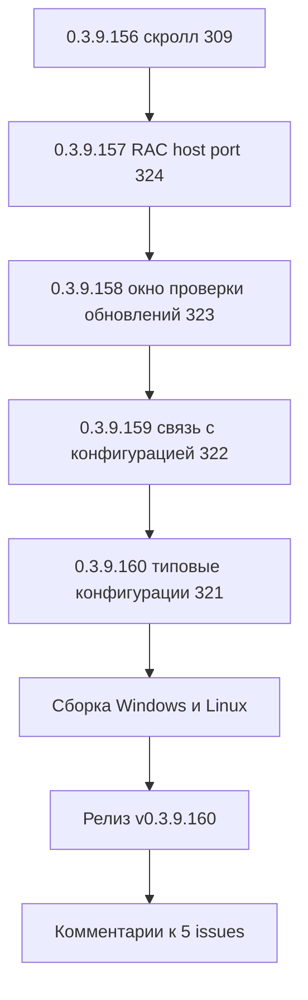

# PLAN — цикл 0.3.9.156–0.3.9.160 — обработка открытых issues (после 0.3.9.155)

Репозиторий [`sivatorov/ConfigurationManagement`](https://github.com/sivatorov/ConfigurationManagement),
локальная копия `f:\Yandex.Disk\h\Configuration_Management`, ветка `main`.
Локальный HEAD — **0.3.9.155** (тег v0.3.9.155, релиз опубликован; снапшот issues 2026-09-29).

Режим: Архитектор (план) → задачи-исполнители в режиме **code** (`new_task` по одному на этап).
**Один этап = одна версия = один коммит.** План-файл остаётся untracked (`plans/` в
.codeassistantignore); CHANGELOG/README/csproj коммитятся. Issues самостоятельно НЕ закрывать
(закрывает автор после подтверждения пользователем); после каждого исправления — комментарий
к issue «что исправлено и в какой версии».

Данные о issues получены через GitHub REST API (`gh`, снапшот 2026-09-29 ~18:30 UTC).
Из 10 открытых issues **5 требуют исправления** (нет комментариев ИЛИ последний комментарий
не от @sivatorov): #309 (новый комментарий @7OH после фикса 0.3.9.152), #321, #322, #323, #324.
Не требуют: #304, #305, #308, #319 (последний комментарий от @sivatorov), #313 (подтверждено
пользователем, код не требовался).

---

## 1. Сводка цикла

| № | Версия | Issue | Суть | Приоритет |
|---|--------|-------|------|-----------|
| 1 | 0.3.9.156 | #309 | Регресс после 0.3.9.152: полоса прокрутки почти на максимуме, последняя колонка «еле видно», двигать некуда | 1 — пользователь ждёт ответа (комментарий 18:30Z) |
| 2 | 0.3.9.157 | #324 | rac не разбирает `--host=localhost --port=N`, работает только `rac localhost:27545 …`; тексты монитора серверов выровнять по вертикали по центру | 1 |
| 3 | 0.3.9.158 | #323 | Окно «Проверка обновлений» (F9): не модальное, кнопка «начать проверку» обрезана, проверка не работает / каталог релизов не показывает, нужны пояснения | 2 |
| 4 | 0.3.9.159 | #322 | «Связать с конфигурацией»: версия не подставляется при автоопределении, окно не модальное, непонятно где править сегмент URL (AccountingCorp), связь должна работать по информации о конфигурации базы | 2 |
| 5 | 0.3.9.160 | #321 | «Типовые конфигурации»: при сохранении данные путаются между строками, правка «два в одном» (закрывает всё), нужен JSON-файл для хранения, добавить/удалить не работают (изменения исчезают) | 2 |

---

## 2. Общие требования к КАЖДОМУ этапу

1. Реализация на обеих платформах (Windows/WPF + Linux/Avalonia), где применимо; чистые
   сервисы/VM — без платформенных зависимостей; окна — пара WPF `.xaml` / Avalonia `.Avalonia.cs`.
2. Инкремент версии в [`Configuration Management.csproj`](../Configuration%20Management/Configuration%20Management.csproj)
   (строки 62–65: Version/AssemblyVersion/FileVersion/InformationalVersion) на 1 патч.
3. Запись в CHANGELOG.md (сверху, формат как у прошлых версий) и обновление бейджа версии
   в README.md (строка 3).
4. Тесты: `dotnet test` зелёный и `dotnet build -p:BuildLinux=true` без ошибок.
5. Один коммит (без пуша). **Запрещены ключевые слова автозакрытия issues**: в теле и
   заголовке коммита НЕ использовать паттерны `fix: #N`, `fixes #N`, `close #N`, `closes #N`,
   `resolve #N`, `resolves #N` (GitHub автоматически закрывает issue, а закрытие за автором).
   Образец сообщения: `0.3.9.156: горизонтальный скролл списка баз — последняя колонка достижима`.
6. После каждого исправления — черновик комментария `publish/comment-{N}-0.3.9.XXX.md` по образцу
   существующих и публикация `gh issue comment {N} --body-file publish/comment-{N}-0.3.9.XXX.md`.
   Issue НЕ закрывать.
7. Все пункты плана перед исполнением сверить с фактическим кодом (адреса строк могут сместиться).

---

## 3. Этап 0.3.9.156 — #309 «Пропал горизонтальный скрол» (регресс после 0.3.9.152)

**Последний комментарий @7OH (2026-09-29 18:30Z):** «Увы - после запуска последнюю колонку
еле видно. Скрол почти на всю - то есть двигать его некуда.»

**Симптом:** после запуска программы горизонтальная полоса стоит почти в конце своего хода,
но последняя колонка (например «№ релиза») лишь частично видна → фактическая ширина контента
дерева больше, чем рассчитанный минимум контента (ExtentWidth < реальной ширины строк).

**Гипотезы причины (проверить в коде):**
- Звёздная колонка «Название» занимает больше расчётного минимума (длинные названия баз),
  поэтому сумма ширин колонок меньше фактической ширины строк; WPF TreeView не растягивает
  ExtentWidth под содержимое при горизонтальной прокрутке (Anti-Scroll «Honeycomb» поведение).
- `ListMinWidthCalculator` считает минимум по видимым ширинам колонок, но фактические строки
  шире из-за неограниченной ширины «Названия» (значение > ширины колонки при обрезке).
- В Avalonia аналогично: ширина контента внешней прокрутки берётся по расчётной сумме, а
  реальный контент дерева шире.

**Затрагиваемые файлы (WPF):** `Views/MainWindow.Scroll.cs`, `Views/MainWindow.Columns.cs`,
`Views/MainWindow.xaml.cs`, `Views/MainWindow.Events.cs`, `Views/ListMinWidthCalculator.cs`.
**Затрагиваемые файлы (Avalonia):** `Views/MainWindow.Avalonia.Scroll.cs`,
`Views/MainWindow.Avalonia.Columns.cs`.
**Тесты:** `ConfigurationManagement.Tests/ListMinWidthCalculatorTests.cs`.

**Направление решения:** брать минимум контента как max(расчётная сумма колонок, фактическая
ширина первой строки дерева / DesiredSize) и/или подписываться на расширение контента дерева;
после старта выполнять дополнительный пересчёт после материализации строк (не только до).
Проверить анти-регрессы #255 (ложная полоса) и #214 (синхронность шапки).

**Выход:** версия 0.3.9.156, CHANGELOG/README, тесты зелёные, коммит, комментарий #309.

---

## 4. Этап 0.3.9.157 — #324 «Серверы 1С» (RAC: формат host:port + выравнивание текстов)

**Описание issue:** в логе «RAC: --host=localhost --port=27540 cluster list» → rac завершился
с кодом -1, «Ошибка разбора параметра: --host=localhost». Ручной запуск `rac.exe localhost:27545
cluster list` работает. Дополнительно: «тексты можно подровнять по вертикали по середине»
(скриншот монитора серверов, строки прижаты к верхнему краю).

**Корень:** [`Services/RacClient.cs`](../Configuration%20Management/Services/RacClient.cs),
`BuildArguments` (строки ~113–127) формирует раздельные токены `--host=addr` и `--port=N`;
rac на машине пользователя (новая версия платформы) такой синтаксис не принимает.

**Решение:** формировать единый токен подключения `{address}:{port}` первым аргументом
(`rac localhost:27545 cluster list`); если порт ≤ 0 — только `{address}`; если адрес пуст —
без токена. `--user`/`--password` оставить как есть. Учесть маскирование пароля в
`SensitiveDataMasker.MaskRacPassword` (тесты строк вида `--host=... --port=...` обновить).

**Затрагиваемые файлы:** `Services/RacClient.cs`, `Services/IRacClient.cs`
(RacConnectionParams — при необходимости), `ConfigurationManagement.Tests/RacClientTests.cs`,
вызывающие окна `Views/ServerMonitorWindow.xaml.cs` и `Views/ServerMonitorWindow.Avalonia.cs`
(формат ошибок/текстов, вертикальное выравнивание текстовых блоков в XAML/Avalonia).

**Выход:** версия 0.3.9.157, CHANGELOG/README, тесты зелёные, коммит, комментарий #324.

---

## 5. Этап 0.3.9.158 — #323 «Окно Проверка обновлений» (UpdateCheckWindow, F9)

**Описание issue (без комментариев):**
1. Окно не является модальным.
2. Кнопка «начать проверку» обрезана.
3. Проверка не работает — «что-то ему не нравится, но понять что — не могу»; возможно,
   не показывает каталог релизов. Нужны пояснения.

**Код:** окно открывается в
[`MainViewModel.Updates.cs`](../Configuration%20Management/ViewModels/MainViewModel.Updates.cs)
(строка 84: `win.ShowDialog()` без `Owner`) и
[`MainViewModel.Avalonia.Updates.cs`](../Configuration%20Management/ViewModels/MainViewModel.Avalonia.Updates.cs)
(`win.ShowSync(OwnerWindow())`). Окно: `Views/UpdateCheckWindow.xaml` (кнопка CheckButton,
Height=36, окно 600×560) и `Views/UpdateCheckWindow.Avalonia.cs`. Логика сети:
`Services/OneCUpdatesService.cs`, `ViewModels/UpdateCheckRowViewModel.cs`,
`Models/ConfigUpdateCheckResult.cs`.

**Направление решения:**
- Модальность: задать `win.Owner = Application.Current.MainWindow` перед `ShowDialog()` (WPF) —
  паттерн как в `ExecuteShowActualReleases`/`OpenConfigTypesEdit` (issue #264/#265/#288);
  для Avalonia проверить `ShowSync(OwnerWindow())` — если окно всё равно не модально, сверить
  с `ModalWindowBase`.
- Кнопка обрезана: проверить раскладку Grid (ширина окна 600, три кнопки 150+150+120+margins
  могут не помещаться при узком содержимом/шрифтах); увеличить ширину окна либо перевести
  кнопки на автоподгонку.
- Проверка не работает: диагностировать `OneCUpdatesService` (URL формирования каталога
  релизов, авторизация, ответ сервера), выводить понятную ошибку в окне (текст результата),
  не проглатывать исключения; проверить настройку логина/пароля сайта 1С и сегмент URL.

**Выход:** версия 0.3.9.158, CHANGELOG/README, тесты зелёные, коммит, комментарий #323.

---

## 6. Этап 0.3.9.159 — #322 «Связать с конфигурацией» (ConfigUpdateLinkWindow)

**Комментарии @7OH:**
1. «Похоже выбор версии не работает только тогда, когда конфигурация хоть как-то выбрана
   автоматом правильно. Если выбирать другие - даёт выбрать версию.»
2. «Данное окно не является модальным».
3. «Просьба объяснить — ГДЕ вводить и исправлять ключевые кусочки адреса, которые идут после
   releases? К примеру AccountingCorp в программе нигде не фигурирует.»
4. «Я думал связь идёт через информацию о конфигурации. Хочешь кнопкой, хочешь вручную в базе
   прописал. И дальше по этому полю уже должна связь работать.»

**Код:** `Views/ConfigUpdateLinkWindow.xaml` / `.xaml.cs` /
`Views/ConfigUpdateLinkWindow.Avalonia.cs`; открытие —
`MainViewModel.Updates.cs` строка 109 (`win.ShowDialog()` без Owner).

**Направление решения:**
- Версия/редакция: при выборе конфигурации автоматически подставляется DefaultEdition —
  проверить логику `OnConfigSelectionChanged`/`SelectInitialConfig`: возможно, при
  автоопределённой конфигурации редакция выбирается некорректно и блокирует подстановку
  версии. Сделать выбор версии всегда возможным.
- Модальность: Owner как выше.
- Сегмент URL: в окне связи показывать полный формируемый URL с разбором по частям
  (редактируемое поле сегмента конфигурации + суффикса редакции), подсказку где он хранится
  (в типовой конфигурации — окно «Типовые конфигурации»), кнопку перехода к списку типовых.
- Связь через информацию о конфигурации: при определении версии (ConfigurationInfoService)
  автоматически сопоставлять имя конфигурации из базы со списком типовых (BuiltInConfigTypes +
  пользовательские) и заполнять поле связи, чтобы «прописал вручную в базе — и связь работает».

**Выход:** версия 0.3.9.159, CHANGELOG/README, тесты зелёные, коммит, комментарий #322.

---

## 7. Этап 0.3.9.160 — #321 «Окно Типовые конфигурации» (ConfigTypesEditWindow)

**Описание issue + комментарии @7OH:**
1. «Похоже тут не хватает подписей, чтобы минимум понять — ЧТО это и для чего».
2. «При попытке сохранить изменения - цифры из строк попадают в другие базы или показывают
   совсем не те данные».
3. «Может быть окно правки сделать отдельным, а не как сейчас - два в одном. Нажимаешь
   "Правка", а потом "Закрыть" и закрывается вообще всё».
4. «Я бы предложил всё таки вот это хранить в json файле. И поправить можно и поделиться с
   кем-то. Сейчас удалить нельзя, добавить похоже тоже, так как изменения после перезапуска
   исчезают.»

**Код:** `Views/ConfigTypesEditWindow.xaml` / `.xaml.cs` (279 строк) /
`Views/ConfigTypesEditWindow.Avalonia.cs`; модель `Models/OneCConfigType.cs`;
`BuiltInConfigTypes`; хранение — `AppSettings.CustomConfigTypes` (в общем файле настроек).

**Направление решения:**
- Хранение в JSON: выделить пользовательские конфигурации в отдельный файл
  (например `custom_config_types.json` рядом с настройками) с читаемым UTF-8
  (`JavaScriptEncoder.UnsafeRelaxedJsonEscaping` — паттерн цикла 0.3.9.155), миграция
  существующих `CustomConfigTypes` из AppSettings.
- Ошибка «цифры из строк попадают в другие базы»: диагностировать привязку колонок
  (DataGrid auto-generated columns vs индексы строк), вероятную потерю сопоставления
  «строка ↔ модель» при редактировании; использовать явные колонки с привязкой к свойствам.
- Отдельное окно правки: кнопка «Правка» открывает отдельное модальное окно
  (NameInputWindow-подобное или новое ConfigTypeEditWindow); «Закрыть» закрывает только окно
  списка. Добавление/удаление — через панель действий; предопределённые остаются read-only
  с пояснением.
- Подписи: заголовки колонок и поясняющие тексты («Что это и для чего»).

**Выход:** версия 0.3.9.160, CHANGELOG/README, тесты зелёные, коммит, комментарий #321.

---

## 8. Этап «Сборка» — исполняемые файлы Windows и Linux

После 0.3.9.160:
1. `dotnet test` — полный зелёный прогон.
2. `dotnet publish` для RID `win-x64` (self-contained) → `publish/out-0.3.9.160/ConfigurationManagement.exe`.
3. `dotnet publish` для RID `linux-x64` (self-contained) → `publish/out-0.3.9.160/ConfigurationManagement-linux-x64`.
4. Проверить по образцу `publish/release_body_0.3.9.155.md` (пути сборки в предыдущих циклах).

## 9. Этап «Релиз» — push + GitHub Release + комментарии issues

1. Коммиты 0.3.9.156–0.3.9.160 запушены в `main` (без ключевых слов автозакрытия).
2. Тег `v0.3.9.160` + push тега.
3. GitHub Release v0.3.9.160 с вложениями (Windows exe, Linux binary) и телом
   `publish/release_body_0.3.9.160.md`.
4. Публикация комментариев ко всем 5 issues (черновики уже подготовлены на этапах):
   `gh issue comment {309,321,322,323,324} --body-file publish/comment-{N}-0.3.9.XXX.md`.
   Issues НЕ закрывать.
5. Обновить снапшот `publish/issues_snapshot_2026-09-29-160.md` с итогом цикла.

---

## 10. Риски и замечания

- #309 — повторный регресс после двух попыток (0.3.9.140, 0.3.9.152): требуется проверить на
  реальной конфигурации пользователя (много длинных названий баз, звёздная ширина «Названия»).
  Добавить юнит-тесты на фактические ширины строк, а не только сумму колонок.
- #324 — смена формата подключения rac может затронуть старые версии платформ, которые
  понимают только `--host=`/`--port=`: проверить документацию/обратную совместимость;
  формат `host:port` является штатным для rac во всех версиях (используется в примерах 1С).
- #321 — перенос хранения в JSON требует миграции существующих пользовательских данных из
  AppSettings, иначе пользователь потеряет настройки.
- Все изменения — без ключевых слов автозакрытия в коммитах; issues закрывает автор после
  подтверждения пользователем.