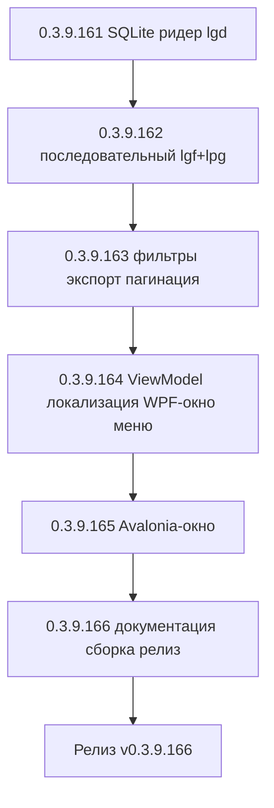
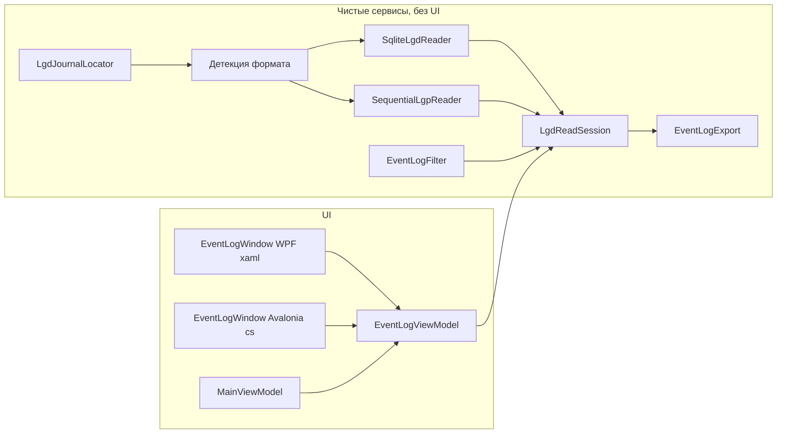

# PLAN — цикл 0.3.9.161–0.3.9.166 — встроенный просмотрщик журнала регистрации ИБ (.lgd / .lgf+.lgp)

Репозиторий [`sivatorov/ConfigurationManagement`](https://github.com/sivatorov/ConfigurationManagement),
локальная копия `f:\Yandex.Disk\h\Configuration_Management`, ветка `main`.
Локальный HEAD — **0.3.9.160** (версия в [`Configuration Management.csproj`](../Configuration%20Management/Configuration%20Management.csproj:62),
бейдж в [`README.md`](../README.md:3), верхняя запись в [`CHANGELOG.md`](../CHANGELOG.md:12)).

Режим: Архитектор (план) → задачи-исполнители в режиме **code** (`new_task` по одному на этап).
**Один этап = одна версия = один коммит.** План-файл остаётся untracked (`plans/` в
`.codeassistantignore`); CHANGELOG/README/csproj коммитятся. Это **новая функция без номера
issue** (собственная дорожная карта, а не обработка открытых issues), поэтому комментарии
к issues не публикуются; в CHANGELOG заголовок — «Добавлено», как принято для новых возможностей.

---

## 1. Сводка цикла

| № | Версия | Суть | Приоритет |
|---|--------|------|-----------|
| 1 | 0.3.9.161 | Чтение SQLite-формата `.lgd`: модель события, детекция формата, локатор каталога журнала, ридер через `Microsoft.Data.Sqlite`, тесты | 1 |
| 2 | 0.3.9.162 | Чтение последовательного формата `.lgf`+`.lgp` (ZIP-фрагменты, текстовые записи, словари `.lgf`), тесты | 1 |
| 3 | 0.3.9.163 | Фильтрация (дата/пользователь/событие/важность/текст), постраничная выборка, экспорт CSV/TXT, тесты | 1 |
| 4 | 0.3.9.164 | ViewModel + локализация ru/en + WPF-окно + пункты контекстного меню (обе платформы), тесты VM | 2 |
| 5 | 0.3.9.165 | Avalonia-окно (программная разметка по образцу существующих окон), сборка Linux | 2 |
| 6 | 0.3.9.166 | Документация (CHANGELOG/README/ARCHITECTURE), полная сборка Windows+Linux, релиз-ноут | 2 |

---

## 2. Общие требования к КАЖДОМУ этапу

1. Реализация на обеих платформах (Windows/WPF + Linux/Avalonia), где применимо; чистые
   сервисы/VM — без платформенных зависимостей; окна — пара WPF `.xaml`+`.xaml.cs` /
   Avalonia `.Avalonia.cs` (Avalonia-разметка программная, по образцу
   `ConfigDiffResultWindow.Avalonia.cs`, `MaintenanceCenterWindow.Avalonia.cs`).
2. Инкремент версии в [`Configuration Management.csproj`](../Configuration%20Management/Configuration%20Management.csproj:62)
   (строки 62–65: Version/AssemblyVersion/FileVersion/InformationalVersion) на 1 патч.
3. Запись в [`CHANGELOG.md`](../CHANGELOG.md:12) (сверху, раздел «Добавлено») и обновление
   бейджа версии в [`README.md`](../README.md:3).
4. Тесты: `dotnet test` зелёный и `dotnet build -p:BuildLinux=true` без ошибок.
5. Один коммит (без пуша); без ключевых слов автозакрытия issues (здесь issue нет, но
   правило соблюдается). Образец сообщения: `0.3.9.161: просмотр журнала регистрации — чтение SQLite lgd`.
6. Все пункты плана перед исполнением сверить с фактическим кодом (адреса строк могут сместиться).

---

## 3. Анализ формата журнала регистрации 1С (результаты исследования)

### 3.1. Два физических формата, оба встречаются в поле

Платформа 1С:Предприятие 8 поддерживает два формата хранения ЖР:

1. **Последовательный** — файлы `1Cv8.lgf` (описание) + `*.lgp` (фрагменты данных, **ZIP-архивы**) +
   `*.lgx` (индексные файлы, ~10 % размера фрагмента).
   * Единственный формат на платформах < 8.3.5; формат по умолчанию с 8.3.12; единственный с 8.3.22.
   * Хранение по периодам (настройка «Разделять хранение журнала по периодам»), имена фрагментов вида `20110322000000.lgp` (yyyyMMddHHmmss, подтверждено в комментариях к Infostart-статье о разборе ELF/LOG/LGF/LGP).
   * Записи внутри фрагмента — **текстовые строки переменной длины**, обрамлённые фигурными скобками
     `{ … }`; поля: дата `yyyyMMddHHmmss` + бинарная дата, статус транзакции (N/U/R/C), коды
     пользователя/компьютера/приложения, код события, важность (I/E/W/N), комментарий, коды метаданных,
     данные в структурах `{"S","…"}, {"N",n}, {"U"}, {"R",id:GUID}, {"P",{…}}`.
   * Словари кодов→имён (Users, UserNames, Hosts, Apps, Events, MDID, MDCodes, SrvHosts, MainPorts,
     SyncPorts) лежат в бинарном `1Cv8.lgf` (сигнатура `"1CV8LOG(ver 2.0)"`, GUID базы); для чтения
     достаточно их расшифровки, но ридер должен работать и без них (fallback на «сырые» коды).
2. **SQLite** — файл `1Cv8.lgd`, **стандартная база SQLite 3** (магическая сигнатура `SQLite format 3\0`),
   читается штатными драйверами (`sqlite3`, DBeaver, Python). Формат появился в 8.3.5 (по умолчанию
   8.3.5–8.3.11), выбор доступен до 8.3.21, **отменён с 8.3.22** (1С признала формат неудачным для
   многопользовательской работы — долгие чтения блокируют запись, см. «Записки оптимизатора», ч.13).
   * Схема (по сообществу; точные имена колонок подтвердить интроспекцией `sqlite_master`): основная
     таблица `eventLog` (~20 колонок: `rowID`, `date`/`dt`, `connectID`, `session`, `transactionStatus`,
     `transactionDate`, `transactionID`, `userCode`, `computerCode`, `appCode`, `eventCode`, `severityCode`,
     `comment`, `metadataCode`, `data`, `dataPresentation`, …) + справочники `userCodes`, `computerCodes`,
     `appCodes`, `eventCodes`, `metadataCodes`, а также таблицы сеансов (`SessionDataCodes`, `SessionHosts`,
     `SessionParamCodes`, `SessionUsers` и др.). Всего ~16 таблиц, БД нормализована.
   * Важность в формате 1С: информация/предупреждение/ошибка/примечание (для UI — те же 4 значения, что
     в конфигураторе: Информация, Предупреждение, Ошибка, Примечание).

### 3.2. О гипотезе «размер записи 512 байт»

В постановке указано «16-битные события в LGF-структуре, размер записи 512 байт». По доступной
документации и сообществу (Infostart 181455/182061, 1С:ИТС, gilev.ru, softpoint.ru):

* последовательный формат хранит записи **текстом переменной длины** внутри ZIP-фрагментов `.lgp`,
  а не фиксированными блоками по 512 байт;
* фиксированные бинарные заголовки есть у описательного файла `1Cv8.lgf`, но их длина меньше 512 байт.

**Вывод для плана:** гипотезу о фиксированном размере 512 байт НЕ закладываем в архитектуру; первый
этап начинается с верификации реальных файлов (исполнитель просит у пользователя образец журнала
`1Cv8Log` или копию `.lgd`). Ридер строится по фактической структуре (SQLite — по интроспекции,
последовательный — по текстовым записям), что покрывает и случай, если на конкретной версии платформы
раскладка отличается.

### 3.3. Альтернативы и оценка реализуемости чистого чтения

| Способ | Реализуемость | Комментарий |
|--------|---------------|-------------|
| Чистое чтение `.lgd` (SQLite) | ✅ Реализуемо | Стандартный SQLite; нужна NuGet-зависимость `Microsoft.Data.Sqlite` (нативная `e_sqlite3`), работа read-only. |
| Чистое чтение `.lgf`/`.lgp` | ✅ Реализуемо | Только BCL: `System.IO.Compression.ZipArchive` + построчный парсер; сложность — словари `.lgf` и кодировки. |
| Экспорт через конфигуратор CLI | ❌ Недоступно | Команды экспорта ЖР в командной строке конфигуратора нет (подтверждено постановкой). |
| Чтение через COM `V82.COMConnector` / объект `EventLog` | ⚠️ Нежелательно | Требует установленной 1С и запущенного соединения; не работает на Linux/Avalonia; нарушает кроссплатформенность. |
| Внешняя обработка `.epf` | ⚠️ Нежелательно | Нужен поставляемый `.epf` и рантайм 1С; усложняет поставку и поддержку. |
| Вызов `ВыгрузитьЖурналРегистрации()` | ⚠️ Нежелательно | Только изнутри 1С; тяжёлые выборки блокируют запись ЖР (SQLite) — известная проблема производительности. |

**Итог:** реализуемо чистое чтение обоих форматов; SQLite — через `Microsoft.Data.Sqlite`,
последовательный — только BCL. Новой нативной зависимости избежать нельзя только для SQLite-ветки;
single-file publish уже использует `IncludeNativeLibrariesForSelfExtract=true`, поэтому нативная
`e_sqlite3` извлечётся при первом запуске (риск №6).

---

## 4. Механика определения пути к журналу

### 4.1. Файловая база

Каталог журнала = `<каталог базы>\1Cv8Log` (рядом с `1Cv8.1CD`). Для определения каталога базы
переиспользуем уже существующий метод `InfobaseMaintenanceService.GetFileBaseDirectory(ib)`
([`Services/InfobaseMaintenanceService.Shared.cs`](../Configuration%20Management/Services/InfobaseMaintenanceService.Shared.cs:17)) —
он корректно обрабатывает оба варианта `Connection.FilePath` (путь к `1Cv8.1CD` или к каталогу).

Детекция формата в `1Cv8Log` (по приоритету):
1. есть `1Cv8.lgd` → **SQLite** (один файл);
2. есть `1Cv8.lgf` и хотя бы один `*.lgp` → **последовательный** (фрагменты сортируем по имени =
   по дате начала периода);
3. ничего из перечисленного → журнал ещё не создавался / каталог недоступен → понятное сообщение
   с путём.

### 4.2. Клиент-серверная и веб-базы

Путь ЖР на сервере (`<srvinfo>\reg_<port>\<GUID>\1Cv8Log\`) клиенту недоступен (нет SMB-шары,
имя GUID-каталога берётся из реестра кластера на сервере). **Решение плана:**
- на первом этапе команда **«Журнал регистрации…»** в контекстном меню активна только для файловых баз;
- для клиент-серверных/веб-баз пункт виден, но неактивен с подсказкой «Журнал хранится на сервере;
  скопируйте файлы журнала локально»;
- добавляется отдельная команда **«Открыть журнал из файла…»** (в контекстном меню базы и в меню
  «Утилиты»), которая открывает локальную копию журнала серверной базы или архив сокращения ЖР
  (диалог выбора `*.lgd`/`*.lgf`+`*.lgp`). Это закрывает сценарий «по локальной копии» без доступа к серверу.

---

## 5. Архитектура

### 5.1. Слои и ответственность

### 5.2. Новые файлы (предварительно)

**Models/**
- `EventLogEntry.cs` — запись события: `Timestamp` (DateTime), `TransactionStatus`
  (enum: None/Started/Committed/RolledBack), `User`, `Computer`, `Application`, `EventCode` (int),
  `EventName`, `Severity` (enum Info/Warning/Error/Note), `Comment`, `MetadataType`, `MetadataName`,
  `Data` (строка-дамп), `SourceFile` (для трассировки).
- `EventLogSeverity.cs`, `EventLogTransactionStatus.cs` — перечисления.

**Services/EventLog/**
- `LgdJournalLocator.cs` — `Resolve(Infobase)` → `JournalLocation { LogDir, Format, MainFilePath,
  Files[], ErrorMessage }`; `DetectFormat(dir)`. Переиспользует `GetFileBaseDirectory`.
- `ILgdReader.cs` — потоковый контракт:
  `Describe(location)`, `CountMatched(filter, ct)`, `ReadPage(filter, skip, take, progress, ct)`.
- `SqliteLgdReader.cs` — read-only `Mode=ReadOnly;Cache=Shared;Pooling=False`; интроспекция
  `sqlite_master` для маппинга колонок (переносимость между версиями платформы); push-down фильтров
  в `WHERE`; `LIMIT/OFFSET` для пагинации; join со справочниками (best-effort).
- `SequentialLgpReader.cs` — перечисление `*.lgp` по возрастанию имени; распаковка через
  `ZipArchive`; построчный парсер записей `{...}`; опциональная расшифровка словарей `1Cv8.lgf`;
  определение кодировки (UTF-8 → cp1251); устойчивость к битым/обрезанным строкам (счётчик пропусков).
- `EventLogFilter.cs` — неизменяемая модель фильтра (From/To, Users, Events, Severities,
  TransactionStatuses, TextContains, MetadataContains) + `Matches(entry)` (чистая функция).
- `LgdReadSession.cs` — фасад: выбор ридера по формату, счёт совпадений, страница `{Rows, Total}`,
  перечисление значений для комбобоксов фильтров (одним проходом), прогресс.
- `EventLogExport.cs` — потоковая запись CSV (переиспользование
  [`CsvExporter`](../Configuration%20Management/Services/CsvExporter.cs:12), UTF-8 BOM, `;`) и TXT
  (табуляция, экранирование переводов строк, UTF-8 BOM).

**ViewModels/**
- `EventLogViewModel.cs` (+ строки в том же файле или `EventLogRowViewModel.cs`) — состояние окна,
  фильтры, пагинация, прогресс, команды `LoadCommand/NextPage/PrevPage/Refresh/Cancel/ExportCsv/
  ExportTxt/OpenFile`.
- `MainViewModel.Tools.cs` / `MainViewModel.Avalonia.Tools.cs` — команды `OpenEventLogCommand`
  (can-execute: выбрана файловая база) и `OpenEventLogFromFileCommand` (всегда).

**Views/**
- `EventLogWindow.xaml` + `EventLogWindow.xaml.cs` (WPF): DataGrid с виртуализацией, панель фильтров,
  пагинатор, прогресс-бар, предупреждение «база запущена» (используем готовый `Infobase.IsRunning`),
  диалоги сохранения через `Microsoft.Win32.SaveFileDialog`.
- `EventLogWindow.Avalonia.cs` (Avalonia): программная разметка по образцу
  `ConfigDiffResultWindow.Avalonia.cs`; сохранение через `TopLevel.StorageProvider`.

**Прочее**
- `AppServices.cs` — регистрация `LgdReadSession` (Transient) и `ILgdReader` в общей секции.
- `Localization/Languages/ru.json`, `en.json` — ключи `EventLog.*` и `Main.EventLog*`.
- `Configuration Management.csproj` — пакет `Microsoft.Data.Sqlite` (общая секция) и
  `System.Text.Encoding.CodePages` (для cp1251 в последовательном формате; managed, обязателен для
  `Encoding.GetEncoding(1251)` на .NET).
- `ConfigurationManagement.Tests/` — новые файлы тестов (см. §8).

### 5.3. Интеграция в контекстное меню

- WPF: пункт в `LeveledTreeView.ContextMenu`
  ([`Views/MainWindow.xaml`](../Configuration%20Management/Views/MainWindow.xaml:2419)) рядом с
  администрированием; видимость/доступность в `OnBaseContextMenu_Opened`
  ([`Views/MainWindow.Columns.cs`](../Configuration%20Management/Views/MainWindow.Columns.cs:74)).
- Avalonia: пункт в `BuildRowContextMenu()`
  ([`Views/MainWindow.Avalonia.Tree.cs`](../Configuration%20Management/Views/MainWindow.Avalonia.Tree.cs:1829))
  и `MenuAction(...)`; «Открыть журнал из файла…» — в `BuildUtilitiesMenu()`.
- Приватные базы: команды подчиняются общим правилам видимости приватных баз профиля.

---

## 6. Таблица декомпозиции

| Версия | Область | Основные файлы | Тесты | Риски |
|--------|---------|----------------|-------|-------|
| 0.3.9.161 | SQLite-ридер `.lgd`, локатор, детекция | `Models/EventLogEntry.cs`, `Models/EventLogSeverity.cs`, `Models/EventLogTransactionStatus.cs`, `Services/EventLog/LgdJournalLocator.cs`, `Services/EventLog/SqliteLgdReader.cs`, `Services/EventLog/ILgdReader.cs`, `csproj` (пакет), `AppServices.cs` | `EventLogSqliteReaderTests.cs`, `LgdJournalLocatorTests.cs` | Реальные имена колонок `eventLog` в разных версиях платформы; открытие «живого» файла занятой базы |
| 0.3.9.162 | Последовательный ридер `.lgf`+`.lgp` | `Services/EventLog/SequentialLgpReader.cs`, `csproj` (Encoding.CodePages) | `SequentialLgpReaderTests.cs` | Точная бинарная раскладка `.lgf` не полностью публична; кодировки; битые ZIP/строки |
| 0.3.9.163 | Фильтры, пагинация, экспорт | `Services/EventLog/EventLogFilter.cs`, `Services/EventLog/LgdReadSession.cs`, `Services/EventLog/EventLogExport.cs` | `EventLogFilterTests.cs`, `EventLogExportTests.cs`, `LgdReadSessionTests.cs` | Производительность повторного счёта на больших журналах; корректность страниц через границы сегментов |
| 0.3.9.164 | VM + локализация + WPF-окно + меню | `ViewModels/EventLogViewModel.cs`, `Views/EventLogWindow.xaml(.cs)`, `MainViewModel.Tools.cs`, `MainViewModel.Avalonia.Tools.cs`, `ru.json`, `en.json`, `AppServices.cs` | `EventLogViewModelTests.cs` | Потокобезопасность фоновой загрузки; видимость пунктов меню для типов баз; локализация |
| 0.3.9.165 | Avalonia-окно | `Views/EventLogWindow.Avalonia.cs`, `MainWindow.Avalonia.Tree.cs`, `MainWindow.Avalonia.Tools.cs` | (те же VM-тесты) + сборка Linux | Отличия DataGrid/диалогов Avalonia; контекстное меню Avalonia |
| 0.3.9.166 | Документация и релиз | `CHANGELOG.md`, `README.md`, `ARCHITECTURE.md`, `publish/release_body_0.3.9.166.md` | Полный прогон `dotnet test` + `build -p:BuildLinux=true` | Согласованность версий в 4 местах |

---

## 7. Этапы (детально)

### 7.1. 0.3.9.161 — SQLite-ридер `.lgd`

**Задачи:**
1. Добавить пакет `Microsoft.Data.Sqlite` (последняя стабильная, совместимая с net10.0) в общую
   секцию пакетов `csproj`; убедиться, что тестовый проект получает ссылку транзитивно.
2. Модели `EventLogEntry`, `EventLogSeverity`, `EventLogTransactionStatus`.
3. `LgdJournalLocator.Resolve(Infobase)` + `DetectFormat(dir)` (см. §4); ошибки локализованными
   текстами (заготовки ключей вернуть на этапе 164, сейчас — русские строки с TODO).
4. `SqliteLgdReader`:
   - строка подключения `Data Source=...;Mode=ReadOnly;Cache=Shared;Pooling=False`;
   - интроспекция колонок `eventLog` через `PRAGMA table_info`/`sqlite_master`; маппинг
     «имя колонки → поле модели» по известному набору (date/dt, userCode/usr, computerCode/com,
     eventCode/evt, severityCode/sev, comment, metadata*, data, dataPresentation, session,
     transactionStatus) с пропуском отсутствующих;
   - преобразование даты 1С (целое) в `DateTime` — зафиксировать множитель юнит-тестом на фикстуре;
   - join справочников (userCodes/computerCodes/appCodes/eventCodes/metadataCodes) best-effort,
     без справочников — «сырые» коды;
   - `CountMatched`/`ReadPage` с `WHERE` из `EventLogFilter` (передаётся пустой фильтр до этапа 163).
5. `AppServices`: регистрация `ILgdReader` (обе реализации) и `LgdReadSession` — на этом этапе можно
   только `ILgdReader`, фасад добавить на 163.
6. **Тесты:** фикстура SQLite-БД (schema `eventLog` + справочники, 20–50 строк, включая транзакции и
   важности); проверки: чтение всех строк, маппинг даты/кодов, страницы, битая сигнатура (файл-фейк),
   пустой файл, отсутствующий каталог, отсутствующие справочные таблицы. `LgdJournalLocatorTests`:
   temp-каталоги с `1Cv8.lgd` / `1Cv8.lgf`+`*.lgp` / пустым `1Cv8Log`, FilePath как файл и как каталог.
7. Версия 0.3.9.161 + CHANGELOG «Добавлено» + README-бейдж. Коммит.

**Приёмка:** эталонный образец `.lgd` от пользователя (или копия ЖР) читается корректно: даты,
пользователи, события, важность, комментарии.

**Риски:** фактические имена колонок отличаются от сообщества → маппинг по интроспекции + тесты на
синтетической схеме; `Microsoft.Data.Sqlite` в single-file publish (проверить на обоих RID).

### 7.2. 0.3.9.162 — Последовательный формат `.lgf`+`.lgp`

**Задачи:**
1. `SequentialLgpReader`:
   - список `*.lgp` сортировкой по имени (= начало периода), игнорируем `*.lgx` (оптимизация индекса —
     вне объёма, отметить в TODO);
   - открытие как `ZipArchive` (стандартный deflate); каждый внутренний поток — построчно, буфер
     64 КБ; запись = строка в фигурных скобках, допускаются многострочные комментарии/данные —
     накапливать до баланса скобок;
   - парсер структур `{"S","…"}, {"N",n}, {"U"}, {"R",id:GUID}, {"P",{…}}` и полей записи (по
     разбору 182061); статус транзакции N/U/R/C → enum; важность I/E/W/N → enum;
   - кодировка: попытка строгого UTF-8, fallback cp1251 (`System.Text.Encoding.CodePages`);
   - словарь `.lgf`: сигнатура `1CV8LOG(ver 2.0)`, GUID, таблицы Users/UserNames/Hosts/Apps/Events/
     MDID/MDCodes/SrvHosts/MainPorts/SyncPorts — расшифровка best-effort; при неузнанной структуре —
     пустой словарь (ридер работает, показывая коды);
   - битые ZIP, обрезанные фрагменты, невалидные строки — пропуск с подсчётом `SkippedRecords`
     (видно в статусе окна).
2. **Тесты:** фикстуры `.lgp` (ZipArchive с текстовыми записями: валидными, с кириллицей в обеих
   кодировках, с `{P,...}`-данными, с обрезкой посередине записи, с битым ZIP), порядок нескольких
   сегментов, минимальный бинарный `1Cv8.lgf`-фикстур под документированную сигнатуру (при
   невозможности — тест «без словаря»), пустой каталог.
3. Версия 0.3.9.162 + CHANGELOG + README. Коммит.

**Приёмка:** реальный `1Cv8Log` (последовательный, напр. платформа 8.3.25) читается с корректными
полями; кириллица без «кракозябр».

**Риски:** бинарная раскладка `.lgf` не документирована полностью → fail-open стратегия; вариации
записей между 8.1/8.2/8.3 → золотой тест на реальном образце как приёмка.

### 7.3. 0.3.9.163 — Фильтры, пагинация, экспорт

**Задачи:**
1. `EventLogFilter` — имutable-модель + `Matches(entry)`; `EventLogSqliteReader` учит push-down
   (WHERE по дате/кодам), последовательный ридер фильтрует при сканировании.
2. `LgdReadSession` — фасад: `CountMatched`, `ReadPage(skip, take)`, `EnumerateValues(field)` для
   комбобоксов пользователей/событий (один проход по всем строкам с фильтром по дате), прогресс
   (`IProgress<double>`), `CancellationToken`.
3. `EventLogExport` — CSV через готовый [`CsvExporter`](../Configuration%20Management/Services/CsvExporter.cs:12)
   (UTF-8 BOM, `;`, RFC 4180) и TXT (табы, экранирование `\n`, `\r`, `\t`, UTF-8 BOM); потоковая
   запись без материализации всего результата; шапка колонок передаётся из VM (локализуемая).
4. **Тесты:** `EventLogFilterTests` (границы дат включительно, наборы, текст, комбинации),
   `EventLogExportTests` (экранирование, BOM, CRLF, пустые значения), `LgdReadSessionTests`
   (пагинация поверх обеих фикстур: skip/take, total, страница через границу двух `.lgp`-сегментов,
   отмена через токен).
5. Версия 0.3.9.163 + CHANGELOG + README. Коммит.

**Риски:** повторный полный счёт на гигабайтных журналах → для SQLite `COUNT` с тем же `WHERE`,
для последовательного — однопроходный счёт с прогрессом и кэшем на время сессии окна.

### 7.4. 0.3.9.164 — ViewModel, локализация, WPF-окно, пункты меню

**Задачи:**
1. `EventLogViewModel` (наследник `ViewModelBase`): входной параметр — `Infobase` (или путь к файлу
   для режима «из файла»), свойства `LocationSummary`, `FormatLabel`, `IsRunningWarning`
   (подписка на `Infobase.IsRunning`), фильтры, `Items` (`ObservableCollection`), `PageSize` (500),
   `TotalCount`, `Progress` (0–100), `IsBusy`, `StatusText`, `SkippedRecords`; команды загрузки
   страницы, навигации, отмены, экспорта; фоновое выполнение `Task.Run` + `CancellationTokenSource`
   + возврат на UI-поток через marshaling, предусмотренный `ViewModelBase` (проверить паттерн
   существующих VM, например `ServerMonitorViewModel`).
2. Локализация: ключи `EventLog.*` (Title, Columns.*, Filters.*, RunningWarning, OpenFromFile,
   Empty, NotFound, ExportCsv/ExportTxt, ProgressFormat, PageFormat, SkippedFormat) в
   `ru.json`/`en.json`.
3. WPF `EventLogWindow.xaml(.cs)`: DataGrid (виртуализация `EnableRowVirtualization`, 
   `VirtualizingStackPanel`), панель фильтров (2 DatePicker, ComboBox пользователей и событий,
   CheckBox важностей, TextBox поиска), пагинатор (◀ N/M ▶, PageSize), ProgressBar, кнопки
   «Экспорт CSV/TXT», баннер-предупреждение для запущенной базы; `SaveFileDialog`.
4. Команды `OpenEventLogCommand` (CanExecute: `SelectedInfobase` — файловая база и журнал найден;
   иначе в `OnBaseContextMenu_Opened` пункт гасится с подсказкой) и `OpenEventLogFromFileCommand`
   (диалог выбора `*.lgd`/`*.lgf`+`*.lgp`) — в `MainViewModel.Tools.cs` и
   `MainViewModel.Avalonia.Tools.cs`; пункты меню WPF
   ([`MainWindow.xaml`](../Configuration%20Management/Views/MainWindow.xaml:2419),
   [`MainWindow.Columns.cs`](../Configuration%20Management/Views/MainWindow.Columns.cs:74)) и Avalonia
   ([`MainWindow.Avalonia.Tree.cs`](../Configuration%20Management/Views/MainWindow.Avalonia.Tree.cs:1829)).
5. DI: `AddTransient<LgdReadSession>()`, `AddSingleton<ILgdReader>` (обе реализации) в общей секции
   `AppServices`; `InternalsVisibleTo` уже есть для тестов.
6. **Тесты:** `EventLogViewModelTests` — CanExecute логика, переходы страниц, применение фильтра
   (мок `ILgdReadSession`), экспорт вызывает экспортёр с текущим фильтром, отмена.
7. Версия 0.3.9.164 + CHANGELOG + README. Коммит.

**Риски:** потокобезопасность фоновой загрузки и обновления коллекции (все мутации — на UI-потоке);
корректное обновление прогресса без спама PropertyChanged (пакет по ~1% или по таймеру).

### 7.5. 0.3.9.165 — Avalonia-окно

**Задачи:**
1. `EventLogWindow.Avalonia.cs` — программная разметка (образец `ConfigDiffResultWindow.Avalonia.cs`):
   `DataGrid` (Avalonia), фильтры (`DatePicker`, `ComboBox`, `CheckBox`), пагинатор, `ProgressBar`,
   кнопки экспорта; сохранение через `TopLevel.GetTopLevel(window)?.StorageProvider.SaveFilePickerAsync`.
2. Подключение пунктов меню Avalonia (контекстное меню строки + «Утилиты»).
3. Проверка `dotnet build -p:BuildLinux=true` и ручной прогон на Linux (или анализ через
   `LINUX_TESTING.md`).
4. Версия 0.3.9.165 + CHANGELOG + README. Коммит.

**Риски:** отличия Avalonia DataGrid (колонки, виртуализация по умолчанию), поведение модальности
и диалогов файлов; стилизация через `ControlThemes`.

### 7.6. 0.3.9.166 — Документация и релиз

1. `CHANGELOG.md` — сводная запись «Добавлено: просмотр журнала регистрации» с деталями форматов и
   ограничениями (файловые базы + открытие из файла; предупреждение про запущенную базу/SQLite).
2. `README.md` — пункт в «Возможности» + обновлённый бейдж.
3. `ARCHITECTURE.md` — упоминание модуля `Services/EventLog`.
4. Черновик релиз-ноута `publish/release_body_0.3.9.166.md` (по образцу существующих).
5. Полный прогон: `dotnet test`, `dotnet build -p:BuildLinux=true`, publish single-file обеих ОС
   (в т.ч. проверка, что `e_sqlite3` корректно извлекается).
6. Коммит (без пуша).

---

## 8. Сводка тестов

| Файл тестов | Покрытие |
|-------------|----------|
| `EventLogSqliteReaderTests.cs` | SQLite-фикстура: чтение, даты 1С, коды/справочники, страницы, битые/пустые файлы, отсутствие справочников |
| `LgdJournalLocatorTests.cs` | temp-каталоги: детекция `.lgd`/`.lgf`/пусто, FilePath файл/каталог, ошибки |
| `SequentialLgpReaderTests.cs` | `.lgp`-ZIP-фикстуры: валидные записи, кодировки UTF-8/cp1251, `{P,…}`-данные, обрезка, битый ZIP, порядок сегментов, отсутствие словаря |
| `EventLogFilterTests.cs` | границы дат, наборы пользователей/событий/важностей, текст, комбинации |
| `EventLogExportTests.cs` | CSV (RFC 4180, BOM, CRLF, `;`), TXT (экранирование табов/переводов), пустые значения |
| `LgdReadSessionTests.cs` | пагинация над обеими фикстурами, total, граница сегментов, отмена, прогресс |
| `EventLogViewModelTests.cs` | CanExecute, навигация по страницам, применение фильтра, экспорт с фильтром, отмена |

---

## 9. Сводные риски и митигации

1. **Вариативность SQLite-схемы 1С** (имена колонок, набор справочников, формат даты) → интроспекция
   `sqlite_master` + маппинг по имени + толерантность к отсутствию таблиц; тесты на синтетической схеме;
   приёмка на реальном образце.
2. **Неподтверждённая раскладка последовательного формата** (гипотеза «512 байт» не подтверждена) →
   парсер по текстовым записям `{...}` + fail-open для `.lgf`; золотой тест на реальном журнале.
3. **Производительность больших журналов** (гигабайты) → SQLite: push-down + индексы (date/rowID);
   последовательный: поточное чтение, однопроходный счёт, пагинация без загрузки всего, прогресс и
   отмена; `*.lgx`-индексы — вне объёма (TODO).
4. **Блокировки живой SQLite-базы** (чтение стопит запись ЖР запущенной базы — подтверждено в статье
   Softpoint) → открытие `Mode=ReadOnly`, жёлтый баннер «База запущена», рекомендация использовать
   копию; при занятости файла (sharing violation) — предложение «Открыть из файла…».
5. **Потокобезопасность** → чтение в фоне, все мутации коллекций/свойств на UI-потоке, единый
   `CancellationTokenSource` на операцию, защита от повторного запуска загрузки.
6. **Новая нативная зависимость `e_sqlite3` в single-file publish** → `IncludeNativeLibrariesForSelfExtract`
   уже включён; проверить оба RID на этапе 166.
7. **Кодировка cp1251 в старых журналах** → пакет `System.Text.Encoding.CodePages` +
   `Encoding.RegisterProvider(CodePagesEncodingProvider.Instance)` (однократно, из `LgdReadSession`).
8. **Видимость пунктов меню по типам баз и приватности** → правила в `OnBaseContextMenu_Opened` (WPF)
   и при построении Avalonia-меню; пункт «из файла» всегда активен (кроме случаев приватности).

---

## 10. Примечания

- Функция не привязана к issue GitHub; комментарии в issues не требуются; CHANGELOG — «Добавлено».
- План не содержит оценок трудозатрат; этапы исполняются последовательно, по одному `new_task`
  в режиме **code** после утверждения плана.
- Все пути и адреса строк в плане актуальны на HEAD 0.3.9.160; перед каждым этапом сверить с кодом.