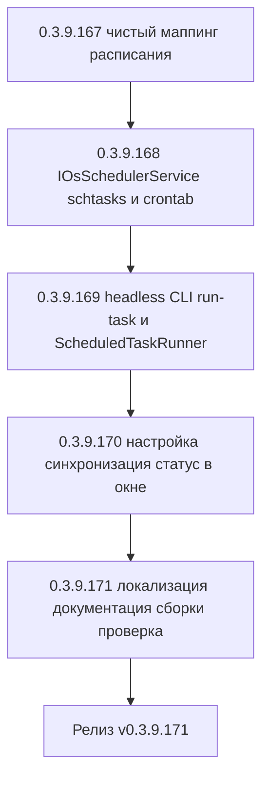

# PLAN — цикл 0.3.9.167–0.3.9.171 — Функция 2: выполнение заданий по расписанию без запущенного приложения

Репозиторий [`sivatorov/ConfigurationManagement`](https://github.com/sivatorov/ConfigurationManagement),
локальная копия `f:\Yandex.Disk\h\Configuration_Management`, ветка `main`.
Локальный HEAD — **0.3.9.161** (версия в [`Configuration Management.csproj`](../Configuration%20Management/Configuration%20Management.csproj:62),
бейдж в [`README.md`](../README.md:3), верхняя запись в [`CHANGELOG.md`](../CHANGELOG.md:12)).

Режим: Архитектор (план) → задачи-исполнители в режиме **code** (`new_task` по одному на этап).
**Один этап = одна версия = один коммит.** План-файл остаётся untracked (`plans/` в
`.codeassistantignore`); CHANGELOG/README/csproj коммитятся. Это **новая функция** (собственная
дорожная карта, а не обработка открытых issues): комментарии к issues не публикуются; в CHANGELOG
заголовок — «Добавлено». Нумерация цикла стартует с **0.3.9.167** — предполагается, что текущий
запланированный цикл журнала регистрации (0.3.9.161–0.3.9.166) завершится раньше.

---

## 1. Сводка цикла

| № | Версия | Суть | Приоритет |
|---|--------|------|-----------|
| 1 | 0.3.9.167 | Чистый маппинг расписания: cron-строка, XML задачи Windows, парсер управляемого блока crontab, парсер статуса из XML Task Scheduler; модель статуса; тесты | 1 |
| 2 | 0.3.9.168 | `IOsSchedulerService` обеих платформ: Windows — `schtasks.exe` + XML, Linux — `crontab` с управляемым блоком; Register/Unregister/GetStatus/SyncAll; обёртка процессов для тестов | 1 |
| 3 | 0.3.9.169 | Headless CLI `--run-task <id> [--profile <id>]` до создания UI; единый исполнитель `ScheduledTaskRunner` (рефакторинг `SchedulerService`); коды возврата; логирование | 1 |
| 4 | 0.3.9.170 | Настройка «Выполнять задания даже без запущенного приложения»; синхронизация при изменении/удалении заданий; статус «Планировщик ОС» в окне заданий; отключение внутриприложного таймера при ON | 1 |
| 5 | 0.3.9.171 | Локализация ru/en, документация (CHANGELOG/README/ARCHITECTURE), полные сборки Windows+Linux, интеграционная проверка (регистрация → ручной запуск → результат в задании) | 2 |



---

## 2. Общие требования к КАЖДОМУ этапу

1. Реализация на обеих платформах (Windows/WPF + Linux/Avalonia), где применимо; чистые
   сервисы/VM — без платформенных зависимостей; платформенные реализации — символы условной
   компиляции (`#if WINDOWS` / `#if LINUX`), как [`AutoStartService.cs`](../Configuration%20Management/Services/AutoStartService.cs:1)
   / [`AutoStartService.Avalonia.cs`](../Configuration%20Management/Services/AutoStartService.Avalonia.cs:1).
2. Инкремент версии в [`Configuration Management.csproj`](../Configuration%20Management/Configuration%20Management.csproj:62)
   (строки 62–65: Version/AssemblyVersion/FileVersion/InformationalVersion) на 1 патч.
3. Запись в [`CHANGELOG.md`](../CHANGELOG.md:12) (сверху, раздел «Добавлено») и обновление
   бейджа версии в [`README.md`](../README.md:3).
4. Тесты: `dotnet test` зелёный и `dotnet build -p:BuildLinux=true` без ошибок.
5. Один коммит (без пуша); без ключевых слов автозакрытия issues. Образец сообщения:
   `0.3.9.167: задания вне приложения — маппинг расписания в планировщики ОС`.
6. Все пункты плана перед исполнением сверить с фактическим кодом (адреса строк могут сместиться).

---

## 3. Выбор механизма интеграции с планировщиками ОС

### 3.1. Windows: schtasks.exe vs Task Scheduler COM vs Microsoft.Win32.TaskScheduler

| Способ | Зависимости | Права | Надёжность/статус | Вердикт |
|--------|-------------|------|-------------------|---------|
| `schtasks.exe` + XML-определение задачи (`/Create /XML … /F`) | нет (System32, всегда есть) | HKCU-пользователь, без админа (`InteractiveToken`) | Создание/удаление — по кодам выхода (0/≠0). Статус — через `/Query /XML` (XML, не зависит от локали ОС). Полный контроль триггеров через XML | ✅ Основной механизм |
| Task Scheduler 2.0 COM (`Schedule.Service`) | нет (COM в составе ОС), код на `dynamic` | пользовательские задачи без админа | Статус через свойства (State/LastRunTime/LastTaskResult), но COM-interop многословен, труднее тестировать | ⚠️ Запасной, не выбран |
| NuGet `Microsoft.Win32.TaskScheduler` | новая сторонняя зависимость | то же | Зрелая обёртка над COM, netstandard2.0 → совместима с net10.0-windows | ⚠️ Отклонено: лишняя зависимость ради того, что даёт `schtasks.exe` |

**Решение Windows:** `schtasks.exe` с **генерируемым XML-определением задачи** (папка задач
`\ConfigurationManagement\<sanitizedId>`). Причины:
- нет новых NuGet-зависимостей (single-file publish остаётся лёгким);
- создание/перезапись атомарно: `/Create /XML <файл> /TN <имя> /F` (флаг `/F` перезаписывает);
- статус читается из XML (`/Query /TN <имя> /XML`) — **не зависит от локали** (избегаем парсинга
  локализованного текста; это главный риск CLI-варианта без XML);
- права: задачи текущего пользователя с `<LogonType>InteractiveToken</LogonType>` — без админа,
  работают при заблокированном экране (сессия активна); при полном выходе пользователя не
  выполняются (приемлемое ограничение desktop-приложения, фиксируется в README).

Ключевые элементы XML: `<CalendarTrigger>` (ежедневно — `<ScheduleByDay DaysInterval=1>`;
по дням недели — `<ScheduleByWeek><DaysOfWeek><Monday/>…</DaysOfWeek></ScheduleByWeek>`),
`<StartBoundary>` в локальном времени, `<Enabled>` (задание включено/выключено),
`<Settings>`: `<MultipleInstancesPolicy>IgnoreNew</MultipleInstancesPolicy>`,
`<StartWhenAvailable>true</StartWhenAvailable>`, `<DisallowStartIfOnBatteries>false</…>`,
`<StopIfGoingOnBatteries>false</…>`, `<Exec><Command>путь\к\exe</Command><Arguments>…</Arguments></Exec>`
с XML-экранированием (пути с пробелами и кириллицей — в т.ч. `Yandex.Disk`).

### 3.2. Linux: crontab vs systemd user timers

| Способ | Зависимости | Права | Надёжность | Вердикт |
|--------|-------------|------|-----------|---------|
| `crontab` (управляемый блок `# BEGIN ConfigurationManagement` / `# END …`) | бинарь `crontab` (есть во всех дистрибутивах) | пользовательские crontab без root | Минутная гранулярность достаточна (расписание HH:mm). Перезапись блока атомарна: `crontab -l` → правка → `crontab -` (stdin). Статус — разбор собственного блока (не зависит от локали). Команды с абсолютным путём к exe | ✅ Основной механизм |
| systemd user timers (`~/.config/systemd/user/cm-task-*.timer`) | systemd с активной user-сессией (не гарантирована в части DE/контейнеров), `systemctl --user`, `daemon-reload` | user units без root | Точный `OnCalendar`, статус через `systemctl --user show`, но: сессия может отсутствовать; `daemon-reload` после каждой правки; больше «движущихся частей» | ⚠️ Будущая опция, не выбран |

**Решение Linux:** `crontab` с **управляемым блоком**. Причины:
- минимальные зависимости и предсказуемое поведение на desktop-системах без root;
- мы владеем только своим блоком между маркерами, чужие записи пользователя не трогаем;
- статус регистрации — сравнение строк блока (чистая функция, покрывается тестами);
- запись строки задания: `mm hh * * 1,3,5 "/абс/путь/exe" --run-task <id> --profile <pid> >> "<datadir>/logs/scheduler.log" 2>&1`
  (перенаправление вывода обязательно: в cron-mail почта обычно не настроена).

Важно: cron запускает команды в минимальном окружении (нет `DISPLAY`/`DBus`) — поэтому headless
CLI-путь (п. 4) обязан выполняться **до инициализации Avalonia/WPF**.

### 3.3. Единая абстракция

```csharp
public interface IOsSchedulerService
{
    bool IsAvailable { get; }                    // true на Windows; Linux — найдена ли crontab
    bool LastOperationFailed { get; }
    string? LastErrorMessage { get; }            // локализованное сообщение для UI
    OsTaskStatus? GetStatus(string taskId);      // null — не зарегистрировано
    void Register(ScheduledTask task, string executablePath, string profileId);
    void Unregister(string taskId);
    void SyncAll(IEnumerable<ScheduledTask> tasks, string executablePath, string profileId);
    void UnregisterAll(IEnumerable<string> taskIds);
}
```

`OsTaskStatus` (`Models/OsScheduledTaskStatus.cs`): `bool Registered`, `bool Enabled`,
`DateTime? LastRunTime`, `int? LastTaskResult`, `DateTime? NextRunTime`.

Платформенные реализации — один интерфейс, два файла (`#if WINDOWS`/`#if LINUX`), по образцу
`AutoStartService`. Процессы (запуск `schtasks`/`crontab`, чтение stdout/кода выхода, таймаут)
инкапсулируются в инжектируемую обёртку `IProcessRunner` — ради юнит-тестов обеих реализаций.

---

## 4. Headless CLI-контракт `--run-task`

### 4.1. Почему путь обязателен до UI

- Windows: существующие CLI-команды обрабатываются в `App.OnStartup`
  ([`App.xaml.cs`](../Configuration%20Management/App.xaml.cs:168)) **после** `app.InitializeComponent()`
  (загрузка словарей WPF). Для `--run-task` окна/ресурсы не нужны; запуск должен работать, когда
  приложение закрыто и процесс поднимается планировщиком ОС.
- Linux: CLI обрабатывается внутри Avalonia-фреймворка
  ([`App.axaml.cs`](../Configuration%20Management/App.axaml.cs:252)) — в окружении cron **нет
  DISPLAY**, и поднятие Avalonia-цикла недопустимо.

**Решение:** новый headless-обработчик `Services/TaskRunCommandLine.cs` вызывается первым из
`Program.Main` обеих платформ — до создания `App` (Windows, по образцу `ComReadHost` в
[`Program.cs`](../Configuration%20Management/Program.cs:53)) и до `BuildAvaloniaApp().Start…`
(Linux). Он сам настраивает DI (`AppServices.Configure()`), инициализирует профили, выполняет
задание и завершает процесс кодом возврата.

### 4.2. Синтаксис

```
ConfigurationManagement --run-task <taskId> [--profile <profileId>]
```

- `taskId` — GUID из [`ScheduledTask.Id`](../Configuration%20Management/Models/ScheduledTask.cs:34)
  (совпадает с именем файла `.task.json` в `schedules/`);
- `--profile <id>` — профиль, которому принадлежит задание. Вставляется в аргументы записи
  планировщика ОС автоматически при регистрации, поэтому headless-запуск детерминирован и не
  зависит от «последнего активного профиля». Если опущен — используется последний активный
  профиль (поведение текущего CLI).
- Для активации профиля без побочного эффекта «последний использованный профиль» добавляется
  метод `IProfileService.ActivateProfileForSession(string id)` (сессионная активация без
  `SaveRegistry`; см. [`ProfileService.SetCurrentProfile`](../Configuration%20Management/Services/ProfileService.cs:253)).
- Приватные базы заблокированного профиля: задание, ссылающееся на приватную ИБ, из CLI не
  выполняется (аналог `--run`, код 4, [`CommandLineHandler.cs`](../Configuration%20Management/Services/CommandLineHandler.cs:166)).

### 4.3. Коды возврата

| Код | Значение |
|-----|----------|
| 0 | Задание выполнено успешно (в т.ч. «нечего делать» для UpdateApp) |
| 1 | Задание с таким Id не найдено |
| 2 | Задание выполнилось с ошибкой (результат записан в `LastRunSuccess=false`) |
| 3 | Внутренняя ошибка обработчика (DI/профиль/исключение) |
| 4 | Задание ссылается на приватную базу заблокированного профиля |

При любом исходе результат пишется в задание (`LastRunAt`/`LastRunUtc`/`LastRunSuccess`/
`LastRunMessage`) через общий исполнитель (п. 4.4) — статус виден в окне заданий. Системные
уведомления в headless-режиме **не показываются** (нет трея; в cron нет DBus) — только запись в
файловый лог (`IAppLogger`). Single-instance мутекс/файловая блокировка headless-путём **не
затрагиваются** (проверка одиночного экземпляра живёт внутри `App.OnStartup` /
`OnFrameworkInitializationCompleted`).

### 4.4. Единый исполнитель заданий `ScheduledTaskRunner`

Чтобы headless-запуск и внутриприложный планировщик выполняли одно и то же, из
[`SchedulerService.ExecuteAsync`](../Configuration%20Management/Services/SchedulerService.cs:267)
выделяется общий класс:

```csharp
public sealed class ScheduledTaskRunner
{
    public Task<BackupRunResult?> ExecuteAsync(ScheduledTask task);  // switch по Kind (перенос из SchedulerService)
    public void MarkRun(ScheduledTask task);                          // LastRunAt/LastRunUtc
    public void SaveResult(ScheduledTask task, BackupRunResult? result);
}
```

`SchedulerService` инжектирует `ScheduledTaskRunner` (поведение/тесты не меняются); `TaskRunCommandLine`
использует его напрямую. Дополнительно добавляется **guard от параллельного выполнения одного
задания**: файл-блокировка `<schedules>/.running/<id>.lock` (`FileStream` с `FileShare.None`,
создаётся в начале выполнения, удаляется в конце). Это исключает двойной запуск, если внутриприложный
таймер и запись планировщика ОС всё же «пересеклись» в переходный момент (п. 6).

---

## 5. Синхронизация и статус в UI

### 5.1. Настройка

Новое поле [`AppSettings.RunTasksWithoutApp`](../Configuration%20Management/Models/AppSettings.cs:382)
(рядом с `CatchUpMissedTasks`), по умолчанию `false`. Проксируется в `MainViewModel`
(поля + `SetProperty` + сохранение в [`MainViewModel.Launch.cs`](../Configuration%20Management/ViewModels/MainViewModel.Launch.cs:654))
и выводится переключателем в окне «Настройки» — обе платформы
([`SettingsWindow.Avalonia.cs`](../Configuration%20Management/Views/SettingsWindow.Avalonia.cs:407)
и WPF `SettingsWindow.xaml.cs`/`.Display.cs`, по образцу `CatchUpMissedTasks`).

### 5.2. Точки синхронизации

1. **Включение опции** (сохранение настроек): `IOsSchedulerService.SyncAll(все задания активного
   профиля, exePath, profileId)`; внутриприложный таймер планировщика останавливается
   (`SchedulerService.Stop()`), догоняние не запускается.
2. **Отключение опции**: `UnregisterAll(все Id)`; таймер и догоняние возвращаются
   (`SchedulerService.Start()` + `RunCatchUpAsync`).
3. **Добавление/изменение задания** ([`ScheduledTasksWindow`](../Configuration%20Management/Views/ScheduledTasksWindow.xaml.cs:54),
   обе платформы): после `_store.Save` → если опция ON — `Register`/`SyncAll` (перезапись
   существующей записи). Выключенное задание **не регистрируется** (при включении — повторная
   регистрация).
4. **Удаление задания** ([`ScheduledTasksWindow`](../Configuration%20Management/Views/ScheduledTasksWindow.xaml.cs:80)):
   `_store.Delete` + `Unregister` независимо от опции — не оставляем «сирот» в планировщике ОС.
5. **Запуск приложения с опцией ON**: в [`App.xaml.cs`](../Configuration%20Management/App.xaml.cs:279)
   / [`App.axaml.cs`](../Configuration%20Management/App.axaml.cs:337) таймер и catch-up пропускаются,
   а после входа в профиль выполняется `SyncAll` — авто-«лечение» записей после самообновления
   (exe мог переехать/переименоваться).

### 5.3. Отображение статуса

`ScheduledTaskItemViewModel` получает свойство `OsStatusText` (локальные ключи):
- «Зарегистрировано в планировщике ОС» (+ последний результат/следующий запуск из `OsTaskStatus`);
- «Не зарегистрировано» (опция OFF или задание отключено);
- «Планировщик недоступен» / «Ошибка регистрации: …» (код возврата, `LastErrorMessage`).

Статус запрашивается при каждом `LoadTasks()` окна заданий (обе платформы) через
`IOsSchedulerService.GetStatus(task.Id)`; источник истины — планировщик ОС (не храним статус в JSON).

---

## 6. Взаимодействие с догоняющим выполнением (функция №7)

**Принцип: единственный активный источник расписания в каждый момент времени.**

| Опция RunTasksWithoutApp | Источник расписания | Догоняние (ScheduleCatchUp) |
|--------------------------|--------------------|-----------------------------|
| OFF (по умолчанию) | внутриприложный `SchedulerService` | работает как сейчас; записи ОС отсутствуют |
| ON | планировщик ОС (schtasks/cron) | **отключено** — пропуски при выключенном ПК просто не выполняются (планировщик ОС сработает в следующий плановый момент), дублирования нет |

Дополнительные гарантии от дублирования:
- при ON внутриприложный таймер остановлен → `RunCatchUpAsync` и `ProcessDueAsync` физически не
  могут сработать для зарегистрированных заданий;
- переходные состояния (включение/отключение опции в живой сессии) прикрыты guard-файлом
  `.running/<id>.lock` (п. 4.4) и сравнением `LastRunUtc` через
  [`ScheduleCatchUpCalculator`](../Configuration%20Management/Services/ScheduleCatchUpCalculator.cs:32):
  headless-запуск обновляет `LastRunUtc`, и «догонять» этот момент уже нечего;
- `UpdateApp` по-прежнему исключён из догоняния; в планировщик ОС регистрируется обычным образом.

---

## 7. Таблица декомпозиции задач

| № | Версия | Файлы (новые/изменяемые) | Тесты | Риски и митигации |
|---|--------|--------------------------|-------|-------------------|
| 1 | 0.3.9.167 | **New:** `Models/OsScheduledTaskStatus.cs`, `Services/OsScheduleMapper.cs` (cron-строка: daily/weekly, воскресенье→0/7; XML задачи Windows: CalendarTrigger Daily/Weekly, StartBoundary локальное время, Enabled, InteractiveToken, MultipleInstancesPolicy=IgnoreNew, StartWhenAvailable, Exec+Arguments с XML-escape; управляемый блок crontab `# BEGIN/END ConfigurationManagement` + строки-маркеры `# id=<taskId>`; парсер статуса из `/Query /XML` — Enabled/LastRunTime/LastTaskResult/NextRunTime) | `OsScheduleMapperTests`: построение cron-строки (ежедневно, набор дней), XML при пробелах/кириллице в пути, парсинг собственного crontab-блока, парсинг XML статуса, round-trip | Чистые функции — низкий. Внимание к xml-экранированию `&<>"` и формату `StartBoundary` (без часового пояса — локальное время) |
| 2 | 0.3.9.168 | **New:** `Services/IProcessRunner.cs`, `Services/SystemProcessRunner.cs` (Run+stdout+exit code+таймаут), `Services/IOsSchedulerService.cs`, `Services/OsSchedulerService.Windows.cs` (#if WINDOWS: schtasks Create/Query/Delete/End, путь `\ConfigurationManagement\<id>`), `Services/OsSchedulerService.Linux.cs` (#if LINUX: `crontab -l` → замена блока → `crontab -`; GetStatus по строкам блока; IsAvailable = найден ли crontab). **Edit:** `AppServices.cs` (регистрация интерфейса + runner) | Фейковый `IProcessRunner`: Register формирует верные аргументы; перезапись (`/F`); UnregisterAll; GetStatus по XML/блоку; обработка ненулевых кодов выхода и таймаута; сохранение чужих записей crontab | Локализованный вывод schtasks → не парсим текст, только коды выхода и XML. Нет crontab в PATH → IsAvailable=false + локализованное сообщение. Длинные имена задач → санитизация Id. Пути с пробелами → кавычки/экранирование |
| 3 | 0.3.9.169 | **New:** `Services/ScheduledTaskRunner.cs`, `Services/TaskRunCommandLine.cs` (Parse: `--run-task <id> [--profile <pid>]`; TryHandle: Configure DI → `ActivateProfileForSession` → поиск задания → runner → запись результата → код выхода; без уведомлений). **Edit:** `SchedulerService.cs` (делегирование в runner; извлечь ExecuteAsync/MarkRun/SaveResult), `Program.cs` (обе платформы: перехват `--run-task` до App/Avalonia; Windows — после `ComReadHost`), `Services/IProfileService.cs` + `ProfileService.cs` (`ActivateProfileForSession`), `AppServices.cs` (runner) | `TaskRunCommandLineTests`: парсинг форм `--run-task`, `--profile`; код 1 при отсутствии задания; регрессия `CommandLineHandlerTests`; `ScheduledTaskRunner` (MarkRun/SaveResult на фейковом store) | Headless-запуск WPF без `InitializeComponent` (уже практикуется для ComReadHost — образец). Активация профиля без персиста последнего. Приватные базы → код 4. Double-run guard `.lock` |
| 4 | 0.3.9.170 | **Edit:** `Models/AppSettings.cs` (`RunTasksWithoutApp`), `MainViewModel.*` (4 файла: поле/свойство/сохранение), `Views/SettingsWindow.*` (WPF+Avalonia, переключатель по образцу CatchUpMissedTasks), `ViewModels/ScheduledTaskItemViewModel.cs` (`OsStatusText`), `Views/ScheduledTasksWindow.*` (обе платформы: колонка/текст статуса, вызов Register/Unregister при Add/Edit/Delete), `App.xaml.cs` + `App.axaml.cs` (условный `Start`/`RunCatchUpAsync` при ON; `SyncAll` на старте; Stop при включении опции из настроек) | AppSettings round-trip; VM `OsStatusText` (зарегистрировано/нет/ошибка) на фейковом `IOsSchedulerService`; сценарий «ON → SyncAll вызван, OFF → UnregisterAll» через фейк | Конфликт с `SchedulerService` (п. 6): при ON таймер/догоняние выключены. Диалоги настроек/заданий держат ссылки на сервисы — аккуратно с порядком DI. Статус тянется в момент открытия окна — не «живой» (допустимо, фиксируется в коде) |
| 5 | 0.3.9.171 | **Edit:** `Localization/Languages/ru.json`, `en.json` (ключи `Schedule.Os.*`, `Settings.General.RunTasksWithoutApp*`, CLI-сообщения), `CHANGELOG.md`, `README.md`, `ARCHITECTURE.md`; сборки Windows+Linux | Сквозная проверка вручную: регистрация с ON → `schtasks /Run` и ручной запуск cron-строки → `LastRunSummary` в окне; toggle OFF → записи удалены; exe с пробелом/кириллицей в пути | DST/часовой пояс: schtasks и crond используют локальное время — ок. Самообновление меняет exe — auto-heal SyncAll при старте. Документировать ограничение «пользователь должен быть в системе» (Windows InteractiveToken, Linux cron) |

---

## 8. Риски (сводно) и митигации

| Риск | Митигация |
|------|-----------|
| Локализованный вывод `schtasks` (запрос статуса) | Только коды выхода + `/Query /XML`; текстовый вывод не парсится |
| Права планировщика (нужен ли админ) | Только пользовательские задачи/пользовательский crontab; `InteractiveToken`; без `RunLevel` |
| Пути к exe с пробелами/кириллицей (в т.ч. `Yandex.Disk`) | XML-экранирование и кавычки в аргументах; тесты на такие пути |
| Нет `crontab` / `schtasks` (редкие окружения, политики) | `IsAvailable=false`, локализованное сообщение, приложение работает как раньше (внутриприложный планировщик) |
| Конфликт с существующим `SchedulerService` и догонянием | Единый активный источник расписания (п. 6); guard `.running/<id>.lock`; синхронизация через `LastRunUtc` |
| Self-update заменяет exe, пути в записях ОС устаревают | `SyncAll` при каждом старте с опцией ON |
| Cron-окружение без DISPLAY/DBus | Headless-путь до инициализации Avalonia; без системных уведомлений; лог в файл |
| Дубликат «пропусков» между планировщиками | П. 6: при ON догоняние отключено, источников два никогда не бывает |
| Новая версия функции требует NuGet | Не требуется — `schtasks.exe`/`crontab` + BCL (решение обосновано в п. 3) |

---

## 9. Локализация (новые ключи, ru/en)

- `Settings.General.RunTasksWithoutApp` + подпись/подсказка;
- `Schedule.Os.Registered`, `Schedule.Os.NotRegistered`, `Schedule.Os.DisabledTask`,
  `Schedule.Os.Unavailable`, `Schedule.Os.Error`;
- CLI: `[cli] Задание не найдено: '<id>'`, `[cli] Задание выполнено: '<name>'`,
  `[cli] Задание завершилось с ошибкой: <msg>`, `[cli] Приватная база задания…` (код 4).

---

## 10. Порядок исполнения

1. Утвердить план (режим Architect).
2. `new_task` (режим **code**) на 0.3.9.167 → … → 0.3.9.171 последовательно; каждый этап —
   отдельная версия/коммит с CHANGELOG/README/бейджем, `dotnet test` + Linux-сборка.
3. После 0.3.9.171 — итоговая проверка по п. 5 этапа 5 и финальный релиз-ноут.

---

## 11. Что сознательно НЕ входит в цикл

- Системные уведомления о результатах заданий, запущенных планировщиком ОС (headless без GUI);
  задача видна в окне «Задания по расписанию» по `LastRunSummary`.
- Запуск заданий при полностью вышедшем пользователе Windows (нужны сохранённые пароли/S4U) и
  systemd user timers (альтернатива crontab) — кандидаты в следующий цикл.
- Поддержка заданий «с пропуском праздников» и повторов внутри дня — расширение модели
  расписания (внутриприложный планировщик тоже этого не умеет).