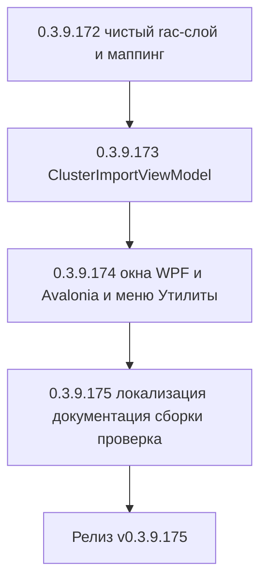

# PLAN — цикл 0.3.9.172–0.3.9.175 — Функция 3: импорт баз из кластера 1С (через RAS/rac)

Репозиторий [`sivatorov/ConfigurationManagement`](https://github.com/sivatorov/ConfigurationManagement),
локальная копия `f:\Yandex.Disk\h\Configuration_Management`, ветка `main`.
Локальный HEAD — **0.3.9.167** (версия в [`Configuration Management.csproj`](../Configuration%20Management/Configuration%20Management.csproj:62),
бейдж в [`README.md`](../README.md:3), верхняя запись в [`CHANGELOG.md`](../CHANGELOG.md:12));
в работе циклы журнала регистрации (0.3.9.161–0.3.9.166) и планировщика ОС (0.3.9.167–0.3.9.171).

Режим: Архитектор (план) → задачи-исполнители в режиме **code** (`new_task` по одному на этап).
**Один этап = одна версия = один коммит.** План-файл остаётся untracked (`plans/` в
`.codeassistantignore`); CHANGELOG/README/csproj коммитятся. Это **новая функция** (собственная
дорожная карта, а не обработка открытых issues): комментарии к issues не публикуются; в CHANGELOG
заголовок — «Добавлено». Нумерация цикла стартует с **0.3.9.172** — предполагается, что текущий
запланированный цикл планировщика ОС (0.3.9.167–0.3.9.171) завершится раньше.

---

## 1. Сводка цикла

| № | Версия | Суть | Приоритет |
|---|--------|------|-----------|
| 1 | 0.3.9.172 | Чистый rac-слой импорта: модель `RacInfobaseSummary`, метод `IRacClient.GetInfobasesAsync` (`infobase summary list --cluster=`), парсер `RacOutputParser.ToInfobaseSummaries`, маппинг в `Infobase`/`ConnectionSettings` (`RacInfobaseMapper`: хост/порт кластера, `Srvr/Ref`), дедупликация по строке подключения; тесты | 1 |
| 2 | 0.3.9.173 | Чистая вью-модель диалога `ClusterImportViewModel` (по образцу `ServerMonitorViewModel`): параметры RAS (префилл из `AppSettings`), подключение, выбор кластера, загрузка и чеклист баз с пометкой дубликатов, сводка, состояние «выполняется», обработка ошибок rac; тесты на фейковом `IRacClient` | 1 |
| 3 | 0.3.9.174 | Окна импорта WPF и Avalonia (тонкие обёртки над VM), команда «Импорт из кластера 1С…» в подменю «Утилиты → Операции» обеих платформ, интеграция с `MainViewModel` (добавление баз/групп, `SaveSilently`, статус-бар, журнал) | 1 |
| 4 | 0.3.9.175 | Локализация ru/en (ключи `ClusterImport.*`), документация (CHANGELOG/README/ARCHITECTURE), полные сборки Windows+Linux, ручная проверка сквозного сценария против реального сервера | 2 |



---

## 2. Общие требования к КАЖДОМУ этапу

1. Реализация на обеих платформах (Windows/WPF + Linux/Avalonia), где применимо; чистые
   сервисы/VM — без платформенных зависимостей; платформенные реализации — символы условной
   компиляции (`#if WINDOWS` / `#if LINUX`) или отдельные файлы `*.Avalonia.cs`, как у
   [`ServerMonitorWindow`](../Configuration%20Management/Views/ServerMonitorWindow.Avalonia.cs:1)
   и [`ServerMonitorWindow.xaml.cs`](../Configuration%20Management/Views/ServerMonitorWindow.xaml.cs:1).
2. Инкремент версии в [`Configuration Management.csproj`](../Configuration%20Management/Configuration%20Management.csproj:62)
   (строки 62–65: Version/AssemblyVersion/FileVersion/InformationalVersion) на 1 патч.
3. Запись в [`CHANGELOG.md`](../CHANGELOG.md:12) (сверху, раздел «Добавлено») и обновление
   бейджа версии в [`README.md`](../README.md:3).
4. Тесты: `dotnet test` зелёный и `dotnet build -p:BuildLinux=true` без ошибок.
5. Один коммит (без пуша); без ключевых слов автозакрытия issues. Образец сообщения:
   `0.3.9.172: импорт баз из кластера 1С — rac-слой и маппинг подключений`.
6. Все пункты плана перед исполнением сверить с фактическим кодом (адреса строк могут сместиться).

---

## 3. Команда rac и модель данных кластера

### 3.1. Выбор команды

Для получения списка информационных баз кластера используется команда

```
rac <host:port> infobase summary list --cluster=<uuid>
```

- `<host:port>` — ЕДИНЫЙ токен подключения (порт агента сервера **1540** или сервера
  администрирования RAS **1545**); сборка аргументов уже реализована в
  [`RacClient.BuildArguments`](../Configuration%20Management/Services/RacClient.cs:117);
- `--cluster=<uuid>` — **обязателен**: идентификатор кластера из `cluster list`
  ([`GetClustersAsync`](../Configuration%20Management/Services/RacClient.cs:32));
- вывод — таблица с табуляцией, первая строка — заголовок (уже обрабатывается
  [`RacOutputParser.ParseTable`](../Configuration%20Management/Services/RacOutputParser.cs:24)).

Колонки `infobase summary list` (позиционно): `infobase` (GUID), `name` (имя ИБ — это `Ref`
строки подключения), `descr` (описание), `dbms` (СУБД), `db-server` (сервер СУБД),
`db-name` (имя БД в СУБД), `db-user`, `locale`, `security-level`, `licensed`.

**Решение:** основная (и единственная) команда — `infobase summary list` (легче, требует меньше
прав, покрывает нужные колонки). Автоматический fallback на `infobase list` НЕ вводится: повтор
любой ошибки маскировал бы реальные проблемы подключения/прав и удваивал таймаут 30 с. Парсер —
позиционный, лишние колонки справа игнорируются, поэтому при необходимости переключения на
`infobase list` (первые колонки совпадают) менять придётся только строку команды.

### 3.2. Новая модель `RacInfobaseSummary`

Добавляется в [`Models/RacModels.cs`](../Configuration%20Management/Models/RacModels.cs:1):

```csharp
public sealed class RacInfobaseSummary
{
    public Guid InfobaseId { get; set; }   // col 0 «infobase»
    public string Name { get; set; } = ""; // col 1 «name»
    public string Descr { get; set; } = "";// col 2 «descr»
    public string Dbms { get; set; } = ""; // col 3 «dbms»
    public string DbServer { get; set; } = ""; // col 4 «db-server»
    public string DbName { get; set; } = "";   // col 5 «db-name»
    public string DbUser { get; set; } = "";   // col 6 «db-user»
    public string Locale { get; set; } = "";   // col 7 «locale»
    public int SecurityLevel { get; set; }     // col 8 «security-level»
    public bool Licensed { get; set; }         // col 9 «licensed»
}
```

Парсер `RacOutputParser.ToInfobaseSummaries(string output)` (по образцу
[`ToClusters`](../Configuration%20Management/Services/RacOutputParser.cs:79)):
минимальное число колонок — 2 (`infobase` + `name`); строка заголовка и строки с невалидным
GUID пропускаются; отсутствующие колонки справа — значения по умолчанию (`Col` уже так работает,
[`RacOutputParser.cs:308`](../Configuration%20Management/Services/RacOutputParser.cs:308)).

Метод интерфейса [`IRacClient`](../Configuration%20Management/Services/IRacClient.cs:55):

```csharp
Task<IReadOnlyList<RacInfobaseSummary>> GetInfobasesAsync(
    RacConnectionParams parameters, Guid clusterId,
    CancellationToken cancellationToken = default);
```

Реализация в [`RacClient.cs`](../Configuration%20Management/Services/RacClient.cs:60) — вызов
`RunAsync(parameters, ct, "infobase", "summary", "list", $"--cluster={clusterId}")` +
парсер (паттерн уже применён для всех существующих list-команд).

---

## 4. Маппинг в подключение 1С (клиент-серверная база)

Чистый статический класс `Services/RacInfobaseMapper.cs` (не зависит от UI, покрыт тестами):

```csharp
public static Infobase ToInfobase(RacInfobaseSummary source,
    string serverAddress, int clusterPort, string? clusterHostName, string groupName)
```

Правила маппинга (тип подключения — **Сервер**, `ConnectionType.ClientServer`):

| Поле `ConnectionSettings` | Источник |
|---------------------------|----------|
| `Type` | `ClientServer` |
| `Server` | Хост: приоритет — `clusterHostName` из `cluster info` (корректно для удалённого RAS); иначе — host-часть адреса из параметров подключения (убираем порт RAS: `ParseServerAndPort` из [`ConnectionSettings.cs:96`](../Configuration%20Management/Models/ConnectionSettings.cs:96)) |
| `Port` | Порт кластера из `cluster list` (колонка «port», по умолчанию 1541) — это порт подключения клиентов, НЕ порт RAS/ragent |
| `DatabaseName` (Ref) | `source.Name` (имя ИБ в кластере) |
| `AuthenticationMode` | `Prompt` (логины пользователей ИБ из кластера не переносятся) |
| `BlockScheduledJobs`, `ForbidSpeechRecognition` | `false` |

Строка подключения формируется штатно:
[`ConnectionSettings.ToConnectionString()`](../Configuration%20Management/Models/ConnectionSettings.cs:147)
→ `Srvr="host[:port]";Ref="name"` (порт 1541 по умолчанию не выводится —
[`GetServerWithPort()`](../Configuration%20Management/Models/ConnectionSettings.cs:75)).

Прочие поля `Infobase`: `Name = source.Name`, `Group = groupName` (см. п. 5.4), `Id` пустой
(это GUID списка баз 1С `ibases.v8i`, а не UUID кластера; не переносим).

### 4.1. Хост для строки подключения

- если пользователь подключился напрямую к ragent/кластеру (обычный случай) — адрес, который он
  ввёл, и есть хост кластера;
- если RAS установлен на другой машине — хост кластера берём из `cluster info --cluster=`
  (свойство `hostName`, уже читается в [`RacClusterInfo.HostName`](../Configuration%20Management/Models/RacModels.cs:235));
  при недоступности/пустом значении — fallback на введённый адрес.
- Итог: на этапе 0.3.9.172 маппер принимает готовый `clusterHostName`; на этапе 0.3.9.173 VM
  дозапрашивает `cluster info` для выбранного кластера (кэширует по `clusterId`).

### 4.2. Дедупликация по строке подключения

Ключ — нормализованная строка подключения:

```csharp
public static string ConnectionKey(Infobase ib) =>
    (ib.Connection?.ToConnectionString() ?? "").Trim();
```

Сравнение — `StringComparer.OrdinalIgnoreCase` против множества ключей существующих баз
(`MainViewModel.Infobases`). Нормализация уже даёт ожидаемое поведение: база с портом 1541 и без
него даёт одинаковый ключ; разный регистр хоста/имени не мешает; одноимённые базы на разных
портах (разные кластеры) — разные ключи. Граница метода: эквивалентность хостов
`localhost` ↔ `127.0.0.1` не распознаётся — документируется (риск п. 8).

Файловая ИБ внутри кластера (`dbms` пуст, признак файловой базы) в `infobase summary list` не
отличима надёжно — такие записи в чеклисте помечаются подписью «не импортируется (файловая
база кластера)» и исключаются из импорта (см. п. 11).

---

## 5. Диалог импорта

### 5.1. Сценарий (окно `ClusterImportWindow`, обе платформы)

1. **Параметры подключения к RAS/агенту**: адрес (префилл из `AppSettings.RacServerAddress`,
   [`AppSettings.cs:645`](../Configuration%20Management/Models/AppSettings.cs:645)), порт
   (`RacServerPort`, по умолчанию 1540; подпись «1540 — ragent, 1545 — RAS»), логин
   (`RacUserName`, [`AppSettings.cs:651`](../Configuration%20Management/Models/AppSettings.cs:651)),
   пароль — `PasswordBox`, **живёт только в памяти окна, на диск не сохраняется** (то же
   решение, что у монитора серверов, [`AppSettings.cs:638`](../Configuration%20Management/Models/AppSettings.cs:638)).
2. **«Подключиться»** → `GetClustersAsync` → выпадающий список кластеров (автовыбор первого).
3. **Выбор кластера** → загрузка `GetInfobasesAsync(clusterId)` (+ `cluster info` для `hostName`)
   → таблица найденных баз с флажками.
4. **Чеклист**: строка = имя базы + подпись (описание / СУБД и сервер / имя в СУБД / кластер).
   Базы, уже присутствующие в списке приложения (по строке подключения, п. 4.2), показываются
   со снятым флажком и подписью «уже есть в списке» (как в окне выборочного импорта JSON —
   [`MainViewModel.Tools.cs:1066`](../Configuration%20Management/ViewModels/MainViewModel.Tools.cs:1066));
   повторный чек пользователем не приводит к импорту (фильтр на этапе подтверждения).
5. **Сводка перед подтверждением**: строка «Будет добавлено баз: N» (из них «M уже есть —
   пропущены») + кнопка «Импортировать».
6. **Импорт**: окно возвращает выбранные новые `Infobase` (свойство `SelectedBases`), закрывается;
   добавление выполняет `MainViewModel` (п. 6.2).

### 5.2. Вью-модель `ViewModels/ClusterImportViewModel.cs`

Чистый .NET (обе платформы), по образцу
[`ServerMonitorViewModel`](../Configuration%20Management/ViewModels/ServerMonitorViewModel.cs:20):
`ctor(IRacClient rac, Action<Action>? dispatchToUi = null)`.

- Свойства: `ServerAddress`, `ServerPort`, `UserName`, `Password`, `Clusters`,
  `SelectedClusterId`, `Rows` (`ObservableCollection<ClusterImportRow>`), `IsBusy`,
  `StatusText`, `ErrorMessage`, `IsDuplicateCount`/`ReadyToImportCount` (сводка).
- `ClusterImportRow`: `Name`, `Subtitle`, `ClusterName`, `IsChecked`, `IsDuplicate`,
  `SkipReason`, `ConnectionString` (для колонки «Подключение»), `Tag` (маппед `Infobase`).
- Команды: `ConnectCommand`, `LoadBasesCommand`, `ImportCommand` (собирает отмеченные
  недубликатные строки в `SelectedBases` и закрывает диалог), `SelectAll/SelectNone`.
- Ошибки: `RacClientException` (недоступен сервер, неверные учётные данные, нет прав на
  просмотр баз, таймаут) — `ErrorMessage` с текстом из исключения (stderr rac показывается как
  есть, см. риск п. 8), окно остаётся открытым для исправления параметров.
- Прогресс: `IsBusy` блокирует поля/кнопки, `StatusText` («Подключение…», «Загрузка баз…»);
  раc-вызовы — `async`, результаты в UI-поток через `dispatchToUi` (или напрямую в тестах).
- Пароль в журнал не попадает (маскируется
  [`SensitiveDataMasker.MaskRacPassword`](../Configuration%20Management/Services/SensitiveDataMasker.cs:52)
  уже внутри `RacClient`).

### 5.3. Окна (тонкие обёртки)

- WPF: `Views/ClusterImportWindow.xaml` + `.xaml.cs` — конструктор по образцу
  [`ServerMonitorWindow.xaml.cs:29`](../Configuration%20Management/Views/ServerMonitorWindow.xaml.cs:29):
  `IRacClient` и `IInfobaseRepository` из DI, префилл настроек, ручная передача пароля из
  `PasswordBox` в VM, сохранение адреса/порта/логина в настройки при успешном подключении
  (пароль — никогда), `ShowDialog()` → `SelectedBases`.
- Avalonia: `Views/ClusterImportWindow.Avalonia.cs` (+ `.axaml`) — тот же VM, аналогично
  [`ServerMonitorWindow.Avalonia.cs:494`](../Configuration%20Management/Views/ServerMonitorWindow.Avalonia.cs:494).
- Таблица — `DataGrid`/`ItemsControl` с чекбоксами (виртуализация для больших кластеров);
  чеклист-паттерн — [`BaseSelectionWindow`](../Configuration%20Management/Views/BaseSelectionWindow.xaml.cs:18).

### 5.4. Группы

Переключатель «Создавать группу по имени кластера» (по умолчанию **включён**): при импорте
базы получают `Group = <имя кластера>`; недостающие группы создаются при добавлении (по образцу
импорта StartManager/JSON, [`StartManagerImporter.cs:248`](../Configuration%20Management/Services/StartManagerImporter.cs:248)).
При импорте из нескольких кластеров это предотвращает «кашу» из баз без групп.

---

## 6. Интеграция в приложение

### 6.1. Команда меню

- Пункт **«Импорт из кластера 1С…»** в подменю «Утилиты → **Операции**», сразу после
  «Импорт списка баз (JSON)»:
  - WPF: [`MainWindow.xaml:798`](../Configuration%20Management/Views/MainWindow.xaml:798) —
    `MenuItem Header="{loc:Loc ClusterImport.Title}" Command="{Binding ImportClusterInfobasesCommand}"`
    + иконка `DatabaseImport`;
  - Avalonia: [`MainWindow.Avalonia.Tree.cs:1780`](../Configuration%20Management/Views/MainWindow.Avalonia.Tree.cs:1780) —
    `operationsMenu.Items.Add(MenuAction("ClusterImport.Title", _vm.ImportClusterInfobasesCommand, null, "IconImport", "#06B6D4"))`.
- Команда активна всегда (как `ServerMonitorCommand` — импорт не требует выделенной базы).

### 6.2. Обработка результата в `MainViewModel`

- WPF: [`MainViewModel.Tools.cs`](../Configuration%20Management/ViewModels/MainViewModel.Tools.cs:2640)
  (рядом с `ServerMonitorCommand`), регистрация команды в
  [`MainViewModel.cs:570`](../Configuration%20Management/ViewModels/MainViewModel.cs:570);
- Avalonia: [`MainViewModel.Avalonia.Tools.cs`](../Configuration%20Management/ViewModels/MainViewModel.Avalonia.Tools.cs:1607)
  и [`MainViewModel.Avalonia.Commands.cs`](../Configuration%20Management/ViewModels/MainViewModel.Avalonia.Commands.cs:56);
- после `ShowDialog()==true` и `SelectedBases.Count > 0`: повторная дедупликация по п. 4.2
  (страховка), создание недостающих групп, добавление в рабочие списки, `SaveSilently()`,
  `StatusBarInfo` «Импорт из кластера: добавлено N баз» + запись в журнал (`_logger.Info`).
  Схема повторяет добавляющий импорт JSON
  ([`MainViewModel.Tools.cs:1007`](../Configuration%20Management/ViewModels/MainViewModel.Tools.cs:1007)
  и `ExecuteImportMergeInfobases` до конца).

---

## 7. Таблица декомпозиции задач

| № | Версия | Файлы (новые/изменяемые) | Тесты | Риски и митигации |
|---|--------|--------------------------|-------|-------------------|
| 1 | 0.3.9.172 | **New:** модель `RacInfobaseSummary` в `Models/RacModels.cs`, `Services/RacInfobaseMapper.cs` (ToInfobase: ClientServer, Server из hostName/адреса, Port кластера, DatabaseName=Name, Prompt; ConnectionKey + IsDuplicate по строке подключения). **Edit:** `Services/IRacClient.cs` (+`GetInfobasesAsync`), `Services/RacClient.cs` (команда `infobase summary list --cluster=`), `Services/RacOutputParser.cs` (+`ToInfobaseSummaries`) | `RacOutputParserTests`: пустой вывод, только заголовок, типовая строка (10 колонок), кириллица/пробелы, частичные данные (2–3 колонки), невалидный GUID → пропуск. `RacInfobaseMapperTests`: маппинг полей; приоритет hostName над адресом; IPv6; порт кластера ≠ порт RAS; строка подключения без порта 1541 и с нестандартным портом; дедупликация (регистр, порт по умолчанию, одноимённые базы разных кластеров) | Чистые функции — низкий. Ошибка позиционирования колонок у разных версий платформы → минимальный набор 2 колонки, лишние справа игнорируются. `summary list` может отсутствовать на старых платформах — риск принят, парсер совместим с `infobase list` |
| 2 | 0.3.9.173 | **New:** `ViewModels/ClusterImportViewModel.cs`, `ViewModels/ClusterImportRow.cs` (чистые, обе платформы). **Edit:** `Models/AppSettings.cs` — не требуется (переиспользуем `RacServerAddress/RacServerPort/RacUserName`) | `ClusterImportViewModelTests` на фейковом `IRacClient`: подключение успешно → кластеры и автовыбор первого; ошибка подключения → ErrorMessage, окно живо; смена кластера → перезагрузка баз (кэш `cluster info`); дубликаты отмечены IsDuplicate и сняты; сводка (кол-во новых/дубликатов); Import возвращает только отмеченные новые; IsBusy блокирует повторный вход; отмена/таймаут | Асинхронные гонки (быстрая смена кластера) → guard по IsBusy и сверка SelectedClusterId после await. Пароль не сериализуется — в VM только поле в памяти. Локализованный stderr rac — показываем как есть |
| 3 | 0.3.9.174 | **New:** `Views/ClusterImportWindow.xaml`+`.xaml.cs` (WPF), `Views/ClusterImportWindow.axaml`+`.Avalonia.cs` (Linux; подключение `.axaml` в csproj при BuildLinux). **Edit:** `ViewModels/MainViewModel.Tools.cs` + `MainViewModel.cs` (WPF-команда/регистрация), `ViewModels/MainViewModel.Avalonia.Tools.cs` + `MainViewModel.Avalonia.Commands.cs`, `Views/MainWindow.xaml` (пункт «Операции», после ImportJson), `Views/MainWindow.Avalonia.Tree.cs` (operationsMenu), обе платформы: префилл/сохранение настроек RAS через `IInfobaseRepository` | VM-логика уже покрыта на этапе 2; здесь — регрессия `MainViewModel`-тестов и сборка обеих платформ. Сквозной ручной чек: окно открывается, параметры подставляются, пароль не сохраняется (нет в settings.json) | Разные жизненные циклы окон WPF/Avalonia → тонкие обёртки, вся логика в общем VM. Пароль из PasswordBox → в VM вручную (в VM сеттер не публикуется для UI-биндинга). `Owner=MainWindow` для модальности |
| 4 | 0.3.9.175 | **Edit:** `Localization/Languages/ru.json`, `en.json` (ключи `ClusterImport.*`), `CHANGELOG.md`, `README.md`, `ARCHITECTURE.md`; сборки Windows+Linux | Ручная проверка против реального сервера: подключение к RAS (1545) и ragent (1540), импорт, повторный импорт → все «уже есть», неверный пароль/недоступный сервер → понятная ошибка, базы без прав → ошибка/пропуск | Опечатки ключей локализации → тест-прогон обеих сборок; в CHANGELOG фиксируем ограничение дедупликации по хосту (localhost≠127.0.0.1) |

---

## 8. Риски (сводно) и митигации

| Риск | Митигация |
|------|-----------|
| Пароль администратора кластера попадает в аргументы процесса и журнал | Уже решено: `ArgumentList` без shell; журнал маскируется `SensitiveDataMasker.MaskRacPassword`; на диск пароль не сохраняется (только память окна) |
| Локализованный stderr rac (рус/англ, разные версии) | Текст не парсится: показываем пользователю как есть + код выхода; общие сценарии (недоступен сервер, неверные учётные данные) закрываются сообщением `RacClientException` |
| Базы без прав на просмотр | rac либо не возвращает их, либо команда падает с ошибкой — в обоих случаях пользователь видит итог (пустой список с предупреждением или текст ошибки) |
| Порт подключения клиентов ≠ порт подключения администратора (1541 vs 1540/1545) | `Srvr` строится с портом КЛАСТЕРА из `cluster list`; RAS-порт уходит только в токен подключения rac |
| RAS на другой машине, чем кластер | Хост для строки подключения берётся из `cluster info` (`hostName`); fallback — введённый адрес |
| Дубликат «localhost» vs «127.0.0.1» и т.п. | Нормализуем только регистр и порт по умолчанию; полная эквивалентность хостов не гарантируется — фиксируем в README/CHANGELOG |
| Старые платформы без `infobase summary list` | Риск принят (современные 8.3.x поддерживают); парсер позиционный, переключение на `infobase list` — одна строка команды |
| Большой кластер (сотни баз) | DataGrid с виртуализацией; загрузка асинхронно с `IsBusy`; таймаут rac 30 с уже есть |
| Гонки при быстрой смене кластера/повторном клике | `IsBusy`-guard; после `await` сверка актуальности `SelectedClusterId`; отмена через `CancellationToken` |
| Файловые ИБ в кластере | В чеклисте помечаются «не импортируется (файловая база кластера)», в импорт не попадают (п. 11) |

---

## 9. Локализация (новые ключи, ru/en)

- `ClusterImport.Title` — «Импорт из кластера 1С…» / «Import from 1C cluster…»;
- `ClusterImport.Address`, `ClusterImport.Port`, `ClusterImport.User`, `ClusterImport.Password`;
- `ClusterImport.Hint` — «Пароль администратора кластера не сохраняется. Порт 1540 — агент
  сервера (ragent), 1545 — сервер администрирования (RAS).»;
- `ClusterImport.Connect`, `ClusterImport.ClusterLabel`, `ClusterImport.LoadBases`;
- `ClusterImport.Columns.Name`, `Columns.Description`, `Columns.DbServer`, `Columns.DbName`,
  `Columns.Cluster`, `Columns.Connection`;
- `ClusterImport.AlreadyExists`, `ClusterImport.SkipFileBase`, `ClusterImport.GroupByCluster`;
- `ClusterImport.SummaryFormat` — «Будет добавлено баз: {0}»;
- `ClusterImport.Progress.Connect`, `ClusterImport.Progress.LoadBases`;
- `ClusterImport.Error.ConnectFormat` — «Не удалось подключиться: {0}»,
  `ClusterImport.Error.NoBases` — «В кластере не найдено информационных баз.»;
- `ClusterImport.ImportButton`, `ClusterImport.SuccessFormat` — «Импорт из кластера: добавлено
  баз: {0}».

---

## 10. Порядок исполнения

1. Утвердить план (режим Architect).
2. `new_task` (режим **code**) на 0.3.9.172 → … → 0.3.9.175 последовательно; каждый этап —
   отдельная версия/коммит с CHANGELOG/README/бейджем, `dotnet test` + Linux-сборка.
3. После 0.3.9.175 — сквозная проверка по п. 5 этапа 4 и финальный релиз-ноут.

---

## 11. Что сознательно НЕ входит в цикл

- Импорт файловых информационных баз кластера (для них нужен `file-descriptor` из
  `infobase list` и маппинг `File=`/`WS=`) — помечаются в чеклисте и пропускаются.
- Обновление/синхронизация уже существующих баз (только добавляющий импорт; правка полей
  существующих баз — отдельная функция сверки).
- Импорт из нескольких кластеров за один проход (одна сессия = один выбранный кластер;
  повторное подключение меняет кластер).
- Перенос логинов/паролей пользователей ИБ из кластера (приватные данные, `AuthenticationMode
  = Prompt`).
- CLI-вариант импорта и headless-режим (нет смысла вне UI: операция интерактивная).