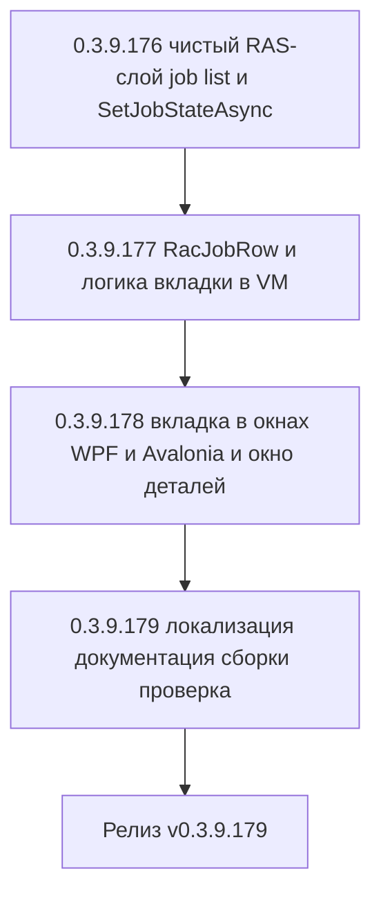

# PLAN — цикл 0.3.9.176–0.3.9.179 — Функция 4: регламентные задания кластера 1С в мониторе серверов (RAS)

Репозиторий [`sivatorov/ConfigurationManagement`](https://github.com/sivatorov/ConfigurationManagement),
локальная копия `f:\Yandex.Disk\h\Configuration_Management`, ветка `main`.
Локальный HEAD — **0.3.9.175** (версия в
[`Configuration Management.csproj`](../Configuration%20Management/Configuration%20Management.csproj:62),
бейдж в [`README.md`](../README.md:3), верхняя запись в [`CHANGELOG.md`](../CHANGELOG.md:12));
в работе циклы журнала регистрации (0.3.9.161–0.3.9.166) и планировщика ОС (0.3.9.167–0.3.9.171).

Режим: Архитектор (план) → задачи-исполнители в режиме **code** (`new_task` по одному на этап).
**Один этап = одна версия = один коммит.** План-файл остаётся untracked (`plans/` в
`.codeassistantignore`); CHANGELOG/README/csproj коммитятся. Это **новая функция** (собственная
дорожная карта, а не обработка открытых issues): комментарии к issues не публикуются; в CHANGELOG
заголовок — «Добавлено». Нумерация цикла стартует с **0.3.9.176** — продолжение после цикла
0.3.9.172–0.3.9.175 (импорт баз из кластера), который зафиксирован в HEAD.

---

## 1. Сводка цикла

| № | Версия | Суть | Приоритет |
|---|--------|------|-----------|
| 1 | 0.3.9.176 | Чистый RAS-слой: модель `RacJobInfo` и `enum RacJobAction` в `Models/RacModels.cs`, парсер `RacOutputParser.ToJobs` (позиционный, минимальный набор колонок, снятие обрамляющих кавычек), методы `IRacClient.GetJobsAsync` (`job list --cluster=`) и `IRacClient.SetJobStateAsync` (`job pause/resume/disable/enable --cluster= --job=`, bool + `LastActionError` по образцу `TerminateSessionAsync`); обновление обоих Fake-клиентов в тестах; тесты | 1 |
| 2 | 0.3.9.177 | Чистая логика вкладки: `ViewModels/RacJobRow.cs` (форматирование, локализация состояния, `DetailsText`), расширение `ServerMonitorViewModel`: коллекция `Jobs`, `SelectedJob`, фильтр по базе (маппинг GUID ИБ → имя через кэшированный `GetInfobasesAsync`), команды `PauseJobCommand`/`ResumeJobCommand` с подтверждением и обработкой `LastActionError`, загрузка заданий в `LoadClusterDataAsync` (параллельно с процессами/сеансами/…); тесты | 1 |
| 3 | 0.3.9.178 | UI обеих платформ: вкладка «Регламентные задания» в `ServerMonitorWindow` (WPF XAML + Avalonia code): таблица, фильтр-ComboBox по базе, кнопки «Приостановить/Возобновить» (с подтверждением), «Детали»; окно `JobDetailsWindow` (WPF + Avalonia); ключи локализации `ServerMonitor.Job.*` в ru/en | 1 |
| 4 | 0.3.9.179 | Документация (CHANGELOG/README/ARCHITECTURE), полные сборки Windows+Linux, ручная проверка сквозного сценария против реального сервера (права администратора, старые rac без job-команд, пустой список) | 2 |



---

## 2. Общие требования к КАЖДОМУ этапу

1. Реализация на обеих платформах (Windows/WPF + Linux/Avalonia), где применимо; чистые
   сервисы/VM — без платформенных зависимостей; платформенные реализации — символы условной
   компиляции (`#if WINDOWS` / `#if LINUX`) или отдельные файлы `*.Avalonia.cs`, как у
   [`ServerMonitorWindow`](../Configuration%20Management/Views/ServerMonitorWindow.Avalonia.cs:1)
   и [`ServerMonitorWindow.xaml.cs`](../Configuration%20Management/Views/ServerMonitorWindow.xaml.cs:1).
2. Инкремент версии в [`Configuration Management.csproj`](../Configuration%20Management/Configuration%20Management.csproj:62)
   (строки 62–65: Version/AssemblyVersion/FileVersion/InformationalVersion) на 1 патч.
3. Запись в [`CHANGELOG.md`](../CHANGELOG.md:12) (сверху, раздел «Добавлено») и обновление
   бейджа версии в [`README.md`](../README.md:3).
4. Тесты: `dotnet test` зелёный и `dotnet build -p:BuildLinux=true` без ошибок.
5. Один коммит (без пуша); без ключевых слов автозакрытия issues. Образец сообщения:
   `0.3.9.176: регламентные задания кластера — RAS-слой job list и управление состоянием`.
6. Все пункты плана перед исполнением сверить с фактическим кодом (адреса строк могут сместиться).
7. **Точный синтаксис команд и состав колонок `rac job list` сверить с документацией RAS/ИТС
   до начала этапа 0.3.9.176** (см. п. 3.1 — парсер спроектирован устойчивым к расхождениям).

---

## 3. Команда rac и модель регламентного задания

### 3.1. Команды rac и формат вывода

Для списка регламентных заданий кластера используется команда

```
rac <host:port> job list --cluster=<uuid>
```

- `<host:port>` — ЕДИНЫЙ токен подключения (порт агента сервера **1540** или RAS **1545**);
  сборка аргументов уже реализована в [`RacClient.BuildArguments`](../Configuration%20Management/Services/RacClient.cs:127);
- `--cluster=<uuid>` — обязателен (как у всех list-команд кластера);
- вывод — таблица с табуляцией, первая строка — заголовок (уже обрабатывается
  [`RacOutputParser.ParseTable`](../Configuration%20Management/Services/RacOutputParser.cs:24)).

Документированный состав колонок `job list` (позиционно, по ИТС; состав может отличаться между
версиями платформы 8.3.x): `cluster`, `job`, `infobase`, `name`, `method-name`, `predefined`,
`schedule`, `state`, `started-at`, `next-start`, `last-start`, `last-end`, `last-success`,
`last-error`, `last-error-descr`, `process`, `replication`, `use-lifetime`, `lifetime-period`,
`lifetime-interval`, `lifetime-percentage`, `result`.

**Решение:** парсер — позиционный, по образцу [`ToSessions`](../Configuration%20Management/Services/RacOutputParser.cs:153):
минимальный набор — первые 3 колонки (`cluster`, `job`, `infobase`); строка заголовка и строки
с невалидным GUID задания пропускаются; отсутствующие колонки справа — значения по умолчанию
(`Col` уже так работает, [`RacOutputParser.cs:346`](../Configuration%20Management/Services/RacOutputParser.cs:346));
лишние колонки игнорируются. Значения `schedule`/`last-error-descr`/`result` могут содержать
пробелы и (в ряде версий rac) обрамляющие двойные кавычки — добавляется приватный метод
`Unquote` (снимает обрамляющие `"` после `Trim()`), применяемый к строковым полям.

Управление состоянием:

```
rac <host:port> job pause  --cluster=<uuid> --job=<uuid>
rac <host:port> job resume --cluster=<uuid> --job=<uuid>
rac <host:port> job disable --cluster=<uuid> --job=<uuid>
rac <host:port> job enable  --cluster=<uuid> --job=<uuid>
```

По соглашению с `session terminate`/`connection disconnect`:
[`RunActionAsync`](../Configuration%20Management/Services/RacClient.cs:149) возвращает `bool`
(ExitCode 0) и текст последней ошибки (stderr rac) в `LastActionError` без проброса исключений.

### 3.2. Новая модель `RacJobInfo` и `RacJobAction`

Добавляется в [`Models/RacModels.cs`](../Configuration%20Management/Models/RacModels.cs:1):

```csharp
public enum RacJobAction { Pause, Resume, Disable, Enable }

public sealed class RacJobInfo
{
    public Guid Id { get; set; }                 // col 1 «job»
    public Guid? InfobaseId { get; set; }        // col 2 «infobase»; null — задание без ИБ
    public string Name { get; set; } = "";       // col 3 «name»
    public string MethodName { get; set; } = ""; // col 4 «method-name»
    public bool Predefined { get; set; }         // col 5 «predefined»
    public string Schedule { get; set; } = "";   // col 6 «schedule» (cron; Unquote)
    public string State { get; set; } = "";      // col 7 «state»: running/scheduled/paused/disabled/interrupted
    public DateTime StartedAt { get; set; }      // col 8 «started-at»
    public DateTime NextStart { get; set; }      // col 9 «next-start»
    public DateTime LastStart { get; set; }      // col 10 «last-start»
    public DateTime LastEnd { get; set; }        // col 11 «last-end»
    public bool LastSuccess { get; set; }        // col 12 «last-success»
    public bool LastError { get; set; }          // col 13 «last-error»
    public string LastErrorDescr { get; set; } = ""; // col 14 «last-error-descr»
    public Guid ProcessId { get; set; }          // col 15 «process»
    public string Result { get; set; } = "";     // последняя колонка «result»
}
```

Парсер `RacOutputParser.ToJobs(string output)` (по образцу `ToSessions`):
`minColumns = 3`; идентификатор задания — `ParseGuid(row[1])`, невалидный → пропуск;
`InfobaseId` — `ParseNullableGuid(Col(row, 2))` (пусто → null);
`Predefined`/`LastSuccess`/`LastError` — `ParseBool` (0/1, true/false);
даты — `ParseDateTime` (формат `yyyy-MM-ddTHH:mm:ss`, уже обрабатывается).

### 3.3. Методы `IRacClient`

Интерфейс [`IRacClient`](../Configuration%20Management/Services/IRacClient.cs:55):

```csharp
Task<IReadOnlyList<RacJobInfo>> GetJobsAsync(
    RacConnectionParams parameters, Guid clusterId,
    CancellationToken cancellationToken = default);

Task<bool> SetJobStateAsync(
    RacConnectionParams parameters, Guid clusterId, Guid jobId, RacJobAction action,
    CancellationToken cancellationToken = default);
```

Реализация в [`RacClient.cs`](../Configuration%20Management/Services/RacClient.cs:90):

```csharp
public async Task<IReadOnlyList<RacJobInfo>> GetJobsAsync(...)
{
    var output = await RunAsync(parameters, ct, "job", "list", $"--cluster={clusterId}").ConfigureAwait(false);
    return RacOutputParser.ToJobs(output);
}

public Task<bool> SetJobStateAsync(...) => RunActionAsync(
    parameters, ct,
    "job",
    action switch
    {
        RacJobAction.Pause => "pause",
        RacJobAction.Resume => "resume",
        RacJobAction.Disable => "disable",
        _ => "enable"
    },
    $"--cluster={clusterId}", $"--job={jobId}");
```

`LastActionError` переиспользуется как есть (уже реализован в `RacClient`).

### 3.4. Маппинг имени базы-владельца

Колонка `infobase` отдаёт UUID ИБ в кластере, а не имя. Для отображения имени базы
переиспользуется **уже реализованный** [`GetInfobasesAsync`](../Configuration%20Management/Services/RacClient.cs:91)
(`infobase summary list`): VM кэширует словарь `GUID → имя базы` на выбранный кластер
(инвалидируется при смене кластера/подключения) и подставляет имена в строки. Задания без ИБ
(`InfobaseId == null` или GUID не найден в словаре) показывают «—» (задание кластера/без базы).
Сбой `GetInfobasesAsync` не роняет вкладку: маппинг просто остаётся пустым (имена «—»),
ошибка попадает в `StatusText` (см. риск п. 6).

---

## 4. Вкладка «Регламентные задания» в мониторе серверов

### 4.1. Сценарий

1. Пользователь открывает «Серверы 1С» (CTRL+ALT+S), подключается и выбирает кластер —
   привычный поток монитора не меняется; задания грузятся параллельно с остальными данными.
2. Вкладка **«Регламентные задания»** (после «Блокировки», перед «Информация о кластере»):
   таблица со строками [`RacJobRow`](#43-строка-racjobrow) + панель фильтра по базе
   (ComboBox: «Все базы» + имена из маппинга п. 3.4) + кнопки
   **«Приостановить»**, **«Возобновить»**, **«Детали»**.
3. **Приостановить/Возобновить**: выбор строки → подтверждение
   (`ServerMonitor.Job.PauseConfirmFormat` / `.ResumeConfirmFormat`) → `SetJobStateAsync`
   → при неудаче предупреждение с `LastActionError` (stderr rac), при успехе — статус-строка
   → `Refresh()` (список перечитывается, состояние обновляется). Паттерн повторяет
   [`TerminateSessionAsync`](../Configuration%20Management/ViewModels/ServerMonitorViewModel.cs:336).
4. **Детали**: кнопка «Детали» в code-behind окна открывает
   [`JobDetailsWindow`](#44-окна) с текстом `SelectedJob.DetailsText` (моноширинный текст,
   «ключ: значение» построчно, включая `schedule`, `last-error-descr`, `result`).
5. Автообновление раз в 5 с и ручное «Обновить» перечитывают задания вместе с остальными
   данными; выбранная строка сохраняется по `Id`, фильтр по базе сохраняется.

### 4.2. Расширение `ServerMonitorViewModel`

Чистый .NET (обе платформы), без новых зависимостей. Добавляется:

- `ObservableCollection<RacJobRow> Jobs` + `ObservableCollection<RacJobRow> FilteredJobs`
  (таблица биндится к `FilteredJobs`);
- `SelectedJob` (сохраняется по `Id` при перезагрузке, как `SelectedSession`);
- фильтр: `JobInfobaseFilterRows` (`IReadOnlyList<RacJobFilterRow>`: «Все базы» с `Id == null`
  + записи из словаря имён), `SelectedJobInfobaseId` (`Guid?`; смена → `ApplyJobFilter()`);
- кэш `Dictionary<Guid, string> _infobaseNames` (заполняется из `GetInfobasesAsync` на каждый
  загруженный кластер; инвалидируется при смене кластера);
- команды `PauseJobCommand` / `ResumeJobCommand` → методы `PauseSelectedJobAsync()` /
  `ResumeSelectedJobAsync()`: guard по `HasConnected`/`SelectedClusterId`/`SelectedJob`,
  подтверждение, `SetJobStateAsync`, обработка `false` через `LastActionError`
  ([`BuildActionError`](../Configuration%20Management/ViewModels/ServerMonitorViewModel.cs:553)),
  `finally Refresh()`; переиспользуются существующие `TryEnterBusy`/`ExitBusy`;
- `LoadClusterDataAsync` дополняется `jobsTask = _rac.GetJobsAsync(...)` и
  `infobasesTask = _rac.GetInfobasesAsync(...)` в `Task.WhenAll` (п. 3.4);
  `ApplyClusterData` принимает `jobs` и `infobaseNames`; после `ReplaceRows(Jobs, …)`
  вызывается `ApplyJobFilter()` и восстановление `SelectedJob` по `Id`;
- статус-строка: ключ `ServerMonitor.Status.LoadedFormat` расширяется пятым параметром
  «· заданий: {4}» (обновить ru/en; текущий тест проверяет только `NotEmpty` — безопасно);
- пустой список: `ServerMonitor.Empty.Jobs` с подсказкой про права администратора кластера
  (показывается над таблицей при `Jobs.Count == 0`).

### 4.3. Строка `RacJobRow`

`ViewModels/RacJobRow.cs` (по образцу [`RacSessionRow.cs`](../Configuration%20Management/ViewModels/RacSessionRow.cs:1)):

- `Id` (Guid), `InfobaseId` (`Guid?`), `InfobaseName` (имя из маппинга или «—»);
- `Name`, `MethodName`, `PredefinedText` («Да»/«Нет», ключи `Common.Yes/No`);
- `Schedule` (cron-строка, пустая → «—»);
- `State` (raw) и `StateText` (локализованный, ключи `ServerMonitor.Job.State.*`:
  running/scheduled/paused/disabled/interrupted), `StateColorHex`
  (зелёный — running, синий — scheduled, жёлтый — paused, серый — disabled);
- `StartedAtText`, `NextStartText`, `LastStartText`, `LastEndText` (формат
  `dd.MM.yyyy HH:mm:ss`, `default` → «—», как в `RacSessionRow`);
- `LastSuccessText` («Да»/«Нет»/«—» при `!LastSuccess && !LastError` и пустых датах);
- `ResultText` (обрезанный до ~80 символов с «…», полный — в деталях);
- `CanPause` / `CanResume` (для энаблинга кнопок: Pause при `state` не `paused`/`disabled`;
  Resume только при `state == "paused"`);
- `DetailsText` — чистый метод построения многострочного «ключ: значение» (все поля модели +
  имя базы); тестируется.

### 4.4. Окна

- **WPF** [`ServerMonitorWindow.xaml`](../Configuration%20Management/Views/ServerMonitorWindow.xaml:100):
  новый `TabItem` после «Блокировки» (≈строка 322): верхняя панель — ComboBox фильтра
  (`ItemsSource=JobInfobaseFilterRows`, `DisplayMemberPath=DisplayText`,
  `SelectedValuePath=Id`, `SelectedValue=SelectedJobInfobaseId`) + кнопки «Приостановить»/
  «Возобновить»/«Детали» (Click-обработчики в code-behind, как `OnTerminateSession_Click`);
  `DataGrid x:Name="JobsGrid"` (колонки: Имя, База, Метод, Расписание, Состояние,
  Следующий запуск, Последний запуск, Результат, Предопределённое) →
  `JobsGrid.ItemsSource = _vm.FilteredJobs`, `SelectedItem = SelectedJob` — в конструкторе
  [`ServerMonitorWindow.xaml.cs:39`](../Configuration%20Management/Views/ServerMonitorWindow.xaml.cs:39);
  code-behind «Детали»: `new JobDetailsWindow(_vm.SelectedJob?.DetailsText ?? "").ShowDialog()`.
- **Avalonia** [`ServerMonitorWindow.Avalonia.cs`](../Configuration%20Management/Views/ServerMonitorWindow.Avalonia.cs:127):
  `tabs.Items.Add(new TabItem { Header = LocalizationManager.T("ServerMonitor.Tabs.Jobs"), … })`
  с панелью фильтра (`ComboBox` + `BuildJobFilterRow`) и кнопками через `BuildActionButton`
  и `BuildTabWithAction`; `BuildJobRow` по образцу `BuildSessionRow` (Grid + `CellText`);
  фильтр-ComboBox пишет `_vm.SelectedJobInfobaseId` по событию `SelectionChanged`.
- **`JobDetailsWindow`** — тонкое окно-просмотр текста (по образцу вкладки «Информация о
  кластере»): WPF `Views/JobDetailsWindow.xaml` + `.xaml.cs` (`ScrollViewer` + `TextBlock`
  Consolas, кнопка «Закрыть»); Linux `Views/JobDetailsWindow.Avalonia.cs` (`#if LINUX`).
  VM не требуется: конструктор принимает готовый текст. Входит в этап 0.3.9.178.

---

## 5. Таблица декомпозиции задач

| № | Версия | Файлы (новые/изменяемые) | Тесты | Риски и митигации |
|---|--------|--------------------------|-------|-------------------|
| 1 | 0.3.9.176 | **Edit:** `Models/RacModels.cs` (+`RacJobInfo`, `RacJobAction`), `Services/IRacClient.cs` (+`GetJobsAsync`, `SetJobStateAsync`), `Services/RacClient.cs` (+реализации: `job list`, `job pause/resume/disable/enable`), `Services/RacOutputParser.cs` (+`ToJobs`, приватный `Unquote`). **Edit (компиляция):** `ConfigurationManagement.Tests/ServerMonitorViewModelTests.cs` и `ConfigurationManagement.Tests/ClusterImportViewModelTests.cs` — оба `FakeRacClient` получают новые члены (заглушки/данные) | `RacOutputParserTests`: `ToJobs` — пустой вывод, только заголовок, типовая строка (полный набор колонок), неполный вывод (3–7 колонок), невалидный GUID job → пропуск, `schedule`/`result` с обрамляющими кавычками и пробелами (Unquote), `infobase` пустая → null, кириллица/пробелы в `name`/`method-name`, даты и 0/1-флаги. `RacClientTests`: `BuildArguments` для `job list` (с `--cluster=`), `job pause/resume/disable/enable` (порядок: команда, `--cluster=`, `--job=`) | Чистые функции — низкий. Разный состав колонок между версиями платформы → минимальный набор 3, лишние справа игнорируются; точный состав сверяется с ИТС перед реализацией (п. 2.7). Задание без ИБ (`infobase` пустая) — `InfobaseId = null` |
| 2 | 0.3.9.177 | **New:** `ViewModels/RacJobRow.cs` (чистый, обе платформы: форматирование, `StateText`, `StateColorHex`, `CanPause/CanResume`, `DetailsText`, `ResultText`). **Edit:** `ViewModels/ServerMonitorViewModel.cs` (Jobs/FilteredJobs/SelectedJob, фильтр по базе с кэшем имён, Pause/Resume-команды, расширение `LoadClusterDataAsync`/`ApplyClusterData`/`ApplyJobFilter`, статус `LoadedFormat` с 5 параметрами) | `ServerMonitorViewModelTests` (расширение `FakeRacClient` данными заданий): загрузка заполняет `Jobs` и `FilteredJobs`; выбор сохраняется по Id после перезагрузки; фильтр по базе отсекает чужие строки, «Все базы» возвращает все; задания без ИБ показываются всегда; Pause с подтверждением вызывает `SetJobStateAsync(Pause, jobId)` и Refresh; Resume — только для paused; отказ действия (`actionFails`) → Warning с `LastActionError`, списки перечитаны; `throwOnAction` → Warning, окно живо; автообновление не роняет фильтр. `RacJobRowTests` (в `RacOutputParserTests` или отдельный файл): `DetailsText` содержит все ключевые поля, `StateText` локализован, `ResultText` обрезается | Асинхронные гонки (смена кластера во время загрузки) → существующий `TryEnterBusy` + сверка `SelectedClusterId` после await (паттерн уже есть). Сбой `GetInfobasesAsync` → маппинг пуст, имена «—», ошибка только в статусе. Ключ `LoadedFormat` меняется → обновить ru/en синхронно с кодом |
| 3 | 0.3.9.178 | **New:** `Views/JobDetailsWindow.xaml`+`.xaml.cs` (WPF), `Views/JobDetailsWindow.Avalonia.cs` (Linux). **Edit:** `Views/ServerMonitorWindow.xaml` (TabItem «Регламентные задания», фильтр, кнопки, `JobsGrid`), `Views/ServerMonitorWindow.xaml.cs` (ItemsSource, SelectedItem, обработчики Pause/Resume/Details), `Views/ServerMonitorWindow.Avalonia.cs` (вкладка, фильтр, `BuildJobRow`, кнопки, детали), `Localization/Languages/ru.json` + `en.json` (ключи `ServerMonitor.Job.*` и `ServerMonitor.Tabs.Jobs`), `Configuration Management.csproj` (подключение `JobDetailsWindow.xaml` в WPF-ветку при необходимости) | Логика уже покрыта этапом 2; здесь — регрессия `ServerMonitorViewModelTests`/`RacClientTests` и сборки обеих платформ. Ручной чек: вкладка открывается, фильтр работает, подтверждение pause/resume, окно деталей показывает все поля, пустой список показывает hint | Разные жизненные циклы окон → тонкие обёртки, вся логика в общем VM/`RacJobRow`. Кнопки энаблятся через `CanPause/CanResume` (событие PropertyChanged у VM при смене `SelectedJob`). Утечка таймера/событий → `Closed += _vm.Dispose()` уже есть; фильтр-ComboBox не удерживает ссылки |
| 4 | 0.3.9.179 | **Edit:** `CHANGELOG.md`, `README.md` (бейдж + раздел возможностей), `ARCHITECTURE.md` (RAS-слой: `job list`/`SetJobStateAsync`); полные сборки Windows (WPF) и Linux (Avalonia) | Ручная проверка против реального сервера: подключение к RAS (1545) и ragent (1540) с правами администратора → задания видны; pause → state=paused → resume → state=scheduled; без прав → пустой список с hint (или ошибка rac); старый rac без job-команд → понятная ошибка (stderr как есть, см. риск п. 6); пустой кластер без заданий; автообновление 5 с | Различия версий платформ в полях `state`/`schedule` → парсер терпимый, неизвестное состояние показывается сырым текстом. Локализованный stderr rac → показываем как есть (устоявшееся решение проекта) |

---

## 6. Риски (сводно) и митигации

| Риск | Митигация |
|------|-----------|
| Разный состав колонок `job list` между версиями платформы 8.3.x (в т.ч. отсутствие `result`/`schedule` в старых версиях) | Позиционный парсер с минимальным набором 3 колонки; отсутствующие справа — default (пусто/«—»); лишние — игнорируются; перед этапом 0.3.9.176 синтаксис сверяется с ИТС |
| Значения `schedule`/`result`/`last-error-descr` содержат пробелы и обрамляющие кавычки | `Unquote` для строковых полей; таблица раc разбивается по `\t` без потери пробелов (уже так в `ParseTable`) |
| Старые версии rac/платформы без поддержки `job`-команд | `RacClientException` с ненулевым кодом выхода и текстом stderr; UI показывает текст ошибки как есть + статус «Не удалось загрузить задания»; для `SetJobStateAsync` — `false` + `LastActionError` |
| Задания видны только администратору кластера; без прав rac молча не возвращает их | Пустой список → hint `ServerMonitor.Empty.Jobs` про права администратора; ошибка rac → показывается текст ошибки |
| `infobase` отдаёт UUID, а не имя базы | Маппинг через кэшированный `GetInfobasesAsync` (переиспользование функции 3); сбой маппинга не роняет вкладку (имена «—»); GUID показывается только в деталях |
| Гонки: смена кластера/действие во время автозагрузки | Существующие `TryEnterBusy`/`ExitBusy`; после `await` сверка актуальности `SelectedClusterId`; выбор и фильтр сохраняются по Id |
| Изменение ключа `ServerMonitor.Status.LoadedFormat` (добавлен 5-й параметр) | ru/en обновляются в том же коммите; существующий тест проверяет только `NotEmpty` |
| Дополнительный rac-вызов на каждое автообновление (`GetInfobasesAsync`) | Вызовы выполняются параллельно (`Task.WhenAll`), таймаут 30 с уже есть; результат кэшируется до смены кластера |
| Большой кластер: сотни заданий | DataGrid/ListBox с виртуализацией (как у процессов/сеансов); загрузка асинхронно с `IsBusy` |

---

## 7. Локализация (новые ключи, ru/en)

- `ServerMonitor.Tabs.Jobs` — «Регламентные задания» / «Scheduled jobs»;
- `ServerMonitor.Columns.Job.Name` («Имя»), `.Infobase` («База»), `.Method` («Метод»),
  `.Schedule` («Расписание»), `.State` («Состояние»), `.Predefined` («Предопределённое»),
  `.NextStart` («Следующий запуск»), `.LastStart` («Последний запуск»),
  `.LastSuccess` («Успех»), `.Result` («Результат»);
- `ServerMonitor.Job.State.Running` / `.Scheduled` / `.Paused` / `.Disabled` / `.Interrupted`
  («Выполняется» / «Запланировано» / «Приостановлено» / «Снято с расписания» / «Прервано»);
- `ServerMonitor.PauseJob` («Приостановить»), `ServerMonitor.ResumeJob` («Возобновить»),
  `ServerMonitor.JobDetails` («Детали»);
- `ServerMonitor.Job.PauseConfirmFormat` — «Приостановить выполнение задания «{0}»?»,
  `ServerMonitor.Job.ResumeConfirmFormat` — «Возобновить выполнение задания «{0}»?»;
- `ServerMonitor.Job.PauseTitle` / `.ResumeTitle`, `ServerMonitor.Job.PauseFailedFormat` /
  `.ResumeFailedFormat` — «Не удалось приостановить задание «{0}».» / «Не удалось возобновить
  задание «{0}».»;
- `ServerMonitor.Job.Status.PausedFormat` / `.ResumedFormat` — «Задание «{0}» приостановлено.» /
  «Задание «{0}» возобновлено.»;
- `ServerMonitor.Empty.Jobs` — «Регламентных заданий не найдено. Задания кластера видны только
  администратору кластера.»;
- `ServerMonitor.Job.UnknownBase` — «—» (задание без базы/база не распознана);
- `ServerMonitor.JobDetails.Title` — «Детали регламентного задания».

---

## 8. Порядок исполнения

1. Утвердить план (режим Architect).
2. `new_task` (режим **code**) на 0.3.9.176 → … → 0.3.9.179 последовательно; каждый этап —
   отдельная версия/коммит с CHANGELOG/README/бейджем, `dotnet test` + Linux-сборка.
3. До старта 0.3.9.176 исполнитель сверяет синтаксис `job list`/`job pause/resume/disable/enable`
   с документацией RAS/ИТС и при расхождении корректирует позиции колонок парсера (риск п. 6).
4. После 0.3.9.179 — сквозная проверка по п. 4 этапа 4 и финальный релиз-ноут.

---

## 9. Что сознательно НЕ входит в цикл

- Изменение расписания заданий (`schedule set` / редактирование cron-строки) — только просмотр
  расписания в таблице и деталях.
- Выполнение задания «вручную» (`job start`) — нет команды в рамках этой функции.
- Запуск/остановка заданий по расписанию для пользовательских ИБ через консоль управления —
  только операции pause/resume (UI) и disable/enable (доступны в API `SetJobStateAsync`,
  кнопки в UI не добавляются в этом цикле).
- Фильтр по методу/состоянию (только по базе) и поиск по имени задания.
- Отображение истории запусков глубже одного последнего запуска (`last-start`/`last-end`/`result`).
- Изменение прав/учётных записей администратора кластера и сохранение пароля на диск.