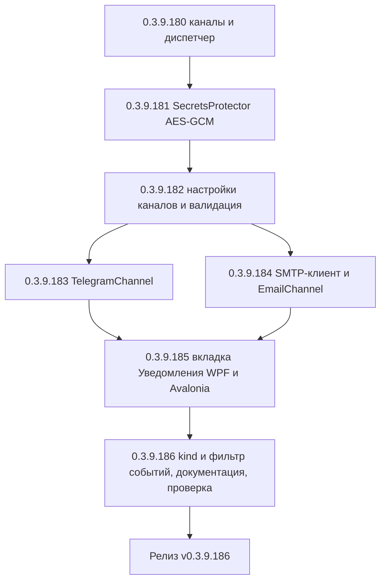

# PLAN — цикл 0.3.9.180–0.3.9.186 — Функция 5: уведомления о результатах задач в Telegram / по email

Репозиторий [`sivatorov/ConfigurationManagement`](https://github.com/sivatorov/ConfigurationManagement),
локальная копия `f:\Yandex.Disk\h\Configuration_Management`, ветка `main`.
Локальный HEAD — **0.3.9.179** (версия в
[`Configuration Management.csproj`](../Configuration%20Management/Configuration%20Management.csproj:62),
бейдж в [`README.md`](../README.md:3), верхняя запись в [`CHANGELOG.md`](../CHANGELOG.md:12));
в работе циклы журнала регистрации (0.3.9.161–0.3.9.166) и планировщика ОС (0.3.9.167–0.3.9.171).
Новый цикл стартует **после их завершения**; нумерация может сместиться на фактический HEAD —
перед стартом первого этапа исполнитель сверяет версию в csproj (риск п. 6).

Режим: Архитектор (план) → задачи-исполнители в режиме **code** (`new_task` по одному на этап).
**Один этап = одна версия = один коммит.** План-файл остаётся untracked (`plans/` в
`.codeassistantignore`); CHANGELOG/README/csproj коммитятся. Это **новая функция** (собственная
дорожная карта): комментарии к issues не публикуются; в CHANGELOG заголовок — «Добавлено».

---

## 1. Сводка цикла

| № | Версия | Суть | Приоритет |
|---|--------|------|-----------|
| 1 | 0.3.9.180 | Инфраструктура мультиканальности: `NotificationKind`, `NotificationMessage`, `INotificationChannel`, `NotificationDispatcher` (реализует расширенный `INotificationService`), рефакторинг `NotificationService.Windows/Linux` → `SystemNotificationChannel`, DI; поведение точек вызова не меняется (kind=Info). Тесты диспетчера | 1 |
| 2 | 0.3.9.181 | Безопасное хранение секретов: `SecretsProtector` (AES-GCM + ключ-файл `secrets.key` в каталоге данных профиля), интеграция в `AppSettings` (поля хранят `encv1:`-шифртекст) и репозиторий настроек; тесты | 1 |
| 3 | 0.3.9.182 | Модель настроек каналов: новые поля `AppSettings` (Telegram/SMTP/события), свойства и персист в `MainViewModel`, конфигурации каналов `TelegramChannelOptions`/`EmailChannelOptions`, валидация, дополнение `SensitiveDataMasker`; тесты маппинга/валидации | 1 |
| 4 | 0.3.9.183 | `TelegramChannel`: HTTP API `sendMessage`, MarkdownV2 (escape + обрезка 4096), ретраи (429/5xx/сеть), `getMe`+тестовая отправка для «Проверить подключение»; тесты с фейковым `HttpMessageHandler` | 1 |
| 5 | 0.3.9.184 | Собственный лёгкий SMTP-клиент + `EmailChannel`: TcpClient/SslStream, SMTPS (465) и STARTTLS (587), AUTH PLAIN/LOGIN, text/plain UTF-8 (base64), dot-stuffing, таймауты, ретраи, тестовая отправка; тесты с фейковым TCP SMTP-сервером | 1 |
| 6 | 0.3.9.185 | UI: вкладка «Уведомления» в окне настроек (WPF + Avalonia): поля каналов, PasswordBox, выбор событий, кнопки «Проверить подключение» (async), валидация при сохранении; локализация ru/en | 1 |
| 7 | 0.3.9.186 | Вид события (Success/Error/Info) во всех точках вызова + фильтр событий `NotifyOn*`, документация (CHANGELOG/README/ARCHITECTURE), полные сборки Windows+Linux, сквозная ручная проверка | 2 |



---

## 2. Общие требования к КАЖДОМУ этапу

1. Реализация на обеих платформах (Windows/WPF + Linux/Avalonia), где применимо; чистые
   сервисы/VM — без платформенных зависимостей; платформенные реализации — символы условной
   компиляции (`#if WINDOWS` / `#if LINUX`) или отдельные файлы `*.Avalonia.cs`, как у
   [`NotificationService.Windows.cs`](../Configuration%20Management/Services/NotificationService.Windows.cs:1)
   и [`NotificationService.Linux.cs`](../Configuration%20Management/Services/NotificationService.Linux.cs:1).
2. Инкремент версии в [`Configuration Management.csproj`](../Configuration%20Management/Configuration%20Management.csproj:62)
   (строки 62–65: Version/AssemblyVersion/FileVersion/InformationalVersion) на 1 патч.
3. Запись в [`CHANGELOG.md`](../CHANGELOG.md:12) (сверху, раздел «Добавлено») и обновление
   бейджа версии в [`README.md`](../README.md:3).
4. Тесты: `dotnet test` зелёный и `dotnet build -p:BuildLinux=true` без ошибок.
5. Один коммит (без пуша); без ключевых слов автозакрытия issues. Образец сообщения:
   `0.3.9.180: уведомления в Telegram и по email — мультиканальный диспетчер`.
6. Все пункты плана перед исполнением сверить с фактическим кодом (адреса строк могут сместиться;
   циклы 0.3.9.161–171 ещё в работе и могут затронуть `SettingsWindow`/`MainViewModel`).
7. **Решение по SMTP принято: собственный лёгкий клиент без новых NuGet-зависимостей**
   (обоснование в п. 3.3). Если на этапе 0.3.9.184 стабильность не будет достигнута —
   зафиксировать и согласовать замену на MailKit (риск п. 6).

---

## 3. Дизайн

### 3.1. Абстракция каналов и диспетчер

Новые типы в `Services/` (чистый .NET, обе платформы):

```csharp
// Services/NotificationModels.cs
public enum NotificationKind { Info, Success, Warning, Error }

/// <summary>Категория события-источника (для фильтра NotifyOn*).</summary>
public enum NotificationEvent { Backup, ScheduledTask, Update, ManualTest }

public sealed class NotificationMessage
{
    public string Title { get; init; } = "";
    public string Message { get; init; } = "";
    public NotificationKind Kind { get; init; } = NotificationKind.Info;
    public NotificationEvent Event { get; init; } = NotificationEvent.ManualTest;
    /// <summary>UTC-метка события (для шапки письма и логов).</summary>
    public DateTimeOffset UtcTimestamp { get; init; } = DateTimeOffset.UtcNow;
}

// Services/INotificationChannel.cs
public interface INotificationChannel
{
    string Name { get; }
    /// <summary>true — канал включён и сконфигурирован (по текущим настройкам).</summary>
    bool IsEnabled(AppSettings settings);
    /// <summary>Отправляет сообщение. false — канал не смог отправить (диспетчер логирует).</summary>
    Task<bool> SendAsync(NotificationMessage message, CancellationToken ct = default);
}
```

`INotificationService` расширяется (сохраняя совместимость существующих вызовов):

```csharp
// Services/INotificationService.cs (редактируется)
public interface INotificationService
{
    /// <summary>Fire-and-forget, kind = Info (совместимость: старые точки вызова).</summary>
    void Show(string title, string message);

    /// <summary>Fire-and-forget с видом события и категорией (новые/обновлённые вызовы).</summary>
    void Show(string title, string message, NotificationKind kind,
              NotificationEvent evt = NotificationEvent.ManualTest);
}
```

**`NotificationDispatcher : INotificationService`** — единственная регистрация интерфейса
(`AppServices.cs:89` меняется на `AddSingleton<INotificationService, NotificationDispatcher>()`).
В конструкторе получает `IEnumerable<INotificationChannel>` (DI, множественная регистрация) и
`IAppLogger`. Логика:

- `Show(title, message)` → `Show(title, message, Info, ManualTest)` fire-and-forget
  (`Task.Run`-обёртки не требуется: сам диспетчер полностью async, вызывающий поток не блокируется);
- `Show(title, message, kind, evt)` → внутри `SendCoreAsync`:
  1. читает `AppSettings` через `IInfobaseRepository.LoadSettings()` (по образцу
     [`NotificationService.Windows.cs:34`](../Configuration%20Management/Services/NotificationService.Windows.cs:34));
  2. для системного канала учитывает `ShowSystemNotifications`, для внешних — `evt`
     против фильтров `NotifyOnBackup/NotifyOnScheduledTasks/NotifyOnUpdates`
     (`ManualTest` пропускается всегда);
  3. включённые каналы отправляют **параллельно** через `Task.WhenAll`, каждый — со своими
     ретраями (`SendWithRetryAsync`, maxAttempts = 3, backoff 2 c/4 c, retry только для
     транзиентных ошибок — см. п. 3.2/3.3);
  4. ошибки канала не всплывают наружу: логируются через `IAppLogger` с маскированием
     (`SensitiveDataMasker`), fire-and-forget-исключения гасятся (паттерн уже есть в
     [`MainViewModel.Backup.cs:126`](../Configuration%20Management/ViewModels/MainViewModel.Backup.cs:126)).

Ретраи инкапсулируются в каждом канале (у них разная семантика ошибок), а не в диспетчере —
диспетчер только оркестрирует и не дублирует ретраи. Все async-пути используют
`ConfigureAwait(false)` — планировщик заданий вызывает `Show` из синхронного `Tick()`
([`SchedulerService.cs:173`](../Configuration%20Management/Services/SchedulerService.cs:173)),
но диспетчер не выполняет блокирующих ожиданий, поэтому блокировки нет.

### 3.2. TelegramChannel

Файл `Services/TelegramChannel.cs` (обе платформы; в DI — `AddSingleton<INotificationChannel, TelegramChannel>()`).

- Статический `HttpClient` по образцу [`GitHubReleaseService.cs:36`](../Configuration%20Management/Services/GitHubReleaseService.cs:36):
  `Timeout = 15 с`, User-Agent `ConfigurationManagement/1.0`.
- URL: `https://api.telegram.org/bot{token}/sendMessage` и `/getMe`. Токен **не пишется в логи**:
  ошибки логируются статусом/`error_code`/`description` ответа (API не возвращает токен),
  при исключениях сети — только тип исключения; дополнительно
  `SensitiveDataMasker.MaskTelegramToken` страхует тексты с URL.
- Запрос: `POST`, JSON (`chat_id`, `text`, `parse_mode = "MarkdownV2"`, `disable_web_page_preview = true`).
  `System.Net.Http.Json` (встроен, как `JsonDocument` в GitHubReleaseService).
- `chat_id`: парсинг строки `TelegramChatIds` («123456789, -100111222333, @mychannel») —
  числа без знака/со знаком отправляются числом, `@username` — строкой; пустые элементы
  отбрасываются. Пустой список при включённом канале → `IsEnabled = false` (+ предупреждение при проверке).
- Текст: форматтер `TelegramTextFormatter` (чистый, тестируемый):
  - escape MarkdownV2: символы `_ * [ ] ( ) ~ \` > # + - = | { } . !` экранируются `\`;
  - обрезка: при длине > 4096 — обрезка до 4060 символов + `"\n…(обрезано)"`;
  - спецсимволы переноса строк/табов не трогаются.
- Ретраи: `HttpRequestException`, `TaskCanceledException` (таймаут), HTTP 429 (Retry-After или
  фикс. 2 c), 500/502/503/504. Не ретраятся: 400/401/403/404 (ошибка конфигурации).
- Проверка подключения: `SendTestAsync(token, chatIds)` — `getMe` (валидирует токен) + отправка
  тестового сообщения первому получателю (`Settings.Notifications.TestMessageTitle/Text`).
  Возвращает результат с локализованным описанием для UI (внутри — try/catch, наружу без исключений).

### 3.3. SMTP-клиент и EmailChannel (решение)

**Почему не System.Net.Mail:** класс [`SmtpClient` устарел](https://learn.microsoft.com/dotnet/api/system.net.mail.smtpclient)
(объявлен устаревшим ещё в .NET 6, рекомендация — не использовать в новой разработке), не имеет
современного async-дизайна, плохо тестируется, на Linux ведёт себя непредсказуемо.

**Почему не MailKit:** MailKit/MimeKit добавляют цепочку транзитивных зависимостей
(BouncyCastle.Cryptography, System.*-примитивы), что противоречит подходу проекта — сознательно
минимальному набору пакетов ([csproj](../Configuration%20Management/Configuration%20Management.csproj:120):
только DI + Sqlite) и single-file publish с компрессией. Требования к письмам минимальны:
одно простое текстовое письмо без вложений и HTML.

**Решение: собственный лёгкий SMTP-клиент** — `Services/Smtp/SmtpClientLite.cs` + `SmtpMessageBuilder.cs`,
поверх `TcpClient`/`SslStream` (System.Net.Sockets, встроен в обе платформы):

- режимы: **SMTPS** (implicit TLS, порт 465) и **STARTTLS** (587; если сервер не объявил STARTTLS —
  разрешено продолжение без TLS только при явной настройке `SmtpEncryption = None`);
- команды: `EHLO <hostname>`, `MAIL FROM:<sender>`, `RCPT TO:<recipient>` (цикл по получателям),
  `DATA` … `.`, `QUIT`; dot-stuffing (строки, начинающиеся с `.`, дублируются);
- аутентификация: `AUTH PLAIN` (base64 `\0login\0password`) и `AUTH LOGIN` (два base64-обмена);
  выбирается по списку возможностей из ответа EHLO; при отсутствии AUTH — только открытый релей;
- письмо: `From/To/Subject/Date/Message-ID/MIME-Version/Content-Type: text/plain; charset=utf-8`,
  тело и subject — **UTF-8 base64** (кириллица), `Content-Transfer-Encoding: base64`;
- таймауты: на установку соединения 15 c, на чтение/запись строки 15 c (собственный
  `NetworkStream.ReadTimeout/WriteTimeout` + `CancellationToken`);
- ошибки: ответы сервера с кодами 4xx/5xx → `SmtpProtocolException` с текстом ответа (пароль
  маскируется `SensitiveDataMasker.MaskSmtpPassword` — в ответах сервера его нет, но страховка
  на пересылку команд в лог), сетевые сбои → ретрай в канале (до 3 попыток, backoff 2/4 c);
- тестовая отправка для «Проверить подключение»: полная сессия + отправка тестового письма
  первому получателю.

`EmailChannel` (`Services/EmailChannel.cs`): берёт `EmailChannelOptions` из настроек, строит
`SmtpMessageBuilder` (Subject = `Title` с обрезкой до 120 символов, Body = `Message` + служебный
блок «Приложение / событие / дата»), отправляет через `SmtpClientLite` всем получателям
(последовательно в одной сессии — `RCPT TO` по каждому).

### 3.4. Безопасное хранение секретов

`Services/SecretsProtector.cs` (обе платформы, чистый .NET, встроенный `System.Security.Cryptography.AesGcm`):

- 32-байтный ключ хранится в файле **`secrets.key`** в каталоге данных активного профиля
  (рядом с `settings.json`, [`InfobaseRepository.DataDirectory`](../Configuration%20Management/Services/InfobaseRepository.cs:72);
  путь через `PlatformPaths.AppDataDirectory`/профиль, как у `ProfileService`). На Linux после
  создания файлу выставляются права 600 (`File.SetUnixFileMode`), на Windows — обычный файл
  в каталоге пользователя.
- **Почему не DPAPI:** `ProtectedData` доступен только на Windows и привязывает секреты к
  машине/пользователю — ломает перенос каталога данных (портативный/переносимый сценарий,
  который проект поддерживает через `_explicitDirectory`) и требует двух реализаций. Единый
  ключ-файл работает одинаково на обеих платформах и переносится вместе с каталогом данных.
- Формат значения в `settings.json`: префикс **`encv1:`** + `Base64(iv | ciphertext | tag)`.
  Пустая строка / строка без префикса (легаси) трактуется как «не настроено».
- `Unprotect` при отсутствии/повреждении ключа или шифртекста возвращает `null` (не бросает);
  UI показывает поле пустым + предупреждение «секрет не может быть расшифрован — введите заново».
- Секреты: `TelegramBotToken`, `SmtpPassword`. Все остальные настройки — обычный plain-JSON
  (как сейчас). `PasswordHasher` (PBKDF2) для этого не подходит — он необратим.

### 3.5. Настройки (AppSettings)

Добавляются в [`Models/AppSettings.cs`](../Configuration%20Management/Models/AppSettings.cs)
(аддитивно, `SchemaVersion` НЕ увеличивается — десериализация старых файлов даёт дефолты):

```csharp
// --- Уведомления в Telegram (функция 5) ---
public bool TelegramNotificationsEnabled { get; set; }          // default false
public string TelegramBotToken { get; set; } = "";              // encv1:… (секрет)
public string TelegramChatIds { get; set; } = "";               // "123, -1001…, @channel"

// --- Уведомления по email (функция 5) ---
public bool EmailNotificationsEnabled { get; set; }             // default false
public string SmtpServer { get; set; } = "";
public int SmtpPort { get; set; } = 587;
public bool SmtpUseSsl { get; set; } = true;                    // true: STARTTLS/465, false: без TLS
public string SmtpLogin { get; set; } = "";
public string SmtpPassword { get; set; } = "";                  // encv1:… (секрет)
public string SmtpSender { get; set; } = "";                    // пусто → SmtpLogin
public string EmailRecipients { get; set; } = "";               // "a@x.ru, b@y.ru"

// --- Какие события отправлять во внешние каналы ---
public bool NotifyOnBackup { get; set; } = true;
public bool NotifyOnScheduledTasks { get; set; } = true;
public bool NotifyOnUpdates { get; set; } = true;
```

`MainViewModel` получает пары свойств с `SetProperty` + `ScheduleSaveSettings()` по образцу
[`MainViewModel.Commands.cs:1113`](../Configuration%20Management/ViewModels/MainViewModel.Commands.cs:1113).
Секреты в VM держатся как рабочие строки; **перед** `SaveSettingsSafe()` значения защищаются
через `SecretsProtector` (пустая строка не шифруется — сохраняется пустой).

**Валидация** (`Services/NotificationSettingsValidator.cs`, чистый, тестируемый; вызывается при
сохранении вкладки и перед «Проверить подключение»):

- Telegram: при `Enabled` — непустой токен (формат `\d+:[A-Za-z0-9_-]{30,}`), хотя бы один chat_id;
- Email: при `Enabled` — непустой сервер, порт 1–65535, корректный `SmtpSender`/`SmtpLogin`
  (email-формат, `MailAddress.TryCreate`), хотя бы один валидный получатель;
- предупреждение (не блокер): все три `NotifyOn*` выключены при включённых каналах.

### 3.6. Диспетчер-реализация точек вызова

| Точка вызова | Сейчас | Станет |
|--------------|--------|--------|
| [`MainViewModel.Backup.cs:128`](../Configuration%20Management/ViewModels/MainViewModel.Backup.cs:128) | `Show(title, msg)` | `Show(title, msg, Success/Error, Backup)` |
| [`MainViewModel.Scripts.cs:136`](../Configuration%20Management/ViewModels/MainViewModel.Scripts.cs:136), [`MainViewModel.Avalonia.Scripts.cs:131`](../Configuration%20Management/ViewModels/MainViewModel.Avalonia.Scripts.cs:131) | `Show(title, msg)` | `Show(title, msg, Success/Error, ScheduledTask)` |
| [`MainViewModel.Avalonia.Backup.cs:98`](../Configuration%20Management/ViewModels/MainViewModel.Avalonia.Backup.cs:98) | `Show(title, msg)` | `Show(title, msg, Success/Error, Backup)` |
| [`SchedulerService.cs:163`](../Configuration%20Management/Services/SchedulerService.cs:163) (catch-up) | `Show(title, msg)` | `Show(title, msg, Info, ScheduledTask)` |
| [`SchedulerService.cs:244`](../Configuration%20Management/Services/SchedulerService.cs:244) (задание) | `Show(title, msg)` | `Show(title, msg, Success/Error, ScheduledTask)` |
| [`UpdateService.cs:195`](../Configuration%20Management/Services/UpdateService.cs:195), [`UpdateService.Avalonia.cs:159`](../Configuration%20Management/Services/UpdateService.Avalonia.cs:159) | `Show(title, msg)` | `Show(title, msg, Info, Update)` |

На этапе 0.3.9.180 точки вызова переводятся на диспетчер **без изменения сигнатур** (kind=Info);
на этапе 0.3.9.186 добавляются kind/event и включается фильтр `NotifyOn*`.

---

## 4. Окно «Настройки → Настройки»: вкладка «Уведомления»

Новая вкладка **«Уведомления»** (`Settings.TabNotifications`), между «Общие» и «Базы»:

- **WPF** [`SettingsWindow.xaml`](../Configuration%20Management/Views/SettingsWindow.xaml): `TabItem`
  с двумя `GroupBox` («Telegram», «Email») и группой «Какие события отправлять»
  (3 `CheckBox`: резервная копия / задания по расписанию / обновления). Поля:
  - Telegram: `CheckBox` «Включить», `TextBox` «Токен бота» (PasswordBox-стиль + кнопка показать),
    `TextBox` «Идентификаторы чатов», `Button` «Проверить подключение» (+ `ProgressBar`/busy);
  - Email: `CheckBox` «Включить», `TextBox` «SMTP-сервер», `TextBox` «Порт» (numeric),
    `ComboBox` «Шифрование» (Без TLS / STARTTLS / SMTPS), `TextBox` «Логин», `PasswordBox` «Пароль»,
    `TextBox` «Отправитель (From)», `TextBox` «Получатели», `Button` «Проверить подключение».
  - Сохранение — в существующий обработчик OK окна ([`SettingsWindow.xaml.cs:520`](../Configuration%20Management/Views/SettingsWindow.xaml.cs:520)):
    чтение полей → валидация → `_viewModel.ApplyNotificationSettings(...)` → `ScheduleSaveSettings()`.
  - Отображение при открытии — в [`SettingsWindow.Display.cs`](../Configuration%20Management/Views/SettingsWindow.Display.cs)
    по образцу `ShowSystemNotificationsCheck`.
- **Avalonia** [`SettingsWindow.Avalonia.cs`](../Configuration%20Management/Views/SettingsWindow.Avalonia.cs):
  `tabNotifications = MainTab("IconBellOutline", "Settings.TabNotifications", new ScrollViewer { … })`
  по образцу `tabGeneral` (строки 655+), поля через вспомогательные построители (`SettingsSwitch`,
  текстовые поля/`TextBox`), добавление в `tabs.Items` (строки 2944+). Пароль — `TextBox` с
  `PasswordChar`.
- **«Проверить подключение»**: async-обработчик → `TelegramChannel.SendTestAsync(...)` /
  `EmailChannel.SendTestAsync(...)` с busy-индикатором; результат — `MessageBox`/диалог
  (успех: «Сообщение отправлено»; ошибка: причина). Токен/пароль для проверки берутся из полей
  вкладки (ещё не сохранённых), не из settings.json.
- **Валидация** при сохранении: невалидные поля подсвечиваются (красная рамка/подпись) и
  блокируют OK с понятным сообщением (`Settings.Notifications.Validation.*`).
- Секреты: при нажатии OK открытый текст заменяется `SecretsProtector.Protect` перед записью.

---

## 5. Таблица декомпозиции задач

| № | Версия | Файлы (новые/изменяемые) | Тесты | Риски и митигации |
|---|--------|--------------------------|-------|-------------------|
| 1 | 0.3.9.180 | **New:** `Services/NotificationModels.cs` (`NotificationKind`, `NotificationEvent`, `NotificationMessage`), `Services/INotificationChannel.cs`, `Services/NotificationDispatcher.cs`. **Edit:** `Services/INotificationService.cs` (+`Show(title,message,kind,evt)`), `Services/NotificationService.Windows.cs` → `Services/SystemNotificationChannel.Windows.cs` (`SystemNotificationChannel : INotificationChannel`, обёртка над balloon-tip), `Services/NotificationService.Linux.cs` → `Services/SystemNotificationChannel.Linux.cs` (обёртка над notify-send), `AppServices.cs` (регистрации каналов + диспетчер), точки вызова `MainViewModel.Backup.cs`/`Scripts.cs`/`Avalonia.*`, `SchedulerService.cs`, `UpdateService.cs`/`Avalonia.cs` — перевод на диспетчер без изменения поведения | `NotificationDispatcherTests` (в `ConfigurationManagement.Tests`): канал выключен → не вызван; включён только системный → ведёт себя как раньше; канал падает → остальные работают, исключение не всплывает; параллельная отправка по включённым каналам; ретраи не дублируются диспетчером. Регресс: существующие тесты Backup/Scheduler/Update | Разрыв поведения системных уведомлений при рефакторинге → `SystemNotificationChannel` полностью повторяет текущую логику (`LoadSettings().ShowSystemNotifications`, Dispatcher/notify-send, тихий no-op). Двойная регистрация `INotificationService` в DI → заменяем старую строку, а не добавляем | 
| 2 | 0.3.9.181 | **New:** `Services/SecretsProtector.cs` (AES-GCM, ключ-файл, `encv1:`-формат, `File.SetUnixFileMode` на Linux). **Edit:** `Services/InfobaseRepository.cs` (путь к `secrets.key` от `DataDirectory`, создание при первом обращении), при необходимости `PlatformPaths` | `SecretsProtectorTests`: round-trip русский/ASCII; ciphertext не содержит открытого текста; разные IV при одинаковом plaintext; повреждённый шифртекст → null; отсутствующий/битый ключ-файл → null и создание нового ключа; префикс отсутствует → null; пустая строка → пустая; параллельные вызовы | Потеря `secrets.key` (пользователь удалил/перенёс только settings.json) → `Unprotect` = null, UI просит ввести секреты заново (ничего не падает). AesGcm на платформах без аппаратного AES — программная реализация встроена в .NET 10, дополнительных пакетов не нужно | 
| 3 | 0.3.9.182 | **Edit:** `Models/AppSettings.cs` (+поля п. 3.5), `ViewModels/MainViewModel.Commands.cs` / `MainViewModel.Avalonia.cs` (свойства каналов + `ApplyNotificationSettings`), `ViewModels/MainViewModel.Launch.cs` (персист в `BuildSettings`/загрузка), **New:** `Services/NotificationChannelOptions.cs` (`TelegramChannelOptions`, `EmailChannelOptions` — маппинг из `AppSettings`), `Services/NotificationSettingsValidator.cs`, **Edit:** `Services/SensitiveDataMasker.cs` (+`MaskTelegramToken`, `MaskSmtpPassword`) | `NotificationChannelOptionsTests`: маппинг полей; парсинг `TelegramChatIds` (числа, отрицательные, `@username`, мусор пропускается); парсинг `EmailRecipients`; пустые → пустые списки. `NotificationSettingsValidatorTests`: выключенный канал → ок даже при пустых полях; включённый с пустым токеном/без chat_id → ошибка; неверный порт/email/получатель → ошибка; все `NotifyOn*` false → предупреждение. `SensitiveDataMaskerTests`: токен в URL бота и пароль SMTP в тексте маскируются | Маппинг секретов: из `AppSettings` приходит `encv1:`-строка — опции канала получают расшифрованное значение через `SecretsProtector` (вызывается при каждой отправке; расшифровка дешёвая). Добавление полей не ломает старые settings.json (дефолты) | 
| 4 | 0.3.9.183 | **New:** `Services/TelegramTextFormatter.cs` (escape/обрезка, чистый), `Services/TelegramChannel.cs` (HttpClient, sendMessage, getMe, ретраи, `SendTestAsync`). **Edit:** `AppServices.cs` (регистрация канала), `Localization/ru.json`+`en.json` (ключи `Notify.TestMessage*` при необходимости) | `TelegramTextFormatterTests`: escape всех 17 спецсимволов MarkdownV2; кириллица и пробелы не трогаются; текст ≤ 4096 не меняется; > 4096 → 4060 + суффикс; пустой текст. `TelegramChannelTests` (Fake `HttpMessageHandler`): успех (проверка JSON: `chat_id`, `parse_mode=MarkdownV2`, текст); 401 → не ретрай, false; 429 → ретрай → успех; 500 → ретраи исчерпаны → false; `HttpRequestException`/таймаут → ретрай; канал выключен → не вызывается; пустые chat_ids → false; `SendTestAsync` вызывает getMe+sendMessage | Тестовая отправка реальному боту невозможна в CI → fake-обработчик. Ошибка экранирования (пропущен символ) → 400 от Telegram; страховка: при 400 с `parse_mode` выполняется один повторный вызов без parse_mode (plain text) — фиксируется в тесте | 
| 5 | 0.3.9.184 | **New:** `Services/Smtp/SmtpMessageBuilder.cs`, `Services/Smtp/SmtpClientLite.cs` (TcpClient/SslStream, EHLO, AUTH PLAIN/LOGIN, DATA, dot-stuffing, таймауты, `SmtpProtocolException`), `Services/EmailChannel.cs` (+`SendTestAsync`). **Edit:** `AppServices.cs` (регистрация), `Services/SensitiveDataMasker.cs` (маскирование пароля в логах обмена) | `SmtpMessageBuilderTests`: заголовки From/To/Subject/Date; subject/тело кириллица base64 UTF-8; обрезка Subject 120; пустые получатели → исключение/пусто. `SmtpClientLiteTests` (фейковый `TcpListener` SMTP-сервер в тесте): EHLO→MAIL→RCPT→DATA→QUIT с корректными ответами 250; dot-stuffing (строка с ведущей точкой); AUTH PLAIN/LOGIN (проверка base64); 4xx/5xx на любом шаге → `SmtpProtocolException` с кодом; таймаут чтения → исключение; STARTTLS-ветка с самоподписанным сертификатом и колбэком валидации (`SmtpCertificateValidation` для тестов). `EmailChannelTests`: успех; выключен → не вызывается; сетевой сбой → ретраи → false; получатели из строки | SMTP-серверы различаются (ответы EHLO, порядок AUTH, обязательность `EHLO` без `HELO`) → клиент шлёт только `EHLO` (не `HELO`), AUTH выбирается из списка возможностей, лишние расширения игнорируются. Таймауты конфигурируемы для тестов (инъекция). Если стабильность не достигается — согласовать переход на MailKit (п. 2.7) | 
| 6 | 0.3.9.185 | **Edit (WPF):** `Views/SettingsWindow.xaml` (TabItem «Уведомления»), `Views/SettingsWindow.xaml.cs` (чтение полей, валидация, сохранение, обработчики «Проверить подключение»), `Views/SettingsWindow.Display.cs` (заполнение при открытии). **Edit (Linux):** `Views/SettingsWindow.Avalonia.cs` (вкладка по образцу tabGeneral, PasswordChar, busy-индикаторы). **Edit:** `ViewModels/MainViewModel.Commands.cs` (+`ApplyNotificationSettings`), `Localization/ru.json`+`en.json` (ключи `Settings.Notifications.*`) | Регресс `SettingsViewModel`/окна настроек; логика валидации уже покрыта этапом 3; ручной чек: вкладка открывается на обеих платформах, секреты сохраняются в `encv1:` (файл не содержит открытого токена), «Проверить подключение» для Telegram (getMe+тест) и email (тест) с рабочими и ошибочными данными | Разные жизненные циклы окон WPF/Avalonia → вся логика в VM/валидаторе, окна — тонкие. PasswordBox не хранит текст → при ошибке валидации значение пароля теряется; решение: рабочая копия в VM (`SmtpPasswordDraft`) восстанавливается в поле при переоткрытии вкладки. Асинхронная проверка и закрытие окна → guard по `IsBusy` | 
| 7 | 0.3.9.186 | **Edit:** точки вызова (kind/event по таблице п. 3.6), `Services/NotificationDispatcher.cs` (фильтр `NotifyOn*`), `CHANGELOG.md`, `README.md` (бейдж + пункт возможностей), `ARCHITECTURE.md` (раздел о каналах/секретах), полные сборки Windows+Linux | Регресс всех тестов; `NotificationDispatcherTests` расширение: фильтр событий (Backup отключён, ScheduledTask включён), `ManualTest` проходит всегда. Ручная сквозная проверка: реальные резервная копия / задание по расписанию / «новая версия» (имитация) → уведомления в системный трей + Telegram-бот + email; выключение каналов и событий; потеря `secrets.key` | Ложные срабатывания фильтра → «заглушки» через конструктор диспетчера (набор активных событий инжектируется). Интеграционные проверки против реальных Telegram/SMTP — вручную после релиза (тесты — только fakes) | 

---

## 6. Риски (сводно) и митигации

| Риск | Митигация |
|------|-----------|
| Циклы 0.3.9.161–171 ещё в работе; HEAD на старте может отличаться от 0.3.9.179 | Перед этапом 0.3.9.180 сверить версию csproj/CHANGELOG; нумерация плана может сместиться на фактический HEAD; адреса строк — по факту |
| Отправка из синхронного контекста планировщика (`SchedulerService.Tick`) блокирует фоновый поток | Диспетчер и каналы полностью async (`ConfigureAwait(false)`), ни одного блокирующего ожидания в `Show`; системный канал — Dispatcher.BeginInvoke как сейчас; сетевые вызовы — `HttpClient`/`TcpClient` async |
| Telegram MarkdownV2: пропуск спецсимвола → 400 Bad Request | Форматтер покрыт тестами на все 17 спецсимволов; страховка — повторная отправка без `parse_mode` при 400 |
| Разнобой SMTP-серверов (AUTH-механизмы, STARTTLS, порядок команд) | Только `EHLO`; AUTH выбирается из списка возможностей (PLAIN→LOGIN); таймауты на каждую операцию; фейковый SMTP-сервер в тестах покрывает диалог целиком; fallback на MailKit согласуется отдельно, если стабильность не достигнута |
| Утечка секретов в журнале (URL бота содержит токен; пересылка команд SMTP с паролем) | Ошибки логируются без URL/тела; `SensitiveDataMasker.MaskTelegramToken`/`MaskSmtpPassword`; в `SmtpClientLite` обмен не пишется в журнал напрямую (только коды ответов) |
| Потеря `secrets.key` → секреты не расшифровываются | `Unprotect` возвращает null, UI просит ввести секреты заново; ключ-файл создаётся автоматически; в CHANGELOG/справке — пометка переносить `secrets.key` вместе с `settings.json` |
| Рост размера single-file из-за новых зависимостей | Новых NuGet-пакетов НЕ добавляется (SMTP — на встроенных `System.Net.Sockets`/`SslStream`; JSON — `System.Text.Json`; шифрование — встроенный `AesGcm`) |
| Открытый текст токена попадает в settings.json при сбое шифрования | Перед сохранением секрет защищается и только зашифрованная строка передаётся в `SaveSettingsAsync`; в тесте проверяется отсутствие открытого текста в сериализованных настройках |
| «Проверить подключение» с ещё не сохранёнными полями | Проверка использует значения из полей вкладки (рабочую копию VM), не settings.json; Guard по `IsBusy`, отмена при закрытии окна |

---

## 7. Локализация (новые ключи, ru/en)

- `Settings.TabNotifications` — «Уведомления» / «Notifications»;
- `Settings.Notifications.TelegramGroup` — «Telegram»; `.EnableTelegram` — «Отправлять уведомления
  в Telegram»; `.BotToken` — «Токен бота»; `.BotTokenTooltip` — «Создаётся у @BotFather, хранится
  зашифрованно»; `.ChatIds` — «Идентификаторы чатов (через запятую)»; `.ChatIdsHint` —
  «Числовой id чата или @имя канала»; `.CheckTelegram` — «Проверить подключение»;
- `Settings.Notifications.EmailGroup` — «Email (SMTP)»; `.EnableEmail` — «Отправлять уведомления
  по email»; `.SmtpServer` — «SMTP-сервер»; `.SmtpPort` — «Порт»; `.SmtpEncryption` — «Шифрование»;
  `.Encryption.None` — «Без TLS»; `.Encryption.StartTls` — «STARTTLS»; `.Encryption.ImplicitTls` —
  «SMTPS»; `.SmtpLogin` — «Логин»; `.SmtpPassword` — «Пароль»; `.SmtpSender` — «Отправитель (From)»;
  `.SmtpSenderHint` — «Пусто — используется логин»; `.Recipients` — «Получатели (через запятую)»;
  `.CheckEmail` — «Проверить подключение»;
- `Settings.Notifications.Events` — «Какие события отправлять»; `.OnBackup` — «Завершение
  резервной копии»; `.OnScheduledTasks` — «Выполнение задания по расписанию»; `.OnUpdates` —
  «Обнаружение новой версии приложения»;
- `Settings.Notifications.CheckTitle` — «Проверка подключения»; `.CheckOkFormat` — «Проверка
  пройдена: тестовое сообщение отправлено{0}»; `.CheckFailFormat` — «Не удалось отправить
  тестовое сообщение: {0}»; `.TestMessageTitle` — «Проверка уведомлений»; `.TestMessageText` —
  «Тестовое сообщение из «Управления конфигурациями 1С». Если вы это видите — канал настроен
  верно.»;
- `Settings.Notifications.Validation.`* — «Укажите токен бота», «Укажите хотя бы один
  идентификатор чата», «Укажите SMTP-сервер», «Порт должен быть от 1 до 65535», «Некорректный
  адрес отправителя», «Укажите хотя бы одного получателя», «Все события отключены — каналы
  не будут получать уведомления»;
- `Notify.SecretUnreadable` — «Секрет не может быть расшифрован, введите заново»;
- `App.Title` (существующий) используется как заголовок системных уведомлений и темы письма.

---

## 8. Порядок исполнения

1. Утвердить план (режим Architect).
2. `new_task` (режим **code**) на 0.3.9.180 → … → 0.3.9.186 последовательно; каждый этап —
   отдельная версия/коммит с CHANGELOG/README/бейджем, `dotnet test` + Linux-сборка
   (`dotnet build -p:BuildLinux=true`).
3. До старта 0.3.9.184 исполнитель сверяет актуальные лимиты Telegram Bot API
   (`sendMessage`, MarkdownV2, 4096) и уточняет типовые SMTP-настройки целевых провайдеров
   (Gmail/Яндекс/Mail.ru: порты 465/587, механизмы AUTH) — риск п. 6.
4. После 0.3.9.186 — сквозная проверка против реальных Telegram-бота и SMTP-ящика
   (п. 5, этап 7) и финальный релиз-ноут.

---

## 9. Что сознательно НЕ входит в цикл

- Отправка вложений (логи, .dt-файлы, отчёты) в Telegram/email — только текстовые уведомления.
- HTML-письма и изображения — только text/plain UTF-8.
- OAuth2/XOAUTH2 для SMTP (Gmail) — только AUTH PLAIN/LOGIN; при необходимости — отдельный цикл.
- Подтверждение прочтения / статус доставки сообщений (Telegram read receipts недоступны, SMTP DSN — вне рамок).
- Вебхуки/ротация нескольких ботов; поддержка редактирования уже отправленных сообщений.
- Шифрование остальных настроек (не секретов) — файл settings.json остаётся читаемым.
- Отправка уведомлений для каждого запуска базы пользователем (только фоновые операции
  функции №4 + новая версия приложения).