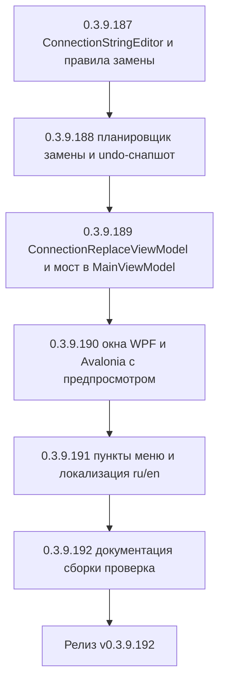

# PLAN — цикл 0.3.9.187–0.3.9.192 — Функция 6: массовая замена в строке подключения баз

Репозиторий [`sivatorov/ConfigurationManagement`](https://github.com/sivatorov/ConfigurationManagement),
локальная копия `f:\Yandex.Disk\h\Configuration_Management`, ветка `main`.
Локальный HEAD — **0.3.9.180** (версия в
[`Configuration Management.csproj`](../Configuration%20Management/Configuration%20Management.csproj:62),
бейдж в [`README.md`](../README.md:3), верхняя запись в [`CHANGELOG.md`](../CHANGELOG.md:12));
в работе циклы журнала регистрации (0.3.9.161–0.3.9.166), планировщика ОС (0.3.9.167–0.3.9.171)
и уведомлений (0.3.9.180–0.3.9.186). Новый цикл стартует **после их завершения**; нумерация
может сместиться на фактический HEAD — перед стартом первого этапа исполнитель сверяет версию
в csproj (риск п. 6).

Режим: Архитектор (план) → задачи-исполнители в режиме **code** (`new_task` по одному на этап).
**Один этап = одна версия = один коммит.** План-файл остаётся untracked (`plans/` в
`.codeassistantignore`); CHANGELOG/README/csproj коммитятся. Это **новая функция** (собственная
дорожная карта): комментарии к issues не публикуются; в CHANGELOG заголовок — «Добавлено».

---

## 1. Сводка цикла

| № | Версия | Суть | Приоритет |
|---|--------|------|-----------|
| 1 | 0.3.9.187 | Чистый редактор строки подключения: модели `ConnectionField`/`ConnectionMatchMode`/`ConnectionStringReplaceRule`, `Services/ConnectionStringEditor.cs` (единый разбор всех типов строк + применение замены по полям: сервер/порт/Ref/путь/URL/вся строка; режимы точный/префикс/подстрока/regex; регистронезависимость; экранирование); тесты | 1 |
| 2 | 0.3.9.188 | Чистый планировщик: `Services/ConnectionReplacementPlanner.cs` — отбор кандидатов области (все/выделенные/группа), построение плана предпросмотра «база \| было \| станет», сводка (изменено/без совпадений/без подключения), применение с мутацией полей и формированием снапшота для отката (`ConnectionReplaceUndoEntry`); тесты | 1 |
| 3 | 0.3.9.189 | VM окна: `ViewModels/ConnectionReplaceViewModel.cs` (поля Найти/Заменить, выбор поля/области/режима/регистра, предпросмотр-коллекция, команды поиска/применения/отмены, валидация regex); мост в `MainViewModel` (кандидаты области с учётом приватных, применение+сохранение, undo последней замены, JSON-бэкап через `InfobaseJsonTransfer`, запись в лог); тесты | 1 |
| 4 | 0.3.9.190 | Окна обеих платформ: `Views/ConnectionReplaceWindow.xaml`+`.xaml.cs` (WPF) и `Views/ConnectionReplaceWindow.Avalonia.cs` (Linux): поля и ComboBox'ы, DataGrid/список предпросмотра с подсветкой «было → станет», кнопки «Найти»/«Заменить»/«Отменить последнюю замену»; ключи локализации окна ru/en; подключение окна в csproj | 1 |
| 5 | 0.3.9.191 | Интеграция в меню обеих платформ: пункт «Заменить в строках подключения…» в блоке «Для выделенных (N)…» контекстного меню базы (WPF `MainWindow.xaml` + `MainWindow.Events.cs`, Avalonia) и в «Утилитах» (все базы/текущая группа), пункт «Отменить последнюю замену строк подключения»; локализация пунктов меню ru/en | 1 |
| 6 | 0.3.9.192 | Документация (CHANGELOG/README/ARCHITECTURE), полные сборки Windows+Linux, сквозная ручная проверка (перенос server1→server2, смена порта, путь файловой базы, URL, undo, приватные базы, отсутствие совпадений) | 2 |



---

## 2. Общие требования к КАЖДОМУ этапу

1. Реализация на обеих платформах (Windows/WPF + Linux/Avalonia), где применимо; чистые
   сервисы/VM — без платформенных зависимостей; платформенные реализации — символы условной
   компиляции (`#if WINDOWS` / `#if LINUX`) или отдельные файлы `*.Avalonia.cs`, как у
   [`ServerMonitorWindow`](../Configuration%20Management/Views/ServerMonitorWindow.Avalonia.cs:1)
   и [`ServerMonitorWindow.xaml.cs`](../Configuration%20Management/Views/ServerMonitorWindow.xaml.cs:1).
2. Инкремент версии в [`Configuration Management.csproj`](../Configuration%20Management/Configuration%20Management.csproj:62)
   (строки 62–65: Version/AssemblyVersion/FileVersion/InformationalVersion) на 1 патч.
3. Запись в [`CHANGELOG.md`](../CHANGELOG.md:12) (сверху, раздел «Добавлено») и обновление
   бейджа версии в [`README.md`](../README.md:3).
4. Тесты: `dotnet test` зелёный и `dotnet build -p:BuildLinux=true` без ошибок.
5. Один коммит (без пуша); без ключевых слов автозакрытия issues. Образец сообщения:
   `0.3.9.187: массовая замена в строках подключения — редактор строки подключения и правила замены`.
6. Все пункты плана перед исполнением сверить с фактическим кодом (адреса строк могут сместиться;
   циклы 0.3.9.161–171 и 0.3.9.180–186 ещё в работе и могут затронуть `MainWindow`/`MainViewModel`/
   `SettingsWindow`).
7. **Перед этапом 0.3.9.187 проверить актуальное поведение** [`ConnectionSettings.ParseConnectionString`](../Configuration%20Management/Models/ConnectionSettings.cs:188)
   и [`ToConnectionString`](../Configuration%20Management/Models/ConnectionSettings.cs:147):
   новый редактор переиспользует их как единую точку разбора/сборки, а не дублирует логику.

---

## 3. Дизайн

### 3.1. Текущий фундамент (что переиспользуется)

- [`ConnectionSettings`](../Configuration%20Management/Models/ConnectionSettings.cs:6) хранит
  подключение **структурно**: тип, сервер, имя ИБ (Ref), порт, путь файловой базы, веб-URL,
  пользователь/пароль, флаги `SchJobDn`/`disstt`.
- [`ParseConnectionString`](../Configuration%20Management/Models/ConnectionSettings.cs:188) —
  единый разбор строки `File="…"` / `Srvr="host[:port]";Ref="…"` / `WS="…"` с учётом
  экранирования кавычек (удвоение, [`ExtractQuoted`](../Configuration%20Management/Models/ConnectionSettings.cs:273))
  и значений без кавычек; регистронезависим по ключам.
- [`ToConnectionString`](../Configuration%20Management/Models/ConnectionSettings.cs:147) — обратная
  сборка; порт 1541 опускается ([`GetServerWithPort`](../Configuration%20Management/Models/ConnectionSettings.cs:75)),
  IPv6 в квадратных скобках сохраняется ([`ParseServerAndPort`](../Configuration%20Management/Models/ConnectionSettings.cs:96)).
- Нормализация строки подключения для дедупликации уже есть в
  [`InfobaseJsonTransfer.ConnectionKey`](../Configuration%20Management/Services/InfobaseJsonTransfer.cs:42),
  [`RacInfobaseMapper.ConnectionKey`](../Configuration%20Management/Services/RacInfobaseMapper.cs:58)
  и [`InfobaseExportMerge.DuplicateKey`](../Configuration%20Management/Services/InfobaseExportMerge.cs:57).

**Вывод:** приложение хранит подключение структурно, поэтому массовая замена оперирует полями
`ConnectionSettings`, а строка подключения используется как единый канонический вид «было/станет»
для предпросмотра и подтверждения.

### 3.2. Модели правила замены (этап 0.3.9.187)

Новые типы в `Services/` (чистый .NET, обе платформы):

```csharp
// Services/ConnectionReplaceModels.cs

/// <summary>Поле строки подключения, к которому применяется замена.</summary>
public enum ConnectionField
{
    Server,     // Srvr (хост, включая IPv6-скобки; без порта)
    Port,       // порт кластера (числовая часть Srvr, отдельно от хоста)
    Ref,        // имя ИБ на сервере (Ref)
    FilePath,   // путь файловой базы (File)
    WebUrl,     // URL веб-публикации (WS)
    Any         // вся строка подключения как текст (для подстроки/regex по неизвестным параметрам)
}

/// <summary>Режим сопоставления искомого текста.</summary>
public enum ConnectionMatchMode { Exact, Prefix, Substring, Regex }

/// <summary>
/// Правило замены: «найти» → «заменить на» в выбранном поле строки подключения.
/// Для Exact/Prefix/Substring искомый текст трактуется буквально (regex-метасимволы
/// экранируются); для Regex — это паттерн .NET Regex. IgnoreCase — учёт регистра.
/// </summary>
public sealed record ConnectionStringReplaceRule(
    string Find,
    string Replace,
    ConnectionField Field,
    ConnectionMatchMode Mode,
    bool IgnoreCase);
```

### 3.3. Единый редактор `ConnectionStringEditor` (этап 0.3.9.187)

`Services/ConnectionStringEditor.cs` — чистая логика разбора и применения замены:

```csharp
public static class ConnectionStringEditor
{
    // Разбор любого типа строки подключения (тонкая обёртка над
    // ConnectionSettings.ParseConnectionString — единая точка нормализации).
    public static ConnectionSettings Parse(string? connectionString);

    // Нормализованная строка подключения (обёртка над ToConnectionString).
    public static string Build(ConnectionSettings settings);

    // Применяет правило к одному полю настроек. Возвращает true, если поле изменилось;
    // через out отдаёт старое и новое значение поля (для предпросмотра «было → станет»).
    public static bool TryApply(
        ConnectionSettings settings,
        ConnectionStringReplaceRule rule,
        out ConnectionSettings updated,
        out string beforeValue,
        out string afterValue);

    // Для ConnectionField.Any: замена по всей строке подключения как тексту
    // (сегментная пересборка сохраняет кавычки, экранирование и прочие параметры).
    public static bool TryApplyRaw(
        string rawConnectionString,
        ConnectionStringReplaceRule rule,
        out string updated);
}
```

Правила применения по полям (семантически, с последующей пересборкой строки через `Build`):

- **Server** — заменяется хост `settings.Server` (совпадение ищется по значению хоста);
  порт и Ref не затрагиваются. Результат пишется в `settings.Server`.
- **Port** — работаем с числовым `settings.Port` (не с текстом строки!). `Find` трактуется
  как строка десятичного порта (например «1541»). Если замена даёт нестандартный порт — при
  сборке `Srvr="host:port"`; если стандартный 1541 — порт опускается (`GetServerWithPort`
  уже так делает). Случай «порт был опущен (1541), Find = 1541, Replace = 2541» корректно
  добавляет порт в строку.
- **Ref** — `settings.DatabaseName`; переписывается только значение `Ref`.
- **FilePath** — `settings.FilePath`; переписывается только значение `File`.
- **WebUrl** — `settings.WebUrl`; переписывается только значение `WS`. Регистронезависимость
  для URL-хоста работает как для обычной подстроки.
- **Any** — сырая строка подключения (`ToConnectionString()`): подстрока/префикс/regex по всему
  тексту; при совпадении результат разбирается обратно `Parse` в новые настройки (сохраняя
  прочие поля через Parse), а `TryApplyRaw` дополнительно умеет работать с произвольным
  текстом, содержащим неизвестные параметры (сегментная замена значения).

Сопоставление значений (метод `Matches(value, rule)`):

- `Exact` — `string.Equals(value, Find, IgnoreCase ? OrdinalIgnoreCase : Ordinal)`.
- `Prefix` — `StartsWith`.
- `Substring` — `Contains`.
- `Regex` — `Regex.IsMatch(value, Find, IgnoreCase ? IgnoreCase : None)`; невалидный паттерн —
  выбрасывает `ArgumentException`, который VM превращает в сообщение об ошибке и блокирует
  кнопку «Заменить».
- Для `Exact/Prefix/Substring` перед поиском выполняется `Regex.Escape` — буквальное
  сопоставление спецсимволов («.» в «srv1.test» не съедает лишние символы).

Экранирование: запись значения поля всегда через существующий механизм удвоения кавычек
([`EscapeConnectValue`](../Configuration%20Management/Models/ConnectionSettings.cs:164)) — редактор
не вводит нового формата; симметрия с `Parse` гарантирует обратимость.

### 3.4. Планировщик `ConnectionReplacementPlanner` (этап 0.3.9.188)

`Services/ConnectionReplacementPlanner.cs` — чистый слой планирования/применения:

```csharp
/// <summary>Область применения замены.</summary>
public enum ConnectionReplaceScope { AllBases, BatchSelected, CurrentGroup }

/// <summary>Строка предпросмотра: база, поле, «было» и «станет».</summary>
public sealed record ConnectionReplacePreviewRow(
    Infobase Infobase,
    ConnectionField Field,
    string BeforeText,   // текущее значение поля (или вся строка для Any)
    string AfterText,    // новое значение после замены
    bool Changed);       // true — значение реально изменится

/// <summary>План замены: затронутые строки и сводка.</summary>
public sealed record ConnectionReplacePlan(
    IReadOnlyList<ConnectionReplacePreviewRow> Rows, // только Changed == true
    int AffectedCount,                               // число изменяемых баз (без дублей по базе)
    int NoMatchCount,                                // баз с совпадением нет
    int EmptyConnectionCount);                       // баз без строки подключения (не участвуют)

/// <summary>Запись для отката: прежние настройки подключения базы.</summary>
public sealed record ConnectionReplaceUndoEntry(Infobase Infobase, ConnectionSettings Before, ConnectionSettings After);

public static class ConnectionReplacementPlanner
{
    // Отбор кандидатов области из переданного «видимого» списка (приватные отфильтрованы
    // вызывающей стороной). BatchSelected — по Id из набора; CurrentGroup — по Group.
    public static IReadOnlyList<Infobase> SelectCandidates(
        IReadOnlyList<Infobase> visibleInfobases,
        IReadOnlyCollection<string>? batchIds,
        string? currentGroup,
        ConnectionReplaceScope scope);

    // Строит план БЕЗ мутации баз: для каждой кандидатной базы применяет правило
    // к копии ConnectionSettings и сравнивает старое/новое значение.
    public static ConnectionReplacePlan Plan(
        IReadOnlyList<Infobase> candidates,
        ConnectionStringReplaceRule rule);

    // Применяет план: мутирует Connection затронутых баз (глубокая копия полей Before —
    // для undo) и возвращает записи отката.
    public static IReadOnlyList<ConnectionReplaceUndoEntry> Apply(
        IReadOnlyList<Infobase> candidates,
        ConnectionStringReplaceRule rule);

    // Откат: восстанавливает Before для каждой записи (мутация объектов на месте).
    public static void Undo(IEnumerable<ConnectionReplaceUndoEntry> entries);
}
```

Ключевые решения:

- `SelectCandidates` получает **уже видимый список** — единая фильтрация приватных баз живёт
  в `MainViewModel` (приватность решает `IProfileService.CanShowPrivateBases`, как в
  [`MainViewModel.Theme.cs:529`](../Configuration%20Management/ViewModels/MainViewModel.Theme.cs:529)),
  планировщик про приватность не знает.
- `Plan` не мутирует базы: применяет правило к копии `ConnectionSettings`; `Changed`
  определяется сравнением «было/станет» значения поля. Базы с пустой/неразборчивой строкой
  подключения (`ToConnectionString()` пустая) — в `EmptyConnectionCount`, в `Rows` не попадают.
- `Apply` перед записью снимает глубокую копию полей подключения (`Before`), чтобы undo
  не зависел от последующих правок других полей базы.

### 3.5. VM окна и мост в `MainViewModel` (этап 0.3.9.189)

`ViewModels/ConnectionReplaceViewModel.cs` — чистый VM (обе платформы), по образцу
[`ClusterImportViewModel`](../Configuration%20Management/ViewModels/ClusterImportViewModel.cs:20)
(получает данные и делегаты, окна только привязываются):

- Вход конструктора: список кандидатов (`IReadOnlyList<Infobase>`), начальная область
  (`ConnectionReplaceScope`), колбэки `Action<IReadOnlyList<ConnectionReplaceUndoEntry>>? onApplied`
  (сохранение + пересборка дерева в `MainViewModel`) и `Action<ConnectionReplaceUndoEntry[]>? onUndone`,
  опционально `Action<Action>? dispatchToUi` (null — тесты).
- Свойства: `FindText`, `ReplaceText`, `SelectedField` (`ConnectionField`), `SelectedScope`,
  `SelectedMatchMode`, `IgnoreCase` (bool), `IsPreviewDirty` (входные изменились после последнего
  поиска), `PreviewRows` (`ObservableCollection<ConnectionReplacePreviewRow>`), `AffectedCount`/
  `NoMatchCount`/`EmptyCount`, `SummaryText`, `CanApply`, `CanUndo`, `ErrorMessage`.
- Команды:
  - `RefreshPreviewCommand` — строит `ConnectionReplacePlan` (через `Planner.Plan`), заполняет
    коллекцию и сводку; `CanApply = Rows.Count > 0`; невалидный regex → `ErrorMessage`
    (`ConnectionReplace.Error.InvalidRegex`), предпросмотр пуст.
  - `ApplyCommand` — подтверждение (ключ `ConnectionReplace.Confirm.ApplyFormat` с числом баз),
    `Planner.Apply`, колбэк `onApplied` (в `MainViewModel`: `ScheduleSave()`, `RebuildGroupTree()`,
    `ExportToIbasesAfterLocalChange()`, JSON-бэкап, лог, уведомление), сводка результата
    (`ConnectionReplace.Result.AppliedFormat`), `CanUndo = true`.
  - `UndoLastCommand` — `Planner.Undo(entries)`, колбэк `onUndone` (сохранение), сводка
    (`ConnectionReplace.UndoDoneFormat`).

Мост в `MainViewModel` — новый файл `ViewModels/MainViewModel.ConnectionReplace.cs` (общий,
без `#if`):

- `public IReadOnlyList<Infobase> GetConnectionReplaceCandidates(ConnectionReplaceScope scope)` —
  кандидаты области из **видимых** баз (приватные скрытые исключаются; `BatchSelectedIds` из
  [`MainViewModel.Batch.cs:33`](../Configuration%20Management/ViewModels/MainViewModel.Batch.cs:33),
  группа — `SelectedGroupPath`/текущая группа, точное имя свойства сверить с кодом).
- `public void ApplyConnectionReplace(IReadOnlyList<ConnectionReplaceUndoEntry> entries)` —
  применение: `ScheduleSave()` ([`MainViewModel.Launch.cs:23`](../Configuration%20Management/ViewModels/MainViewModel.Launch.cs:23)),
  `RebuildGroupTree()`, `ExportToIbasesAfterLocalChange()` (как в
  [`DeleteBatch`](../Configuration%20Management/ViewModels/MainViewModel.BatchCommands.cs:178));
  сохраняет `_lastConnectionReplaceUndo` (список записей); пишет в `IAppLogger.Info` и шлёт
  `INotificationService` (kind Success) — диспетчер уведомлений уже готов после цикла 0.3.9.180–186.
- `public void UndoLastConnectionReplace()` — откат через `Planner.Undo` + сохранение; доступно
  из «Утилит» (пункт «Отменить последнюю замену строк подключения», Enabled при наличии записи).
- **JSON-бэкап перед применением** (страховка вне сессии): `InfobaseJsonTransfer.BuildSnapshot` +
  `Serialize` ([`InfobaseJsonTransfer.cs:52`](../Configuration%20Management/Services/InfobaseJsonTransfer.cs:52))
  в файл `connection_replace_backup_<yyyyMMdd_HHmmss>.json` в каталоге данных профиля
  (переиспользовать существующий путь `PlatformPaths`/`PortablePaths` для данных приложения).
- Повторное применение замещает предыдущий undo (одноуровневая история — соответствует
  требованию «отменить последнюю замену»).

### 3.6. Окно «Заменить в строках подключения…» (этап 0.3.9.190)

Сценарий:

1. Пользователь открывает пункт меню (контекстное меню «Для выделенных (N)…» или «Утилиты»).
2. Окно: поля **«Найти»** и **«Заменить на»**, выбор **поля** (Сервер / Порт / Имя ИБ / Путь
   файловой базы / Веб-URL / Вся строка), **области** (Все базы / Выделенные (N) / Текущая
   группа — предзаполнено источником вызова), **режима** (Точное совпадение / Префикс /
   Подстрока / Регулярное выражение) и флажок «Учитывать регистр» (по умолчанию выкл —
   регистронезависимо).
3. Кнопка **«Найти»** строит предпросмотр: таблица «База | Поле | Было | Станет»; строки с
   изменением подсвечиваются (колонка «Станет» зелёным фоном WPF / Foreground в Avalonia);
   строка сводки: «Совпадений: N · будет изменено баз: M · без совпадений: K · без подключения: L».
4. Кнопка **«Заменить»** (активна при M > 0): подтверждение с числом баз, применение, сводка
   результата, кнопка **«Отменить последнюю замену»** становится активной (работает и после
   закрытия окна — из «Утилит»).
5. Отмена окна (Esc/«Закрыть») ничего не меняет.

Окна:

- **WPF** [`Views/ConnectionReplaceWindow.xaml`](../Configuration%20Management/Views/ConnectionReplaceWindow.xaml:1)
  + `.xaml.cs` (`#if WINDOWS`): Grid с панелью параметров (TextBox «Найти»/«Заменить на»,
  ComboBox'ы, CheckBox), `DataGrid` предпросмотра (колонки: База, Поле, Было, Станет;
  DataGridTemplateColumn с привязкой фона по `Changed`), нижняя панель со сводкой и кнопками;
  конструктор принимает готовый `ConnectionReplaceViewModel` (как `ClusterImportWindow`);
  `DialogResult` — по «Закрыть»; сохранение выполняет сам VM через колбэки (окно не знает
  про `MainViewModel`).
- **Avalonia** [`Views/ConnectionReplaceWindow.Avalonia.cs`](../Configuration%20Management/Views/ConnectionReplaceWindow.Avalonia.cs:1)
  (`#if LINUX`): то же через code-behind-построение (Grid/StackPanel, `TextBox`, `ComboBox`,
  `CheckBox`, `ListBox`+`Grid` строк по образцу `BuildSessionRow` из
  [`ServerMonitorWindow.Avalonia.cs`](../Configuration%20Management/Views/ServerMonitorWindow.Avalonia.cs:127),
  `CellText` с Foreground по `Changed`).
- Подключение в [`Configuration Management.csproj`](../Configuration%20Management/Configuration%20Management.csproj:120):
  WPF-ветка — `<Page>`/`Compile` для `.xaml`/`.xaml.cs`, Linux-ветка — `Compile Include` для
  `.Avalonia.cs` (по образцу существующих окон).

### 3.7. Интеграция в меню (этап 0.3.9.191)

- **Контекстное меню базы → блок «Для выделенных (N)…»** ([`MainWindow.xaml:2451`](../Configuration%20Management/Views/MainWindow.xaml:2451),
  `BatchOperationsMenu`): пункт **«Заменить в строках подключения…»** (иконка `FindReplace`)
  после «Проверить доступность», перед «Удалить»; обработчик `OnBatchConnectionReplace_Click`
  в [`MainWindow.Events.cs`](../Configuration%20Management/Views/MainWindow.Events.cs:736)
  (по образцу `OnBatchMoveToGroup_Click`): открывает окно с `SelectedScope = BatchSelected`,
  кандидатами `BatchSelectedInfobases`; после закрытия — `ClearBatchSelection()`.
- **«Утилиты»** (WPF — контекстное меню кнопки [`MainWindow.xaml:647`](../Configuration%20Management/Views/MainWindow.xaml:647);
  Avalonia — соответствующая точка `MainWindow.Avalonia.*`): пункт **«Заменить в строках
  подключения…»** с `SelectedScope = AllBases` (в окне пользователь может сменить на «Текущую
  группу»), а также пункт **«Отменить последнюю замену строк подключения»** (Enabled при
  `_lastConnectionReplaceUndo != null`, `Click` → `UndoLastConnectionReplace`).
- После применения окно закрывается; дерево и ibases.v8i обновляются в `MainViewModel`
  (п. 3.5), поэтому дополнительной синхронизации в обработчиках нет.
- Avalonia: аналогичные пункты добавляются в контекстное меню базы и «Утилиты» в
  `MainWindow.Avalonia.cs` / `MainWindow.Avalonia.*` (точные файлы сверяет исполнитель).

### 3.8. Приватные базы и запущенные базы

- Приватные: окно никогда не получает скрытые приватные базы — кандидаты строит
  `MainViewModel` из видимого списка (п. 3.5). Поведение единое с остальным UI
  (см. [`IProfileService.CanShowPrivateBases`](../Configuration%20Management/Services/IProfileService.cs:1)).
- Запущенные базы (`Infobase.IsRunning`): изменение строки подключения не влияет на уже
  запущенные процессы 1С — сводка предпросмотра не блокирует операцию; в плане указывается
  счётчик запущенных среди затрагиваемых (информационно, ключ `ConnectionReplace.Summary.RunningAffected`)
  без дополнительных диалогов.

---

## 4. Тесты

### 4.1. Этап 0.3.9.187 — `ConnectionStringEditorTests`

- Разбор всех типов строк: `File="C:\base"`, `Srvr="host";Ref="База"`,
  `Srvr="host:2541";Ref="База"`, `WS="http://host/base"`, пустая строка, мусорная строка
  («abc»), `Srvr = "host"` (пробелы вокруг «=»), значения без кавычек.
- Нормализация сборки: порт 1541 опускается; нестандартный порт сохраняется; IPv6
  `[2001:db8::1]:1541` сохраняет скобки; кавычки/экранирование (`""` внутри значения
  обратимо через Parse→Build).
- Применение замены по полям:
  - Server: точное (server1→server2), подстрока («server» → «server2» в «server-01»),
    префикс, регистронезависимое (SERVER1→server2 при IgnoreCase=false не срабатывает).
  - Port: 1541→2541 (добавляет `:2541` в строку), 2541→1541 (убирает порт), 1541→1541
    (без изменений).
  - Ref: «База»→«База_new» (изменяет только Ref, Srvr не трогается).
  - FilePath: `C:\base`→`D:\base` (меняет только File).
  - WebUrl: `old.example.com`→`new.example.com` в `WS="http://old.example.com/base"`.
  - Any: подстрока по всей строке (`;Usr=` присутствует и переживает замену).
- Сохранение прочих параметров при замене: `Srvr=...;Ref=...;Usr=user;Pwd=pass;SchJobDn=Y`
  — после замены Srvr все остальные сегменты на месте.
- Regex: паттерн `^host\d+` + замена, `IgnoreCase`; невалидный паттерн → `ArgumentException`.
- Крайние случаи: пустой `Find` → не применяется (false); поле не соответствует типу базы
  (FilePath для серверной базы — значение пустое, замены нет); база без подключения.
- Экранирование метасимволов: в режиме Substring точка в «srv1.test» не съедает лишнее.

### 4.2. Этап 0.3.9.188 — `ConnectionReplacementPlannerTests`

- `SelectCandidates`: AllBases возвращает весь видимый список; BatchSelected — только по Id
  из набора (порядок списка); CurrentGroup — только базы группы (пустая группа → пусто);
  неизвестные Id игнорируются.
- `Plan`: строки только с `Changed == true`; `AffectedCount` не считает дубликаты по базе
  (одно поле на базу — 1 строка); `NoMatchCount` и `EmptyConnectionCount` корректны;
  базы без строки подключения не входят в Rows.
- `Plan` не мутирует исходные базы (сравнение `Connection` до/после).
- `Apply`: мутирует только затронутые базы; `Before` — глубокая копия (изменение поля
  «After» у другой базы не влияет на откат); `After` соответствует ожидаемой строке.
- `Undo`: восстанавливает `Before` (проверка равенства всех полей `Connection`).
- Крайние случаи: правило не совпало ни с одной базой; пустой кандидат-список; кандидат
  с `Connection == null`-дефолтом (пустые настройки).

### 4.3. Этап 0.3.9.189 — `ConnectionReplaceViewModelTests`

- `RefreshPreview` заполняет `PreviewRows` и сводку; смена `FindText`/`Field`/`Mode`/`IgnoreCase`
  помечает `IsPreviewDirty` и очищает предпросмотр до следующего «Найти».
- `CanApply` только при `Rows.Count > 0`; невалидный regex → `ErrorMessage` и `CanApply == false`.
- `Apply` вызывает колбэк `onApplied` с записями undo; сводка результата («изменено баз: N»);
  повторный `Apply` без нового предпросмотра запрещён (защита от двойного применения).
- `UndoLast` вызывает колбэк `onUndone`; после отката `CanUndo == false`.
- Мост `MainViewModel`: `GetConnectionReplaceCandidates` для AllBases исключает скрытые
  приватные базы (фейковый `IProfileService` с `CanShowPrivateBases=false`), для BatchSelected
  возвращает только Id набора; `ApplyConnectionReplace` сохраняет undo, вызывает
  `ScheduleSave`/пересборку (проверяется через фейковый репозиторий), пишет в фейковый
  `IAppLogger`, создаёт JSON-бэкап-файл в указанном каталоге (тест с временной папкой).
  Примечание: `MainViewModel` тяжёлый — тестировать через отдельный чистый хелпер, если
  конструктор слишком нагружен (решение исполнителя: либо фабрика кандидатов выделяется
  в чистый класс, либо тестируется через реальный VM с фейковыми сервисами, как уже делают
  `MainViewModel`-тесты проекта, например `Etap13ListStateTests`).

### 4.4. Этапы 0.3.9.190–0.3.9.192

- Регрессия: `dotnet test` целиком и `dotnet build -p:BuildLinux=true`.
- Ручной чек (0.3.9.192): перенос кластера server1→server2 (Server, точное совпадение);
  смена порта 1541→2541 и обратно; переименование каталога файловой базы; замена URL-хоста
  веб-публикации; подстрока и regex; регистр; предпросмотр показывает «было → станет» и
  подсветку; подтверждение; отмена ничего не меняет; «Отменить последнюю замену» из окна и
  из «Утилит»; повторная замена поверх отменённой; приватные базы не затрагиваются;
  базы без подключения в сводке; пустой список совпадений; `Usr/Pwd/SchJobDn` переживают
  замену (проверка в окне свойств базы после операции); JSON-бэкап создан.

---

## 5. Таблица декомпозиции задач

| № | Версия | Файлы (новые/изменяемые) | Тесты | Риски и митигации |
|---|--------|--------------------------|-------|-------------------|
| 1 | 0.3.9.187 | **New:** `Services/ConnectionReplaceModels.cs` (`ConnectionField`, `ConnectionMatchMode`, `ConnectionStringReplaceRule`), `Services/ConnectionStringEditor.cs` (Parse/Build/сегментная пересборка для `Any`). **Edit:** нет (только при необходимости регистрация в csproj, если добавляются `Compile Include`) | `ConnectionStringEditorTests` (п. 4.1): разбор всех типов, нормализация, замены по полям, регистр, экранирование, regex, крайние случаи, сохранение прочих параметров | Регress на существующем `ParseConnectionString` → редактор — обёртка, не дубль (п. 2.7); потеря неизвестных параметров → сегментная пересборка целевого поля + режим `Any`; порт 1541 опускается → семантическая замена `Port` с пересборкой `Srvr` |
| 2 | 0.3.9.188 | **New:** `Services/ConnectionReplacementPlanner.cs` (SelectCandidates/Plan/Apply/Undo, `ConnectionReplacePreviewRow`, `ConnectionReplacePlan`, `ConnectionReplaceUndoEntry`, `ConnectionReplaceScope`). **Edit:** нет | `ConnectionReplacementPlannerTests` (п. 4.2): области, план без мутаций, счётчики, глубокая копия Before, откат, крайние случаи | План и применение расходятся → `Plan` и `Apply` используют одну функцию сопоставления; дубликат базы (закреплённая) → `AffectedCount` по уникальным Id; база с дефолтными пустыми настройками → `EmptyConnectionCount` |
| 3 | 0.3.9.189 | **New:** `ViewModels/ConnectionReplaceViewModel.cs`, `ViewModels/MainViewModel.ConnectionReplace.cs` (кандидаты областей с учётом приватных, применение+undo, JSON-бэкап, лог/уведомление). **Edit:** `AppServices.cs` — регистрация не требуется (VM создаётся окном), при необходимости лёгкие правки; `Localization/Languages/ru.json`+`en.json` (ключи статусов VM: `ConnectionReplace.Summary.*`, `Result.*`, `Error.InvalidRegex`, `Confirm.ApplyFormat`, `UndoDoneFormat`) | `ConnectionReplaceViewModelTests` (п. 4.3) + тесты моста MainViewModel (фейковый профиль/репозиторий/логгер, временный каталог для бэкапа) | Приватные базы → кандидаты строит `MainViewModel` из видимого списка (единая точка); гонки сохранения → `ScheduleSave` (debounce уже есть); файл-бэкап на диск → переиспользование `InfobaseJsonTransfer`, ошибка записи не блокирует применение (логируется) |
| 4 | 0.3.9.190 | **New:** `Views/ConnectionReplaceWindow.xaml`+`.xaml.cs` (WPF), `Views/ConnectionReplaceWindow.Avalonia.cs` (Linux). **Edit:** `Configuration Management.csproj` (подключение окна в WPF- и Linux-ветки), `Localization/Languages/ru.json`+`en.json` (ключи окна: заголовок, подписи полей/ComboBox'ов, колонки, кнопки) | Логика покрыта этапами 1–3; здесь — регрессия `ConnectionReplaceViewModelTests` + сборки обеих платформ. Ручной чек: окно открывается с обеих точек вызова (пока напрямую из временного пункта), предпросмотр и подсветка, подтверждение, отмена, кнопка Undo | Разные жизненные циклы окон → тонкие обёртки, вся логика в общем VM; подсветка «станет» → привязка по свойству `Changed` (фон ячейки WPF / Foreground Avalonia); окно без VM (закрытие Esc) → состояние не меняется (Plan не мутирует) |
| 5 | 0.3.9.191 | **Edit:** `Views/MainWindow.xaml` (пункт в `BatchOperationsMenu`, пункты в контекстном меню «Утилиты», `OnUtilitiesMenuButton_Click`), `Views/MainWindow.Events.cs` (`OnBatchConnectionReplace_Click`, обработчики «Утилит»), `Views/MainWindow.Avalonia.*` (аналогичные пункты), `Localization/Languages/ru.json`+`en.json` (ключи меню: `Main.BatchConnectionReplace`, `Main.UtilitiesConnectionReplace`, `Main.UtilitiesUndoConnectionReplace`) | Регрессия сборок и существующих тестов оконной интеграции; ручной чек: пункт появляется в блоке «Для выделенных (N)» только при N ≥ 1 (существующий механизм видимости), «Отменить последнюю замену» Enabled после применения и Hidden/Disabled после отката и нового применения | Контекстное меню управляется `OnBaseContextMenu_Opened` → новый пункт добавляется в `BatchOperationsMenu`; пункт «Отменить» — видимость через свойство VM (`CanUndoConnectionReplace`), событие `PropertyChanged` | 
| 6 | 0.3.9.192 | **Edit:** `CHANGELOG.md`, `README.md` (бейдж + раздел возможностей), `ARCHITECTURE.md` (редактор строки подключения: связка `ConnectionStringEditor` → `ConnectionReplacementPlanner` → `ConnectionReplaceViewModel` → окна; ограничения: структурное хранение подключений, одноуровневый undo, приватные базы); полные сборки Windows+Linux | Сквозная ручная проверка по п. 4.4 (реальный сценарий миграции на новый сервер) | Различия «сырых» строк ibases.v8i и канонической строки приложения → работаем с канонической `ToConnectionString()` (документируется); поведение на уже запущенных базах → информационная сводка без блокировки |

---

## 6. Риски (сводно) и митигации

| Риск | Митигация |
|------|-----------|
| Строка подключения в приложении хранится структурно, а «сырые» тексты из ibases.v8i могут содержать параметры, которые `ParseConnectionString` не знает | Замена оперирует полями `ConnectionSettings` (каноническая строка `ToConnectionString` для «было/станет»); режим `Any` — сегментная замена значения в исходном тексте без потери прочих сегментов (Usr/Pwd/SchJobDn/disstt) |
| Порт 1541 по умолчанию опускается в строке (`GetServerWithPort`) | Замена поля Port — семантическая (числовой `ConnectionSettings.Port`), сборка строки сама добавляет/убирает `:port` |
| Regex с невалидным паттерном роняет предпросмотр/применение | Валидация при построении правила: `ArgumentException` → `ErrorMessage`, кнопка «Заменить» не активна; тест |
| Массовая операция по ошибке затрагивает много баз | Обязательный предпросмотр + подтверждение с числом баз; одноуровневый undo («Отменить последнюю замену») в памяти сессии + автосоздание JSON-бэкапа (`InfobaseJsonTransfer`) перед применением |
| Приватные (скрытые) базы попадают в операцию | Кандидаты областей строит `MainViewModel` из видимого списка (`CanShowPrivateBases`); планировщик получает уже отфильтрованный список |
| Потеря/порча прочих параметров строки при замене | Пересобирается только целевое поле (сегмент); этап 0.3.9.187 покрыт тестами «прочие параметры на месте»; ручная проверка в окне свойств базы |
| Гонки сохранения (быстрые повторные операции) | `ScheduleSave()` с debounce уже реализован в `MainViewModel.Launch.cs`; undo применяется к тем же объектам `Infobase` — конфликтов ссылок нет |
| Расхождение точек меню WPF/Avalonia | Верхнеуровневые обработчики в общем `MainViewModel.ConnectionReplace.cs`; платформенные файлы только открывают окно (как существующие пакетные операции) |
| Циклы 0.3.9.161–171 / 0.3.9.180–186 в работе могут затронуть `MainWindow`/`MainViewModel` | Перед каждым этапом исполнитель сверяет адреса и сигнатуры с фактическим кодом (п. 2.6); при конфликте — актуализация плана |
| Скрытый профильный случай: `Connection` == null у базы (десериализация) | В `Infobase` сеттер гарантирует ненулевой `Connection`; планировщик дополнительно трактует пустую строку как «без подключения» |
| Базы запущены во время операции | Изменение строки подключения не влияет на запущенные процессы; информационный счётчик в сводке без блокировки (документируется) |

---

## 7. Локализация (новые ключи, ru/en)

- `ConnectionReplace.Title` — «Заменить в строках подключения…» / «Replace in base connection strings…»;
- `ConnectionReplace.FindLabel` («Найти»), `.ReplaceLabel` («Заменить на»), `.FieldLabel` («Поле»),
  `.ScopeLabel` («Область»), `.ModeLabel` («Режим»), `.IgnoreCase` («Учитывать регистр»);
- `ConnectionReplace.Fields.Server` («Сервер»), `.Port` («Порт»), `.Ref` («Имя ИБ на сервере»),
  `.FilePath` («Путь файловой базы»), `.WebUrl` («Веб-URL»), `.Any` («Вся строка»);
- `ConnectionReplace.Scopes.All` («Все базы»), `.Selected` («Выделенные ({0})»), `.Group` («Текущая группа»);
- `ConnectionReplace.Modes.Exact` («Точное совпадение»), `.Prefix` («Префикс»),
  `.Substring` («Подстрока»), `.Regex` («Регулярное выражение»);
- `ConnectionReplace.FindButton` («Найти»), `.ApplyButton` («Заменить»),
  `.UndoButton` («Отменить последнюю замену»), `.CloseButton` («Закрыть»);
- `ConnectionReplace.Columns.Base` («База»), `.Field` («Поле»), `.Before` («Было»), `.After` («Станет»);
- `ConnectionReplace.Summary.Format` — «Совпадений: {0} · будет изменено баз: {1} · без совпадений: {2}
  · без подключения: {3}», `ConnectionReplace.Summary.RunningAffected` — «· запущено: {0}»;
- `ConnectionReplace.Result.AppliedFormat` — «Замена выполнена: изменено баз: {0}.»,
  `ConnectionReplace.Result.NoneAffected` — «Нет баз, где встречается искомый текст.»,
  `ConnectionReplace.UndoDoneFormat` — «Замена отменена: восстановлено баз: {0}.»;
- `ConnectionReplace.Error.InvalidRegex` — «Некорректное регулярное выражение: {0}»;
- `ConnectionReplace.Confirm.ApplyFormat` — «Заменить в {0} базах? Изменения можно отменить
  кнопкой «Отменить последнюю замену».»;
- `Main.BatchConnectionReplace` — «Заменить в строках подключения…»,
  `Main.UtilitiesConnectionReplace` — «Заменить в строках подключения…»,
  `Main.UtilitiesUndoConnectionReplace` — «Отменить последнюю замену строк подключения».

---

## 8. Порядок исполнения

1. Утвердить план (режим Architect).
2. `new_task` (режим **code**) на 0.3.9.187 → … → 0.3.9.192 последовательно; каждый этап —
   отдельная версия/коммит с CHANGELOG/README/бейджем, `dotnet test` + Linux-сборка.
3. До старта 0.3.9.187 исполнитель проверяет актуальные сигнатуры `ConnectionSettings`
   (п. 2.7) и фактический состав меню/обработчиков для этапа 0.3.9.191.
4. После 0.3.9.192 — сквозная проверка по п. 4.4 и финальный релиз-ноут.

---

## 9. Что сознательно НЕ входит в цикл

- Редактирование строки подключения вручную база-за-базой — это уже существующее окно свойств
  базы; функция только массовая замена по правилу.
- Многоуровневая история замен (более одного undo) — одноуровневый откат последней операции
  + JSON-бэкап вне сессии.
- Миграция между типами подключения (файловая → серверная и обратно) как автоматическое
  преобразование: функция меняет содержимое полей, а не тип подключения. Замена, меняющая
  тип (например, File-база, у которой правило вдруг совпало в поле Server), не выполняется:
  поле не соответствует типу базы — строка не затрагивается (документируется в CHANGELOG).
- Изменение имени базы в списке, группы или тегов (только строка подключения).
- Синхронизация изменений с файлами ibases.v8i пользователя за пределами штатной
  `ExportToIbasesAfterLocalChange`.
- Массовая замена в настройках хранилища конфигурации (`Repository`) и авторизации
  (`EnterpriseAuth`/`ConfiguratorAuth`) — только `Connection`.