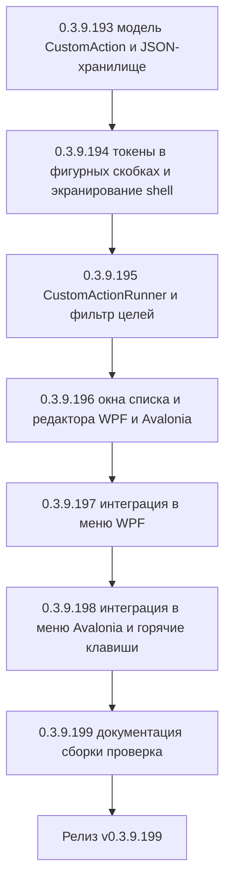

# PLAN — цикл 0.3.9.193–0.3.9.199 — Функция 7: пользовательские пункты контекстного меню (скрипты)

Репозиторий [`sivatorov/ConfigurationManagement`](https://github.com/sivatorov/ConfigurationManagement),
локальная копия `f:\Yandex.Disk\h\Configuration_Management`, ветка `main`.
Локальный HEAD — **0.3.9.192** (версия в
[`Configuration Management.csproj`](../Configuration%20Management/Configuration%20Management.csproj:62),
бейдж в [`README.md`](../README.md:3), верхняя запись в [`CHANGELOG.md`](../CHANGELOG.md:12));
в работе циклы журнала регистрации (0.3.9.161–0.3.9.166), планировщика ОС (0.3.9.167–0.3.9.171)
и уведомлений (0.3.9.180–0.3.9.186). Новый цикл стартует **после их завершения**; нумерация
может сместиться на фактический HEAD — перед стартом первого этапа исполнитель сверяет версию
в csproj (риск п. 6).

Режим: Архитектор (план) → задачи-исполнители в режиме **code** (`new_task` по одному на этап).
**Один этап = одна версия = один коммит.** План-файл остаётся untracked (`plans/` в
`.codeassistantignore`); CHANGELOG/README/csproj коммитятся. Это **новая функция** (собственная
дорожная карта): комментарии к issues не публикуются; в CHANGELOG заголовок — «Добавлено».

---

## 1. Сводка цикла

| № | Версия | Суть | Приоритет |
|---|--------|------|-----------|
| 1 | 0.3.9.193 | Модель пользовательского действия: `Models/CustomAction.cs` (имя, команда-шаблон, shell, область применения `CustomActionScope`, признак мультивыделения, горячая клавиша, «без подтверждения», таймаут, экранирование значений, рабочая папка); хранилище `Services/ICustomActionsStore.cs` + `Services/CustomActionsStore.cs` (единый JSON `custom_actions.json` по образцу `CustomConfigTypesStore`, атомарная запись); регистрация в DI; тесты | 1 |
| 2 | 0.3.9.194 | Расширение `ScriptParameterResolver`: токены в фигурных скобках `{ИмяБазы}` наравне с `%name%`; русские и канонические алиасы (`{СтрокаПодключения}`, `{Каталог}`, `{ПутьИБ}`, `{Id}`, `{Тип}`, `{Сервер}`, `{ИмяНаСервере}`, `{ИмяГруппы}`, `{Пользователь}`, `{Пароль}` и др.); экранирование значений для shell (`EscapeForShell`, флаг `EscapeValues`); тесты новых токенов и экранирования | 1 |
| 3 | 0.3.9.195 | Механика выполнения: `Services/CustomActionRunner.cs` (чистая сборка командной строки, выполнение одной базы через `ExternalCommandRunner.RunAsync` с таймаутом, параллельный запуск пакета `Task.WhenAll`, результат, маскирование пароля в логе); `Services/CustomActionFilter.cs` (отбор действий по контексту: одиночная база / мультивыделение / группа; фильтрация видимых целей с учётом приватности); `ViewModels/CustomActionEditViewModel.cs` (валидация, `ApplyTo`, список токенов, превью); мост выполнения `ViewModels/MainViewModel.CustomActions.cs` (цели, подтверждение, история запусков базы, лог, уведомление, индикация выполнения); тесты (fake runner, фильтрация, мультивыделение, VM) | 1 |
| 4 | 0.3.9.196 | Окна обеих платформ: `Views/CustomActionsWindow.xaml`+`.xaml.cs` (WPF) и `Views/CustomActionsWindow.Avalonia.cs` (Linux) — список действий с кнопками Добавить/Изменить/Удалить; `Views/CustomActionEditWindow.xaml`+`.xaml.cs` и `.Avalonia.cs` — форма действия (имя, команда, область, shell, флажки, таймаут, хоткей, рабочая папка, список токенов, живое превью); ключи локализации ru/en; подключение окон в csproj | 1 |
| 5 | 0.3.9.197 | Интеграция WPF: подменю «Пользовательские действия…» в контекстном меню дерева (база/группа), наполнение в `OnBaseContextMenu_Opened` (область, мультивыделение, приватность, режим «Пользователь»), пункт «Настроить действия…», подтверждение по умолчанию (`AppSettings.ConfirmCustomActions`), индикация выполнения, журналирование в историю запусков базы | 1 |
| 6 | 0.3.9.198 | Интеграция Avalonia: подменю в `BuildRowContextMenu` + наполнение в `Opening`; горячие клавиши действий (обе платформы: `MainWindow.Hotkeys.cs` / `MainWindow.Avalonia.Hotkeys.cs`); тесты построения меню через `CustomActionFilter` | 1 |
| 7 | 0.3.9.199 | Документация (CHANGELOG/README/ARCHITECTURE), полные сборки Windows+Linux, сквозная ручная проверка (одиночная база, мультивыделение, группа, приватные базы, отказ подтверждения, таймаут, хоткей) | 2 |



---

## 2. Общие требования к КАЖДОМУ этапу

1. Реализация на обеих платформах (Windows/WPF + Linux/Avalonia), где применимо; чистые
   сервисы/VM — без платформенных зависимостей; платформенные реализации — символы условной
   компиляции (`#if WINDOWS` / `#if LINUX`) или отдельные файлы `*.Avalonia.cs`, как у
   [`ServerMonitorWindow`](../Configuration%20Management/Views/ServerMonitorWindow.Avalonia.cs:1)
   и [`ServerMonitorWindow.xaml.cs`](../Configuration%20Management/Views/ServerMonitorWindow.xaml.cs:1).
2. Инкремент версии в [`Configuration Management.csproj`](../Configuration%20Management/Configuration%20Management.csproj:62)
   (строки 62–65: Version/AssemblyVersion/FileVersion/InformationalVersion) на 1 патч.
3. Запись в [`CHANGELOG.md`](../CHANGELOG.md:12) (сверху, раздел «Добавлено») и обновление
   бейджа версии в [`README.md`](../README.md:3).
4. Тесты: `dotnet test` зелёный и `dotnet build -p:BuildLinux=true` без ошибок.
5. Один коммит (без пуша); без ключевых слов автозакрытия issues. Образец сообщения:
   `0.3.9.193: пользовательские действия — модель и JSON-хранилище`.
6. Все пункты плана перед исполнением сверить с фактическим кодом (адреса строк могут сместиться;
   циклы 0.3.9.161–171 и 0.3.9.180–186 ещё в работе и могут затронуть `MainWindow`/`MainViewModel`/
   `SettingsWindow`).
7. **Перед этапом 0.3.9.194 проверить актуальную сигнатуру** [`ScriptParameterResolver`](../Configuration%20Management/Services/ScriptParameterResolver.cs:30)
   (`TokenPattern`, `Resolve`, `BuildValueMap`) и состояние [`ScriptScenarioStore`](../Configuration%20Management/Services/ScriptScenarioStore.cs:14) —
   расширение резолвера обязано сохранить обратную совместимость со сценариями (issue #308).

---

## 3. Дизайн

### 3.1. Текущий фундамент (что переиспользуется)

- [`ExternalCommandRunner`](../Configuration%20Management/Services/ExternalCommandRunner.cs:21) —
  выполнение произвольных команд через системный shell: `RunAsync(command, timeoutMs)` с
  ожиданием и таймаутом (по умолчанию `DefaultPreCommandTimeoutMs = 30_000`), `RunDetached`,
  `ResolveShellWrapper(shell, command, isWindows)` (cmd/powershell/sh/auto),
  `CreateProcessStartInfo`. Ошибка/таймаут возвращают `false` и НЕ роняют вызывающий код.
- [`ScriptParameterResolver`](../Configuration%20Management/Services/ScriptParameterResolver.cs:30) —
  чистая подстановка токенов `%ключ%`: `BuildValueMap(Infobase)` строит карту значений
  (динамическая рефлексия по скалярным свойствам `Infobase`/`ConnectionSettings` + явные ключи
  `name`, `connection.*`, `password`, `date`); `Resolve(template, values, now, leaveUnknown)`.
- [`ScriptScenarioStore`](../Configuration%20Management/Services/ScriptScenarioStore.cs:14) /
  [`CustomConfigTypesStore`](../Configuration%20Management/Services/CustomConfigTypesStore.cs:20) —
  образцы хранилищ: отдельные JSON-файлы на сущность / единый читаемый JSON с атомарной записью
  (`*.tmp` + `File.Move(overwrite:true)`), `UnsafeRelaxedJsonEscaping`, битые файлы не роняют загрузку.
- Контекстное меню базы/группы: **WPF** — статичный XAML
  [`MainWindow.xaml:2435`](../Configuration%20Management/Views/MainWindow.xaml:2435) с обработчиком
  [`OnBaseContextMenu_Opened`](../Configuration%20Management/Views/MainWindow.Columns.cs:74)
  (видимость пунктов по `Tag` — "User"/"Batch"; блок мультивыделения `BatchOperationsMenu`);
  **Avalonia** — [`BuildRowContextMenu`](../Configuration%20Management/Views/MainWindow.Avalonia.Tree.cs:1851)
  (код, подменю, `batchMenu.IsVisible` обновляется в `menu.Opening`). Меню общее для строк базы
  и группы; контекст определяется состоянием VM: `SelectedInfobase` ≠ null (база),
  `SelectedGroupNode` ≠ null (группа), `BatchSelectedCount > 1` (мультивыделение).
- Целевые наборы баз: [`BatchSelectedInfobases`](../Configuration%20Management/ViewModels/MainViewModel.Batch.cs:43),
  `SelectedGroupNode.FullPath`, фильтр видимых приватных баз
  [`ConnectionReplacementPlanner.FilterVisibleInfobases`](../Configuration%20Management/Services/ConnectionReplacementPlanner.cs)
  и отбор областей [`SelectCandidates`](../Configuration%20Management/Services/ConnectionReplacementPlanner.cs)
  (AllBases/BatchSelected/CurrentGroup) — готовый механизм выбора целей для действия.
- Журналирование в историю запусков базы:
  [`Infobase.AddLaunchHistory(mode, details)`](../Configuration%20Management/Models/Infobase.cs:881) +
  `Save()` — точный образец [`RunScriptAsync`](../Configuration%20Management/ViewModels/MainViewModel.Scripts.cs:79).
- Уведомления: [`INotificationService.Show(title, message, kind, evt)`](../Configuration%20Management/Services/INotificationService.cs:33).
- Маскирование секретов: [`SensitiveDataMasker`](../Configuration%20Management/Services/SensitiveDataMasker.cs:6)
  (internal; для действий добавляется маскирование подставленного значения пароля в логе/истории).

### 3.2. Модель действия и хранилище (этап 0.3.9.193)

Новые типы в `Models/` (чистый .NET, обе платформы):

```csharp
// Models/CustomAction.cs
namespace Configuration_Management.Models;

/// <summary>Область применения пользовательского действия в контекстных меню.</summary>
public enum CustomActionScope
{
    Base,   // только в меню базы (одиночная/выбранная)
    Group,  // только в меню группы (выполняется для всех баз группы)
    Both    // и в меню базы, и в меню группы
}

/// <summary>
/// Пользовательское действие (функция 7): произвольная команда/скрипт через системный shell
/// с подстановкой параметров выбранной базы. Хранится в JSON-файле custom_actions.json
/// (см. Services.CustomActionsStore).
/// </summary>
public class CustomAction
{
    /// <summary>Идентификатор действия (GUID).</summary>
    public string Id { get; set; } = Guid.NewGuid().ToString("N");

    /// <summary>Имя действия — показывается в контекстном меню.</summary>
    public string Name { get; set; } = "";

    /// <summary>
    /// Команда/шаблон скрипта (одна строка). Поддерживаются токены %...% и {...}:
    /// {ИмяБазы}, {СтрокаПодключения}, {Каталог}, {ПутьИБ}, {Id}, {Тип}, {Сервер},
    /// {ИмяНаСервере}, {ИмяГруппы}, {Пользователь}, {Пароль}, {Дата} и др.
    /// Передаётся системному shell как есть (после подстановки).
    /// </summary>
    public string Command { get; set; } = "";

    /// <summary>Интерпретатор (shell): Auto — по платформе (cmd.exe/sh).</summary>
    public ScriptShell Shell { get; set; } = ScriptShell.Auto;

    /// <summary>Область применения: база / группа / обе.</summary>
    public CustomActionScope Scope { get; set; } = CustomActionScope.Both;

    /// <summary>
    /// Показывать действие в блоке мультивыделения «Для выделенных (N)…»: при true
    /// команда выполняется для каждой выделенной базы (параллельно).
    /// </summary>
    public bool SupportsBatch { get; set; }

    /// <summary>Выполнять без подтверждения (индивидуальный признак действия).</summary>
    public bool RunWithoutConfirm { get; set; }

    /// <summary>
    /// Экранировать подставляемые значения для выбранного shell (по умолчанию true):
    /// имя базы, пути и пр. оборачиваются в кавычки/экранируются спецсимволы —
    /// команда безопасна при пробелах и спецсимволах в значениях.
    /// </summary>
    public bool EscapeValues { get; set; } = true;

    /// <summary>Таймаут ожидания завершения команды (мс), как pre-команды: по умолчанию 30 с.</summary>
    public int TimeoutMs { get; set; } = ExternalCommandRunner.DefaultPreCommandTimeoutMs;

    /// <summary>Горячая клавиша действия (опционально), например «F8» или «Ctrl+Alt+F8».</summary>
    public string Hotkey { get; set; } = "";

    /// <summary>Рабочая папка процесса (опционально); пусто — наследуется каталог приложения.</summary>
    public string WorkingDirectory { get; set; } = "";
}
```

Хранилище — единый читаемый JSON-файл `custom_actions.json` в каталоге данных профиля
(рядом с `settings.json`), по образцу [`CustomConfigTypesStore`](../Configuration%20Management/Services/CustomConfigTypesStore.cs:20):

```csharp
// Services/ICustomActionsStore.cs
public interface ICustomActionsStore
{
    /// <summary>Путь к файлу действий (каталог данных профиля / явный override для тестов).</summary>
    string FilePath { get; }

    /// <summary>Загружает все действия (битый файл — пустой список, сортировка по имени).</summary>
    IReadOnlyList<CustomAction> LoadAll();

    /// <summary>Сохраняет действие (создаёт или перезаписывает запись по Id; атомарная запись).</summary>
    void Save(CustomAction action);

    /// <summary>Удаляет действие по Id.</summary>
    void Delete(string id);

    /// <summary>Возвращает действие по Id или null.</summary>
    CustomAction? Get(string id);
}
```

- `CustomActionsStore(IProfileService? profileService = null, string? directoryOverride = null)` —
  `FilePath = Path.Combine(dataDir, "custom_actions.json")`; `dataDir` — как в
  `CustomConfigTypesStore.DataDirectory` (override → профиль → `PlatformPaths.AppDataDirectory`).
- Сериализация: `WriteIndented = true`, `JavaScriptEncoder.UnsafeRelaxedJsonEscaping`,
  `JsonStringEnumConverter` (Shell/Scope строкой — миграция чисел не нужна, но чтение принимает и числа).
- Нормализация при чтении: null-строки → пустые, `TimeoutMs <= 0` → дефолт 30 000,
  пустое имя/команда — запись пропускается (как `ScriptScenarioStore.LoadAll` с `Name`).
- Регистрация в [`AppServices.cs`](../Configuration%20Management/AppServices.cs:39):
  `services.AddSingleton<ICustomActionsStore, CustomActionsStore>();`.

### 3.3. Расширение резолвера (этап 0.3.9.194)

[`ScriptParameterResolver`](../Configuration%20Management/Services/ScriptParameterResolver.cs:30)
расширяется БЕЗ изменения поведения существующих сценариев (issue #308):

1. **Два синтаксиса токенов**: прежний `%ключ%` сохраняется; добавляется `{ключ}`.
   Составной паттерн: `(%([^%]+)%|\{([^{}]+)\})` — замена `TokenPattern`; ключ извлекается
   из соответствующей группы. `Resolve` работает с обоими формами (обратная совместимость).
2. **Алиасы в `BuildValueMap`** (ключи регистронезависимы, русские и канонические имена):
   - `имябазы` → `Name` (алиас `name`);
   - `строкаподключения` → `Connection.ToConnectionString()`;
   - `каталог` и `путиб` → `Connection.FilePath`;
   - `id` → `Infobase.Id` (уже есть динамически через рефлексию — явно для гарантии);
   - `тип` → `Connection.Type.ToString()` («File»/«ClientServer»/«WebServer»);
   - `сервер` → `Connection.Server`; `имянасервере` → `Connection.DatabaseName`;
   - `имягруппы` → `Infobase.Group`;
   - `пользователь` → `Connection.User`; `пароль` → `Connection.Password`;
   - `вебurl` → `Connection.WebUrl`; `порт` → `Connection.Port.ToString()`;
   - `дата` / `дата:Формат` — обработчик даты уже есть, распространяется на `{...}`.
   Динамическая рефлексия продолжает подхватывать будущие свойства; явные ключи перезаписывают.
3. **Экранирование для shell** (новый публичный метод):

   ```csharp
   /// <summary>Экранирует значение для безопасной вставки в команду выбранного shell.</summary>
   public static string EscapeForShell(string? value, ScriptShell shell);
   ```

   - `Cmd` (cmd.exe): `"значение"` — двойные кавычки, внутренние кавычки удваиваются (`""`);
   - `Sh` (/bin/sh): `'значение'` — одинарные кавычки, `'` внутри → `'\''`;
   - `PowerShell`: `'значение'` — одинарные кавычки, `'` внутри → `''`;
   - `Auto`: по текущей платформе (Windows → Cmd, Linux → Sh).
   Пустое значение → пустая строка (без кавычек). Для превью и тестов используется
   перегрузка с явным `bool? isWindows`.
4. **Флаг `EscapeValues` в `Resolve`**: новый опциональный параметр
   `bool escapeValues = false, ScriptShell? shell = null` — при `true` каждое подставленное
   значение пропускается через `EscapeForShell(value, shell ?? Auto)`. Существующие вызовы
   без параметра сохраняют прежнее поведение (false). Значения токена `date` НЕ экранируются
   (дата безопасна и форматируется пользователем).
5. **Чистая сборка команды действия** (для выполнения, превью и лога):

   ```csharp
   /// <summary>Тело команды действия: подстановка токенов с учётом EscapeValues и Shell.</summary>
   public static string BuildActionCommandLine(
       CustomAction action, Infobase? infobase, DateTime? now = null);

   /// <summary>Полная командная строка с обёрткой интерпретатора (для превью и лога).</summary>
   public static string BuildActionShellCommandLine(
       CustomAction action, Infobase? infobase, DateTime? now = null, bool? isWindows = null);
   ```

   Реальный запуск выполняет тело (`BuildActionCommandLine`) через
   `ExternalCommandRunner.RunAsync` с `action.Shell` — без повторной обёртки (как
   [`RunScriptAsync`](../Configuration%20Management/ViewModels/MainViewModel.Scripts.cs:87)).

### 3.4. Выполнение, фильтр целей и VM (этап 0.3.9.195)

#### `Services/CustomActionRunner.cs` — чистый оркестратор (обе платформы)

```csharp
/// <summary>Результат выполнения действия для одной базы.</summary>
public sealed record CustomActionRunResult(Infobase Infobase, bool Success, bool TimedOut, string? Error);

public sealed class CustomActionRunner
{
    // Делегат выполнения: по умолчанию ExternalCommandRunner.RunAsync; в тестах — fake.
    public CustomActionRunner(Func<string, int, CancellationToken, bool>? executeAsync = null);

    /// <summary>Собирает тело команды действия для базы (резолвер + EscapeValues).</summary>
    public string BuildCommandLine(CustomAction action, Infobase infobase, DateTime? now = null);

    /// <summary>Полная команда с обёрткой интерпретатора — для истории запусков и лога.</summary>
    public string BuildLogCommandLine(CustomAction action, Infobase infobase, DateTime? now = null);

    /// <summary>Маскирует секреты (значение {Пароль}) в командной строке для лога.</summary>
    public static string MaskSecrets(string commandLine, string? password);

    /// <summary>
    /// Выполняет действие для одной базы: команда через shell с ожиданием и таймаутом
    /// (action.TimeoutMs); ошибка/таймаут возвращают false и НЕ блокируют остальные базы.
    /// </summary>
    public Task<CustomActionRunResult> RunOneAsync(CustomAction action, Infobase infobase, CancellationToken ct);

    /// <summary>
    /// Выполняет действие для набора баз ПАРАЛЛЕЛЬНО (Task.WhenAll). Возвращает результаты
    /// по всем базам; исключения внутри каждой задачи гасятся (успех остальных не зависит).
    /// </summary>
    public Task<IReadOnlyList<CustomActionRunResult>> RunBatchAsync(
        CustomAction action, IReadOnlyList<Infobase> targets, CancellationToken ct);
}
```

Ключевые решения:

- `RunOneAsync`: `command = BuildCommandLine(action, ib)`; если пустая — результат
  `Success=false, Error=«пустая команда»`. Исполнитель: `executeAsync ?? ExternalCommandRunner.RunAsync`.
  Рабочая папка и видимость окна — по действию (`WorkingDirectory`, окно скрыто всегда:
  `createNoWindow: true` — команды действий выполняются фоном).
- Параллельность пакета — `Task.WhenAll` без ограничения (число выделенных баз обычно
  невелико; при необходимости лимит добавится позже — вне рамок цикла).
- `MaskSecrets`: заменяет точное значение пароля базы на `***` в команде/логе (пустой
  пароль — без изменений). В `SensitiveDataMasker` добавляется внутренний метод
  `MaskValue(text, secret)`; переиспользуется для истории запусков и `IAppLogger`.

#### `Services/CustomActionFilter.cs` — чистая логика меню (обе платформы)

```csharp
/// <summary>Контекст вызова действия (чем определяется набор целей и видимость).</summary>
public enum CustomActionContext { SingleBase, Batch, Group }

public static class CustomActionFilter
{
    /// <summary>
    /// Отбирает действия для контекста:
    /// SingleBase → Scope in {Base, Both};
    /// Batch     → SupportsBatch == true (Scope не важен — применяется к выделенным базам);
    /// Group     → Scope in {Group, Both}.
    /// Результат — в исходном порядке (порядок списка действий из хранилища).
    /// </summary>
    public static IReadOnlyList<CustomAction> SelectActions(
        IReadOnlyList<CustomAction> actions, CustomActionContext context);

    /// <summary>
    /// Фильтрует цели по видимости: приватные базы при заблокированном профиле
    /// (canShowPrivateBases == false) исключаются. Оборачивает существующий
    /// ConnectionReplacementPlanner.FilterVisibleInfobases — единая точка политики.
    /// </summary>
    public static IReadOnlyList<Infobase> FilterVisibleTargets(
        IReadOnlyList<Infobase> targets, bool canShowPrivateBases);
}
```

#### `ViewModels/CustomActionEditViewModel.cs` — чистая форма (обе платформы)

По образцу [`ScriptScenarioEditViewModel`](../Configuration%20Management/ViewModels/ScriptScenarioEditViewModel.cs:35):

- Поля: `Name`, `Command` (однострочный TextBox или многострочный — команда может быть
  скриптом; редактор принимает многострочную), `SelectedScope` (`CustomActionScope`),
  `SelectedShell` (`ScriptShell` + `ShellOptions`), `SupportsBatch`, `RunWithoutConfirm`,
  `EscapeValues` (default true), `TimeoutMs` (int, min 1000), `Hotkey`, `WorkingDirectory`.
- `Validate()` → ключ локализации ошибки или null: `CustomAction.NameRequired`,
  `CustomAction.CommandRequired`, `CustomAction.TimeoutInvalid` (≤ 0 или > 10 минут).
- `ApplyTo(CustomAction action)` — перенос полей; `Id` не трогается (как issue #308).
- Список токенов: `AvailableTokens` — `ScriptTokenHint` на русские/канонические токены
  (переиспользование `%…%`-токенов из сценариев + новые `{…}`); двойной клик вставляет токен.
- Живое превью: `BuildExampleCommandLine(draft, SelectedExampleBase)` через
  `ScriptParameterResolver.BuildActionShellCommandLine` (пример выбранной базы, как в
  [`ScriptPickWindow`](../Configuration%20Management/Views/ScriptPickWindow.xaml.cs:65)).
- `ViewModels/CustomActionItemViewModel.cs` — строка списка окна (Name, Scope, Command-превью,
  Hotkey) с колбэками Edit/Delete, по образцу
  [`ScriptScenarioItemViewModel`](../Configuration%20Management/ViewModels/ScriptScenarioItemViewModel.cs:14).

#### Мост `ViewModels/MainViewModel.CustomActions.cs` (общий, без `#if`)

- `public IReadOnlyList<CustomAction> CustomActions { get; }` — кэш, загружается при старте
  из `ICustomActionsStore` и после каждого открытия окна настроек.
- `public ICommand ShowCustomActionsSettingsCommand` — окно `CustomActionsWindow`
  (платформенный метод открытия — в `MainViewModel.CustomActions.Windows.cs` /
  `MainViewModel.Avalonia.CustomActions.cs`, как у `ShowScriptsSettingsCommand`).
- `public bool IsCustomActionRunning { get; }` + `public string RunningCustomActionText { get; }` —
  индикация выполнения: во время запуска другие действия недоступны
  (`CanExecute`), текст в статус-баре/заголовке пункта.
- `public async Task ExecuteCustomActionAsync(CustomAction action, CustomActionContext context)`:
  1. Определение целей: `SingleBase` → `SelectedInfobase` (если не null и видим);
     `Batch` → `BatchSelectedInfobases`; `Group` → базы текущей группы через
     `ConnectionReplacementPlanner.SelectCandidates` (область CurrentGroup) поверх
     `FilterVisibleInfobases`. Пустые цели → `CustomAction.NoTargets`, выход.
  2. Подтверждение: если `!action.RunWithoutConfirm && AppSettings.ConfirmCustomActions` —
     `ShowConfirm` с предупреждением `CustomAction.Confirm.Format` (имя действия + число баз,
     текст «выполняет произвольные команды»). Отказ — выход.
  3. `IsCustomActionRunning = true`; `runner.RunBatchAsync(action, targets, ct)`.
  4. Журналирование: для каждой базы `AddLaunchHistory("Действие:" + action.Name, maskedCommand)`
     + `Save()`; `_logger.Info` с `MaskSecrets`; уведомление `INotificationService.Show`
     со сводкой (`CustomAction.DoneSummaryFormat`: успешно N / ошибок M).
  5. `IsCustomActionRunning = false` (в `finally`).
- `AppSettings.ConfirmCustomActions` (bool, default **true**) — глобальный переключатель
  подтверждения («Подтверждать выполнение пользовательских действий») в окне настроек.

### 3.5. Окна (этап 0.3.9.196)

Сценарий: пользователь открывает «Утилиты → Пользовательские действия…» (и/или «Настроить
действия…» из контекстного меню). Окно списка: ListBox/DataGrid действий (имя, область,
хоткей, превью команды), кнопки «Добавить», «Изменить», «Удалить» (с подтверждением
`CustomAction.DeleteConfirm`). Редактор: форма с полями п. 3.4, списком токенов и живым
превью; сохранение через `ICustomActionsStore.Save`, удаление — `Delete`; после закрытия —
`MainViewModel` перечитывает кэш (подменю актуализируется при следующем открытии).

Окна:

- **WPF** [`Views/CustomActionsWindow.xaml`](../Configuration%20Management/Views/CustomActionsWindow.xaml:1)
  + `.xaml.cs` (`#if WINDOWS`): ListView + кнопки; `CustomActionEditWindow.xaml` + `.xaml.cs` —
  форма с `DataContext = CustomActionEditViewModel`; `DialogResult` по «Сохранить»/«Отмена».
- **Avalonia** [`Views/CustomActionsWindow.Avalonia.cs`](../Configuration%20Management/Views/CustomActionsWindow.Avalonia.cs:1)
  и `Views/CustomActionEditWindow.Avalonia.cs` (`#if LINUX`): code-behind-построение
  (StackPanel/Grid/ListBox) по образцу `ScriptScenariosWindow.Avalonia.cs` /
  `ScriptScenarioEditWindow.Avalonia.cs`; модальность через `ModalWindowBase` + `ShowDialogSync`.
- Подключение в [`Configuration Management.csproj`](../Configuration%20Management/Configuration%20Management.csproj:120):
  WPF-ветка — `<Page>`/`Compile` для `.xaml`/`.xaml.cs`, Linux-ветка — `Compile Include` для `.Avalonia.cs`.
- Локализация: все ключи `CustomAction.*` в `ru.json`/`en.json` (п. 7).

### 3.6. Интеграция в контекстное меню WPF (этап 0.3.9.197)

- В [`MainWindow.xaml`](../Configuration%20Management/Views/MainWindow.xaml:2444) после пункта
  «Выполнить скрипт» добавляется подменю `x:Name="CustomActionsMenu"` `Tag="User"`
  (действия — пользовательская настройка, работают и в режиме «Пользователь»):

  ```xml
  <MenuItem x:Name="CustomActionsMenu" Tag="User" Header="{loc:Loc Main.CustomActionsMenu}"
            Style="{DynamicResource ModernMenuItem}">
      <MenuItem.Icon><materialDesign:PackIcon Kind="CodeBraces" Width="16" Height="16" Foreground="#06B6D4"/></MenuItem.Icon>
  </MenuItem>
  ```

- [`OnBaseContextMenu_Opened`](../Configuration%20Management/Views/MainWindow.Columns.cs:74)
  (или отдельный помощник `MainWindow.CustomActions.cs`) при каждом открытии ПЕРЕСТРАИВАЕТ
  содержимое `CustomActionsMenu`:

  1. Контекст: `BatchSelectedCount > 1` → Batch (заголовок `Main.CustomActionsBatchTitle`
     с числом); иначе `SelectedInfobase != null` → SingleBase; иначе
     `SelectedGroupNode != null` → Group; иначе пункты скрыты.
  2. Действия из `_viewModel.CustomActions` через `CustomActionFilter.SelectActions`;
     цели проверяются `FilterVisibleTargets` (приватные скрытые — исключены; при
     заблокированном профиле и приватной цели пункт не показывается).
  3. Пункты: имя действия (иконка CodeBraces/#06B6D4, `InputGestureText = action.Hotkey`),
     `Click` → `async void` → `_viewModel.ExecuteCustomActionAsync(action, context)`.
     Во время `IsCustomActionRunning` пункты `IsEnabled=false`.
  4. Внизу — разделитель и пункт «Настроить действия…» (`Main.CustomActionsSettings`,
     открывает окно списка).
  5. Разделители вокруг подменю прячутся, если действий нет (единый механизм п. 3.6.3
     уже скрывает разделители в restricted-режиме; для пустого подменю — `Visibility.Collapsed`).
- Avalonia-эквивалент появится на этапе 0.3.9.198; сигнатура общего помощника
  `MainViewModel.CustomActions.cs` одна для обеих платформ.

### 3.7. Интеграция в контекстное меню Avalonia и горячие клавиши (этап 0.3.9.198)

- [`BuildRowContextMenu`](../Configuration%20Management/Views/MainWindow.Avalonia.Tree.cs:1851):
  после пункта «Выполнить скрипт» (`Script.RunTitle`) — подменю
  `Main.CustomActionsMenu`; наполнение в `menu.Opening` по тем же правилам п. 3.6
  (контекст, фильтр, приватность, индикация, «Настроить действия…»).
- Горячие клавиши: `MainViewModel.CustomActions.cs` предоставляет
  `IReadOnlyDictionary<string, CustomAction> HotkeyCustomActions` (key — нормализованное
  сочетание, например «F8»). Регистрация:
  - WPF — [`MainWindow.Hotkeys.cs`](../Configuration%20Management/Views/MainWindow.Hotkeys.cs:321)
    (механизм `PreviewKeyDown`/bookmarks): при нажатии сочетания выполняется действие для
    текущего контекста (SelectedInfobase / мультивыделение / группа), с тем же
    подтверждением и индикацией.
  - Avalonia — `MainWindow.Avalonia.Hotkeys.cs`: `KeyBindings`/обработчик нажатий.
  - Конфликты: горячие клавиши действий валидируются в редакторе (предупреждение о занятой
    комбинации — по списку существующих `HotkeyRunScript`/`HotkeyEnterprise` и т.д. — минимально:
    дубли среди самих действий запрещены); отображаются в подменю (`InputGestureText`).

### 3.8. Безопасность и приватность

- **Предупреждение**: текст подтверждения явно сообщает, что действие выполняет произвольную
  команду в системном shell, и показывает имя действия + число затрагиваемых баз
  (`CustomAction.Confirm.Format`). По умолчанию подтверждение ВКЛЮЧЕНО (`ConfirmCustomActions = true`);
  снимается глобально в настройках или индивидуально флагом «Выполнять без подтверждения».
- **Приватные базы**: цели всегда проходят `FilterVisibleTargets` (п. 3.4): скрытая приватная
  база не может стать целью (она и не выбираема в UI); страховочная проверка дублируется в
  `ExecuteCustomActionAsync` перед запуском. При заблокированном профиле действия для приватных
  баз не показываются и не выполняются.
- **Пароль**: значение `{Пароль}` подставляется в команду (это необходимо для выполнения),
  но в историю запусков, лог и уведомления пишется `MaskSecrets`-версия команды.
- **Таймаут**: каждая команда выполняется с `action.TimeoutMs` (по умолчанию 30 с);
  превышение — принудительное завершение процесса (`ExternalCommandRunner.RunAsync`),
  результат помечается как неуспех, но НЕ блокирует остальные базы (как pre-команды).

---

## 4. Тесты

### 4.1. Этап 0.3.9.193 — `CustomActionsStoreTests`

- `Save` создаёт файл `custom_actions.json` в override-каталоге; повторный `Save` по тому же
  `Id` перезаписывает запись (не плодит дубликат); разные `Id` — обе записи на месте.
- `LoadAll` возвращает действия, отсортированные по имени (OrdinalIgnoreCase); отсутствие
  файла/каталога → пустой список.
- `Delete` удаляет по Id; неизвестный Id — no-op; удаление несуществующего файла не бросает.
- Битый/невалидный JSON → пустой список (загрузка остальных функций не падает).
- Нормализация: запись с пустым именем пропускается; `TimeoutMs <= 0` → 30 000; null-поля → пустые.
- Сериализация enum: `Shell`/`Scope` записываются строками («Auto», «Both»), читаются строки и числа.
- Кириллица в имени/команде сохраняется читаемой UTF-8 (не `\uXXXX`).
- Атомарность: запись идёт через `.tmp` + `Move(overwrite:true)` (проверка отсутствия `.tmp` после сохранения).

### 4.2. Этап 0.3.9.194 — `ScriptParameterResolverTests` (расширение)

- Токены `{...}`: `{ИмяБазы}`, `{СтрокаПодключения}`, `{Каталог}`/`{ПутьИБ}`, `{Id}`, `{Тип}`,
  `{Сервер}`, `{ИмяНаСервере}`, `{ИмяГруппы}`, `{Пользователь}`, `{Пароль}`, `{ВебURL}`, `{Порт}` —
  подставляют ожидаемые значения (файловая и клиент-серверная базы, WebServer).
- Смешанный синтаксис в одной строке: `%name%|{ИмяБазы}` → одинаковые значения.
- `{Дата}` / `{Дата:yyyyMMdd}` — как `%date%` (фиксированный `now`).
- Неизвестный токен: `leaveUnknown=true` остаётся в строке (и в `{}`, и в `%`), `false` — пустая строка.
- `EscapeForShell`: Cmd — `"значение с пробелами"` и удвоение `"` внутри; Sh — одинарные кавычки,
  `'` → `'\''`; PowerShell — `'...'` и `'` → `''`; пустое значение → пустая строка; Auto по `isWindows`.
- `Resolve(..., escapeValues: true)`: `{ИмяБазы}` для базы «Бухгалтерия (тест)» в sh → `'Бухгалтерия (тест)'`;
  date-токен НЕ экранируется; `escapeValues: false` — как раньше (без кавычек).
- `BuildActionCommandLine` / `BuildActionShellCommandLine`: тело с токенами, обёртка
  `cmd.exe /c …` / `/bin/sh -c …` / `powershell -NoProfile -Command …` по `Shell` действия;
  превью соответствует реальной команде.
- **Регрессия**: все существующие тесты `%name%`/`%connection.*%`/`%date%` проходят без изменений.

### 4.3. Этап 0.3.9.195 — `CustomActionRunnerTests`, `CustomActionFilterTests`, `CustomActionEditViewModelTests`

- **Runner (fake-исполнитель `Func<string,int,CancellationToken,bool>`)**: успех (true) →
  `Success`; код ошибки/исключение исполнителя → `Success=false`; таймаут (переданный timeout
  = `action.TimeoutMs`) → `TimedOut`; пустая команда → `Success=false` без вызова исполнителя.
- **Batch**: `RunBatchAsync` вызывает исполнитель для КАЖДОЙ базы (число вызовов = N, команды
  различаются подстановкой имени); одна база с ошибкой не отменяет остальные (все результаты
  возвращаются); порядок результатов соответствует порядку целей.
- **Маскирование**: `MaskSecrets(commandLine, password)` заменяет значение пароля (в т.ч. в
  экранированном виде `"pass"`/`'pass'`) на `***`; пустой пароль — строка без изменений.
- **Фильтр**: `SelectActions` для SingleBase (только Base/Both), Batch (только `SupportsBatch`),
  Group (только Group/Both); `FilterVisibleTargets` исключает приватные базы при
  `canShowPrivateBases=false`, оставляет при `true`; пустой список действий → пусто.
- **VM редактора**: валидация (пустое имя/команда/некорректный таймаут → ключи ошибок);
  `ApplyTo` переносит все поля и не меняет `Id`; превью `BuildExampleCommandLine` строит
  команду для выбранной базы примера; список `AvailableTokens` содержит новые `{…}`-токены.
- **Мост `MainViewModel`** (через реальный VM с фейковыми сервисами, как `Etap13ListStateTests`):
  `ExecuteCustomActionAsync` для SingleBase выбирает `SelectedInfobase`; Batch — только
  `BatchSelectedInfobases`; Group — базы текущей группы (фейковый список с группами);
  приватная цель при заблокированном профиле исключается; подтверждение вызывает диалог при
  `ConfirmCustomActions=true` (фейковый `IDialogService`) и пропускается при
  `RunWithoutConfirm=true`; в историю запусков пишется запись `Действие:<имя>` с
  маскированной командой; `IsCustomActionRunning` true во время выполнения и false после;
  ошибка таймаута не роняет выполнение остальных.

### 4.4. Этапы 0.3.9.196–0.3.9.199

- Регрессия: `dotnet test` целиком и `dotnet build -p:BuildLinux=true` на каждом этапе.
- Ручной чек (0.3.9.199): действие области Base — пункт в меню одиночной базы, подстановка
  `{ИмяБазы}`/`{СтрокаПодключения}`/`{Каталог}`/`{Id}`/`{Тип}` в команде (например, запись в
  файл-отчёт), подтверждение по умолчанию и отказ; действие `RunWithoutConfirm`; действие
  области Group — в меню группы выполняется для всех баз группы; действие `SupportsBatch` —
  в блоке «Для выделенных (N)…», параллельный запуск, независимость ошибок; таймаут
  (команда `ping`/`sleep 40` → ошибка через 30 с, остальные базы выполнены); приватная база
  при заблокированном профиле — действия не видны; разблокировка — видны; хоткей действия
  работает для выбранной базы; в истории запусков команда без пароля; уведомление о сводке;
  «Настроить действия…» из меню открывает окно списка, правки сразу видны в подменю.

---

## 5. Таблица декомпозиции задач

| № | Версия | Файлы (новые/изменяемые) | Тесты | Риски и митигации |
|---|--------|--------------------------|-------|-------------------|
| 1 | 0.3.9.193 | **New:** `Models/CustomAction.cs` (`CustomAction`, `CustomActionScope`), `Services/ICustomActionsStore.cs`, `Services/CustomActionsStore.cs`. **Edit:** `AppServices.cs` (регистрация `ICustomActionsStore`); при необходимости csproj (`Compile Include`) | `CustomActionsStoreTests` (п. 4.1) | Формат файла конфликтует с будущими версиями → версия схемы в файле не нужна (список сущностей, как `custom_config_types.json`); кириллица/enum → `UnsafeRelaxedJsonEscaping` + `JsonStringEnumConverter`; битый файл → пустой список (ручная правка файла допустима) |
| 2 | 0.3.9.194 | **Edit:** `Services/ScriptParameterResolver.cs` (составной `TokenPattern`, алиасы `BuildValueMap`, `EscapeForShell`, параметр `escapeValues`/`shell` в `Resolve`, `BuildActionCommandLine`, `BuildActionShellCommandLine`), `ConfigurationManagement.Tests/ScriptParameterResolverTests.cs` | Расширение `ScriptParameterResolverTests` (п. 4.2) + регрессия существующих | Поломка существующих сценариев → только аддитивные изменения, дефолты `escapeValues=false` и прежний `TokenPattern` сохраняют поведение; конфликт `{}` с форматом пользователя → составной паттерн обрабатывает оба синтаксиса, `leaveUnknown` прежний; неверное экранирование ломает команду → `EscapeValues=true` по умолчанию только у ДЕЙСТВИЙ (сценарии не затронуты), тесты по всем shell |
| 3 | 0.3.9.195 | **New:** `Services/CustomActionRunner.cs` (`CustomActionRunResult`), `Services/CustomActionFilter.cs` (`CustomActionContext`), `ViewModels/CustomActionEditViewModel.cs`, `ViewModels/CustomActionItemViewModel.cs`, `ViewModels/MainViewModel.CustomActions.cs`. **Edit:** `Services/SensitiveDataMasker.cs` (`MaskValue`), `Models/AppSettings.cs` (`ConfirmCustomActions`), `Localization/Languages/ru.json`+`en.json` (ключи статусов VM: `CustomAction.NoTargets`, `Confirm.Format`, `DoneSummaryFormat`, `Running`), `AppServices.cs` (нет — runner создаётся с дефолтным делегатом; при необходимости singleton) | `CustomActionRunnerTests`, `CustomActionFilterTests`, `CustomActionEditViewModelTests`, тесты моста `MainViewModel` (п. 4.3) | Параллельный пакет при ошибке одной базы → исключения гасятся внутри задачи, `Task.WhenAll` не бросает; пароль в лог → `MaskSecrets` для истории/логгера/уведомлений; тяжёлый `MainViewModel` → тесты через реальный VM с фейковыми сервисами (образец `Etap13ListStateTests`) |
| 4 | 0.3.9.196 | **New:** `Views/CustomActionsWindow.xaml`+`.xaml.cs` (WPF), `Views/CustomActionsWindow.Avalonia.cs`, `Views/CustomActionEditWindow.xaml`+`.xaml.cs`, `Views/CustomActionEditWindow.Avalonia.cs`. **Edit:** `Configuration Management.csproj` (подключение окон в обе ветки), `Localization/Languages/ru.json`+`en.json` (ключи окон: заголовки, поля, кнопки, подписи областей, токены) | Логика покрыта этапами 1–3; здесь — сборки обеих платформ + регрессия. Ручной чек: окно списка открывается из «Утилит», добавление/редактирование/удаление, превью команды | Разные жизненные циклы окон → тонкие обёртки, вся логика в общем VM; превью с токенами → `BuildActionShellCommandLine` с примером базы (как `ScriptPickWindow`); окно без сохранения → кэш VM не перечитывается (подменю актуализируется при открытии) |
| 5 | 0.3.9.197 | **Edit:** `Views/MainWindow.xaml` (подменю `CustomActionsMenu`), `Views/MainWindow.Columns.cs` (наполнение в `OnBaseContextMenu_Opened` или новый `MainWindow.CustomActions.cs`), `Models/AppSettings.cs` (настройка подтверждения), `SettingsViewModel.cs`/окно настроек (флажок `ConfirmCustomActions`), `Localization/Languages/ru.json`+`en.json` (ключи меню и настроек) | Регрессия сборок + ручной чек по п. 4.4 (база/группа/мультивыделение/приватность/подтверждение). Тесты фильтра — этап 3 | Меню перестраивается в `Opened` → контейнер `CustomActionsMenu` очищается и наполняется заново (как batch-блок); Tag="User" → действия доступны в режиме «Пользователь» (пользовательская настройка), но приватные цели исключаются фильтром; индикация выполнения → пункты `IsEnabled=false` при `IsCustomActionRunning` |
| 6 | 0.3.9.198 | **Edit:** `Views/MainWindow.Avalonia.Tree.cs` (`BuildRowContextMenu` + `Opening`), `Views/MainWindow.Avalonia.*` (пункты меню/хоткеи), `Views/MainWindow.Hotkeys.cs`, `Views/MainWindow.Avalonia.Hotkeys.cs` (регистрация хоткеев действий), `ViewModels/MainViewModel.CustomActions.cs` (`HotkeyCustomActions`) | Регрессия + ручной чек хоткеев (действие для выбранной базы, конфликт с F5 и др. показывает дубль в редакторе). Тесты фильтра уже покрывают построение подменю | Хоткей конфликтует с системными → редактор запрещает дубли среди действий и предупреждает о занятых системных сочетаниях (список известных `Hotkey*`); Avalonia `Opening` не срабатывает при пустом меню → подменю скрывается целиком, когда действий нет |
| 7 | 0.3.9.199 | **Edit:** `CHANGELOG.md`, `README.md` (бейдж + раздел возможностей), `ARCHITECTURE.md` (связка `CustomAction` → `CustomActionStore` → `CustomActionRunner`/`CustomActionFilter` → `MainViewModel.CustomActions` → меню обеих платформ; ограничения: только подстановка токенов, таймаут 30 с по умолчанию, одно подтверждение, приватные базы); полные сборки Windows+Linux | Сквозная ручная проверка по п. 4.4 | Различия поведения меню WPF/Avalonia → общий `MainViewModel.CustomActions.cs` и `CustomActionFilter`, платформенные файлы только строят пункты; пароль в команде → маскирование проверяется в ручном чеке истории запусков |

---

## 6. Риски (сводно) и митигации

| Риск | Митигация |
|------|-----------|
| Расширение резолвера ломает существующие сценарии запуска скриптов (issue #308) | Только аддитивные изменения: составной паттерн токенов, новые опциональные параметры с прежними дефолтами; полная регрессия `ScriptParameterResolverTests` |
| Экранирование значений ломает пользовательские команды (например, подстановка внутри своих кавычек) | Флаг `EscapeValues` у действия (по умолчанию true) можно выключить; токены `{Пароль}` и пути в экранированном виде проверены тестами по cmd/sh/PowerShell |
| Произвольная команда выполняет опасные действия | Подтверждение по умолчанию (`ConfirmCustomActions=true`) с текстом «выполняет произвольные команды»; индивидуальный флаг «без подтверждения» — осознанный выбор пользователя; документирование в README |
| Пароль базы попадает в историю запусков/лог/уведомления | `CustomActionRunner.MaskSecrets` (замена значения на `***`) для всех каналов журналирования; в `SensitiveDataMasker` добавлен `MaskValue` |
| Приватные (скрытые) базы становятся целями действия | Единая точка `CustomActionFilter.FilterVisibleTargets` (обёртка `FilterVisibleInfobases`); дублирующая проверка в `ExecuteCustomActionAsync`; при заблокированном профиле действия для приватных не показываются |
| Таймаут одной базы блокирует мультивыделение | `ExternalCommandRunner.RunAsync` принудительно завершает процесс по таймауту и возвращает false; пакет выполняется параллельно, ошибка одной базы не влияет на остальные |
| Конфликт горячих клавиш действий с системными | Валидация в редакторе: дубли среди действий запрещены, известные системные сочетания (`HotkeyRunScript` F5, `HotkeyEnterprise` и др.) помечаются предупреждением; отображение хоткея в пункте меню |
| Меню WPF статично в XAML, Avalonia пересобирается кодом — расходятся | Весь отбор действий — в чистом `CustomActionFilter` + `MainViewModel.CustomActions.cs`; платформенные файлы только строят пункты (как существующие пакетные операции) |
| Циклы 0.3.9.161–171 / 0.3.9.180–186 в работе могут затронуть `MainWindow`/`MainViewModel` | Перед каждым этапом исполнитель сверяет адреса и сигнатуры с фактическим кодом (п. 2.6); при конфликте — актуализация плана |
| Большая группа — действие выполняется для многих баз | Подтверждение показывает число целей; параллельный запуск с таймаутами; сводка по завершении; ограничение параллелизма не требуется (число баз в группе обычно невелико) |
| Дубликат Id в файле действий (ручная правка) | `Save` перезаписывает по Id; `LoadAll` нормализует и пропускает записи без имени; дубликаты Id не ломают выполнение (выполняются оба пункта меню — допустимо) |

---

## 7. Локализация (новые ключи, ru/en)

- `Main.CustomActionsMenu` — «Пользовательские действия…» / «Custom actions…»;
  `Main.CustomActionsBatchTitle` — «Пользовательские действия для выделенных ({0})…»;
  `Main.CustomActionsSettings` — «Настроить действия…»;
- `CustomAction.WindowTitle` — «Пользовательские действия», `CustomAction.SettingsTitle` —
  «Утилиты → Пользовательские действия»;
- `CustomAction.AddTitle` («Новое действие»), `CustomAction.EditTitle` («Редактирование действия»),
  `CustomAction.DeleteTitle` («Удаление действия»), `CustomAction.DeleteConfirm`
  («Удалить действие «{0}»?»);
- `CustomAction.Name` («Наименование»), `CustomAction.NameRequired` («Укажите наименование действия.»),
  `CustomAction.Command` («Команда (скрипт)»), `CustomAction.CommandHint`
  («Подстановки: {ИмяБазы}, {СтрокаПодключения}, {Каталог}, {Id}, {Тип}, {Сервер}, {ИмяНаСервере} и др.»),
  `CustomAction.CommandRequired` («Укажите команду.»);
- `CustomAction.Scope` («Область применения»), `CustomAction.Scope.Base` («База»),
  `CustomAction.Scope.Group` («Группа»), `CustomAction.Scope.Both` («База и группа»);
- `CustomAction.SupportsBatch` («Показывать для выделенных (N) баз»),
  `CustomAction.RunWithoutConfirm` («Выполнять без подтверждения»),
  `CustomAction.EscapeValues` («Экранировать подставляемые значения для shell»),
  `CustomAction.TimeoutMs` («Таймаут ожидания, сек»), `CustomAction.TimeoutInvalid`
  («Таймаут должен быть от 1 до 600 секунд.»),
  `CustomAction.Hotkey` («Горячая клавиша (необязательно)»),
  `CustomAction.HotkeyConflict` («Сочетание занято другим действием.»),
  `CustomAction.WorkingDirectory` («Рабочая папка (пусто — каталог приложения)»);
- `CustomAction.Tokens` («Подстановки»), `CustomAction.TokensHint`
  («Двойной клик — вставить токен в команду»), `CustomAction.ExampleBase` («База для примера»),
  `CustomAction.Preview` («Командная строка:»);
- `CustomAction.TokenName` («имя базы»), `.TokenConnectionString` («строка подключения»),
  `.TokenCatalog` («каталог файловой базы»), `.TokenPath` («путь ИБ»), `.TokenId` («Id базы»),
  `.TokenType` («тип подключения»), `.TokenServer` («сервер»), `.TokenDatabase` («имя базы на сервере»),
  `.TokenGroup` («имя группы»), `.TokenUser` («пользователь»), `.TokenPassword` («пароль»),
  `.TokenDate` («текущая дата»);
- `CustomAction.Confirm.Title` — «Выполнить пользовательское действие»,
  `CustomAction.Confirm.Format` — «Выполнить действие «{0}» для {1} баз? Оно запускает
  произвольную команду в системном shell.», `CustomAction.NoTargets`
  («Нет доступных баз для выполнения действия.»),
  `CustomAction.Running` («Выполняется действие «{0}»…»),
  `CustomAction.DoneSummaryFormat` («Действие «{0}»: успешно — {1}, ошибок — {2}.»);
- `Settings.Bases.ConfirmCustomActions` — «Подтверждать выполнение пользовательских действий»;
- `Notify.CustomActionDone` — «Действие «{0}» завершено: успешно — {1}, ошибок — {2}»;
- `CustomAction.Shell.Auto` — переиспользовать `Script.Shell.Auto` (существующий ключ).

---

## 8. Порядок исполнения

1. Утвердить план (режим Architect).
2. `new_task` (режим **code**) на 0.3.9.193 → … → 0.3.9.199 последовательно; каждый этап —
   отдельная версия/коммит с CHANGELOG/README/бейджем, `dotnet test` + Linux-сборка.
3. До старта 0.3.9.194 исполнитель проверяет актуальные сигнатуры
   [`ScriptParameterResolver`](../Configuration%20Management/Services/ScriptParameterResolver.cs:30)
   и [`ScriptScenarioStore`](../Configuration%20Management/Services/ScriptScenarioStore.cs:14)
   (п. 2.7); до 0.3.9.197 — фактический состав `MainWindow.xaml`/`OnBaseContextMenu_Opened`;
   до 0.3.9.198 — `BuildRowContextMenu` и механизм хоткеев.
4. После 0.3.9.199 — сквозная проверка по п. 4.4 и финальный релиз-ноут.

---

## 9. Что сознательно НЕ входит в цикл

- Область «Все базы» для действия (только база / мультивыделение / группа) — добавляется
  позже при необходимости (механизм `SelectCandidates(AllBases)` уже готов).
- Условная логика и переменные в команде — только подстановка токенов (как у сценариев).
- Автоматический запуск действий по расписанию/событиям — действия выполняются только
  по запросу пользователя из контекстного меню/горячей клавиши.
- Многоуровневая история выполненных действий и повтор последнего действия из «Утилит».
- Политика разрешений/ACL на уровне действий (все действия одинаково доступны пользователю
  профиля; подтверждение — единственный общий барьер).
- Перенос действий между профилями/машинами (JSON-файл можно скопировать вручную —
  документируется, импорт-экспорт не делается).
- Подстановка параметров в прежнем формате «`%connection.password%`» уже существует —
  новые русские токены добавляются, старые не удаляются и не переименовываются.