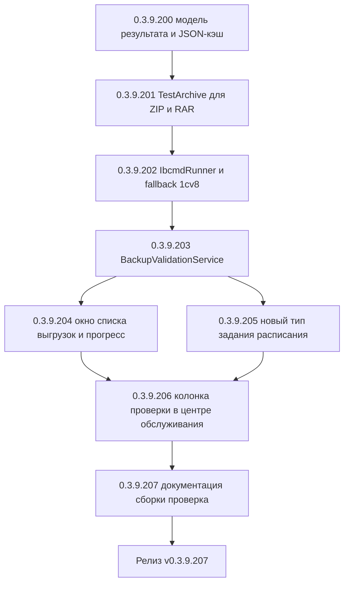

# PLAN — цикл 0.3.9.200–0.3.9.207 — Функция 8: проверка резервных копий тестовым восстановлением

Репозиторий [`sivatorov/ConfigurationManagement`](https://github.com/sivatorov/ConfigurationManagement),
локальная копия `f:\Yandex.Disk\h\Configuration_Management`, ветка `main`.
Локальный HEAD — **0.3.9.199** (версия в
[`Configuration Management.csproj`](../Configuration%20Management/Configuration%20Management.csproj:62),
бейдж в [`README.md`](../README.md:3), верхняя запись в [`CHANGELOG.md`](../CHANGELOG.md:12));
в работе циклы журнала регистрации (0.3.9.161–166), планировщика ОС (0.3.9.167–171)
и уведомлений (0.3.9.180–186). Новый цикл стартует **после их завершения**; нумерация
может сместиться на фактический HEAD — перед стартом первого этапа исполнитель сверяет версию
в csproj (риск п. 6).

Режим: Архитектор (план) → задачи-исполнители в режиме **code** (`new_task` по одному на этап).
**Один этап = одна версия = один коммит.** План-файл остаётся untracked (`plans/` в
`.codeassistantignore`); CHANGELOG/README/csproj коммитятся. Это **новая функция** (собственная
дорожная карта): комментарии к issues не публикуются; в CHANGELOG заголовок — «Добавлено».

---

## 1. Сводка цикла

| № | Версия | Суть | Приоритет |
|---|--------|------|-----------|
| 1 | 0.3.9.200 | Модель результата проверки и кэш: `Models/BackupValidationStatus.cs`, `Models/BackupValidationDepth.cs`, `Models/BackupValidationResult.cs`, `Services/IBackupValidationCacheStore.cs` + `Services/BackupValidationCacheStore.cs` (единый JSON-файл `backup_validation_cache.json`, атомарная запись, нормализация, признак устаревания по fingerprint файла); регистрация в DI; тесты | 1 |
| 2 | 0.3.9.201 | Механика архивов: расширение `IArchiveService` методом `TestArchive(path, depth)` + реализация в `ArchiveService` (ZIP — открытие/чтение записей и CRC через `ZipArchive`; RAR — `rar t`/`lt` внешним архиватором); тесты (валидный/повреждённый/пустой/обрезанный zip, Fast vs Full, недоступный архиватор) | 1 |
| 3 | 0.3.9.202 | Исполнитель ibcmd/1cv8: `Services/IbcmdRunner.cs` (чистая сборка аргументов `infobase restore`, запуск процесса с захватом вывода и таймаутом, парсинг результата по коду возврата и тексту), разрешение бинарника через `OneCPlatformLocator.FindInBinDir("ibcmd")` + fallback на 1cv8 `/RestoreIB`; тесты сборки аргументов и парсинга вывода | 1 |
| 4 | 0.3.9.203 | `Services/BackupValidationService.cs`: выбор механики по расширению (.dt — восстановление ibcmd/1cv8 во временную файловую базу; .cf — распаковка во временную базу приёмом `ConfigurationDiffService.PrepareSnapshotFromCf`; .zip/.rar — `TestArchive`), глубина Fast/Full, временные каталоги `%TEMP%\cm_backupval_<guid>` с гарантированным удалением, результат и запись в кэш; тесты стратегий и интеграции с fake-раннерами | 1 |
| 5 | 0.3.9.204 | UI «Список выгрузок»: колонка «Проверка» (статус + дата), кнопка «Проверить выбранные копии», окно прогресса `Views/BackupValidationProgressWindow.xaml`+`.xaml.cs` и `.Avalonia.cs` с журналом по каждой копии (по образцу `ConfigDiffProgressWindow`); тесты `ExportsListViewModel` (отображение статусов, фильтры выбора) | 1 |
| 6 | 0.3.9.205 | Расписание: `ScheduledTaskKind.BackupValidation` в `Models/ScheduledTask.cs` + поля глубины/области, `ScheduledTaskEditViewModel`/окна (WPF+Avalonia), `SchedulerService.RunBackupValidationAsync`, уведомление через `INotificationService` (событие `ScheduledTask`); тесты VM и планировщика (fake-сервис) | 1 |
| 7 | 0.3.9.206 | «Центр обслуживания»: колонка «Проверка копий» в `MaintenanceCenterRowViewModel` (агрегат статусов копий базы из кэша), учёт повреждённых копий в фильтре «Только проблемы», HTML-отчёт; тесты агрегации | 2 |
| 8 | 0.3.9.207 | Документация (CHANGELOG/README/ARCHITECTURE), полные сборки Windows+Linux, сквозная ручная проверка (каждый формат, глубина, расписание, ЦО, повреждённая копия) | 2 |



---

## 2. Общие требования к КАЖДОМУ этапу

1. Реализация на обеих платформах (Windows/WPF + Linux/Avalonia), где применимо; чистые
   сервисы/VM — без платформенных зависимостей; платформенные реализации — символы условной
   компиляции (`#if WINDOWS` / `#if LINUX`) или отдельные файлы `*.Avalonia.cs`, как у
   [`ServerMonitorWindow`](../Configuration%20Management/Views/ServerMonitorWindow.Avalonia.cs:1)
   и [`ServerMonitorWindow.xaml.cs`](../Configuration%20Management/Views/ServerMonitorWindow.xaml.cs:1).
2. Инкремент версии в [`Configuration Management.csproj`](../Configuration%20Management/Configuration%20Management.csproj:62)
   (строки 62–65: Version/AssemblyVersion/FileVersion/InformationalVersion) на 1 патч.
3. Запись в [`CHANGELOG.md`](../CHANGELOG.md:12) (сверху, раздел «Добавлено») и обновление
   бейджа версии в [`README.md`](../README.md:3).
4. Тесты: `dotnet test` зелёный и `dotnet build -p:BuildLinux=true` без ошибок.
5. Один коммит (без пуша); без ключевых слов автозакрытия issues. Образец сообщения:
   `0.3.9.200: проверка резервных копий — модель результата и кэш`.
6. Все пункты плана перед исполнением сверить с фактическим кодом (адреса строк могут сместиться;
   циклы 0.3.9.161–186 ещё в работе и могут затронуть `MainWindow`/`MainViewModel`/
   `SettingsWindow`/`NotificationDispatcher`).
7. **Перед этапом 0.3.9.202 проверить**:
   - сигнатуру [`OneCPlatformLocator.ResolveBinDirectory`](../Configuration%20Management/Services/OneCPlatformLocator.cs:21)
     и [`FindInBinDir`](../Configuration%20Management/Services/OneCPlatformLocator.cs:54) —
     основа поиска `ibcmd`/`1cv8`;
   - доступность ibcmd в bin установленной платформы (Windows: `ibcmd.exe`, Linux: `ibcmd`);
     если бинарник не найден ни в одной установленной версии — применяется fallback на
     конфигуратор 1cv8 `/RestoreIB` (этап 0.3.9.202).
8. **Перед этапом 0.3.9.203** сверить приём распаковки `.cf` с фактическим кодом
   [`ConfigurationDiffService.PrepareSnapshotFromCf`](../Configuration%20Management/Services/ConfigurationDiffService.cs:104)
   (`OneCLauncher.CreateInfoBase` с `/UseTemplate` + `RunDesignerBatch(DumpConfigToFiles)`) —
   переиспользуется без дублирования.

---

## 3. Дизайн

### 3.1. Текущий фундамент (что переиспользуется)

- [`BackupService`](../Configuration%20Management/Services/BackupService.cs:16) / `IBackupService` —
  создание копий (`DumpIB`/`DumpCfg` через `OneCLauncher.RunDesignerBatch`), упаковка ZIP/RAR через
  `IArchiveService.CreateArchive`, ротация [`BackupRotation`](../Configuration%20Management/Services/BackupRotation.cs:1),
  метка `Infobase.LastBackupUtc`. Восстановление в реальную базу — только `/RestoreIB` конфигуратора.
- [`IArchiveService`](../Configuration%20Management/Services/IArchiveService.cs:10) /
  [`ArchiveService`](../Configuration%20Management/Services/ArchiveService.cs:14) — ZIP через
  `ZipFile`, RAR через внешний `winrar/rar` (`CanProduce`, `ResolveRarExecutable`, таймаут 10 мин).
  НЕ имеет метода «тест целостности» — добавляется на этапе 0.3.9.201.
- [`BackupScenario`](../Configuration%20Management/Models/BackupScenario.cs:12) — формат
  Dt/Cf/Zip/Rar, каталоги назначения, шаблон имени, префикс базы, ротация; источник «какие файлы
  принадлежат сценарию» для проверки по расписанию.
- [`BackupExportItem`](../Configuration%20Management/Models/BackupExportItem.cs:9) +
  [`ExportsListViewModel`](../Configuration%20Management/ViewModels/ExportsListViewModel.cs:12) —
  сканирование каталогов сценариев и `AppSettings.BackupTargetDirectories` на `.dt/.cf/.zip/.rar`;
  окно [`ExportsListWindow.xaml`](../Configuration%20Management/Views/ExportsListWindow.xaml:1)
  (WPF) и [`ExportsListWindow.Avalonia.cs`](../Configuration%20Management/Views/ExportsListWindow.Avalonia.cs:19)
  (Linux): колонки Файл/Каталог/Размер/Дата, кнопки Обновить/Восстановить/Открыть папку.
- Распаковка `.cf` во временную файловую ИБ уже реализована в
  [`ConfigurationDiffService.PrepareSnapshotFromCf`](../Configuration%20Management/Services/ConfigurationDiffService.cs:104)
  и [`MetadataExplorerService`](../Configuration%20Management/Services/MetadataExplorerService.cs:58):
  `OneCLauncher.CreateInfoBase(platformVersion, isFile:true, filePath: ibDir, templatePath: cfPath)`
  + `RunDesignerBatch(DumpConfigToFiles)`; временный каталог `%TEMP%\cm_configdiff_<guid>`
  удаляется в `finally`. Приём переиспользуется для проверки `.cf`.
- Поиск бинарников платформы: [`OneCPlatformLocator`](../Configuration%20Management/Services/OneCPlatformLocator.cs:14)
  (`ResolveBinDirectory` + `FindInBinDir("ibcmd")` / `"1cv8"`).
- Запуск процессов: [`ExternalCommandRunner`](../Configuration%20Management/Services/ExternalCommandRunner.cs:21)
  (`RunAsync` с таймаутом, `CreateProcessStartInfo`); для ibcmd требуется **захват вывода**
  (stdout/stderr) — новый `IbcmdRunner` использует собственный `ProcessStartInfo` с
  `RedirectStandardOutput/Error`, по образцу `UpdateService`/`ArchiveService.RunArchiver`.
- Расписание: [`ScheduledTask`](../Configuration%20Management/Models/ScheduledTask.cs:8)
  (`ScheduledTaskKind`), [`IScheduledTaskStore`](../Configuration%20Management/Services/IScheduledTaskStore.cs:9)
  (JSON по файлу на задание), [`SchedulerService`](../Configuration%20Management/Services/SchedulerService.cs:17)
  (`ExecuteAsync` — switch по типу, `SaveResult`, `NotifyJobFinished`),
  [`ScheduledTaskEditViewModel`](../Configuration%20Management/ViewModels/ScheduledTaskEditViewModel.cs:28)
  (`KindOptions`, `NeedsScenario/NeedsInfobase/NeedsCfgFile`, `Validate`, `ApplyTo`), окна
  `ScheduledTasksWindow`/`ScheduledTaskEditWindow` (WPF + Avalonia).
- «Центр обслуживания»: [`MaintenanceCenterRowViewModel`](../Configuration%20Management/ViewModels/MaintenanceCenterViewModel.cs:15)
  (колонка `LastBackupText` из `Infobase.LastBackupDisplay`, фильтр `HasProblem`),
  [`MaintenanceCenterViewModel`](../Configuration%20Management/ViewModels/MaintenanceCenterViewModel.cs:209);
  HTML-отчёт [`MainViewModel.HtmlReport.cs`](../Configuration%20Management/ViewModels/MainViewModel.HtmlReport.cs:1).
- Уведомления: [`INotificationService.Show(title, message, kind, evt)`](../Configuration%20Management/Services/INotificationService.cs:33),
  мультиканальный `NotificationDispatcher` (функция №5); категории —
  [`NotificationEvent`](../Configuration%20Management/Services/NotificationModels.cs:27)
  (`Backup`, `ScheduledTask`, `Update`, `ManualTest`) — для результата проверки используется
  существующее событие `ScheduledTask` (задания) и `Backup` (ручная проверка из списка выгрузок).
- Образцы окон прогресса с журналом: [`ConfigDiffProgressWindow`](../Configuration%20Management/Views/ConfigDiffProgressWindow.cs:1)
  / `.Avalonia.cs`, `CloneServerProgressWindow`, `MetadataExplorerProgressWindow`.
- Хранилища-образцы: [`CustomActionsStore`](../Configuration%20Management/Services/CustomActionsStore.cs:16),
  [`CustomConfigTypesStore`](../Configuration%20Management/Services/CustomConfigTypesStore.cs:13) —
  единый JSON с атомарной записью (`*.tmp` + `File.Move(overwrite:true)`),
  `UnsafeRelaxedJsonEscaping`, битые файлы не роняют загрузку.

### 3.2. Модель результата проверки и кэш (этап 0.3.9.200)

Новые типы в `Models/` (чистый .NET, обе платформы):

```csharp
// Models/BackupValidationStatus.cs
/// <summary>Статус проверки резервной копии.</summary>
public enum BackupValidationStatus
{
    NotChecked, // копия не проверялась или устарела после изменения файла
    Valid,      // копия валидна
    Corrupt     // копия повреждена (восстановление/чтение не удалось)
}

// Models/BackupValidationDepth.cs
/// <summary>Глубина проверки: быстрая структура или полное тестовое восстановление.</summary>
public enum BackupValidationDepth
{
    /// <summary>Быстро: структура/целостность заголовка (для .cf — CreateInfoBase,
    /// для .zip/.rar — чтение каталога архива, для .dt — проверка сигнатуры и размера).</summary>
    Fast,

    /// <summary>Полно: тестовое восстановление (.dt — restore ibcmd/1cv8 во временную базу,
    /// .cf — CreateInfoBase + DumpConfigToFiles, .zip/.rar — полный тест CRC/распаковка).</summary>
    Full
}

// Models/BackupValidationResult.cs
/// <summary>
/// Результат проверки одной резервной копии. Хранится в JSON-кэше
/// (см. Services.BackupValidationCacheStore) и отображается в «Списке выгрузок»
/// и «Центре обслуживания».
/// </summary>
public class BackupValidationResult
{
    /// <summary>Полный путь к проверенному файлу (нормализованный, регистронезависимая база).</summary>
    public string FilePath { get; set; } = "";

    /// <summary>Статус проверки.</summary>
    public BackupValidationStatus Status { get; set; } = BackupValidationStatus.NotChecked;

    /// <summary>Тип ошибки при повреждении (ключ локализации) или null при успехе.</summary>
    public string? ErrorKind { get; set; }

    /// <summary>Текст ошибки/детали (вывод ibcmd, сообщение архиватора).</summary>
    public string? ErrorDetail { get; set; }

    /// <summary>Глубина выполненной проверки.</summary>
    public BackupValidationDepth Depth { get; set; } = BackupValidationDepth.Fast;

    /// <summary>Дата и время проверки (локальное).</summary>
    public DateTime CheckedAt { get; set; }

    /// <summary>Длительность проверки (например "00:04:32").</summary>
    public TimeSpan Duration { get; set; }

    /// <summary>Размер файла в байтах на момент проверки.</summary>
    public long SizeBytes { get; set; }

    /// <summary>
    /// Отпечаток файла на момент проверки (размер + LastWriteTimeUtc):
    /// если файл изменился после проверки — кэш считается устаревшим (NotChecked).
    /// </summary>
    public string Fingerprint { get; set; } = "";

    /// <summary>Текст для колонки «Проверка» (статус + дата).</summary>
    public string DisplayText => ...; // по Status/CheckedAt через LocalizationManager
}
```

Хранилище — единый читаемый JSON `backup_validation_cache.json` в каталоге данных профиля
(рядом с `custom_actions.json`), по образцу [`CustomActionsStore`](../Configuration%20Management/Services/CustomActionsStore.cs:16):

```csharp
// Services/IBackupValidationCacheStore.cs
public interface IBackupValidationCacheStore
{
    /// <summary>Путь к файлу кэша (override для тестов / каталог профиля).</summary>
    string FilePath { get; }

    /// <summary>Загружает все результаты (битый файл — пустой список).</summary>
    IReadOnlyList<BackupValidationResult> LoadAll();

    /// <summary>Возвращает результат по пути файла или null.</summary>
    BackupValidationResult? Get(string filePath);

    /// <summary>Сохраняет результат (атомарная запись по пути).</summary>
    void Save(BackupValidationResult result);

    /// <summary>Удаляет запись по пути (при удалении файла копии).</summary>
    void Delete(string filePath);
}
```

Ключевые решения:

- **Ключ кэша — нормализованный полный путь** (`Path.GetFullPath`, сравнение
  `StringComparer.OrdinalIgnoreCase`). Не зависит от GUID сценария — работает и для ручных
  копий в настраиваемых каталогах.
- **Устаревание**: `Fingerprint = $"{size}|{lastWriteUtc:o}"`; при отображении, если текущий
  fingerprint файла отличается от сохранённого — строка показывается как «не проверена»
  (кэш не перезаписывается до следующей реальной проверки).
- **Чтение** не роняет UI: битый JSON/исключения → пустой список; нормализация null-полей.
- Регистрация в [`AppServices.cs`](../Configuration%20Management/AppServices.cs:39):
  `services.AddSingleton<IBackupValidationCacheStore, BackupValidationCacheStore>();`.

### 3.3. Механика проверки по типу файла и глубина

Единая стратегия выбирается **по расширению** файла (чистая функция, тестируется):

| Расширение | Fast (структура) | Full (тестовое восстановление) |
|------------|------------------|--------------------------------|
| `.dt` | Чтение первых байтов (сигнатура `1CDT`/заголовок выгрузки) + отсутствие обрыва (размер ≥ минимального, `File.ReadAllBytes` не бросает) | `ibcmd infobase restore` во временную файловую базу `%TEMP%\cm_backupval_<guid>\ib` (приоритет) или 1cv8 `/RestoreIB` во временную базу (fallback); после — гарантированное удаление каталога |
| `.cf` | `OneCLauncher.CreateInfoBase(isFile:true, templatePath: cfPath)` — успешное создание временной базы из шаблона означает, что конфигурация прочитана | Дополнительно `RunDesignerBatch(DumpConfigToFiles)` во временный каталог (как `MetadataExplorerService`) — полная выгрузка XML без ошибок |
| `.zip` | Открыть `ZipArchive`, перечислить записи (центральный каталог читается, CRC не проверяется) | Прочитать каждую запись (`entry.Open()` + полный `CopyTo` через `Crc32`-подсчёт / просто чтение потока) — выявляет повреждённые блоки |
| `.rar` | `rar lt` (список) внешним архиватором — каталог читается | `rar t` (test) — полная проверка; если архиватор недоступен (`CanProduce(Rar)==false`) — статус Corrupt с `ErrorKind=BackupValidation.RarUnavailable` |

Решение по `.dt` клиент-серверной базы: **восстановление выполняется в файловую временную базу** —
файл `.dt` самодостаточен и не привязан к типу исходной ИБ; ibcmd поддерживает
`infobase restore <file.dt> --db-path=<каталог файловой базы>` (сверить синтаксис на
установленной версии при реализации). Исходная клиент-серверная ИБ при этом не участвует —
ограничение «база не должна быть запущена» для тестовой проверки НЕ требуется (затрагивается
только временная база); для `/RestoreIB`-fallback тоже используется **созданная** временная
файловая база (CREATEINFOBASE), а не существующая. Если файл `.dt` в момент проверки
заблокирован (запущена выгрузка этой же копии, файл открыт) — пропуск с
`ErrorKind=BackupValidation.FileLocked` и статусом Corrupt (предупреждение в журнале).

### 3.4. `IbcmdRunner` (этап 0.3.9.202)

Чистый вспомогательный класс (обе платформы):

```csharp
// Services/IbcmdRunner.cs
public static class IbcmdRunner
{
    /// <summary>Собирает команду восстановления .dt в файловую базу ibcmd.</summary>
    public static string BuildRestoreArguments(string dtPath, string dbPath);

    /// <summary>
    /// Выполняет команду ibcmd с захватом stdout/stderr и таймаутом.
    /// Возвращает код выхода, объединённый вывод и признак таймаута.
    /// </summary>
    public static Task<IbcmdRunResult> RunAsync(
        string ibcmdPath, string arguments, TimeSpan timeout, CancellationToken ct);

    /// <summary>
    /// Определяет успех: код выхода == 0 и в выводе нет маркеров ошибок
    /// («Ошибка», «error», «не удалось», «failed» в тексте). Возвращает текст ошибки.
    /// </summary>
    public static string? DetectFailure(int exitCode, string output);
}
```

- Разрешение бинарника: `OneCPlatformLocator.ResolveBinDirectory(infobase)` (для копии сценария
  исходная база может быть неизвестна — тогда новейшая установленная версия)
  + `FindInBinDir(binDir, "ibcmd")`. На Windows — `ibcmd.exe`, на Linux — `ibcmd`.
- Fallback: если `ibcmd` не найден — сборка команды 1cv8 (`OneCLauncher.CreateInfoBase` для
  временной файловой базы + `RunDesignerBatch(RestoreIB, dtPath)`), повторно используя
  `WaitForBatchAsync`-паттерн из [`ConfigurationDiffService`](../Configuration%20Management/Services/ConfigurationDiffService.cs:203).
- Захват вывода: `ProcessStartInfo` с `RedirectStandardOutput/Error=true`, `CreateNoWindow=true`,
  асинхронное чтение (`ReadToEndAsync` параллельно по обоим потокам, чтобы не было дедлока
  буфера), таймаут — принудительный `Kill`.
- Оценка скорости/рисков: `ibcmd restore` обычно быстрее конфигуратора (без старта DESIGNER)
  и не требует интерактивных диалогов; риски — отсутствие ibcmd в старых версиях платформы
  (fallback), иной формат сообщений в разных версиях (парсинг по маркерам, а не по строкам),
  долгий restore больших баз (таймаут по умолчанию 60 минут, настраивается).

### 3.5. `BackupValidationService` (этап 0.3.9.203)

```csharp
// Services/BackupValidationService.cs
/// <summary>Параметры проверки одной копии.</summary>
public sealed class BackupValidationRequest
{
    public required string FilePath { get; init; }
    public BackupValidationDepth Depth { get; init; } = BackupValidationDepth.Full;
    public string? PlatformVersion { get; init; }   // предпочтительная версия платформы (из базы/сценария)
    public BackupCredential? Credential { get; init; } // для fallback-восстановления 1cv8 (опционально)
    public TimeSpan Timeout { get; init; } = TimeSpan.FromMinutes(60);
}

public sealed class BackupValidationService
{
    /// <summary>Выбирает стратегию по расширению (чистый метод — для тестов).</summary>
    public static BackupValidationStrategy SelectStrategy(string filePath);

    /// <summary>Проверяет одну копию, пишет результат в кэш и возвращает его.</summary>
    public Task<BackupValidationResult> ValidateAsync(
        BackupValidationRequest request,
        IProgress<string>? progress = null,
        CancellationToken ct = default);
}
```

Ключевые решения:

- `ValidateAsync` — `Task.Run`; внутри `Stopwatch`; временный корень
  `%TEMP%\cm_backupval_<guid>`; удаление в `finally` (`TryDeleteDirectory` — паттерн
  `ConfigurationDiffService`).
- Порядок: 1) проверка `File.Exists` и незанятости (попытка открыть поток на чтение);
  2) выбор стратегии по расширению; 3) Fast/Full по запросу; 4) заполнение `BackupValidationResult`
  (статус, длительность, размер, fingerprint, детали); 5) `IBackupValidationCacheStore.Save`.
- Для `.cf` переиспользуется приём `ConfigurationDiffService`: `CreateInfoBase` с `/UseTemplate`
  + (при Full) `RunDesignerBatch(DumpConfigToFiles)`; таймауты как в сравнении (30/60 минут).
- Для `.dt` — `IbcmdRunner` (или 1cv8-fallback); `DetectFailure` по коду и маркерам.
- Для `.zip/.rar` — `IArchiveService.TestArchive` (новый метод, этап 0.3.9.201).
- Исключения не роняют вызов: любое `Exception` → `Corrupt` + `ErrorKind=BackupValidation.Exception`.
- Регистрация в DI: `services.AddSingleton<BackupValidationService>();` (кэш-хранилище
  инжектируется). `IAppLogger` — опционально.

### 3.6. UI «Список выгрузок» (этап 0.3.9.204)

- [`BackupExportItem`](../Configuration%20Management/Models/BackupExportItem.cs:9) дополняется
  несериализуемым свойством `BackupValidationResult? Validation` (кэш подгружается в
  `ExportsListViewModel.Refresh()` через `IBackupValidationCacheStore.Get(filePath)` с проверкой
  fingerprint) и `string ValidationText` (колонка «Проверка»: «валидна 12.03.2026 02:00» /
  «повреждена 12.03.2026 02:00» / «не проверена»).
- [`ExportsListWindow.xaml`](../Configuration%20Management/Views/ExportsListWindow.xaml:15)
  — новая колонка `GridViewColumn` «Проверка» + кнопка «Проверить выбранные копии»
  (включается при `SelectionMode="Extended"` и выбранных элементах);
  Avalonia-версия — колонка статуса в [`BuildItem`](../Configuration%20Management/Views/ExportsListWindow.Avalonia.cs:95)
  и кнопка в нижней панели.
- Окно прогресса `Views/BackupValidationProgressWindow` (WPF `.xaml`+`.xaml.cs`, Avalonia
  `.Avalonia.cs`): список копий с текущим статусом, журнал (строка на копию: имя, статус,
  длительность, деталь ошибки), прогресс-бар, кнопка «Отмена» (`CancellationToken`), закрытие —
  по завершении всех. По образцу
  [`ConfigDiffProgressWindow`](../Configuration%20Management/Views/ConfigDiffProgressWindow.cs:1).
- Выполнение: последовательное (одна операция 1С за раз — контур `SchedulerService._gate`);
  параллельность для `.zip/.rar` допустима позже, вне рамок цикла.
- По завершении — `_vm.Refresh()` (колонка «Проверка» актуализируется) + уведомление
  `INotificationService.Show(title, summary, kind: успех/частично/ошибка, evt: Backup)`.
- `ExportsListViewModel` обогащается: `ObservableCollection<BackupExportItem>` + методы
  `CheckSelectedAsync(IEnumerable<BackupExportItem>, depth, IProgress<string>, ct)` —
  оркестрация через `BackupValidationService` (переиспользуется и расписанием, и ручным запуском).

### 3.7. Расписание — новый тип задания (этап 0.3.9.205)

- [`ScheduledTaskKind`](../Configuration%20Management/Models/ScheduledTask.cs:8) +=
  `BackupValidation` («Проверка резервных копий»).
- [`ScheduledTask`](../Configuration%20Management/Models/ScheduledTask.cs:31) +=
  `BackupValidationDepth ValidationDepth` (default Full),
  `int ValidationMaxCopies` (0 — все найденные копии сценария; 1 — только последняя; default 1).
  Связка «по сценарию»: `ScenarioId`; каталоги — `TargetDirectories` сценария, шаблон имени —
  фильтр `BasePrefix` (как `BackupRotation.Apply`).
- [`ScheduledTaskEditViewModel`](../Configuration%20Management/ViewModels/ScheduledTaskEditViewModel.cs:75):
  `KindOptions` += «Проверка резервных копий»; `NeedsScenario` включает новый тип
  (`BackupValidation`); новые поля глубины и числа копий (комбобокс «Полная/Быстрая»,
  спинер «Проверять копий: 1…N / все»); `Validate` — требуется сценарий; `ApplyTo` переносит
  поля. Панели окон `ScheduledTaskEditWindow` (WPF/Avalonia) показывают глубину/число копий
  при выбранном типе (аналог `_scenarioPanel.IsVisible`).
- [`SchedulerService.ExecuteAsync`](../Configuration%20Management/Services/SchedulerService.cs:267)
  += `RunBackupValidationAsync(task)`:
  1. Резолв сценария (`ResolveScenario`) и (опционально) базы для версии платформы;
  2. Сбор кандидатов: `Directory.EnumerateFiles` по каталогам сценария + фильтр расширений
     + фильтр префикса имени + сортировка по дате убывания + `ValidationMaxCopies`;
  3. `BackupValidationService.ValidateAsync` для каждого кандидата (последовательно, под `_gate`);
  4. Сводка в `BackupRunResult`: `CreatedFiles` — проверенные пути; при повреждениях —
     `Success=false`, `ErrorMessage` = «Повреждены: N из M (список имён)»;
  5. `SaveResult` (колонки задания) и `NotifyJobFinished` — существующие механизмы,
     уведомление с `NotificationEvent.ScheduledTask`.
- Миграция: новое поле `ValidationDepth`/`ValidationMaxCopies` отсутствует у старых заданий —
  чтение с дефолтами (сериализация сохраняет только заданные значения).

### 3.8. «Центр обслуживания» — колонка «Проверка копий» (этап 0.3.9.206)

- [`MaintenanceCenterRowViewModel`](../Configuration%20Management/ViewModels/MaintenanceCenterViewModel.cs:15)
  получает источник: `BackupValidationAggregator` (чистый класс, обе платформы) — по базе
  определяет «её» копии: каталоги сценариев, где `BasePrefix` совпадает с именем/префиксом
  базы (эвристика как у `BackupRotation`), либо `Infobase.LastBackupUtc` — последняя копия базы.
  Агрегат: `LastValidationText` («повреждена 12.03.2026 02:00» / «валидна …» / «—»),
  `HasCorruptBackups` (bool).
- `HasProblem` учитывает `HasCorruptBackups` (фильтр «Только проблемы» показывает базы
  с повреждёнными копиями).
- HTML-отчёт [`MainViewModel.HtmlReport.cs`](../Configuration%20Management/ViewModels/MainViewModel.HtmlReport.cs:53)
  — колонка «Проверка копий» берётся из того же агрегатора (без пересчёта).
- `MaintenanceCenterWindow` (WPF/Avalonia) — новая колонка «Проверка копий» рядом
  с «Последняя копия».

### 3.9. Ограничения и безопасность

- **Исходная ИБ не затрагивается**: тестовое восстановление выполняется только во временные
  каталоги `%TEMP%`; ограничение «база не должна быть запущена» относится к реконструкции
  в существующую базу (не входит в цикл). Для fallback-пути 1cv8 временная база создаётся
  `CREATEINFOBASE` заново и после удаляется.
- **Временные каталоги** `cm_backupval_<guid>` удаляются в `finally`; при сбое остаются
  осиротевшие каталоги (допустимо, очистка при следующем запуске — как в сравнении).
- **Заблокированный файл** копии (пишется/открыт) → статус Corrupt с `FileLocked`; проверка
  файла, изменённого менее 2 минут назад, помечается предупреждением в журнале окна.
- **Таймауты**: restore .dt — 60 минут по умолчанию; создание .cf — 30 минут; архивы — 10 минут
  (как `RunArchiver`). Превышение → Corrupt (`Timeout`).
- **Пароль** в fallback-восстановлении 1cv8 маскируется в логе (`SensitiveDataMasker`), в кэш
  не пишется.
- **Параллельность**: одна операция 1С за раз (общий gate с `SchedulerService`); окно прогресса
  ждёт очереди.
- **Приватность**: ручная проверка доступна для всех видимых копий (файлы вне профиля);
  приватные базы в ЦО — по существующим правилам видимости (агрегатор вызывается только
  для видимых строк).

---

## 4. Тесты

### 4.1. Этап 0.3.9.200 — `BackupValidationCacheStoreTests`

- `Save` создаёт `backup_validation_cache.json` в override-каталоге; повторный `Save` по тому же
  пути перезаписывает запись; разные пути — обе записи на месте.
- `LoadAll` возвращает записи, отсортированные по пути; отсутствие файла/каталога → пусто.
- `Get` регистронезависим по нормализованному пути; `Delete` по пути — no-op для несуществующего.
- Битый JSON → пустой список; null-поля нормализуются (`ErrorKind`/`ErrorDetail`/`FilePath`).
- Устаревание: fingerprint не совпадает с текущим файлом → запись остаётся в хранилище,
  но `IsFresh`/отображение даёт NotChecked (хелпер `BackupValidationResult.IsFresh(filePath)`).
- Сериализация: enum строкой (`Valid`/`Corrupt`/`Fast`/`Full`), кириллица читаемая (UTF-8,
  не `\uXXXX`), атомарность через `.tmp` + `Move`.

### 4.2. Этап 0.3.9.201 — `ArchiveServiceValidationTests`

- Фейковый валидный zip (создан `ZipFile.CreateFromDirectory`): `TestArchive(Fast)` = true,
  `TestArchive(Full)` = true.
- Повреждённый zip: файл с заменёнными байтами в середине — `Fast` может пройти (каталог
  читается), `Full` = false (CRC/чтение записи); обрезанный файл (удалён конец) — `Fast` = false.
- Пустой zip (0 записей) — валиден (Fast и Full), несуществующий файл — false.
- RAR: `TestArchive` использует `rar t`/`lt` (fake-архиватор через настройку
  `RarExecutablePath` или переопределённый `ResolveRarExecutable`); отсутствие архиватора →
  false; таймаут архиватора → false (не блокирует).
- Регрессия: `CreateArchive`/`ExtractArchive` не изменились.

### 4.3. Этап 0.3.9.202 — `IbcmdRunnerTests`

- `BuildRestoreArguments(".dt", "dir")` — корректная командная строка для Windows и Linux
  (кавычки путей, ключ `--db-path`).
- `DetectFailure`: exit 0 + пустой/нейтральный вывод → null (успех); exit ≠ 0 → текст;
  exit 0, но в выводе «Ошибка при восстановлении»/«failed to» → текст ошибки (маркеры ru/en).
- `RunAsync` с фейковым процессом (тестовый скрипт/exe печатает в stdout/stderr, коды 0/1,
  зависает до таймаута) — код, объединённый вывод, признак таймаута.
- Выбор бинарника: `ResolveIbcmd(infobase)` возвращает null, когда ibcmd не установлен
  (fake-резолвер через inject-делегат) — fallback-ветка использует 1cv8.

### 4.4. Этап 0.3.9.203 — `BackupValidationServiceTests`

- `SelectStrategy`: `.dt`→Dt, `.cf`→Cf, `.zip`→Zip, `.rar`→Rar, неизвестное расширение →
  Corrupt (`UnknownFormat`).
- Fake-раннеры (инжектируемые делегаты вместо `IbcmdRunner`/`ArchiveService`/`OneCLauncher`):
  - .dt Full: успех → Valid с длительностью/размером/fingerprint и записью в кэш;
    exit≠0 → Corrupt с деталями; таймаут → Corrupt;
  - .cf Fast: успешный `CreateInfoBase` → Valid; неуспех → Corrupt; .cf Full требует
    DumpConfigToFiles (fake-успех/фейл);
  - .zip/.rar: делегирование в `TestArchive` с правильной глубиной;
  - заблокированный файл (открытый поток) → Corrupt `FileLocked` без запуска исполнителя.
- Временный каталог `cm_backupval_*` удалён после вызова (проверка в finally/teardown).
- Исключение внутри стратегии → Corrupt + `ErrorKind=Exception`, вызов не бросает.
- Интеграция кэша: после `ValidateAsync` `IBackupValidationCacheStore.Get(path)` возвращает
  результат с актуальным fingerprint.

### 4.5. Этап 0.3.9.204 — `ExportsListViewModelTests` (проверка копий)

- `Refresh` подгружает кэш: у файла с валидной записью — `ValidationText` «валидна …»,
  с устаревшим fingerprint — «не проверена», без записи — «не проверена».
- `CheckSelectedAsync` с fake `BackupValidationService`: вызывает ValidateAsync для каждого
  выбранного файла с запрошенной глубиной; прогресс получает строку на копию; после
  завершения коллекция отражает новые статусы; отмена (CancellationToken) прерывает очередь.
- Кнопка «Проверить выбранные копии» `CanExecute`: включена при выделении ≥1 элемента.

### 4.6. Этап 0.3.9.205 — `ScheduledTaskEditViewModelTests` + `SchedulerServiceTests`

- `KindOptions` содержит `BackupValidation`; `NeedsScenario==true`; `NeedsInfobase==false`
  (база не обязательна — версия платформы берётся из сценария/новейшей установленной).
- `Validate`: новый тип без сценария → `Schedule.ScenarioRequired`; с выбором глубины/числа
  копий — без ошибок; `ApplyTo` переносит `ValidationDepth`/`ValidationMaxCopies`.
- `SchedulerService.RunBackupValidationAsync` (fake `BackupValidationService`):
  собирает кандидатов из каталогов сценария (фильтр расширений/префикса/числа копий);
  при повреждении хотя бы одной — `Success=false` и список имён в `ErrorMessage`;
  `SaveResult`/`NotifyJobFinished` вызываются; пустой сценарий → Fail `Schedule.ScenarioNotFound`.
- Совместимость: старые задания без новых полей читаются с дефолтами (Full, 1 копия).

### 4.7. Этап 0.3.9.206 — `BackupValidationAggregatorTests`

- По базе с префиксом и каталогам сценария находит «её» копии в кэше; если среди них есть
  Corrupt → `HasCorruptBackups=true`, `LastValidationText` «повреждена …»; все Valid →
  «валидна …»; нет записей → «—».
- `HasProblem` строки ЦО становится true при повреждённой копии (фильтр «Только проблемы»).
- База без сценариев/без LastBackup → «—» без исключений.

### 4.8. Этап 0.3.9.207

- Регрессия: `dotnet test` целиком и `dotnet build -p:BuildLinux=true`.
- Ручной чек: проверка каждой копии из списка выгрузок (валидная/подменённая/обрезанная);
  глубина Fast/Full; окно прогресса и отмена; повреждённый zip/rar; расписание (новый тип,
  «Выполнить сейчас», уведомление); колонка в ЦО и HTML-отчёт; проверка .dt клиент-серверной
  базы во временной файловой базе; отсутствие ibcmd → fallback 1cv8; устаревший fingerprint
  после пересоздания копии.

---

## 5. Таблица декомпозиции задач

| № | Версия | Файлы (новые/изменяемые) | Тесты | Риски и митигации |
|---|--------|--------------------------|-------|-------------------|
| 1 | 0.3.9.200 | **New:** `Models/BackupValidationStatus.cs`, `Models/BackupValidationDepth.cs`, `Models/BackupValidationResult.cs`, `Services/IBackupValidationCacheStore.cs`, `Services/BackupValidationCacheStore.cs`. **Edit:** `AppServices.cs` (регистрация), при необходимости csproj (`Compile Include`) | `BackupValidationCacheStoreTests` (п. 4.1) | Формат кэша конфликтует с будущими версиями → список сущностей без схемы, как `custom_actions.json`; кириллица/enum → `UnsafeRelaxedJsonEscaping` + `JsonStringEnumConverter`; битый файл → пустой список; пути с разным регистром → нормализация `GetFullPath` + OrdinalIgnoreCase |
| 2 | 0.3.9.201 | **Edit:** `Services/IArchiveService.cs` (метод `TestArchive(string path, BackupValidationDepth depth)`), `Services/ArchiveService.cs` (ZIP-тест через `ZipArchive`, RAR `t`/`lt`, переиспользование `ResolveRarExecutable`/`RunArchiver`) | `ArchiveServiceValidationTests` (п. 4.2) | Повреждённый zip «проскакивает» Fast → Full читает каждую запись (CRC); RAR без архиватора → `TestArchive=false` и понятный статус; таймаут архиватора → false без зависания |
| 3 | 0.3.9.202 | **New:** `Services/IbcmdRunner.cs` (`IbcmdRunResult`, `BuildRestoreArguments`, `RunAsync` с захватом вывода, `DetectFailure`). **Edit:** `Services/OneCPlatformLocator.cs` (доп. `FindIbcmd(infobase?)` или прямое использование `FindInBinDir`) | `IbcmdRunnerTests` (п. 4.3) | ibcmd отсутствует/старая платформа → fallback 1cv8 (`/RestoreIB` во временную базу); разный формат сообщений версий → парсинг по маркерам ru/en, а не по строкам; зависший процесс → таймаут + Kill |
| 4 | 0.3.9.203 | **New:** `Services/BackupValidationService.cs` (`BackupValidationRequest`, `SelectStrategy`, `ValidateAsync`). **Edit:** `AppServices.cs` (регистрация), `Localization/Languages/ru.json`+`en.json` (ключи статусов/ошибок `BackupValidation.*` для результатов) | `BackupValidationServiceTests` (п. 4.4) | Долгий restore .dt → таймаут 60 мин и Corrupt `Timeout`; временный каталог не удалён → `TryDeleteDirectory` в finally (осиротевший каталог допустим); исключение стратегии → Corrupt, вызов не бросает |
| 5 | 0.3.9.204 | **New:** `Views/BackupValidationProgressWindow.xaml`+`.xaml.cs` (WPF), `Views/BackupValidationProgressWindow.Avalonia.cs`. **Edit:** `Models/BackupExportItem.cs` (`Validation`/`ValidationText`), `ViewModels/ExportsListViewModel.cs` (`CheckSelectedAsync`, подгрузка кэша), `Views/ExportsListWindow.xaml` (колонка «Проверка», кнопка, `SelectionMode="Extended"`), `Views/ExportsListWindow.Avalonia.cs`, `Views/ExportsListWindow.xaml.cs`, `Localization/Languages/ru.json`+`en.json` (ключи окна), csproj (подключение окон) | `ExportsListViewModelTests` (п. 4.5) + сборки обеих платформ | Мультивыделение WPF/Avalonia расходится → выбор через `SelectedItems` с пересборкой кнопки в обеих ветках; долгая проверка без реакции → окно прогресса с журналом и отменой; параллельные операции 1С → последовательный запуск через общий gate |
| 6 | 0.3.9.205 | **Edit:** `Models/ScheduledTask.cs` (`BackupValidation`, `ValidationDepth`, `ValidationMaxCopies`), `ViewModels/ScheduledTaskEditViewModel.cs` (тип, панели, валидация), `Views/ScheduledTaskEditWindow.xaml`+`.xaml.cs` и `.Avalonia.cs` (поля глубины/числа), `Services/SchedulerService.cs` (`RunBackupValidationAsync`, ветка switch, `KindName`), `Localization/Languages/ru.json`+`en.json` (`Schedule.Kind.BackupValidation`, ключи панелей) | `ScheduledTaskEditViewModelTests`, `SchedulerServiceTests` (п. 4.6) | Старые задания без новых полей → дефолты при чтении; большой каталог копий → `ValidationMaxCopies` (по умолчанию 1) ограничивает проверку; конфликт с фоновым тиком → существующий `_gate`; уведомление о сводке → `NotifyJobFinished` |
| 7 | 0.3.9.206 | **New:** `Services/BackupValidationAggregator.cs` (чистый). **Edit:** `ViewModels/MaintenanceCenterViewModel.cs` (колонка `LastValidationText`/`HasCorruptBackups`, учёт в `HasProblem`), `Views/MaintenanceCenterWindow.xaml`+`.xaml.cs` и `.Avalonia.cs` (колонка «Проверка копий»), `ViewModels/MainViewModel.HtmlReport.cs` (колонка отчёта), `Localization/Languages/ru.json`+`en.json` | `BackupValidationAggregatorTests` (п. 4.7) | Эвристика «копии базы» неточна (префикс/имя) → агрегатор опционален и не влияет на работу списка выгрузок; отсутствие кэша → «—» без исключений; приватные базы → агрегатор вызывается только для видимых строк |
| 8 | 0.3.9.207 | **Edit:** `CHANGELOG.md`, `README.md` (бейдж + раздел возможностей), `ARCHITECTURE.md` (связка `BackupValidationService` → `IbcmdRunner`/`ArchiveService`/`CreateInfoBase` → кэш → список выгрузок/расписание/ЦО; ограничения), полные сборки Windows+Linux | Сквозная ручная проверка по п. 4.8 | Различия поведения ibcmd/1cv8 и WPF/Avalonia → общий `BackupValidationService` и чистые стратегии; платформенные файлы только строят UI; ibcmd отсутствует на машине проверяющего → fallback и документирование в README |

---

## 6. Риски (сводно) и митигации

| Риск | Митигация |
|------|-----------|
| ibcmd не установлен (старые платформы, Linux-дистрибутивы без полного набора утилит) | Автоматический fallback на 1cv8 `/RestoreIB` во временную файловую базу; результат помечается в журнале окна; в README — требование к версии платформы |
| Синтаксис `ibcmd infobase restore` отличается в версиях платформы | `BuildRestoreArguments` изолирован и покрыт тестами; перед реализацией сверить с установленной версией (п. 2.7); `DetectFailure` по маркерам ошибок, а не по формату строк |
| Полная проверка .dt долгая (большие базы) | Глубина Fast для повседневной проверки; таймауты (60 мин restore, 30 мин .cf); расписание в нерабочее время; `ValidationMaxCopies` ограничивает число копий |
| Повреждённый zip «проскакивает» быструю проверку | Full-глубина читает каждую запись с CRC (Stream копирование); повреждённый/обрезанный файл покрыт тестами |
| RAR-архиватор недоступен на машине | `TestArchive` возвращает false; статус Corrupt с `BackupValidation.RarUnavailable` — пользователь видит причину, а не «чёрный ящик» |
| Кэш результатов устаревает после пересоздания копии | Fingerprint (размер + LastWriteTimeUtc): устаревшая запись отображается как «не проверена», кэш перезаписывается только реальной проверкой |
| Конфликт проверки с фоновыми операциями 1С (расписание, копии) | Одна операция 1С за раз — общий `SemaphoreSlim`-gate (`SchedulerService._gate`); окно прогресса ждёт очереди |
| Временные каталоги остаются после сбоя | `TryDeleteDirectory` в `finally` (паттерн сравнения конфигураций); осиротевшие каталоги не мешают работе |
| Заблокированный файл копии (пишется/открыт) | Статус Corrupt `FileLocked` с понятным текстом; файл моложе 2 минут помечается предупреждением в журнале |
| Пароль в fallback-восстановлении 1cv8 попадает в лог | Маскирование `SensitiveDataMasker`; в кэш пароли не пишутся |
| Циклы 0.3.9.161–186 в работе могут затронуть `MainWindow`/`MainViewModel`/`NotificationDispatcher` | Перед каждым этапом сверка адресов и сигнатур (п. 2.6); при конфликте — актуализация плана |
| Эвристика «копии базы» в ЦО неточна (префикс/имя файла) | Колонка информативная: при отсутствии записей — «—»; точная привязка копия→база — вне рамок цикла (см. п. 9) |

---

## 7. Локализация (новые ключи, ru/en)

- `BackupValidation.Column` — «Проверка» / «Check»;
- `BackupValidation.CheckSelected` — «Проверить выбранные копии»;
- `BackupValidation.WindowTitle` — «Проверка резервных копий»;
- `BackupValidation.Status.Valid` — «валидна», `.Corrupt` — «повреждена», `.NotChecked` — «не проверена»;
- `BackupValidation.Depth.Fast` — «Быстрая (структура)», `.Full` — «Полная (тестовое восстановление)»;
- `BackupValidation.Progress.Copy` — «Проверка {0}…», `.Done` — «Готово: {0} из {1}»,
  `.SummaryFormat` — «Проверено копий: {0}, повреждено: {1}»;
- `BackupValidation.Error.UnknownFormat` — «Неподдерживаемый формат файла»,
  `.FileLocked` — «Файл занят (открыт/пишется)», `.Timeout` — «Превышено время проверки»,
  `.Exception` — «Не удалось проверить: {0}», `.RarUnavailable` — «Архиватор RAR не найден»,
  `.IbcmdNotFound` — «ibcmd не найден, используется конфигуратор» (журнал окна);
- `Schedule.Kind.BackupValidation` — «Проверка резервных копий»;
- `Schedule.ValidationDepth` — «Глубина проверки», `Schedule.ValidationMaxCopies` —
  «Проверять копий (0 — все)»;
- `Maintenance.Validation` — «Проверка копий» (заголовок колонки ЦО);
- `Notify.BackupValidationDone` — «Проверка копий: успешно — {0}, повреждено — {1}».

---

## 8. Порядок исполнения

1. Утвердить план (режим Architect).
2. `new_task` (режим **code**) на 0.3.9.200 → … → 0.3.9.207 последовательно; каждый этап —
   отдельная версия/коммит с CHANGELOG/README/бейджем, `dotnet test` + Linux-сборка.
3. До старта 0.3.9.201 исполнитель проверяет фактическую сигнатуру
   [`IArchiveService`](../Configuration%20Management/Services/IArchiveService.cs:10);
   до 0.3.9.202 — `OneCPlatformLocator` и наличие `ibcmd` в установленных версиях;
   до 0.3.9.203 — приём `ConfigurationDiffService.PrepareSnapshotFromCf`;
   до 0.3.9.205 — состав `ScheduledTaskEditWindow`/`SchedulerService` (могут быть затронуты
   незавершёнными циклами 0.3.9.161–186).
4. После 0.3.9.207 — сквозная проверка по п. 4.8 и финальный релиз-ноут.

---

## 9. Что сознательно НЕ входит в цикл

- Проверка путём восстановления в **существующую** ИБ (реальную базу пользователя) — только
  временные базы; ограничение «база не должна быть запущена» в этом контексте не применимо.
- Параллельная проверка нескольких копий (очередь последовательная, как все операции 1С).
- Платформенный мониторинг копий (например, агент на сервере) — только внутри приложения.
- Точная привязка «копия → база» (по содержимому .dt/.cf) — агрегация в ЦО эвристическая
  (префикс/имя файла и каталоги сценария).
- Автопроверка сразу после создания копии (в рамках сценария резервирования) — возможна
  отдельным заданием по расписанию нового типа.
- Проверка .dt «быстрой» глубиной как полноценное восстановление структуры БД — Fast для .dt
  это только чтение/сигнатура (полная проверка требует restore и потому относится к Full).
- Расписание проверки по каталогам без сценария (только TargetDirectories сценариев и
  настраиваемые каталоги из списка выгрузок — ручной запуск покрывает остальное).