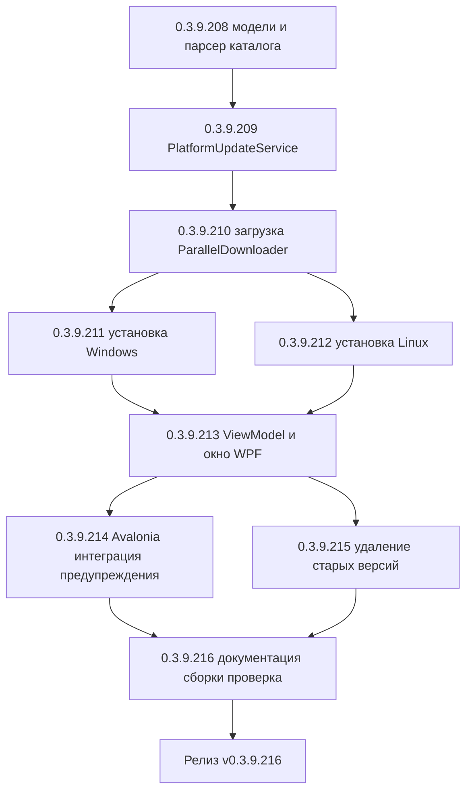

# PLAN — цикл 0.3.9.208–0.3.9.216 — Функция 9: автообновление платформы 1С

Репозиторий [`sivatorov/ConfigurationManagement`](https://github.com/sivatorov/ConfigurationManagement),
локальная копия `f:\Yandex.Disk\h\Configuration_Management`, ветка `main`.
Локальный HEAD — **0.3.9.207** (в работе циклы журнала регистрации 0.3.9.161–166,
планировщика ОС 0.3.9.167–171, уведомлений 0.3.9.180–186, проверки копий 0.3.9.200–207;
версия в [`Configuration Management.csproj`](../Configuration%20Management/Configuration%20Management.csproj:62)
на момент плана — 0.3.9.200, бейдж в [`README.md`](../README.md:3)). Новый цикл стартует
**после завершения 0.3.9.200–207**; нумерация этапов 0.3.9.208–216 условна и может сместиться
на фактический HEAD — перед стартом первого этапа исполнитель сверяет версию в csproj (риск п. 6).

Режим: Архитектор (план) → задачи-исполнители в режиме **code** (`new_task` по одному на этап).
**Один этап = одна версия = один коммит.** План-файл остаётся untracked (`plans/` в
`.codeassistantignore`); CHANGELOG/README/csproj коммитятся. Это **новая функция** (собственная
дорожная карта): комментарии к issues не публикуются; в CHANGELOG заголовок — «Добавлено».

---

## 1. Сводка цикла

| № | Версия | Суть | Приоритет |
|---|--------|------|-----------|
| 1 | 0.3.9.208 | Модели каталога платформы и чистый парсер: `Models/PlatformDistributionKind.cs`, `Models/PlatformReleaseFile.cs`, `Models/PlatformRelease.cs`, `Services/OneCPlatformCatalogParser.cs` (список версий со страницы `releases.1c.ru/project/Platform83` — все строки `#versionsTable`, не только первая; файлы релиза из `version_files?nick=Platform83&ver=…` — zip/deb/rpm с размерами и разрядностью); расширение `IOneCUpdatesService` авторизованным `GetPageTextAsync`; тесты с HTML/JSON-фикстурами | 1 |
| 2 | 0.3.9.209 | `Services/IPlatformUpdateService.cs` + `Services/PlatformUpdateService.cs`: получение списка доступных версий с портала, ленивая подгрузка файлов релиза, выбор дистрибутива под ОС/разрядность; чистый `PlatformUpdateMatcher` (сопоставление установленных ↔ доступных, признак «есть обновление») и `CountCompatibleBases` (совместимость с базами репозитория); регистрация в DI; тесты (fake-провайдер, сопоставление, совместимость) | 1 |
| 3 | 0.3.9.210 | Загрузка дистрибутива: расширение `IOneCUpdatesService.DownloadDistributionAsync` — попытка `ParallelDownloader.TryDownloadAsync` (HTTP Range, докачка, работа до конца файла) с fallback на существующий однопоточный путь `SendWithAuthAsync` + `ReadAsStream`; проверка свободного места (`DiskFreeSpaceHelper`); тесты выбора стратегии и чистой логики | 1 |
| 4 | 0.3.9.211 | Установка на Windows (`#if WINDOWS`): `Services/PlatformInstaller.Windows.cs` — распаковка zip через `IArchiveService.ExtractArchive`, поиск `setup.exe`, сборка аргументов тихой установки `/VERYSILENT /SUPPRESSMSGBOXES /NORESTART` (+`/DIR=`), проверка подписи Authenticode (`X509Certificate2.CreateFromSignedFile`), запуск с UAC (`Verb=runas`), ожидание завершения, пересканирование установленных версий до появления новой; тесты аргументов/экранирования, fake-процесс | 1 |
| 5 | 0.3.9.212 | Установка на Linux (`#if LINUX`): `Services/PlatformInstaller.Linux.cs` — определение типа пакета (.deb → `sudo dpkg -i`, .rpm → `sudo dnf install -y`/`rpm -ivh`, .tar.gz → инструкция), генерация команды sudo для пользователя, копирование в буфер, обновление кэша установленных версий после ручной установки; тесты генерации команд и кавычек путей | 1 |
| 6 | 0.3.9.213 | UI-ядро: `ViewModels/PlatformUpdateViewModel.cs` + `PlatformUpdateRowViewModel.cs` (единый список «установленные ∪ доступные», колонки Версия/Размер/Статус/Совместимые базы, команды «Проверить», «Скачать и установить», «Только скачать», «Выбрать файл установщика…», прогресс + журнал); окно `Views/PlatformUpdateWindow.xaml` + `.xaml.cs` (WPF) по образцу `ActualReleasesWindow`; тесты VM (fake-сервисы) | 1 |
| 7 | 0.3.9.214 | Интеграция и безопасность: окно `Views/PlatformUpdateWindow.Avalonia.cs`; команда/хоткей в `MainViewModel.PlatformUpdate.cs` + `.Avalonia.PlatformUpdate.cs` (по умолчанию Ctrl+F9); предупреждения перед установкой (занятые процессы 1С через `IRunningInfobasesService`, права администратора, свободное место, подпись); журналирование `IAppLogger`; уведомление о результате через `INotificationService` (`NotificationEvent.Update`); ключи локализации ru/en; тесты предупреждений и уведомлений | 1 |
| 8 | 0.3.9.215 | Удаление старых версий (опционально, с подтверждением): `Services/OldVersionCleaner.cs` (чистый отбор кандидатов — исключить новейшую, используемые базами и текущую запущенную), Windows — удаление каталога версии с правами, Linux — команда `sudo dpkg -r`/`rm -rf`; отображение совместимости с базами в окне; тесты отбора кандидатов и команд | 2 |
| 9 | 0.3.9.216 | Документация (CHANGELOG/README/ARCHITECTURE), полные сборки Windows+Linux, сквозная ручная проверка (получение списка, загрузка, тихая установка, sudo-команда, удаление, предупреждения) | 2 |



---

## 2. Общие требования к КАЖДОМУ этапу

1. Реализация на обеих платформах (Windows/WPF + Linux/Avalonia), где применимо; чистые
   сервисы/VM — без платформенных зависимостей; платформенные реализации — символы условной
   компиляции (`#if WINDOWS` / `#if LINUX`) или отдельные файлы `*.Avalonia.cs`, как у
   [`ActualReleasesWindow.xaml.cs`](../Configuration%20Management/Views/ActualReleasesWindow.xaml.cs:1)
   и [`ActualReleasesWindow.Avalonia.cs`](../Configuration%20Management/Views/ActualReleasesWindow.Avalonia.cs:27).
2. Инкремент версии в [`Configuration Management.csproj`](../Configuration%20Management/Configuration%20Management.csproj:62)
   (строки 62–65: Version/AssemblyVersion/FileVersion/InformationalVersion) на 1 патч.
3. Запись в [`CHANGELOG.md`](../CHANGELOG.md:12) (сверху, раздел «Добавлено») и обновление
   бейджа версии в [`README.md`](../README.md:3).
4. Тесты: `dotnet test` зелёный и `dotnet build -p:BuildLinux=true` без ошибок. Тесты пишутся
   на **xUnit** (`[Fact]`/`[Theory]`) — конвенция существующих файлов
   [`OneCUpdatesUrlTests.cs`](../ConfigurationManagement.Tests/OneCUpdatesUrlTests.cs:1),
   [`PlatformVersionPickerTests.cs`](../ConfigurationManagement.Tests/PlatformVersionPickerTests.cs:1)
   (NUnit в репозитории не используется).
5. Один коммит (без пуша); без ключевых слов автозакрытия issues. Образец сообщения:
   `0.3.9.208: автообновление платформы — модели и парсер каталога`.
6. Все пункты плана перед исполнением сверить с фактическим кодом (адреса строк могут сместиться;
   циклы 0.3.9.161–186 и 0.3.9.200–207 ещё в работе и могут затронуть `MainWindow`/
   `MainViewModel`/`AppServices`/`csproj`).
7. **Перед этапом 0.3.9.208 проверить**:
   - фактический ник каталога технологической платформы на `releases.1c.ru/project/<ник>`
     (в плане принят `Platform83` — сверить вручную в браузере с учётной записью 1С;
     при изменении ника — поправить константу и тесты);
   - сигнатуру приватных парсеров [`OneCUpdatesService`](../Configuration%20Management/Services/OneCUpdatesService.cs:257)
     (`ParseLatestVersionFromProjectHtml`, `ParseLatestVersionFromJson`) и `internal static`
     хелперов `TryParseVersion`/`IsNewer` (строки 415/444) — переиспользуются без дублирования;
   - при необходимости сделать `ExtractVersionFromFileName` (строка 375) `internal` для
     переиспользования из нового парсера.
8. **Перед этапом 0.3.9.210 проверить** фактическую сигнатуру
   [`ParallelDownloader.TryDownloadAsync`](../Configuration%20Management/Services/ParallelDownloader.cs:354)
   (принимает готовый `HttpClient` без авторизации) и способ передачи учётных данных портала
   (статические `HttpClient`/`CookieContainer` в `OneCUpdatesService`, строки 50/84–104).
9. **Перед этапом 0.3.9.211 проверить**:
   - фактическую сигнатуру [`IArchiveService.ExtractArchive`](../Configuration%20Management/Services/IArchiveService.cs:10)
     (распаковка zip дистрибутива);
   - наличие `setup.exe` внутри zip-архива платформы конкретной версии (структура архива
     может отличаться от версии к версии — поиск по имени в корне и подкаталогах);
   - точный набор ключей тихой установки платформы 1С (`/VERYSILENT`/`/SILENT`,
     `/SUPPRESSMSGBOXES`, `/NORESTART`, `/DIR=`) на реальном дистрибутиве (риск п. 6).
10. **Перед этапом 0.3.9.213 проверить** сигнатуры [`IInfobaseRepository.Load()`](../Configuration%20Management/Services/IInfobaseRepository.cs:7)
    (для совместимости с базами), [`IRunningInfobasesService`](../Configuration%20Management/Services/IRunningInfobasesService.cs:36)
    (для предупреждения о занятых процессах) и паттерн открытия модального окна
    [`MainViewModel.Updates.cs`](../Configuration%20Management/ViewModels/MainViewModel.Updates.cs:98).

---

## 3. Дизайн

### 3.1. Текущий фундамент (что переиспользуется)

- Поиск установленных версий: [`PlatformVersionService`](../Configuration%20Management/Services/PlatformVersionService.cs:8)
  (`FindInstalledVersionInfos`, `ParseVariant`, `ResolveVersionBinDirectory`, `FindPlatformVersionDirs`)
  + Linux-версия [`PlatformVersionService.Linux.cs`](../Configuration%20Management/Services/PlatformVersionService.Linux.cs:18)
  (корни `/opt/1cv8*`, ELF-разрядность). Модель [`PlatformVersionInfo`](../Configuration%20Management/Models/PlatformVersionInfo.cs:6)
  (`Display`, `Path`).
- Бинарники платформы: [`OneCPlatformLocator`](../Configuration%20Management/Services/OneCPlatformLocator.cs:14)
  (`ResolveBinDirectory`, `FindInBinDir`); числовое сравнение версий `CompareVersions` —
  аналог для сопоставления «доступная vs установленная».
- Портал 1С: [`OneCUpdatesService`](../Configuration%20Management/Services/OneCUpdatesService.cs:24)
  — готовая авторизация (Basic Auth + гибридный вход на `login.1c.ru` CAS, `CookieContainer`),
  ручное следование редиректам с перевыставлением `Authorization`
  ([`SendWithAuthAsync`](../Configuration%20Management/Services/OneCUpdatesService.cs:627)),
  шаблоны URL `releases.1c.ru/project/<ник>` и `releases.1c.ru/version_files?nick=&ver=`,
  устойчивый парсинг HTML/JSON. Все эти механизмы переиспользуются для каталога
  технологической платформы.
- Многопоточная загрузка: [`ParallelDownloader`](../Configuration%20Management/Services/ParallelDownloader.cs:40)
  (`TryDownloadAsync` — HTTP Range, до 8 соединений, докачка `.part`, work stealing;
  возвращает null при невозможности распараллелить — вызывающий код переходит к однопоточной
  загрузке). `InternalsVisibleTo` уже настроен ([`AssemblyInfo.cs`](../Configuration%20Management/AssemblyInfo.cs:9)).
- Однопоточная загрузка с прогрессом: [`OneCUpdatesService.DownloadUpdateAsync`](../Configuration%20Management/Services/OneCUpdatesService.cs:455)
  (авторизованный поток, удаление временного файла при ошибке/отмене).
- Распаковка архивов: [`IArchiveService`](../Configuration%20Management/Services/IArchiveService.cs:10)
  / [`ArchiveService`](../Configuration%20Management/Services/ArchiveService.cs:14)
  (`ExtractArchive` — для распаковки zip с `setup.exe`).
- Права администратора (Windows): паттерн
  [`UpdateService.IsAdministrator`](../Configuration%20Management/Services/UpdateService.cs:904)
  (`WindowsIdentity` + `WindowsPrincipal`), UAC-запуск с `Verb="runas"` (строки 816–833).
- Запуск процессов: [`ExternalCommandRunner`](../Configuration%20Management/Services/ExternalCommandRunner.cs:89)
  (`CreateProcessStartInfo`), `ProcessStartInfo`-паттерны `ArchiveService.RunArchiver`
  и `OneCLauncher.DesignerBatch` (ожидание с таймаутом); на Linux — `LinuxProcessEnvironment.Start`.
- Свободное место: [`DiskFreeSpaceHelper`](../Configuration%20Management/Services/DiskFreeSpaceHelper.cs:18)
  (`TryGetInfo`, `IsWarning`, `FormatDisplay`).
- Уведомления: [`INotificationService.Show(title, message, kind, evt)`](../Configuration%20Management/Services/INotificationService.cs:33),
  категория [`NotificationEvent.Update`](../Configuration%20Management/Services/NotificationModels.cs:36)
  (фильтр «какие события отправлять» уже включает обновления).
- Окно-образец: [`ActualReleasesWindow`](../Configuration%20Management/Views/ActualReleasesWindow.xaml.cs:23)
  (WPF) и `.Avalonia.cs` (`ModalWindowBase` + `ShowSync`); строки с командами и прогрессом
  [`ActualReleaseRowViewModel`](../Configuration%20Management/ViewModels/ActualReleasesViewModel.cs:54);
  открытие из [`MainViewModel.Updates.cs`](../Configuration%20Management/ViewModels/MainViewModel.Updates.cs:70)
  и [`MainViewModel.Avalonia.Updates.cs`](../Configuration%20Management/ViewModels/MainViewModel.Avalonia.Updates.cs:47).
- DI: [`AppServices.cs`](../Configuration%20Management/AppServices.cs:15) — синглтоны
  `IOneCUpdatesService`, `IInfobaseRepository`, `IRunningInfobasesService`, `INotificationService`,
  `IAppLogger`, `IArchiveService`; хоткеи и настройки логина/пароля портала —
  `UpdatesLogin`/`UpdatesPassword` ([`MainViewModel.Updates.cs`](../Configuration%20Management/ViewModels/MainViewModel.Updates.cs:42),
  [`AppSettings`](../Configuration%20Management/Models/AppSettings.cs:399)).

### 3.2. Модели каталога платформы и парсер (этап 0.3.9.208)

Новые типы в `Models/` (чистый .NET, обе платформы):

```csharp
// Models/PlatformDistributionKind.cs
/// <summary>Тип дистрибутива платформы для целевой ОС.</summary>
public enum PlatformDistributionKind
{
    WindowsSetupZip, // zip-архив с setup.exe (клиент/тонкий клиент Windows)
    LinuxDeb,        // пакет .deb (или .tar.gz с deb внутри)
    LinuxRpm,        // пакет .rpm
    LinuxTarGz,      // универсальный дистрибутив .tar.gz
    Other
}

// Models/PlatformReleaseFile.cs
/// <summary>Файл дистрибутива конкретной версии платформы.</summary>
public class PlatformReleaseFile
{
    public string FileName { get; set; } = "";    // «8.3.27.2214_x64.zip»
    public string Url { get; set; } = "";         // прямая ссылка на файл
    public long SizeBytes { get; set; }           // размер (0 — неизвестен)
    public string? Architecture { get; set; }     // «x64»/«x86» или null
    public PlatformDistributionKind Kind { get; set; }
}

// Models/PlatformRelease.cs
/// <summary>Версия технологической платформы из каталога releases.1c.ru.</summary>
public class PlatformRelease
{
    public string Version { get; set; } = "";          // «8.3.27.2214»
    public string VersionFilesUrl { get; set; } = "";  // version_files?nick=Platform83&ver=…
    public List<PlatformReleaseFile> Files { get; set; } = new(); // лениво заполняется
}
```

Чистый парсер (static, тестируемый без сети):

```csharp
// Services/OneCPlatformCatalogParser.cs
public static class OneCPlatformCatalogParser
{
    /// <summary>Ник каталога технологической платформы 8.3 на releases.1c.ru (сверить! п. 2.7).</summary>
    public const string PlatformNick = "Platform83";

    /// <summary>Все версии со страницы project/Platform83 (все строки #versionsTable, не только первая).
    /// Сортировка по убыванию числовыми сегментами. Пустой/битый HTML → пустой список.</summary>
    public static IReadOnlyList<PlatformRelease> ParseVersions(string html);

    /// <summary>Файлы релиза из ответа version_files?nick=…&ver=… (JSON или HTML).
    /// Классификация по расширению и токенам разрядности. Неизвестные файлы пропускаются.</summary>
    public static IReadOnlyList<PlatformReleaseFile> ParseDistributionFiles(string body);

    /// <summary>Численное сравнение версий (переиспользует OneCUpdatesService.TryParseVersion).</summary>
    public static int CompareVersions(string a, string b);
}
```

Ключевые решения:

- **Источник списка версий** — страница `releases.1c.ru/project/Platform83` (HTML-таблица
  `#versionsTable`): существующий [`ParseLatestVersionFromProjectHtml`](../Configuration%20Management/Services/OneCUpdatesService.cs:298)
  берёт только первую строку; новый парсер перебирает **все** строки `<tr>` и извлекает из
  каждой первый `version_files`-ссылки текст версии (`WebUtility.HtmlDecode`, trim). Fallback —
  поиск всех `version_files?...&ver=`-ссылок по всему HTML (как в существующем коде).
- **Файлы версии** — ответ `releases.1c.ru/version_files?nick=Platform83&ver=<version>`
  (JSON/HTML): регулярные выражения по ссылкам `.zip/.deb/.rpm/.tar.gz` (устойчивость к
  структуре — как `DistributionUrlRegex`/`SelectDistributionUrl` у конфигураций), извлечение
  размера из JSON-полей (`size`/`filesize`) либо 0. Разрядность — по токенам имени
  (`x64`/`x86_64`/`amd64`/`64`/`x86`/`32`/`i386`).
- **Переиспользование хелперов**: `OneCUpdatesService.TryParseVersion`/`IsNewer` уже
  `internal static`; `ExtractVersionFromFileName` (строка 375) при необходимости делается
  `internal` — дублирование запрещено.
- **Расширение портала**: в [`IOneCUpdatesService`](../Configuration%20Management/Services/IOneCUpdatesService.cs:14)
  добавляется `Task<string?> GetPageTextAsync(string url, CancellationToken ct = default)` —
  публичная обёртка над приватным `GetTextAsync` (строка 603) с сохранением семантики
  «не-успех → пустая строка» и логирования. Авторизация, редиректы, cookie — без изменений.
- Регистрация: новых DI-записей на этом этапе нет (парсер статический).

### 3.3. `PlatformUpdateService` — список версий, сопоставление, совместимость (этап 0.3.9.209)

```csharp
// Services/IPlatformUpdateService.cs
public interface IPlatformUpdateService
{
    /// <summary>Получает доступные версии платформы с портала (через IOneCUpdatesService.GetPageTextAsync).
    /// Ошибки сети/авторизации не бросают исключение — результат несёт Status.</summary>
    Task<PlatformCatalogResult> GetAvailableReleasesAsync(CancellationToken ct = default);

    /// <summary>Лениво подгружает файлы дистрибутива для выбранной версии.</summary>
    Task<PlatformCatalogResult> LoadReleaseFilesAsync(PlatformRelease release, CancellationToken ct = default);

    /// <summary>Выбирает файл дистрибутива под текущую ОС/разрядность (чистый метод).</summary>
    PlatformReleaseFile? PickDistribution(IReadOnlyList<PlatformReleaseFile> files);
}

// Models/PlatformCatalogResult.cs
public sealed class PlatformCatalogResult
{
    public PortalFetchStatus Status { get; init; }        // Ok / AuthRequired / NotFound / NetworkError / Cancelled
    public string ErrorKey { get; init; } = "";           // ключ локализации («PlatformUpdate.Error.*»)
    public IReadOnlyList<PlatformRelease> Releases { get; init; } = Array.Empty<PlatformRelease>();
    public PlatformRelease? Release { get; init; }        // для LoadReleaseFilesAsync
}
```

Чистые вспомогательные классы (обе платформы, покрываются тестами):

- `PlatformUpdateMatcher.Merge(installed, available)` — единый список строк окна: для каждой
  версии «установлена»/«доступна»/«доступна новая» (установленная версия, для которой есть
  более новая в каталоге, помечается признаком `HasUpdate`); сравнение числовыми сегментами
  (паттерн `OneCPlatformLocator.CompareVersions`).
- `PlatformUpdateMatcher.CountCompatibleBases(string version, List<Infobase> bases)` — число баз,
  чей `PlatformVersion` начинается с префикса выбранной версии (точное совпадение 4 сегментов
  или префикс 3 сегментов — эвристика как `MatchesVersionPrefix`, issue #142).
- Маппинг ошибок портала: HTTP 404 → `NotFound`, редирект на `login.1c.ru` /
  401/403 → `AuthRequired`, прочее/исключения → `NetworkError` (зеркало логики
  [`CheckForUpdatesAsync`](../Configuration%20Management/Services/OneCUpdatesService.cs:147)).

Регистрация в [`AppServices.cs`](../Configuration%20Management/AppServices.cs:30) рядом с
`IOneCUpdatesService`: `services.AddSingleton<IPlatformUpdateService, PlatformUpdateService>();`.

### 3.4. Загрузка дистрибутива (этап 0.3.9.210)

В [`IOneCUpdatesService`](../Configuration%20Management/Services/IOneCUpdatesService.cs:14)
добавляется:

```csharp
/// <summary>Скачивает файл дистрибутива по прямой ссылке: сначала пытается многопоточная
/// загрузка (ParallelDownloader), при неудаче — существующий однопоточный путь с авторизацией.
/// Возвращает полный путь сохранённого файла или null.</summary>
Task<string?> DownloadDistributionAsync(
    string url, string targetPath, IProgress<double>? progress = null, CancellationToken ct = default);
```

Ключевые решения:

- `ParallelDownloader.TryDownloadAsync` принимает готовый `HttpClient` и сам выполняет
  GET/Range-запросы. Для портала нужен клиент с `CookieContainer` и Basic-авторизацией:
  создаётся отдельный `HttpClient` (`AllowAutoRedirect=true` для работы с CDN,
  `DefaultRequestHeaders.Authorization = Basic(...)`, тот же `CookieContainer`, UA) — только
  на время вызова, с `Dispose`. Риск утечки учётных данных на редирект целиком — тот же
  объём, что и в существующем ручном следовании редиректам (см. п. 6).
- Если `TryDownloadAsync` вернул null (файл мал — 1 сегмент; CDN не поддерживает Range;
  сетевой сбой) → fallback на существующий [`DownloadUpdateAsync`](../Configuration%20Management/Services/OneCUpdatesService.cs:455):
  `SendWithAuthAsync` + `ReadAsStream`, прогресс по `ContentLength`, удаление файла при
  ошибке/отмене. Оба пути сохраняют файл по `targetPath`; временные `.part`/`.etag` очищаются.
- Каталог назначения: для установки — `%TEMP%\cm_platformdl_<guid>\<FileName>`; для
  «Только скачать» — каталог, выбранный пользователем (`SaveFileDialog`, как в
  [`ActualReleasesWindow.OnDownloadRow`](../Configuration%20Management/Views/ActualReleasesWindow.xaml.cs:223)).
- Перед загрузкой: `DiskFreeSpaceHelper.TryGetInfo(targetDir)` — если
  `IsWarning(free, size+1ГБ)` — предупреждение в журнал окна (блокирующий вопрос — на этапе 0.3.9.214).
- Чистая логика для тестов: `PickDistribution` (3.3), решение «parallel vs fallback»
  (`ChooseDownloadStrategy(long totalBytes)` → bool) и имя итогового файла — выносятся
  в тестируемые статические методы.

### 3.5. Установка на Windows (этап 0.3.9.211)

```csharp
#if WINDOWS
// Services/PlatformInstaller.Windows.cs
public static class PlatformInstaller
{
    /// <summary>Аргументы тихой установки: /VERYSILENT /SUPPRESSMSGBOXES /NORESTART
    /// (+ /DIR="<каталог>" — опционально). Чистая функция, тестируется.</summary>
    public static string BuildSilentArguments(string? installDirectory = null);

    /// <summary>True — процесс имеет права администратора (WindowsPrincipal, паттерн UpdateService.cs:904).</summary>
    public static bool IsAdministrator();

    /// <summary>Проверка подписи PE: X509Certificate2.CreateFromSignedFile в try/catch.
    /// Не бросает; false — подпись отсутствует/не читается.</summary>
    public static bool HasValidSignature(string exePath);

    /// <summary>Запуск setup.exe с UAC (Verb=runas), ожидание до timeout, код возврата.
    /// На границе повышения прав Process.Start может вернуть null — тогда ждём появления
    /// новой версии при пересканировании (ниже).</summary>
    public static Task<InstallerRunResult> RunSetupAsync(
        string setupExe, string arguments, TimeSpan timeout, CancellationToken ct);
}
#endif
```

Ключевые решения:

- **Последовательность**: 1) распаковать zip через `IArchiveService.ExtractArchive(zip, tmpDir)`;
  2) найти `setup.exe` (корень архива, затем подкаталоги — структура архива меняется между
  версиями); 3) `HasValidSignature` — предупреждение, если подпись не найдена (не блокирует,
  блокирующий вопрос — этап 0.3.9.214); 4) `BuildSilentArguments`; 5) `RunSetupAsync` с
  `UseShellExecute=true` + `Verb="runas"`; 6) после завершения — пересканирование
  `PlatformVersionService.FindInstalledVersionInfos()` (poll до 120 с, шаг 5 с): появление
  новой версии = успех; 7) удаление временного каталога в `finally`.
- **Код возврата**: Inno Setup-совместимый 0 = успех; ненулевой — журнал + предупреждение;
  но главный критерий — фактическое появление версии в пересканировании (надёжнее кода
  возврата при UAC-границе).
- Таймаут установки: 15 минут по умолчанию (крупные дистрибутивы, «долгие» машины);
  превышение → Kill и ошибка с понятным текстом.
- На этапе 0.3.9.211 UI ещё не готов — реализация проверяется тестами чистых функций и
  ручным прогоном из консольного вызова/временной кнопки.

### 3.6. Установка на Linux (этап 0.3.9.212)

```csharp
#if LINUX
// Services/PlatformInstaller.Linux.cs
public static class PlatformInstaller
{
    /// <summary>Тип пакета по имени файла: .deb → Dpkg, .rpm → Rpm, .tar.gz → TarGz, прочее → Other.</summary>
    public static PackageType DetectPackageType(string fileName);

    /// <summary>Команда установки с sudo для пользователя: «sudo dpkg -i '<путь>'»,
    /// «sudo dnf install -y '<путь>'» (rpm), либо инструкция для tar.gz. Чистая функция.</summary>
    public static string BuildSudoInstallCommand(string packagePath);

    /// <summary>Команда удаления версии: «sudo dpkg -r 1c-enterprise83-<версия>» или «sudo rm -rf /opt/1cv8/<версия>».</summary>
    public static string BuildSudoUninstallCommand(string version);
}
#endif
```

Ключевые решения:

- **Установка с правами root из GUI безопасно невозможна** → окно показывает готовую команду
  (кнопка «Скопировать команду» в буфер обмена) и короткую инструкцию; вариант «Открыть
  терминал» — вне цикла (п. 9). Повышение прав через `pkexec`/`sudo` из приложения не
  выполняется.
- **После ручной установки** пользователь нажимает «Проверить снова» → список перестраивается
  через `PlatformVersionService.FindInstalledVersionInfos()` (Linux-версия уже сканирует
  `/opt/1cv8*`, [`PlatformVersionService.Linux.cs`](../Configuration%20Management/Services/PlatformVersionService.Linux.cs:30))
  — кэш установленных версий всегда актуален, отдельного кэша не вводим.
- `.tar.gz` — только инструкция (распаковка + `./install`/`./install_server`), автоматическая
  установка не выполняется.

### 3.7. Окно «Обновление платформы 1С» (этап 0.3.9.213–214)

ViewModel (чистый, тестируемый):

```csharp
// ViewModels/PlatformUpdateViewModel.cs
public class PlatformUpdateViewModel : ViewModelBase
{
    public ObservableCollection<PlatformUpdateRowViewModel> Rows { get; }   // установленные ∪ доступные
    public bool IsBusy { get; }                 // любая сетевая/установочная операция
    public double Progress { get; }             // 0..1
    public string LogText { get; }              // журнал операции (строки)
    public RelayCommand CheckCommand { get; }               // «Проверить обновления»
    public RelayCommand DownloadAndInstallCommand { get; }  // «Скачать и установить» (Windows)
    public RelayCommand DownloadOnlyCommand { get; }        // «Только скачать»
    public RelayCommand ChooseInstallerCommand { get; }     // «Выбрать файл установщика…»
    public RelayCommand RemoveOldVersionsCommand { get; }   // «Удалить старые версии…»
}

// ViewModels/PlatformUpdateRowViewModel.cs
public class PlatformUpdateRowViewModel : ViewModelBase
{
    public string Version { get; }                 // «8.3.27.2214»
    public bool IsInstalled { get; }               // установлена на этой машине
    public bool HasUpdate { get; }                 // для установленной: есть более новая доступная
    public PlatformRelease? Release { get; }       // данные каталога (лениво: Files)
    public string SizeText { get; }                // размер выбранного дистрибутива
    public int CompatibleBases { get; }            // совместимые базы (CountCompatibleBases)
    public bool IsDownloading { get; }             // индикатор строки
}
```

Окно: `Views/PlatformUpdateWindow.xaml` + `.xaml.cs` (WPF, `#if WINDOWS`) и
`Views/PlatformUpdateWindow.Avalonia.cs` (Linux) — по образцу
[`ActualReleasesWindow.xaml.cs`](../Configuration%20Management/Views/ActualReleasesWindow.xaml.cs:23) /
[`.Avalonia.cs`](../Configuration%20Management/Views/ActualReleasesWindow.Avalonia.cs:27):
таблица (Версия / Размер / Статус / Совместимые базы), панель прогресса с журналом,
кнопки нижней панели, Esc-закрытие, копирование строки по Ctrl+C.

Открытие: `MainViewModel` — новые partial-файлы
`ViewModels/MainViewModel.PlatformUpdate.cs` (#if WINDOWS) и
`ViewModels/MainViewModel.Avalonia.PlatformUpdate.cs` (#if LINUX): команда
`ShowPlatformUpdateCommand`, хоткей `HotkeyPlatformUpdate` (по умолчанию `Ctrl+F9` —
сверка с занятыми: F9/Alt+F9 заняты обновлениями конфигураций; `NormalizeHotkey`, как в
[`MainViewModel.Updates.cs`](../Configuration%20Management/ViewModels/MainViewModel.Updates.cs:20)).

### 3.8. Удаление старых версий и совместимость (этап 0.3.9.215)

```csharp
// Services/OldVersionCleaner.cs (обе платформы, чистый)
public static class OldVersionCleaner
{
    /// <summary>Кандидаты на удаление: НЕ новейшая установленная, НЕ версии, на которые
    /// ссылаются базы репозитория (префикс), НЕ версия запущенного сейчас процесса 1С.</summary>
    public static List<PlatformVersionInfo> SelectCandidates(
        IReadOnlyList<PlatformVersionInfo> installed,
        IReadOnlyList<Infobase> bases,
        IReadOnlyList<string> runningBinPaths);
}
```

- Windows: диалог подтверждения (список кандидатов + предупреждение «версия будет удалена
  безвозвратно»); удаление каталога `<root>\1cv8\<version>` через `Remove-Item` с `Verb="runas"`
  (паттерн `UpdateService`), затем пересканирование. Записи реестра Uninstall/ярлыки не трогаем
  (риск, вне цикла — п. 9).
- Linux: показать команду `PlatformInstaller.BuildSudoUninstallCommand(version)` с копированием
  в буфер.
- Определение версии запущенного процесса: путь бинарника сопоставляется с `bin`-каталогом
  установленных версий (как `ResolveVersionBinDirectory`), версия запущенной 1С исключается.

### 3.9. Предупреждения, безопасность, уведомления (этап 0.3.9.214)

Перед началом установки (после загрузки/распаковки) выполняется сводный диалог-подтверждение:

| Проверка | Механизм | Поведение при проблеме |
|----------|----------|------------------------|
| Занятые процессы 1С | `IRunningInfobasesService` (список запущенных) | Предупреждение «Запущены процессы 1С (N): установка может потребовать их закрытия» — вопрос «Продолжить?» |
| Права администратора | `PlatformInstaller.IsAdministrator()` (Windows) | Информирование: установка запросит повышение прав (UAC); на Linux — команда sudo |
| Свободное место | `DiskFreeSpaceHelper.TryGetInfo(targetDir)` + размер дистрибутива + 1 ГБ | Предупреждение при `IsWarning` — вопрос «Продолжить?» |
| Подпись файла | `PlatformInstaller.HasValidSignature(setup.exe)` | Предупреждение «Подпись не проверена/отсутствует» — вопрос «Продолжить?» (Windows) |

Журналирование: `IAppLogger` — этапы операции (получение списка, выбор файла, загрузка
{размер}, распаковка, запуск установщика, код возврата, пересканирование, результат).
Уведомление: `INotificationService.Show(title, summary, kind: Success/Warning/Error,
evt: NotificationEvent.Update)` — успех («Установлена версия 8.3.27.2214»), частичный успех,
ошибка; текст — ключи локализации `Notify.PlatformUpdate*`.

---

## 4. Тесты

### 4.1. Этап 0.3.9.208 — `OneCPlatformCatalogParserTests`

- `ParseVersions`: HTML со стандартной таблицей `#versionsTable` (5–10 строк) → все версии,
  отсортированы по убыванию; первая строка не единственная; `WebUtility.HtmlDecode` суффиксов.
- Варианты HTML: таблица с лишними `<tr>` без ссылок (пропуск), отсутствие `#versionsTable` →
  fallback-поиск по всему HTML; пустой/`null` HTML → пустой список; дубликаты версий → дедупликация.
- Версии с суффиксами («8.3.27.2214 », пробелы/переносы внутри строки) — нормализация.
- `ParseDistributionFiles`: JSON/HTML `version_files` с файлами `*_x64.zip`, `*.zip`,
  `.deb`, `.rpm`, `.tar.gz`, размеры в JSON-полях → корректные `Kind`/`Architecture`/`SizeBytes`;
  ссылка с `?`/`#`-query; неизвестные расширения пропускаются; битый ответ → пустой список.
- `CompareVersions`/`IsNewer`: «8.3.27.2214» > «8.3.27.1688», «8.3.10» > «8.3.9».

### 4.2. Этап 0.3.9.209 — `PlatformUpdateServiceTests` + `PlatformUpdateMatcherTests`

- Fake-провайдер (инжектируемый `Func<string, Task<string?>>` вместо
  `IOneCUpdatesService.GetPageTextAsync`): успешный HTML → `Ok` + `Releases`; 404 →
  `NotFound`; редирект на login.1c.ru / 401 / 403 → `AuthRequired`; исключение/пустая
  страница → `NetworkError`; отмена → `Cancelled` (ни одно не бросает исключение).
- `LoadReleaseFilesAsync` заполняет `Release.Files` и сохраняет `VersionFilesUrl`.
- `PickDistribution`: Windows x64 → `WindowsSetupZip` x64; Linux x64 → `LinuxDeb` (или rpm);
  несколько вариантов разрядности → выбор под архитектуру ОС; пустой список → null.
- `PlatformUpdateMatcher.Merge`: установленные без доступных (нет обновления), доступные
  новее установленных (`HasUpdate=true` у установленной), только доступные, сортировка;
  версии сравниваются численно, а не лексикографически.
- `CountCompatibleBases`: точное совпадение 4 сегментов; префикс «8.3.27» находит базы
  «8.3.27.1688» и «8.3.27.2214»; база без `PlatformVersion` не считается; регистронезависимо.

### 4.3. Этап 0.3.9.210 — `PlatformDownloadTests`

- `ChooseDownloadStrategy(totalBytes)`: <1 МБ → false (однопоточный), ≥ минимального
  сегмента ×2 → true.
- Имя итогового файла (`BuildTargetFileName(version, fileName)`): санитизация, префикс версии.
- `DownloadDistributionAsync` с fake `HttpMessageHandler` (Range-поддержка): возвращает путь
  файла; при `TryDownloadAsync`=null (нет Range) → результат однопоточного пути; отмена
  удаляет частичный файл; прогресс-колбэк монотонно растёт до 1.
- Регрессия: существующие `ParallelDownloaderTests` остаются зелёными.

### 4.4. Этап 0.3.9.211 — `PlatformInstallerWindowsTests`

- `BuildSilentArguments(null)` = `/VERYSILENT /SUPPRESSMSGBOXES /NORESTART`;
  с каталогом с пробелами — `/DIR="C:\Program Files\1cv8"` (экранирование кавычек).
- `HasValidSignature`: подписанный/неподписанный тестовый exe (созданный в teardown;
  при отсутствии подписанного образца — отрицательный тест на неподписанном и skip позитивного).
- Запуск: fake-инжектируемый запускатель (делегат вместо `Process.Start`) — код 0/ненулевой/
  зависание до таймаута; `RunSetupAsync` возвращает `InstallerRunResult` (ExitCode, TimedOut).
- Пересканирование: `DetectNewVersionAfterInstall(initial, observed, wait)` — чистая функция:
  появление версии в списке через poll считается успехом; таймаут poll → false.

### 4.5. Этап 0.3.9.212 — `PlatformInstallerLinuxTests`

- `DetectPackageType`: `.deb`→Dpkg, `.rpm`→Rpm, `.tar.gz`/`.tgz`→TarGz, прочее→Other.
- `BuildSudoInstallCommand`: путь с пробелами/кавычками/апострофом экранируется;
  deb → `sudo dpkg -i '<path>'`; rpm → `sudo dnf install -y '<path>'`.
- `BuildSudoUninstallCommand`: `sudo dpkg -r 1c-enterprise83-<ver>` для deb-платформы,
  `sudo rm -rf /opt/1cv8/<ver>` как запасной вариант.

### 4.6. Этап 0.3.9.213 — `PlatformUpdateViewModelTests`

- `CheckCommand` (fake `IPlatformUpdateService`): заполняет Rows (установленные/доступные,
  статусы, размеры, CompatibleBases), `IsBusy` в процессе, `LogText` получает строки,
  ошибка авторизации → ключ в лог и понятный статус, исключение не роняет VM.
- `DownloadAndInstallCommand` (Windows, fake загрузчик/установщик): последовательность
  download→extract→install→refresh; прогресс 0..1; отмена прерывает; повторный запуск
  заблокирован (`CanExecute=false` пока `IsBusy`).
- `DownloadOnlyCommand`: `SaveFileDialog`-путь получает файл; отмена диалога — no-op.
- `ChooseInstallerCommand`: локальный путь проходит валидацию (существует, расширение exe/deb/rpm).
- `RemoveOldVersionsCommand` (этап 0.3.9.215): подтверждение, отбор кандидатов, результат.

### 4.7. Этап 0.3.9.214 — `PlatformUpdateSafetyTests`

- Fake `IRunningInfobasesService`: запущенные процессы 1С → в диалог-сводке появляется
  предупреждение и вопрос «Продолжить?»; пустой список → без предупреждения.
- Свободное место (fake `DiskFreeSpaceHelper`-резолвер): мало места → Warning.
- Fake `INotificationService`: после успешной установки вызван `Show` с
  `kind=Success`, `evt=Update`; при ошибке — `kind=Error`.
- Хоткей: `HotkeyPlatformUpdate` нормализуется в «Ctrl+F9» по умолчанию, конфликтов с
  F9/Alt+F9 нет (тест на значение по умолчанию).

### 4.8. Этап 0.3.9.215 — `OldVersionCleanerTests`

- `SelectCandidates`: новейшая версия исключена; версия, на которую ссылается хотя бы одна
  база, исключена; версия запущенного процесса исключена; остальные — кандидаты; пустой
  список установленных → пусто без исключений.
- Команды удаления Windows/Linux (делегирование в `PlatformInstaller.*`).

### 4.9. Этап 0.3.9.216

- Регрессия: `dotnet test` целиком и `dotnet build -p:BuildLinux=true`.
- Ручной чек: получение списка версий с портала (с логином/без логина — ошибка авторизации);
  загрузка большого дистрибутива (многопоточность + докачка); тихая установка на Windows
  (UAC, появление новой версии в списке); sudo-команда на Linux и копирование в буфер;
  «Только скачать» и «Выбрать файл установщика…»; предупреждения (запущенная 1С, мало места,
  неподписанный файл); удаление старой версии с подтверждением; уведомление о результате;
  совместимые базы в колонке окна.

---

## 5. Таблица декомпозиции задач

| № | Версия | Файлы (новые/изменяемые) | Тесты | Риски и митигации |
|---|--------|--------------------------|-------|-------------------|
| 1 | 0.3.9.208 | **New:** `Models/PlatformDistributionKind.cs`, `Models/PlatformReleaseFile.cs`, `Models/PlatformRelease.cs`, `Services/OneCPlatformCatalogParser.cs`. **Edit:** `Services/IOneCUpdatesService.cs` (метод `GetPageTextAsync`), `Services/OneCUpdatesService.cs` (публичная обёртка над `GetTextAsync`, при необходимости `ExtractVersionFromFileName` → internal), csproj при необходимости | `OneCPlatformCatalogParserTests` (п. 4.1) | Ник каталога платформы изменился/неверен → константа `PlatformNick` и тесты правится по факту проверки (п. 2.7); структура HTML/JSON портала меняется → парсер устойчив (fallback по всему HTML, regex-токены), как у конфигураций; дублирование хелперов → только `internal`-переиспользование `TryParseVersion`/`ExtractVersionFromFileName` |
| 2 | 0.3.9.209 | **New:** `Models/PlatformCatalogResult.cs` (+ `PortalFetchStatus`), `Services/IPlatformUpdateService.cs`, `Services/PlatformUpdateService.cs`, `Services/PlatformUpdateMatcher.cs`. **Edit:** `AppServices.cs` (регистрация) | `PlatformUpdateServiceTests`, `PlatformUpdateMatcherTests` (п. 4.2) | Авторизация портала не выполнена/нет логина → `AuthRequired` с понятным текстом (зеркало `Updates.AuthRequired`); «доступных» версий больше, чем реально установимых → только список и пометки, установка только по явному действию; сравнение версий строковое → числовые сегменты во всех сравнениях |
| 3 | 0.3.9.210 | **Edit:** `Services/IOneCUpdatesService.cs` + `Services/OneCUpdatesService.cs` (`DownloadDistributionAsync`, parallel-first + fallback), тесты; возможно новый внутренний `HttpClient`-хелпер | `PlatformDownloadTests` (п. 4.3) | CDN не поддерживает Range → `TryDownloadAsync`=null → однопоточный fallback уже работает; авторизация на CDN после редиректа → Basic в дефолтных заголовках параллельного клиента (объём — как ручное перевыставление, см. п. 3.4); частичные `.part` после отмены → очистка в обоих путях |
| 4 | 0.3.9.211 | **New:** `Services/PlatformInstaller.Windows.cs` (`#if WINDOWS`, `BuildSilentArguments`, `IsAdministrator`, `HasValidSignature`, `RunSetupAsync`, `DetectNewVersionAfterInstall`). **Edit:** при необходимости `Services/IArchiveService.cs` (сигнатура `ExtractArchive` — сверить п. 2.9) | `PlatformInstallerWindowsTests` (п. 4.4) | Ключи тихой установки 1С отличаются от заявленных → сверить на реальном дистрибутиве (п. 2.9); `Process.Start` с `runas` возвращает null → успех определяется пересканированием версий, а не объектом процесса; setup.exe не найден в архиве → поиск в подкаталогах + понятная ошибка; долгая установка → таймаут 15 мин |
| 5 | 0.3.9.212 | **New:** `Services/PlatformInstaller.Linux.cs` (`#if LINUX`, `DetectPackageType`, `BuildSudoInstallCommand`, `BuildSudoUninstallCommand`) | `PlatformInstallerLinuxTests` (п. 4.5) | Разные менеджеры пакетов (dpkg/dnf/rpm) → команда строится по типу файла, для tar.gz — только инструкция; права root недоступны → никогда не запускаем sudo из приложения, только показываем команду; после ручной установки кэш не видит версию → «Проверить снова» пересканирует ФС |
| 6 | 0.3.9.213 | **New:** `ViewModels/PlatformUpdateViewModel.cs`, `ViewModels/PlatformUpdateRowViewModel.cs`, `Views/PlatformUpdateWindow.xaml` + `.xaml.cs` (WPF). **Edit:** csproj (подключение окон), локализация ru/en | `PlatformUpdateViewModelTests` (п. 4.6) | Долгая загрузка без реакции → прогресс + журнал + отмена; состояние кнопок расходится → `CanExecute` от `IsBusy`/выделения; сетевая ошибка роняет VM → результаты со статусами, исключения гасятся |
| 7 | 0.3.9.214 | **New:** `Views/PlatformUpdateWindow.Avalonia.cs`, `ViewModels/MainViewModel.PlatformUpdate.cs` (#if WINDOWS), `ViewModels/MainViewModel.Avalonia.PlatformUpdate.cs`. **Edit:** `MainViewModel.cs` (хоткей `HotkeyPlatformUpdate`), `Views/SettingsWindow*` при необходимости (настройка хоткея), локализация ru/en (ключи окна, предупреждений, уведомлений) | `PlatformUpdateSafetyTests` (п. 4.7) | Процессы 1С заняты при установке → предупреждение и подтверждение; WPF/Avalonia диалоги расходятся → общий чистый VM, платформенные файлы только строят UI; хоткей конфликтует → сверка занятых сочетаний (F9/Alt+F9), дефолт Ctrl+F9 |
| 8 | 0.3.9.215 | **New:** `Services/OldVersionCleaner.cs`. **Edit:** `PlatformUpdateViewModel.cs` (команда удаления + колонка совместимости), `PlatformUpdateWindow.xaml`/`.Avalonia.cs`, локализация ru/en | `OldVersionCleanerTests` (п. 4.8) | Удаление активной/используемой версии → жёсткие фильтры кандидатов + подтверждение; права на системный каталог → `runas Remove-Item` / команда sudo; записи реестра Uninstall не удаляются → документируется в README как ограничение |
| 9 | 0.3.9.216 | **Edit:** `CHANGELOG.md`, `README.md` (бейдж + раздел возможностей), `ARCHITECTURE.md` (связка `PlatformUpdateService` → `OneCUpdatesService`/`ParallelDownloader` → `PlatformInstaller.*` → окно; ограничения), полные сборки Windows+Linux | Сквозная ручная проверка по п. 4.9 | Поведение портала/установщика на машине проверяющего → чистые функции и тесты с фикстурами; установка требует прав/интерактива → документирование сценариев Windows (UAC) и Linux (sudo-команда) |

---

## 6. Риски (сводно) и митигации

| Риск | Митигация |
|------|-----------|
| Ник каталога технологической платформы на releases.1c.ru не `Platform83` или изменился | Константа в одном месте + тесты; перед этапом 0.3.9.208 ручная проверка в браузере (п. 2.7); парсер с fallback-поиском версий по всему HTML |
| Структура страниц портала (HTML `#versionsTable`, JSON `version_files`) меняется между релизами 1С | Устойчивые regex-парсеры по образцу существующих (`ParseLatestVersionFromProjectHtml`/`SelectDistributionUrl`); разные варианты разметки — фикстуры в тестах; сбой парсинга → понятный статус, а не исключение |
| Авторизация портала: нет логина/пароля в настройках, неверные учётные данные | Переиспользование `SendWithAuthAsync`/`TryLoginPortalAsync` (готовый код); статус `AuthRequired` и подсказка «задайте логин/пароль сайта 1С в настройках обновлений» |
| CDN дистрибутивов не поддерживает HTTP Range → многопоточная загрузка невозможна | `ParallelDownloader.TryDownloadAsync` возвращает null → гарантированный однопоточный fallback с докачкой; решение о стратегии — чистая функция с тестами |
| Утечка Basic-учётных данных на редирект целиком при параллельной загрузке | Авторизация в дефолтных заголовках параллельного клиента — тот же объём, что в ручном перевыставлении `Authorization` (строки 685–688); CookieContainer общий; пароли не логируются (`SensitiveDataMasker`/без логирования заголовков) |
| Ключи тихой установки платформы 1С отличаются от `/VERYSILENT /SUPPRESSMSGBOXES /NORESTART` | Сверка на реальном дистрибутиве (п. 2.9); сборка аргументов изолирована и покрыта тестами; итоговый критерий — появление версии в пересканировании, а не код возврата |
| UAC-граница: `Process.Start` с `Verb="runas"` возвращает null даже при успехе | Успех определяется по факту установки (poll `FindInstalledVersionInfos`, до 120 с), null процесса не трактуется как ошибка |
| Пользователь не имеет прав администратора / Linux требует root | Windows — UAC-запрос при запуске установщика; Linux — только команда sudo + копирование в буфер (никаких попыток автоматического повышения) |
| Удаление старой версии повредит используемые базы/процессы | `OldVersionCleaner.SelectCandidates` исключает новейшую, используемые базами и запущенную версию; обязательное подтверждение; удаление только каталога, реестр/ярлыки не трогаются (вне цикла) |
| Большие дистрибутивы (0.5–1+ ГБ) и медленные каналы | Многопоточная загрузка (до 8 соединений) + докачка между запусками; прогресс в окне; проверка свободного места до загрузки |
| Циклы 0.3.9.161–186 и 0.3.9.200–207 в работе могут затронуть `MainWindow`/`MainViewModel`/`AppServices`/`csproj` | Перед каждым этапом сверка адресов и сигнатур (п. 2.6); при конфликте — актуализация плана |
| «Скачать и установить» на Linux невозможно (права) | Кнопка заменяется на «Скачать» + панель с командой sudo и инструкцией; UI честно отражает платформенные возможности |

---

## 7. Локализация (новые ключи, ru/en)

- `PlatformUpdate.WindowTitle` — «Обновление платформы 1С» / «1C platform update»;
- `PlatformUpdate.Check` — «Проверить обновления», `.DownloadInstall` — «Скачать и установить»,
  `.DownloadOnly` — «Только скачать», `.ChooseInstaller` — «Выбрать файл установщика…»,
  `.RemoveOld` — «Удалить старые версии…», `.CopyCommand` — «Скопировать команду»;
- `PlatformUpdate.Column.Version` — «Версия», `.Size` — «Размер», `.Status` — «Статус»,
  `.Bases` — «Совместимые базы»;
- `PlatformUpdate.Status.Installed` — «Установлена», `.Available` — «Доступна»,
  `.UpdateAvailable` — «Есть обновление», `.Checking` — «Проверка…», `.Downloading` — «Загрузка…»;
- `PlatformUpdate.Progress.Download` — «Загрузка {0}…», `.Install` — «Установка {0}…»,
  `.Done` — «Готово: {0}», `.Summary` — «Скачано {0} из {1}, установлено: {2}»;
- `PlatformUpdate.Error.AuthRequired` — «Требуется вход на сайт 1С (задайте логин/пароль в
  настройках обновлений)», `.NotFound` — «Каталог платформы не найден»,
  `.Network` — «Ошибка сети при обращении к сайту 1С», `.NoSetup` — «setup.exe не найден в
  архиве», `.Signature` — «Подпись файла не проверена», `.NotEnoughSpace` — «Недостаточно
  свободного места на диске», `.RunningProcesses` — «Запущены процессы 1С: {0}»;
- `PlatformUpdate.Linux.SudoHint` — «Выполните в терминале команду для установки пакета:»,
  `.Copied` — «Команда скопирована в буфер обмена»;
- `PlatformUpdate.Confirm.InstallTitle` — «Установка платформы 1С», `.InstallMessage` —
  «Будет установлена версия {0}. Продолжить?», `.RemoveTitle` — «Удаление версии»,
  `.RemoveMessage` — «Версия {0} будет удалена безвозвратно. Продолжить?»;
- `Notify.PlatformUpdateDone` — «Установлена версия платформы {0}»,
  `.Error` — «Не удалось обновить платформу: {0}»;
- `Settings.HotkeyPlatformUpdate` — «Окно обновления платформы» (подпись в настройках хоткеев).

---

## 8. Порядок исполнения

1. Утвердить план (режим Architect).
2. `new_task` (режим **code**) на 0.3.9.208 → … → 0.3.9.216 последовательно; каждый этап —
   отдельная версия/коммит с CHANGELOG/README/бейджем, `dotnet test` + Linux-сборка.
3. До старта каждого этапа исполнитель выполняет проверки п. 2.7–2.10 (сигнатуры
   `OneCUpdatesService`/`ParallelDownloader`/`IArchiveService`/`IRunningInfobasesService`,
   ник каталога платформы, ключи установщика, паттерн открытия окна).
4. После 0.3.9.216 — сквозная проверка по п. 4.9 и финальный релиз-ноут.

---

## 9. Что сознательно НЕ входит в цикл

- **Автоматическая установка на Linux** (sudo/pkexec из приложения) — только команда для
  пользователя и инструкция; повышение прав из GUI безопасно не выполняется.
- Полная проверка цепочки доверия подписи (WinTrust/CRL) — только наличие Authenticode-подписи
  (`X509Certificate2.CreateFromSignedFile`).
- Удаление записей реестра Uninstall/ярлыков Windows при удалении старых версий — только
  каталог версии; рискованная чистота системы остаётся за штатным деинсталлятором 1С.
- Массовая миграция баз под новую версию платформы — совместимость отображается информативно
  (колонка «Совместимые базы»), смена `PlatformVersion` у баз не выполняется.
- Полная предзагрузка файлов всех версий каталога — файлы подгружаются лениво для выбранной
  версии.
- Автопроверка обновлений платформы по расписанию/при старте — только ручной запуск из окна
  (возможно отдельной функцией позже).
- Установка серверных компонентов платформы Linux (только клиентские deb/rpm-команды).
- Выбор каталога установки в UI (опция `/DIR=` — техническая, по умолчанию каталог 1С).
- Открытие терминала/`pkexec` из окна для выполнения sudo-команды — копирование в буфер
  и инструкция.