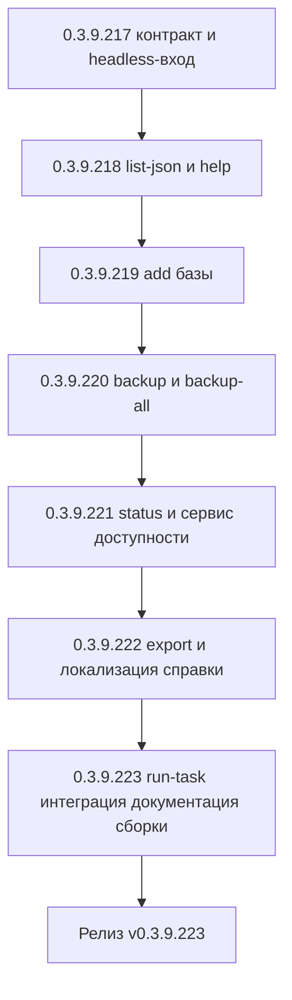

# PLAN — цикл 0.3.9.217–0.3.9.223 — Функция 10: расширенный интерфейс командной строки (CLI) для автоматизации

Репозиторий [`sivatorov/ConfigurationManagement`](https://github.com/sivatorov/ConfigurationManagement),
локальная копия `f:\Yandex.Disk\h\Configuration_Management`, ветка `main`.
Локальный HEAD — **0.3.9.216** (в работе циклы журнала регистрации 0.3.9.161–166,
планировщика ОС 0.3.9.167–171, уведомлений 0.3.9.180–186, проверки копий 0.3.9.200–207,
автообновления платформы 0.3.9.208–216; версия в
[`Configuration Management.csproj`](../Configuration%20Management/Configuration%20Management.csproj:62)
на момент плана — 0.3.9.216, бейдж в [`README.md`](../README.md:3)). Новый цикл стартует
**после завершения 0.3.9.208–216**; нумерация этапов 0.3.9.217–223 условна и может сместиться
на фактический HEAD — перед стартом первого этапа исполнитель сверяет версию в csproj (риск п. 6).

Режим: Архитектор (план) → задачи-исполнители в режиме **code** (`new_task` по одному на этап).
**Один этап = одна версия = один коммит.** План-файл остаётся untracked (`plans/` в
`.codeassistantignore`); CHANGELOG/README/csproj коммитятся. Это **новая функция** (собственная
дорожная карта): комментарии к issues не публикуются; в CHANGELOG заголовок — «Добавлено».

---

## 1. Сводка цикла

| № | Версия | Суть | Приоритет |
|---|--------|------|-----------|
| 1 | 0.3.9.217 | Единый контракт и headless-вход: `Models/CliResult.cs` (ok/error/data/error.code), `Services/CliOutput.cs` (JSON/plain, stdout/stderr), `Services/CliArgs.cs` (парсер всех ключей, валидация комбинаций), `Services/CliEntryPoint.cs` (pre-UI вход: DI → профиль → `--profile` → команда → код выхода); подключение в `Program.cs` обеих платформ до создания App/Avalonia; перенос существующих `--run`/`--list` на новый парсер **без изменения их формата вывода**; единые коды возврата; тесты | 1 |
| 2 | 0.3.9.218 | Расширенный список: `--list --json` (детали: имя/тип/Id/группа/строка подключения без пароля/теги/последний запуск/последняя копия), приватные скрыты как сейчас; `--help` (первая версия справки, ru/en); тесты | 1 |
| 3 | 0.3.9.219 | `--add`: параметры подключения (`--type file|server|web`, `--path`, `--server`, `--db`, `--port`, `--url`, `--user`, `--password`, `--auth`, `--group`, `--name`), idempotent по строке подключения (`InfobaseJsonTransfer.ConnectionKey`), сохранение через `IInfobaseRepository` + экспорт `ibases.v8i` (`IIbasesSyncService`) при настроенном пути; маскирование пароля; приватные базы не создаются из CLI (нет пароля профиля); тесты | 1 |
| 4 | 0.3.9.220 | `--backup "База" --scenario "Сценарий"` и `--backup-all --scenario "Сценарий"`: поиск базы (id/имя) и сценария (имя/id), выполнение через `IBackupService.RunAsync`, вывод CreatedFiles/PurgedFiles, частичный успех `--backup-all` → код 3; приватные базы отклоняются; тесты с fake-сервисом | 1 |
| 5 | 0.3.9.221 | `--status "База"`: доступность/последняя копия/последний запуск/конфигурация; рефакторинг: вынос `IsBaseAvailable` из `MainViewModel.Tools.cs`/`MainViewModel.Avalonia.Tools.cs` в чистый `Services/InfobaseAvailabilityService.cs` (обе платформы используют общий сервис, поведение не меняется); тесты | 1 |
| 6 | 0.3.9.222 | `--export --format csv|json --output <файл>`: CSV-колонки как в UI-экспорте (`CsvExporter`, UTF-8 BOM, «;»), JSON через `InfobaseJsonTransfer.BuildSnapshot`/`Serialize`; локализация справки `--help` ru/en (машиночитаемый вывод не локализуется); тесты | 2 |
| 7 | 0.3.9.223 | Интеграция и документация: `--run-task` документируется в едином разделе CLI README (функция 2), при необходимости `TaskRunCommandLine` получает `--json`-вывод по общему контракту; CHANGELOG/README/ARCHITECTURE (раздел CLI); полные сборки Windows+Linux; сквозная ручная проверка всех команд | 2 |



---

## 2. Общие требования к КАЖДОМУ этапу

1. Реализация на обеих платформах (Windows/WPF + Linux/Avalonia), где применимо; чистые
   сервисы/парсеры — без платформенных зависимостей; платформенные точки входа — только
   `Program.cs` (обе платформы), по образцу `ComReadHost` и `TaskRunCommandLine` (функция 2).
2. Инкремент версии в [`Configuration Management.csproj`](../Configuration%20Management/Configuration%20Management.csproj:62)
   (строки 62–65: Version/AssemblyVersion/FileVersion/InformationalVersion) на 1 патч.
3. Запись в [`CHANGELOG.md`](../CHANGELOG.md:12) (сверху, раздел «Добавлено») и обновление
   бейджа версии в [`README.md`](../README.md:3).
4. Тесты: `dotnet test` зелёный и `dotnet build -p:BuildLinux=true` без ошибок. Тесты пишутся
   на **xUnit** (`[Fact]`/`[Theory]`) — конвенция существующих файлов, например
   [`CommandLineHandlerTests.cs`](../ConfigurationManagement.Tests/CommandLineHandlerTests.cs:1)
   (NUnit в репозитории не используется).
5. Один коммит (без пуша); без ключевых слов автозакрытия issues. Образец сообщения:
   `0.3.9.217: расширенный CLI — единый контракт и headless-вход`.
6. Все пункты плана перед исполнением сверить с фактическим кодом (адреса строк могут
   сместиться; циклы 0.3.9.161–216 ещё в работе и могут затронуть `MainWindow`/
   `MainViewModel`/`AppServices`/`csproj`/`Program.cs`).
7. **Перед этапом 0.3.9.217 проверить**:
   - фактическое состояние `--run-task`/`TaskRunCommandLine`/`ScheduledTaskRunner` после
     цикла 0.3.9.167–171 (этапы 0.3.9.169–170): сигнатуры `Services/TaskRunCommandLine.cs`,
     `IProfileService.ActivateProfileForSession` (сессионная активация без `SaveRegistry`,
     см. [`ProfileService.SetCurrentProfile`](../Configuration%20Management/Services/ProfileService.cs:253)),
     коды возврата 0–4 (п. 4.3 плана функции 2) — головной CLI-вход должен вызываться
     **после** перехвата `--run-task`, чтобы не конфликтовать с его обработкой;
   - порядок точек входа [`Program.cs`](../Configuration%20Management/Program.cs:50) (Windows:
     после `ComReadHost.TryHandleCommandLine`, строка 53) и
     [`Program.cs` (Linux)](../Configuration%20Management/Program.cs:13);
   - что `CommandLineHandler.TryHandle` на Linux обрабатывается внутри Avalonia
     ([`App.axaml.cs`](../Configuration%20Management/App.axaml.cs:252)) — headless-вход
     обязателен до `BuildAvaloniaApp()` (в cron нет DISPLAY, риск п. 6).
8. **Перед этапом 0.3.9.219 проверить** путь синхронизации `ibases.v8i`
   (`settings.IbasesSyncFilePath`, метод `ExportToIbasesAfterLocalChange` в
   [`MainViewModel.Commands.cs`](../Configuration%20Management/ViewModels/MainViewModel.Commands.cs:88))
   и фактическую генерацию `Infobase.Id` при создании базы в UI (`ConnectionSettingsViewModel`,
   строка 980: `new Infobase { Connection = new ConnectionSettings() }`).
9. **Перед этапом 0.3.9.220 проверить** сигнатуру [`IBackupService.RunAsync`](../Configuration%20Management/Services/IBackupService.cs:14)
   (`Task<BackupRunResult>(Infobase, BackupScenario)`) и отсутствие UI-зависимостей в
   [`BackupService`](../Configuration%20Management/Services/BackupService.cs:1) (headless-запуск
   через `ExternalCommandRunner`/`DesignerBatch`).
10. **Перед этапом 0.3.9.221 проверить** сигнатуру [`IOneCComConnector.ReadConfigurationInfo`](../Configuration%20Management/Services/IOneCComConnector.cs:1)
    и таймаут `ComDetectTimeoutMs` (паттерн `MainViewModel.Tools.cs`, строка 1549).
11. **Перед этапом 0.3.9.222 проверить** колонки CSV-экспорта в UI (`MainViewModel.HtmlReport.cs`
    / команда экспорта) и сигнатуры [`CsvExporter`](../Configuration%20Management/Services/CsvExporter.cs:12)/
    [`InfobaseJsonTransfer`](../Configuration%20Management/Services/InfobaseJsonTransfer.cs:29).

---

## 3. Дизайн

### 3.1. Текущий фундамент (что переиспользуется)

- CLI-обработка [`CommandLineHandler`](../Configuration%20Management/Services/CommandLineHandler.cs:33):
  ключи `--run "Имя" [--designer]`, `--base` (алиас), `--list`; коды возврата в `TryHandle`
  (0 успех, 1 не найдено, 2 ошибка запуска, 3 внутренняя ошибка, 4 приватная база);
  чистая функция `Parse` покрыта тестами. **Конфликт с новым контрактом см. п. 3.4.**
- Точки входа: Windows — [`App.xaml.cs`](../Configuration%20Management/App.xaml.cs:168)
  (`CommandLineHandler.TryHandle` после `app.InitializeComponent()`); Linux —
  [`App.axaml.cs`](../Configuration%20Management/App.axaml.cs:252). Для новых headless-команд
  этого недостаточно: Linux-cron без DISPLAY и WPF-цикл на Windows не нужны.
- Headless-паттерн функции 2 (0.3.9.169): `Services/TaskRunCommandLine.cs` вызывается первым
  из `Program.Main` обеих платформ — до создания App/Avalonia; сам настраивает DI
  (`AppServices.Configure()`), инициализирует профили, активирует `--profile`, выполняет
  задание и завершает процесс кодом. **Новый `CliEntryPoint` строится по этому же паттерну.**
- Профили: [`IProfileService`](../Configuration%20Management/Services/IProfileService.cs:13)
  (`EnsureInitialized`, `SetCurrentProfile`, планируемый `ActivateProfileForSession`,
  `CanShowPrivateBases`); каталог данных активного профиля — `CurrentProfileDataDirectory`.
- Репозиторий: [`IInfobaseRepository`](../Configuration%20Management/Services/IInfobaseRepository.cs:5)
  (`Load`/`Save`, группы `LoadGroups`/`SaveGroups`).
- Строка подключения: [`ConnectionSettings`](../Configuration%20Management/Models/ConnectionSettings.cs:6)
  (`Type`, `Server`, `DatabaseName`, `FilePath`, `WebUrl`, `User`, `Password`, `Port`,
  `AuthenticationMode`, `ToConnectionString()` — **пароль и логин в строку не входят**, что
  упрощает безопасный вывод). Тип [`ConnectionType`](../Configuration%20Management/Models/ConnectionSettings.cs:346).
- Дедупликация по подключению: `InfobaseJsonTransfer.ConnectionKey` (строка 42) — нормализованная
  `ToConnectionString().Trim().ToUpperInvariant()`, уже используется импортом JSON.
- Бэкап: [`IBackupService`](../Configuration%20Management/Services/IBackupService.cs:11) →
  `BackupRunResult` (`Success`, `CreatedFiles`, `PurgedFiles`, `ErrorMessage`, `ScenarioName`);
  хранилище [`IBackupScenarioStore`](../Configuration%20Management/Services/IBackupScenarioStore.cs:9)
  (`LoadAll`, `Get(id)`, поиск по `Name`).
- Доступность: `MainViewModel.IsBaseAvailable` (файловая — `InfobaseMaintenanceService.FileBaseExists`;
  клиент-серверная — `IOneCComConnector.ReadConfigurationInfo` с таймаутом; веб — заполнен ли URL)
  — **приватный метод VM, выносится в общий сервис (этап 0.3.9.221).**
- Экспорт: [`CsvExporter`](../Configuration%20Management/Services/CsvExporter.cs:12) (UTF-8 BOM,
  «;», RFC 4180), [`InfobaseJsonTransfer`](../Configuration%20Management/Services/InfobaseJsonTransfer.cs:52)
  (`BuildSnapshot`/`Serialize`), [`IIbasesSyncService`](../Configuration%20Management/Services/IIbasesSyncService.cs:5)
  (экспорт `ibases.v8i` после локальных изменений).
- Безопасность: [`SensitiveDataMasker`](../Configuration%20Management/Services/SensitiveDataMasker.cs:6)
  (маскирование паролей в журналируемом тексте; паттерны DBPwd/--password).
- DI: [`AppServices.cs`](../Configuration%20Management/AppServices.cs:15) — синглтоны всех
  перечисленных сервисов уже зарегистрированы (`IInfobaseRepository`, `IBackupService`,
  `IBackupScenarioStore`, `IProfileService`, `IOneCComConnector`, `IIbasesSyncService`,
  `IScheduledTaskStore`, `IAppLogger`).

### 3.2. Единый headless-вход `CliEntryPoint` (этап 0.3.9.217)

```csharp
// Services/CliEntryPoint.cs (обе платформы, без UI-зависимостей)
public static class CliEntryPoint
{
    /// <summary>Пытается обработать аргументы как команду CLI. Возвращает true,
    /// если аргументы содержали команду — вызывающий код завершает процесс с exitCode.</summary>
    public static bool TryHandle(string[]? args, out int exitCode);
}
```

Вызов из `Program.Main` **обеих платформ до создания App/Avalonia**:

- Windows ([`Program.cs`](../Configuration%20Management/Program.cs:50)): сразу после
  `ComReadHost.TryHandleCommandLine(args)` (строка 53), до `new App()`:
  `if (CliEntryPoint.TryHandle(args, out var code)) return code;`
- Linux ([`Program.cs`](../Configuration%20Management/Program.cs:10)): сигнатура `Main` меняется
  на `int Main(string[] args)`; перед `BuildAvaloniaApp().Start…`:
  `if (CliEntryPoint.TryHandle(args, out var code)) return code;`

Порядок внутри `TryHandle` (зеркало `TaskRunCommandLine`):

1. `CliArgs.Parse(args)` — если команд нет (null) → `false` (обычный запуск).
2. `AppServices.Configure()`; `PortablePaths.EnsurePortableData()` (try/catch как в
   [`App.xaml.cs`](../Configuration%20Management/App.xaml.cs:73)); `profileService.EnsureInitialized()`.
3. Если задан `--profile <id>` — `ActivateProfileForSession(id)` (метод функции 2); ошибка
   профиля → код 1, `error.code = "profile_not_found"`.
4. Выполнение команды (диспетчеризация по `CommandLineAction`), потоковый вывод результата
   через `CliOutput`, возврат кода.
5. Ошибки профиля/DI/исключения — единый обработчик: JSON `{ok:false, error:{code:"internal"}}`
   + код 1.

Существующие `--run`/`--list` **переносятся** на новый парсер: их прежняя логика из
[`CommandLineHandler.TryHandle`](../Configuration%20Management/Services/CommandLineHandler.cs:107)
(поиск по Id/имени, pre/post-команды, история запуска, фильтр приватных) переезжает в
команды `CliCommands.Run`/`CliCommands.List` без изменения поведения и текстовых форматов
(см. 3.4 про коды). Ветка CLI в `App.OnStartup`/`App.axaml.cs` удаляется: headless-вход в
`Program.Main` перехватывает аргументы раньше; на Windows post-init-путь становится недостижимым
для CLI-ключей (WPF-ресурсы для CLI не нужны). `ExplorerCommandLine` (--register/--launch/
--designer) **не трогается** — остаётся в `App.OnStartup`.

### 3.3. Контракт вывода `CliResult` / `CliOutput` (этап 0.3.9.217)

```csharp
// Models/CliResult.cs (чистая модель, обе платформы)
public sealed class CliError
{
    public string Code { get; init; } = "";        // стабильный машинный код (не локализуется)
    public string Message { get; init; } = "";     // человекочитаемое сообщение (локализуется)
}

public sealed class CliResult
{
    public bool Ok { get; init; }
    public string Command { get; init; } = "";     // "list"/"add"/"backup"/"status"/"export"/"run"
    public object? Data { get; init; }             // данные команды (анонимный объект/список)
    public CliError? Error { get; init; }
}
```

`Services/CliOutput.cs`:

- `Write(CliResult result, bool json)` — потоковая запись в **stdout**; человеческие
  диагностические сообщения — в **stderr** (`Console.Error`).
- JSON: `System.Text.Json`, `UnsafeRelaxedJsonEscaping` (кириллица читаемо, как
  `InfobaseJsonTransfer.Serialize`), **без** локализации ключей и структуры; пишется одним
  объектом в конце команды (данные — внутри `data`).
- Plain: человекочитаемые строки команд (для `--list` — `Name\tkind\tId` как сейчас).
- `--json` доступен **всем** командам (в т.ч. `--run`), флаг не влияет на выполняемое действие.
- Потоковая запись: `--export` пишет файл напрямую (не через stdout); при `--json` в `data`
  возвращаются путь и количество строк/баз.

Примеры:

```json
{ "ok": true, "command": "list", "data": { "bases": [ { "name": "Бухгалтерия", "kind": "server", "id": "...", "group": "", "connection": "Srvr=\"srv1\";Ref=\"buh\"", "lastLaunch": "2026-09-29T18:00:00+03:00", "lastBackup": null } ] }, "error": null }
```

```json
{ "ok": false, "command": "backup", "data": null, "error": { "code": "base_not_found", "message": "База не найдена: 'X'" } }
```

Стабильные `error.code` (машиночитаемая часть контракта):

| code | Сценарий |
|------|----------|
| `invalid_args` | Неизвестный ключ, невалидная комбинация, пустое обязательное значение |
| `base_not_found` | База не найдена по id/имени (--backup/--status/--run) |
| `scenario_not_found` | Сценарий не найден (--backup) |
| `task_not_found` | Задание не найдено (--run-task, функция 2) |
| `profile_not_found` | Профиль `--profile` не существует |
| `private_base` | База приватная, профиль не разблокирован (отказ как сейчас) |
| `already_exists` | --add: база с такой строкой подключения уже есть (не ошибка: `ok=true`, флаг в data) |
| `launch_failed` | Не удалось запустить базу (--run) |
| `backup_failed` | Ошибка выполнения сценария бэкапа |
| `io_error` | Ошибка записи файла экспорта/сохранения списка |
| `internal` | Внутренняя ошибка обработчика |

### 3.4. Коды возврата и совместимость (решение, требует подтверждения — вопрос п. 8)

Текущие коды `CommandLineHandler`/`TaskRunCommandLine` (0 успех, 1 не найдено, 2 ошибка
запуска/задания, 3 внутренняя ошибка, 4 приватная база) **конфликтуют** с заданным контрактом
(0 успех, 1 ошибка, 2 не найдено, 3 частичный успех).

**Рекомендуемый вариант А (единый контракт для всех команд, задан в ТЗ):**

| Код | Значение | Что включает |
|-----|----------|--------------|
| 0 | Успех | ok:true, в т.ч. `--add` с `already_exists` (идемпотентность) |
| 1 | Ошибка | невалидные аргументы, ошибка запуска/бэкапа, io, приватная база, внутренняя ошибка — различие в `error.code` |
| 2 | Не найдено | база/сценарий/задание/профиль не найдены |
| 3 | Частичный успех | `--backup-all`: часть баз успешна, часть нет (в data — per-base результаты) |

Миграция: `--run`: «не найдено» 1→2, «ошибка запуска» 2→1, «внутренняя» 3→1,
«приватная» 4→1 (`error.code=private_base`); `--run-task`: «не найдено» 1→2, «ошибка
выполнения» 2→1, «внутренняя» 3→1, «приватная» 4→1. Изменение **документируется** в
CHANGELOG (раздел «Изменено»-стиль внутри «Добавлено»: совместимость) и README (таблица кодов).

**Вариант Б (консервативный):** новые команды — коды 0/1/2/3; `--run`/`--run-task` сохраняют
свои исторические коды 0–4, но получают `--json` с `error.code`. Скрипты не ломаются, но
«единый контракт» ограничен только JSON-частью.

План написан под **вариант А**; при выборе Б этапы 0.3.9.217/0.3.9.223 корректируются
(маппинг-таблица вместо миграции кодов, `--run-task` не трогается).

### 3.5. Команды

#### 3.5.1. `--list [--json] [--profile <id>]` (этап 0.3.9.218)

- Plain-режим сохраняет текущий формат `Name\tkind\tId` (совместимость со скриптами;
  детали — только в JSON).
- `--json`: в `data.bases` — массив объектов: `name`, `kind` (server/web/file), `id`, `group`
  (полный путь группы), `connection` (`ToConnectionString()` — **без пароля**), `tags`,
  `isFavorite`, `isPinned`, `lastLaunch`, `lastBackup` (ISO-8601 или null).
- Приватные базы заблокированного профиля скрываются (фильтр `IsPrivateVisible` как в
  [`CommandLineHandler.cs`](../Configuration%20Management/Services/CommandLineHandler.cs:128)).
- Сортировка — по имени (OrdinalIgnoreCase), как сейчас.

#### 3.5.2. `--add` (этап 0.3.9.219)

```
--add --name "Имя" --type file|server|web --group "Путь группы"
      [--path "C:\ib\base" | --server host[:port] --db "Ref" | --url https://server/base]
      [--user u --password p] [--auth prompt|credentials|windows] [--json] [--profile <id>]
```

- Тип по умолчанию — `server`; `--server` принимает `host` или `host:port`
  (разбор через `ConnectionSettings.ParseServerAndPort`).
- Валидация обязательных полей по типу (file→`--path`; server→`--server`+`--db`;
  web→`--url`) → `invalid_args` (код 1).
- Идемпотентность: если `InfobaseJsonTransfer.ConnectionKey(new)` уже есть среди
  `repository.Load()` → `ok:true`, `data.alreadyExists=true`, `data.base` — существующая база
  (код 0, ничего не сохраняется).
- Новая база: `new Infobase { Id = Guid.NewGuid().ToString("N"), Name = …, Group = …,
  Connection = new ConnectionSettings { … }, EnterpriseAuth/ConfiguratorAuth — как в UI }`.
- Сохранение: `repository.Save(bases)`; затем при настроенном `IbasesSyncFilePath` —
  `IIbasesSyncService.Export(путь, bases, groups)` (паттерн `ExportToIbasesAfterLocalChange`);
  ошибка синхронизации не откатывает добавление, но пишется предупреждение.
- `--password` не выводится ни в stdout/stderr, ни в лог (`IAppLogger`): при журналировании
  команды значение маскируется (паттерн `SensitiveDataMasker`); строка подключения в выводе —
  через `ToConnectionString()` без пароля.
- Создание приватной базы из CLI запрещено: флага `--private` нет (разблокировка паролем
  профиля невозможна headless — по построению, как 0.3.9.85).

#### 3.5.3. `--backup "ИмяБазы" --scenario "ИмяСценария"` / `--backup-all --scenario "…"` (этап 0.3.9.220)

```
--backup "Имя или id базы" --scenario "Имя или id сценария" [--json] [--profile <id>]
--backup-all --scenario "Имя или id сценария" [--json] [--profile <id>]
```

- Поиск базы: по Id, затем по имени без учёта регистра (паттерн
  [`CommandLineHandler.cs`](../Configuration%20Management/Services/CommandLineHandler.cs:150));
  не найдена → код 2, `base_not_found`. Приватная → код 1, `private_base`.
- Поиск сценария: `IBackupScenarioStore.LoadAll()` — по `Name`, затем по `Id`;
  не найден → код 2, `scenario_not_found`.
- Выполнение: `IBackupService.RunAsync(infobase, scenario)` (синхронное ожидание
  `GetAwaiter().GetResult()` — как pre-команда в CLI). Результат: `data.createdFiles`,
  `data.purgedFiles`, `data.scenarioName`; при `Success=false` → код 1, `backup_failed`
  (+ `ErrorMessage` в `error.message`, файлы бэкапа в stderr не печатаются).
- `--backup-all`: перебор **видимых** баз (приватные пропускаются с пометкой в data, не
  прерывая цикл); per-base результат в `data.results[]`; если есть и успехи, и неудачи —
  код 3 (частичный успех); все неудачи — код 1; все успехи — код 0.
- Журналирование в `IAppLogger` без паролей и без полных путей к файлам при ошибках
  (только имена).

#### 3.5.4. `--status "ИмяБазы" [--json] [--profile <id>]` (этап 0.3.9.221)

- Рефакторинг: `Services/InfobaseAvailabilityService.cs` — чистый сервис
  `bool IsAvailable(Infobase ib)` (перенос тела `MainViewModel.IsBaseAvailable` из
  [`MainViewModel.Tools.cs`](../Configuration%20Management/ViewModels/MainViewModel.Tools.cs:1531)
  и зеркала `MainViewModel.Avalonia.Tools.cs`: файловая — `FileBaseExists`; клиент-серверная —
  `ReadConfigurationInfo` с `ComDetectTimeoutMs`; веб — заполнен ли URL). Обе VM делегируют
  в него (поведение/тесты VM не меняются). Регистрация в DI (`AppServices`).
- Вывод (plain и JSON): `available` (bool; при false — причина), `lastBackupUtc`, `lastLaunch`,
  `configuration` (кэшированные `ConfigVersion`/`MetadataRoot` если есть; без сетевого опроса —
  статус должен быть быстрым), `kind`, `connection` (без пароля), `private` (false в отказе
  приватных — отказ идёт раньше, код 1 `private_base`).
- Не найдена → код 2 `base_not_found`; исключение проверки → `available=false` + причина
  (не роняет команду).

#### 3.5.5. `--export --format csv|json --output <файл> [--json] [--profile <id>]` (этап 0.3.9.222)

- Формат по умолчанию — `csv`; расширение файла не управляет форматом (явный `--format`).
- CSV: колонки как в UI-экспорте (`CsvExporter.JoinRow`: имя, группа, тип, строка подключения,
  теги, избранное, закрепление, последний запуск, последняя копия; UTF-8 BOM, «;»).
- JSON: `InfobaseJsonTransfer.BuildSnapshot(видимые базы, группы)` → `Serialize` (полный
  снимок списка, совместим с импортом/переносом).
- Приватные базы исключаются (как в UI-экспорте). Каталог файла должен существовать
  (`io_error` иначе); перезапись разрешена.
- Консольный вывод: plain — путь и количество; `--json` — `data: {file, count, format}`.

#### 3.5.6. `--run-task <id> [--profile <pid>]` (функция 2, документируется в этапе 0.3.9.223)

Переиспользуется как есть: единый исполнитель `ScheduledTaskRunner`, headless-вход
`TaskRunCommandLine`, коды 0–4. В рамках функции 10: раздел README, таблица кодов в едином
контракте, при выборе варианта А — миграция кодов (см. 3.4) и `--json`-вывод по
`CliOutput`/`CliResult`.

#### 3.5.7. `--help [--lang ru|en]` (этап 0.3.9.218)

- Печатает справку по всем командам (синтаксис, примеры, коды возврата, замечания про
  приватные базы и `--profile`). Язык: `--lang`, иначе язык активного профиля
  (`settings.Language`), иначе язык системы. Код 0.
- `--help` приоритетен над любыми другими ключами в той же команде.

#### 3.5.8. Глобальные ключи

| Ключ | Назначение |
|------|-----------|
| `--profile <id>` | Профиль для сессии (активация без смены «последнего использованного»). Работает для всех команд |
| `--json` | Машиночитаемый вывод (контракт 3.3) |
| `--help` | Справка |

Правило: **наличие любой CLI-команды** (`--run/--list/--add/--backup/--status/--export/
--run-task/--help`) переводит процесс в headless-режим и запрещает показ GUI; без команд —
обычный запуск приложения (поведение не меняется).

### 3.6. Безопасность (этапы 0.3.9.217/0.3.9.219)

1. Приватные базы заблокированного профиля: отклонять как сейчас (фильтр видимости во всех
   командах; отказ — `error.code=private_base`, пароль профиля в CLI не запрашивается).
2. Пароли не печатаются: `--password` не попадает ни в stdout/stderr, ни в лог; строка
   подключения выводится через `ToConnectionString()` (без User/Password); журналирование
   аргументов — через маскирование (`SensitiveDataMasker`, pattern-аналог для `--password=`).
3. `--profile` активируется без побочного эффекта «последний профиль» (`ActivateProfileForSession`).
4. Headless-путь не создаёт UI: аргументы, содержащие CLI-команды, обрабатываются до
   `new App()`/`BuildAvaloniaApp()` (работает из cron/schtasks без сессии GUI).

---

## 4. Тесты

### 4.1. Этап 0.3.9.217 — `CliArgsTests` + `CliOutputTests`

- `CliArgs.Parse`: каждая новая команда с валидными ключами (обе формы `--key value` и
  `--key=value`, кавычки со значениями, кириллица); `--list --json`; `--add` с полным набором
  параметров; `--backup-all`; `--export --format json`.
- Невалидные комбинации: `--add` без `--name`; `--add --type file` без `--path`;
  `--backup` без `--scenario`; `--backup-all` без `--scenario`; `--export` без `--output`;
  неизвестный ключ; `--status` без аргумента; `--add --type unknown` → `invalid_args`.
- Приоритеты: `--help` побеждает прочие ключи; `--list --run` → List (регрессия существующего
  правила); CLI-команда vs обычный запуск (null при отсутствии команд).
- `CliOutput.Write(json:true)`: валидный JSON (парсится обратно), структура
  `ok/command/data/error`, кириллица без `\uXXXX`, `error` null при ok, `data` null при ошибке;
  **ключи структуры не локализуются** (фикстура ru/en даёт одинаковый JSON).
- Коды возврата: маппинг таблицы 3.4 (в т.ч. миграция `--run`: not found→2 и т.д.) — чистая
  функция `MapExitCode`.
- Регрессия: существующие `CommandLineHandlerTests` адаптируются к новому парсеру (поведение
  Parse сохраняется: --run/--list/--designer/null-кейсы).

### 4.2. Этап 0.3.9.218 — `CliListTests`

- `--list --json` с fake-репозиторием (инжектируемый список): детали каждой базы, маскировка
  пароля в `connection`, приватная база скрыта при `CanShowPrivateBases=false` и показана при
  true (профиль без пароля); сортировка по имени.
- `--list` plain сохраняет формат `Name\tkind\tId`.
- `--help`: содержит все команды; ru/en текст по `--lang`; пустой `--lang` → язык профиля.

### 4.3. Этап 0.3.9.219 — `CliAddTests`

- Успех: база добавлена (fake `IInfobaseRepository` — Load/Save вызваны, в списке появилась
  новая с корректными Connection/Group/Id-GUID); `ok:true`, `alreadyExists=false`.
- Дубликат: повторный `--add` с той же строкой подключения (другой `--name`) →
  `ok:true`, `alreadyExists=true`, список не изменён (Save не вызван); дедупликация
  регистронезависима (Srvr=«SRV1» vs «srv1»).
- Валидация: отсутствие обязательного параметра → код 1 `invalid_args`, ничего не сохранено.
- Приватные: CLI не создаёт приватные базы (флага нет); попытка `--private` → `invalid_args`.
- Маскирование: вывод/лог не содержат значения `--password` (fake `IAppLogger` проверяет
  отсутствие подстроки).
- Синхронизация ibases.v8i: при настроенном `IbasesSyncFilePath` вызван
  `IIbasesSyncService.Export` (fake); при ошибке экспорта база всё равно сохранена,
  предупреждение в stderr.

### 4.4. Этап 0.3.9.220 — `CliBackupTests`

- `--backup` успех: fake `IBackupService` (вместо реального оркестратора) возвращает
  `Success=true` + `CreatedFiles` → код 0, данные в JSON.
- Не найдена база → код 2 `base_not_found`; не найден сценарий → код 2 `scenario_not_found`.
- Приватная база → код 1 `private_base` (fake-репозиторий с `IsPrivate=true` и
  `CanShowPrivateBases=false`).
- `Success=false` → код 1 `backup_failed`, `ErrorMessage` в `error.message`.
- `--backup-all`: 3 базы, одна неуспешна → код 3, в `data.results` per-base статусы;
  все успешны → 0; все неуспешны → 1; приватная пропущена с пометкой, цикл продолжается.
- Запуск реального `BackupService` в юнит-тестах не выполняется (нужна 1С) — только fake.

### 4.5. Этап 0.3.9.221 — `CliStatusTests` + `InfobaseAvailabilityServiceTests`

- Рефакторинг: `IsAvailable` для File (путь существует/нет), ClientServer (fake
  `IOneCComConnector`: не-null → true, null/исключение → false), Web (URL заполнен/пуст);
  таймаут — `Math.Max(1000, ComDetectTimeoutMs)`.
- `--status`: найденная база — available/lastBackup/lastLaunch/kind/connection(без пароля);
  недоступная — `available:false` с причиной; не найдена → 2; приватная → 1 `private_base`.
- VM-регрессия: существующие тесты `MainViewModel` (проверка доступности) остаются зелёными
  после делегирования в новый сервис.

### 4.6. Этап 0.3.9.222 — `CliExportTests`

- CSV: fake-список баз → файл с BOM, «;», RFC 4180-экранирование (кавычки/разделитель),
  колонки как в UI; приватные исключены; количество строк в консольном выводе.
- JSON: `BuildSnapshot`-совместимый файл (парсится `InfobaseJsonTransfer`-подобно, группы
  включены); повторный экспорт перезаписывает файл.
- Ошибки: несуществующий каталог → код 1 `io_error`; `--format xml` → `invalid_args`.
- Локализация справки: ключи ru/en в ресурсах; JSON-вывод идентичен независимо от языка.

### 4.7. Этап 0.3.9.223

- Интеграция `--run-task` (при варианте А): `--run-task --json` выдаёт контракт 3.3;
  коды мигрированы; регрессия тестов функции 2 (`OsScheduleMapperTests`,
  `ScheduledTaskRunnerTests`).
- Регрессия: `dotnet test` целиком и `dotnet build -p:BuildLinux=true`.
- Ручной чек: `--help` (ru/en); `--list --json | jq`; `--add` (новое/дубликат); `--backup` с
  реальным сценарием (выгрузка .dt на машине с 1С); `--status` по файловой и серверной базе;
  `--export csv/json`; `--run-task` из планировщика ОС; коды возврата в PowerShell/bash
  (`$LASTEXITCODE`/`$?`); приватная база → отказ; пароль `--add` отсутствует в выводе и логе.

---

## 5. Таблица декомпозиции задач

| № | Версия | Файлы (новые/изменяемые) | Тесты | Риски и митигации |
|---|--------|--------------------------|-------|-------------------|
| 1 | 0.3.9.217 | **New:** `Models/CliResult.cs`, `Services/CliOutput.cs`, `Services/CliArgs.cs`, `Services/CliEntryPoint.cs`, `Services/CliCommands.cs` (логика Run/List из `CommandLineHandler`, вынесенная без изменения поведения). **Edit:** `Program.cs` (обе платформы — вызов до App/Avalonia; Linux `Main` → `int`), `Services/CommandLineHandler.cs` (сокращается до `Parse`/делегирования или удаляется), `App.xaml.cs`/`App.axaml.cs` (удаление CLI-ветки), `AppServices.cs` при необходимости, тесты | `CliArgsTests`, `CliOutputTests` (п. 4.1), адаптация `CommandLineHandlerTests` | `--run-task` (функция 2) обрабатывается раньше `CliEntryPoint` → порядок вызовов в `Program.Main` фиксируется после проверки фактического `TaskRunCommandLine` (п. 2.7); удаление CLI-ветки из `App.OnStartup` ломает Windows-запуск, если `Program.Main` не отработал → двойной вызов одного `CliEntryPoint.TryHandle` идемпотентен по args, ветка оставляется страховочной на этапе, удаляется после зелёных тестов; изменение кодов `--run` (вариант А) → миграционная таблица в README/CHANGELOG; Linux-сборка Avalonia без DISPLAY → headless до `BuildAvaloniaApp` |
| 2 | 0.3.9.218 | **Edit:** `Services/CliCommands.cs` (List-details + JSON-модель), `Services/CliArgs.cs` (`--help`, `--lang`), локализация (ключи справки ru/en) | `CliListTests` (п. 4.2) | Plain-`--list` менять нельзя (скрипты) → формат `Name\tkind\tId` сохранён, детали только в JSON; справка расходится с реальными ключами → генерируется из единого описания команд (данные парсера), а не вручную |
| 3 | 0.3.9.219 | **Edit:** `Services/CliArgs.cs` (параметры `--add`), `Services/CliCommands.cs` (команда Add), при необходимости `Services/IInfobaseRepository.cs` (без изменений, ожидается хватает Load/Save), тесты; сверка `IbasesSyncFilePath` | `CliAddTests` (п. 4.3) | Строка подключения сформирована не так, как в UI → переиспользование `ConnectionSettings.ToConnectionString`/`ParseServerAndPort` (единый код); дубликат не распознан → `ConnectionKey` уже нормализует регистр; пароль утекает в лог/вывод → маскирование на этапе журналирования и запрет вывода `--password`; синхронизация ibases.v8i падает → не откатывает сохранение, предупреждение |
| 4 | 0.3.9.220 | **Edit:** `Services/CliArgs.cs` (`--backup`/`--backup-all`), `Services/CliCommands.cs` (команды Backup), тесты | `CliBackupTests` (п. 4.4) | `RunAsync` долгий/требует 1С в окружении → в тестах только fake; зависание процесса DesignerBatch → таймауты уже в `BackupService`/`ExternalCommandRunner`, CLI только ждёт задачу; приватные базы в `--backup-all` → пропуск с пометкой, частичный успех (код 3) |
| 5 | 0.3.9.221 | **New:** `Services/InfobaseAvailabilityService.cs`. **Edit:** `Services/CliArgs.cs`/`Services/CliCommands.cs` (`--status`), `ViewModels/MainViewModel.Tools.cs` + `ViewModels/MainViewModel.Avalonia.Tools.cs` (делегирование в сервис), `AppServices.cs` (регистрация) | `CliStatusTests`, `InfobaseAvailabilityServiceTests` (п. 4.5) | Поведение проверки доступности меняется (рефакторинг) → идентичный перенос тела + регрессия VM-тестов; серверная база недоступна/таймаут → `available:false` без исключения; `--status` не должен делать сетевой опрос конфигурации (скорость) → только кэшированные поля |
| 6 | 0.3.9.222 | **Edit:** `Services/CliArgs.cs`/`Services/CliCommands.cs` (`--export`), локализация справки ru/en, тесты | `CliExportTests` (п. 4.6) | Колонки CSV расходятся с UI-экспортом → переиспользование тех же строк/хелперов (`CsvExporter.JoinRow`, список полей); большие списки → потоковая запись, без накопления строки в памяти сверх одной строки; права на файл/каталог → `io_error` с понятным сообщением |
| 7 | 0.3.9.223 | **Edit:** `CHANGELOG.md`, `README.md` (раздел CLI: команды, коды, примеры PowerShell/bash, ограничения), `ARCHITECTURE.md` (связка `CliEntryPoint` → `CliArgs`/`CliCommands` → сервисы; headless-порядок в `Program.cs`), при варианте А — `Services/TaskRunCommandLine.cs` (JSON-вывод, миграция кодов), полные сборки Windows+Linux | Сквозная ручная проверка по п. 4.7 | `--run-task` уже задокументирован функцией 2 → единый раздел README без дублирования; изменение кодов ломает чужие скрипты → таблица миграции + примеры проверки `error.code`; поведение CLI на машине без 1С → чистые пути и fake-тесты, интерактив — только ручной чек по п. 4.7 |

---

## 6. Риски (сводно) и митигации

| Риск | Митигация |
|------|-----------|
| Циклы 0.3.9.161–216 в работе: фактические сигнатуры `TaskRunCommandLine`/`ScheduledTaskRunner`/`ActivateProfileForSession`/`Program.cs` отличаются от плана | Проверка перед каждым этапом (п. 2.7–2.11); при конфликте — актуализация плана; порядок headless-входов фиксируется по факту (сначала `ComReadHost`, затем `TaskRunCommandLine`/`--run-task`, затем `CliEntryPoint`) |
| Перенос `--run`/`--list` из `App.OnStartup` в `Program.Main` меняет поведение (профиль-восстановление, локализация до команды) | `CliEntryPoint` воспроизводит нужные шаги (Configure → Portable → EnsureInitialized → `--profile`); WPF/Avalonia-зависимостей в CLI-командах нет; страховочная ветка в `App.OnStartup` до зелёных тестов |
| Изменение кодов возврата `--run`/`--run-task` (вариант А) ломает существующие скрипты/задания планировщика | Документированная таблица миграции в README/CHANGELOG; машинное различие через `error.code`; альтернатива — вариант Б (коды legacy сохраняются) — решение до старта этапа 0.3.9.217 (вопрос п. 8) |
| Linux-cron без DISPLAY: любая зависимость от Avalonia в CLI-пути упадёт | CLI выполняется до `BuildAvaloniaApp()`; тест-проверка: `dotnet build -p:BuildLinux=true` + ручной запуск CLI из ssh-сессии без X |
| Пароль `--add`/строка подключения утекает в stdout/stderr/лог | `ToConnectionString()` не содержит пароль; журналирование аргументов маскируется (`SensitiveDataMasker`-паттерны); `--password` не выводится; тест на отсутствие подстроки |
| Приватные базы: разблокировка паролем невозможна headless | Отказ как сейчас (`private_base`, код 1/4 по варианту); в `--backup-all`/`--list` приватные скрыты/пропущены без прерывания |
| `--backup` реально запускает DesignerBatch (долго, нужна платформа 1С) | Таймауты уже внутри `BackupService`; CLI синхронно ждёт; в юнит-тестах — только fake; длительность не блокирует UI (headless) |
| `--status` медленный на недоступном сервере | Таймаут `ComDetectTimeoutMs` (мин. 1000 мс) как в VM; конфигурация — только кэшированная, сетевого опроса нет |
| Большой список баз в `--export`/`--list --json` | Потоковая запись (`StreamWriter`/`Utf8JsonWriter`), без материализации всего текста в памяти; лимитов не вводим |
| Дублирование логики добавления базы между CLI и UI | `--add` строит только `Infobase`/`ConnectionSettings` (модели), сохранение — через `IInfobaseRepository` + `IIbasesSyncService` (общие сервисы); в UI диалог остаётся как есть |

---

## 7. Локализация (новые ключи, ru/en)

Машиночитаемый вывод (`--json`) **не локализуется**: структура и `error.code` фиксированы;
`error.message` — человекочитаемый текст на языке сессии (не является контрактом для скриптов).

Ключи справки/сообщений (этапы 0.3.9.218/0.3.9.222, ресурс локализации приложения):

- `Cli.Help.Title` — «Командная строка» / «Command line»; `Cli.Help.Usage` — «Использование:» /
  «Usage:»; разделы `Cli.Help.Commands.*` — подписи и примеры каждой команды;
- `Cli.Help.ExitCodes` — «Коды возврата: 0 — успех, 1 — ошибка, 2 — не найдено,
  3 — частичный успех» / «Exit codes: 0 — success, 1 — error, 2 — not found,
  3 — partial success»;
- `Cli.Help.PrivateNote` — «Приватные базы заблокированного профиля в CLI недоступны» /
  «Private bases of a locked profile are not available in CLI»;
- `Cli.Error.*` — шаблоны сообщений ошибок (`InvalidArgs`, `BaseNotFound` — «База не найдена:
  {0}» / «Infobase not found: {0}», `ScenarioNotFound`, `PrivateBase`, `IoError`, `Internal`);
- `Cli.Status.*` — «Доступна»/«Недоступна», «Последняя копия», «Последний запуск» /
  «Available»/«Unavailable», «Last backup», «Last launch».

---

## 8. Вопросы, требующие решения до старта этапа 0.3.9.217

1. **Коды возврата legacy-команд**: вариант А (единые 0/1/2/3 для всех команд, в т.ч. миграция
   `--run`/`--run-task`, ломающее изменение, документируется) или вариант Б (новые команды —
   новые коды, `--run`/`--run-task` сохраняют 0–4)? План написан под вариант А.
2. **Plain `--list`**: оставить текущий формат `Name\tkind\tId` (детали — только в `--json`)
   или расширить колонки (группа, строка подключения) — второе ломает существующие скрипты?
   План: первый вариант.
3. **`--backup-all`**: только с явным `--scenario` (единый сценарий для всех видимых баз,
   принято в плане) или использовать сценарий, назначенный каждой базе (поле
   `ScenarioId` у базы отсутствует — потребует доработки модели)? План: первый вариант.