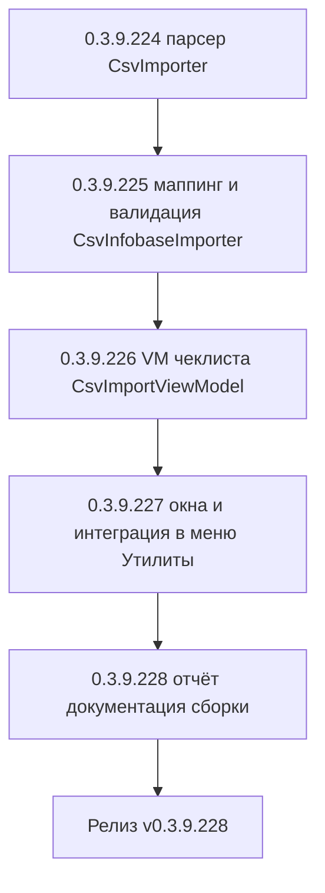

# PLAN — цикл 0.3.9.224–0.3.9.228 — Функция 11: импорт баз из CSV

Репозиторий [`sivatorov/ConfigurationManagement`](https://github.com/sivatorov/ConfigurationManagement),
локальная копия `f:\Yandex.Disk\h\Configuration_Management`, ветка `main`.
Локальный HEAD на момент плана — **0.3.9.223** (завершаются циклы журнала регистрации
0.3.9.161–166, планировщика ОС 0.3.9.167–171, уведомлений 0.3.9.180–186, проверки копий
0.3.9.200–207, CLI 0.3.9.217–223; версия в
[`Configuration Management.csproj`](../Configuration%20Management/Configuration%20Management.csproj:62)
на момент плана — 0.3.9.223). Новый цикл стартует **после завершения 0.3.9.217–223**;
нумерация этапов 0.3.9.224–228 условна и может сместиться на фактический HEAD — перед
стартом первого этапа исполнитель сверяет версию в csproj (риск п. 6).

Режим: Архитектор (план) → задачи-исполнители в режиме **code** (`new_task` по одному на этап).
**Один этап = одна версия = один коммит.** План-файл остаётся untracked (`plans/` в
`.codeassistantignore`); CHANGELOG/README/csproj коммитятся. Это **новая функция** (собственная
дорожная карта): комментарии к issues не публикуются; в CHANGELOG заголовок — «Добавлено».

---

## 1. Сводка цикла

| № | Версия | Суть | Приоритет |
|---|--------|------|-----------|
| 1 | 0.3.9.224 | Низкоуровневый парсер `Services/CsvImporter.cs`: строгое чтение RFC 4180 (разделитель «;», удвоенные кавычки, переводы строк в полях), CRLF/LF, UTF-8 с BOM и без, построчная ошибка на незакрытую кавычку (не роняет файл), позиции строк; тесты | 1 |
| 2 | 0.3.9.225 | `Services/CsvInfobaseImporter.cs` (маппинг колонок по заголовку ru/en, валидация строк, дедупликация внутри файла и против существующих, построение `Infobase`), `Services/CsvImportApplier.cs` (чистое применение отмеченных баз к списку/группам — тестируемо без окна), модель `ViewModels/CsvImportRow.cs`; тесты | 1 |
| 3 | 0.3.9.226 | `ViewModels/CsvImportViewModel.cs`: чеклист (таблица «база \| тип \| подключение \| группа \| теги \| статус»), сводка «будет добавлено / пропущено / ошибок», «Выделить все / Снять все», команда «Импортировать» (фильтр отмеченных новых), флаг завершения и отмена; тесты | 1 |
| 4 | 0.3.9.227 | Окна `CsvImportWindow` (WPF XAML + Avalonia), команда «Импорт из CSV…» в подменю «Утилиты» рядом с экспортом (обе платформы), интеграция в `MainViewModel`: выбор файла → разбор → окно → применение через `CsvImportApplier` → `Save()`/`SaveGroups()` → группы при необходимости → итоговое сообщение; локализация ru/en | 1 |
| 5 | 0.3.9.228 | Отчёт об импорте (детализация пропусков по причинам, ключи локализации), CHANGELOG/README/ARCHITECTURE (раздел импорта), полные сборки Windows+Linux, сквозная ручная проверка (экспорт → импорт, Excel-вариант, битый файл) | 2 |



---

## 2. Общие требования к КАЖДОМУ этапу

1. Реализация на обеих платформах (Windows/WPF + Linux/Avalonia), где применимо; чистые
   сервисы/парсеры — без платформенных зависимостей; платформенная часть — только
   `Views/CsvImportWindow.xaml(.cs)` (WPF) и `Views/CsvImportWindow.Avalonia.cs` (Avalonia),
   по образцу `ClusterImportWindow` (цикл 0.3.9.172–175).
2. Инкремент версии в [`Configuration Management.csproj`](../Configuration%20Management/Configuration%20Management.csproj:62)
   (строки 62–65: Version/AssemblyVersion/FileVersion/InformationalVersion) на 1 патч.
3. Запись в [`CHANGELOG.md`](../CHANGELOG.md:12) (сверху, раздел «Добавлено») и обновление
   бейджа версии в [`README.md`](../README.md:3).
4. Тесты: `dotnet test` зелёный и `dotnet build -p:BuildLinux=true` без ошибок. Тесты пишутся
   на **xUnit** (`[Fact]`/`[Theory]`) — конвенция существующих файлов, например
   [`CsvExporterTests.cs`](../ConfigurationManagement.Tests/CsvExporterTests.cs:1)
   (NUnit в репозитории не используется).
5. Один коммит (без пуша); без ключевых слов автозакрытия issues. Образец сообщения:
   `0.3.9.224: импорт баз из CSV — парсер RFC 4180`.
6. Все пункты плана перед исполнением сверить с фактическим кодом (адреса строк могут
   сместиться; циклы 0.3.9.217–223 ещё в работе и могут затронуть `MainWindow.xaml`/
   `MainWindow.Avalonia.Tree.cs`/`MainViewModel`/`csproj`/`README.md`).
7. **Перед этапом 0.3.9.224 проверить**:
   - фактические колонки и заголовки CSV-экспорта (`BuildCsvRows` в
     [`MainViewModel.Tools.cs`](../Configuration%20Management/ViewModels/MainViewModel.Tools.cs:780)
     и зеркале `MainViewModel.Avalonia.Tools.cs`, строка 561) и значения
     `ExportCsv.Col*`/`ExportCsv.Yes`/`ExportCsv.No` в `Localization/Languages/ru.json` (строки
     1709–1723) и `en.json` — маппинг импорта пишется под эти заголовки;
   - сигнатуру `ConnectionSettings.ParseConnectionString`/`ToConnectionString`
     ([`ConnectionSettings.cs`](../Configuration%20Management/Models/ConnectionSettings.cs:147)) —
     тип восстанавливается из строки подключения, локализованная колонка «Тип» для
     построения не используется;
   - путь сохранения после импорта: `Save()`/`SaveGroups()`/`RebuildGroupTree()`/
     `SyncFavoriteHotkeys()` и создание корневых групп — паттерн
     `ExecuteImportClusterInfobases`
     ([`MainViewModel.Tools.cs`](../Configuration%20Management/ViewModels/MainViewModel.Tools.cs:2686))
     и его зеркало в `MainViewModel.Avalonia.Tools.cs`;
   - фактическое место пунктов меню: WPF [`MainWindow.xaml`](../Configuration%20Management/Views/MainWindow.xaml:786)
     (подменю Operations) и Avalonia [`MainWindow.Avalonia.Tree.cs`](../Configuration%20Management/Views/MainWindow.Avalonia.Tree.cs:1785);
   - какую семантику имеет `Infobase.Group` при экспорте (полный путь «A/B» или простое имя) —
     от этого зависит интерпретация колонки «Группа» (вопрос п. 8.2);
   - выполняется ли синхронизация `ibases.v8i` внутри `MainViewModel.Save()` после импорта
     кластера (ожидается да — отдельного вызова `IIbasesSyncService` не требуется, но при
     отсутствии — добавить по паттерну `ExportToIbasesAfterLocalChange`).

---

## 3. Дизайн

### 3.1. Текущий фундамент (что переиспользуется)

- Экспорт: [`CsvExporter`](../Configuration%20Management/Services/CsvExporter.cs:12) — UTF-8 BOM,
  разделитель «;», RFC 4180, CRLF; колонки в `BuildCsvRows`
  ([`MainViewModel.Tools.cs`](../Configuration%20Management/ViewModels/MainViewModel.Tools.cs:780)):
  имя, группа (полный путь), тип (локализован), строка подключения, теги («, »), закладка
  1–9, закрепление («Да»/«Нет» — локализовано), дата изменений, размер. Команда
  `ExportBasesCsvCommand` в меню «Утилиты» (WPF строка 786, Avalonia строка 1785).
- Строка подключения: [`ConnectionSettings`](../Configuration%20Management/Models/ConnectionSettings.cs:6)
  — `ParseConnectionString` (разбор `File="…"`/`WS="…"`/`Srvr="…";Ref="…"` с `Usr/Pwd` и
  параметрами `SchJobDn`/`disstt`) и `ToConnectionString` (обратная запись). **Единый код —
  строгое соответствие формату экспорта без ручного разбора в импортёре.**
- Дедупликация: `InfobaseJsonTransfer.ConnectionKey`
  ([`InfobaseJsonTransfer.cs`](../Configuration%20Management/Services/InfobaseJsonTransfer.cs:42)) —
  нормализованная `ToConnectionString().Trim().ToUpperInvariant()`; уже используется JSON-
  импортом и `--add` (0.3.9.219). Пустая строка — база без подключения, дубликатом не считается.
- UX чеклиста: [`ClusterImportViewModel`](../Configuration%20Management/ViewModels/ClusterImportViewModel.cs:20)
  + [`ClusterImportRow`](../Configuration%20Management/ViewModels/ClusterImportRow.cs:15) +
  окна `ClusterImportWindow` (WPF XAML, строка 24 / Avalonia, строка 37): строки с флажком,
  `IsDuplicate`/`SkipReason` (сняты и помечены), сводка `ReadyToImportCount`/`DuplicateCount`,
  `SelectAll`/`SelectNone`, `Import()` фильтрует отмеченные новые в `SelectedBases`, флаг
  `ImportCompleted` закрывает окно. **VM-чеклист импорта CSV строится по этому же паттерну.**
- Добавление баз и групп: паттерн `ExecuteImportClusterInfobases`
  ([`MainViewModel.Tools.cs`](../Configuration%20Management/ViewModels/MainViewModel.Tools.cs:2666)) —
  страховка от дубликатов по актуальному списку, `Infobases.Add`, корневые группы
  `new Group { Name = groupName }` при отсутствии, `Save()`/`SaveGroups()`/`RebuildGroupTree()`.
- Репозиторий: [`IInfobaseRepository`](../Configuration%20Management/Services/IInfobaseRepository.cs:5)
  (`Load`/`Save`, `LoadGroups`/`SaveGroups`).
- Локализация: JSON-словари [`ru.json`](../Configuration%20Management/Localization/Languages/ru.json:1)/
  `en.json` через `LocalizationManager.T(key)`.

### 3.2. Формат импорта и низкоуровневый парсер (этап 0.3.9.224)

**Решение: строгий формат собственного экспорта.** Файл принимается только если разбор
заголовка распознал колонки экспорта (ru или en). Автодетект разделителя «,»/«\t» **не**
выполняется: файлы с другими разделителями отклоняются понятной ошибкой
(`ImportCsv.HeaderNotRecognized`) — ложное распознавание хуже явного отказа (см. вопрос п. 8.1).
Кодировка: **UTF-8**, BOM допускается и не обязателен (Excel и текстовые редакторы могут
сохранять без BOM); файлы в Windows-1251/CP866 не распознаются по заголовку → та же понятная
ошибка. Переводы строк: CRLF и LF принимаются (экспорт пишет CRLF по RFC 4180, но
редакторы могут нормализовать).

```csharp
// Services/CsvImporter.cs (чистый, обе платформы)
public sealed record CsvCell(int ColumnIndex, string? Value);

public sealed record CsvParseError(int LineNumber, string Message);

public sealed class CsvParseResult
{
    public IReadOnlyList<IReadOnlyList<CsvCell>> Rows { get; init; } = Array.Empty<IReadOnlyList<CsvCell>>();
    public IReadOnlyList<CsvParseError> Errors { get; init; } = Array.Empty<CsvParseError>();
}

public static class CsvImporter
{
    /// <summary>Разделитель полей — «;» (формат CsvExporter).</summary>
    public const char Separator = CsvExporter.Separator;

    /// <summary>Читает текст и разбирает как RFC 4180 CSV. Пустые строки пропускаются.</summary>
    public static CsvParseResult Parse(string content);

    /// <summary>Читает файл в UTF-8 (BOM допустим и не обязателен).</summary>
    public static CsvParseResult ParseFile(string path);
}
```

Правила токенизации (симметричны `CsvExporter.Escape`):
- поле экранировано, если начинается с `"`; внутренние `""` — экранированная кавычка;
  переводы строк и разделитель внутри кавычек — часть поля;
- незакрытая кавычка до конца строки — ошибка **этой** строки (`CsvParseError`), парсер
  продолжает со следующей физической строки; файл целиком не отклоняется;
- физическая строка — до CRLF/LF вне кавычек; количество полей в строках может отличаться
  (дополняется/обрезается на этапе маппинга);
- BOM первого поля удаляется; пустые строки (0 полей или единственное пустое поле)
  пропускаются.

### 3.3. Маппинг колонок и построение баз (этап 0.3.9.225)

`Services/CsvInfobaseImporter.cs` — чистая логика «файл → чеклист»:

```csharp
public sealed record CsvColumnWarning(string ColumnHeader, string Reason); // неизвестная/дублирующаяся колонка

public sealed class CsvImportResult
{
    public IReadOnlyList<CsvImportRow> Rows { get; init; } = Array.Empty<CsvImportRow>();   // готовые строки чеклиста
    public IReadOnlyList<string> ColumnWarnings { get; init; } = Array.Empty<string>();      // «колонка пропущена»
    public bool FormatValid { get; init; }                                                   // заголовок распознан
    public string? FormatError { get; init; }                                                // человекочитаемая причина отказа
    public string FilePath { get; init; } = string.Empty;
}

public static class CsvInfobaseImporter
{
    /// <param name="existingBases">Текущие базы списка — для пометки дубликатов (ConnectionKey).</param>
    public static CsvImportResult Import(string filePath, IReadOnlyList<Infobase> existingBases);
}
```

**Канонические имена колонок** (распознаются по заголовкам ru/en из ключей `ExportCsv.Col*`):

| Канон | ru | en | Обязательная | Что делает |
|-------|----|----|--------------|------------|
| `name` | Имя базы | Base name | **да** | `Infobase.Name` |
| `group` | Группа | Group | нет | `Infobase.Group` (интерпретация «/» — вопрос п. 8.2) |
| `type` | Тип | Type | нет | **не используется** для построения (тип из строки подключения); при расхождении — предупреждение в строку |
| `connection` | Строка подключения | Connection string | **да** | `ConnectionSettings.ParseConnectionString` |
| `tags` | Теги | Tags | нет | `Infobase.Tags` (разделитель «, » как в экспорте; дополнительно допускается «;» и «,» с пробелом) |
| `favorite` | Избранное | Favorite | нет | номер закладки 1–9 → `FavoriteHotkeyNumber` + `IsFavorite=true` |
| `pinned` | Закреплено | Pinned | нет | «Да»/«Yes»/«1» → `IsPinned=true`; иначе false |
| `modified` | Дата изменений файла ИБ | IB file modified | нет | игнорируется (наблюдаемые данные, не настройки) |
| `size` | Размер ИБ | IB size | нет | игнорируется |

- Сопоставление заголовков — по точному совпадению (OrdinalIgnoreCase) с обоими наборами
  независимо от языка сессии: файл, экспортированный в en, импортируется в ru-приложении.
- Неизвестная колонка → предупреждение в `ColumnWarnings` («колонка «X» пропущена»), файл
  не отклоняется. Дублирующаяся известная колонка → предупреждение, берётся первая.
- Отсутствует обязательная колонка (`name` или `connection`) → `FormatValid=false`,
  `FormatError` с именем колонки; заголовок вообще не распознан → `FormatError =
  HeaderNotRecognized`. Пустой файл (нет строк данных) → `FormatValid=true`, пустой чеклист,
  окно не открывается — сообщение «в файле нет баз».
- Тип базы и строки подключения: `ConnectionSettings.ParseConnectionString(connection)`.
  Недопустимая строка — когда после разбора пусты и значимые поля типа
  (File→`FilePath`, ClientServer→`Server`+`DatabaseName`, WebServer→`WebUrl`).

### 3.4. Валидация строк и модель `CsvImportRow` (этапы 0.3.9.225/0.3.9.226)

```csharp
// ViewModels/CsvImportRow.cs (чистая, INotifyPropertyChanged — как ClusterImportRow)
public sealed class CsvImportRow : INotifyPropertyChanged
{
    public int LineNumber { get; }            // физический номер строки файла (для отчёта)
    public string Name { get; }
    public string TypeDisplay { get; }        // локализованный тип (колонка «Тип» чеклиста)
    public string ConnectionString { get; }
    public string Group { get; }
    public string Tags { get; }               // «a, b» для показа
    public bool IsChecked { get; set; }       // флажок импорта
    public bool IsDuplicate { get; }          // уже есть в списке
    public string? SkipReason { get; }        // причина отказа; null — можно импортировать
    public Infobase Tag { get; }              // смапленная база (результат)
}
```

Причины отказа (ключи локализации `ImportCsv.Skip*`):

| Причина | Условие | Поведение |
|---------|---------|-----------|
| пустая строка | нет имени и нет строки подключения | снята, причина |
| не задано имя | пустое/пробельное имя | снята, причина |
| не распознано подключение | пустая строка подключения или невалидная по п. 3.3 | снята, причина |
| повтор в файле | `ConnectionKey` уже встречался в этом файле (раньше по порядку) | снята, причина с номером первой строки |
| уже есть в списке | `ConnectionKey` найден среди `existingBases` | снята, `IsDuplicate=true`, причина |
| ошибка разбора строки | `CsvParseError` от парсера для этой строки | строки нет в чеклисте, попадает в `Errors` отчёта |

- Закладка вне 1–9 (0 и пусто — «нет закладки») → значение сбрасывается в 0, строка
  импортируется, предупреждение в `ColumnWarnings`/отчёт (базу не теряем).
- Приватные базы из CSV не создаются по построению: в формате экспорта нет колонки
  приватности, импортёр всегда ставит `IsPrivate=false` (требование п. 4 ТЗ).
- Повторная отметка строки с причиной пользователем не приводит к импорту: фильтр на этапе
  `Import()` (как в `ClusterImportViewModel.Import`, строка 333).

### 3.5. VM чеклиста (этап 0.3.9.226)

```csharp
// ViewModels/CsvImportViewModel.cs — по образцу ClusterImportViewModel
public sealed class CsvImportViewModel : ViewModelBase
{
    public CsvImportViewModel(
        IReadOnlyList<CsvImportRow> rows,
        IReadOnlyList<Infobase> existingBases,          // не используется напрямую (дедуп в импортёре), оставлен для симметрии/тестов
        Action<Action>? dispatchToUi = null);

    public ObservableCollection<CsvImportRow> Rows { get; }
    public int ReadyToImportCount { get; }     // отмеченные новые (сводка)
    public int DuplicateCount { get; }         // дубликаты/пропуски
    public int ErrorCount { get; }             // ошибки разбора строк (из CsvParseError)
    public IReadOnlyList<Infobase> SelectedBases { get; }  // результат Import()
    public bool ImportCompleted { get; }
    public ICommand SelectAllCommand { get; }
    public ICommand SelectNoneCommand { get; }
    public ICommand ImportCommand { get; }
}
```

- `Import()`: `Rows.Where(r => r.IsChecked && !r.IsDuplicate && string.IsNullOrEmpty(r.SkipReason))`
  → `SelectedBases`, `ImportCompleted=true`; окно закрывается (WPF `DialogResult=true`, Avalonia
  — `Close()`), как `ClusterImportWindow`.
- Отмена — закрытие окна без `Import()`: ничего не применяется.
- Сводка в окне: «Будет добавлено: N», «Пропущено: M», «Ошибок разбора: K» — паттерн
  `UpdateSummary` кластера (строка 492).

### 3.6. Применение результата: `CsvImportApplier` (этап 0.3.9.225/0.3.9.227)

Чтобы логика «отмеченные базы → список» была юнит-тестируема и не дублировалась между WPF и
Avalonia, применяется чистый сервис (расширение паттерна `ExecuteImportClusterInfobases`):

```csharp
// Services/CsvImportApplier.cs
public sealed record CsvImportApplyResult(int Added, int GroupsCreated, int DuplicatesSkipped);

public static class CsvImportApplier
{
    /// <summary>Добавляет отмеченные базы в bases, создаёт недостающие корневые группы.
    /// Страховка от дубликатов по актуальному списку (список мог измениться после разбора).</summary>
    public static CsvImportApplyResult Apply(
        IReadOnlyList<Infobase> selected,
        List<Infobase> bases,
        List<Group> groups);
}
```

- Фильтр: `!InfobaseJsonTransfer.ConnectionKey` уже есть в `bases` (регистронезависимо);
  `Id = Guid.NewGuid().ToString("N")` для новых баз (паттерн `--add`, 0.3.9.219).
- Группы: по именам добавленных баз, отсутствующие — `new Group { Name = groupName }`
  (корневые, как в `ExecuteImportClusterInfobases`, строка 2700); число созданных — в результат.
- `MainViewModel` (обе платформы) вызывает `Apply`, затем `Save()`/`SaveGroups()`/
  `RebuildGroupTree()`/`SyncFavoriteHotkeys()` и показывает итог.

### 3.7. Окна и интеграция в меню «Утилиты» (этап 0.3.9.227)

- **WPF**: `Views/CsvImportWindow.xaml` + `.xaml.cs` — тонкая обёртка (как
  [`ClusterImportWindow.xaml.cs`](../Configuration%20Management/Views/ClusterImportWindow.xaml.cs:24)):
  конструктор принимает готовый VM (`CsvImportViewModel`), `DataGrid` c колонками «база | тип |
  подключение | группа | теги | статус» (статус — `SkipReason` или «—»), чекбоксы, кнопки
  «Выделить все / Снять все / Импортировать / Отмена», сводка; результат — `SelectedBases`
  после `ShowDialog()==true`.
- **Avalonia**: `Views/CsvImportWindow.Avalonia.cs` — кодовая сборка UI (как
  [`ClusterImportWindow.Avalonia.cs`](../Configuration%20Management/Views/ClusterImportWindow.Avalonia.cs:37)).
- **Команда меню**: `MainViewModel` — `ImportBasesCsvCommand` (обе платформы):
  1. `OpenFileDialog` (фильтр `ImportCsv.FileFilter`, `*.csv`);
  2. `CsvInfobaseImporter.Import(path, Infobases.ToList())`;
  3. `FormatValid=false` → `_dialogs.ShowError(FormatError)`; `Rows.Count==0` →
     «в файле нет баз» (или все ошибки — отдельное сообщение с числом);
  4. иначе `CsvImportWindow(vm)`; `ShowDialog()!=true || SelectedBases.Count==0` → выход;
  5. `CsvImportApplier.Apply(...)` → `Save()`/`SaveGroups()`/`RebuildGroupTree()`/
     `SyncFavoriteHotkeys()` → итоговое сообщение (`ImportCsv.SuccessFormat`).
  - WPF пункт меню — [`MainWindow.xaml`](../Configuration%20Management/Views/MainWindow.xaml:786),
    подменю Operations, сразу после `Utilities.ExportCsv` (строка 787) и до/после
    `Utilities.ImportJson` (строка 802); Avalonia — [`MainWindow.Avalonia.Tree.cs`](../Configuration%20Management/Views/MainWindow.Avalonia.Tree.cs:1785)
    `MenuAction("Utilities.ImportCsv", _vm.ImportBasesCsvCommand, null, "IconImport", "#06B6D4")`
    после `Utilities.ExportCsv`.
  - Регистрация команды в конструкторе `MainViewModel` (рядом с `ExportBasesCsvCommand`,
    [`MainViewModel.cs`](../Configuration%20Management/ViewModels/MainViewModel.cs:576)) и в
    Avalonia-зеркале (`MainViewModel.Avalonia.Commands.cs`, строка 152).

### 3.8. Отчёт об импорте (этапы 0.3.9.227/0.3.9.228)

- В окне-чеклисте: сводка «будет добавлено / пропущено / ошибок разбора» + причины в колонке
  «Статус» каждой строки — это и есть основной отчёт.
- После применения: итоговое сообщение (`ImportCsv.SuccessFormat`): добавлено N, пропущено
  дубликатов M (из отмеченных), создано групп G, ошибок разбора K.
- `IAppLogger`: строка-итог с путём файла и количеством (без строк подключения целиком —
  только имена, паттерн `ClusterImport` строка 2712); при `ImportCsv`-ошибках — `ErrorMessage`.

---

## 4. Тесты

### 4.1. Этап 0.3.9.224 — `CsvImporterTests`

- Валидные файлы: разделитель «;», поля без кавычек; экранированные кавычки (`""`); поле с
  переводом строки и разделителем внутри кавычек; CRLF и LF; финальный перевод строки есть/нет.
- BOM: файл с BOM (первые байты `EF BB BF`) и без BOM — оба разбираются, кириллица цела.
- Пустые/мусорные: пустой файл → 0 строк; строка только с пробелами → пропущена; хвостовой
  разделитель → пустое последнее поле.
- Битые: незакрытая кавычка → `CsvParseError` с номером строки, остальные строки разобраны;
  незакрытая кавычка на последней строке.
- Соответствие паре «экспорт → импорт»: `CsvExporter.BuildDocument` → `CsvImporter.Parse`
  → исходные поля (круглый тест для произвольных значений с кавычками/разделителями/переносами).

### 4.2. Этап 0.3.9.225 — `CsvInfobaseImporterTests` + `CsvImportApplierTests`

- Маппинг колонок: ru-заголовки, en-заголовки; смешанный файл; неизвестная колонка →
  `ColumnWarnings`, файл валиден; дублирующаяся колонка → берётся первая + предупреждение.
- Отсутствие обязательных колонок: нет «name», нет «connection» → `FormatValid=false` с именем;
  произвольный заголовок → `HeaderNotRecognized`; пустой файл (только заголовок) →
  валиден, строк 0.
- Построение базы: `File="C:\b"` → File; `WS="http://…"` → WebServer; `Srvr="srv";Ref="db"` →
  ClientServer с Server/DatabaseName и портом; тип восстанавливается **даже если** колонка
  «Тип» отсутствует или противоречит строке подключения (предупреждение).
- Теги: «a, b» → 2 тега; «a; b» → 2 тега; пустые — 0.
- Закладка: «3» → FavoriteHotkeyNumber=3, IsFavorite=true; «0»/пусто → 0; «12»/«abc» → 0 +
  предупреждение, строка импортируется.
- Закрепление: «Да»/«Yes»/«1» → true; «Нет»/«No»/пусто → false.
- Дедупликация: повтор строки подключения внутри файла → «повтор в файле (строка N)»;
  регистронезависимость (`Srvr="SRV1"` vs `srv1`); дубликат со списком → `IsDuplicate=true`;
  пустая строка подключения не считается дубликатом.
- `CsvImportApplier.Apply`: добавление отмеченных (новые Id-GUID), повторный вызов — дубликаты
  пропущены; создание корневых групп по именам; отсутствующие группы не трогаются;
  `GroupsCreated`/`DuplicatesSkipped` корректны.
- Интеграция с репозиторием (fake `IInfobaseRepository`): файл → `Import` → `Apply` → базы и
  группы сохранены (Save/SaveGroups вызваны), повторный импорт того же файла — всё пропущено.

### 4.3. Этап 0.3.9.226 — `CsvImportViewModelTests`

- Дефолты: пустой `Rows`, счётчики 0, команды существуют, `ImportCompleted=false`.
- Чеклист: готовые строки попадают в `Rows`; `ReadyToImportCount`/`DuplicateCount`/`ErrorCount`
  считаются по статусам.
- `SelectAll`/`SelectNone`: отмечают/снимают только импортируемые (не дубликаты, без причины);
  сводка обновляется.
- `Import()`: отмеченные новые → `SelectedBases`; дубликаты и строки с причиной не попадают,
  даже если отмечены вручную; `ImportCompleted=true`; повторный `Import()` — тот же результат.
- Отмена (окно закрыто без `Import()`): `SelectedBases` пуст, список не изменён.
- Фикстура с `dispatchToUi=null` (тесты, как `ClusterImportViewModelTests`, строка 24).

### 4.4. Этап 0.3.9.227 — интеграция

- Сквозной тест «файл → VM → Apply → fake-репозиторий»: экспортированный `CsvExporter`-файл
  (реальный, в temp) с дубликатом и битой строкой: дубликат помечен, битая в `Errors`,
  остальное добавлено; группы созданы; `Save`/`SaveGroups` вызваны.
- `MainViewModel`-регрессия: существующие тесты (например, `GroupNodeViewModelTests`,
  `InfobaseDisplayTests`) остаются зелёными после добавления команды.
- Ручной чек (обе платформы): экспорт → импорт того же файла (0 добавлено, всё пропущено как
  дубликаты); файл с новой базой; файл из Excel (разделитель «;», кодировка CP1251 — ожидаем
  понятную ошибку заголовка); битый CSV.

### 4.5. Этап 0.3.9.228

- Регрессия: `dotnet test` целиком, `dotnet build -p:BuildLinux=true`.
- Ручной чек: перенос списка между установками (экспорт на одной машине → импорт на другой);
  массовое добавление из Excel (пересохранённый CSV UTF-8); проверка приватных баз (не
  создаются); пункт меню на WPF и Avalonia; отчёт об импорте ru/en.

---

## 5. Таблица декомпозиции задач

| № | Версия | Файлы (новые/изменяемые) | Тесты | Риски и митигации |
|---|--------|--------------------------|-------|-------------------|
| 1 | 0.3.9.224 | **New:** `Services/CsvImporter.cs`. **Edit:** (нет, версия в csproj + CHANGELOG/README как обычно) | `CsvImporterTests` (п. 4.1) | Парсер расходится с `CsvExporter` (обратная операция не круглая) → круглый тест «экспорт→импорт» на случайных полях; незакрытая кавычка роняет весь файл → построчные ошибки, continue; кодировки Windows-1251 → строгое UTF-8 + понятная ошибка заголовка на этапе 225 (не на парсере) | 
| 2 | 0.3.9.225 | **New:** `Services/CsvInfobaseImporter.cs`, `Services/CsvImportApplier.cs`, `ViewModels/CsvImportRow.cs`. **Edit:** при необходимости `Localization` (ключи статусов строк/предупреждений — минимально здесь или на этапе 227) | `CsvInfobaseImporterTests`, `CsvImportApplierTests` (п. 4.2) | Заголовки локализованы (ru/en) и могут расходиться → маппинг по обоим наборам, не зависящий от языка сессии; тип локализован → восстанавливается из строки подключения через `ParseConnectionString` (единый код); семантика `Infobase.Group` («A/B») неоднозначна → решение по вопросу п. 8.2 до реализации маппинга; дубликат не распознан → `ConnectionKey` уже нормализует регистр и пустые значения | 
| 3 | 0.3.9.226 | **New:** `ViewModels/CsvImportViewModel.cs` | `CsvImportViewModelTests` (п. 4.3) | Повторный чек дубликата пользователем приводит к импорту → фильтр в `Import()` (паттерн кластера, строка 339); сводка расходится с реальностью → пересчёт по строкам при смене `IsChecked`; большие чеклисты → DataGrid-виртуализация уже стандартная, ограничений не вводим | 
| 4 | 0.3.9.227 | **New:** `Views/CsvImportWindow.xaml` + `.xaml.cs`, `Views/CsvImportWindow.Avalonia.cs`. **Edit:** `ViewModels/MainViewModel.cs` (команда, WPF), `ViewModels/MainViewModel.Avalonia.Commands.cs`, `ViewModels/MainViewModel.Tools.cs` + `ViewModels/MainViewModel.Avalonia.Tools.cs` (ExecuteImportBasesCsv), `Views/MainWindow.xaml` (пункт меню, строка ~786), `Views/MainWindow.Avalonia.Tree.cs` (строка ~1785), `Localization/Languages/ru.json` + `en.json` (ключи `Utilities.ImportCsv`, `ImportCsv.*`) | Сквозной тест п. 4.4, VM-регрессия | Дублирование логики WPF/Avalonia → общий `CsvImportApplier` + общая VM, в MainViewModel только диалоги и сохранение; пункт меню не туда → рядом с `Utilities.ExportCsv` в обоих местах; локальная синхронизация `ibases.v8i` → проверить, что `Save()` уже вызывает `ExportToIbasesAfterLocalChange`, иначе добавить по паттерну (п. 2.7) | 
| 5 | 0.3.9.228 | **Edit:** `CHANGELOG.md`, `README.md` (раздел «Импорт из CSV»: формат, ограничения, шаги), `ARCHITECTURE.md` (связка `CsvImporter` → `CsvInfobaseImporter` → `CsvImportViewModel` → `CsvImportApplier`), при необходимости `Localization` (детали отчёта), полные сборки Windows+Linux | Регрессия и ручной чек по п. 4.5 | Файлы, сформированные не экспортом (Excel CP1251, «,»-разделитель) → явная ошибка заголовка (задокументирована); отчёт об импорте не покрыт автотестами → ключи локализации и счётчики покрыты на уровне сервисов/VM, окно — ручной чек; перенос между установками требует верности `ConnectionKey` → круглый тест этапа 224 | 

---

## 6. Риски (сводно) и митигации

| Риск | Митигация |
|------|-----------|
| Циклы 0.3.9.217–223 в работе: фактический HEAD, сигнатуры `MainViewModel`/меню/`csproj` отличаются от плана | Проверка перед каждым этапом (п. 2.6–2.7); при конфликте — актуализация плана; нумерация 0.3.9.224–228 может сместиться | 
| Парсер импорта не обратно-симметричен экспорту (поля с кавычками/переносами/разделителем) | Круглый тест `CsvExporter.BuildDocument` → `CsvImporter.Parse` → идентичность полей; симметричные правила токенизации | 
| Заголовки колонок локализованы: файл из en-экспорта не импортируется в ru-приложение | Маппинг по обоим наборам заголовков (ru/en) независимо от языка сессии; тест на оба набора | 
| Колонка «Тип» содержит локализованные значения и может противоречить строке подключения | Тип восстанавливается только из строки подключения (`ParseConnectionString`); колонка «Тип» — справочно с предупреждением | 
| Сторонние CSV (Excel CP1251, разделители «,»/«\t») | Строгий формат своего экспорта (UTF-8, «;»); нераспознанный заголовок — понятная ошибка; автодетект не выполняется (вопрос п. 8.1) | 
| Битые строки (незакрытые кавычки) валят весь импорт | Построчные `CsvParseError`; остальные строки разбираются; счётчик в отчёте | 
| Дубликаты: строка подключения нормализуется по-разному (регистр, пробелы) | Единый `InfobaseJsonTransfer.ConnectionKey`; тест на регистр и пустые строки | 
| Группы: полный путь «A/B» интерпретирован неверно | Решение до маппинга (вопрос п. 8.2); рекомендуемый вариант — создание недостающих уровней иерархии по «/» (как в JSON-импорте), fallback — корневая группа с полным именем | 
| Приватные базы случайно создаются из файла | В формате экспорта нет признака приватности; импортёр всегда `IsPrivate=false` — документируется | 
| Большой файл (десятки тысяч строк) | Построчный разбор (`StringReader`), без материализации всего текста; ObservableCollection + виртуализация DataGrid | 
| Дублирование логики между WPF и Avalonia | Вся чистая логика — в сервисах/VM (`CsvImporter`/`CsvInfobaseImporter`/`CsvImportApplier`/`CsvImportViewModel`); в MainViewModel — только диалоги и `Save()` | 

---

## 7. Локализация (новые ключи, ru/en)

Ресурсы: [`ru.json`](../Configuration%20Management/Localization/Languages/ru.json:1)/`en.json`
(структура `code`/`name`/`strings`), чтение через `LocalizationManager.T`.

- `Utilities.ImportCsv` — «Импорт из CSV…» / «Import from CSV…» (пункт меню).
- `ImportCsv.Title` — «Импорт баз из CSV» / «Import bases from CSV» (заголовок окна).
- `ImportCsv.FileFilter` — «CSV-файлы (*.csv)\|*.csv\|Все файлы (*.*)\|*.*» / аналог en.
- `ImportCsv.HeaderNotRecognized` — «Файл не является CSV-экспортом списка баз (не распознан
  заголовок). Используйте экспорт из меню «Утилиты» или сохраните файл в UTF-8 с разделителем
  «;».» / англ. аналог.
- `ImportCsv.MissingRequiredColumn` — «Не найдена обязательная колонка «{0}».» /
  «Required column «{0}» is missing.»
- `ImportCsv.ColumnSkipped` — «Колонка «{0}» пропущена.» / «Column «{0}» skipped.»
- `ImportCsv.NoBases` — «В файле нет баз для импорта.» / «No bases to import in the file.»
- `ImportCsv.SummaryFormat` — «Будет добавлено: {0}» / «To add: {0}».
- `ImportCsv.DuplicatesFormat` — «Пропущено: {0}» / «Skipped: {0}».
- `ImportCsv.ErrorsFormat` — «Ошибок разбора: {0}» / «Parse errors: {0}».
- `ImportCsv.SuccessFormat` — «Импорт завершён.\n\nДобавлено баз: {0}\nСоздано групп: {1}\nПропущено
  дубликатов: {2}\nОшибок разбора: {3}» / англ. аналог.
- `ImportCsv.Error` — «Не удалось выполнить импорт из CSV.\n{0}» / «Failed to import from CSV.\n{0}».
- Заголовки чеклиста: `ImportCsv.ColName`/`ColType`/`ColConnection`/`ColGroup`/`ColTags`/`ColStatus`
  («База», «Тип», «Подключение», «Группа», «Теги», «Статус»).
- Кнопки: `ImportCsv.ImportButton` («Импортировать»), `ImportCsv.SelectAll`/`SelectNone`
  (переиспользовать `Selection.SelectAll`/`SelectNone`-аналоги или свои ключи).
- Причины: `ImportCsv.SkipEmptyRow`, `SkipNoName`, `SkipBadConnection`, `SkipFileDuplicate`
  («Повтор в файле: строка {0}»), `SkipAlreadyExists` («Уже есть в списке»),
  `SkipBadFavorite` («Некорректная закладка, сброшена»).

---

## 8. Вопросы, требующие решения до старта этапа 0.3.9.224

> **Статус: все решения утверждены пользователем 01.10.2026 — «утвердить план как есть».**

1. **Разделитель и кодировка** — **РЕШЕНО: строгий формат** собственного экспорта (UTF-8,
   «;», RFC 4180). Автодетект разделителя «,»/«\t» **не выполняется**; нераспознанный
   заголовок → понятная ошибка `ImportCsv.HeaderNotRecognized`.
2. **Интерпретация колонки «Группа»** — **РЕШЕНО: корневая группа с полным именем** (вариант
   б): `new Group { Name = groupName }`, паттерн `ExecuteImportClusterInfobases`
   ([`MainViewModel.Tools.cs`](../Configuration%20Management/ViewModels/MainViewModel.Tools.cs:2700)).
   Иерархия по «/» в этом цикле не разбирается.
3. **Закладки/закрепление** — **РЕШЕНО: импортируются полностью** (номер закладки 1–9 +
   `IsPinned` по «Да»/«Yes»/«1»); некорректные значения (закладка вне 1–9) не блокируют
   строку — значение сбрасывается в 0 с предупреждением.
4. **Отчёт об импорте** — **РЕШЕНО: итоговое сообщение + причины в окне-чеклисте** (колонка
   «Статус»); отдельное окно отчёта в этом цикле не делается.