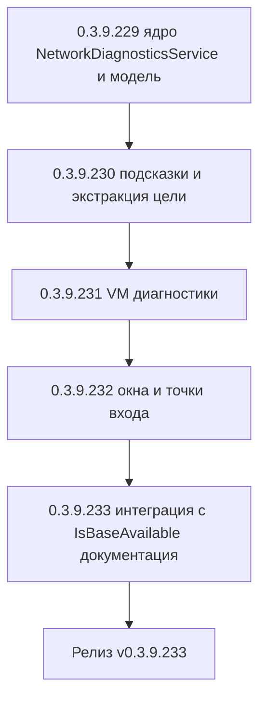

# PLAN — цикл 0.3.9.229–0.3.9.233 — Функция 12: диагностика сети до сервера 1С

Репозиторий [`sivatorov/ConfigurationManagement`](https://github.com/sivatorov/ConfigurationManagement),
локальная копия `f:\Yandex.Disk\h\Configuration_Management`, ветка `main`.
Локальный HEAD на момент плана — **0.3.9.228** (завершены циклы журнала регистрации
0.3.9.161–166, планировщика ОС 0.3.9.167–171, уведомлений 0.3.9.180–186, проверки копий
0.3.9.200–207, CLI 0.3.9.217–223, CSV-импорта 0.3.9.224–228; версия в
[`Configuration Management.csproj`](../Configuration%20Management/Configuration%20Management.csproj:62)
на момент плана — 0.3.9.228). Новый цикл стартует **после завершения 0.3.9.224–228**;
нумерация этапов 0.3.9.229–233 условна и может сместиться на фактический HEAD — перед
стартом первого этапа исполнитель сверяет версию в csproj (риск п. 6).

Режим: Архитектор (план) → задачи-исполнители в режиме **code** (`new_task` по одному на этап).
**Один этап = одна версия = один коммит.** План-файл остаётся untracked (`plans/` в
`.codeassistantignore`); CHANGELOG/README/csproj коммитятся. Это **новая функция** (собственная
дорожная карта): комментарии к issues не публикуются; в CHANGELOG заголовок — «Добавлено».

---

## 1. Сводка цикла

| № | Версия | Суть | Приоритет |
|---|--------|------|-----------|
| 1 | 0.3.9.229 | Ядро: чистый `Services/NetworkDiagnosticsService.cs` (резолв DNS, ICMP-ping с переносимой обработкой прав Linux, TCP-проверка порта с RTT и таймаутом; инжектируемые делегаты для тестов), модель `Models/NetworkDiagnosticsResult.cs` (хост, IP, порты 1540/1541/1545, пинг, RTT), парсер адреса `host[:port]`/`[IPv6]:port`; константы портов 1С; тесты | 1 |
| 2 | 0.3.9.230 | Подсказки по проблемам (`Services/NetworkDiagnosticsHints.cs` — чистое построение выводов по матрице состояний) и экстракция цели диагностики из базы/монитора (`Services/NetworkDiagnosticsTarget.cs`: ClientServer → Server+Port, WebServer → хост/порт из URL, File → null); тесты | 1 |
| 3 | 0.3.9.231 | `ViewModels/NetworkDiagnosticsViewModel.cs` + `PortDiagnosticRow`: карточка хоста, таблица портов, команды «Повторить» / «Проверить порты 1С» (1540/1541/1545), состояния, dispatchToUi; тесты | 1 |
| 4 | 0.3.9.232 | Окна `NetworkDiagnosticsWindow` (WPF XAML + Avalonia), точки входа: пункт «Диагностика подключения…» в контекстном меню серверной/веб-базы (обе платформы) и кнопка «Диагностика сети…» в окне монитора серверов; локализация ru/en; тесты интеграции | 1 |
| 5 | 0.3.9.233 | Интеграция с `IsBaseAvailable`: опциональный быстрый TCP-precheck порта кластера (флаг настройки, по умолчанию выключен) — только quick-fail «недоступно», финальное слово за COM; настройка в окне «Настройки»; CHANGELOG/README/ARCHITECTURE; полные сборки Windows+Linux; ручная проверка | 2 |



---

## 2. Общие требования к КАЖДОМУ этапу

1. Реализация на обеих платформах (Windows/WPF + Linux/Avalonia), где применимо; чистые
   сервисы/модели — без платформенных зависимостей; платформенная часть — только
   `Views/NetworkDiagnosticsWindow.xaml(.cs)` (WPF) и `Views/NetworkDiagnosticsWindow.Avalonia.cs`
   (Avalonia), по образцу `ClusterImportWindow` (цикл 0.3.9.172–175) и `ServerMonitorWindow`
   (0.3.9.124). `.NET 10` (System.Net.NetworkInformation.Ping, TcpClient, Dns — входят в BCL).
2. Инкремент версии в [`Configuration Management.csproj`](../Configuration%20Management/Configuration%20Management.csproj:62)
   (строки 62–65: Version/AssemblyVersion/FileVersion/InformationalVersion) на 1 патч.
3. Запись в [`CHANGELOG.md`](../CHANGELOG.md:12) (сверху, раздел «Добавлено») и обновление
   бейджа версии в [`README.md`](../README.md:3).
4. Тесты: `dotnet test` зелёный и `dotnet build -p:BuildLinux=true` без ошибок. Тесты пишутся
   на **xUnit** (`[Fact]`/`[Theory]`) — конвенция существующих файлов, например
   [`ServerMonitorViewModelTests.cs`](../ConfigurationManagement.Tests/ServerMonitorViewModelTests.cs:1)
   (в репозитории используется xUnit, NUnit нет).
5. Один коммит (без пуша); без ключевых слов автозакрытия issues. Образец сообщения:
   `0.3.9.229: диагностика сети — сервис NetworkDiagnosticsService`.
6. Все пункты плана перед исполнением сверить с фактическим кодом (адреса строк могут
   сместиться; циклы 0.3.9.217–228 ещё в работе и могут затронуть `MainWindow.xaml`/
   `MainWindow.Avalonia.Tree.cs`/`MainViewModel`/`csproj`/`README.md`/`ru.json`/`en.json`).
7. **Перед этапом 0.3.9.229 проверить**:
   - фактическую сигнатуру и поведение [`ConnectionSettings.ParseServerAndPort`](../Configuration%20Management/Models/ConnectionSettings.cs:96)
     (разбор `host:port` и `[IPv6]:port`, строки 108–140) — парсер адреса диагностики не
     дублирует его, а реализует свой контракт (возврат результата вместо мутации);
   - [`IsBaseAvailable`](../Configuration%20Management/ViewModels/MainViewModel.Tools.cs:1531)
     и зеркало `MainViewModel.Avalonia.Tools.cs` (строка 1258) — точку вставки TCP-precheck
     (этап 0.3.9.233): до вызова `ReadConfigurationInfo`, только для `ClientServer`;
   - настройки приложения: где лежит `ComDetectTimeoutMs` (issue #289) и как добавляется новая
     булева настройка (`AppSettings`/окно настроек WPF+Avalonia) — для флага
     `AvailabilityTcpPrecheckEnabled`;
   - конструктор и события [`ServerMonitorViewModel`](../Configuration%20Management/ViewModels/ServerMonitorViewModel.cs:66)
     (`ServerAddress`/`ServerPort`) и оба окна
     [`ServerMonitorWindow.xaml.cs`](../Configuration%20Management/Views/ServerMonitorWindow.xaml.cs:22) /
     [`ServerMonitorWindow.Avalonia.cs`](../Configuration%20Management/Views/ServerMonitorWindow.Avalonia.cs:38)
     — куда добавить кнопку «Диагностика сети…» (этап 0.3.9.232);
   - места контекстного меню базы: WPF [`MainWindow.xaml`](../Configuration%20Management/Views/MainWindow.xaml:2439)
     (подменю «Администрирование», пункт после «Зарегистрировать COM-коннектор», строка 2530)
     и Avalonia [`MainWindow.Avalonia.Tree.cs`](../Configuration%20Management/Views/MainWindow.Avalonia.Tree.cs:1971)
     (`adminMenu`, строки 1971–1988) — добавление пункта «Диагностика подключения…»;
   - формат ключей локализации [`ru.json`](../Configuration%20Management/Localization/Languages/ru.json:1)/
     `en.json` и чтение через `LocalizationManager.T(key)`.

---

## 3. Дизайн

### 3.1. Текущий фундамент (что переиспользуется)

- Параметры подключения: [`ConnectionSettings`](../Configuration%20Management/Models/ConnectionSettings.cs:6)
  — `Server`/`Port`/`DatabaseName` для клиент-серверных, `WebUrl` для веб-баз;
  `ParseServerAndPort` разбирает `host`, `host:port`, `[IPv6]:port` (строки 96–140).
  **Внимание**: `ConnectionSettings.Port` — это порт **кластера** (по умолчанию 1541,
  строка 62), а не порт агента 1540. Для цели диагностики из базы берём именно
  `Server`+`Port`; кнопка «Проверить порты 1С» дополнительно проверяет 1540 и 1545.
- Монитор серверов: [`RacConnectionParams`](../Configuration%20Management/Services/IRacClient.cs:15)
  (`Address`/`Port`, порт по умолчанию 1540 — `IRacClient.DefaultPort`, строка 58);
  [`ServerMonitorViewModel`](../Configuration%20Management/ViewModels/ServerMonitorViewModel.cs:66)
  держит текущие `ServerAddress`/`ServerPort` — из них строится цель диагностики кнопки
  монитора. Окно монитора создаётся из
  [`MainViewModel.Tools.cs`](../Configuration%20Management/ViewModels/MainViewModel.Tools.cs:2643)
  (WPF) и `MainViewModel.Avalonia.Tools.cs` (строка 1610) — паттерн показа модального окна.
- Проверка доступности: [`IsBaseAvailable`](../Configuration%20Management/ViewModels/MainViewModel.Tools.cs:1531):
  файловая — путь, клиент-серверная — COM `ReadConfigurationInfo` с таймаутом
  `ComDetectTimeoutMs`, веб — непустой `WebUrl`. Может вызываться параллельно до 4 баз
  (`AvailabilityParallelism`, строка 1489) — TCP-precheck должен быть быстрым и безопасным.
- Абстракции для тестов: паттерн инжектируемых делегатов
  [`PlatformUpdateViewModel`](../Configuration%20Management/ViewModels/PlatformUpdateViewModel.cs:28)
  (`Func<...>` с параметрами по умолчанию null → реальная реализация) и паттерн
  `dispatchToUi` (`Action<Action>?`, null в тестах) у `ServerMonitorViewModel`.
- Локализация: JSON-словари [`ru.json`](../Configuration%20Management/Localization/Languages/ru.json:1)/
  `en.json`, чтение `LocalizationManager.T(key)`, ключи с префиксом по окну (например,
  `ServerMonitor.Title`).

### 3.2. Модель результата (этап 0.3.9.229)

```csharp
// Models/NetworkDiagnosticsResult.cs (чистая модель, обе платформы)

/// <summary>Состояние проверки порта.</summary>
public enum DiagnosticPortState { NotChecked, Available, Closed, Timeout }

/// <summary>Результат проверки одного порта.</summary>
public sealed record NetworkPortProbe(
    int Port,
    string ServiceKey,          // ключ локализации имени сервиса: Diagnostics.PortAgent / PortRas / PortCluster / PortCustom
    DiagnosticPortState State,
    long? RttMs,                // задержка установки TCP-соединения, null при ошибке
    string? ErrorCode);         // "dns_error", "refused", "timeout", null — успех

/// <summary>Сводный результат диагностики хоста.</summary>
public sealed class NetworkDiagnosticsResult
{
    public string Host { get; init; } = string.Empty;
    public bool HostValid { get; init; }                    // адрес распознан парсером
    public bool DnsOk { get; init; }
    public string? DnsErrorCode { get; init; }              // "dns_failed", null — ОК; host=IP → резолв пропущен
    public IReadOnlyList<string> ResolvedAddresses { get; init; } = Array.Empty<string>(); // IPv4/IPv6
    public bool PingPerformed { get; init; }                // false — ICMP недоступен (права Linux) и пропущен
    public bool PingOk { get; init; }
    public long? PingRttMs { get; init; }
    public string? PingErrorCode { get; init; }             // "ping_permission", "ping_error", null — ОК
    public IReadOnlyList<NetworkPortProbe> Ports { get; init; } = Array.Empty<NetworkPortProbe>();
}

/// <summary>Константы портов 1С:Предприятие.</summary>
public static class OneCPorts
{
    public const int Agent = 1540;   // ragent — агент сервера 1С (точка входа rac)
    public const int Cluster = 1541; // порт кластера по умолчанию (rphost)
    public const int Ras = 1545;     // сервер администрирования RAS
}
```

### 3.3. Сервис `NetworkDiagnosticsService` (этап 0.3.9.229)

Чистый сервис без UI-зависимостей, инжектируемые делегаты для юнит-тестов (образец —
`PlatformUpdateViewModel`). Реальные реализации замыкаются поверх BCL.

```csharp
// Services/NetworkDiagnosticsService.cs

/// <summary>Результат отдельного TCP-зонда (для тестов через делегат).</summary>
public sealed record TcpProbeResult(bool Reachable, long? RttMs, string? ErrorCode);

/// <summary>Результат ICMP-зонда (для тестов через делегат).</summary>
public sealed record PingProbeResult(bool Performed, bool Ok, long? RttMs, string? ErrorCode);

public interface INetworkDiagnosticsService
{
    /// <summary>Полный прогон: парсинг → DNS → ICMP → TCP по каждому порту.</summary>
    Task<NetworkDiagnosticsResult> RunAsync(
        string address,                  // "host", "host:port", "[::1]:1541" — порт игнорируется, host извлекается
        IReadOnlyList<int> ports,        // порты для TCP-проверки (пусто — только DNS+ICMP)
        int timeoutMs = 3000,
        CancellationToken cancellationToken = default);
}

public sealed class NetworkDiagnosticsService : INetworkDiagnosticsService
{
    /// <param name="resolveHost">Резолв имени; по умолчанию — Dns.GetHostAddressesAsync.</param>
    /// <param name="ping">ICMP-зонд; по умолчанию — System.Net.NetworkInformation.Ping.</param>
    /// <param name="tcpProbe">TCP-зонд; по умолчанию — TcpClient.ConnectAsync + Stopwatch.</param>
    public NetworkDiagnosticsService(
        Func<string, CancellationToken, Task<IReadOnlyList<string>>>? resolveHost = null,
        Func<string, int, CancellationToken, Task<PingProbeResult>>? ping = null,
        Func<string, int, int, CancellationToken, Task<TcpProbeResult>>? tcpProbe = null);

    /// <summary>Разбор «host», «host:port», «[IPv6]:port», IP-адреса. Чистый, internal для тестов.</summary>
    internal static NetworkAddress ParseAddress(string value, int defaultPort = 1541);
    // NetworkAddress: record (string Host, int Port) | null при пустой строке/невалидном порте
}
```

Правила поведения:

- **Парсинг** (`ParseAddress`): трим; `[IPv6]:port` — скобочная форма (как в
  `ConnectionSettings.ParseServerAndPort`, строки 108–123); `host:port` — последнее «:»
  (не ломает имена с двоеточием); порт вне 1..65535 или не число → адрес невалиден
  (`HostValid=false`, остальные шаги пропускаются, в подсказке — «некорректный адрес»);
  пустая строка → невалиден.
- **DNS** (`ResolveHostAsync`): если хост — уже IP (`IPAddress.TryParse`), DNS не
  выполняется, `DnsOk=true`, `ResolvedAddresses=[host]`, пометка «резолв пропущен (IP)».
  Иначе `Dns.GetHostAddressesAsync`; исключение → `DnsOk=false`,
  `DnsErrorCode="dns_failed"`, порты помечаются `NotChecked` с `ErrorCode="dns_error"`
  (TCP-проверка бессмысленна без адреса).
- **ICMP** (`PingAsync`): `Ping.SendPingAsync(host, timeoutMs)`. Исключения
  `PingException`/`PlatformNotSupportedException`/`SocketException` (EACCES/EPERM на Linux —
  raw-socket требует `CAP_NET_RAW` или `net.ipv4.ping_group_range`) → `PingProbeResult
  (Performed:false, ErrorCode:"ping_permission"/"ping_error")`. **ICMP не роняет проверку** —
  TCP остаётся основным критерием; в карточке пишется «не проверено (нет прав)».
- **TCP** (`TcpPortCheckAsync`): `TcpClient`, linked CTS + `CancelAfter(timeoutMs)`,
  `Stopwatch` для RTT, `ConnectAsync(host, port, ct)`.
  - успех → `(Reachable:true, RttMs)`; socket закрывается в `finally`;
  - `SocketException` `ConnectionRefused` → `(Reachable:false, ErrorCode:"refused")`
    (порт закрыт — сервис не слушает);
  - `OperationCanceledException`/`TaskCanceledException` → `(Reachable:false,
    ErrorCode:"timeout")` (файрвол/потеря сети);
  - прочие исключения → `(Reachable:false, ErrorCode:"socket_error")`.
- **Порядок** в `RunAsync`: парсинг → DNS → ICMP (только при `DnsOk`) → TCP по портам
  **параллельно** (Task.WhenAll, ограничение не нужно — портов ≤ 3) при `DnsOk`.
- Таймаут по умолчанию 3000 мс; для quick-fail в `IsBaseAvailable` (этап 0.3.9.233)
  используется отдельный вызов `TcpPortCheckAsync` с меньшим таймаутом (1500 мс) — для
  этого метод делается доступным наружу (дополнительный член интерфейса или внутренний
  хелпер с делегатом `tcpProbe`).

### 3.4. Подсказки и экстракция цели (этап 0.3.9.230)

```csharp
// Services/NetworkDiagnosticsHints.cs — чистое построение выводов (локализуемые ключи)
public sealed record NetworkDiagnosticHint(string Key, params object[] Args);

public static class NetworkDiagnosticsHints
{
    /// <summary>Строит список подсказок по результату (порядок — от критичного к справке).</summary>
    public static IReadOnlyList<NetworkDiagnosticHint> Build(NetworkDiagnosticsResult result);
}
```

Матрица правил (упрощённо; полные условия — в тестах):

| Код | Условие | Смысл |
|-----|---------|-------|
| `HintInvalidAddress` | `!HostValid` | «Некорректный адрес: ожидается host, host:порт или [IPv6]:порт» |
| `HintDnsFailed` | `!DnsOk` | «Имя {0} не разрешается: проверьте DNS, hosts-файл или укажите IP-адрес» |
| `HintPingPermission` | ping не выполнен | «ICMP недоступен (нет прав на raw-socket): проверьте net.ipv4.ping_group_range или ориентируйтесь на порты» |
| `HintPingBlockedButTcpOk` | `!PingOk && PingPerformed && есть открытый порт` | «Сервер отвечает по TCP, но не на ICMP — ICMP блокируется файрволом, это не проблема» |
| `HintPortClosed` | порт `Closed` | «Порт {0} ({1}) закрыт: служба {1} на сервере не запущена или слушает другой порт» |
| `HintPortTimeout` | порт `Timeout` | «Порт {0} ({1}) не отвечает за {2} мс: файрвол блокирует порт или сервер недоступен» |
| `HintAgentOkClusterDown` | 1540 open, 1541 closed/timeout | «Агент сервера работает, но порт кластера {0} закрыт: проверьте рабочие процессы (rphost) и фактические порты кластера (они могут отличаться от 1541)» |
| `HintAllUnreachable` | DNS ok, все порты closed/timeout | «Хост разрешается, но сеть до него не проходит: проверьте файрвол, маршрут и запущенные службы 1С» |
| `HintAllOk` | все проверенные порты open | «Соединение установлено: сервер доступен, задержки в норме» |

```csharp
// Services/NetworkDiagnosticsTarget.cs — цель диагностики (из базы/монитора)
public sealed record NetworkDiagnosticsTarget(string Host, IReadOnlyList<int> Ports, bool HostEditable);

public static class NetworkDiagnosticsTarget
{
    /// <summary>Цель из базы: ClientServer → Server+Port (1541 по умолчанию);
    /// WebServer → хост/порт из WebUrl (Uri.TryCreate); File → null (недоступно).</summary>
    public static NetworkDiagnosticsTarget? FromInfobase(Infobase ib);

    /// <summary>Цель из монитора серверов: ServerAddress:ServerPort (по умолчанию 1540).</summary>
    public static NetworkDiagnosticsTarget FromServerMonitor(string address, int port);
}
```

- Для веб-базы: `Uri.TryCreate(WebUrl, Absolute)` → `Host` (с учётом IPv6 `[::1]` в `Host`
  Uri возвращает «::1» — нормализовать), порт из URI (`IsDefaultPort ? 80/443 по схеме`).
- `HostEditable`: для входа из контекстного меню базы адрес редактируемый (пользователь
  может проверить другой хост); из монитора — тоже редактируемый (удобно для RAS-проверки),
  но предзаполнен адресом монитора. Отдельного read-only режима не вводим.

### 3.5. ViewModel (этап 0.3.9.231)

```csharp
// ViewModels/PortDiagnosticRow.cs — строка таблицы портов (INotifyPropertyChanged)
public sealed class PortDiagnosticRow : INotifyPropertyChanged
{
    public int Port { get; }
    public string ServiceName { get; }          // локализованное имя (ключ ServiceKey)
    public string StateText { get; private set; }   // доступен/закрыт/таймаут/—
    public bool IsAvailable { get; private set; }   // для подсветки строки
    public string RttText { get; private set; }     // «12 мс» / «—»
    public string NoteText { get; private set; }    // пояснение строки (или «—»)
}

// ViewModels/NetworkDiagnosticsViewModel.cs — чистый VM, обе платформы (паттерн ServerMonitorViewModel)
public sealed class NetworkDiagnosticsViewModel : ViewModelBase
{
    public NetworkDiagnosticsViewModel(
        INetworkDiagnosticsService service,
        NetworkDiagnosticsTarget target,
        Action<Action>? dispatchToUi = null);

    public string Host { get; set; }              // редактируемое поле адреса (Target.Host)
    public bool IsRunning { get; }
    public string StatusText { get; }             // «Проверка…» / итог «Проверено за N с» / ошибка

    // Карточка хоста
    public string DnsText { get; }                // «имя разрешено» / «ошибка DNS» / «IP-адрес»
    public string IpAddressesText { get; }        // «1.2.3.4, 2001:db8::1» или «—»
    public string PingText { get; }               // «12 мс» / «не отвечает» / «не проверено»

    public ObservableCollection<PortDiagnosticRow> Ports { get; }
    public ObservableCollection<string> Hints { get; }   // готовые тексты подсказок (уже локализованы)

    public ICommand RunCommand { get; }           // полная проверка: DNS+ICMP+TCP по текущим портам
    public ICommand CheckPortsCommand { get; }    // только порты 1С: 1540/1541/1545
    public ICommand RetryCommand { get; }         // повтор последнего прогона (те же host+ports)
}
```

- `Run()`: `IsRunning=true`, `StatusText=«Проверка…»`, очистка `Ports`/`Hints`, вызов
  `service.RunAsync(Host, _currentPorts, ct)` в фоне (`Task.Run` + `_dispatchToUi` для
  публикации результата, паттерн `ServerMonitorViewModel`), затем построение строк
  таблицы и `NetworkDiagnosticsHints.Build` → локализованные тексты в `Hints`.
- Исключение из сервиса → `StatusText` = локализованная ошибка, `Hints` остаются пустыми.
- `CheckPortsCommand`: `_currentPorts = [1540, 1541, 1545]`, полный прогон.
- `RetryCommand`: повтор `_lastTarget` (хост мог быть отредактирован — повтор использует
  текущее поле `Host`; это документировано в подсказке окна).
- Начальный прогон: конструктор принимает `target.Ports` (для базы — `[порт базы]`,
  для монитора — `[порт монитора]`); окно открывается **с уже выполненным** первым
  прогоном (async void в коде окна после DataContext — паттерн «диагностика сразу»).
- Защита от повторного запуска во время `IsRunning` (команды отключены).

### 3.6. Окно «Диагностика подключения» и точки входа (этап 0.3.9.232)

- **WPF**: `Views/NetworkDiagnosticsWindow.xaml` + `.xaml.cs` — тонкая обёртка (как
  [`ServerMonitorWindow.xaml.cs`](../Configuration%20Management/Views/ServerMonitorWindow.xaml.cs:22)):
  конструктор принимает готовый `NetworkDiagnosticsViewModel`; карточка хоста (адрес,
  DNS-статус, IP-адреса, пинг/RTT), `DataGrid` портов (колонки «Порт | Сервис | Состояние |
  Задержка | Пояснение» с подсветкой недоступных строк), список подсказок, кнопки
  «Проверить порты 1С» / «Повторить» / «Закрыть». После `ShowDialog()` ничего не возвращает
  (диагностика — самоценное окно).
- **Avalonia**: `Views/NetworkDiagnosticsWindow.Avalonia.cs` — кодовая сборка UI
  (`ModalWindowBase`, как [`ServerMonitorWindow.Avalonia.cs`](../Configuration%20Management/Views/ServerMonitorWindow.Avalonia.cs:32)).
- **Вход 1 — контекстное меню серверной/веб-базы**: команда `MainViewModel`
  `NetworkDiagnosticsCommand` (обе платформы): `NetworkDiagnosticsTarget.FromInfobase(
  SelectedInfobase)`; `null` (файловая/нет базы) → пункт скрыт (`CanExecute`).
  - WPF: [`MainWindow.xaml`](../Configuration%20Management/Views/MainWindow.xaml:2529) —
    подменю «Администрирование», пункт «Диагностика подключения…» после
    «Зарегистрировать COM-коннектор» (строка 2530), `Command="{Binding
    NetworkDiagnosticsCommand}"`, иконка `NetworkOutline`/`ServerNetwork`.
  - Avalonia: [`MainWindow.Avalonia.Tree.cs`](../Configuration%20Management/Views/MainWindow.Avalonia.Tree.cs:1971)
    — `adminMenu.Items.Add(MenuAction("Main.NetworkDiagnostics",
    _vm.NetworkDiagnosticsCommand, null, "IconNetwork", "#3B82F6"))` (иконку проверить в
    `Icons.axaml`).
  - Команда: `new RelayCommand(ExecuteNetworkDiagnostics, _ => SelectedInfobase?.Connection?.Type != ConnectionType.File)`.
- **Вход 2 — кнопка в мониторе серверов**: кнопка «Диагностика сети…» рядом с
  «Подключить»/«Обновить» в [`ServerMonitorWindow.xaml.cs`](../Configuration%20Management/Views/ServerMonitorWindow.xaml.cs:49)
  и [`ServerMonitorWindow.Avalonia.cs`](../Configuration%20Management/Views/ServerMonitorWindow.Avalonia.cs:69);
  обработчик открывает `NetworkDiagnosticsWindow` с
  `NetworkDiagnosticsTarget.FromServerMonitor(_vm.ServerAddress, _vm.ServerPort)`.
  Не требует успешного подключения монитора (диагностика нужна именно до подключения).
- Пункт в верхнем меню «Утилиты» **не добавляется** (два входа достаточно; меню и так
  перегружено — решение п. 8.2).

### 3.7. Интеграция с `IsBaseAvailable` (этап 0.3.9.233)

**Решение: quick-fail по TCP — только в сторону «недоступно».**

- Новая булева настройка `AvailabilityTcpPrecheckEnabled` (по умолчанию **false** —
  консервативно, поведение проверки не меняется, пока пользователь не включит).
  Хранится в `AppSettings` (рядом с `ComDetectTimeoutMs`), настройка в окне «Настройки»
  (WPF + Avalonia), ключи `Settings.AvailabilityTcpPrecheck`.
- В [`IsBaseAvailable`](../Configuration%20Management/ViewModels/MainViewModel.Tools.cs:1531)
  и зеркале Avalonia (строка 1258), ветка `ClientServer`, **до** вызова
  `ReadConfigurationInfo`:
  1. если флаг выключен → текущее поведение (COM);
  2. если включён: `TcpPortCheckAsync(host, port, 1500)` (фиксированный короткий таймаут,
     заметно меньше `ComDetectTimeoutMs` ≥ 1000…30000);
  3. `Closed`/`Timeout`/`socket_error` → **return false** без COM (ускорение массовой
     проверки при недоступном сервере — не ждём долгий COM-таймаут);
  4. `Available` (или ошибка диагностики сервиса — резолв и т.п.) → продолжаем COM:
     **TCP-успех сам по себе НЕ даёт «доступно»** (ложные положительные исключены —
     финальное слово за COM; возможен случай «порт открыт, а база не пускает»).
- Логика выносится в чистый компонент `Services/NetworkAvailabilityPrecheck.cs`
  (статический метод с делегатом `tcpProbe` и флагом) — юнит-тестируемо без `Infobase`
  и без рефлексии над приватным `IsBaseAvailable`.
- Риск ложного «недоступно» оценивается как нулевой: если порт кластера из настроек базы
  закрыт, COM-подключение через него также не удастся (порт кластера — точка входа
  клиент-серверного соединения). Некорректный порт в настройках базы — это и есть
  диагностируемая проблема, а не регресс.
- Ограничение параллелизма не меняется (`AvailabilityParallelism` = 4): каждый precheck —
  отдельный `TcpClient`, короткий таймаут.

### 3.8. Журналирование и безопасность

- `IAppLogger` (если DI-доступен в точке вызова): строка-итог диагностики — «Диагностика
  сервера {host}: DNS ок, порты 1540/1541/1545 = доступен/закрыт/таймаут» — без паролей
  и строк подключения (паттерн журнала монитора).
- Пароли 1С/rac в диагностику не передаются вовсе (сеть проверяется до аутентификации).
- UDP/ICMP на Linux: обрабатывается как «не проверено» — не блокирует и не вводит в
  заблуждение (подсказка `HintPingPermission`).

---

## 4. Тесты

### 4.1. Этап 0.3.9.229 — `NetworkDiagnosticsServiceTests` (+ модель)

- **Парсер адреса** (`ParseAddress`): `"srv"` → host srv, порт 1541 по умолчанию;
  `"srv:1545"` → (srv, 1545); `"192.168.1.10"` → IP без резолва; `"192.168.1.10:1541"`;
  `"[2001:db8::1]"` и `"[2001:db8::1]:1540"` → IPv6 (скобки сняты); `"host:"` (пустой
  порт) → порт по умолчанию; `"host:abc"` / `"host:70000"` / `"host:-1"` → невалиден;
  пустая/пробельная строка → невалиден; host уже IP — `DnsOk=true` без вызова резолва.
- **Резолв (fake-делегат)**: успех — `ResolvedAddresses` заполнены, `DnsOk=true`;
  исключение делегата → `DnsOk=false`, `DnsErrorCode="dns_failed"`, все порты `NotChecked`
  с `ErrorCode="dns_error"`, ICMP не вызывался.
- **ICMP (fake-делегат)**: `(Performed:true, Ok:true, RttMs:12)` → `PingOk=true`,
  `PingRttMs=12`; `(Performed:false, ErrorCode:"ping_permission")` → `PingPerformed=false`,
  остальные шаги продолжаются (TCP выполнен); `(Performed:true, Ok:false)` → `PingOk=false`.
- **TCP (fake-делегат)**: success → `State=Available`, `RttMs` сохранён; refused →
  `State=Closed`, `ErrorCode="refused"`; timeout → `State=Timeout`,
  `ErrorCode="timeout"`; проверка, что `timeoutMs` проброшен в делегат.
- **Агрегация**: `RunAsync("srv", [1540,1541], ...)` — результат содержит оба порта в
  заданном порядке; DNS-ошибка отменяет TCP-шаги (порт `NotChecked`).
- Параллельность портов: при двух fake-делегатах с задержкой суммарное время ≈ max, не сумма
  (опционально, через Task.Delay в делегате).

### 4.2. Этап 0.3.9.230 — `NetworkDiagnosticsHintsTests` + `NetworkDiagnosticsTargetTests`

- Матрица подсказок по состояниям:
  - `!HostValid` → `HintInvalidAddress` единственной;
  - DNS-ошибка → `HintDnsFailed`, портовых подсказок нет;
  - ping не выполнен (прав нет) → `HintPingPermission`;
  - ping упал, но 1540 открыт → `HintPingBlockedButTcpOk`;
  - 1540 open + 1541 closed → `HintAgentOkClusterDown`;
  - 1540/1541/1545 все closed/timeout → `HintAllUnreachable`;
  - все open → `HintAllOk`;
  - 1545 open, 1540/1541 closed → подсказка про RAS-only;
  - порядок подсказок: критичные раньше справки (assert первого элемента).
- `NetworkDiagnosticsTarget.FromInfobase`:
  - ClientServer `Srvr="srv"` → (srv, [1541]); `Srvr="srv:1540"` → (srv, [1540]);
  - WebServer `WS="http://srv/base"` → (srv, [80]); `https://srv:8443/base` → (srv, [8443]);
    `http://[::1]:8080/x` → (::1, [8080]);
  - File → null; пустой `WebUrl`/битый URL → null (или WebServer-цель с пустым хостом? —
    решение п. 8.4: null, пункт меню скрыт);
  - `FromServerMonitor("host", 1545)` → (host, [1545]).

### 4.3. Этап 0.3.9.231 — `NetworkDiagnosticsViewModelTests`

- Фикстура: fake `INetworkDiagnosticsService` (возвращает готовый
  `NetworkDiagnosticsResult`), `dispatchToUi = action => action()` (тесты).
- Старт: `RunCommand` выполняет прогон → `Ports` заполнены (2 строки), `Hints` заполнены
  (тексты из `Build` через fake-локализатор или прямой `T`), `IsRunning=false` по
  завершении, `StatusText` = итог.
- DNS-ошибка: `Ports` пуст, `Hints` содержит одну подсказку DNS, статус «недоступен».
- Ошибка сервиса (исключение) → `StatusText` с текстом ошибки, `IsRunning=false`.
- `CheckPortsCommand`: fake-сервис получает именно `[1540, 1541, 1545]`.
- `RetryCommand`: повторный вызов сервиса с теми же аргументами; после правки поля `Host`
  повтор использует новый хост (зафиксировать поведение).
- Защита: повторный `RunCommand` во время `IsRunning` игнорируется (или команда disabled).
- `target` в конструкторе: `Ports` используются первым прогоном; `Host` предзаполнен.

### 4.4. Этап 0.3.9.232 — интеграция

- Сквозной тест «база → цель → VM → результат»: `Infobase` ClientServer → `FromInfobase`
  → `NetworkDiagnosticsViewModel(fake)` → `Run` → строки портов и подсказки корректны.
- `MainViewModel`-регрессия: существующие тесты зелёные после добавления команды
  `NetworkDiagnosticsCommand` (WPF + Avalonia зеркало).
- Ручной чек (обе платформы): контекстное меню серверной базы (пункт виден), веб-базы
  (виден), файловой (скрыт); кнопка в мониторе; окно против недоступного хоста
  (DNS-ошибка/таймаут), против локального `localhost` (все порты закрыты — подсказки).

### 4.5. Этап 0.3.9.233 — `NetworkAvailabilityPrecheckTests` + регрессия

- precheck: флаг off → COM-путь (метод вернул «skip»); флаг on + TCP available → «continue»;
  флаг on + closed/timeout → «fail-fast» (false); флаг on + делегат бросил исключение →
  «continue» (не ломаем проверку, COM решит).
- `dotnet test` целиком, `dotnet build -p:BuildLinux=true`.
- Ручной чек: проверка доступности списка с недоступным сервером при включённом флаге —
  заметное ускорение, без изменения результата; выключенный флаг — поведение прежнее.

---

## 5. Таблица декомпозиции задач

| № | Версия | Файлы (новые/изменяемые) | Тесты | Риски и митигации |
|---|--------|--------------------------|-------|-------------------|
| 1 | 0.3.9.229 | **New:** `Models/NetworkDiagnosticsResult.cs` (модель + `OneCPorts` + `NetworkAddress`), `Services/NetworkDiagnosticsService.cs` (+ `INetworkDiagnosticsService`, `TcpProbeResult`, `PingProbeResult`). **Edit:** версия в csproj + CHANGELOG/README как обычно | `NetworkDiagnosticsServiceTests` (п. 4.1) | ICMP на Linux требует прав raw-socket → `PingProbeResult.Performed=false` + код причины, TCP остаётся основным; IPv6-адреса ломают разбор → скобочная форма по образцу `ParseServerAndPort` (строки 108–123); «timeout» путается с «refused» → разные `ErrorCode` и подсказки; дедлоки таймаута → linked CTS + `CancelAfter`, socket в `finally` | 
| 2 | 0.3.9.230 | **New:** `Services/NetworkDiagnosticsHints.cs` (+ `NetworkDiagnosticHint`), `Services/NetworkDiagnosticsTarget.cs` (+ `NetworkDiagnosticsTarget`). **Edit:** (нет, кроме стандартных) | `NetworkDiagnosticsHintsTests`, `NetworkDiagnosticsTargetTests` (п. 4.2) | Порт 1541 — «порт кластера по умолчанию», фактический может отличаться → честная формулировка `HintAgentOkClusterDown`; веб-URL с путём/портом → `Uri.TryCreate` + нормализация IPv6-хоста; противоречия в правилах подсказок → таблица-матрица в тестах (условие → ожидаемый набор ключей) | 
| 3 | 0.3.9.231 | **New:** `ViewModels/PortDiagnosticRow.cs`, `ViewModels/NetworkDiagnosticsViewModel.cs` | `NetworkDiagnosticsViewModelTests` (п. 4.3) | Гонки UI-потока → `_dispatchToUi` (паттерн `ServerMonitorViewModel`); повторный клик во время прогона → `IsRunning` блокирует команды; двойной прогон при открытии окна → начальный `Run` единственный, кнопки ждут завершения | 
| 4 | 0.3.9.232 | **New:** `Views/NetworkDiagnosticsWindow.xaml` + `.xaml.cs`, `Views/NetworkDiagnosticsWindow.Avalonia.cs`. **Edit:** `ViewModels/MainViewModel.Tools.cs` + `ViewModels/MainViewModel.Avalonia.Tools.cs` (команда `NetworkDiagnosticsCommand`), `Views/MainWindow.xaml` (пункт в подменю «Администрирование», после строки ~2530), `Views/MainWindow.Avalonia.Tree.cs` (adminMenu, строка ~1971), `Views/ServerMonitorWindow.xaml` + `.xaml.cs` (кнопка) и `Views/ServerMonitorWindow.Avalonia.cs` (строка ~69), `Localization/Languages/ru.json` + `en.json` (ключи `Main.NetworkDiagnostics`, `ServerMonitor.NetworkDiagnostics`, `Diagnostics.*`) | Сквозной тест п. 4.4, VM-регрессия | Дублирование логики WPF/Avalonia → вся логика в VM/сервисах, окна тонкие; иконки Avalonia могут отсутствовать → сверить `Icons.axaml`, взять существующую (например, IconServer/IconCloudDownload); пункт меню у файловой базы → `CanExecute` по типу подключения; окно поверх монитора → Owner-цепочка | 
| 5 | 0.3.9.233 | **New:** `Services/NetworkAvailabilityPrecheck.cs`. **Edit:** `ViewModels/MainViewModel.Tools.cs` (IsBaseAvailable, строка ~1531) + `MainViewModel.Avalonia.Tools.cs` (строка ~1258), `AppSettings` + окно настроек (WPF/Avalonia) — флаг `AvailabilityTcpPrecheckEnabled`, `CHANGELOG.md`, `README.md` (раздел «Диагностика подключения»), `ARCHITECTURE.md` (связка сервисов), полные сборки Windows+Linux | `NetworkAvailabilityPrecheckTests` + регрессия (п. 4.5) | Ложное «недоступно» от TCP-precheck → quick-fail только при закрытом порте (COM через него всё равно не подключится), при любой неопределённости — «continue» на COM; изменение поведения проверки → флаг по умолчанию выключен; медленная массовая проверка → таймаут precheck 1500 мс << `ComDetectTimeoutMs` | 

---

## 6. Риски (сводно) и митигации

| Риск | Митигация |
|------|-----------|
| Циклы 0.3.9.217–228 в работе: фактический HEAD, сигнатуры `MainViewModel`/меню/`csproj`/локализации отличаются от плана | Проверка перед каждым этапом (п. 2.6–2.7); при конфликте — актуализация плана; нумерация 0.3.9.229–233 может сместиться |
| ICMP на Linux недоступен без прав (raw-socket, `net.ipv4.ping_group_range`) | `PingException`/`SocketException` EACCES/EPERM → «не проверено» с подсказкой, TCP — основной критерий; на Linux не показываем «сервер не отвечает на ping» как ошибку |
| IPv6-адреса (скобки, двоеточия) ломают парсинг `host:port` | Скобочная форма `[IPv6]:port` по образцу `ConnectionSettings.ParseServerAndPort` (строки 108–123); отдельные тесты парсера |
| Порт 1541 — порт кластера **по умолчанию**: кластер может слушать другие порты | Подсказка `HintAgentOkClusterDown` объясняет проверку rphost и фактических портов; для базы проверяется именно `ConnectionSettings.Port`, а не жёстко 1541 |
| Быстрый TCP-precheck в `IsBaseAvailable` даст ложное «недоступно» | Quick-fail только при закрытом порте (COM через закрытый порт невозможен — ложных результатов нет); любая неопределённость (исключение, доступность) → «continue» на COM; флаг выключен по умолчанию |
| Дублирование логики между WPF и Avalonia | Вся чистая логика — в сервисах/VM (`NetworkDiagnosticsService`/`Hints`/`Target`/`NetworkDiagnosticsViewModel`/`NetworkAvailabilityPrecheck`); в окнах — только привязки и диалоги |
| Гонки UI при завершении фонового прогона | `_dispatchToUi` (паттерн `ServerMonitorViewModel`), null в тестах; `IsRunning` блокирует повторный запуск |
| Таймауты: пользователь ждёт ответа по недоступному хосту | Параллельная проверка портов (≤3), таймаут по умолчанию 3000 мс, статус «Проверка…» в окне |
| Локализация ru/en рассинхронизирована | Все тексты через `LocalizationManager.T`; ключи добавляются парами в `ru.json`/`en.json`; подсказки — ключи + args, без строковых литералов в коде |
| Веб-база: URL с путём/портом/IPv6 | `Uri.TryCreate` + нормализация; битый URL → цель null, пункт меню скрыт (решение п. 8.4) |

---

## 7. Локализация (новые ключи, ru/en)

Ресурсы: [`ru.json`](../Configuration%20Management/Localization/Languages/ru.json:1)/`en.json`
(структура `code`/`name`/`strings`), чтение через `LocalizationManager.T`.

- `Main.NetworkDiagnostics` — «Диагностика подключения…» / «Connection diagnostics…»
  (пункт контекстного меню базы).
- `ServerMonitor.NetworkDiagnostics` — «Диагностика сети…» / «Network diagnostics…»
  (кнопка в мониторе серверов).
- `Diagnostics.Title` — «Диагностика подключения» / «Connection diagnostics».
- `Diagnostics.Run` — «Проверить» / «Run».
- `Diagnostics.Retry` — «Повторить» / «Retry».
- `Diagnostics.CheckPorts` — «Проверить порты 1С» / «Check 1C ports».
- `Diagnostics.Close` — переиспользовать `Common.Close`.
- `Diagnostics.Host` — «Сервер» / «Server»; `Diagnostics.Port` — «Порт» / «Port».
- `Diagnostics.DnsOk` — «Имя разрешено» / «Host name resolved».
- `Diagnostics.DnsSkippedIp` — «IP-адрес (без резолва)» / «IP address (no DNS lookup)».
- `Diagnostics.DnsFailed` — «Не удалось разрешить имя» / «Failed to resolve host name».
- `Diagnostics.IpAddresses` — «IP-адреса» / «IP addresses».
- `Diagnostics.PingLabel` — «Пинг (ICMP)» / «Ping (ICMP)».
- `Diagnostics.PingOkFormat` — «{0} мс» / «{0} ms».
- `Diagnostics.PingNotAnswered` — «не отвечает» / «no reply».
- `Diagnostics.PingNotChecked` — «не проверено (нет прав на ICMP)» / «not checked (ICMP not permitted)».
- `Diagnostics.ColPort`/`ColService`/`ColState`/`ColRtt`/`ColNote` — «Порт», «Сервис»,
  «Состояние», «Задержка», «Пояснение».
- `Diagnostics.StateAvailable` — «доступен» / «available»;
  `Diagnostics.StateClosed` — «закрыт» / «closed»;
  `Diagnostics.StateTimeout` — «таймаут» / «timeout»;
  `Diagnostics.StateNotChecked` — «—» / «—».
- `Diagnostics.PortAgent` — «агент сервера (ragent)» / «server agent (ragent)»;
  `Diagnostics.PortRas` — «сервер администрирования (RAS)» / «administration server (RAS)»;
  `Diagnostics.PortCluster` — «кластер 1С» / «1C cluster»;
  `Diagnostics.PortBase` — «база {0}» / «infobase {0}».
- `Diagnostics.StatusRunning` — «Проверка…» / «Checking…».
- `Diagnostics.StatusDoneFormat` — «Проверка завершена за {0:0.#} с» / «Done in {0:0.#} s».
- `Diagnostics.StatusUnavailable` — «Сервер недоступен» / «Server is unreachable».
- `Diagnostics.ErrorFormat` — «Не удалось выполнить диагностику: {0}» /
  «Diagnostics failed: {0}».
- Подсказки: `Diagnostics.HintInvalidAddress`, `HintDnsFailed` («Имя {0} не разрешается:
  проверьте DNS, hosts-файл или укажите IP-адрес»), `HintPingPermission`,
  `HintPingBlockedButTcpOk`, `HintPortClosed` («Порт {0} ({1}) закрыт: служба {1} на
  сервере не запущена или слушает другой порт»), `HintPortTimeout` («Порт {0} ({1}) не
  отвечает за {2} мс: файрвол блокирует порт или сервер недоступен»),
  `HintAgentOkClusterDown`, `HintAllUnreachable`, `HintRasOnly`, `HintAllOk`.
- `Settings.AvailabilityTcpPrecheck` — «Быстрая TCP-проверка порта перед проверкой
  доступности клиент-серверных баз» / «Quick TCP port check before availability check of
  client-server bases» (окно «Настройки»).

---

## 8. Вопросы, требующие решения до старта этапа 0.3.9.229

> **Статус: все решения утверждены пользователем 01.10.2026 — «утвердить план как есть со
> всеми рекомендациями — перейти к реализации».**

1. **ICMP на Linux** — **РЕШЕНО: пробуем всегда**, при исключении прав —
   `PingPerformed=false` + подсказка (не ошибка). TCP — основной критерий.
2. **Точки входа** — **РЕШЕНО: два входа** (контекстное меню серверной/веб-базы +
   кнопка в мониторе серверов); пункт в «Утилиты» не добавляем.
3. **TCP-precheck в `IsBaseAvailable`** — **РЕШЕНО: флаг настройки
   `AvailabilityTcpPrecheckEnabled`, по умолчанию ВЫКЛЮЧЕН** (консервативно; включается
   пользователем). Quick-fail только при закрытом порте; любая неопределённость —
   «continue» на COM.
4. **Веб-базы** — **РЕШЕНО: включаем** в диагностику (хост/порт из URL, TCP-проверка
   порта веб-сервера 80/443); битый/пустой URL → цель null, пункт меню скрыт.
5. **Стартовый прогон окна** — **РЕШЕНО: автоматический прогон при открытии** (окно
   сразу показывает карточку; кнопки «Повторить» и «Проверить порты 1С» перезапускают).