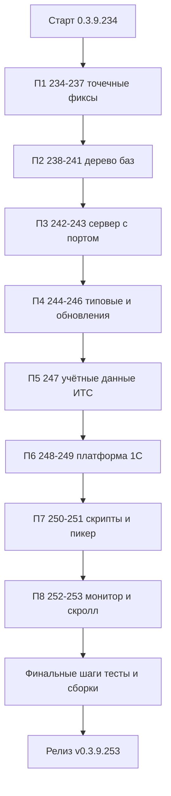

# PLAN — цикл 0.3.9.234–0.3.9.253 — Исправление 20 открытых issues

Репозиторий [`sivatorov/ConfigurationManagement`](https://github.com/sivatorov/ConfigurationManagement),
локальная копия `f:\Yandex.Disk\h\Configuration_Management`, ветка `main`.
Локальный HEAD на момент плана — **0.3.9.233** (версия в
[`Configuration Management.csproj`](../Configuration%20Management/Configuration%20Management.csproj:62),
строки 62–65). Новый цикл стартует сразу после 0.3.9.233; нумерация 0.3.9.234–0.3.9.253
условна и может сместиться на фактический HEAD — перед стартом каждого этапа исполнитель
сверяет версию в csproj (риск п. 7).

Режим: Архитектор (план) → задачи-исполнители в режиме **code** (`new_task` по одному на
этап). **Один issue = одна версия = один коммит.** Все 20 issues в работе; issues **НЕ
закрываются** (комментарий без ключевых слов автозакрытия).

---

## 1. Сводка цикла

| Пакет | Issues | Версии | Тема |
|-------|--------|--------|------|
| П1 | #332, #325, #329, #327 | 0.3.9.234–237 | Точечные исправления: ссылка с локалью, окно правки базы, шрифты, импорт пустых групп |
| П2 | #326, #313, #331, #328 | 0.3.9.238–241 | Дерево баз: мультивыделение, «Для выделенных», клавиатурная навигация, Enter |
| П3 | #305, #335 | 0.3.9.242–243 | Выбор сервера с портом: создание серверной базы, диагностика подключения |
| П4 | #321, #322, #323 | 0.3.9.244–246 | Типовые конфигурации, связывание с конфигурацией, проверка обновлений |
| П5 | #333 | 0.3.9.247 | Учётные данные ИТС (новый справочник) |
| П6 | #334, #330 | 0.3.9.248–249 | Автообновление платформы (сбой), скачивание нужной версии платформы |
| П7 | #308, #304 | 0.3.9.250–251 | Скрипты (уведомления/не закрывать), выбор папки в пикере платформы |
| П8 | #324, #309 | 0.3.9.252–253 | Монитор серверов (RAC, порт по умолчанию), горизонтальный скролл колонок |

> Резерв нумерации: если #330 или #333 потребуют разбиения на две версии, последующие
> номера сдвигаются на единицу (до 0.3.9.254). Исполнитель фиксирует фактический диапазон
> в заголовке CHANGELOG/README.

Зависимости, учтённые при упорядочивании:

- **#305 ↔ #335** — общий механизм «выбор сервера с портом»; сначала чиним создание базы
  (#305), затем переносим паттерн в диагностику (#335).
- **#321 ↔ #333** — поле «Учётная запись» в списке типовых добавляется в #333 после
  появления самого справочника; #321 (правки окна типовых) идёт раньше, чтобы не смешивать.
- **#322/#323/#321** — единая цепочка «типовые конфигурации → сегмент URL → каталог
  релизов»; порядок #321 → #322 → #323 (сначала окно, затем связывание, затем проверка).
- **#328 ↔ #331** — обе правки клавиатуры дерева, выполняются подряд в П2; #331
  (навигация) раньше #328 (Enter), чтобы Enter опирался на исправленную навигацию.
- **#333 → #330** — скачивание версии платформы использует учётные данные ИТС из
  справочника (#333), поэтому #333 раньше #330.
- **#334 → #330** — сначала диагностируем сбой проверки обновлений (#334), затем добавляем
  скачивание нужной версии (#330) на работающем механизме.

---

## 2. Общие требования к КАЖДОМУ этапу

1. Реализация на обеих платформах (Windows/WPF + Linux/Avalonia), где применимо. Чистые
   сервисы/модели — без платформенных зависимостей; платформенная часть — только
   `Views/*.xaml(.cs)` и `Views/*.Avalonia.cs` по образцу существующих окон.
2. Инкремент версии в [`Configuration Management.csproj`](../Configuration%20Management/Configuration%20Management.csproj:62)
   (строки 62–65: Version/AssemblyVersion/FileVersion/InformationalVersion) на 1 патч.
3. Запись в [`CHANGELOG.md`](../CHANGELOG.md:12) (сверху, раздел «Исправлено», с указанием
   номера issue и версии) и обновление бейджа версии в [`README.md`](../README.md:3).
4. Комментарий на issue через `gh api repos/sivatorov/ConfigurationManagement/issues/<N>/comments`
   (шаблон в `publish/comment-<N>-<version>.md`, по образцу `publish/comment-321-0.3.9.160.md`).
   **Issue не закрывать**, ключевые слова автозакрытия («fixes», «closes» и т.п.) не
   использовать.
5. Тесты: `dotnet test` зелёный и `dotnet build -p:BuildLinux=true` без ошибок. Тесты на
   **xUnit** (`[Fact]`/`[Theory]`) — конвенция существующих файлов.
6. Один коммит на версию (без пуша). Образец сообщения:
   `0.3.9.234: #332 — обработка ссылки с сегментом локали`.
7. Все пункты плана перед исполнением сверить с фактическим кодом: адреса строк могут
   сместиться; предыдущие этапы цикла меняют `MainWindow.*`, `MainViewModel.*`,
   `LeveledTreeView.*`, `ru.json`/`en.json`, `csproj`, `README.md`.
8. Локализация: все новые тексты через `LocalizationManager.T`, ключи парами в
   [`ru.json`](../Configuration%20Management/Localization/Languages/ru.json:1)/`en.json`.

---

## 3. Пакет П1 — Точечные исправления (0.3.9.234–237)

### 3.1. 0.3.9.234 — #332 «Обработка ссылки на базу с сегментом локали»

**Суть.** Ссылка `https://accounting.demo.1c.ru/accounting/ru_RU/` должна открываться как
веб-база (сегмент локали отбрасывается), а не как страница локали.

**Файлы.** [`Services/OneCLauncher.Arguments.cs`](../Configuration%20Management/Services/OneCLauncher.Arguments.cs:151)
(`ParseLink`, строки 151–164: ветка http/https возвращает `WebUrl = value` без
нормализации; `LaunchByLink`, строка 73), зеркало
[`OneCLauncher.Linux.Arguments.cs`](../Configuration%20Management/Services/OneCLauncher.Linux.Arguments.cs:1)
при наличии дублирования, точки вызова `OpenInfobaseByLink` в
[`MainViewModel.Launch.cs`](../Configuration%20Management/ViewModels/MainViewModel.Launch.cs:1)
и `MainViewModel.Avalonia.Launch.cs`.

**Решение.** В ветке http/https отбрасывать завершающий сегмент локали в пути URI:
регулярное выражение `/([a-z]{2,3})_[A-Z]{2}/` в конце пути (после последнего `/`,
без query/fragment) → удалить вместе со слешем. Результат:
`https://accounting.demo.1c.ru/accounting/`. Применять только к конечному сегменту, не
трогать сегменты вида `ru_RU` в середине пути.

**Тесты.** Юнит-тесты нормализации URL (позитив: `ru_RU`, `en_US`; негатив: сегмент в
середине пути, отсутствие локали, query `?ru_RU`, trailing-slash без локали). Логику
вынести в чистый статический метод для тестируемости.

**Критерий готовности.** По ссылке с локалю открывается веб-база (обе платформы);
юнит-тесты покрывают 4+ сценариев.

### 3.2. 0.3.9.235 — #325 «Конфигурация ИБ»

**Суть.** В окне правки базы надпись «Конфигурация» поднять выше, чтобы было понятно
назначение полей (чистая UI-правка по скриншоту из issue).

**Файлы.** [`Views/AddEditWindow.xaml`](../Configuration%20Management/Views/AddEditWindow.xaml:1)
и зеркало `AddEditWindow.Avalonia.cs` (окно правки свойств базы); при необходимости —
`Views/ConnectionSettingsWindow.xaml` (если правка конфигурации живёт там).

**Решение.** Переместить/поднять заголовок «Конфигурация» над блоком соответствующих
полей; согласовать вертикальные отступы с соседними секциями.

**Тесты.** Регрессия `dotnet test`; ручная проверка компоновки обеих платформ.

**Критерий готовности.** Надпись «Конфигурация» визуально относится к своим полям;
скриншот до/после в комментарии к issue.

### 3.3. 0.3.9.236 — #329 «Список шрифтов в настройках»

**Суть.** WPF показывает 10 фиксированных шрифтов вместо установленных в системе; при
сохранении молча возвращается `Segoe UI`.

**Файлы.** [`Views/SettingsWindow.Fonts.cs`](../Configuration%20Management/Views/SettingsWindow.Fonts.cs:1),
[`Views/SettingsWindow.Avalonia.Fonts.cs`](../Configuration%20Management/Views/SettingsWindow.Avalonia.Fonts.cs:1),
[`Views/SettingsWindow.xaml`](../Configuration%20Management/Views/SettingsWindow.xaml:1)
(`FontFamilyComboBox`, включить `IsEditable`), `Views/SettingsWindow.Avalonia.Display.cs`
при наличии аналога комбобокса.

**Решение.**
- WPF: заполнять список из `Fonts.SystemFontFamilies` (динамически), а не 10 констант.
- `FontFamilyComboBox`: `IsEditable="True"`; при сохранении брать введённый текст
  (`Text`), а не `SelectedItem` (иначе невыбранный ввод молча сбрасывается на Segoe UI).
- Linux/Avalonia уже динамический — выровнять поведение сохранения по тексту поля.

**Тесты.** Юнит-тест логики «сохранение по введённому тексту» (если логика выносится в
хелпер); регрессия. Ручная проверка обеих платформ.

**Критерий готовности.** В выпадающем списке видны системные шрифты; ввод произвольного
имени шрифта сохраняется (не сбрасывается).

### 3.4. 0.3.9.237 — #327 «Удаление пустых групп»

**Суть.** После удаления пустых групп синхронизация/импорт из 1С (ibases.v8i) возвращает
их обратно; базы не возвращаются.

**Файлы.** [`Services/IbasesV8iImporter.cs`](../Configuration%20Management/Services/IbasesV8iImporter.cs:269)
(`EnsureGroups`, `CreateGroupWithParents`), сервис синхронизации
[`IIbasesSyncService.cs`](../Configuration%20Management/Services/IIbasesSyncService.cs:1)/
реализация и `IbasesSyncOrderResolver.cs`, модель [`Group`](../Configuration%20Management/Models/Group.cs:1)
(при необходимости — флаг «удалена пользователем»), точка удаления групп в
`MainViewModel` (команда удаления групп).

**Решение.** Ввести персистентный список «путей удалённых пользователем пустых групп»
(например, в `AppSettings` или отдельный JSON рядом с настройками): при удалении пустой
группы путь запоминается; при импорте (`EnsureGroups`) пути из этого списка пропускаются,
если группа отсутствует в коллекции (или пустая). Базы при этом продолжают импортироваться
как раньше. Предусмотреть «сброс списка» (например, удаление файла/настройки или кнопка
в настройках) на случай, если пользователь захочет вернуть группы.

**Тесты.** Юнит-тесты импорта: удалённый путь не пересоздаётся; путь с новыми базами
создаётся; непустая группа с тем же путём восстанавливается; обычные группы импортируются.

**Критерий готовности.** После удаления пустой группы и повторного импорта группа не
возвращается; новые группы из файла создаются.

---

## 4. Пакет П2 — Дерево баз: выделение и клавиатура (0.3.9.238–241)

### 4.1. 0.3.9.238 — #326 «Выделение в закреплениях»

**Суть.** Мультивыделение: Ctrl/Shift-клик в другой секции («Закреплённые» vs обычный
список) не должен добавлять строки из другой секции.

**Файлы.** [`Controls/LeveledTreeView.cs`](../Configuration%20Management/Controls/LeveledTreeView.cs:1)
и [`Controls/LeveledTreeView.Avalonia.cs`](../Configuration%20Management/Controls/LeveledTreeView.Avalonia.cs:1)
(логика модификаторов выбора), `Views/MainWindow.Events.cs` /
`Views/MainWindow.Avalonia.Events.cs` (обработчики кликов, если выбор ведётся там).

**Решение.** Определить принадлежность строки к секции (закреплённая vs обычная) и при
Ctrl/Shift-клике в другой секции — очищать выделение текущей секции (или игнорировать
добавление). Выделение в одной секции не распространяется на другую.

**Тесты.** Юнит-тесты чистого хелпера «принадлежность секции + модификатор → новый набор
выделения»; регрессия. Ручная проверка обеих платформ.

**Критерий готовности.** Ctrl/Shift-клик в другой секции не добавляет строки из неё;
выделение внутри секции работает как раньше.

### 4.2. 0.3.9.239 — #313 «Для выделенных»

**Суть.** Если первая строка была просто текущей (без Ctrl), потом Ctrl-кликами добавлены
другие — при правом клике по последней первая (бывшая текущая) теряется из набора.

**Файлы.** [`Controls/LeveledTreeView.Avalonia.cs`](../Configuration%20Management/Controls/LeveledTreeView.Avalonia.cs:1)
и [`Controls/LeveledTreeView.cs`](../Configuration%20Management/Controls/LeveledTreeView.cs:1)
(поддержание набора выделения при модификаторах), `Views/MainWindow.Events.cs` /
`Views/MainWindow.Avalonia.Events.cs` (правый клик: построение набора «для выделенных»).

**Решение.** Явно различать состояния: «текущая строка» (курсор без выделения) и
«строка, добавленная в мультивыделение». Строка становится частью набора только после
Ctrl/Shift-клика по ней; правый клик строит набор на основе фактически выделенных строк,
не включая «бывшую текущую», которая в набор не входила. Согласовать поведение WPF и
Avalonia (баг описан для Avalonia, проверить симметричность).

**Тесты.** Юнит-тест хелпера построения набора при правом клике (сценарий из issue);
регрессия. Ручная проверка: последовательность «клик → Ctrl+клики → правый клик».

**Критерий готовности.** Правый клик по последней Ctrl-строке сохраняет все строки
мультивыделения; бывшая текущая без Ctrl в набор не попадает.

### 4.3. 0.3.9.240 — #331 «Навигация курсором»

**Суть.** Стрелки вверх/вниз/влево/вправо по дереву баз ведут себя некорректно (кейс 1:
вправо без перехода, вверх на папке не двигается, вниз перескакивает на закрепления;
кейс 2: при сворачивании вложенной группы влево сворачивает «Закреплённые», Down уходит
не туда). «Система навигации считает, что уровней всего 2, а вложенностей может быть
сколько угодно». Связано с #328.

**Файлы.** [`Controls/LeveledTreeView.cs`](../Configuration%20Management/Controls/LeveledTreeView.cs:1)
и [`Controls/LeveledTreeView.Avalonia.cs`](../Configuration%20Management/Controls/LeveledTreeView.Avalonia.cs:1)
(обработка стрелок), `Views/MainWindow.Hotkeys.cs` /
`Views/MainWindow.Avalonia.Hotkeys.cs` (глобальные горячие, конфликт со стрелками),
`Controls/LeveledTreeViewItem.*` (раскрытие/сворачивание).

**Решение.** Реализовать навигацию по фактической иерархии (произвольная глубина), а не
по двухуровневой схеме: вправо — раскрыть свёрнутую папку или перейти к первому потомку;
влево — свернуть развёрнутую папку или перейти к родителю; вверх/вниз — предыдущий/следующий
видимый узел в порядке обхода дерева (без перескока между секциями «Закреплённые»/список
вопреки порядку). Разобрать кейс 2: сворачивание вложенной группы не должно затрагивать
корневые секции; фокус после сворачивания — на самой группе.

**Тесты.** Юнит-тесты алгоритма «следующий/предыдущий видимый узел» и «влево/вправо» на
дереве глубины 3–4 (вложенные группы); регрессия. Ручная проверка обоих кейсов.

**Критерий готовности.** Кейсы 1 и 2 из issue воспроизводятся корректно: стрелки следуют
фактической вложенности, секции не «перепрыгиваются», сворачивание вложенной группы не
трогает «Закреплённые».

### 4.4. 0.3.9.241 — #328 «Запуск базы по Enter»

**Суть.** Enter на строке списка баз = двойной клик: база → запуск 1С, группа →
свернуть/развернуть. Не срабатывает при открытом инлайн-редакторе тега, поиске, палитре
или диалоге. Обе платформы.

**Файлы.** [`Views/MainWindow.Events.cs`](../Configuration%20Management/Views/MainWindow.Events.cs:1)
(`OnInfobaseTree_PreviewMouseDoubleClick`), [`Views/MainWindow.Hotkeys.cs`](../Configuration%20Management/Views/MainWindow.Hotkeys.cs:1),
[`Controls/HotkeyBox.cs`](../Configuration%20Management/Controls/HotkeyBox.cs:1) +
Avalonia-зеркала, `Views/MainWindow.Avalonia.Events.cs` /
`Views/MainWindow.Avalonia.Hotkeys.cs`.

**Решение.** Добавить обработку Enter в навигации дерева: для базы — выполнить команду
запуска (как при двойном клике), для группы — toggle раскрытия. Условие «не срабатывать»:
фокус в текстовом поле (инлайн-редактор тега, поиск, палитра команд) или открыт модальный
диалог. Проверить, что Enter не конфликтует с уже назначенными горячими (HotkeyBox).

**Тесты.** Юнит-тест условий «можно/нельзя обрабатывать Enter» (состояние фокуса/диалога);
регрессия. Ручная проверка обеих платформ (база/группа, редактор/поиск).

**Критерий готовности.** Enter на базе запускает 1С, на группе — сворачивает/разворачивает;
в инлайн-редакторе/поиске/палитре/диалоге Enter работает как обычно.

---

## 5. Пакет П3 — Выбор сервера с портом (0.3.9.242–243)

### 5.1. 0.3.9.242 — #305 «Создание серверной базы»

**Суть.** 1) Выбор сервера 1С из списка ничего не даёт — поле остаётся пустым; 2) база не
создаётся даже с ручным указанием сервера с портом — подозрение на неподстановку порта 1С;
3) вопрос про отсутствие предупреждения/ошибки.

**Файлы.** [`Views/CreateInfobaseWindow.xaml`](../Configuration%20Management/Views/CreateInfobaseWindow.xaml:1)
+ `.xaml.cs`, [`Views/CreateInfobaseWindow.Avalonia.cs`](../Configuration%20Management/Views/CreateInfobaseWindow.Avalonia.cs:1)
(выпадающий список серверов — откуда берётся список, обработчик SelectedItemChanged),
[`ViewModels/MainViewModel.Commands.cs`](../Configuration%20Management/ViewModels/MainViewModel.Commands.cs:1)
(команда создания базы), [`Services/CreateInfobaseService.cs`](../Configuration%20Management/Services/CreateInfobaseService.cs:223)
(`ParseServerPort` — уже существует, проверить вызывается ли; `Format1CServer`, строка 208),
`Services/ICreateInfobaseService.cs`.

**Решение.**
- Найти причину пустого поля при выборе из списка (вероятно, обработчик не подставляет
  значение или список строится из несовместимого источника — сравнить с окном правки базы
  `ConnectionSettingsWindow`). Выбор сервера должен заполнять поле «server:port».
- Проверить сквозную передачу `ParseServerPort` в аргументы создания базы (createinfobase
  → сервер/порт в строку подключения); убедиться, что порт 1С (1540/1541) подставляется.
- Добавить понятное предупреждение/ошибку при недоступном сервере или неуспешном создании.

**Тесты.** Юнит-тесты `ParseServerPort`/`Format1CServer` (если нет — добавить), тест
маппинга «ввод в поле → строка подключения серверной базы»; регрессия. Ручная проверка
создания базы на реальном сервере (Windows) и через rac-путь (Linux).

**Критерий готовности.** Выбор из списка заполняет поле; ручной ввод `server:port` создаёт
базу; при неудаче — понятное сообщение.

### 5.2. 0.3.9.243 — #335 «Диагностика подключения»

**Суть.** Окно «Диагностика подключения» (`NetworkDiagnosticsWindow`, 0.3.9.231–232):
1) нужен выбор сервера с портом как при правке базы; при старте на выбранной базе порт
«помнится», но в поле не подставляется; 2) поле/список портов с запоминанием в разрезе
выбранного сервера (на каждый сервис свой порт); 3) вертикальное центрирование новых
полей; 4) сервер хранилища 1С добавить в список поддерживаемых сервисов.

**Файлы.** [`Views/NetworkDiagnosticsWindow.xaml`](../Configuration%20Management/Views/NetworkDiagnosticsWindow.xaml:1)
+ `.xaml.cs` (тонкое окно, прогон на Loaded), [`Views/NetworkDiagnosticsWindow.Avalonia.cs`](../Configuration%20Management/Views/NetworkDiagnosticsWindow.Avalonia.cs:1),
[`ViewModels/NetworkDiagnosticsViewModel.cs`](../Configuration%20Management/ViewModels/NetworkDiagnosticsViewModel.cs:1)
(сейчас принимает цель `Host`+`Ports`, см. `NetworkDiagnosticsTarget.FromInfobase`),
[`Services/NetworkDiagnosticsTarget.cs`](../Configuration%20Management/Services/NetworkDiagnosticsTarget.cs:1),
`Services/NetworkDiagnosticsService.cs` (константы портов [`OneCPorts`](../Configuration%20Management/Models/NetworkDiagnosticsResult.cs:1),
порт хранилища).

**Решение.**
- Добавить в окно выбор сервера с портом по образцу окна правки базы (`ConnectionSettingsWindow`):
  список серверов, поле «host:port»; при старте с выбранной базы подставлять
  `Server`+`Port` из `NetworkDiagnosticsTarget` (порт сейчас не доходит — проверить цепочку
  `FromInfobase` → VM → поле).
- Запоминание портов в разрезе сервера: словарь «сервер → порт для сервиса» в
  `AppSettings` (или отдельном хранилище); при смене сервера подставлять сохранённый порт;
  каждый сервис (кластер, монитор/rac, хранилище) — свой порт по умолчанию.
- Вертикальное центрирование новых полей выбора (выравнивание с существующими).
- Сервер хранилища 1С — добавить в список поддерживаемых сервисов (имя сервиса, порт по
  умолчанию из `OneCPorts`, кнопка/команда проверки).

**Тесты.** Юнит-тесты VM: старт с целью заполняет поле портом; смена сервера подставляет
сохранённый порт; команда проверки хранилища вызывает правильный порт. Регрессия
`NetworkDiagnosticsViewModelTests`/`NetworkDiagnosticsIntegrationTests`.

**Критерий готовности.** Поле порта заполняется при открытии из базы/монитора; порты
запоминаются по серверу; хранилище 1С доступно в списке сервисов.

---

## 6. Пакет П4 — Типовые конфигурации и проверка обновлений (0.3.9.244–246)

### 6.1. 0.3.9.244 — #321 «Окно Типовые конфигурации»

**Суть.** После 0.3.9.160: 1) «Восстановить типовые» вместо запрета правки предопределённых;
2) добавление не показывает изменения (строки добавляются, но вид не обновляется);
3) добавляется не все 4 поля, а только первое; 4) кнопка удаления не удаляет (DEL тоже),
только снимает выделение; 5) подписи к 4 полям не появились; 6) у ЗУП только 3.1, нельзя
добавить 3.0 (второй ЗУП «плющит»); 7) в одном поле что-то не то (скриншот).

**Файлы.** [`Views/ConfigTypesEditWindow.xaml`](../Configuration%20Management/Views/ConfigTypesEditWindow.xaml:1)
+ `.xaml.cs`, `Views/ConfigTypesEditWindow.Avalonia.cs`, [`Views/ConfigTypeEditWindow.xaml`](../Configuration%20Management/Views/ConfigTypeEditWindow.xaml:1)
+ `.xaml.cs` + Avalonia (редактор 4 полей: код, наименование, сегмент URL, ник,
редакции), [`Services/CustomConfigTypesStore.cs`](../Configuration%20Management/Services/CustomConfigTypesStore.cs:89)
(`LoadAll` = встроенные + пользовательские), [`Services/BuiltInConfigTypes.cs`](../Configuration%20Management/Services/BuiltInConfigTypes.cs:1),
[`ViewModels/ConfigTypeItemViewModel.cs`](../Configuration%20Management/ViewModels/ConfigTypeItemViewModel.cs:1),
`Models/OneCConfigType.cs`.

**Решение.**
- «Восстановить типовые»: кнопка/действие, возвращающее предопределённый набор в исходное
  состояние (перезапись пользовательских правок встроенных или удаление дублей-ЗУП) — точная
  семантика по комментарию пользователя в issue.
- Починить refresh списка после добавления (ObservableCollection/обновление ItemsSource).
- Редактор: убедиться, что сохраняются все 4 поля (код, наименование, сегмент URL, ник) +
  редакции; подписи полей присутствуют.
- Удаление: кнопка и DEL реально удаляют выбранную пользовательскую строку (сейчас только
  снимают выделение); предопределённые не удаляются.
- Дубликаты ЗУП: разрешить несколько записей одной конфигурации (3.0 и 3.1) — проверить
  уникальность по составному ключу «наименование+редакция», а не по наименованию.

**Тесты.** Юнит-тесты хранилища: добавить/удалить/восстановить; сохранение всех полей;
две записи ЗУП (3.0/3.1) сосуществуют; регрессия. Ручная проверка окна.

**Критерий готовности.** Все 7 пунктов из issue закрыты: добавление отображается и
сохраняет 4 поля, удаление работает, подписи видны, ЗУП 3.0 добавляется, «Восстановить
типовые» работает.

### 6.2. 0.3.9.245 — #322 «Связать с конфигурацией»

**Суть.** После 0.3.9.159: 1) окно сделать выше или кнопки в одну строку, нижнюю надпись —
рядом с кнопкой определения релиза; 2) ЗУП определяется как БУХГАЛТЕРИЯ — автоопределение
ошибочное (сегмент URL в типовых = наименования?).

**Файлы.** [`Views/ConfigUpdateLinkWindow.xaml`](../Configuration%20Management/Views/ConfigUpdateLinkWindow.xaml:1)
+ `.xaml.cs` + Avalonia (компоновка), окно/механизм автоопределения
[`Views/DetectConfigurationsWindow.*`](../Configuration%20Management/Views/DetectConfigurationsWindow.xaml:1),
[`ViewModels/DetectConfigRowViewModel.cs`](../Configuration%20Management/ViewModels/DetectConfigRowViewModel.cs:1),
[`Services/ConfigUpdateService.cs`](../Configuration%20Management/Services/ConfigUpdateService.cs:1)
(определение конфигурации по URL/признакам), `BuiltInConfigTypes.cs` (сегменты URL).

**Решение.**
- UI: высота окна больше или кнопки в одну строку; поясняющую надпись перенести к кнопке
  определения релиза.
- Автоопределение: разобраться, почему ЗУП определяется как БУХГАЛТЕРИЯ; исправить
  алгоритм сопоставления (приоритет по сегменту URL типовой, затем по другим признакам;
  исключить подмену ЗУП→БУХ). Добавить тест на сопоставление ЗУП.

**Тесты.** Юнит-тест автоопределения: ЗУП → ЗУП (не БУХ), другие типовые не путаются;
регрессия. Ручная проверка окна.

**Критерий готовности.** ЗУП определяется корректно; компоновка окна исправлена.

### 6.3. 0.3.9.246 — #323 «Окно Проверка обновлений»

**Суть.** После 0.3.9.158: 1) «если связывать надо вручную — зачем определять свойства
конфигурации? брать информацию с вкладки Платформа»; 2) после связывания конфигурации
проверка обновлений всё равно не работает (скриншот окна F9). Разобраться, почему каталог
релизов не определяется/проверка падает даже после связи.

**Файлы.** [`Services/ConfigUpdateService.cs`](../Configuration%20Management/Services/ConfigUpdateService.cs:1)
и [`IConfigUpdateService.cs`](../Configuration%20Management/Services/IConfigUpdateService.cs:1)
(формирование URL каталога релизов по конфигурации), [`ViewModels/MainViewModel.Updates.cs`](../Configuration%20Management/ViewModels/MainViewModel.Updates.cs:1)
+ `MainViewModel.Avalonia.Updates.cs` (F9, окно проверки), [`ViewModels/UpdateCheckRowViewModel.cs`](../Configuration%20Management/ViewModels/UpdateCheckRowViewModel.cs:1),
`Services/OneCUpdatesService.cs`/`IOneCUpdatesService.cs` (парсер каталога), окно проверки
`Views/PlatformUpdateWindow.*` или `UpdateAvailableWindow` (уточнить по коду).

**Решение.**
- Воспроизвести сбой проверки F9; залогировать ошибку; найти, где падает цепочка
  «конфигурация → URL каталога релизов → парсинг».
- Проверить, что после «Связать с конфигурацией» URL строится корректно (сегмент URL из
  типовой + редакция), и что связь реально сохраняется в том виде, в котором её читает
  проверка.
- Пункт 1 (ручное связывание vs определение свойств конфигурации): упростить UX — при
  определённых свойствах конфигурации каталог релизов брать из них, ручное связывание —
  только как явный override. Точное решение согласовать с пользователем.

**Тесты.** Юнит-тесты построения URL каталога релизов по связанной конфигурации (в т.ч.
после связывания); тест парсера ответа. Регрессия.

**Критерий готовности.** F9 после связывания конфигурации успешно показывает каталог
релизов (обе платформы); причина прошлого сбоя описана в комментарии.

---

## 7. Пакет П5 — Учётные данные ИТС (0.3.9.247)

### 7.1. 0.3.9.247 — #333 «Учетки доступа к ИТС»

**Суть.** Новый справочник «Учетные данные ИТС» (отдельный файл, раздел Утилиты→информация):
наименование, логин, пароль; скининг, модальность, фокус на первом поле. Перенос текущих
данных в «Основная» при первом запуске. Вместо двух полей в настройках — ссылка на элемент
справочника. Комментарий: флажок «Основная» в списке; смена флажка только через кнопку
«Задать основным»; если в файле 2+ основных — основной первый найденный; если 0 — первая
запись; при удалении основной — первой становится первая запись. В списке типовых (#321) —
поле «Учетная запись» для каждой записи.

**Файлы (новые).** `Models/ItsAccount.cs` (наименование, логин, пароль, IsPrimary),
`Services/ItsAccountsStore.cs` + `IItsAccountsStore.cs` (JSON рядом с настройками,
например `its_accounts.json`; перенос старых полей из `AppSettings` при первом запуске,
идемпотентно), `ViewModels/ItsAccountsViewModel.cs`, `Views/ItsAccountsWindow.xaml` +
`.xaml.cs` + `Views/ItsAccountsWindow.Avalonia.cs` (список + кнопки «Добавить», «Изменить»,
«Удалить», «Задать основным»; модальный редактор с фокусом на первом поле).

**Файлы (изменяемые).** [`Views/SettingsWindow.Accounts.cs`](../Configuration%20Management/Views/SettingsWindow.Accounts.cs:1)
и Avalonia-аналог (вместо двух полей — ComboBox-ссылка на справочник + кнопка открытия),
`MainViewModel`/`AppSettings` (удаление старых полей с миграцией), `Views/ConfigTypesEditWindow.*`
(поле «Учетная запись» в списке типовых — столбец/редактор), `Models/OneCConfigType.cs`
(ссылка на учётную запись).

**Решение.**
- Справочник с правилами «Основной»: при загрузке — 2+ основных → первый найденный;
  0 → первая запись; удаление основной → первая запись становится основной.
- Смена основной только через кнопку «Задать основным» (флажок read-only).
- Миграция старых полей настроек (логин/пароль ИТС) в запись «Основная».
- Настройки: ссылка на элемент справочника вместо полей.
- Типовые (#321): поле «Учетная запись» для каждой записи (пока пустое/опционально —
  заполняется из справочника).

**Тесты.** Юнит-тесты хранилища: миграция, правила выбора основной (2+, 0, удаление),
CRUD, пароль маскируется при сохранении/логировании. Регрессия.

**Критерий готовности.** Справочник открывается из Утилиты→информация и из настроек;
правила «Основной» выполняются; старые поля перенесены; в типовых есть поле «Учетная
запись».

---

## 8. Пакет П6 — Обновление платформы 1С (0.3.9.248–249)

### 8.1. 0.3.9.248 — #334 «Автообновление платформы»

**Суть.** В релизе 0.3.9.233 попытка проверить обновления (F9 / автообновление платформы) —
мелькает надпись внизу и появляется ошибка (скриншот). Надо воспроизвести и найти причину.

**Файлы.** [`Services/PlatformUpdateService.cs`](../Configuration%20Management/Services/PlatformUpdateService.cs:1)
и [`IPlatformUpdateService.cs`](../Configuration%20Management/Services/IPlatformUpdateService.cs:1)
(проверка обновлений), [`Services/OneCUpdatesService.cs`](../Configuration%20Management/Services/OneCUpdatesService.cs:1)
и `IOneCUpdatesService.cs` (запрос каталога), [`ViewModels/PlatformUpdateViewModel.cs`](../Configuration%20Management/ViewModels/PlatformUpdateViewModel.cs:28)
(паттерн инжектируемых делегатов), [`ViewModels/MainViewModel.PlatformUpdate.cs`](../Configuration%20Management/ViewModels/MainViewModel.PlatformUpdate.cs:1)
и `MainViewModel.Avalonia.PlatformUpdate.cs` (F9/автозапуск), [`Services/UpdateService.cs`](../Configuration%20Management/Services/UpdateService.cs:1)
(проверка обновлений приложения — не путать с платформой), окно `Views/PlatformUpdateWindow.*`.

**Решение.**
- Воспроизвести сбой (Windows): запуск проверки F9, снять журнал/исключение.
- Определить причину: вероятные кандидаты — невалидный токен/логин ИТС, изменившаяся
  структура страницы каталога, исключение в цепочке `OneCUpdatesService` без перехвата,
  регрессия 0.3.9.208–216 (цикл автообновления платформы). Локализовать точку падения,
  добавить перехват с понятным сообщением об ошибке вместо «мелькания».
- Убедиться, что надпись-статус не «мелькает» (состояние гонки UI-потока — проверить
  `dispatchToUi`).

**Тесты.** Юнит-тесты на перехват ошибок провайдера (fake-делегат бросает исключение →
статус «ошибка», без падения); регрессия. Ручная проверка F9 на Windows и Linux.

**Критерий готовности.** Проверка обновлений платформы не падает с исключением; при
недоступности каталога показывается понятная ошибка; «мелькание» устранено.

### 8.2. 0.3.9.249 — #330 «Скачивание и установка нужной версии платформы 1С»

**Суть.** Большая фича: скачать дистрибутив нужной версии (по логину/паролю ИТС,
`OneCUpdatesService` уже есть), установку выполняет пользователь сам — НЕ тихая установка;
под Linux — скачали, распаковали, запустили установщик или показали папку. Плюс окно
выбора версии/разрядности по образцу «Актуальных релизов». Комментарий 7OH: «скачать /
распаковать / запустить установщик или открыть папку» и под винду так же.

**Файлы.** [`Services/OneCUpdatesService.cs`](../Configuration%20Management/Services/OneCUpdatesService.cs:1)
и `IOneCUpdatesService.cs` (скачивание по версии/разрядности), [`Services/ParallelDownloader.cs`](../Configuration%20Management/Services/ParallelDownloader.cs:1)
(загрузка), [`Services/PlatformInstaller.Windows.cs`](../Configuration%20Management/Services/PlatformInstaller.Windows.cs:1)
и [`Services/PlatformInstaller.Linux.cs`](../Configuration%20Management/Services/PlatformInstaller.Linux.cs:1)
(сейчас тихая установка — добавить режим «скачать и показать/запустить установщик»),
[`ViewModels/ActualReleasesViewModel.cs`](../Configuration%20Management/ViewModels/ActualReleasesViewModel.cs:1)
и окно [`Views/ActualReleasesWindow.*`](../Configuration%20Management/Views/ActualReleasesWindow.xaml:1)
(образец окна выбора версии/разрядности), `ViewModels/PlatformUpdateViewModel.cs`,
`Views/PlatformUpdateWindow.*`, `Services/ItsAccountsStore.cs` (#333 — учётные данные для
скачивания).

**Решение.**
- Окно выбора версии/разрядности по образцу «Актуальных релизов»: список версий с портала
  (уже есть в `ActualReleasesViewModel`), выбор разрядности (32/64), кнопка «Скачать».
- Авторизация через учётные данные ИТС из справочника #333 (выбор/основная).
- Скачивание дистрибутива (zip/exe — Windows; zip/tar/deb/rpm — Linux) в каталог загрузок
  с прогрессом; НЕ устанавливать автоматически.
- Windows: показать папку с дистрибутивом (и кнопку «Запустить установщик»).
- Linux: распаковать, показать папку и/или предложить запустить установщик
  (deb/rpm/скрипт) — тихую установку не выполнять.
- Возможное разбиение на 2 версии (0.3.9.249 — окно+скачивание, 0.3.9.250 — запуск
  установщика/показ папки) — решение в процессе реализации; нумерация сдвигается.

**Тесты.** Юнит-тесты построения URL скачивания по версии/разрядности, маппинга
«версия+разрядность → файл», выбора учётной записи; регрессия. Ручная проверка скачивания
на Windows и Linux.

**Критерий готовности.** Можно выбрать версию/разрядность, скачать дистрибутив под
учёткой ИТС; установка не выполняется автоматически; показан путь/папка и возможность
запустить установщик (обе платформы).

---

## 9. Пакет П7 — Скрипты и выбор платформы (0.3.9.250–251)

### 9.1. 0.3.9.250 — #308 «Пожелание - Скрипты»

**Суть.** После 0.3.9.109/119/141/143/146/147/148: 1) галочка «Уведомлять о запуске»
(сейчас окно «скрипт запущен» лишнее) + убрать системные уведомления по умолчанию;
2) окно редактора чуть выше — не всё влезает без скролла; не должно уходить за рамки
экрана (`WindowSizeMath` уже есть); 3) галочка «Не закрывать» возле «База для подстановок»
— добавлять команду, предотвращающую закрытие окна при ошибках/завершении (cmd — `pause`,
PowerShell — `Read-Host`, sh — `read`).

**Файлы.** [`ViewModels/ScriptScenarioEditViewModel.cs`](../Configuration%20Management/ViewModels/ScriptScenarioEditViewModel.cs:1),
[`Views/ScriptScenarioEditWindow.xaml`](../Configuration%20Management/Views/ScriptScenarioEditWindow.xaml:1)
+ `.xaml.cs` + Avalonia (галочки, высота, `WindowSizeMath`), [`Services/ScriptScenarioStore.cs`](../Configuration%20Management/Services/ScriptScenarioStore.cs:1)
(модель сценария — новые флаги), [`Services/ScriptParameterResolver.cs`](../Configuration%20Management/Services/ScriptParameterResolver.cs:1)
(подстановки), исполнение скриптов в `MainViewModel.Scripts.cs` /
`MainViewModel.Avalonia.Scripts.cs` (показ окна «скрипт запущен», системные уведомления,
добавление команды удержания), [`Services/WindowSizeMath.cs`](../Configuration%20Management/Services/WindowSizeMath.cs:1).

**Решение.**
- Флаг «Уведомлять о запуске» (per-сценарий или глобальная настройка — уточнить по
  структуре): при выключенном — не показывать окно «скрипт запущен»; системные уведомления
  о запуске по умолчанию отключить (или вынести за тот же флаг).
- Высота окна редактора: увеличить дефолт; применить `WindowSizeMath` для ограничения
  рамками экрана.
- Флаг «Не закрывать»: при выполнении команды добавлять хвост `pause`/`Read-Host`/`read`
  (в зависимости от shell) — окно не закрывается после ошибки/завершения.

**Тесты.** Юнит-тест построения команды с хвостом удержания (cmd/PowerShell/sh); тест
флага уведомления (VM решает, показывать ли окно); регрессия.

**Критерий готовности.** Окно «скрипт запущен» управляется галочкой; редактор полностью
влезает в экран; «Не закрывать» добавляет pause/Read-Host/read.

### 9.2. 0.3.9.251 — #304 «Выбор папки в выборе платформы 2»

**Суть.** После 0.3.9.101/110/138/153: «Всё ещё уходит на самый верх при изменении
разрядности». Нужен окончательный фикс.

**Файлы.** [`Views/PlatformVersionPickerWindow.xaml.cs`](../Configuration%20Management/Views/PlatformVersionPickerWindow.xaml.cs:61)
(защита `SelectedItemChanged` от сброса при перестроении; `OnPlatformsTree_SelectedItemChanged`,
строка 139), [`Views/PlatformVersionPickerWindow.Avalonia.cs`](../Configuration%20Management/Views/PlatformVersionPickerWindow.Avalonia.cs:1),
[`Services/PlatformVersionService.cs`](../Configuration%20Management/Services/PlatformVersionService.cs:1)
и [`Services/PlatformVersionService.Linux.cs`](../Configuration%20Management/Services/PlatformVersionService.Linux.cs:1)
(дерево версий/разрядностей).

**Решение.**
- Воспроизвести: выбор версии → смена разрядности → выделение уходит на самый верх дерева.
- Причина (кандидаты): при перестроении дерева теряется `SelectedItem` (сброс на null
  гасится, но восстановление идёт не на ту ветку), или ключ узла не учитывает разрядность.
- Окончательный фикс: сохранять идентификатор выбранного узла (версия+разрядность), после
  перестроения восстанавливать выделение и скролл к нему (ScrollIntoView), во время
  перестроения не триггерить команды.

**Тесты.** Юнит-тест логики «сохранить/восстановить выбранный узел по ключу
версия+разрядность» (если выносится в хелпер); регрессия. Ручная проверка: смена
разрядности не сбрасывает выделение.

**Критерий готовности.** При изменении разрядности выделение остаётся на той же версии и
не уходит наверх (обе платформы).

---

## 10. Пакет П8 — Монитор серверов и колонки (0.3.9.252–253)

### 10.1. 0.3.9.252 — #324 «Серверы 1С»

**Суть.** Ошибка RAC: host:port одним токеном исправлено в 0.3.9.157, но в 0.3.9.233
«ситуация на месте» — не видит данные кластера, хотя в терминале видно. Плюс вопрос «почему
порт по умолчанию 1540?» (в утилите корректно подставлен 1541?) — проверить порт по
умолчанию в окне монитора серверов.

**Файлы.** [`Services/RacClient.cs`](../Configuration%20Management/Services/RacClient.cs:1)
и [`Services/IRacClient.cs`](../Configuration%20Management/Services/IRacClient.cs:58)
(`DefaultPort` = 1540 — порт ragent/rac; проверить, что в окне монитора не подменяется на
1541), [`ViewModels/ServerMonitorViewModel.cs`](../Configuration%20Management/ViewModels/ServerMonitorViewModel.cs:66)
(ServerAddress/ServerPort), [`Views/ServerMonitorWindow.xaml`](../Configuration%20Management/Views/ServerMonitorWindow.xaml:1)
+ `.xaml.cs` + Avalonia (поле порта, значение по умолчанию), парсер вывода
[`Services/RacOutputParser.cs`](../Configuration%20Management/Services/RacOutputParser.cs:1).

**Решение.**
- Воспроизвести проблему «не видит данные кластера» в 0.3.9.233: сравнить команду rac в
  приложении (в т.ч. host:port одним токеном) и в терминале; проверить парсер вывода против
  фактического формата `rac` (возможно, изменилась локаль/формат вывода или параметр
  `--cluster=` не подставляется).
- Проверить порт по умолчанию: для rac корректный порт агента — 1540 (DefaultPort);
  убедиться, что окно монитора предзаполняет 1540, а не 1541, и что для конкретного
  кластера пользователь может указать 1541 — объяснить разницу в подписи/подсказке
  (агент 1540 vs кластер 1541). Ответить на вопрос issue в комментарии.
- При необходимости — унифицировать `host:port` (один токен) во всех местах вызова rac.

**Тесты.** Юнит-тесты построения команд rac с host:port; парсер вывода по образцу
фактического вывода (в т.ч. кластер list/info); регрессия. Ручная проверка на Windows.

**Критерий готовности.** Монитор серверов видит данные кластера (как в терминале); порт
по умолчанию 1540 объяснён в комментарии и корректно подставлен.

### 10.2. 0.3.9.253 — #309 «Пропал горизонтальный скрол»

**Суть.** После 0.3.9.156 осталось: «могу взять 4 колонки сразу — подвинуть за край
видимости, и скрол не меняется» (перетаскивание колонок мышью не расширяет полосу).
Windows: `MainWindow.Columns.cs`/`Scroll.cs`, Avalonia зеркально. Нужно учесть ручное
перетаскивание колонок.

**Файлы.** [`Views/MainWindow.Columns.cs`](../Configuration%20Management/Views/MainWindow.Columns.cs:1),
[`Views/MainWindow.Scroll.cs`](../Configuration%20Management/Views/MainWindow.Scroll.cs:1),
[`Views/MainWindow.Avalonia.Columns.cs`](../Configuration%20Management/Views/MainWindow.Avalonia.Columns.cs:1),
[`Views/MainWindow.Avalonia.Scroll.cs`](../Configuration%20Management/Views/MainWindow.Avalonia.Scroll.cs:1),
[`Views/ListMinWidthCalculator.cs`](../Configuration%20Management/Views/ListMinWidthCalculator.cs:1)
(расчёт минимальной ширины), разметка колонок в `MainWindow.xaml`/`MainWindow.Avalonia.cs`.

**Решение.**
- Воспроизвести: перетащить колонки шире видимой области → горизонтальный скроллбар не
  появляется/не расширяется.
- Причина (кандидаты): ширина полосы считается по исходной ширине колонок без учёта
  ручного перетаскивания (`ActualWidth` не отслеживается) или ScrollViewer
  `HorizontalScrollBarVisibility` не учитывает изменение ширины колонок.
- Фикс: подписка на изменение ширины колонок (ColumnHeader DragDelta / ActualWidth),
  пересчёт `ListMinWidthCalculator` и обновление полосы; то же в Avalonia.

**Тесты.** Юнит-тест расчёта ширины с учётом изменённых ширин колонок (хелпер);
регрессия. Ручная проверка перетаскивания колонок на обеих платформах.

**Критерий готовности.** Перетаскивание колонок расширяет горизонтальную полосу
прокрутки; 4 колонки за краем видимости доступны по скроллу.

---

## 11. Финальные шаги цикла

1. **Полный прогон тестов**: `dotnet test` — весь набор
   `ConfigurationManagement.Tests` зелёный.
2. **Кросс-сборка Linux**: `dotnet build -p:BuildLinux=true` без ошибок и предупреждений.
3. **Сборки для релиза** (по образцу прошлых циклов):
   - Windows: публикация single-file self-contained — `dotnet publish -c Release`
     (скрипт [`Configuration Management/build-windows-single-file.ps1`](../Configuration%20Management/build-windows-single-file.ps1:1));
   - Linux: [`Configuration Management/build-linux-single-file.ps1`](../Configuration%20Management/build-linux-single-file.ps1:1)
     или `build-linux-single-file.sh`, упаковка AppImage/deb скриптами
     [`package/linux`](../package/linux/appimage.sh:1);
   - артефакты складывать в `publish/out-0.3.9.253/` (по конвенции прошлых циклов).
4. **Контроль документации**: CHANGELOG.md содержит все 20 записей цикла; README.md — актуальный
   бейдж версии и упоминания новых функций; ARCHITECTURE.md — если менялась архитектура
   (справочник ИТС, скачивание платформы).
5. **Коммиты**: каждый этап уже закоммичен отдельно (`0.3.9.<N>: #<issue> — <тема>`);
   перед релизом убедиться, что рабочее дерево чистое, кроме plan-файла (untracked).
6. **Комментарии на issues**: по шаблонам `publish/comment-<N>-<version>.md` опубликовать
   (если не публиковались сразу после каждого этапа) через
   `gh api repos/sivatorov/ConfigurationManagement/issues/<N>/comments --field body=@file`.
   Issues НЕ закрывать.
7. **Релиз на GitHub** (отдельная задача, в план входят подготовительные шаги):
   - тело релиза — [`publish/release_body_0.3.9.253.md`](../publish/release_body_0.3.9.253.md:1)
     (сводка по пакетам, список issues);
   - команда `gh release create v0.3.9.253` с приложенными артефактами Windows и Linux;
   - **важно**: `GH_TOKEN` в env НЕвалиден — использовать keyring (по умолчанию для gh CLI),
     переменную не экспортировать.
8. **Итоговый контроль**: `git log` — 20 коммитов цикла поверх 0.3.9.233; чек-лист
   «все 20 issues прокомментированы, ни один не закрыт».

---

## 12. Таблица декомпозиции задач (сводно)

| № | Версия | Issue | Ключевые файлы | Тесты | Главные риски |
|---|--------|-------|----------------|-------|---------------|
| 1 | 0.3.9.234 | #332 | `Services/OneCLauncher.Arguments.cs`, `OneCLauncher.Linux.Arguments.cs`, `MainViewModel.Launch.cs` | Юнит URL-нормализации | Регекс заденет сегмент в середине пути → только конечный сегмент; поведение стандартного стартера как эталон |
| 2 | 0.3.9.235 | #325 | `Views/AddEditWindow.xaml`, `AddEditWindow.Avalonia.cs` | Регрессия | Окно используется двумя платформами — не разъехаться по отступам |
| 3 | 0.3.9.236 | #329 | `Views/SettingsWindow.Fonts.cs`, `SettingsWindow.Avalonia.Fonts.cs`, `SettingsWindow.xaml` | Юнит сохранения по тексту | WPF `SystemFontFamilies` долго грузится → ленивая загрузка; невалидный введённый шрифт → валидация |
| 4 | 0.3.9.237 | #327 | `Services/IbasesV8iImporter.cs`, `IIbasesSyncService.cs`, модель `Group` | Юнит импорта с tombstone | Список удалённых растёт → нужен способ сброса; не удалить случайно нужную группу |
| 5 | 0.3.9.238 | #326 | `Controls/LeveledTreeView.cs`, `LeveledTreeView.Avalonia.cs`, `MainWindow.Events.cs` | Юнит хелпера секций | Разделение «закреплённые/список» зависит от разметки — единый маркер секции |
| 6 | 0.3.9.239 | #313 | `Controls/LeveledTreeView.*`, `MainWindow.Events.cs` | Юнит набора при правом клике | Различие «текущая» vs «выделенная» — общая семантика обеих платформ |
| 7 | 0.3.9.240 | #331 | `Controls/LeveledTreeView.*`, `MainWindow.Hotkeys.cs`, `LeveledTreeViewItem.*` | Юнит навигации (глубина 3–4) | Конфликт с горячими клавишами; секции закреплений — правила перехода между ними |
| 8 | 0.3.9.241 | #328 | `MainWindow.Events.cs`, `MainWindow.Hotkeys.cs`, `Controls/HotkeyBox.cs` + Avalonia | Юнит условий Enter | Не срабатывать в текстовых полях/диалогах; конфликт с пользовательскими горячими |
| 9 | 0.3.9.242 | #305 | `Views/CreateInfobaseWindow.*`, `MainViewModel.Commands.cs`, `CreateInfobaseService.cs` | Юнит ParseServerPort и маппинга | Список серверов из разных источников (настройки/монитор) — унифицировать формат `host:port` |
| 10 | 0.3.9.243 | #335 | `Views/NetworkDiagnosticsWindow.*`, `NetworkDiagnosticsViewModel.cs`, `NetworkDiagnosticsTarget.cs` | Юнит VM портов | Запоминание портов на сервис — совместимость со старыми настройками; порт хранилища |
| 11 | 0.3.9.244 | #321 | `Views/ConfigTypesEditWindow.*`, `ConfigTypeEditWindow.*`, `CustomConfigTypesStore.cs`, `BuiltInConfigTypes.cs` | Юнит хранилища CRUD/восстановление | Дубли ЗУП — уникальность по составному ключу; refresh списка после мутаций |
| 12 | 0.3.9.245 | #322 | `Views/ConfigUpdateLinkWindow.*`, `DetectConfigurationsWindow.*`, `ConfigUpdateService.cs` | Юнит автоопределения | Порядок признаков ЗУП vs БУХ — приоритет сегмента URL |
| 13 | 0.3.9.246 | #323 | `ConfigUpdateService.cs`, `MainViewModel.Updates.cs`, `OneCUpdatesService.cs` | Юнит URL каталога/парсера | Связь не доходит до проверки — проследить всю цепочку; смена формата страницы 1С |
| 14 | 0.3.9.247 | #333 | Новые `ItsAccountsStore`, `ItsAccountsWindow.*`; `SettingsWindow.Accounts.cs`, `ConfigTypesEditWindow.*` | Юнит хранилища/правил «Основной» | Миграция старых полей; маскирование пароля; правила «Основной» на граничных случаях |
| 15 | 0.3.9.248 | #334 | `PlatformUpdateService.cs`, `OneCUpdatesService.cs`, `PlatformUpdateViewModel.cs`, `MainViewModel.PlatformUpdate.cs` | Юнит перехвата ошибок | Причина может быть на стороне 1С (структура страницы) — дать понятную ошибку, не ронять |
| 16 | 0.3.9.249 | #330 | `OneCUpdatesService.cs`, `PlatformInstaller.Windows/Linux.cs`, `ActualReleasesViewModel.cs`, `ActualReleasesWindow.*` | Юнит URL скачивания/маппинга | Возможно разбиение на 2 версии; авторизация ИТС; большой размер дистрибутивов |
| 17 | 0.3.9.250 | #308 | `ScriptScenarioEditViewModel.cs`, `ScriptScenarioEditWindow.*`, `ScriptScenarioStore.cs`, `WindowSizeMath.cs` | Юнит хвоста команды | Shell-зависимость (cmd/PowerShell/sh); флаг уведомлений не сломать существующие сценарии |
| 18 | 0.3.9.251 | #304 | `Views/PlatformVersionPickerWindow.xaml.cs` + Avalonia, `PlatformVersionService(.Linux).cs` | Юнит восстановления узла | Перестроение дерева асинхронно — восстановление после готовности Items; скролл к узлу |
| 19 | 0.3.9.252 | #324 | `RacClient.cs`, `IRacClient.cs`, `ServerMonitorViewModel.cs`, `ServerMonitorWindow.*`, `RacOutputParser.cs` | Юнит команд rac/парсера | Формат вывода rac зависит от версии/локали; порт 1540 vs 1541 — объяснение в комментарии |
| 20 | 0.3.9.253 | #309 | `MainWindow.Columns.cs`, `MainWindow.Scroll.cs`, `MainWindow.Avalonia.Columns/Scroll.cs`, `ListMinWidthCalculator.cs` | Юнит расчёта ширины | Отслеживание ручного DragDelta на обеих платформах; производительность при частых событиях |

---

## 13. Риски цикла (сводно) и митигации

| Риск | Митигация |
|------|-----------|
| Смещение фактического HEAD/строк (этапы цикла меняют общие файлы) | Перед каждым этапом сверять сигнатуры и строки (п. 2.7); нумерация 0.3.9.234–253 может сдвинуться |
| #330 — крупная фича, не помещается в одну версию | Разбить на 2 версии (окно+скачивание / запуск установщика+папка); резерв нумерации 254 |
| #333 затрагивает настройки и типовые — риск регрессии миграции | Идемпотентная миграция старых полей; тесты на повторный запуск; старое поле не удалять до успешной миграции |
| Ошибки на стороне серверов 1С (каталог релизов, rac) — «не воспроизводится локально» | Логирование полной команды/URL; сравнение с выводом терминала; понятные сообщения об ошибке вместо падения |
| Дублирование логики WPF/Avalonia | Чистая логика в сервисах/VM/хелперах, окна тонкие; зеркальные файлы правятся парой |
| Клавиатура/выделение дерева — высокая взаимосвязь #313/#326/#328/#331 | Общий пакет П2, после каждой правки — регрессия по всем сценариям дерева (общий чек-лист ручной проверки) |
| Локализация ru/en рассинхронизирована | Все тексты через `LocalizationManager.T`; ключи парами; новые ключи перечислять в CHANGELOG |
| Публикация релиза: GH_TOKEN невалиден | Не экспортировать GH_TOKEN; использовать keyring (дефолт gh CLI); проверить `gh auth status` перед релизом |
| Issues случайно закроются | В комментариях и сообщениях коммитов нет ключевых слов автозакрытия; финальный чек «20 issues открыты + прокомментированы» |

---

## 14. Вопросы, требующие решения до старта

1. **#321 «Восстановить типовые»** — точная семантика: полный возврат предопределённого
   набора (удаление всех пользовательских правок встроенных и дублей) или только сброс
   изменённых предопределённых строк? — *предложение: сброс предопределённых к
   `BuiltInConfigTypes.All`, пользовательские записи не трогать.*
2. **#323 пункт 1** — «брать информацию с вкладки Платформа» при ручном связывании: убрать
   ли автоопределение свойств конфигурации совсем, или оставить как fallback при пустой
   связи? — *предложение: связь остаётся явной, автоопределение — только заполнение полей
   при открытии.*
3. **#327** — способ сброса списка «удалённых пустых групп»: удаление JSON-файла/настройки
   вручную достаточно, или нужна кнопка в настройках? — *предложение: достаточно
   документации в комментарии + ручное удаление файла.*
4. **#330** — подтвердить, что установка никогда не выполняется автоматически (ни Windows,
   ни Linux), только «скачать → показать папку → запустить установщик по желанию
   пользователя». — *предложение: принять как дано из комментария 7OH.*
5. **#335** — где хранить запоминание портов по серверу: в `AppSettings` (общий settings.json)
   или отдельный файл `server_ports.json`? — *предложение: отдельный файл рядом с
   настройками (изменяется часто, не мешает остальным настройкам).*