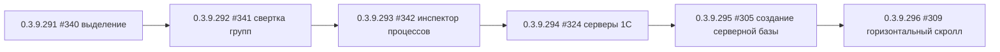

# План исправлений: релизы 0.3.9.291 – 0.3.9.296

Репозиторий: github.com/sivatorov/ConfigurationManagement
Ветка: main (последний выпуск 0.3.9.290)
Проект: Configuration Management — стартер 1С на C#/.NET, две платформы UI (Windows/WPF + Linux/Avalonia, общий код под `#if WINDOWS`/`#if LINUX`, зеркала `.xaml.cs` ↔ `.Avalonia.cs`).
Источник задач: отобранные по правилу «последний комментарий не от sivatorov либо комментариев нет» issues #342, #341, #340, #324, #309, #305 (полный анализ — `issues_analysis.json`). Пропущены: #338, #335, #334, #333, #330, #323, #321 (последний комментарий — sivatorov, ждём реакции пользователя).

## Версии и порядок выполнения

| Версия | Issue | Тема | Тип |
|---|---|---|---|
| 0.3.9.291 | #340 | Снятие выделения после мультивыделения (регресс фикса 0.3.9.277) | баг |
| 0.3.9.292 | #341 | Свертка групп (регресс фикса 0.3.9.289) | баг |
| 0.3.9.293 | #342 | Инспектор процессов: «неизвестная база» + завершение процесса | баг |
| 0.3.9.294 | #324 | Серверы 1С: подключение не к введённому адресу, непонятные ошибки | баг |
| 0.3.9.295 | #305 | Создание серверной базы: выбор сервера, предупреждение версии, разрядность | баги |
| 0.3.9.296 | #309 | Пропал горизонтальный скролл (10-я попытка, Windows/WPF) | баг (сложный) |

Логика порядка: сначала независимые регрессы UI (#340, #341), затем инспектор процессов (#342) и монитор серверов (#324), далее создание базы (#305) и, последним, самый затяжной #309 (требует итерации диагностики с пользователем). #340 и #341 правят один файл [MainWindow.Hotkeys.cs](Configuration%20Management/Views/MainWindow.Hotkeys.cs) в разных участках — выполняются строго последовательно (сначала #340, потом #341), чтобы не накладывать правки одного коммита.



Правила для каждого выпуска:
- Номер версии поднимается в [Configuration Management.csproj](Configuration%20Management/Configuration%20Management.csproj:62) — поля `Version`, `AssemblyVersion`, `FileVersion`, `InformationalVersion`.
- После каждой версии: `dotnet test` (проект `ConfigurationManagement.Tests`) и `dotnet build -p:BuildLinux=true` (кросс-сборка).
- Issues НЕ закрывать; после каждой версии оставлять комментарий в issue (шаблон `publish/comment-NNN-<версия>.md` по образцу существующих, публикация через gh CLI).
- Локализация ru/en для всех новых строк UI ([ru.json](Configuration%20Management/Localization/Languages/ru.json) / en.json).
- Двухплатформенность: любое изменение UI — в двух зеркалах (WPF `.xaml`/`.xaml.cs` и Avalonia `.Avalonia.cs`); общая логика — в `ViewModels`/`Services` без директив платформы.
- Итоговые шаги: сборка exe Windows и пакетов Linux (`package/linux`, `publish/build_deb_win_*.py`), запись в CHANGELOG.md и README.md (бейдж версии, строка 3), push на GitHub, создание Release.

---

## 0.3.9.291 — #340 «Снятие выделения после мультивыделения»

**Последний комментарий 7OH (2026-10-02T20:04):** «После выделения, нажатия правой кнопки, а потом нажатия левой в другом месте: выделяется другая строка и через секунду нет текущей строки. Снятие выделения происходит — но происходит и снятие текущей строки через время. Вот последнего пункта происходить не должно».

**Диагноз (подтверждён по коду).** Фикс 0.3.9.277 добавил в [MainWindow.Hotkeys.cs](Configuration%20Management/Views/MainWindow.Hotkeys.cs:661) обработчик `OnContextMenuClosed` → [TryApplyTreeClickAfterMenuClosed](Configuration%20Management/Views/MainWindow.Hotkeys.cs:681), который после фактического закрытия контекстного меню отложенно (`Dispatcher.BeginInvoke(Input)`) повторно выполняет `_viewModel.ClearBatchSelection()` + `ApplySelection(item, infobase)` для строки под курсором. При этом сам клик уже обрабатывается основным обработчиком [OnInfobaseTree_PreviewMouseLeftButtonDown](Configuration%20Management/Views/MainWindow.Events.cs:616) — выбор применяется ДВАЖДЫ. Второе (отложенное) применение накладывается на хвост событий закрытия попапа меню и переключения фокуса/выделения TreeView: строка, выбранная первым проходом, сбрасывается штатной логикой `SelectionChanged`/фокусом, а отложенный повтор либо не восстанавливает её, либо восстанавливает строку, которая уже ушла из видимой области. «Через секунду» — это и есть отложенный `BeginInvoke`.

### Правки
- [MainWindow.Hotkeys.cs](Configuration%20Management/Views/MainWindow.Hotkeys.cs:681) `TryApplyTreeClickAfterMenuClosed`:
  - Ввести guard против повторного применения: флаг/отметку «клик уже применён основным обработчиком» (например, поле `DateTime _lastAppliedTreeClickUtc` или `int _lastHandledClickSeq`, которое ставится в `OnInfobaseTree_PreviewMouseLeftButtonDown` при успешном применении выбора). Если последний реальный клик уже привёл к выбору строки под курсором — отложенное повторное применение не выполняется.
  - Проверять актуальность курсора перед отложенным применением: если мышь уже отпущена или переместилась на другую строку — не применять выбор (иначе «уезжает» текущая строка).
  - Не вызывать `ClearBatchSelection()` повторно без необходимости: снятие мультивыделения достаточно выполнить один раз; повторный вызов в отложенной ветке не должен трогать `SelectedItem` основной строки.
- [MainWindow.Events.cs](Configuration%20Management/Views/MainWindow.Events.cs:616): после успешного `ApplySelection`/`SelectRange` устанавливать отметку «клик обработан», чтобы `TryApplyTreeClickAfterMenuClosed` не дублировал выбор.
- Avalonia: проверить [LeveledTreeView.Avalonia.cs](Configuration%20Management/Controls/LeveledTreeView.Avalonia.cs:85) (`OnRowPointerPressed`) — там правый клик и закрытие меню обрабатываются иначе; убедиться, что аналогичного двойного применения нет, при необходимости добавить тот же guard.
- Поведение не должно измениться для нормального клика без контекстного меню (регрессия #261/#313 не должна вернуться).

### Тесты
UI-поведение юнит-тестами не покрывается (логика в code-behind). Ручная проверка сценария issue на WPF и Avalonia: мультивыделение → правый клик → левый клик по другой строке → выбор остаётся на последней строке и не «пропадает» через секунду. Регрессия `dotnet test`.

---

## 0.3.9.292 — #341 «Свертка групп»

**Последний комментарий 7OH (2026-10-02T20:11):** «Клик с контролом и мышкой - эффекта не даёт - ни сворачивание, ни разворачивание. Указанные комбинации без мышки - не работают, но... Если группа уже развернута и нажать кнопку разворачивания всех подчиненных - то разворачивает, но надо и при свернутой группе. Обратная кнопка не сворачивает всё, так как после обычного разворота группы - вложенные группы остались развёрнуты».

**Диагноз (подтверждён по коду, найдены конкретные дефекты):**
1. **Клавиатура WPF:** [MainWindow.Hotkeys.cs](Configuration%20Management/Views/MainWindow.Hotkeys.cs:407) ветка Ctrl+Shift++/- в `Window_PreviewKeyDown` использует битовые маски `(Keyboard.Modifiers & Control) == Control && (Keyboard.Modifiers & Shift) == Shift`. Физическое нажатие «Ctrl+Alt+плюс» на основной клавиатуре = Ctrl+Alt+Shift+OemPlus (плюс требует Shift) — попадает в ветку Ctrl+Shift и выполняет `ExpandAllGroupsCommand` («развернуть ВСЁ») вместо ветки, причём `e.Handled = true` гасит событие до InputBindings [Ctrl+Alt](Configuration%20Management/Views/MainWindow.Hotkeys.cs:136). Явной ветки Ctrl+Alt в WPF-`PreviewKeyDown` нет (в Avalonia она есть — [MainWindow.Avalonia.Hotkeys.cs](Configuration%20Management/Views/MainWindow.Avalonia.Hotkeys.cs:296)).
2. **Клавиатура Avalonia:** [MainWindow.Avalonia.Hotkeys.cs](Configuration%20Management/Views/MainWindow.Avalonia.Hotkeys.cs:278) ветка Ctrl+Shift стоит раньше и тоже ловит Ctrl+Alt+Shift+OemPlus; условия с `!= 0` не исключают лишние модификаторы.
3. **Мышь WPF:** обработчик Ctrl+клика по группе есть ([MainWindow.Events.cs](Configuration%20Management/Views/MainWindow.Events.cs:709)) — требуется проверка условий срабатывания (см. «Шаги диагностики»); наиболее вероятно, что часть кликов уходит в `TreeViewItem`/стрелку раскрытия и до ветки не доходит.
4. **Мышь Avalonia:** в [LeveledTreeView.Avalonia.cs](Configuration%20Management/Controls/LeveledTreeView.Avalonia.cs:111) Ctrl-обработка реализована ТОЛЬКО для строк-баз (`ToggleBatchSelection`); для узлов-групп ветка `ToggleGroupBranchCommand` отсутствует → Ctrl+клик по группе на Linux гарантированно «не даёт эффекта».
5. **«Разворачивает подчинённых только у развёрнутой группы»:** команды ветки [ExpandBranchCommand/CollapseBranchCommand](Configuration%20Management/ViewModels/MainViewModel.Theme.cs:481) берут узел из `CurrentBranchNode()` (выбранная группа ИЛИ группа выбранной базы; иначе null → no-op). При свёрнутой группе без явного выбора ветка не применяется; вдобавок сломанные горячие клавиши (п.1) усугубляют картину.
6. **«Свернуть всё»:** нажатие Ctrl+Alt+- (ветка) при пустом `CurrentBranchNode()` тоже no-op; пользователь ожидает «свернуть всё». Кнопка верхней панели «Свернуть всё» (Ctrl+Shift+-) работает, но вложенные группы после «обычного разворота» (кнопка на узле — [ToggleGroupExpandedCommand](Configuration%20Management/Views/MainWindow.xaml:2331)) остаются развёрнутыми — это ожидаемое поведение команды узла; необходимо, чтобы Ctrl+Alt+- сворачивал ветку корректно, а не всё дерево.

### Правки
- [MainWindow.Hotkeys.cs](Configuration%20Management/Views/MainWindow.Hotkeys.cs:407): в `Window_PreviewKeyDown` добавить ЯВНУЮ ветку Ctrl+Alt (без Shift) для `OemPlus/Add` → `ExpandBranchCommand`, `OemMinus/Subtract` → `CollapseBranchCommand` (по образцу Avalonia-версии), с `e.Handled = true`. Условия обеих веток уточнить ТОЧНЫМ сравнением модификаторов (не битовыми масками), чтобы Ctrl+Alt+Shift не попадал в Ctrl+Shift, а Ctrl+Alt — не конфликтовал.
- [MainWindow.Avalonia.Hotkeys.cs](Configuration%20Management/Views/MainWindow.Avalonia.Hotkeys.cs:278): уточнить условия: ветка Ctrl+Shift — только при точном наборе Control+Shift (без Alt); ветка Ctrl+Alt — без Shift (иначе нажатие Ctrl+Alt+«+» на основной клавиатуре уходит в «развернуть всё»).
- Мышь Avalonia: в [LeveledTreeView.Avalonia.cs](Configuration%20Management/Controls/LeveledTreeView.Avalonia.cs:85) `OnRowPointerPressed` добавить обработку Ctrl+клика по `GroupNodeViewModel` c `Group != null`: вызвать `ToggleGroupBranchCommand` (без изменения выделения), пометить событие обработанным — зеркально WPF-ветке [Events.cs:709](Configuration%20Management/Views/MainWindow.Events.cs:709).
- Мышь WPF: проверить условие `groupNode.Group is not null` и что клик по свёрнутой группе доходит до обработчика (не перехватывается раскрывающей стрелкой/TreeViewItem); при необходимости расширить область захвата (слушать `MouseLeftButtonDown` на строке группы, а не только на поддереве).
- Команды ветки: при `CurrentBranchNode() == null` — команды остаются no-op (это нормально), но добавить StatusBar-подсказку/логирование «нет выбранной группы» при ручном вызове (опционально, с локализацией) — для прозрачности поведения.
- Убедиться, что `ExpandBranchOf`/`CollapseBranchOf` ([MainViewModel.Theme.cs](Configuration%20Management/ViewModels/MainViewModel.Theme.cs:481)) корректно работают для свёрнутой группы (они ставят `IsExpanded` самому узлу и рекурсивно детям — см. «Тесты»).
- Локализация ru/en: подсказки/заголовки (если добавляются новые строки).

### Шаги диагностики (если мышь-ветка WPF не заработает с первого раза)
- Временный лог в `OnInfobaseTree_PreviewMouseLeftButtonDown` (case `GroupNodeViewModel`): фактические `Keyboard.Modifiers`, тип `DataContext` узла. Лог удалить после подтверждения.

### Тесты
- Чистая модель: тест на `ExpandBranchOf`/`CollapseBranchOf` с несколькими уровнями вложенности — после разворачивания ветки соседние ветки и их дети не меняются; повторный `ToggleGroupBranch` возвращает исходное состояние (мок репозитория/настроек, паттерн существующих VM-тестов).
- `SetExpandedDeep` — существующие тесты расширить кейсом «ветка, а не всё дерево».
- Горячие клавиши — UI, ручная проверка на обеих платформах (основная клавиатура + NumPad).
- Регрессия `dotnet test`.

---

## 0.3.9.293 — #342 «Инспектор процессов»

**Комментарий 7OH (2026-10-02T13:57):** «Запустил базу стартером — инспектор процессов пишет, что это "неизвестная база"»; «Завершить процесс по кнопке тоже не удалось».

**Диагноз (подтверждён по коду, два независимых дефекта):**

1. **«Неизвестная база».** Сопоставление выполняет [RunningInfobaseMatcher.MatchesCommandLine](Configuration%20Management/Services/RunningInfobaseMatcher.cs:18) через [MatchesValue](Configuration%20Management/Services/RunningInfobaseMatcher.cs:38) — СТРОГОЕ сравнение значения ключа `/F` (путь) или `/S` (строка «сервер\база») с данными базы списка. Возможные причины расхождения при запуске стартером:
   - клиент-серверная база задана в списке с портом («localhost:1541» в `Connection.Server`), а командная строка процесса содержит `/S localhost\БД` без порта → «localhost:1541\БД» ≠ «localhost\БД»;
   - регистр/алиасы хоста (localhost vs 127.0.0.1 vs имя машины), кавычки и пробелы в имени базы;
   - файловая база: различие путей (UNC/буква диска, хвостовые разделители, короткие имена) — `NormalizePath` локальный и для UNC может не совпадать.
2. **«Завершить процесс».** [OneCProcessKiller.Windows](Configuration%20Management/Services/OneCProcessKiller.Windows.cs:14) делает `p.Kill(entireProcessTree: true)`; при недостатке прав (процесс запущен от имени другого пользователя/с повышенными правами) `Win32Exception` глушится в catch → `false`, и пользователь видит голое [ProcessInspector.KillFailedFormat](Configuration%20Management/Localization/Languages/ru.json:1767) без причины.

### Правки
- [RunningInfobaseMatcher.cs](Configuration%20Management/Services/RunningInfobaseMatcher.cs:38): для ключа `S` сравнивать НОРМАЛИЗОВАННО: сервер без порта (переиспользовать логику `CreateInfobaseService.ParseServerPort`/`ConnectionSettings.ParseSrvr`), имя базы — последний сегмент после последнего `\` (или весь остаток, если `\` нет); регистр не учитывать; допускать совпадение «имя базы» по базе даже при отличии способа указания сервера (localhost/127.0.0.1). Для ключа `F` — расширить `NormalizePath`: учёт trailing-разделителей и (при возможности) полного пути уже есть; добавить варианты сравнения по имени каталога как fallback (опционально, помечено комментарием).
- [ProcessInspectorViewModel.cs](Configuration%20Management/ViewModels/ProcessInspectorViewModel.cs:107) `KillSelected`: показывать причину отказа из нового свойства киллера; новая строка локализации `ProcessInspector.KillFailedDetailFormat` («Не удалось завершить процесс {0}. {1}»).
- [IOneCProcessKiller.cs](Configuration%20Management/Services/IOneCProcessKiller.cs:9): добавить `string LastError { get; }` (или `bool Kill(int pid, string? token, out string error)`); [OneCProcessKiller.Windows.cs](Configuration%20Management/Services/OneCProcessKiller.Windows.cs:31) — захватывать текст исключения (`Win32Exception.Message`: «Отказано в доступе», «Не найден процесс»); [OneCProcessKiller.Linux.cs](Configuration%20Management/Services/OneCProcessKiller.Linux.cs:11) — аналогично (причина kill). Сообщение-подсказка: «процесс может быть запущен от имени другого пользователя или с повышенными правами — запустите приложение от имени администратора».
- [ProcessCommandLineParser.cs](Configuration%20Management/Services/ProcessCommandLineParser.cs:59): при необходимости согласовать `ExtractConnectionString`/`ExtractValue` с новым форматом (кавычки, «server\base» без порта) — для колонки «Строка подключения».
- Локализация ru/en.

### Тесты
- `RunningInfobaseMatcherTests` (добавить/расширить): клиент-серверная база с портом в `Connection.Server` vs командная строка без порта; регистр; кавычки вокруг имени базы; хвостовые разделители файлового пути; 127.0.0.1 vs localhost (если поддерживается).
- `ProcessCommandLineParserTests`: значение `/S "Srv\База с пробелами"` — имя базы целиком.
- Килы — ручная проверка (Windows, процесс от своего пользователя и от администратора).
- Регрессия `dotnet test`.

---

## 0.3.9.294 — #324 «Серверы 1С»

**Последний комментарий 7OH (2026-10-02T20:25):** «В поля введены localhost и 27545. По итогу ошибка подключения к ALF и 27540. Второй раз нажал кнопку - уже другое сообщение».

**Диагноз (подтверждён по коду).** Окно монитора [ServerMonitorWindow.xaml.cs](Configuration%20Management/Views/ServerMonitorWindow.xaml.cs:118)/[Avalonia](Configuration%20Management/Views/ServerMonitorWindow.Avalonia.cs:649) в конструкторе вызывает `LoadSavedConnectionSettings()`: поля VM заполняются сохранёнными ранее (после успешного подключения к ALF:27540) значениями `RacServerAddress`/`RacServerPort`. Пользователь видит в полях ALF/27540 (тихий префилл), считает их своими значениями, нажимает «Подключиться» — `BuildParams()` ([ServerMonitorViewModel.cs](Configuration%20Management/ViewModels/ServerMonitorViewModel.cs:627)) честно берёт ALF:27540, ошибка «про ALF и 27540». После ручного ввода localhost/27545 rac подключается уже к ним и падает по-другому (другое сообщение при повторном нажатии — недетерминированные тексты stderr rac). Дополнительно: сообщение об ошибке [BuildErrorMessage](Configuration%20Management/ViewModels/ServerMonitorViewModel.cs:807) не содержит целевой адрес:порт, к которому шло подключение, поэтому пользователь не может понять, куда «уехал» запрос.

### Правки
- **Префилл не должен маскировать ввод:** `LoadSavedConnectionSettings` применять сохранённые значения ТОЛЬКО если соответствующие поля ещё пусты/не трогались (либо ввести флаг «пользователь редактировал поле», после первого ввода не перетирать). На обеих платформах. Цель: при открытии окна пользователь всегда видит, что в полях — сохранённое значение, и оно не подменяется «само».
- **Прозрачность источника:** ToolTip на полях адреса/порта «последнее сохранённое значение из настроек; изменяется вручную» (новая локализация `ServerMonitor.SavedSettingsTooltip`), если префилл сохранён.
- **Понятная ошибка:** в `ConnectAsync` ([ServerMonitorViewModel.cs](Configuration%20Management/ViewModels/ServerMonitorViewModel.cs:312)) и `LoadClusterDataAsync` при ошибке формировать сообщение с целевым адресом: «Не удалось подключиться к {host}:{port}: {текст rac}» (новый ключ локализации). `BuildErrorMessage` — включить параметры подключения из `BuildParams()`.
- **Стабилизация сообщений:** в [RacClient.cs](Configuration%20Management/Services/RacClient.cs:236) уже логируется фактическая команда (`RAC: rac=..., команда: ...`) — добавить в текст `RacClientException` адрес:порт из `parameters` (например, «rac localhost:27545 cluster list завершился с кодом N: <stderr>»), чтобы повторные нажатия давали консистентные и понятные ошибки.
- **Согласовать ClusterImport:** [ClusterImportWindow.xaml.cs](Configuration%20Management/Views/ClusterImportWindow.xaml.cs:149)/[Avalonia](Configuration%20Management/Views/ClusterImportWindow.Avalonia.cs:281) — тот же префилл из `RacServerAddress`; применить ту же политику (не перетирать введённое).
- Avalonia-окно монитора — та же правка `LoadSavedConnectionSettings` (строка 649).
- Локализация ru/en.

### Тесты
- Чистая логика форматирования ошибки: выделить helper (например, `RacErrorFormatter.Format(address, port, inner)`) — юнит-тесты (null-адрес, порт 0, длинный stderr).
- `RacConnectionAddressTests` — существующие; при необходимости добавить кейсы «host с несколькими ':'».
- `ServerMonitorViewModelTests`/`ClusterImportViewModelTests`: префилл не перетирает введённые значения (mock-репозиторий настроек).
- Регрессия `dotnet test`.

---

## 0.3.9.295 — #305 «Создание серверной базы»

**Последний комментарий 7OH (2026-10-02T20:22):**
1. «Выбор сервера из списка всё ещё ничего не подставляет в поле».
2. «Окно с необъяснимым текстом "Выбранная версия платформы 8.3.27 отличается от версии 8.5.1, с которой работают базы на сервере localhost. Продолжить?" Всё ещё появляется и всё ещё не понятно, как оно догадывается, какая версия используется на сервере без указания порта».
3. «При создании базы используется корректная x64 версия, но в базу добавлено по прежнему как "8.3.27 [x86]"».

**Диагноз (все три пункта подтверждены по коду):**

1. **Выбор сервера из списка.** WPF: обработчик есть ([CreateInfobaseWindow.xaml.cs](Configuration%20Management/Views/CreateInfobaseWindow.xaml.cs:622) `OnServerBox_SelectionChanged` + `DropDownClosed`). Avalonia: обработчики есть ([CreateInfobaseWindow.Avalonia.cs](Configuration%20Management/Views/CreateInfobaseWindow.Avalonia.cs:387)), но предметы списка — `ComboBoxItem { Content = s }`, и при `IsTextSearchEnabled=false` выбор мышью в редактируемом ComboBox может не менять `Text` (срабатывает только `SelectedItem`). Надёжного «клик по пункту → текст в поле» на обеих платформах нет: WPF может страдать от отложенного сброса `SelectedItem`. Требуется единообразная, надёжная подстановка: на `SelectionChanged` + `DropDownClosed` + (для Avalonia) дополнительно `PointerReleased`/подписка на `SelectedItem` напрямую выставлять `Text`, не давая отложенному сбросу стереть ввод.
2. **Предупреждение о версии.** Источник — эвристика [GetIncompatibleExistingVersion](Configuration%20Management/Services/CreateInfobaseService.cs:265): версия берётся НЕ с сервера, а из ЛОКАЛЬНОГО списка баз приложения (базы с `ConnectionType.ClientServer`, у которых `conn.Server` строково совпадает с введённым сервером). Сравнение серверов СТРОГОЕ (без нормализации порта/регистра/алиасов). Сообщение [CreateInfobase.VersionMismatchMsg](Configuration%20Management/Localization/Languages/ru.json:1333) сформулировано так, что выглядит как «приложение узнало версию с сервера». Требуется: нормализация сравнения серверов (без порта, без регистра), понятное сообщение («в вашем списке баз есть базы на сервере {server} с версией платформы {version}…»).
3. **Разрядность [x86].** Корень найден: [CreateInfobaseService.TryCreate](Configuration%20Management/Services/CreateInfobaseService.cs:152) вызывает `PlatformVersionService.ParseVariant(platform, out cleanPlatform, out platformArch)`, а `ParseVariant` БЕЗ суффикса возвращает `architecture = "32"` по умолчанию (подтверждено [PlatformVersionService.cs:593](Configuration%20Management/Services/PlatformVersionService.cs:593) и тестом [PlatformVersionPickerTests.cs:24](ConfigurationManagement.Tests/PlatformVersionPickerTests.cs:24)). Условие `platformArch == "32" || platformArch == "64" ? platformArch : …` трактует этот дефолт как ЯВНО выбранную разрядность → в базу пишется `Architecture="32"` → в списке «8.3.27 [x86]». При этом `OneCLauncher.CreateInfoBase` запускает x64 (по настройке DefaultArchitecture) — отсюда расхождение «запустилось x64, записано x86».

### Правки
- **П.3 (обязательно, чистый баг):** [CreateInfobaseService.cs](Configuration%20Management/Services/CreateInfobaseService.cs:152) заменить `ParseVariant` на `ParseVariantOptionalArch` (возвращает `architecture == null` без суффикса); разрядность: явный суффикс «(32)/(64)» → 32/64; иначе — `PriorityArchitectureFromDefault(DefaultArchitecture)` (как задумано). Это убирает ложный [x86] при дефолте X64.
- **П.2:** [CreateInfobaseService.cs](Configuration%20Management/Services/CreateInfobaseService.cs:279) нормализовать сервер базы перед сравнением: отрезать порт (`ParseServerPort`), убрать регистр; вынести сравнение в `internal static bool SameServer(string a, string b)` для тестов. Обновить сообщение: новый ключ локализации `CreateInfobase.VersionMismatchMsg2` — «В вашем списке баз есть клиент-серверные базы на сервере {2} с версией платформы {1}, которая отличается от выбранной ({0}). Продолжить?». В комментарии issue пояснить механику (версия берётся из списка баз приложения, не с сервера).
- **П.1:** правка подстановки выбора сервера на обеих платформах: [CreateInfobaseWindow.xaml.cs:622](Configuration%20Management/Views/CreateInfobaseWindow.xaml.cs:622) и [CreateInfobaseWindow.Avalonia.cs:930](Configuration%20Management/Views/CreateInfobaseWindow.Avalonia.cs:930) `SplitSelectedServer` — гарантировать установку `Text` при любом способе выбора (мышь/клавиатура), не давать отложенному `SelectedItem=null` стирать поле; Avalonia — дополнить подписку на `SelectedItem`/`DropDownClosed`.
- **П.4 (пояснение):** в `HelpText` окна создания ([CreateInfobaseWindow.xaml.cs:726](Configuration%20Management/Views/CreateInfobaseWindow.xaml.cs:726)) уточнить про предупреждение версии; ToolTip на поле «Сервер 1С»: «выбор из списка заполняет поле "server:port"».
- Локализация ru/en.

### Тесты
- `CreateInfobaseDbServerStringTests`/новый `CreateInfobaseServiceTests`:
  - разрядность без суффикса + `DefaultArchitecture=X64` → `64-priority` (не «32»); без суффикса + `X86` → `32-priority`; с суффиксом «(32)»/«(64)» → явная;
  - `SameServer`: «localhost:1541» ≡ «localhost», регистр, «127.0.0.1» ≠ «localhost» (если не вводится алиасная нормализация);
  - `GetIncompatibleExistingVersion` (mock-репозиторий): база с портом на сервере находится по серверу без порта; чужая версия не триггерит; файловые базы игнорируются.
- Регрессия `dotnet test`.

---

## 0.3.9.296 — #309 «Пропал горизонтальный скрол» (10-я попытка, Windows/WPF)

**Последний комментарий 7OH (2026-10-02T20:06):**
```
CM_COLUMNS: total=1092,8, sumActualHeader=1092,8, content=1092,8, presenterMin=1092,8,
viewport=1094,4, extent=1096,8, scrollable=2,4, panel=VirtualizingStackPanel,
treeW=762,8, viewportSbw=1111,2, hdrRight=1102,8,
cols=[0:24,0, 1:0,0, 2:28,0, 3:26,0, 4:285,6, 5:0,0, 6:110,4, 7:0,0, 8:0,0, 9:260,8, 10:84,8, 11:143,2, 12:0,0, 13:130,0, 14:0,0]
```
«Последние колонки (10:84,8; 11:143,2; 13:130,0) недостижимы — полоса почти не двигается».

**Диагноз (уточнён по новым данным).** Сумма колонок заголовка (1092,8) ≈ viewport внутреннего ScrollViewer (1094,4) → `scrollable=2,4`: ПО РАСЧЁТУ полоса почти не нужна, но пользователь видит недостижимые последние колонки. Значит контент строк РЕАЛЬНО шире видимой области, а `ExtentWidth` меряется не по фактической ширине строк, а по вьюпорту + MinWidth презентера. Причины, которые остались в силе:
- `panel=VirtualizingStackPanel`: панель НЕ переключена на StackPanel, потому что `needHorizontal = total > viewport + 1` ложно (1092,8 < 1094,4) — [ApplyTreePanelStrategy](Configuration%20Management/Views/MainWindow.Columns.cs:887) не сработала, хотя визуально колонки обрезаются;
- `treeW=762,8` при `viewport=1094,4`: фактическая ширина дерева меньше вьюпорта — контент/заголовок растянуты за пределы дерева (структурная проблема разметки Grid «HeaderGrid + MainTree»);
- `hdrRight=1102,8` и `viewportSbw=1111,2`: правый край заголовка уходит ПОД вертикальный скроллбар внутреннего ScrollViewer (последние колонки визуально обрезаны скроллбаром);
- `presenterMin=1092,8` не расширяет реальную ширину строк: VirtualizingStackPanel при CanContentScroll=True меряет строки вьюпортной шириной, Grid строк со звёздной «Название» сжимает звезду и ОБРЕЗАЕТ абсолютные колонки справа (желаемая ширина строки не растёт).

### Шаги (порядок экспериментов, каждый — отдельный коммит с логом CM_COLUMNS)
1. **Эксперимент B (скроллбар):** учесть ширину вертикального скроллбара в расчёте `effective`: при наличии вертикальной прокрутки добавлять `SystemParameters.VerticalScrollBarWidth` (и/или проверить `ScrollViewer.ComputedVerticalScrollBarVisibility`). Проверить логом: станет ли `scrollable ≈ sbw` и последняя колонка (13) достижимой. Если да — дефект «колонки под скроллбаром» устранён; оценить, сохраняется ли виртуализация.
2. **Эксперимент C (структурный, вероятный победитель):** вынести горизонтальную прокрутку во ВНЕШНИЙ `ScrollViewer` (HorizontalScrollBarVisibility=Auto, VerticalScrollBarVisibility=Disabled) вокруг связки «HeaderGrid + MainTree»; у MainTree внутренний горизонтальный скролл — Disabled, `ScrollViewer.CanContentScroll=false` (или только для горизонтали). Тогда VirtualizingStackPanel получает по горизонтали неограниченную ширину, Grid строк занимает полную желаемую ширину (сумму колонок), ExtentWidth внешнего скролла — честный. Вертикальная прокрутка остаётся внутренней (виртуализация строк сохраняется). Синхронизацию заголовка и строк (сдвиг/выравнивание, [MainWindow.Columns.cs:603](Configuration%20Management/Views/MainWindow.Columns.cs:603)) перепроверить в новой структуре.
3. **Эксперимент D (фактическая ширина строк):** `needHorizontal` в [ApplyTreePanelStrategy](Configuration%20Management/Views/MainWindow.Columns.cs:891) считать по ФАКТИЧЕСКОЙ ширине контента строк (значение `rowSum` из `MeasureFirstRowDiagnostics`/[LogColumnsDiagnostics](Configuration%20Management/Views/MainWindow.Columns.cs:952)), а не по расчётному `total`: если строки реально шире вьюпорта — переключать на StackPanel даже когда `total <= viewport`.
4. **Fallback:** после применения настроек колонок/пересборки — принудительная прокрутка к концу (`ScrollToHorizontalOffset(ExtentWidth)`) с последующей нормализацией, чтобы не «залипать».
5. Каждый шаг — сборка 0.3.9.29x, комментарий в issue с просьбой прислать новый лог CM_COLUMNS (в лог дополнительно вывести `rowSum/rowOrigin/rowRight/rowCols` — они уже замеряются, но не были присланы).

### Что не трогать
- Avalonia-часть (проблема не воспроизводится), кроме общей чистой функции, если она появится.
- [ListMinWidthCalculator.cs](Configuration%20Management/Views/ListMinWidthCalculator.cs:60) — только при выносе новой чистой функции (например, `IncludeScrollbar(computed, hasVerticalScrollbar, scrollbarWidth)`), покрытой тестами.

### Тесты
- Только чистые helper-функции, если появятся (расчёт с учётом скроллбара, фактический контент). UI-раскладка юнит-тестами не покрывается. Ожидается итерация с пользователем (лог CM_COLUMNS).

---

## Единые требования к качеству

- После каждого выпуска: `dotnet test` (Windows), затем `dotnet build -p:BuildLinux=true`.
- Комментарии в issues: `publish/comment-<номер>-<версия>.md` по образцу существующих, issue не закрывать; для #309 дополнительно запрашивать у пользователя свежий лог CM_COLUMNS.
- Версия поднимается в csproj; CHANGELOG.md — новая секция на каждую версию; README.md — бейдж версии (строка 3) и, при необходимости, список возможностей.
- Сборка/публикация: Windows — `build-windows-single-file.ps1`/`build.ps1`, Linux — `package/linux` (AppImage/deb) и `publish/build_deb_win_*.py`; релиз на GitHub Releases с `release_body_*.md`.
- Никаких оценок времени; каждое изменение — минимальный коммит с упоминанием issue.