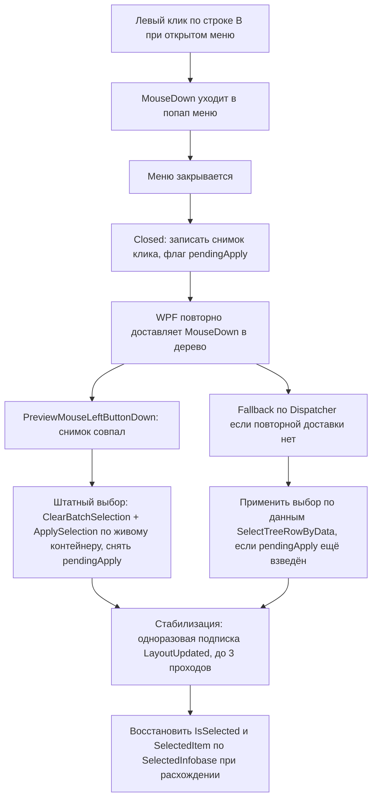

# PLAN 0.3.9.303 — исправление открытых issues #334, #330, #323 (вход на portal.1c.ru) и #340 (снятие выделения)

Дата: 2026-10-04. Текущая версия: **0.3.9.302** (релиз от 2026-10-04). Следующая микро-версия: **0.3.9.303**.
Источник: комментарии пользователя @7OH от 2026-10-04T10:21–11:21Z (последний комментарий не от владельца — ориентируемся на него).
Двуплатформенный проект: Windows/WPF (`#if WINDOWS`, `*.xaml`/`*.xaml.cs`) и Linux/Avalonia (`#if LINUX`, `*.Avalonia.cs`); общая логика (сервисы, модели, ViewModel) — общая.

**Ограничения реализации:** только код + юнит-тесты; issues НЕ закрывать; комментарий в issue после выхода релиза с указанием версии; изменения — в CHANGELOG.md, README.md; после каждой задачи — поднятие версии (`.csproj`); в конце — сборка exe для Windows и Linux и публикация релиза на GitHub. Реализация выполняется отдельными задачами в code-режиме строго по этому плану.

---

## Порядок выполнения

| № | Задача | Issue | Микро-версия | Приоритет | Обоснование |
|---|--------|-------|--------------|-----------|-------------|
| 1 | Общий корень входа CAS на portal.1c.ru | #334, #330, #323 | 0.3.9.303 | Высокий | Три жалобы с одним корнем в [`OneCUpdatesService.cs`](Configuration%20Management/Services/OneCUpdatesService.cs); причина локализована (фантомный «успех» при 200 с формой, несброс счётчика, цикл 302→вход); фикс самодостаточен, закрывается тестами. |
| 2 | Снятие выделения после контекстного меню | #340 | 0.3.9.304 | Высокий | Пятая неудачная попытка (0.3.9.302) подтверждает, что подавление повторной доставки клика в принципе не работает; нужен принципиально новый подход + ручная проверка пользователем на Windows. |

Версия 0.3.9.303 (группа 1) и 0.3.9.304 (группа 2) формируются последовательно; финальные сборка Windows/Linux и релиз на GitHub выполняются для 0.3.9.304 и включают обе группы. Комментарии в issues: #334/#330/#323 — «исправлено в 0.3.9.303», #340 — «исправлено в 0.3.9.304».

---

## Задача 1. Issues #334, #330, #323 — программный вход на portal.1c.ru (общий корень)

### 1.1 Постановка (последние комментарии 7OH, 2026-10-04)

- **#334** «Автообновление платформы» (10:21:50Z): лог
  «Превышен лимит попыток входа на portal.1c.ru за сессию (лимит 3)» → «Редирект 302 (шаг 0)» → «каталог не получен — PlatformUpdate.Error.AuthRequired».
- **#330** «Скачивание нужной версии платформы из стартера» (10:22:52Z): лог
  «Вход… "Основная"» → «Вход выполнен (status=200)» **3 раза подряд** → «Превышен лимит попыток входа (лимит 3)» → «Редирект 302 (шаг 3)» → «каталог не получен — AuthRequired». Вывод пользователя: после успешного POST сессия не устанавливается, следующий запрос каталога снова 302 на login.
- **#323** «Окно Проверка обновлений» (10:23:22Z): лог
  «Превышен лимит попыток входа на portal.1c.ru за сессию (лимит 3)» → «Редирект 302 (шаг 0)» → «Требуется вход на portal.1c.ru».

### 1.2 Причины (подтверждены по коду [`OneCUpdatesService.cs`](Configuration%20Management/Services/OneCUpdatesService.cs))

**Причина 1 (главная, #330) — «фантомный успех» при HTTP 200 с формой входа.**
[`TryLoginPortalAsync`](Configuration%20Management/Services/OneCUpdatesService.cs:1092), ветка `postResponse.IsSuccessStatusCode` (строки 1167–1173): **любой** ответ 2xx после POST считается успехом, тело не проверяется. При неудачном логине CAS-форма 1С возвращает HTTP 200 с телом, содержащим форму входа (поле `execution`/`lt`, сообщение об ошибке). Сервер при этом **не выставляет сессионную cookie** → следующий запрос каталога снова даёт 302 на login → служба входит снова («Вход выполнен (status=200)» × 3) → счётчик исчерпан → «Превышен лимит» → AuthRequired. Ровно лог #330.

**Причина 2 (#334, #323) — счётчик попыток не сбрасывается после успеха.**
[`CanAttemptPortalLogin`](Configuration%20Management/Services/OneCUpdatesService.cs:1220) инкрементирует `_portalLoginAttempts` перед каждой попыткой; сброс — только при смене сигнатуры учётной записи (строка 1232–1234). В `TryLoginPortalAsync` при `Success` (строки 1157–1159, 1170–1172) счётчик **не обнуляется**. `IOneCUpdatesService` зарегистрирован как singleton ([`AppServices.cs`](Configuration%20Management/AppServices.cs:34)) — счётчик живёт всю сессию приложения. Итог: даже при реальных успешных входах через 3 операции (например, проверка каталога платформы + подгрузка файлов релиза + окно F9) лимит исчерпывается, и следующая операция получает 302 без входа — «Превышен лимит…» → «Редирект 302 (шаг 0)» → «Требуется вход» (логи #334/#323).

**Причина 3 — цикл 302→вход→302 внутри одного вызова.**
[`SendWithAuthAsync`](Configuration%20Management/Services/OneCUpdatesService.cs:943): при `needsLogin` выполняется вход (строки 967–981); при «фантомном успехе» запрос перестраивается и `continue` — снова 302 → снова вход, пока не кончится лимит (3) или `MaxRedirects` (10). Один вызов может потратить весь лимит попыток.

**Причина 4 — страница входа не распознаётся по содержимому при 200.**
[`FetchPageCoreAsync`](Configuration%20Management/Services/OneCUpdatesService.cs:884) и [`CheckForUpdatesAsync`](Configuration%20Management/Services/OneCUpdatesService.cs:216) определяют «требуется вход» только по заголовку `Location`/хосту `RequestUri` (login.1c.ru). Если releases.1c.ru вернёт 200 с HTML формы входа (без редиректа), код сочтёт ответ успешным и уйдёт в парсинг версий → Unavailable/NetworkError вместо понятной ошибки авторизации.

**Причина 5 — сообщение о лимите вводит в заблуждение и не даёт повторить.**
Строка 1238–1240: «дальнейший вход возможен после смены учётной записи» — фактически сброса нет (смена записи лишь меняет сигнатуру и обнуляет счётчик). Нет ни таймера автосброса, ни явного способа «повторить попытку», ни пояснения, что делать (проверить учётные данные ИТС).

### 1.3 Изменения в [`OneCUpdatesService.cs`](Configuration%20Management/Services/OneCUpdatesService.cs)

1. **Проверка успешности входа по отсутствию формы логина (устраняет Причину 1):**
   - В `TryLoginPortalAsync` ветку 2xx переписать: прочитать тело (`ReadBodyQuietlyAsync`), затем:
     - если в теле есть признаки формы входа (поля `execution`/`lt`/`username` из `ExtractFormFields` либо маркеры `DetectAuthFailureMarkers`, либо упоминание `login.1c.ru`) — вход **не выполнен**: `LogAnonymizedAuthFailure(...)`, `_lastLoginResult = PortalLoginResult.AuthFailed`, вернуть `AuthFailed`;
     - иначе (тело — целевой контент) — `Success`.
   - Новый внутренний метод `static bool LooksLikeLoginForm(string body)` — переиспользует `ExtractFormFields` (наличие `execution` и/или `lt`) и `DetectAuthFailureMarkers`.
   - В `FollowLoginRedirectsAsync` (строки 1292–1321) усилить критерий успеха: финальный ответ должен быть на хосте вне login.1c.ru **и** тело не должно содержать форму входа.

2. **Сброс счётчика попыток при успехе (устраняет Причину 2):**
   - Во всех ветках `Success` в `TryLoginPortalAsync` добавить `_portalLoginAttempts = 0;` (и `_lastAttemptAccountSignature` сохранить).
   - Новый внутренний метод `HasPortalSessionCookie()`: по `_cookieContainer.GetCookies(login.1c.ru / releases.1c.ru)` ищет сессионные cookie (`JSESSIONID`, `TGC`, `session_id` и пр.). Использовать как дополнительное подтверждение успеха (см. п.1) и как ранний выход: если сессия уже установлена, повторный вход не требуется.

3. **Одна попытка входа на вызов (устраняет Причину 3):**
   - В `SendWithAuthAsync` завести локальный флаг `loginTried` (или сравнивать последний `loginUrl`): вход выполняется **не более одного раза за вызов**. При повторном `needsLogin` после неудачной попытки — не входить снова, вернуть ответ как есть (дальше `CheckForUpdatesAsync`/`FetchPageCoreAsync` распознают login-редирект и вернут `AuthRequired`/`AuthFailed`).

4. **Распознавание страницы входа по содержимому (устраняет Причину 4):**
   - В `FetchPageCoreAsync` и `CheckForUpdatesAsync` после чтения тела при `IsSuccessStatusCode`: если `LooksLikeLoginForm(body)` — вернуть `AuthRequired` (или `AuthFailed`, если `_lastLoginResult` — AuthFailed/RedirectFailed).
   - Порядок проверок: сначала редирект/host (как сейчас), затем содержимое.

5. **Понятный лимит и возможность повторной попытки (устраняет Причину 5):**
   - Улучшить текст предупреждения о лимите: «Исчерпан лимит попыток входа на portal.1c.ru (3) за сессию. Проверьте учётные данные ИТС в «Настройки → Учётные данные ИТС» и повторите попытку позже; при неверном пароле портал может временно блокировать аккаунт».
   - Добавить таймер автосброса: фиксировать `DateTime _limitReachedAt` при исчерпании лимита; в `CanAttemptPortalLogin` разрешать новую попытку, если прошло ≥ `LoginLimitCooldown` (например, 10 минут).
   - Опционально: публичный метод `ResetPortalLoginAttempts()` (для вызова из окна настроек/ошибки при смене учётных данных ИТС), без снятия анти-брутфорс-защиты (сброс только по явному действию пользователя).

### 1.4 Изменения в ViewModel/окнах (отображение и повторная попытка)

- [`PlatformUpdateViewModel.cs`](Configuration%20Management/ViewModels/PlatformUpdateViewModel.cs) (метод `CheckUpdatesAsync`, строки 242–282): при ошибке `PlatformUpdate.Error.AuthRequired`/`AuthFailed`/лимите — добавить в журнал окна расширенный совет (ключ локализации) и уведомление; повторная попытка доступна кнопкой «Проверить» (уже есть). При необходимости — обработчик для открытия раздела «Учётные данные ИТС» в настройках (уже существует через команды главного окна — проверить и переиспользовать).
- [`PlatformDownloadViewModel.cs`](Configuration%20Management/ViewModels/PlatformDownloadViewModel.cs) (`LoadCatalogAsync`, строки ~320–355; `LoadReleaseFilesAsync`): то же самое для окна «Скачивание версии платформы».
- [`UpdateCheckWindow.xaml.cs`](Configuration%20Management/Views/UpdateCheckWindow.xaml.cs) (`RunCheckAsync`, строки 61–121) и [`UpdateCheckWindow.Avalonia.cs`](Configuration%20Management/Views/UpdateCheckWindow.Avalonia.cs): ошибки `Updates.AuthRequired`/`Updates.AuthFailed` уже отображаются в `ErrorText`; добавить совет про учётные данные ИТС в текст ошибки (через ключи локализации, без изменения логики).
- [`ActualReleasesViewModel.cs`](Configuration%20Management/ViewModels/ActualReleasesViewModel.cs): убедиться, что статусы AuthRequired/AuthFailed отображаются в колонке «Обновление» (уже поддерживается через `ApplyResult`); при необходимости — расширить текст ошибки.

### 1.5 Локализация

- [`ru.json`](Configuration%20Management/Localization/Languages/ru.json) / [`en.json`](Configuration%20Management/Localization/Languages/en.json):
  - уточнить текст `Updates.AuthRequired` и `PlatformUpdate.Error.AuthRequired` — добавить «проверьте учётные данные ИТС, повторите попытку позже»;
  - новый ключ (например, `Updates.LoginLimitReached` / `PlatformUpdate.Error.LoginLimit`) для сообщения об исчерпании лимита попыток входа с пояснением действий.

### 1.6 Тесты ([`OneCUpdatesLoginFlowTests.cs`](ConfigurationManagement.Tests/OneCUpdatesLoginFlowTests.cs) и др.)

Добавить/обновить сценарии:

1. `LoginPost200_WithLoginFormInBody_ReturnsAuthFailed` — POST входа возвращает 200 с телом формы (execution/lt) → `PortalFetchStatus.AuthFailed`, в журнале анонимизированная диагностика, без секретов. **(главный тест Причины 1)**
2. `LoginPost200_WithoutLoginForm_ReturnsSuccess` — POST возвращает 200 с контентом каталога (нет полей формы) → `Success`.
3. `SuccessfulLogin_ResetsAttemptCounter` — первый вызов: 2 неудачных 401 (2 попытки), затем успех; следующий вызов снова может входить (счётчик обнулён). **(Причина 2)**
4. `LoginLoopInsideSingleCall_LimitedToOneAttempt` — сервер отвечает 302→login при каждом запросе; за один вызов выполняется **одна** попытка входа, затем результат AuthRequired/AuthFailed (не 3 попытки). **(Причина 3)**
5. `CatalogPage_200_WithLoginFormBody_ReturnsAuthRequired` — `FetchPageAsync` получает 200 с HTML формы входа → `AuthRequired` (без парсинга версий). **(Причина 4)**
6. `LoginLimitReached_AfterCooldown_AllowsRetry` — после исчерпания лимита попытка запрещена; после `LoginLimitCooldown` (fake-время через инъекцию часов/таймера) снова разрешена. **(Причина 5)**
7. Обновить существующие тесты `LoginAttempts_LimitedToMax_ThenNoMoreAttempts`, `FirstLoginFails_SecondCallAttemptsLoginAgain_AndSucceeds` под новую семантику (после успеха — сброс счётчика).

### 1.7 Критерий проверки (ручной)

1. Windows: «Обновление платформы 1С» (Ctrl+F9) с корректными учётными данными ИТС — каталог получен с первой попытки; лог содержит «Вход на portal.1c.ru выполнен», без «status=200» фантома и без «Превышен лимит».
2. Тот же сценарий с НЕВЕРНЫМ паролем — понятное сообщение «вход не подтверждён (401)», не более 3 попыток за сессию, через 10 минут можно повторить.
3. «Скачивание версии платформы» (#330) и F9 «Проверка обновлений» (#323) — каталог/версия получены, повторные операции не упёрлись в лимит.
4. Повторить на Linux (Avalonia) — окна PlatformUpdate/PlatformDownload/UpdateCheck.
5. `dotnet test` зелёный; `dotnet build -p:BuildLinux=true` без ошибок.

---

## Задача 2. Issue #340 «Снятие выделения после мультивыделения» — новая стратегия

### 2.1 Постановка (последний комментарий 7OH, 2026-10-04T11:21:31Z)

> «Не помогло. Выделение всё ещё пропадает после закрытия контекстного меню при клике мышью на другой строке».

Сценарий: мультивыделение строк → правый клик (контекстное меню) → левый клик по другой строке → строка становится активной, но «через мгновение» выделение пропадает. Воспроизводится и без мультивыделения. Пять неудачных попыток: 0.3.9.277, 291, 299, 300, 302.

### 2.2 Причина (по коду; WPF)

Текущий механизм 0.3.9.302 ([`MainWindow.Hotkeys.cs`](Configuration%20Management/Views/MainWindow.Hotkeys.cs:730), [`MainWindow.Events.cs`](Configuration%20Management/Views/MainWindow.Events.cs:619), [`BatchSelectionHelper.cs`](Configuration%20Management/Services/BatchSelectionHelper.cs:175)):

- Клик по строке при открытом меню «проглатывается» попапом; после освобождения захвата WPF повторно доставляет «хвост» того же MouseDown в дерево.
- 0.3.9.302: выбор применяется **синхронно** в `TryApplyTreeClickAfterMenuClosed` (по данным `Mouse.GetPosition`/`InputHitTest` в момент `ContextMenu.Closed`), повторная доставка гасится снимком по времени (`Environment.TickCount`) и позиции (`IsSameClick`).

Почему не работает (две независимые слабости):

1. **Применение в `Closed` происходит в нестабильном состоянии контейнеров.** Попап только что закрылся; `InputHitTest`/контейнеры под курсором могут быть в процессе переработки виртуализацией (`VirtualizingStackPanel`, `VirtualizationMode="Recycling"`, [`MainWindow.xaml`](Configuration%20Management/Views/MainWindow.xaml:1385)). Выбор ставится на контейнер, который дальше переиспользуется — `IsSelected` «уезжает»/сбрасывается.
2. **Гашение повторной доставки лишает систему единственного устойчивого пути выбора.** Повторный MouseDown в дереве — это штатный путь `OnInfobaseTree_PreviewMouseLeftButtonDown`, который применяет выбор к **живому** контейнеру (с корректным DataContext) и надёжен под Recycling. Гася его снимком, мы остаёмся только с «применением в Closed», которое как раз и нестабильно (п.1). При этом ни одно применение не выполняется в стабильном состоянии — отсюда «сначала видно, потом пропадает».
3. **`IsSelected` не связан с моделью.** Двустороннюю привязку `IsSelected` к модели убрали ранее из-за рекурсии/StackOverflow ([`MainWindow.Tree.cs`](Configuration%20Management/Views/MainWindow.Tree.cs:706)). Поэтому после любой переработки контейнеров (Recycling) выделение **не восстанавливается автоматически** — только явными `ApplySelection`/`SelectTreeRowByData`. Закрытие попапа запускает дополнительные проходы разметки → переработка контейнеров → потеря `IsSelected`.

### 2.3 Новая стратегия «штатный выбор + однократный fallback + стабилизация IsSelected»

Идея: **полностью отказаться от подавления повторной доставки клика как механизма выбора**. Повторная доставка — это штатный, самый устойчивый путь; выбор применяется именно им. Применение в `Closed` остаётся только как *fallback* на случай, если WPF не повторно доставит клик (редкий случай), а после применения запускается короткая «конвергентная» стабилизация `IsSelected`, которая чинит последствия Recycling-переработки контейнеров.

Последовательность событий (WPF):

Изменения:

1. **[`MainWindow.Hotkeys.cs`](Configuration%20Management/Views/MainWindow.Hotkeys.cs)** — `TryApplyTreeClickAfterMenuClosed` (строки 730–775):
   - **Убрать** синхронное применение выбора (`ClearBatchSelection` + `SelectTreeRowByData`).
   - Оставить определение «меню закрыто кликом левой кнопки по строке базы **без модификаторов**» (Ctrl/Shift исключить — их обрабатывает штатная логика мультивыделения) и запись снимка `MenuCloseClickSnapshot` + новый флаг `_menuClosePendingApply = true` (целевая база, секция, время, позиция).
   - Запланировать **fallback** через `Dispatcher.BeginInvoke(DispatcherPriority.Input)`: если к моменту исполнения флаг `_menuClosePendingApply` ещё взведён — применить выбор по данным (`SelectTreeRowByData`) и снять флаг. Fallback идемпотентен (сработает только если штатный путь не отработал).

2. **[`MainWindow.Events.cs`](Configuration%20Management/Views/MainWindow.Events.cs)** — `OnInfobaseTree_PreviewMouseLeftButtonDown` (строки 619–811):
   - **Убрать гашение** повторной доставки по снимку (`IsSameClick` → `e.Handled = true; return`).
   - Если событие совпадает со снимком (`IsSameClick` по времени+позиции) — обработать **штатно** (обычный клик: `ClearBatchSelection` + `ApplySelection`) и снять `_menuClosePendingApply`; признак совпадения передать в стабилизацию.
   - Клики с Ctrl/Shift (ToggleBatchSelection/SelectRange) не затрагиваются — снимок записывался только для клика без модификаторов, а совпадение со снимком проверяется до веток модификаторов, но сам выбор применяется штатным путём (для Ctrl/Shift это Toggle/SelectRange — они и останутся).
   - После применения выбора (обычный путь) — запустить стабилизацию (см. п.3).

3. **[`MainWindow.Tree.cs`](Configuration%20Management/Views/MainWindow.Tree.cs)** — новый метод стабилизации (например, `EnsureSelectionStable(Infobase target, bool isPinnedSection)`):
   - Одноразовая подписка на `LayoutUpdated` (максимум 3 срабатывания или таймаут ~200 мс), затем отписка.
   - Каждый проход: если `_viewModel.SelectedInfobase == target` (пользователь ничего не перевыбрал) — проверить соответствие: `MainTree.SelectedItem` указывает на `target` (в нужной секции) и IsSelected контейнера строки установлен; при расхождении — восстановить через `SelectTreeRowByData(target, null, isPinnedSection)`.
   - Метод **никогда не вызывает** `ClearBatchSelection`/`ToggleBatchSelection` — не вмешивается в мультивыделение; вызывается только для безусловного левого клика без модификаторов.
   - Защита от рекурсии: восстановление выполняется только при фактическом расхождении; счётчик проходов ограничивает работу.

4. **[`BatchSelectionHelper.cs`](Configuration%20Management/Services/BatchSelectionHelper.cs)**:
   - Расширить `MenuCloseClickSnapshot` полем модификаторов (или записывать снимок только при отсутствии модификаторов — предпочтительно, чтобы не менять структуру).
   - Семантика `IsSameClick` остаётся (используется для fallback-дедупликации и распознавания «того же клика»).

5. **Avalonia** (аналогично, [`MainWindow.Avalonia.Events.cs`](Configuration%20Management/Views/MainWindow.Avalonia.Events.cs:139), [`LeveledTreeView.Avalonia.cs`](Configuration%20Management/Controls/LeveledTreeView.Avalonia.cs:97)):
   - Контрол уже применяет выбор в `OnRowPointerPressed` (штатный путь). Убрать подавление повторной доставки в окне (`OnTreeMenuCloseClickDedup_PointerPressed` — больше не гасить, дать штатному обработчику отработать; оставить снимок только для fallback).
   - Fallback по данным + стабилизация через `LayoutUpdated`/`Dispatcher.UIThread.Post` — по той же схеме.

### 2.4 Тесты ([`BatchSelectionHelperTests.cs`](ConfigurationManagement.Tests/BatchSelectionHelperTests.cs))

1. `Snapshot_OnlyForPlainLeftClick_ModifiersNotCaptured` — снимок не создаётся/не распознаётся для Ctrl/Shift-кликов (мультивыделение не подавляется).
2. `FallbackApply_IsIdempotent_WhenSelectionAlreadyApplied` — повторное применение `SelectTreeRowByData` при уже установленном выборе не меняет состояние (идемпотентность стабилизации).
3. `Stabilization_DoesNotTouchBatchSelection` — вызов верификации/восстановления не изменяет набор мультивыделения (`ClearBatchSelection` не вызывается).
4. `IsSameClick_StillMatchesRepeatedDelivery` — регресс: повторная доставка того же клика распознаётся по времени+позиции (для fallback).

### 2.5 Критерий проверки (ручной, Windows — у пользователя)

1. Мультивыделение (Ctrl/Shift) → правый клик → левый клик по другой строке: строка становится активной и **остаётся** активной (не пропадает через мгновение).
2. Без мультивыделения: правый клик по строке → меню → левый клик по другой строке — то же.
3. Ctrl/Shift-клики при открытом меню не ломаются (либо закрывают меню и корректно меняют мультивыделение).
4. Двойной клик по строке (запуск базы) работает после закрытия меню.
5. Повторить на Linux (Avalonia).
6. `dotnet test` зелёный; `dotnet build -p:BuildLinux=true` без ошибок.

---

## Сквозные правила после каждой задачи

После каждой задачи (0.3.9.303 → группа 1; 0.3.9.304 → группа 2):

1. Поднять версию в [`Configuration Management/Configuration Management.csproj`](Configuration%20Management/Configuration%20Management.csproj:62) (поля `Version`/`AssemblyVersion`/`FileVersion`/`InformationalVersion`).
2. Обновить [`CHANGELOG.md`](CHANGELOG.md) (раздел новой микро-версии: описание причин и изменений, ссылки на файлы, число тестов).
3. Обновить [`README.md`](README.md) при необходимости (упоминание новых возможностей/исправлений, если это уместно).
4. Прогнать `dotnet test` (полный набор) и `dotnet build -p:BuildLinux=true` (кросс-сборка Linux).
5. Подготовить текст комментария в issues: #334, #330, #323 — «Исправлено в 0.3.9.303: …»; #340 — «Исправлено в 0.3.9.304: …». Комментарии публикуются после релиза (issues НЕ закрывать).

## Финальная сборка и релиз

1. Сборка Windows: `dotnet publish` по прежней процедуре (RID/self-contained параметры из csproj), exe-артефакт.
2. Сборка Linux: `dotnet build -p:BuildLinux=true` + скрипты `package/linux` (AppImage/deb) по прежней процедуре.
3. Подготовить `publish/release_body_0.3.9.304.md` по образцу `publish/release_body_0.3.9.302.md`.
4. Публикация релиза на GitHub (0.3.9.304) с приложением артефактов Windows и Linux.
5. Опубликовать комментарии в issues #334, #330, #323, #340 с указанием версий, в которых исправлено.