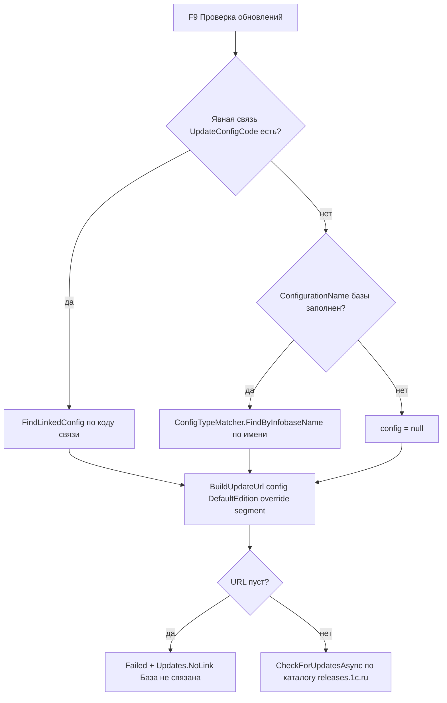

# PLAN 0.3.9.309 — Issue #346 «База не связана»: сопоставление базы с типовой по имени и редакции

- Дата: 2026-10-05. Режим: **архитектор** — только планирование; код НЕ изменяется.
- Текущая версия: **0.3.9.308** (релиз v0.3.9.308 создан 2026-10-05). Следующая микро-версия: **0.3.9.309**.
- Источник: открытый issue **#346** (7OH, создан 2026-10-05T08:27:03Z) — вопрос о механизме сопоставления базы с типовой конфигурацией при проверке обновлений (F9).
- Контекст: ранее обработаны #323/#330/#334 (CAS-вход, кластер A в [`PLAN-0.3.9.307-fixes.md`](PLAN-0.3.9.307-fixes.md)) и #340 (0.3.9.308); сопоставление по имени появилось в #322, поле `ConfigName` — в #321.
- Двуплатформенный проект: Windows/WPF (`#if WINDOWS`, `*.xaml.cs`) и Linux/Avalonia (`#if LINUX`, `*.Avalonia.cs`); сервисы и чистая логика — общие.

**В скоупе:** #346 — исправление автосопоставления по внутреннему имени конфигурации (`ConfigName`) + выбор редакции по версии базы в окне F9 + пояснение алгоритма пользователю в комментарии.
**Ограничения:** issues не закрывать; код только по плану; комментарий публикуется ПОСЛЕ выхода релиза с указанием «исправлено в версии 0.3.9.309»; работа только с локальной копией и GitHub API через `.gh_headers`.

---

## 1. Диагноз по коду

### 1.1 Где формируется сообщение «База не связана с типовой»

Точный текст — ключ локализации [`Updates.NoLink`](Configuration%20Management/Localization/Languages/ru.json:2602): «База не связана с типовой конфигурацией…». Возвращается методом [`EmptyUrlMessage()`](Configuration%20Management/Views/UpdateCheckWindow.xaml.cs:262), когда `BuildUpdateUrl` вернул пустой адрес каталога релизов.

Цепочка в [`RunCheckAsync`](Configuration%20Management/Views/UpdateCheckWindow.xaml.cs:62) (WPF) / [`RunCheckAsync`](Configuration%20Management/Views/UpdateCheckWindow.Avalonia.cs:105) (Avalonia):



### 1.2 Корень бага: автосопоставление игнорирует `ConfigName`

Данные пользователя из #346:

| Объект | Имя | Что хранит |
|---|---|---|
| База (свойства, вкладка «Платформа») | `ConfigurationName` | «ЗарплатаИУправлениеПерсоналом» — ВНУТРЕННЕЕ имя 1С из метаданных (Properties/Name корневого Configuration.xml), БЕЗ пробелов |
| База (свойства) | `ConfigurationVersion` | «3.1.38.92» |
| Типовая запись | `Name` | «Зарплата и управление персоналом» — отображаемое наименование, С пробелами |
| Типовая запись | `ConfigName` | «ЗарплатаИУправлениеПерсоналом» — внутреннее имя метаданных (issue #321) |
| Типовая запись | `Nick` / редакция | `HRM30` / Редакция «3.1» |

Поле `ConfigName` спроектировано именно для сопоставления ([`OneCConfigType.cs:21-28`](Configuration%20Management/Models/OneCConfigType.cs:21): «служит для сопоставления данных о конфигурации, её версии и строки таблицы (issue #321)») и используется для слияния списков имён баз и типовых ([`ConnectionSettingsViewModel.cs:381`](Configuration%20Management/ViewModels/ConnectionSettingsViewModel.cs:381)). Однако [`ConfigTypeMatcher.FindMatch`](Configuration%20Management/Services/ConfigTypeMatcher.cs:78) сравнивает ТОЛЬКО:

1. `Name` (ExactName) — «Зарплата и управление персоналом» ≠ «ЗарплатаИУправлениеПерсоналом» (разница в пробелах);
2. `EffectiveUrlCode` = UrlCode (ExactUrlCode) — тоже с пробелами, не совпадает;
3. вхождения по подстрокам (NameContainedInBaseName / BaseNameContainedInConfigName) — «…и управление персоналом» с пробелами не содержится в «ЗарплатаИУправлениеПерсоналом» без пробелов и наоборот.

**Вывод:** при `ConfigurationName = «ЗарплатаИУправлениеПерсоналом»` матчер возвращает `null`, `BuildUpdateUrl(null,…)` даёт пустую строку, пользователь видит «База не связана с типовой», хотя во встроенном наборе есть запись ЗУП с точно таким же `ConfigName`. **Это ошибка сопоставления: шаг по `ConfigName` отсутствует.**

Проверка воспроизводимости на встроенном наборе [`BuiltInConfigTypes.cs:48-60`](Configuration%20Management/Services/BuiltInConfigTypes.cs:48): `ConfigName = "ЗарплатаИУправлениеПерсоналом"` — совпадает с именем базы из issue.

### 1.3 Как выбирается редакция (вопрос «3.1 vs 3 и 1»)

- Модель [`OneCConfigEdition`](Configuration%20Management/Models/OneCConfigEdition.cs:12): поля `Name` (отображение), `Red` (сегмент «Ред», строка — допускает и «3.1», и «3»), `SubRed` (сегмент «Подред», может быть пустым), `UrlOverride`. Для ЗУП встроенной: `{ Name = "3.1", Red = "3.1" }`; для БП: `{ Name = "3.0", Red = "3", UrlOverride = "…/Accounting30" }`.
- Адрес каталога строится по НИКУ (`releases.1c.ru/project/<nick>`), а не по сегментному пути `Configs/<Конфигурация>/<Ред>/<Подред>/` ([`BuildUpdateUrl`](Configuration%20Management/Services/OneCUpdatesService.cs:198), [`BuildNickUrl`](Configuration%20Management/Services/OneCUpdatesService.cs:225)). Поэтому `Red/SubRed` на URL почти не влияют: используется либо `UrlOverride` редакции (БП 3.0 → Accounting30), либо `Nick` конфигурации.
- В окне F9 берётся `config.DefaultEdition` — ПЕРВАЯ редакция списка, версия базы не участвует ([`UpdateCheckWindow.xaml.cs:84`](Configuration%20Management/Views/UpdateCheckWindow.xaml.cs:84)). Для ЗУП (единственная редакция) это не мешает, но для конфигураций с несколькими редакциями (БП 2.0/3.0, УТ 10.3/11, КА 1.0/1.1/2.0) адрес может строиться по неверной редакции.
- Выбор редакции ПО ВЕРСИИ реализован только в окне «Связать с конфигурацией» — приватный [`TrySelectEditionByVersion`](Configuration%20Management/Views/ConfigUpdateLinkWindow.xaml.cs:293) (префиксное сравнение: «3.0.142.32» → редакция с Red «3.0»; работает и для Red «3.1»). В F9 эта логика НЕ используется — расхождение поведения двух окон.

**Ответ на вопрос пользователя о хранении редакции:** разделять «Редакция=3» и «ПодРедакция=1» не требуется. `Red` хранит строковый сегмент как есть («3.1» или «3.0»); сопоставление по версии выполняется префиксно и корректно работает с обоими форматами; `SubRed` нужен только для устаревших сегментных URL и для конфигураций, у которых на releases.1c.ru каталог делится по подредакциям (встроенные наборы так не устроены — у них `UrlOverride`).

### 1.4 Вывод о типе задачи

**#346 — комбинация (в):**
1. Часть — пояснение алгоритма (п. 1.3 + двухуровневое сопоставление: явная связь → автоопределение).
2. Часть — ОШИБКА сопоставления, требующая исправления кода: отсутствует шаг точного совпадения по `ConfigName`.
3. Часть — улучшение диагностики: невнятное «База не связана с типовой» должно называть конкретную причину (имя не сопоставлено / типовая найдена, но нет ника).

---

## 2. Изменения

### 2.1 [`ConfigTypeMatcher.cs`](Configuration%20Management/Services/ConfigTypeMatcher.cs) — общий сервис

1. **Новый признак `ConfigMatchKind.ExactConfigName`** («точное совпадение внутреннего имени конфигурации 1С с именем базы»).
2. **Шаг в [`FindMatch`](Configuration%20Management/Services/ConfigTypeMatcher.cs:78)** — после ExactName, ПЕРЕД ExactUrlCode:
   - `c.ConfigName` непустой и `string.Equals(c.ConfigName.Trim(), trimmed, OrdinalIgnoreCase)` → `ExactConfigName`.
   - Обоснование порядка: `Name` — отображаемое имя (видимое пользователю), `ConfigName` — системное имя метаданных (самый точный признак для имени базы, приходящего из 1С), `UrlCode` — deprecated (#321).
   - XML-док класса и перечисления обновить (новый порядок приоритетов: точное наименование → точное внутреннее имя → точный сегмент URL → вхождения по самому длинному имени).
3. **Новый публичный метод выбора редакции по версии** (вынос логики из окна связи, устраняет дублирование):
   ```csharp
   public static OneCConfigEdition? FindEditionByVersion(OneCConfigType config, string? version)
   ```
   - `version` триммируется; пустой `version` или пустой список редакций → `null`.
   - Префиксное сравнение с `ed.Red`: `ver.Equals(red)` или `ver.StartsWith(red + ".")` (OrdinalIgnoreCase) — как [`TrySelectEditionByVersion`](Configuration%20Management/Views/ConfigUpdateLinkWindow.xaml.cs:293).
   - Дополнительно учесть `ed.SubRed` для редких случаев «Ред одинаковый, подредакции разные»: если два кандидата совпали по `Red`, предпочесть того, чей `SubRed` входит в версию как следующий сегмент (например «142» в «3.1.142.32»). Минимальный объём: фильтрация по `Red`; если кандидат ровно один — он и результат.

### 2.2 Окна проверки обновлений (F9)

**[`UpdateCheckWindow.xaml.cs`](Configuration%20Management/Views/UpdateCheckWindow.xaml.cs) (WPF) и [`UpdateCheckWindow.Avalonia.cs`](Configuration%20Management/Views/UpdateCheckWindow.Avalonia.cs) (Avalonia) — правки симметричны:**

1. В [`RunCheckAsync`](Configuration%20Management/Views/UpdateCheckWindow.xaml.cs:84): заменить `config?.DefaultEdition` на:
   ```csharp
   ConfigTypeMatcher.FindEditionByVersion(config, _infobase.ConfigurationVersion) ?? config?.DefaultEdition
   ```
2. [`EmptyUrlMessage()`](Configuration%20Management/Views/UpdateCheckWindow.xaml.cs:262): добавить ветку диагностики — если `ConfigurationName` заполнен, а матчер вернул `null`, вернуть новый ключ `Updates.NoMatchFound` с именем конфигурации базы (вместо общего «База не связана»): «Типовая конфигурация по имени „{0}" не найдена. Проверьте имя в свойствах базы или свяжите вручную: правый клик по базе → „Связать с конфигурацией"». Существующие ветки (`NoNick`, `NoUrl`, `NoLink`) не трогаем.
3. Комментарий `// …база не связана с типовой (issue #323)` дополнить ссылкой на #346 (после фикса ветка `NoLink` остаётся только для пустого `ConfigurationName`).

### 2.3 Окна связи (устранение дублирования)

**[`ConfigUpdateLinkWindow.xaml.cs`](Configuration%20Management/Views/ConfigUpdateLinkWindow.xaml.cs) и `.Avalonia.cs`:**

- Приватный [`TrySelectEditionByVersion`](Configuration%20Management/Views/ConfigUpdateLinkWindow.xaml.cs:293) заменить телом на вызов `ConfigTypeMatcher.FindEditionByVersion(match, version)` + установку `EditionCombo.SelectedItem` (поведение не меняется; для Avalonia — аналог строки 331). Либо удалить приватный метод и в [`TryAutoMatchConfig`](Configuration%20Management/Views/ConfigUpdateLinkWindow.xaml.cs:274) вызывать общий напрямую.
- Результат `TryAutoMatchConfig` — пояснение причины: в switch признаков ([строки 278-284](Configuration%20Management/Views/ConfigUpdateLinkWindow.xaml.cs:278)) добавить ветку `ConfigMatchKind.ExactConfigName` → `Updates.ReasonConfigName`. То же в Avalonia-версии окна.

### 2.4 Локализация

[`ru.json`](Configuration%20Management/Localization/Languages/ru.json) / [`en.json`](Configuration%20Management/Localization/Languages/en.json) — новые ключи:

- `Updates.ReasonConfigName`: ru «внутреннему имени конфигурации» / en «internal configuration name».
- `Updates.NoMatchFound`: ru «Типовая конфигурация по имени „{0}" не найдена. Проверьте имя в свойствах базы или свяжите вручную: правый клик по базе → „Связать с конфигурацией"» / en аналогично.
- Существующий `Updates.NoLink` не меняется (по-прежнему актуален для баз без `ConfigurationName`).

---

## 3. Тесты

[`ConfigTypeMatcherTests.cs`](ConfigurationManagement.Tests/ConfigTypeMatcherTests.cs) — новые тесты:

1. **`ConfigNameMatch_ZupInternalName_MatchesZup`** — регресс-тест #346: список из `BuiltInConfigTypes.All`, имя базы «ЗарплатаИУправлениеПерсоналом» → `Code == "ZUP"`. Сейчас падает (доказательство бага), после фикса зелёный.
2. **`ConfigNameMatch_ReportsExactConfigNameReason`** — `FindMatch(configs, "ЗарплатаИУправлениеПерсоналом")` → `Kind == ExactConfigName`.
3. **`ConfigNameExact_Preferred_OverUrlSegmentOnlyEntry`** — две записи: типовая ЗУП с `ConfigName = "ЗарплатаИУправлениеПерсоналом"` и пользовательская «Моя ЗУП» с `UrlCode = "ЗарплатаИУправлениеПерсоналом"` и пустым `ConfigName`; имя базы «ЗарплатаИУправлениеПерсоналом» → выбирается типовая ЗУП по `ExactConfigName` (осознанное изменение приоритета, фиксируем тестом).
4. **`ExactName_StillPreferred_OverConfigNameOfOtherRecord`** — имя базы «Зарплата и управление персоналом» (с пробелами) → `ExactName` у типовой, даже если у другой записи `ConfigName` = «Зарплата и управление персоналом».
5. **`FindEditionByVersion_PrefixMatches`** — «3.1.38.92» → редакция 3.1; «3.0.142.32» → редакция 3.0 (БП, Red «3», UrlOverride Accounting30); «3.0.142.32» при Red «3.0» → также 3.0.
6. **`FindEditionByVersion_NoMatch_ReturnsNull`** — версия «8.3.24» при редакциях 3.0/2.0 → `null`; пустая версия → `null`; конфигурация без редакций → `null`.
7. **`FindEditionByVersion_SubRedDisambiguates`** — Red «3.1»/SubRed «1» и Red «3.1»/SubRed «142»; версия «3.1.142.32» → редакция с SubRed «142».

Прогон: существующий набор (~1462 теста) не должен сломаться — новые признак и метод аддитивны; критичные существующие тесты `ExactName_Preferred_OverCustomEntryWithSameUrlSegment` и `UrlSegmentMatch_Wins_WhenNoExactName` используют записи БЕЗ `ConfigName` и остаются зелёными (проверить вручную при реализации).

---

## 4. Версии и соответствие issues

| Версия | Issues | Содержание |
|--------|--------|-----------|
| **0.3.9.309** | **#346** | Сопоставление базы с типовой по внутреннему имени `ConfigName` (F9), выбор редакции по версии базы, понятная диагностика «типовая не найдена», пояснение алгоритма в комментарии |
| 0.3.9.308 | #340 (обработан ранее) | Не трогаем |

---

## 5. Процесс (порядок задач)

1. **Задача 1 — реализация (code):** п. 2.1–2.4 + тесты п. 3; полный прогон `dotnet test`; кросс-сборка Linux (`dotnet build -p:BuildLinux=true`) без ошибок. Правки только по этому плану.
2. **Задача 2 — версия и документация:** [`Configuration Management.csproj:62-65`](Configuration%20Management/Configuration%20Management.csproj:62) — все 4 поля (`Version`/`AssemblyVersion`/`FileVersion`/`InformationalVersion`) → `0.3.9.309`; [`CHANGELOG.md`](CHANGELOG.md) — секция `## [0.3.9.309] — 2026-10-05` над `0.3.9.308` (стиль прошлых записей: #346, автосопоставление по внутреннему имени, редакция по версии, диагностика); [`README.md`](README.md) — бейдж версии → `Версия-0.3.9.309`; черновик комментария [`publish/comment-346-0.3.9.309.md`](publish/comment-346-0.3.9.309.md).
3. **Задача 3 — сборка и релиз:**
   - Windows/WPF single-file: `powershell -NoProfile -ExecutionPolicy Bypass -File "Configuration Management\build-windows-single-file.ps1"` → `dist/win-x64/ConfigurationManagement.exe`.
   - Linux/Avalonia single-file: `powershell -NoProfile -ExecutionPolicy Bypass -File "Configuration Management\build-linux-single-file.ps1"` → `dist/linux-x64/ConfigurationManagement`.
   - .deb: `python publish/build_deb_win_0.3.9.308.py` (параметризовать версией, как в прецедентах) → `package/linux/deb/out/configuration-management_0.3.9.309_amd64.deb`; проверка по образцу `publish/check_deb_win_0.3.9.308.py`.
   - Проверки: PE/ELF-magic, `FileVersion/ProductVersion = 0.3.9.309`, smoke `--help` (код 0).
   - Артефакты в `publish/out-0.3.9.309/` + `SHA256SUMS.txt`; `publish/release_body_0.3.9.309.md`; push + GitHub release `v0.3.9.309` (через GitHub API с `.gh_headers`).
4. **Задача 4 — комментарий в #346 (ПОСЛЕ релиза, issue НЕ закрывать):** опубликовать `publish/comment-346-0.3.9.309.md` — пояснение алгоритма (явная связь → автоопределение; редакция по умолчанию и по версии; ответ про «3.1 vs 3/1» — разделять не нужно) + «Исправлено в версии **0.3.9.309**» + описание сценария проверки (F9 по базе ЗУП с заполненным `ConfigurationName`).

---

## 6. Сводка затрагиваемых файлов

Код:
- `Configuration Management/Services/ConfigTypeMatcher.cs` — `ExactConfigName`, шаг в `FindMatch`, `FindEditionByVersion`.
- `Configuration Management/Views/UpdateCheckWindow.xaml.cs`, `UpdateCheckWindow.Avalonia.cs` — выбор редакции по версии, диагностика `EmptyUrlMessage`.
- `Configuration Management/Views/ConfigUpdateLinkWindow.xaml.cs`, `ConfigUpdateLinkWindow.Avalonia.cs` — общий `FindEditionByVersion`, ветка `ReasonConfigName`.
- `Configuration Management/Localization/Languages/ru.json`, `en.json` — `Updates.ReasonConfigName`, `Updates.NoMatchFound`.

Тесты:
- `ConfigurationManagement.Tests/ConfigTypeMatcherTests.cs` — тесты п. 3 (7 новых).

Документация/релиз:
- `Configuration Management/Configuration Management.csproj` (0.3.9.309), `CHANGELOG.md`, `README.md`, `publish/comment-346-0.3.9.309.md`, `publish/release_body_0.3.9.309.md`, `publish/out-0.3.9.309/`, `publish/build_deb_win_0.3.9.309.py`, `publish/check_deb_win_0.3.9.309.py`.

---

## 7. Критерии приёмки

- Юнит-тест **1** (регресс #346) зелёный: `ConfigTypeMatcher.FindByInfobaseName(BuiltInConfigTypes.All, "ЗарплатаИУправлениеПерсоналом")` возвращает ZUP.
- Весь набор `dotnet test` зелёный; кросс-сборка Linux без ошибок.
- F9 по базе с `ConfigurationName = «ЗарплатаИУправлениеПерсоналом»` и версией «3.1.38.92» (без явной связи) строит `https://releases.1c.ru/project/HRM30` и показывает каталог, а не «База не связана с типовой».
- Для базы БП 3.0 с версией «3.0.142.32» адрес строится по `Accounting30` (не по первой редакции).
- При несовпадающем имени — понятный текст `Updates.NoMatchFound` с именем конфигурации базы.
- Релиз `v0.3.9.309` опубликован; в #346 комментарий «Исправлено в версии 0.3.9.309» + пояснение алгоритма; issue остаётся открытым.

---

## 8. Риски

- **Изменение приоритета автосопоставления:** запись с `ConfigName` теперь выигрывает у записи, найденной только по `UrlCode`. Это соответствует назначению `ConfigName` (issue #321) и фиксируется тестами 3 и 4; регресс маловероятен, но в комментарии к #346 пояснить пользователю.
- **Порядок записей в `LoadAll()`:** при нескольких записях с одинаковым `ConfigName` выбирается первая (как и сейчас для `Name`) — поведение не меняется.
- **Дублирование логики выбора редакции:** вынос в общий метод меняет только место кода; контракт и поведение окна «Связать с конфигурацией» сохраняются (проверить тестами 5–7 и существующими тестами окна).
- **`SubRed`-дизъюнкция** может дать ложный выбор при одинаковых `Red`: решение — префикс по `SubRed` как следующему сегменту версии; встроенный набор не имеет таких коллизий (у каждой редакции уникальный `UrlOverride`/`Red`).
- **Живая проверка** сценария #346 возможна только пользователем (7OH): в комментарии дать точные шаги. Юнит-тесты покрывают данные из issue.