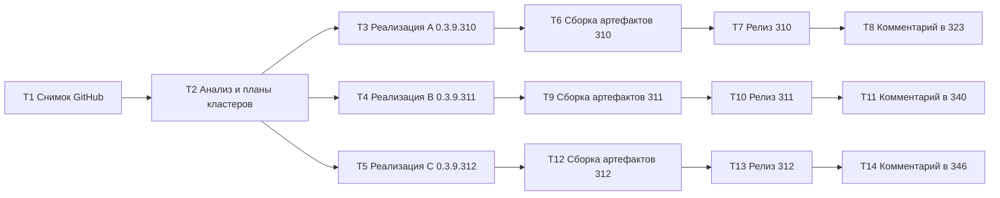

# PLAN 0.3.9.310–312 — Полный цикл работы с GitHub: issues #346/#340/#323 (активные), #334/#330 (связанные), сборка и релиз

- Дата: 2026-10-05 (обновлён в рамках T2). Режим: **архитектор** — только планирование; код НЕ изменяется.
- Текущая версия: **0.3.9.309** (релиз v0.3.9.309 опубликован 2026-10-05T12:49Z, все артефакты загружены).
- Следующие микро-версии: **0.3.9.310** (кластер A) → **0.3.9.311** (кластер B) → **0.3.9.312** (кластер C).
- Репозиторий: `https://github.com/sivatorov/ConfigurationManagement` (публичный, default-ветка `main`, 5 открытых issues).
- Локальная рабочая копия: `f:/Yandex.Disk/h/Configuration_Management`.
- Двухплатформенный проект: Windows/WPF (`#if WINDOWS`, `*.xaml.cs`) и Linux/Avalonia (`#if LINUX`, `*.Avalonia.cs`); сервисы и чистая логика — общие.
- Технические планы кластеров (задача T2): [`plans/PLAN-0.3.9.310.md`](PLAN-0.3.9.310.md), [`plans/PLAN-0.3.9.311.md`](PLAN-0.3.9.311.md), [`plans/PLAN-0.3.9.312.md`](PLAN-0.3.9.312.md).

---

## 1. Текущее состояние (снимок на 2026-10-05, после 06:15Z)

### 1.1 Версия и релизный процесс

- Версия задана в [`Configuration Management.csproj`](../Configuration%20Management/Configuration%20Management.csproj:62) — `Version`/`AssemblyVersion`/`FileVersion`/`InformationalVersion` = `0.3.9.309`.
- Релиз **v0.3.9.309** создан 2026-10-05T12:49Z с артефактами: `ConfigurationManagement.exe` (Windows, single-file), `ConfigurationManagement-linux-x64` (workflow `release.yml`), `configuration-management_0.3.9.309_amd64.deb`, `SHA256SUMS.txt`.
- Отображение версии: [`VersionInfo.Display()`](../Configuration%20Management/VersionInfo.cs:17).

### 1.2 Открытые issues и правило отбора кандидатов (АКТУАЛЬНЫЙ СНИМОК)

Правило пользователя: работаем только с теми issues, где **нет комментариев** ИЛИ **последний комментарий НЕ от автора sivatorov**.

| Issue | Тема | Комментариев | Последний автор | Статус-кандидат |
|---|---|---|---|---|
| #346 | «База не связана» + группа «Привязка» | 2 | **7OH** (2026-10-05T13:03:33Z) | ✅ **АКТИВЕН** — НОВЫЙ запрос: группа «Привязка» в свойствах базы (отображение/очистка/повторная привязка). Ответ «исправлено в 0.3.9.309» уже опубликован — НЕ дублировать |
| #340 | Снятие выделения после контекстного меню | 20 | **7OH** (2026-10-05T11:58:02Z) | ✅ **АКТИВЕН** — приложен первый реальный `trace.json` на 0.3.9.308 (startup + MenuOpened/MenuClosed; событий клика нет) — требуется следующий замер/расширенная трассировка |
| #323 | Окно Проверка обновлений (CAS-вход) | 20 | **7OH** (2026-10-05T11:56:24Z) | ✅ **АКТИВЕН** — новый лог 0.3.9.308: POST→200 «Личные данные» (страница после успешного входа) → ложный AuthFailed детектором формы; нужен фикс детектора |
| #334 | Автообновление платформы | 17 | **sivatorov** (2026-10-05T11:30:14Z) | ⛔ НЕ кандидат (последний от sivatorov, «Исправлено в 0.3.9.307»). **Связанный**: общий корень CAS с #323 — регрессия проверяется прогоном тестов, код НЕ меняется |
| #330 | Скачивание/установка платформы 1С | 18 | **sivatorov** (2026-10-05T11:30:12Z) | ⛔ НЕ кандидат (последний от sivatorov, «Исправлено в 0.3.9.307»). **Связанный**: то же — регрессия, без правок кода |

Важные изменения снимка относительно прежней версии сводного плана:
- В #334/#330 последний комментарий теперь **от sivatorov** (2026-10-05T11:30Z) — по правилу это НЕ кандидаты на новую правку; исключаются из активных кластеров, остаются связанными с #323 через общий сервис `OneCUpdatesService`.
- Активные кандидаты — **#346, #340, #323** (по одному на кластер).
- По #346: фикс сопоставления `ConfigName` (0.3.9.309) пользователь подтвердил («Отлично — теперь поиск нормально находит базу без привязки»), затем добавил **новое предложение** — группа «Привязка» на вкладке «Платформа» (отображение/очистка/повторная привязка). Это новая функциональность → кластер C.

### 1.3 Инструменты и переиспользуемые скрипты

- **GitHub API**: репозиторий публичный; аутентифицированные запросы через заголовки из `.gh_headers` (в `.codeassistantignore`). Образцы: [`publish/build_issue_full.ps1`](../publish/build_issue_full.ps1), `publish/_check_*.ps1`.
- **Файлы состояния issues**: `issues_state.json`, `issues_live_state.json`, `issues_details.json`, `issues_analysis.json`, `new_comments_after_1935.json`.
- **Сборка Windows**: [`build-windows-single-file.ps1`](../Configuration%20Management/build-windows-single-file.ps1) → `dist/win-x64/ConfigurationManagement.exe`.
- **Сборка Linux**: [`build-linux-single-file.ps1`](../Configuration%20Management/build-linux-single-file.ps1) (`-p:ForceLinux=true`) → `dist/linux-x64/ConfigurationManagement`.
- **.deb**: копия [`build_deb_win_0.3.9.309.py`](../publish/build_deb_win_0.3.9.309.py); **проверка .deb**: копия [`check_deb_win_0.3.9.309.py`](../publish/check_deb_win_0.3.9.309.py).
- **CI**: `.github/workflows/build.yml`, `.github/workflows/release.yml`.
- **Тесты**: полный прогон `dotnet test`; кросс-сборка Linux `dotnet build -p:BuildLinux=true`.

### 1.4 Правила пользователя (обязательны во всех задачах)

1. После каждого изменения — увеличить версию (csproj, 4 поля) и описать в CHANGELOG.md и README.md (при необходимости — ARCHITECTURE.md).
2. После исправления — комментарий в каждый issue: что исправлено и в какой версии.
3. **Issues самим НЕ закрывать.**
4. Комментарии публиковать **после** выхода релиза.
5. Ничего не коммитить без согласования; реализация — строго по плану.

---

## 2. Кластеры и политика версий

| Версия | Кластер | Issues | Содержание | План |
|---|---|---|---|---|
| **0.3.9.310** | A | #323 (корень; #334/#330 — только регрессия) | CAS вход portal.1c.ru: ложный AuthFailed на странице «Личные данные» после успешного POST (лог 0.3.9.308). Фикс детектора `LooksLikeLoginForm`/`DetectAuthFailureMarkers`, признак капчи (`Updates.CaptchaRequired`), диагностика title, запрос пользователю о проверке кредов в браузере | [`PLAN-0.3.9.310.md`](PLAN-0.3.9.310.md) |
| **0.3.9.311** | B | #340 | Выделение после закрытия контекстного меню: первый реальный `trace.json` (0.3.9.308) показывает только MenuOpened/MenuClosed — события клика не записаны. Расширение безусловной трассировки кликов + точная инструкция пользователю для повторного замера | [`PLAN-0.3.9.311.md`](PLAN-0.3.9.311.md) |
| **0.3.9.312** | C | #346 | Новая функциональность: группа «Привязка» на вкладке «Платформа» свойств базы (отображение текущей связи, кнопка очистки с подтверждением, повторная привязка через `ConfigUpdateLinkWindow`), WPF+Avalonia, ru/en, юнит-тесты | [`PLAN-0.3.9.312.md`](PLAN-0.3.9.312.md) |

Каждый кластер — отдельная микро-версия. Возможен выпуск нескольких микро-версий одним коммитом/релизом, если оркестратор сочтёт объём малым, но **комментарии в issues публикуются по каждому issue отдельно**.

---

## 3. Релизный процесс (переиспользуемый шаблон на версию)

Для каждой версии `<VER>`:

1. `dotnet test` — полный набор зелёный.
2. Windows: `.\build-windows-single-file.ps1` → `dist/win-x64/ConfigurationManagement.exe`.
3. Linux: `.\build-linux-single-file.ps1` → `dist/linux-x64/ConfigurationManagement`.
4. .deb: `publish/build_deb_win_<VER>.py` (копия 309) → `package/linux/deb/out/configuration-management_<VER>_amd64.deb`.
5. Проверки: magic (MZ / 7F-45-4C-46), FileVersion/ProductVersion = `<VER>`, smoke `--help` (код 0), `publish/check_deb_win_<VER>.py`.
6. Артефакты в `publish/out-<VER>/` + `SHA256SUMS.txt`; `publish/build_result_<VER>.md`; `publish/release_body_<VER>.md`.
7. git commit + push в `main`; тег `v<VER>`; GitHub Release (exe/deb/SHA256SUMS вручную, linux-x64 workflow-ом).
8. Черновики `publish/comment-<issue>-<VER>.md` → публикация POST через `.gh_headers`. **Issues не закрывать.**

---

## 4. Декомпозиция на задачи (каждая — ОТДЕЛЬНЫЙ инстанс)

### T1 — Синхронизация рабочей копии и свежий снимок GitHub
- **Mode**: code
- **Вход**: `.gh_headers`, файлы состояния, скрипты `publish/`
- **Действия**: `git status`/`git pull`; через GitHub API получить открытые issues и ВСЕ комментарии по #346/#340/#323/#334/#330; обновить JSON-файлы и `publish/issue_*_full.md`
- **Выход**: актуальные файлы состояния (последние авторы: #346/#340/#323 — 7OH; #334/#330 — sivatorov)
- **Критерий готовности**: по каждому issue известен полный список комментариев; рабочая копия на актуальном `main`

### T2 — Анализ кандидатов и технические планы кластеров A/B/C (ТЕКУЩАЯ ЗАДАЧА)
- **Mode**: architect
- **Вход**: результаты T1, кодовые файлы, прежние планы
- **Действия**: разбор последних комментариев 7OH; кластеризация; три технических плана
- **Выход**: [`plans/PLAN-0.3.9.310.md`](PLAN-0.3.9.310.md), [`plans/PLAN-0.3.9.311.md`](PLAN-0.3.9.311.md), [`plans/PLAN-0.3.9.312.md`](PLAN-0.3.9.312.md) + настоящий сводный план
- **Критерий готовности**: по каждому кластеру есть диагноз, перечень файлов/изменений, тест-план, риски, критерии приёмки

### T3 — Реализация кластера A: #323 CAS → версия 0.3.9.310
- **Mode**: code
- **Вход**: [`plans/PLAN-0.3.9.310.md`](PLAN-0.3.9.310.md)
- **Действия**: фикс `LooksLikeLoginForm`/`DetectAuthFailureMarkers` (страница «Личные данные» ≠ форма входа), признак капчи + ключ `Updates.CaptchaRequired`, диагностика title, запрос пользователю (комментарий); версия → `0.3.9.310`; CHANGELOG/README
- **Файлы**: `OneCUpdatesService.cs`, `ru.json`/`en.json`, `OneCUpdatesLoginFlowTests.cs`
- **Критерий готовности**: тесты зелёные (включая новые сценарии «POST 200 Личные данные → Success»), кросс-сборка Linux OK

### T4 — Реализация кластера B: #340 → версия 0.3.9.311
- **Mode**: code
- **Вход**: [`plans/PLAN-0.3.9.311.md`](PLAN-0.3.9.311.md)
- **Действия**: безусловная трассировка кликов по дереву (WPF+Avalonia), записи Deactivated/координат MenuClosed, старт-запись стабилизации; версия → `0.3.9.311`; CHANGELOG/README
- **Файлы**: `MainWindow.Events.cs`, `MainWindow.Avalonia.Events.cs`, `MainWindow.Hotkeys.cs`, `MainWindow.xaml.cs`, `MainWindow.Tree.cs`, `BatchSelectionHelper.cs`, `MenuCloseTraceFormat.cs` (опц.), тесты
- **Критерий готовности**: тесты зелёные, кросс-сборка OK; trace.json пишет события клика безусловно

### T5 — Реализация кластера C: #346 группа «Привязка» → версия 0.3.9.312
- **Mode**: code
- **Вход**: [`plans/PLAN-0.3.9.312.md`](PLAN-0.3.9.312.md)
- **Действия**: группа «Привязка» на вкладке «Платформа» (отображение/очистка/повторная привязка), перенос полей в `ConnectionSettingsViewModel.LoadFrom/ApplyTo`; версия → `0.3.9.312`; CHANGELOG/README
- **Файлы**: `ConnectionSettingsViewModel.cs`, `ConnectionSettingsWindow.xaml(.cs)` / `.Avalonia.cs`, локализация, тесты
- **Критерий готовности**: тесты зелёные, кросс-сборка OK

### T6/T7/T8 — цикл релиза 0.3.9.310 (кластер A)
- **Mode**: code (три инстанса)
- Сборка и проверка артефактов 0.3.9.310 (аналог п. 3) → Релиз v0.3.9.310 → Комментарий «Исправлено в версии 0.3.9.310» в **#323** (черновик `publish/comment-323-0.3.9.310.md`; чек-лист проверки кредов в браузере инкогнито)
- **Критерий готовности**: релиз со всеми assets; комментарий в #323 опубликован; #334/#330 НЕ комментировать; issues открыты

### T9/T10/T11 — цикл релиза 0.3.9.311 (кластер B)
- **Mode**: code (три инстанса)
- Сборка/проверка → Релиз v0.3.9.311 → Комментарий в **#340** (черновик `publish/comment-340-0.3.9.311.md`; точная инструкция воспроизведения сценария 10+ раз и приложить полный `trace.json`)
- **Критерий готовности**: релиз; комментарий опубликован; issue открыт

### T12/T13/T14 — цикл релиза 0.3.9.312 (кластер C)
- **Mode**: code (три инстанса)
- Сборка/проверка → Релиз v0.3.9.312 → Комментарий в **#346** (черновик `publish/comment-346-0.3.9.312.md`; ответ ТОЛЬКО на новое предложение, без дублирования ответа про 0.3.9.309)
- **Критерий готовности**: релиз; комментарий опубликован; issue открыт

---

## 5. Порядок выполнения и зависимости

Ключевые зависимости:
- T1 → T2 → T3/T4/T5 (анализ обязателен перед реализацией).
- Реализации T3/T4/T5 последовательны (одна ветка `main`); версии 310→311→312.
- Сборка → релиз → комментарий строго последовательны внутри одной версии.
- T8 зависит от релиза v0.3.9.310; T11 — от v0.3.9.311; T14 — от v0.3.9.312.
- Кластер A (T3) НЕ меняет окна/VM платформы — конфликтов файлов с T5 нет; T4 затрагивает `MainWindow.*` и `BatchSelectionHelper` — с T3/T5 файлы не пересекаются.

---

## 6. Риски и ограничения

| Риск | Влияние | Митигация |
|---|---|---|
| CAS (A): живой вход с реальными кредами ИТС автору недоступен | Критерий «каталог получен» — только пользователь | Юнит-тесты покрывают ветки; комментарий с чек-листом; запрос проверки кредов в браузере инкогнито (отличает креды от кода/капчи) |
| CAS (A): портал введёт капчу/2FA | Программный вход невозможен | Новый признак капчи `Updates.CaptchaRequired` + совет открыть браузер; лимит попыток защищает от брутфорса |
| #340 (B): данных trace недостаточно (клики не записаны) | Следующая итерация по гипотезам | Безусловная трассировка кликов (0.3.9.311) + точная инструкция пользователю; при получении полного trace — диагноз по фактам |
| #346 (C): рассинхрон VM ↔ Infobase (окно связи мутирует объект) | Устаревшее отображение | `RefreshLinkState()` после закрытия окна связи; единый источник — поля Infobase |
| #346 (C): правки общих моделей (`Infobase.UpdateConfigCode`) | Регресс F9/окна связи | Тесты `ConfigTypeMatcherTests`, `UpdateCheckCatalogTests`, ручная проверка пользователем |
| Дублирование комментария в #346 | Спам | В T14 отвечать только на новое предложение; ответ про 0.3.9.309 уже опубликован |
| Лимит GitHub API | Срыв T1 | `.gh_headers` (аутентификация); скрипты уже так работают |
| Секреты попадут в коммит | Утечка | `.gh_headers` в ignore; `build_deb_win_*.py` не коммитить |
| Workflow `release.yml` не завершился | Релиз без linux-x64 | Проверить статус Actions до публикации комментариев; перезапуск вручную |

---

## 7. Список задач для запуска (порядок)

1. **T1** — Синхронизация + снимок GitHub (code)
2. **T2** — Анализ кандидатов и планы кластеров (architect) — выполнено
3. **T3** — Реализация кластера A → 0.3.9.310 (code)
4. **T6** — Сборка/проверка артефактов 0.3.9.310 (code)
5. **T7** — Релиз v0.3.9.310 (code)
6. **T8** — Комментарий в #323 (code)
7. **T4** — Реализация кластера B → 0.3.9.311 (code)
8. **T9** — Сборка/проверка артефактов 0.3.9.311 (code)
9. **T10** — Релиз v0.3.9.311 (code)
10. **T11** — Комментарий в #340 (code)
11. **T5** — Реализация кластера C → 0.3.9.312 (code)
12. **T12** — Сборка/проверка артефактов 0.3.9.312 (code)
13. **T13** — Релиз v0.3.9.312 (code)
14. **T14** — Комментарий в #346 (code)

Итог цикла: три релиза (0.3.9.310/311/312), комментарии от sivatorov в #323/#340/#346 (после релизов), ни одно issue не закрыто; #334/#330 остаются открытыми без новых комментариев (последний от sivatorov — по правилу ожидание реакции пользователя).