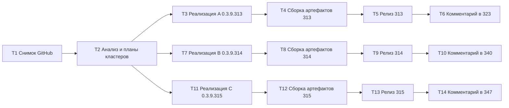

# PLAN 0.3.9.313–315 — Полный цикл: issues #323/#340/#347, сборка и релизы

- Дата: 2026-10-06. Режим: **архитектор** — только планирование; код НЕ изменяется.
- Текущая версия: **0.3.9.312** ([`Configuration Management.csproj`](../Configuration%20Management/Configuration%20Management.csproj:62), 4 поля).
- Следующие микро-версии: **0.3.9.313** (кластер A) → **0.3.9.314** (кластер B) → **0.3.9.315** (кластер C).
- Репозиторий: `https://github.com/sivatorov/ConfigurationManagement`, ветка `main`.
- Локальная копия: `f:/Yandex.Disk/h/Configuration_Management`.
- Двухплатформенный проект: Windows/WPF (`#if WINDOWS`) и Linux/Avalonia (`#if LINUX`); сервисы и чистая логика — общие.
- Технические планы кластеров: [`plans/PLAN-0.3.9.313.md`](PLAN-0.3.9.313.md), [`plans/PLAN-0.3.9.314.md`](PLAN-0.3.9.314.md), [`plans/PLAN-0.3.9.315.md`](PLAN-0.3.9.315.md).

---

## 1. Текущее состояние

### 1.1 Кандидаты по правилу «последний комментарий не от автора»

| Issue | Тема | Комментариев | Последний автор | Статус |
|---|---|---|---|---|
| #323 | Окно Проверка обновлений (CAS-вход) | 23 | **7OH** (2026-10-05T21:06:37Z, прислан рабочий код на 1С) | ✅ Кластер A |
| #340 | Снятие выделения после контекстного меню | 23 | **7OH** (2026-10-05T18:34:25Z, второй реальный trace.json на 0.3.9.311) | ✅ Кластер B |
| #347 | Сказ о trace.json (механизм флагов) | 0 | — (только описание) | ✅ Кластер C |
| #334/#330 | Автообновление/скачивание платформы | 17/18 | **sivatorov** | ⛔ Не кандидаты; связанные с #323 через общий сервис — регрессия, без правок |

### 1.2 Ключевые материалы анализа

- **#323**: лог на 0.3.9.310 (комм. 22): POST 200 `<title>Личные данные</title>` → ложный AuthFailed детектором формы (фраза отказа найдена на странице кабинета). Эталон — рабочий код 1С (комм. 23): POST на полный URL формы с `service=`, cookie `SERVERID` для releases.1c.ru, финальный GET `security_check?ticket=…`.
- **#340**: второй trace.json (комм. 23): MouseDown по строке приходит ДО MenuClosed (`snapshot=False`, `redelivery=False`), снимок не записан (guard по нажатой кнопке), стабилизация не запущена — контейнеры после закрытия меню перерабатываются виртуализацией, IsSelected теряется.
- **#347**: описание механизма флагов `trace.json` (CM_COLUMNS, CM_MENUCLICK, общий флаг редиректа); цель — отключить по умолчанию логи закрытых тикетов (колонки) и управлять диагностикой.

---

## 2. Кластеры и политика версий

| Версия | Кластер | Issue | Содержание | План |
|---|---|---|---|---|
| **0.3.9.313** | A | #323 (+ регрессия #334/#330) | CAS вход: порядок POST-ветки (кабинет раньше формы), сужение `LooksLikeLoginForm` (фразы отказа только с полями username/password), POST на полный URL формы с `service=` (эталон 1С), диагностика SERVERID | [`PLAN-0.3.9.313.md`](PLAN-0.3.9.313.md) |
| **0.3.9.314** | B | #340 | Выделение после закрытия меню: новый предикат «клик предшествовал закрытию меню» + запуск `EnsureSelectionStable(reason=clickBeforeMenuClose)` в `OnContextMenuClosed`/MenuClosed, WPF+Avalonia | [`PLAN-0.3.9.314.md`](PLAN-0.3.9.314.md) |
| **0.3.9.315** | C | #347 | Механизм отладочных флагов: `trace.json` становится JSON-конфигом (CM_COLUMNS/CM_MENUCLICK/CM_MENUCLOSE/CM_REDIRECT, все false), миграция JSONL-журнала, журнал меню → `trace_menuclose.jsonl` под флагом, колонки и CAS-диагностика под флагами | [`PLAN-0.3.9.315.md`](PLAN-0.3.9.315.md) |

Почему #347 последним: он меняет те же файлы трассировки, что и #340 (`MenuCloseTrace`, обработчики кликов), и выключает безусловную диагностику. Сначала добиваемся фикса #340 при безусловной трассировке (нужен очередной trace от пользователя), затем #347 переводит всю диагностику под флаги — это и есть просьба из описания («логи колонок капают — отключить»).

Каждый кластер — отдельная микро-версия и отдельный релиз; комментарии в issues публикуются по каждому issue после релиза. #334/#330 не комментировать.

---

## 3. Релизный процесс (шаблон на версию)

Для каждой версии `<VER>` (переиспользуемо из [`PLAN-0.3.9.310-312.md`](PLAN-0.3.9.310-312.md)):

1. `dotnet test` — полный набор зелёный.
2. Windows: `.\build-windows-single-file.ps1` → `dist/win-x64/ConfigurationManagement.exe`.
3. Linux: `.\build-linux-single-file.ps1` → `dist/linux-x64/ConfigurationManagement`.
4. .deb: `publish/build_deb_win_<VER>.py`; проверка: `publish/check_deb_win_<VER>.py`.
5. Проверки артефактов: magic (MZ / ELF), FileVersion = `<VER>`, smoke `--help`.
6. Артефакты `publish/out-<VER>/` + `SHA256SUMS.txt`; `publish/build_result_<VER>.md`.
7. git commit + push в `main`; тег `v<VER>`; GitHub Release (linux-x64 — workflow `release.yml`).
8. Черновик `publish/comment-<issue>-<VER>.md` → публикация POST. **Issues не закрывать.**

---

## 4. Декомпозиция на задачи (каждая — ОТДЕЛЬНЫЙ инстанс)

### T1 — Синхронизация и свежий снимок GitHub
- **Mode**: code. `git status`/`git pull`; через GitHub API получить открытые issues и комментарии по #323/#340/#347; обновить `publish/issues_current_cycle.md` и JSON-файлы.
- **Выход**: актуальные состояния; рабочия копия на `main`.

### T2 — Анализ и планы кластеров A/B/C (ТЕКУЩАЯ ЗАДАЧА)
- **Mode**: architect — выполнено: [`PLAN-0.3.9.313.md`](PLAN-0.3.9.313.md), [`PLAN-0.3.9.314.md`](PLAN-0.3.9.314.md), [`PLAN-0.3.9.315.md`](PLAN-0.3.9.315.md), настоящий сводный план.

### T3 — Реализация кластера A (#323) → версия 0.3.9.313
- **Mode**: code. Порядок POST-ветки, сужение детектора, `ResolveFormPostUrl` с service, SERVERID-диагностика; версия → 0.3.9.313; CHANGELOG/README; тесты по плану.
- **Критерий**: тесты зелёные (новые сценарии по логу 7OH), кросс-сборка OK.

### T4/T5/T6 — Цикл релиза 0.3.9.313
- Сборка/проверка артефактов → Релиз v0.3.9.313 → Комментарий в #323 (черновик `publish/comment-323-0.3.9.313.md`: фикс детекторов, POST с service, чек-лист проверки кредов в браузере инкогнито, просьба о полном логе F9).

### T7 — Реализация кластера B (#340) → версия 0.3.9.314
- **Mode**: code. Предикат `ShouldStabilizeForClickPrecedingMenuClose`, сохранение `_lastPlainTreeClick`, запуск стабилизации из `OnContextMenuClosed` (WPF) и MenuClosed (Avalonia); версия → 0.3.9.314; тесты по плану.
- **Критерий**: тесты зелёные, кросс-сборка OK.

### T8/T9/T10 — Цикл релиза 0.3.9.314
- Сборка/проверка → Релиз v0.3.9.314 → Комментарий в #340 (черновик `publish/comment-340-0.3.9.314.md`: инструкция 10+ повторов, ожидаемая цепочка `EnsureStableStart(reason=clickBeforeMenuClose)`, просьба о полном trace.json).

### T11 — Реализация кластера C (#347) → версия 0.3.9.315
- **Mode**: code. `TraceFlags`/`TraceFlagsFormat`, миграция JSONL→конфиг, гейт `MenuCloseTrace` по `CM_MENUCLOSE` (журнал → `trace_menuclose.jsonl`), `CM_COLUMNS` вместо env, `CM_REDIRECT` для INFO-диагностики входа; версия → 0.3.9.315; README; тесты по плану.
- **Критерий**: тесты зелёные (TraceFlagsTests), кросс-сборка OK.

### T12/T13/T14 — Цикл релиза 0.3.9.315
- Сборка/проверка → Релиз v0.3.9.315 → Комментарий в #347 (черновик `publish/comment-347-0.3.9.315.md`: формат конфига, список флагов, инструкция включения CM_MENUCLOSE/CM_REDIRECT/CM_COLUMNS, миграция старого журнала).

---

## 5. Порядок выполнения и зависимости

Зависимости: T1 → T2 → T3/T7/T11; версии 313→314→315 строго последовательны; внутри версии «сборка → релиз → комментарий». Файловых конфликтов между кластерами нет при данном порядке: A — `OneCUpdatesService` (+C затронет его INFO-диагностику уже стабильной); B — `MainWindow.*`/`BatchSelectionHelper`; C — `TraceFlags`/`MenuCloseTrace*`/`MainWindow.Columns` (после B трассировка меню уже на месте).

---

## 6. Риски и ограничения

| Риск | Влияние | Митигация |
|---|---|---|
| Живой CAS-вход автору недоступен (#323) | Критерий «каталог получен» — только пользователь | Тесты по фактическим логам; чек-лист инкогнито; повторный вход со свежей формой уже в сервисе |
| #340: оконный стек не покрывается юнит-тестами | Подтверждение — только пользователь | Точная инструкция + новая причина `clickBeforeMenuClose` в trace.json |
| #347: смена формата trace.json | Потеря привычного журнала | Миграция в `trace_menuclose_legacy.json`; подробный комментарий в #347 |
| Секреты в коммитах/логах | Утечка | `.gh_headers` в ignore; санитизация тела (`SanitizeBodyPreview`), без паролей/токенов |
| Лимит GitHub API / незавершённый workflow | Срыв релиза | Аутентифицированные запросы; проверка статуса Actions до комментариев |

---

## 7. Итог цикла

Три релиза (0.3.9.313/314/315), комментарии от sivatorov в #323/#340/#347 после релизов, ни одно issue не закрыто; #334/#330 остаются открытыми без новых комментариев (регрессия прогоном тестов). После цикла вся диагностика (колонки, меню, редиректы) — под флагами `trace.json`, по умолчанию выключена.