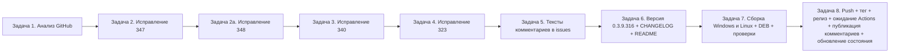

# PLAN 0.3.9.316 — Полный цикл обработки открытых issues (#347, #348, #340, #323)

- Режим: **architect** — план; код НЕ изменяется до одобрения.
- Текущая версия: **0.3.9.315** (релиз v0.3.9.315 ещё доводится: в терминале работает
  `publish/_t13_wait_actions.ps1`). Целевая версия цикла: **0.3.9.316** — одна микро-версия
  на все четыре исправления, релиз **v0.3.9.316**.
- Снимок GitHub: 2026-10-06T08:00Z, уточнён по свежему снимку 08:18Z
  (`publish/_fetch_current_cycle.ps1`). Открытые issues: #348, #347, #340, #334, #330, #324, #323.

---

## 0. Контекст и критерий отбора

| Issue | Комм. | Последний | Автор | Статус по критерию |
|---|---|---|---|---|
| #347 «Сказ о trace.json» | 4 (в т.ч. новый 07:59:42Z и 08:02:54Z) | «И да - строка CM_COLUMNS:false не привела к результату…», «Попрошу переместить файл настройки в папку профиля…» | @7OH | **Чинить** (последний не от владельца) |
| #340 «Снятие выделения после контекстного меню» | 25 (новый 07:55:46Z) | «Пока что выделение всё ещё пропадает» + лог 0.3.9.315 | @7OH | **Чинить** (последний не от владельца) |
| #323 «Окно Проверка обновлений» | 25 (новый 07:58:39Z) | Лог 0.3.9.313: вход 2× «успешный», повтор исходного запроса снова 302 | @7OH | **Чинить** (последний не от владельца) |
| #348 «Вставка адреса хранилища» | **0** (создан 08:16:40Z) | Описание: кнопка «Вставить» (вкладка «Хранилище» свойств базы) парсит `tcp://dev:555/base` → сервер `dev:555`, а должен оставаться `tcp://dev:555` (как в подсказке поля) | — | **Чинить** (нет комментариев — по описанию) |
| #334 «Автообновление платформы» | 17 | «Исправлено в версии 0.3.9.307» | sivatorov | Не трогаем (уже обработан) |
| #330 «Скачивание… платформы из стартера» | 18 | «Исправлено в версии 0.3.9.307» | sivatorov | Не трогаем (уже обработан) |
| #324 «Серверы 1С» | 18 (переоткрыт 08:05:04Z) | Переоткрыт событием `reopened` актором **sivatorov**, новых комментариев пользователя нет; последний комментарий — от владельца | sivatorov | Не трогаем (переоткрыл сам владелец; вне критерия) |

Критерий (ТЗ): исправлять issues БЕЗ комментариев ИЛИ с последним комментарием НЕ от
sivatorov. Под критерий попадают **#347, #340, #323, #348** (решение по #348 согласовано
с пользователем — включён в цикл 0.3.9.316). Issue сами НЕ закрываем.

Новые замечания пользователя:

- **#347** (три замечания к 0.3.9.315):
  1. `trace.json` писать не в одну строку, а с разделителями строк и отступами (pretty-print);
  2. при `"CM_COLUMNS": false` записи `CM_COLUMNS: total=…` всё равно появляются в общем логе —
     гейт не срабатывает (вероятная причина: env-override `CM_COLUMNS_TRACE=1`, оставшийся у
     пользователя с 0.3.9.305, перекрывает явный `false` в конфиге; проверить и стартовый дамп);
  3. конфиг `trace.json` перенести в каталог активного профиля «рядом с settings»
     (сейчас кладётся в корень `PlatformPaths.AppDataDirectory`, а `settings.json` — в
     `profiles/<Id>/`); журнал `trace_menuclose.jsonl` — в папку логов (`AppDataDirectory/logs`)
     с переименованием в `trace_menuclose.json` («буква l в конце лишняя»).
- **#340** (10-я итерация): новый лог 0.3.9.315 — `MouseDown`/`LastPlainClick` → `MenuOpened` →
  `MenuClosed` → `MenuClosedCursor(overTreeRow=True)`, клика «по другой строке» в логе НЕТ,
  `EnsureStableStart(reason=clickBeforeMenuClose)` НЕ запускается (клик был за ~1,8 с до закрытия —
  вне окна 500 мс), выделение пропадает. Нужен разбор и новый механизм стабилизации.
- **#323** (8-я итерация): лог 0.3.9.313 — POST 200 «Личные данные» (кабинет) 2 раза подряд,
  SESSION для `login.1c.ru` выпущена, а для `releases.1c.ru` сессия не устанавливается:
  повтор исходного запроса снова 302 → `retryAfterLoginStill302=true` → `AuthRequired`.
  Не отрабатывает звено CAS `security_check`/билета — сравнить с рабочим кодом из 1С (@7OH,
  комментарий 23 в #323: GET `releases.1c.ru/`, JSESSIONID из Set-Cookie, затем GET с Cookie).

---

## 1. Общая схема цикла

Все шаги выполняются **последовательно**, каждый — **в отдельной задаче** (сессия Code-режима
для исправлений, отдельные задачи для сборки и публикации). Релиз 0.3.9.316 начинается
ТОЛЬКО после завершения цикла релиза 0.3.9.315 (дождаться `_t13_wait_actions.ps1`).

---

## 2. Декомпозиция цикла на задачи

### Задача 1 — Анализ (GitHub, отбор, чтение)

Инструменты: `publish/_fetch_current_cycle.ps1` (свежий снимок → `_current_issues.json`,
`_current_comments.json`), `publish/_fetch_open_issues_and_comments.ps1`,
`publish/_check_last_comments.ps1`, `publish/build_issue_full.ps1` → `issue_340_full.md`,
`issue_323_full.md`, `issue_347_full.md`.

Шаги:
1. Получить все открытые issues + комментарии (авторизация из `.gh_headers`).
2. Отобрать по критерию: последний комментарий НЕ от `sivatorov` → #347, #340, #323;
   #348 — 0 комментариев (делать по описанию). #334/#330 — последний от владельца,
   #324 — переоткрыт самим владельцем без новых комментариев пользователя, в цикл НЕ включаем.
3. Прочитать описания и последние комментарии (в т.ч. свежие 07:55–08:17Z из API,
   включая описание #348).
4. Зафиксировать вывод анализа (новые замечания выше) в `publish/_summary_fresh.txt`.

### Задача 2 — Исправление #347 «Сказ о trace.json» (3 замечания)

Файлы кода: `Configuration Management/Services/TraceFlags.cs`,
`TraceFlagsFormat.cs`, `MenuCloseTrace.cs`, `MenuCloseTraceFormat.cs`,
`Views/MainWindow.Columns.cs`, точка входа `Program.cs`/`App` (обе платформы);
тесты: `ConfigurationManagement.Tests/TraceFlagsTests.cs`,
`MenuCloseTraceFormatTests.cs`.

Изменения:
1. **Pretty-print `trace.json`**: сериализация конфига с переносами строк и отступами
   (JSON `WriteIndented` или ручной форматтер в `TraceFlagsFormat.Serialize`); парсер остаётся
   устойчивым к обоим видам записи. Тест: сериализованный дефолт содержит переводы строк/отступы
   и корректно разбирается обратно.
2. **Гейт `CM_COLUMNS` жёсткий**: явное `false` в `trace.json` выключает диагностику колонок
   ВСЕГДА, даже если установлена env `CM_COLUMNS_TRACE=1`/`CM_COLUMNS=1` (env — только запасной
   способ включения, если флаг в конфиге отсутствует либо `true`). Проверить ВСЕ пути записи
   `CM_COLUMNS:` в `MainWindow.Columns.cs` (`LogColumnsDiagnostics`, стартовый дамп
   `allowStartupDump`) — под гейтом `ColumnsTraceEnabled` и без безусловных веток. Тесты:
   явный false в файле + env=1 → выключено; флаг true → включено; нет файла + env=1 → включено.
3. **Расположение файлов**:
   - конфиг `trace.json` — в каталог данных АКТИВНОГО ПРОФИЛЯ (рядом с `settings.json`,
     как `InfobaseRepository.DataDirectory`/`ProfileService`); в legacy-режиме без профиля —
     `PlatformPaths.AppDataDirectory`. Миграция: при первом старте перенести существующий
     `trace.json` из корня `AppDataDirectory` в каталог профиля (если там ещё нет).
   - журнал меню — в `PlatformPaths.LogDirectory` (`AppDataDirectory/logs`) с именем
     `trace_menuclose.json` (переименование; содержимое JSON Lines сохраняется). Legacy
     `menuclose_trace.json` продолжает дописываться, если существует. Обновить резолюцию пути
     в `MenuCloseTrace.ResolvePath`/`MenuCloseTraceFormat`.
   - Проверить вызовы `TraceFlags.EnsureExists()` в точках входа: каталог профиля доступен до
     загрузки настроек? Если нет — использовать корневой каталог до выбора профиля и мигрировать
     при загрузке настроек профиля.
4. README-раздел про `trace.json` будет обновлён в Задаче 6.

Критерий: `dotnet test` зелёный (обновлены `TraceFlagsTests`, `MenuCloseTraceFormatTests`);
кросс-сборка Linux без ошибок.

### Задача 2а — Исправление #348 «Вставка адреса хранилища»

Файлы: `ViewModels/ConnectionSettingsViewModel.cs` (метод разделения единого поля
подключения к хранилищу, issue #140 — убирает префикс схемы до `://`),
`Views/ConnectionSettingsWindow.xaml.cs` (кнопка «Вставить», ~строка 384),
`Models/RepositorySettings.cs` (`Server` — «tcp://server» или «tcp://server:1542»);
Avalonia-зеркало `ConnectionSettingsWindow.Avalonia.cs` (если есть); тесты:
`ConnectionSettingsViewModelTests.cs`.

Суть замечания: при вставке `tcp://dev:555/base` поле «Сервер» заполняется как
`dev:555`, а подсказка поля и модель (`RepositorySettings.Server`) предполагают адрес
**с протоколом** `tcp://dev:555`.

Что сделать:
1. В методе разбора сохранять схему (`tcp://`, `file://`, `http(s)://`) для поля сервера:
   сервер = `<схема>://<host[:port]>`, имя хранилища — без схемы (прежнее поведение).
2. Проверить согласованность с другими потребителями (`OneCLauncher.Arguments.Shared.cs`,
   `StartManagerImporter.cs`): путь `tcp://сервер:порт/имяХранилища` собирается из
   `Repository.Server + RepositoryName` — сохранение схемы в `Server` не должно ломать сборку
   (избежать двойного `tcp://`).
3. Тесты: разбор с `tcp://`/`file://`/без схемы → сервер со схемой; имя хранилища корректно;
   регресс существующих тестов разбора (issue #140).

Критерий: `dotnet test` зелёный; кросс-сборка Linux без ошибок.

### Задача 3 — Исправление #340 «Снятие выделения после контекстного меню» (10-я итерация)

Файлы: `Services/BatchSelectionHelper.cs`, `Views/MainWindow.Events.cs` (WPF),
`Views/MainWindow.Avalonia.Events.cs`, `Views/MainWindow.Hotkeys.cs` (WPF),
`Services/MenuCloseTrace.cs` (записи `MenuOpened/MenuClosed/MenuClosedCursor/LastPlainClick`);
тесты: `BatchSelectionHelperTests.cs`.

Гипотезы по новому логу (проверить в коде):
- клик, которым закрыто меню, в логе не зафиксирован (проглочен попапом) либо закрытие было
  кликом по строке ДО события `MouseDown` дерева; `ShouldStabilizeForClickPrecedingMenuClose`
  не срабатывает из-за окна 500 мс и/или отсутствия снимка клика;
- стартовая запись стабилизации `EnsureStableStart(clickBeforeMenuClose)` отсутствует — значит
  ни один штатный путь не запустил восстановление `IsSelected` после виртуализации.

Что сделать:
1. Разобрать лог (trace.json 0.3.9.315 от 07:55:46Z) в коде и воспроизвести цепочку событий.
2. Расширить стабилизацию: при `MenuClosed` + `MenuClosedCursor(overTreeRow=True)` +
   недавнем `MouseUp` (окно, например, 1–2 с) — запускать восстановление выделения строки
   под курсором (hit-test по координате), если снимок клика не записан; исключения:
   `overMenuItem=True`, закрытие ESC/программно, мультивыделение (Ctrl/Shift) не трогаем.
3. Сохранить прежние пути (`TryApplyTreeClickAfterMenuClosed`, `clickBeforeMenuClose`) —
   регресс; добавить новые записи трассировки под флагом `CM_MENUCLOSE` (имя файла после
   Задачи 2 — `trace_menuclose.json` в logs).
4. Тесты: новые сценарии предиката решения (закрытие с курсором над строкой и недавним
   MouseUp → true; overMenuItem → false; без недавнего клика → false), регресс существующих.

Критерий: полный набор `dotnet test` зелёный; поведение оконного стека — вручную
(пользователь подтверждает на 0.3.9.316).

### Задача 4 — Исправление #323 «Окно Проверка обновлений» (8-я итерация входа)

Файлы: `Services/OneCUpdatesService.cs` (CAS-вход: `TryLoginPortalAsync`, повтор исходного
запроса, `retryAfterLoginStill302`); тесты: `OneCUpdatesLoginFlowTests.cs`.

Гипотезы по логу 0.3.9.313 (07:58:39Z):
- после успешного POST (кабинет «Личные данные») для `releases.1c.ru` НЕ устанавливается
  валидная SESSION — повтор исходного запроса уходит в 302 на login;
- в рабочем коде 1С звено выглядит так: POST формы с `service=`, затем GET `releases.1c.ru/`
  (или `public/security_check`) с сохранением JSESSIONID/SESSION из Set-Cookie, затем исходный
  запрос с Cookie — у нас же только повтор исходного запроса.

Что сделать:
1. Сравнить текущий поток входа с рабочим кодом 1С (@7OH): обработка Set-Cookie
   `SESSION`/`JSESSIONID` для `releases.1c.ru`, следование за цепочкой `security_check`
   (meta-refresh/редирект после успешного POST), передача cookie в повтор исходного запроса.
2. Реализовать недостающее звено в общем сервисе (польза сразу для #334/#330/#323).
3. Диагностика под флагом `CM_REDIRECT` остаётся; итоговые WARN/ERROR — всегда.
4. Тесты: регресс ТОЧНОГО нового лога (POST 200 «Личные данные» → повтор → 302 → повторный
   вход со свежей формой → …) и новые сценарии звена `security_check`/cookie `releases.1c.ru`.

Критерий: `dotnet test` зелёный; живой вход — только на машине пользователя (кредов у автора нет).

### Задача 5 — Комментарии в issues

Подготовить тексты (шаблон — `publish/comment-<N>-<версия>.md`, образец
`publish/_post_comments_315.ps1`):
- `publish/comment-347-0.3.9.316.md` — что исправлено (pretty-print, приоритет false,
  перенос в профиль/logs, новое имя журнала) и в какой версии;
- `publish/comment-348-0.3.9.316.md` — вставка адреса хранилища: сервер сохраняется
  с протоколом (`tcp://…`), как указано в подсказке поля;
- `publish/comment-340-0.3.9.316.md` — 10-я итерация: что найдено по новому логу, что сделано;
- `publish/comment-323-0.3.9.316.md` — 8-я итерация: звено CAS security_check по образцу кода 1С.

Публикация — ПОСЛЕ релиза v0.3.9.316 (в Задаче 8), чтобы ссылки на релиз были валидными.
Issue НЕ закрываем. Скрипт: `publish/_post_comments_316.ps1` (копия 315 с новыми файлами).

### Задача 6 — Версия, CHANGELOG, README

1. `Configuration Management/Configuration Management.csproj`: `Version`,
   `AssemblyVersion`, `FileVersion`, `InformationalVersion` → **0.3.9.316** (4 поля).
2. `CHANGELOG.md`: новая секция `## [0.3.9.316] — 2026-10-06` сверху — исправления #347
   (3 замечания), #348 (сохранение протокола при вставке адреса хранилища),
   #340 (10-я итерация), #323 (8-я итерация), счётчики тестов.
3. `README.md`: раздел про `trace.json` — новое расположение (каталог профиля рядом с
   settings), журнал `trace_menuclose.json` в папке logs, семантика `CM_COLUMNS`
   (явный false выключает всегда; env — только запасной способ включения), pretty-print.
4. План кластера `plans/PLAN-0.3.9.313-315.md`/`PLAN-0.3.9.315.md` — не менять (история).

### Задача 7 — Сборка исполняемых файлов (Windows + Linux)

По образцу 0.3.9.315:
1. Полный прогон `dotnet test` (Windows).
2. Сборка Windows/WPF Release (`dotnet publish -c Release`) → `publish/out-0.3.9.316/`.
3. Кросс-сборка Linux/Avalonia: `dotnet build -p:BuildLinux=true` (или
   `-p:ForceLinux=true`) → `dist/linux-x64/ConfigurationManagement`.
4. DEB-пакет: новый `publish/build_deb_win_0.3.9.316.py` (копия `…315.py`, версия читается
   из csproj) → `configuration-management_0.3.9.316_amd64.deb`.
5. Проверка DEB: новый `publish/check_deb_win_0.3.9.316.py` (копия `…315.py`).
6. `SHA256SUMS.txt` (Windows exe + deb + linux-x64 бинарь).
7. Результат: `publish/build_result_0.3.9.316.md` (образец `build_result_0.3.9.315.md`).

### Задача 8 — Push, тег, релиз, ожидание Actions, публикация

По образцу цикла 0.3.9.315 (`publish/_t14_push_tag_0.3.9.315.ps1`,
`publish/_t14_release_0.3.9.315.ps1`, `publish/_wait_actions_315.ps1`,
`publish/_update_state_315.ps1`):
1. `git add` / `git commit` (все изменения, кроме игнорируемых) / `git push`.
2. Новые скрипты `publish/_t14_push_tag_0.3.9.316.ps1`, `publish/_t14_release_0.3.9.316.ps1`,
   `publish/_wait_actions_316.ps1` (копии 315 с заменой версии/тега).
3. Тег **v0.3.9.316** и release body из `publish/release_body_0.3.9.316.md`; загрузка
   ассетов: `ConfigurationManagement.exe`, `configuration-management_0.3.9.316_amd64.deb`,
   `SHA256SUMS.txt`, linux-x64 (из CI или fallback локального бинаря).
4. Ожидание GitHub Actions (`_wait_actions_316.ps1`), дождаться linux-ассета.
5. Публикация комментариев в #347/#340/#323: `publish/_post_comments_316.ps1` +
   `publish/_verify_comments_316.ps1`.
6. Обновление локального состояния: `publish/_update_state_316.ps1`
   (`issues_live_state.json`, `issues_state.json`, `issues_analysis.json`).
7. Issue остаются ОТКРЫТЫМИ (ждут подтверждения пользователя).

---

## 3. Затрагиваемые файлы (сводная таблица)

| Файл | Issue | Изменение |
|---|---|---|
| `Configuration Management/Services/TraceFlags.cs` | #347 | Каталог конфига → профиль; приоритет явного false над env; миграция файла |
| `Configuration Management/Services/TraceFlagsFormat.cs` | #347 | Pretty-print сериализации; резолюция пути конфига |
| `Configuration Management/Services/MenuCloseTrace.cs` | #347/#340 | Журнал → `LogDirectory/trace_menuclose.json`; новые записи стабилизации |
| `Configuration Management/Services/MenuCloseTraceFormat.cs` | #347 | Имя журнала, резолюция пути (logs) |
| `Configuration Management/Views/MainWindow.Columns.cs` | #347 | Жёсткий гейт `CM_COLUMNS` (все пути записи) |
| `Configuration Management/Views/MainWindow.Events.cs` | #340 | WPF: фиксация клика/стабилизация |
| `Configuration Management/Views/MainWindow.Avalonia.Events.cs` | #340 | Avalonia: симметрично |
| `Configuration Management/Views/MainWindow.Hotkeys.cs` | #340 | WPF: `OnContextMenuClosed` — новый fallback |
| `Configuration Management/Services/BatchSelectionHelper.cs` | #340 | Новый чистый предикат решения |
| `Configuration Management/Services/OneCUpdatesService.cs` | #323 | Звено CAS security_check/билет, cookie releases.1c.ru |
| `Configuration Management/ViewModels/ConnectionSettingsViewModel.cs` | #348 | Разбор адреса хранилища: сохранять схему `tcp://` в Server |
| `Configuration Management/Views/ConnectionSettingsWindow.xaml.cs`, `ConnectionSettingsWindow.Avalonia.cs` | #348 | Кнопка «Вставить» — сервер с протоколом |
| `Configuration Management/Models/RepositorySettings.cs` | #348 | Контракт поля Server («tcp://server») — проверить согласованность |
| `ConfigurationManagement.Tests/ConnectionSettingsViewModelTests.cs` | #348 | Новые сценарии разбора со схемой |
| `Program.cs` / точки входа (WPF+Avalonia) | #347 | Вызов `TraceFlags.EnsureExists()` после резолва профиля |
| `Configuration Management/Configuration Management.csproj` | цикл | Версия → 0.3.9.316 |
| `CHANGELOG.md`, `README.md` | цикл | Секция 0.3.9.316; раздел trace.json |
| `ConfigurationManagement.Tests/TraceFlagsTests.cs` | #347 | Pretty-print, приоритет false, миграция пути |
| `ConfigurationManagement.Tests/MenuCloseTraceFormatTests.cs` | #347 | Новое имя/каталог журнала |
| `ConfigurationManagement.Tests/BatchSelectionHelperTests.cs` | #340 | Новые сценарии предиката |
| `ConfigurationManagement.Tests/OneCUpdatesLoginFlowTests.cs` | #323 | Регресс нового лога, звено security_check |
| `publish/build_deb_win_0.3.9.316.py`, `check_deb_win_0.3.9.316.py` | цикл | Копии 315 → 316 |
| `publish/_t14_push_tag_0.3.9.316.ps1`, `_t14_release_0.3.9.316.ps1`, `_wait_actions_316.ps1`, `_post_comments_316.ps1`, `_verify_comments_316.ps1`, `_update_state_316.ps1` | цикл | Копии 315 → 316 |
| `publish/comment-347-0.3.9.316.md`, `comment-348-0.3.9.316.md`, `comment-340-0.3.9.316.md`, `comment-323-0.3.9.316.md` | цикл | Тексты комментариев |
| `publish/release_body_0.3.9.316.md`, `build_result_0.3.9.316.md` | цикл | Описание релиза/результата |

---

## 4. Риски

| Риск | Влияние | Митигация |
|---|---|---|
| Релиз 0.3.9.315 не завершён (Actions) | Конфликт тегов/push при параллельном цикле | Цикл 316 стартует только после `_t13_wait_actions.ps1` |
| Перенос `trace.json` в профиль ломает диагностику у пользователя (файл «пропал») | Потеря логов, непонимание | Миграция существующего файла при старте; подробный комментарий в #347; README |
| `CM_COLUMNS=false` не выключает из-за env-переменной пользователя | Жалоба повторяется | Явный false имеет приоритет над env; тесты на оба пути |
| 10-я итерация #340 не устранит пропажу выделения (стек WPF/Avalonia) | Ещё одна итерация | Точный разбор лога; fallback по hit-test курсора; трассировка остаётся под флагом |
| Вход #323: портал меняет поведение (CAPTCHA/JS) | 8-я итерация без результата | Диагностика `CM_REDIRECT`; сверка с рабочим кодом 1С; инструкция проверки входа в браузере инкогнито |
| Публикация комментариев до релиза → битые ссылки | Некорректные ссылки | Комментарии публикуются ПОСЛЕ релиза (Задача 8) |
| Один релиз на три исправления размывает проверку | Неясно, что починилось | Каждое исправление — отдельная секция CHANGELOG и отдельный комментарий |

---

## 5. Критерии приёмки

1. Снимок GitHub обновлён; по критерию отобраны #347, #340, #323, #348; #334/#330/#324
   не тронуты.
2. `trace.json` создаётся в каталоге профиля с переносами строк и отступами; старый файл из
   корня AppDataDirectory мигрирован; журнал пишется в `logs/trace_menuclose.json`.
3. При `"CM_COLUMNS": false` записей `CM_COLUMNS:` в общем логе НЕТ даже при установленной
   env `CM_COLUMNS_TRACE=1`; при `true` — пишутся.
4. #348: вставка `tcp://dev:555/base` заполняет поле «Сервер» значением `tcp://dev:555`
   (с протоколом), имя хранилища `base` — без схемы.
5. #340: новый лог 0.3.9.316 (после включения `CM_MENUCLOSE`) содержит запуск стабилизации;
   выделение после правый клик → левый клик по другой строке НЕ пропадает.
6. #323: лог входа 0.3.9.316 содержит звено `security_check`/cookie `releases.1c.ru` и
   каталог загружается без `retryAfterLoginStill302=true` (подтверждение пользователем).
7. `dotnet test` зелёный; кросс-сборка Linux без ошибок; собраны exe + deb + SHA256SUMS.
8. Тег `v0.3.9.316`, релиз с 4 ассетами, Actions завершены, комментарии в #347/#348/#340/#323
   опубликованы, `issues_*state*.json` обновлены; issues остаются открытыми.