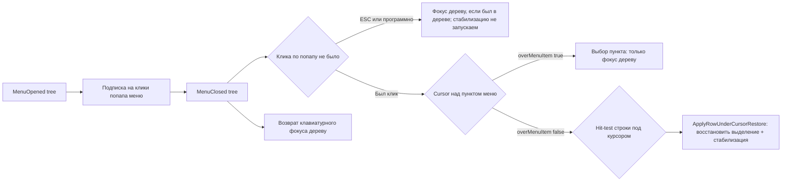

# PLAN 0.3.9.317 — Issue #340 «Снятие выделения после контекстного меню» (11-я итерация)

- Режим: **architect** — план; код НЕ изменяется до одобрения.
- Текущая версия: **0.3.9.316** (в `Configuration Management/Configuration Management.csproj`
  поля `Version`/`AssemblyVersion`/`FileVersion`/`InformationalVersion` = 0.3.9.316).
  Целевая версия цикла: **0.3.9.317**, релиз **v0.3.9.317**.
- В цикле — ОДНО исправление (#340). Issues #324/#323 планируются отдельными циклами
  (0.3.9.318 / 0.3.9.319), коды не смешиваются.

---

## 0. Контекст: последние комментарии пользователя (7OH, 2026-10-06)

- **27/28 (12:11:02Z)**: «Всё ещё пропадает» + лог 0.3.9.315→0.3.9.316:
  `MouseDown (pinned=True)` → `LastPlainClick` → `MouseUp` → `LastPlainClick (MouseUp)` →
  `MenuOpened` → `MenuClosed` → `MenuClosedCursor(x=121,6; y=132,2; overTreeRow=True;
  overMenuItem=False; keyboardFocusWithin=True)`.
  ВАЖНО: записи `MenuClosedOverRow: ran=true` в логе НЕТ — fallback `ApplyRowUnderCursorRestore`
  не сработал, т.к. последний обычный клик был ~2,9 с до закрытия меню — окно
  `MenuCloseRecentMouseActivityWindowMs` (2000 мс) превышено. Записи `TryApply: snapshot=…` тоже
  нет — снимок клика не записан (левая кнопка к моменту `MenuClosed` отпущена, либо клик
  проглочен попапом целиком).
- **28/28 (12:16:41Z)**: «после пропажи текущей строки пропадает и реакция на попытку
  перемещения по списку курсором. Если нажать TAB — фокус получает кнопка Минимизации окна» —
  это признак ПОТЕРИ КЛАВИАТУРНОГО ФОКУСА деревом/списком после закрытия меню.

### Вывод по корню проблемы

1. **Восстановление выделения привязано к «недавнему клику» (окна 500/2000 мс)**. Все четыре
   реальных лога (0.3.9.311/313/315/316) показывают один и тот же класс сценария: клик, которым
   пользователь закрыл меню, попап «проглатывает» полностью (ни `MouseDown`, ни `MouseUp` в дерево
   не приходят), поэтому ЕДИНСТВЕННОЕ доступное свидетельство «пользователь кликнул во время
   открытого меню» — это более старый клик, который легко выходит за любое фиксированное окно.
   Любая эвристика «клик был N мс назад» принципиально ненадёжна.
2. **Надёжный сигнал «меню закрыто кликом» — сам попап меню**: любой левый клик, пока меню
   открыто, попадает в попап (`ContextMenu` WPF / `ContextMenu` Avalonia) ДО того, как будет
   проглочен/доставлен дальше. Подписка на `PreviewMouseLeftButtonDown` самого меню даёт метку
   «клик во время открытого меню» БЕЗ привязки к давности — это снимает зависимость от окна 2000 мс.
3. **ESC/программное закрытие не производят клика по попапу** — исключаются естественно.
   **Выбор пункта меню** — это тоже клик по попапу, но в момент `MenuClosed` курсор находится
   НАД пунктом меню (`overMenuItem=True`, уже измеряется) — исключается существующим hit-test.
4. **Фокус**: после закрытия попапа WPF/Avalonia возвращают фокус окну, но НЕ дереву — стрелки
   не работают, TAB уходит на элементы окна (кнопка сворачивания). Фокус нужно возвращать дереву
   явно, если до открытия меню он был в дереве.

---

## 1. Схема решения (11-я итерация)



Новое звено — **«клик во время открытого меню»** (`clickDuringMenuOpen`): запись метки
`Environment.TickCount` (+ позиция) в обработчике `PreviewMouseLeftButtonDown` самого меню
(WPF) / `PointerPressed` (Avalonia), подписка — при открытии меню дерева, отписка — при закрытии.
Предикат решения восстанавливает выбор строки под курсором при:
`overTreeRow && !overMenuItem && !snapshotPresent && clickDuringMenuOpen` — независимо от давности
клика. Отдельно — возврат клавиатурного фокуса дереву при закрытии меню дерева.

---

## 2. Задача 1 — Чистая логика в `BatchSelectionHelper.cs`

Файл: `Configuration Management/Services/BatchSelectionHelper.cs` (без платформенных зависимостей).

1. **Новый предикат** `ShouldRestoreSelectionAfterMenuClose`:
   ```csharp
   public static bool ShouldRestoreSelectionAfterMenuClose(
       bool overTreeRow, bool overMenuItem, bool snapshotPresent, bool clickDuringMenuOpen)
   ```
   - `!overTreeRow || overMenuItem` → false (курсор вне строки / над пунктом меню);
   - `snapshotPresent` → false (работают штатные пути A/C/snapshot);
   - `!clickDuringMenuOpen` → false (закрытие ESC/программное/потеря фокуса окна);
   - иначе → true.
   Старый предикат `ShouldRestoreSelectionForRowUnderCursor` **сохраняется** (регресс тестов
   0.3.9.316), но на нём вызываемые ветки переводятся на новый. Метка
   `MenuCloseRecentMouseActivityWindowMs` остаётся для старого предиката и документации.

2. **Новый предикат фокуса** `ShouldReturnKeyboardFocusToTree`:
   ```csharp
   public static bool ShouldReturnKeyboardFocusToTree(
       bool isTreeMenuClosed, bool focusWasInTreeBeforeMenuOpen,
       bool focusStillWithinWindow, bool modalDialogOpen)
   ```
   - `!isTreeMenuClosed || modalDialogOpen` → false;
   - `focusWasInTreeBeforeMenuOpen && focusStillWithinWindow` → true;
   - `!focusWasInTreeBeforeMenuOpen && focusStillWithinWindow` → true только если
     `clickDuringMenuOpen` и над строкой (пользователь явно работал с деревом) — иначе false
     (не отбираем фокус у других элементов, если меню открыто с другого контрола).
   Параметр `modalDialogOpen` передаётся из `HasOpenModalDialog()` (есть в WPF и Avalonia).

3. **Трассировка**: `BuildMenuCloseDecisionLine(...)` — единая строка решения для лога
   (`MenuCloseDecision: restore=true/false, reason=..., clickDuringOpen=..., overTreeRow=...,
   overMenuItem=..., focusRestore=true/false`). Используется обеими платформами.

4. **Тесты** — `ConfigurationManagement.Tests/BatchSelectionHelperTests.cs` (см. Задачу 5).

## 3. Задача 2 — WPF (`MainWindow.Hotkeys.cs`, `MainWindow.Tree.cs`, `MainWindow.Events.cs`)

Файлы: `Configuration Management/Views/MainWindow.Hotkeys.cs`,
`Configuration Management/Views/MainWindow.Tree.cs` (WPF-сторона `EnsureSelectionStable` —
менять НЕ нужно), `Configuration Management/Views/MainWindow.Events.cs` (правка — только если
понадобится сброс нового поля при клике).

1. **Новые поля** (рядом с `_lastMenuCloseTick`):
   - `private long _treeMenuOpenedTick;` — метка открытия меню ДЕРЕВА (WPF сейчас не хранит; в
     Avalonia уже есть `_treeMenuOpenedTick`);
   - `private long _treeMenuOpenClickTick;` — метка последнего левого клика по попапу меню дерева
     (0 — не было; «клик во время открытого меню»);
   - `private bool _keyboardFocusWasInTreeBeforeMenuOpen;` — фокус до открытия меню.

2. **`OnContextMenuOpened`** (уже существует, строка ~733):
   - для меню ДЕРЕВА (`ReferenceEquals(menu, MainTree?.ContextMenu)`):
     - `_treeMenuOpenedTick = Environment.TickCount;`
     - `_treeMenuOpenClickTick = 0;`
     - `_keyboardFocusWasInTreeBeforeMenuOpen = IsFocusInsideMainTree();` (метод уже есть, ~1150);
     - подписка `menu.PreviewMouseLeftButtonDown += OnTreeMenuPopupMouseLeftButtonDown;`.
   - Для остальных меню — без изменений.

3. **Новый обработчик попапа** `OnTreeMenuPopupMouseLeftButtonDown(object sender, MouseButtonEventArgs e)`:
   - записывает `_treeMenuOpenClickTick = Environment.TickCount;`
   - трассировка `MenuClickDuringOpen: tick=…, x=…, y=…, source=popup` (только для меню дерева).

4. **`OnContextMenuClosed`** (строка ~745):
   - перед обработкой: отписка `menu.PreviewMouseLeftButtonDown -= …`;
   - после существующих веток `TryApplyTreeClickAfterMenuClosed` / `clickBeforeMenuClose` /
     `menuClosedOverRow(2000 мс)` добавить НОВУЮ ветку (приоритет — ПОСЛЕ старых, чтобы не
     ломать их регресс):
     ```csharp
     else if (cursorInfobase is not null &&
              BatchSelectionHelper.ShouldRestoreSelectionAfterMenuClose(
                  overTreeRow: overTreeRow,
                  overMenuItem: overMenuItem,
                  snapshotPresent: _menuCloseClickSnapshot is not null,
                  clickDuringMenuOpen: _treeMenuOpenClickTick > _treeMenuOpenedTick))
     {
         var restoreTarget = cursorInfobase;
         var restorePinned = cursorPinnedSection;
         var evidenceTick = _treeMenuOpenClickTick;
         Dispatcher.BeginInvoke(System.Windows.Threading.DispatcherPriority.Input,
             new Action(() => ApplyRowUnderCursorRestore(restoreTarget, restorePinned, evidenceTick)));
     }
     ```
   - возврат фокуса (ВСЕГДА для меню дерева, по предикату):
     ```csharp
     if (isTreeMenu && BatchSelectionHelper.ShouldReturnKeyboardFocusToTree(
             isTreeMenuClosed: true,
             focusWasInTreeBeforeMenuOpen: _keyboardFocusWasInTreeBeforeMenuOpen,
             focusStillWithinWindow: IsKeyboardFocusWithin,
             modalDialogOpen: HasOpenModalDialog()))
     {
         Dispatcher.BeginInvoke(System.Windows.Threading.DispatcherPriority.Input,
             new Action(RestoreTreeKeyboardFocus));
     }
     ```

5. **`RestoreTreeKeyboardFocus()`** (новый метод, WPF):
   - цель — контейнер текущего выбора: `FindRegularTreeViewItemForData(SelectedInfobase)` /
     `FindPinnedTreeViewItemForData(...)` (методы уже есть) либо `MainTree.SelectedItem`-контейнер;
   - `container.Focus(); Keyboard.Focus(container);` — fallback `MainTree.Focus(); Keyboard.Focus(MainTree);`;
   - трассировка `MenuFocusRestore: restored=true/false, target=…, focusedElement=…`.

6. **`MainWindow.Events.cs`**: при обычном клике по строке снять потенциальную «догоняющую»
   стабилизацию/восстановление? Не требуется — `ApplyRowUnderCursorRestore` уже идемпотентен
   (`userReselected` guard). Правок в этом файле не планируется, кроме опциональной записи
   `_treeMenuOpenClickTick = 0` в `OnInfobaseTree_PreviewMouseLeftButtonDown` (не обязательно).

## 4. Задача 3 — Avalonia (`MainWindow.Avalonia.Events.cs`)

Файл: `Configuration Management/Views/MainWindow.Avalonia.Events.cs`.

1. **Новые поля** рядом с `_treeMenuOpenedTick` (строка ~207):
   - `_treeMenuOpenClickTick` (метка клика по попапу меню дерева);
   - `_keyboardFocusWasInTreeBeforeMenuOpen`.

2. **`OnTreeContextMenuIsOpenChanged`** (строка ~244):
   - при `isOpen && isTreeMenu`: `_treeMenuOpenClickTick = 0;`
     `_keyboardFocusWasInTreeBeforeMenuOpen = _tree?.IsKeyboardFocusWithin == true;`
     подписка `menu.PointerPressed += OnTreeMenuPopupPointerPressed;`;
   - при `!isOpen && isTreeMenu`: отписка; НОВАЯ ветка восстановления (после существующей
     `menuClosedOverRow(2000 мс)`):
     ```csharp
     else if (cursorInfobase is not null &&
              BatchSelectionHelper.ShouldRestoreSelectionAfterMenuClose(
                  overTreeRow: overTreeRow,
                  overMenuItem: overMenuItemApprox,
                  snapshotPresent: _menuCloseClickSnapshot is not null,
                  clickDuringMenuOpen: _treeMenuOpenClickTick > _treeMenuOpenedTick))
     {
         Avalonia.Threading.Dispatcher.UIThread.Post(() =>
             ApplyRowUnderCursorRestore(cursorInfobase, cursorPinnedSection, _treeMenuOpenClickTick));
     }
     ```
   - возврат фокуса: `Avalonia.Threading.Dispatcher.UIThread.Post(RestoreTreeKeyboardFocus);`
     с тем же предикатом `ShouldReturnKeyboardFocusToTree` (`IsKeyboardFocusWithin` у окна).

3. **`OnTreeMenuPopupPointerPressed`**: запись `_treeMenuOpenClickTick` +
   трассировка `MenuClickDuringOpen`.

4. **`RestoreTreeKeyboardFocus()`** (Avalonia): `_tree.Focus()` либо
   `_tree.FindRowForData(SelectedInfobase, pinned)?.Focus()`; трассировка
   `MenuFocusRestore: restored=…`.

## 5. Задача 4 — Трассировка (формат новых записей)

Файлы: `Configuration Management/Services/MenuCloseTrace.cs`,
`Configuration Management/Services/MenuCloseTraceFormat.cs` (если там валидируется формат записей).

Новые записи под флагом `CM_MENUCLOSE` (журнал `logs/trace_menuclose.json`):
- `MenuClickDuringOpen: tick=…, x=…, y=…, source=popup` — левый клик по попапу меню дерева;
- `MenuCloseDecision: restore=true|false, reason=rowUnderCursor|esc|menuItem|snapshot|noClick,
  clickDuringOpen=true|false, overTreeRow=…, overMenuItem=…` — итоговое решение восстановления;
- `MenuFocusRestore: restored=true|false, focusTarget=…, focusedElement=…` — возврат фокуса дереву.

Обновить `MenuCloseTraceFormatTests`/тест формата, если там проверяются имена записей.

## 6. Задача 5 — Новые юнит-тесты

`ConfigurationManagement.Tests/BatchSelectionHelperTests.cs`:
1. `ShouldRestoreSelectionAfterMenuClose`: над строкой + клик по попапу → true (ВНЕ зависимости от
   давности: передать `clickDuringMenuOpen=true` без меток времени);
2. над пунктом меню (`overMenuItem=true`) → false;
3. клика по попапу не было (ESC/программно, `clickDuringMenuOpen=false`) → false;
4. снимок клика присутствует → false (штатные пути);
5. курсор вне строки (`overTreeRow=false`) → false;
6. регресс: старый `ShouldRestoreSelectionForRowUnderCursor` продолжает работать (окна 2000 мс).

`ShouldReturnKeyboardFocusToTree`:
7. меню дерева + фокус был в дереве + фокус в окне → true;
8. меню дерева + фокус НЕ был в дереве + фокус в окне → false (не отбираем фокус);
9. открыто модальное окно → false;
10. фокус ушёл из окна → false.

`MenuCloseTraceFormatTests` (если формат валидируется): новые записи соответствуют контракту.

Критерий: `dotnet test` зелёный; кросс-сборка Linux без ошибок.

## 7. Задача 6 — Версия, CHANGELOG, README

1. `Configuration Management/Configuration Management.csproj`: 4 поля
   `Version`/`AssemblyVersion`/`FileVersion`/`InformationalVersion` → **0.3.9.317**.
2. `CHANGELOG.md`: секция `## [0.3.9.317] — 2026-10-06` сверху — «Снятие выделения после
   контекстного меню, 11-я итерация»: новый сигнал «клик по попапу меню» (независимость от
   давности клика), возврат клавиатурного фокуса дереву (стрелки/TAB), новые записи трассировки,
   счётчики тестов.
3. `README.md`: раздел про `trace.json`/журнал меню — упомянуть новые записи
   `MenuClickDuringOpen`/`MenuCloseDecision`/`MenuFocusRestore` (раздел диагностики, если он есть).
4. Планы истории (`PLAN-0.3.9.314.md`, `PLAN-0.3.9.315.md`, `PLAN-0.3.9.316.md`) не менять.

## 8. Задача 7 — Комментарий в issue #340

Файл `publish/comment-340-0.3.9.317.md` (публикация ПОСЛЕ релиза скриптом
`publish/_post_comments_317.ps1` — копия `_post_comments_316.ps1` с новыми файлами; issue
НЕ закрываем). Структура по шаблону:

```
Исправлено в версии 0.3.9.317 (Windows/WPF и Linux/Avalonia).

Что было
- По логу 0.3.9.316 (12:11:02Z): клик, которым закрыто меню, попап «проглатывает»
  полностью — ни один штатный путь восстановления не запускается, потому что все они
  требуют «недавний клик» (окна 500/2000 мс), а последний зафиксированный клик был ~2,9 с
  назад. Запись MenuClosedOverRow: ran=true отсутствует.
- После пропажи выделения дерево теряет клавиатурный фокус: стрелки не работают, TAB
  уводит на кнопку сворачивания (12:16:41Z).

Что сделано
- Новый сигнал «клик во время открытого меню»: обработчик левого клика на самом попапе
  меню дерева (PreviewMouseLeftButtonDown/PointerPressed) фиксирует факт клика БЕЗ привязки
  к давности; ESC и программное закрытие попап-клик не производят.
- При MenuClosed: overTreeRow && !overMenuItem && клик по попапу был → восстановление
  выделения строки ПОД КУРСОРОМ (hit-test) + стабилизация EnsureSelectionStable
  (reason=menuClosedOverRow). Выбор пункта меню и ESC по-прежнему не трогают выделение.
- Возврат клавиатурного фокуса дереву после закрытия меню (если до открытия фокус был в
  дереве и окно активно): стрелки снова двигают выделение, TAB уходит в список.
- Новые записи trace: MenuClickDuringOpen / MenuCloseDecision / MenuFocusRestore.

Как проверить
- Включить CM_MENUCLOSE в trace.json, повторить сценарий: правый клик по строке → меню →
  левый клик по другой строке. Выделение НЕ пропадает; в логе есть
  MenuCloseDecision: restore=true. Стрелки ↑/↓ работают сразу после закрытия меню, TAB —
  в список.

Тесты
- BatchSelectionHelperTests (+N), MenuCloseTraceFormatTests; dotnet test зелёный;
  кросс-сборка Linux без ошибок.
```

## 9. Задача 8 — Сборка и публикация

1. Полный `dotnet test` (Windows) — зелёный.
2. `dotnet publish -c Release` → `publish/out-0.3.9.317/`.
3. Кросс-сборка: `dotnet build -p:BuildLinux=true` — без ошибок.
4. DEB: `publish/build_deb_win_0.3.9.317.py` (копия 316); проверка `check_deb_win_0.3.9.317.py`.
5. Тег `v0.3.9.317`, релиз с ассетами; ожидание Actions; `publish/_post_comments_317.ps1`;
   `publish/_update_state_317.ps1`. Issue #340 остаётся ОТКРЫТЫМ.

---

## 10. Затрагиваемые файлы (сводка)

| Файл | Изменение |
|---|---|
| `Configuration Management/Services/BatchSelectionHelper.cs` | Предикаты `ShouldRestoreSelectionAfterMenuClose`, `ShouldReturnKeyboardFocusToTree`, `BuildMenuCloseDecisionLine` |
| `Configuration Management/Views/MainWindow.Hotkeys.cs` | WPF: поля `_treeMenuOpenedTick`/`_treeMenuOpenClickTick`/`_keyboardFocusWasInTreeBeforeMenuOpen`, подписка на клик попапа, новая ветка восстановления, `RestoreTreeKeyboardFocus` |
| `Configuration Management/Views/MainWindow.Tree.cs` | WPF: вспомогательный поиск контейнера для фокуса (переиспользование существующих методов), при необходимости |
| `Configuration Management/Views/MainWindow.Avalonia.Events.cs` | Avalonia: симметричные поля/подписки/ветка/`RestoreTreeKeyboardFocus` |
| `Configuration Management/Services/MenuCloseTrace.cs` (+ `MenuCloseTraceFormat.cs`) | Новые записи `MenuClickDuringOpen`/`MenuCloseDecision`/`MenuFocusRestore` |
| `ConfigurationManagement.Tests/BatchSelectionHelperTests.cs` | Новые сценарии предикатов (+10) |
| `ConfigurationManagement.Tests/MenuCloseTraceFormatTests.cs` | Формат новых записей (если валидируется) |
| `Configuration Management/Configuration Management.csproj` | Версия → 0.3.9.317 |
| `CHANGELOG.md`, `README.md` | Секция 0.3.9.317; записи журнала меню |
| `publish/comment-340-0.3.9.317.md`, `publish/_post_comments_317.ps1`, `publish/_verify_comments_317.ps1`, `publish/_update_state_317.ps1`, `publish/build_deb_win_0.3.9.317.py`, `check_deb_win_0.3.9.317.py`, `publish/release_body_0.3.9.317.md`, `build_result_0.3.9.317.md` | Копии 316 → 317 |

## 11. Риски

| Риск | Митигация |
|---|---|
| Попап-клик ловит и клик по пункту меню | Исключение по `overMenuItem` (hit-test в момент `MenuClosed`) |
| Клик по попапу при закрытии через меню пункта «Запустить…» | Пункт меню закрывает меню, курсор над пунктом → восстановление не запускается; выбор применяется штатной командой |
| Фокус-ресторер «крадёт» фокус после действия (например, поле поиска) | Условие `focusWasInTreeBeforeMenuOpen` + `focusStillWithinWindow` + `modalDialogOpen` guard |
| 11-я итерация не устраняет пропажу (стек WPF/Avalonia) | Полная трассировка решения (`MenuCloseDecision`); прежние пути сохранены (регресс) |

## 12. Критерии приёмки

1. `dotnet test` зелёный (обновлены `BatchSelectionHelperTests`, `MenuCloseTraceFormatTests`).
2. Кросс-сборка Linux (`dotnet build -p:BuildLinux=true`) без ошибок.
3. Лог 0.3.9.317 по сценарию 7OH содержит `MenuClickDuringOpen` + `MenuCloseDecision: restore=true`
   + `MenuFocusRestore: restored=true`; запись `MenuClosedOverRow: ran=true` может отсутствовать,
   но выделение при этом НЕ пропадает.
4. Стрелки ↑/↓ работают сразу после закрытия меню; TAB уходит в список, а не на кнопку
   сворачивания.
5. Выбор пункта меню и закрытие ESC НЕ меняют выделение (регресс).
6. Версия 0.3.9.317 в 4 полях csproj; секция CHANGELOG; комментарий опубликован; issue ОТКРЫТ.