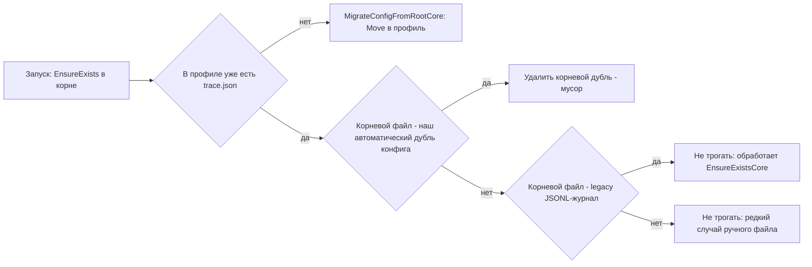
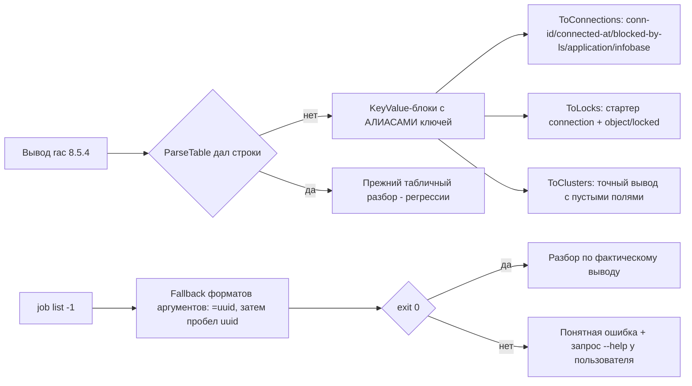
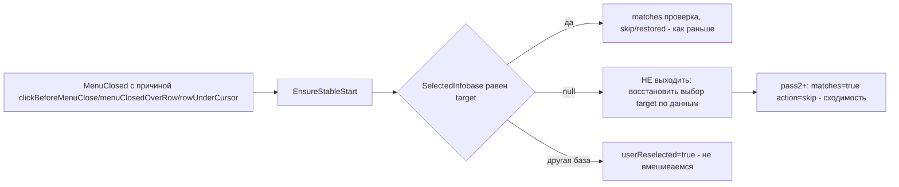
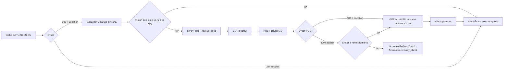

# PLAN 0.3.9.320–0.3.9.323 — цикл из 4 исправлений (#349, #324, #340, #323)

- Режим: **architect** — план; код НЕ изменяется до одобрения.
- Текущая версия: **0.3.9.319** (цель цикла — версии **0.3.9.320 … 0.3.9.323**, по одной на issue).
- Issues в работе (последний комментарий не от владельца): **#323, #324, #340, #349**.
  Issues **#330 и #334 НЕ трогаем** (последний комментарий от sivatorov).
- Правила цикла: issues сами НЕ закрываем; после каждого исправления — комментарий
  «что исправлено и в какой версии»; после каждой версии — bump в csproj + CHANGELOG.md + README.

---

## Обзор цикла

| Версия | Issue | Суть | Сложность |
|---|---|---|---|
| 0.3.9.320 | #349 | Лишний `trace.json` рядом с `profiles.json` (дубль конфига флагов) | низкая |
| 0.3.9.321 | #324 | Парсеры rac под схемы вывода 8.5.4.1878 (connection/lock), имя кластера, `job list` | средняя |
| 0.3.9.322 | #340 | Выделение снимается при клике по строке во время открытого меню (стабилизация выходит при `SelectedInfobase==null`) | средняя |
| 0.3.9.323 | #323 | Вход portal.1c.ru: probe считает живой сессии мёртвой (302), POST не даёт CAS-билет, `location='<нет>'` | высокая |

Между правками зависимостей нет (разные модули): `Services/TraceFlags*.cs`,
`Services/RacOutputParser.cs`+`Services/RacClient.cs`, `Views/MainWindow.*.cs`,
`Services/OneCUpdatesService.cs`. Порядок версий — от простого к сложному:
320 → 321 → 322 → 323. Каждая версия проходит полный цикл сборки (см. раздел «Сборка»).

---

# Цикл 0.3.9.320 — Issue #349 «Лишний trace.json»

## 0. Контекст

Описание issue (0 комментариев, работа строго по тексту):

> При запуске приложения создаётся trace.json (с переменными ЛОЖЬ) рядом с profiles.json,
> если таковой уже имеется в папке профиля пользователя. По идее так быть не должно.
> Зачем? Если файла в профиле нет — создаёт в папке профиля, как и положено.

## 1. Корень проблемы (подтверждён по коду)

Последовательность старта WPF/Avalonia ([`App.xaml.cs`](Configuration%20Management/App.xaml.cs:71),
[`App.axaml.cs`](Configuration%20Management/App.axaml.cs:116)):

1. `TraceFlags.EnsureExists()` вызывается **ДО инициализации профилей** → `ConfigFilePath()`
   возвращает корень `PlatformPaths.AppDataDirectory` → в корне (рядом с `profiles.json`)
   создаётся `trace.json` с дефолтами (все флаги `false`).
2. После выбора профиля `TraceFlags.SetProfileDataDirectory(profileDir)` вызывает
   [`MigrateConfigFromRootCore`](Configuration%20Management/Services/TraceFlags.cs:215),
   который переносит корневой файл в профиль **только если в профиле его ещё нет**:
   ```csharp
   if (!File.Exists(sourcePath) || File.Exists(targetPath))
       return;   // targetPath в профиле существует → корневой дубль ОСТАЁТСЯ
   ```
3. Начиная со второго запуска в профиле файл уже есть → корневой `trace.json`,
   созданный на шаге 1, больше никогда не переносится и не удаляется — висит рядом
   с `profiles.json`. Это и есть жалоба пользователя.

`ReloadIfChangedCore` после `SetProfileDataDirectory` читает профильный файл
(`_profileDataDirectory` имеет приоритет в `ConfigFilePath()`), поэтому корневой дубль
никак не влияет на флаги — он просто «мусор» в каталоге данных.

## 2. Схема решения



## 3. Задача 1 — Удаление корневого дубля при переносе

Файл: [`Configuration Management/Services/TraceFlags.cs`](Configuration%20Management/Services/TraceFlags.cs) — `MigrateConfigFromRootCore`.

1. Добавить ветку «targetPath уже существует, sourcePath существует»:
   - если `TraceFlagsFormat.ShouldMigrateLegacyJsonl(ReadAllTextQuietly(sourcePath))` —
     **не трогаем** (это старый журнал 0.3.9.308–0.3.9.314, его переименовывает
     `EnsureExistsCore`);
   - иначе — корневой файл является либо нашим автоматическим дублем текущего старта
     (`_configCreatedByUs == true`, флаг ещё не сброшен на момент вызова — сброс
     происходит только в `SyncCacheToCurrentPath`, вызванном ПОСЛЕ миграции), либо
     устаревшим корневым конфигом от прошлых версий; в обоих случаях он игнорируется
     при чтении (профильный файл приоритетнее) → удалить через `TryDeleteQuietly`.
2. Условия безопасности:
   - удаляем ТОЛЬКО файл с именем `trace.json` в корне (тот же путь, что `sourcePath`);
   - `trace_menuclose.json` / `menuclose_trace.json` / `trace_menuclose_legacy.json`
     не затрагиваются (другие имена);
   - ошибки удаления игнорируются (catch) — диагностика не должна ломать запуск.
3. Журнал: `_logger`-предупреждение недоступно на раннем старте — достаточно тихого
   catch; при желании добавить комментарий-инвариант над методом.

## 4. Задача 2 — Тесты

Файл: [`ConfigurationManagement.Tests/TraceFlagsTests.cs`](ConfigurationManagement.Tests/TraceFlagsTests.cs)
(и/или новый `TraceFlagsMigrationTests`).

1. **Повторный запуск**: конфиг уже есть в профильном каталоге, `EnsureExists()` создал
   корневой дубль → `SetProfileDataDirectory(profileDir)` → корневой файл удалён,
   профильный не изменён (mtime/содержимое сохранены).
2. **Первый запуск**: файла в профиле нет → прежнее поведение: корневой переносится
   `Move`, профильный содержит тот же контент.
3. **Legacy JSONL в корне** (первая строка `{"ts":…`) при существующем профильном
   конфиге → НЕ удаляется (его обрабатывает `EnsureExistsCore`).
4. **Профильный каталог == корню** (legacy-режим без профиля): `sourcePath == targetPath`
   → ничего не удаляется.
5. Регресс существующих тестов `TraceFlagsTests` (гейт env/false, перечитывание по mtime
   и пр.) — остаются зелёными.

## 5. Задача 3 — Версия, CHANGELOG, README, комментарий

1. [`Configuration Management.csproj`](Configuration%20Management/Configuration%20Management.csproj:62):
   4 поля → **0.3.9.320**.
2. `CHANGELOG.md`: секция `## [0.3.9.320] — 2026-10-07`: «Больше не создаётся лишний
   trace.json в корне каталога данных (рядом с profiles.json), когда конфиг флагов уже
   есть в папке активного профиля; корневой дубль удаляется при переносе».
3. `README.md`: раздел диагностики (trace.json) — короткая правка: конфиг живёт в папке
   профиля; если файл там уже есть — новый в корне не создаётся.
4. Комментарий в `#349` (публикация после релиза, issue НЕ закрываем):
   «Исправлено в версии 0.3.9.320. Причина: конфиг флагов trace.json создавался в корне
   каталога данных ДО выбора профиля, а при переносе в профиль, где файл уже был,
   корневой дубль не удалялся. Теперь дубль удаляется; при первом запуске файл
   переносится в профиль, как раньше».

---

# Цикл 0.3.9.321 — Issue #324 «Серверы 1С»

## 0. Контекст

Последний комментарий 7OH (2026-10-07 09:09:13Z), три замечания:

1. «Имя кластер подставляет в виде ключа»;
2. «Данные распарсить не смогло» + приложен
   [`publish/issue_artifacts/connection_list.log`](publish/issue_artifacts/connection_list.log);
3. Лог команд: `process/session/connection/lock list` — exit=0, а
   **`job list --cluster=cbc95ef0-…` → код -1 «Ошибка разбора параметра: --cluster=…»**.

Реальная схема вывода rac 8.5.4.1878 (из артефактов и комментариев):

- `cluster list` — блоки `cluster/host/port/name/…` (парсер уже умеет);
- `connection list` (файл connection_list.log) — блоки, стартующие с `connection`,
  ключи: `conn-id, host, process, infobase, application, connected-at, session-number,
  blocked-by-ls`;
- `lock list` (комментарий 17:28:56Z) — блоки, стартующие с `connection` (НЕ `lock`),
  ключи: `connection, session, object, locked, descr`;
- `job list` — команда вообще не выполняется (код -1).

## 1. Корень проблемы №2 («Данные распарсить не смогло»)

`RacOutputParser` заточен под «старые» key-value ключи, совпадающие с колонками
табличного формата:

- [`ToConnections`](Configuration%20Management/Services/RacOutputParser.cs:511) читает
  `session/blocked/connector/port/established-at/last-connection-time/duration/descr` —
  в реальном выводе 8.5.4 этих ключей НЕТ → блоки добавляются (Id и Host), но остальные
  поля пустые (UI показывает «пустые данные»);
- [`ToLocks`](Configuration%20Management/Services/RacOutputParser.cs:576) стартует блоки
  по ключу `lock`, которого в выводе 8.5.4 нет (блоки начинаются с `connection`) →
  `TryParseKeyValueBlocks(output, "lock")` даёт 0 блоков → непустой вывод при 0 строках →
  [`EnsureParsedOrThrow`](Configuration%20Management/Services/RacClient.cs:160) бросает
  `RacOutputParseException` «Вывод rac "lock list" не распознан» — это и есть
  «Данные распарсить не смогло» (и автообновление вкладки останавливается).

### Корень проблемы №1 («Имя кластера в виде ключа»)

Имя берётся напрямую из парсера ([`RacClusterRow.Name`](Configuration%20Management/ViewModels/RacClusterRow.cs:23)
→ `_cluster.Name`; окно импорта — [`ClusterImportWindow.Avalonia.cs`](Configuration%20Management/Views/ClusterImportWindow.Avalonia.cs:94)).
По коду key-value ветка [`ToClusters`](Configuration%20Management/Services/RacOutputParser.cs:232)
корректно извлекает `name` (`Unquote`). Гипотеза: в конкретном выводе пользователя
(`name : "Локальный кластер"`) значение парсится, но требуется:
(а) юнит-тест на ТОЧНЫЙ вывод из комментария (включая пустые значения типа
`restart-schedule :`); (б) при невозможности воспроизвести тестом — уточнить у
пользователя место проявления (скриншот) в комментарии issue, одновременно залогировав
имя кластера из `ToClusters` в мониторе.

### Корень проблемы №3 (`job list` код -1)

`BuildArguments` собирает `job list --cluster=<uuid>` так же, как остальные команды
(единый токен `host:port`, `--cluster=`), но rac 8.5.4.1878 отклоняет именно эту
команду с «Ошибка разбора параметра». Гипотезы (по убыванию вероятности):
1. rac 8.5.4 требует для `job list` форму `--cluster <uuid>` (без `=`) либо иную схему
   параметров подкоманды;
2. для `job list` кластер должен задаваться именем (не UUID);
3. изменился порядок: кластер задаётся до подкоманды.

Без доступа к живому rac точный синтаксис не установить — реализуем устойчивый fallback
(см. ниже) и запросим у пользователя вывод `rac job list --help` в комментарии к issue
(это допустимый диагностический шаг; основная правка при этом выполняется).

## 2. Схема решения



## 3. Задача 1 — Гибкий key-value разбор (алиасы ключей)

Файл: [`Configuration Management/Services/RacOutputParser.cs`](Configuration%20Management/Services/RacOutputParser.cs).

1. Добавить `private static string GetAny(block, params string[] keys)` — значение по
   ПЕРВОМУ найденному ключу (регистронезависимо) или пустая строка.
2. `ToConnections` (key-value ветка) — маппинг на реальную схему 8.5.4:
   - `Id` ← `connection`;
   - `Host` ← `host`;
   - `ProcessId` ← `process`;
   - `Blocked` ← `blocked-by-ls` (алиас `blocked`);
   - `EstablishedAt` ← `connected-at` (алиас `established-at`);
   - `Connector` ← `application` (алиас `connector`);
   - `Descr` ← `descr` (алиас `application`, если descr пуст);
   - `SessionId` ← `session` (в 8.5.4 — `session-number`, не GUID → пустой, допустимо);
   - `Port` ← `port` (в выводе 8.5.4 нет — пусто, допустимо).
   При необходимости расширить модель `RacConnectionInfo` полем `InfobaseId`
   ([`RacModels.cs`](Configuration%20Management/Models/RacModels.cs:157)) и заполнять его
   из `infobase` — колонка «Информационная база» во вкладке соединений.
3. `ToLocks` (key-value ветка) — схема 8.5.4:
   - сначала прежний стартер `lock`; если блоков 0 — стартер `connection` с фильтром:
     принимаем блок только при наличии маркерных ключей `object` или `locked`
     (отличие от блоков connection list, где есть `conn-id`/`application`);
   - `Id` ← `connection` (в 8.5.4 uuid блокировки отсутствует — пустой Guid допустим,
     проверить, что UI не падает на пустых Guid; при необходимости использовать
     детерминированный хэш строки блока);
   - `Object` ← `object` (алиас `descr`);
   - `SessionId`/`ConnectionId` ← `session`/`connection` (GUID-совместимые значения).
4. `ToProcesses`/`ToSessions`/`ToInfobaseSummaries` — точечные алиасы по аналогии
   (по доступным образцам вывода; для неизвестных схем оставляем прежние ключи).
5. `ToClusters` — добавить юнит-тест на ТОЧНЫЙ вывод из комментария 7OH (2026-10-01,
   включая пустые `restart-schedule :` и пр.); если тест выявляет ошибку — чинить
   (например, `ParseTable` должен гарантированно отдавать 0 строк для key-value
   с 2-колоночным позиционным разбором: сейчас `minColumns=3` спасает, но стоит
   закрепить это тестом).

## 4. Задача 2 — `job list`: устойчивый вызов

Файл: [`Configuration Management/Services/RacClient.cs`](Configuration%20Management/Services/RacClient.cs) — `GetJobsAsync`.

1. Перебрать форматы аргументов по очереди, пока команда не вернёт exit=0:
   - `job list --cluster=<uuid>` (текущий);
   - `job list --cluster <uuid>` (два токена);
   - при необходимости — `job list` c `--cluster=<имя кластера>` (имя берём из
     `GetClustersAsync`; включать только как третью попытку из-за доп.запроса).
2. Каждая попытка логируется (команда уже маскируется); при `RacClientException`
   (код != 0) — переход к следующему формату; если все форматы неуспешны — проброс
   последней ошибки (понятный текст уже формируется в `RunAsync`).
3. Разбор вывода — по факту полученного образца (тест будет дополнен, когда 7OH
   пришлёт вывод `job list` после успешного запуска команды; первый релиз — с
   диагностикой и пустым списком задач вкладки при невозможности выполнить команду
   с понятным предупреждением).
4. В комментарий issue включить просьбу: «если задачи снова не появятся — пришлите,
   пожалуйста, вывод `rac.exe localhost:27545 job list --help` и
   `rac.exe localhost:27545 help job list`» (нужен точный синтаксис 8.5.4.1878).

## 5. Задача 3 — Тесты

1. [`RacOutputParserTests.cs`](ConfigurationManagement.Tests/RacOutputParserTests.cs):
   - `ToConnections_ParsesRac854Blocks` — на содержимом
     [`connection_list.log`](publish/issue_artifacts/connection_list.log) (3 блока,
     Host=ALF, Blocked=false, EstablishedAt из `connected-at`, Connector=JobScheduler
     и т.д.);
   - `ToLocks_ParsesRac854BlocksStartingWithConnection` — блоки из комментария
     (connection/session/object/locked/descr), не путаются с connection list;
   - `ToLocks_KeepsLegacyLockStartKey` — регрессия старого формата (`lock : …`);
   - `ToClusters_ParsesExactCommentOutput` — точный вывод из комментария 7OH
     (имя «Локальный кластер», пустые поля);
   - `GetAny_AliasResolution` — приоритет ключей;
   - регрессии табличного формата (существующие тесты).
2. [`RacClientTests.cs`](ConfigurationManagement.Tests/RacClientTests.cs):
   - `BuildArguments` для `job list` (два формата: `--cluster=<uuid>` и
     `--cluster <uuid>`);
   - (опционально) тест fallback-логики GetJobsAsync на уровне чистого helper
     (выбор формата по результату exit).
3. [`RacJobRowTests.cs`](ConfigurationManagement.Tests/RacJobRowTests.cs) — регрессия
   (разбор job rows не меняется; при необходимости — по фактическому образцу 8.5.4).

## 6. Задача 4 — Версия, CHANGELOG, README, комментарий

1. csproj → **0.3.9.321**.
2. `CHANGELOG.md`: «Серверы 1С: парсеры list-команд адаптированы к схеме вывода
   rac 8.5.4.1878 (соединения: conn-id/connected-at/blocked-by-ls/application;
   блокировки: блоки с connection + object/locked); точное имя кластера из cluster list;
   job list выполняется с fallback-форматами параметров; при нераспознанном выводе
   автообновление вкладки останавливается с понятной ошибкой».
3. `README.md` — раздел «Серверы 1С»: поддержка новых форматов rac, поведение при
   ошибке разбора.
4. Комментарий в `#324`: «Исправлено в версии 0.3.9.321» + что было/сделано/как
   проверить + просьба про `job list --help`, если задачи всё ещё не отображаются.
   Issue НЕ закрываем.

---

# Цикл 0.3.9.322 — Issue #340 «Снятие выделения после контекстного меню»

## 0. Контекст

Последний комментарий 7OH (2026-10-07 08:55:54Z): «Улучшений не замечено» + файл
[`publish/issue_artifacts/trace_menuclose.json`](publish/issue_artifacts/trace_menuclose.json)
(0.3.9.319, WPF). Это ~12-я итерация по issue (0.3.9.277/291/299/300/302/304/306/308/
311/313/314/315/316/317/318/319).

## 1. Анализ трассы (ключевые записи)

Самый частый сценарий пользователя — «клик левой кнопкой по строке дерева при ОТКРЫТОМ
контекстном меню» (меню закрывается этим кликом, строка должна остаться выбранной):

```
MenuOpened → MouseDown(строка) → LastPlainClick → MenuClosed
MenuCloseDecision: restore=false, reason=clickBeforeMenuClose
EnsureStableStart: SelectedInfobase=null, containerIsSelected=False, containerRealized=True
EnsureStable: pass=1, userReselected=true, selectedItemId=null
```

Ровно этот паттерн повторяется в трассе 5 раз (строки 7–13, 16–22, 25–31, 34–40, 45–51):
**строка так и не выбирается** (`SelectedInfobase=null`), а стабилизация выходит на
первом же проходе. Рабочие сценарии (`reason=menuClosedOverRow`, строки 58–65 и 72–83)
дают `matches=True → action=skip` — там выбор применён и стабилен.

### Корень (подтверждён по коду)

[`EnsureSelectionStable`](Configuration%20Management/Views/MainWindow.Tree.cs:897)
(WPF) и [`EnsureSelectionStable`](Configuration%20Management/Views/MainWindow.Avalonia.Events.cs:836)
(Avalonia), первый проход `LayoutUpdated`:

```csharp
// Пользователь перевыбрал другую строку (или снял выбор) — не вмешиваемся:
if (!ReferenceEquals(_viewModel.SelectedInfobase, target))
{
    ... userReselected=true; return;   // <- выход при SelectedInfobase == null
}
```

Когда клик проглочен попапом меню, выбор НЕ применён (`SelectedInfobase == null`),
`ReferenceEquals(null, target)` == false → условие истинно → стабилизация завершается,
не восстановив выбор. Цель известна (клик по строке зафиксирован `lastPlainClick.Base`),
но восстановление не выполняется именно из-за «защиты от перевыбора» при null.

## 2. Схема решения



## 3. Задача 1 — Стабилизация при снятом выборе

1. **WPF** [`MainWindow.Tree.cs`](Configuration%20Management/Views/MainWindow.Tree.cs:899):
   условие выхода изменить на
   `if (_viewModel.SelectedInfobase is not null && !ReferenceEquals(_viewModel.SelectedInfobase, target))`.
   При `null` — НЕ выходить: первый проход даст `matches=false` → `SelectTreeRowByData`
   применит выбор цели; последующие проходы — `matches=true → skip` (сходимость).
   То же в chase-таймере (строка ~964): при `null` применять выбор, а не выходить.
2. **Avalonia** [`MainWindow.Avalonia.Events.cs`](Configuration%20Management/Views/MainWindow.Avalonia.Events.cs:836)
   — идентичная правка (`SelectRowByData` при `null`).
3. **Безопасность**: защита «пользователь перевыбрал ДРУГУЮ строку» сохраняется
   (не-null и не-target → выход). ESC/программное закрытие стабилизацию не запускают
   (нет причины) — не затронуты. Мультивыделение стабилизация не трогает (как раньше).
4. Чистый предикат в [`BatchSelectionHelper.cs`](Configuration%20Management/Services/BatchSelectionHelper.cs)
   (internal, тестируемый):
   `ShouldContinueRestore(bool currentSelectionNull, bool userSelectedDifferent) =>
   currentSelectionNull || !userSelectedDifferent;` — использовать в обоих EnsureStable.

## 4. Задача 2 — Тесты

1. [`BatchSelectionHelperTests.cs`](ConfigurationManagement.Tests/BatchSelectionHelperTests.cs):
   предикат: null → продолжать; не-null и совпадает с целью → продолжать (skip-ветка);
   не-null и отличается → прекратить (userReselected).
2. Документирующий тест (поведенческий, на логику трассы): чистый хелпер, имитирующий
   цепочку «клик по строке при открытом меню → SelectedInfobase=null → восстановление
   цели» — насколько возможно без оконного стека (сам WPF-механизм, как и прежде,
   юнит-тестами не покрывается — помечаем в CHANGELOG).
3. Регресс остальных `BatchSelectionHelperTests` (windows давности 500/2000 мс,
   IsSameClick и пр.).

## 5. Задача 3 — Версия, CHANGELOG, README, комментарий

1. csproj → **0.3.9.322**.
2. `CHANGELOG.md`: «Снятие выделения после контекстного меню: при клике по строке
   дерева во время открытого меню (клик „проглатывается“ попапом) выбор теперь
   восстанавливается по цели клика даже если модель осталась без выбранной базы —
   стабилизация больше не выходит с userReselected при SelectedInfobase==null
   (WPF и Avalonia)».
3. `README.md` — без изменений (поведенческий фикс) либо одна строка в разделе
   контекстного меню дерева.
4. Комментарий в `#340`: «Исправлено в версии 0.3.9.322» — описать сценарий из трассы
   (5 повторов clickBeforeMenuClose с selectedItemId=null), что изменено и как проверить
   (открыть меню → клик по другой строке → строка остаётся выбранной). Issue НЕ закрываем.

---

# Цикл 0.3.9.323 — Issue #323 «Окно Проверка обновлений» (10-я итерация входа portal.1c.ru)

## 0. Контекст

Последний комментарий 7OH (2026-10-07 09:01:59Z) с логом 0.3.9.319:

> «Всё ещё не удаётся повторить рабочий код из 1с. … сайт релизов возвращает один
> заголовок с Большой буквой — а именно Location … Возможно именно по этому
> "location='<нет>'".»

Лог (фрагменты):
- `cookie контейнера: … releases.1c.ru=SESSION{Secure,HttpOnly,Path=/,Domain=releases.1c.ru}`;
- `пробная проверка живой сессии 'https://releases.1c.ru/project/HRM30' => status=302,
  bodyLength=0, loginForm=нет, alive=False` → «cookie портала удаляются, выполняется
  полный вход»;
- `GET формы status=200, execution=есть, lt=нет, action='/login', поля: _eventId,
  anotherComputer, execution, geolocation, inviteCode, inviteType…`;
- далее (по коду 0.3.9.319): POST → 200 «Личные данные» (`location='<нет>'`), билет
  CAS в теле не найден → запасной путь `security_check` БЕЗ билета → 302 → `/error/403`
  → `alive=False` → `RedirectFailed`.

## 1. Корень проблемы (две связанные причины)

1. **Ложная «смерть» живой сессии в A-1.** [`IsPortalSessionAliveAsync`](Configuration%20Management/Services/OneCUpdatesService.cs:1689)
   считает сессию мёртвой при любом 3xx: `alive = status is >= 200 and < 300 && !isLoginForm`.
   Но releases.1c.ru отвечает 302 с **Location** и для ЖИВОЙ сессии (вероятно, редирект
   на канонический URL — то самое «один заголовок с Большой буквой — Location», о котором
   пишет 7OH). Итог: каждый запуск с «живой» SESSION всё равно делает полный вход и
   попадает в порочный круг из п.2.
2. **CAS не выдаёт билет на наш POST.** Рабочий код 1С получает **302 с Location =
   ticket URL** (GET по нему доводит сессию releases.1c.ru). Наш POST даёт **200 кабинет
   без Location** и без билета в теле → `RunTicketSecurityCheckAsync` не находит билет →
   запасной голый `security_check` → `/error/403`. Значит, POST отличается от эталона 1С:
   состав тела (мы добавляем ВСЕ hidden-поля формы, включая `anotherComputer`,
   `inviteType`; эталон шлёт строго 8 полей), Referer/Origin, наличие cookie сессии
   login.1c.ru в контейнере.

## 2. Схема решения



## 3. Задача 1 — A-1: следование 302 в probe

Файл: [`Configuration Management/Services/OneCUpdatesService.cs`](Configuration%20Management/Services/OneCUpdatesService.cs) — `IsPortalSessionAliveAsync`.

1. При 3xx с Location — следовать вручную (до `MaxRedirects` шагов), на каждом шаге
   `ApplySetCookieToContainer` + журнал (`probe redirect {status} '{loc}'`).
2. Сессия **жива**, если финальный ответ: 2xx (или 3xx на другом звене), тело НЕ форма
   входа (`LooksLikeLoginForm`), хост НЕ `login.1c.ru`, URL не `/error/403`.
3. Сессия **мертва**, если финал — `login.1c.ru`, форма входа в теле, или `/error/403`
   (страница ошибки).
4. Регресс-риск: probe станет «дороже» (1–3 доп.запроса) — приемлемо, вызывается только
   при наличии session-cookie в контейнере.

## 4. Задача 2 — Диагностика POST (подтвердить гипотезу 7OH)

Там же, в `TryLoginPortalAsync` после POST (строка ~1317):

1. Новый лог `DescribeResponseHeaders(postResponse)` — **все имена заголовков ответа**
   (с фактическим регистром) + значение `Location`, если есть:
   `POST заголовки: content-type, location=…` — чтобы по следующему логу 7OH точно
   увидеть, приходит ли `Location` и с каким именем (гипотеза «заголовок с Большой
   буквы» проверяется фактом).
2. Лог итогового набора полей POST (имена, без значений) — видно, чем наш POST
   отличается от эталона 1С.
3. Лог `Set-Cookie` имён по доменам (уже есть частично) + bodyLength кабинета.

## 5. Задача 3 — Привести POST к эталону 1С

Файл: тот же, `TryLoginPortalAsync` / `BuildLoginPostBody` (строка ~1304).

1. **Эталонный набор полей**: если форма содержит классический CAS-набор
   (`execution` + признаки `inviteCode`/`geolocation`/`rememberMe`/`submit`), собирать
   тело ТОЧНО как рабочий код 1С: `inviteCode(пусто), username, password, execution,
   _eventId=submit, geolocation(пусто), submit=Войти, rememberMe=on` — БЕЗ добавления
   прочих hidden-полей формы (`anotherComputer`, `inviteType` и пр.). Иначе — прежний
   динамический набор (страховка для неклассических форм, issue #334/#330).
2. Referer/Origin оставить текущими (риск регресса других CAS-развёртываний), но
   залогировать их значения; решение об отключении — отдельным пунктом после живого
   лога (в этом цикле НЕ меняем).
3. Перед POST формы гарантировать чистую сессию CAS: `ClearPortalCookies()` (уже
   вызывается при мёртвой A-1) — проверить, что удаляет SESSION для обоих доменов
   (`login.1c.ru` и `releases.1c.ru`), иначе CAS, видя активную сессию, отвечает 200
   кабинетом вместо 302 с билетом (гипотеза, подтверждается логом «cookie удаляются»).

## 6. Задача 4 — Расширить извлечение билета из тела

Файл: [`ExtractBodyRedirectUrl`](Configuration%20Management/Services/OneCUpdatesService.cs:2495).

1. Добавить маркеры: `<iframe src="…">`, `<meta … url=…>` без `http-equiv` (некоторые
   кабинеты используют), JS `location.replace('…')` / `window.location='…'` с пробелами
   вокруг `=`, одинарные/двойные кавычки.
2. В `RunTicketSecurityCheckAsync`: если найденный URL НЕ несёт `ticket=` и ведёт на
   каталог — это не билет; честно вернуть false (без голого security_check).
3. Голый `security_check` без билета остаётся запасным путём только для полной
   совместимости; в живом сценарии не достигается.

## 7. Задача 5 — Тесты

Файл: [`OneCUpdatesLoginFlowTests.cs`](ConfigurationManagement.Tests/OneCUpdatesLoginFlowTests.cs).

1. **A-1 регресс «живая сессия»**: probe GET → 302 → Location на канонический URL →
   200 каталог → `alive=True` → `Success` БЕЗ полного входа (fake-обработчик).
2. **A-1 регресс «мёртвая сессия»**: probe → 302 → login.1c.ru → `alive=False` → полный
   вход.
3. **A-1 регресс `/error/403`**: probe → 302 → /error/403 → `alive=False`.
4. **Эталонное тело POST**: классическая форма → ровно 8 полей эталона (без
   `anotherComputer` и пр.); неклассическая форма → прежний динамический набор.
5. **Извлечение билета**: meta-refresh, iframe src, location.replace (новые тесты на
   `ExtractBodyRedirectUrl`).
6. Регресс существующих тестов входа (401→AuthFailed, кабинет→Success/RedirectFailed,
   лимит попыток) — остаются зелёными.

## 8. Задача 6 — Версия, CHANGELOG, README, комментарий

1. csproj → **0.3.9.323**.
2. `CHANGELOG.md`: «Вход на portal.1c.ru, 10-я итерация: пробная проверка живости
   сессии следует за 302-редиректами (канонические URL releases.1c.ru больше не
   считаются „мёртвой“ сессией); POST-тело приведено к эталону рабочего кода 1С для
   классической формы; расширена диагностика заголовков ответа POST (в т.ч. Location
   с фактическим регистром) и извлечение CAS-билета из тела кабинета (iframe/JS)».
3. `README.md` — раздел проверки обновлений: уточнение про живую сессию и диагностику.
4. Комментарий в `#323`: «Исправлено в версии 0.3.9.323» + что было (ложная смерть
   сессии при 302 + отсутствие билета на нашем POST) / что сделано / как проверить
   (в логе CM_REDIRECT: probe 302 → финальный 200 каталога, либо вход без
   «location='<нет>'» при эталонном POST) / при необходимости — просьба прислать
   новый лог. Issue НЕ закрываем.

---

# Сводка затрагиваемых файлов

| Файл | Версия | Изменение |
|---|---|---|
| [`Configuration Management/Services/TraceFlags.cs`](Configuration%20Management/Services/TraceFlags.cs) | 0.3.9.320 | `MigrateConfigFromRootCore`: удаление корневого дубля `trace.json` при существующем профильном конфиге (кроме legacy JSONL) |
| [`ConfigurationManagement.Tests/TraceFlagsTests.cs`](ConfigurationManagement.Tests/TraceFlagsTests.cs) | 0.3.9.320 | +N: повторный запуск (дубль удалён), первый запуск (Move), legacy не трогается, legacy-режим без профиля |
| [`Configuration Management/Services/RacOutputParser.cs`](Configuration%20Management/Services/RacOutputParser.cs) | 0.3.9.321 | `GetAny`-алиасы ключей; `ToConnections`/`ToLocks` под схемы 8.5.4.1878; тесты точного вывода; стартер блоков lock «connection» + фильтр |
| [`Configuration Management/Models/RacModels.cs`](Configuration%20Management/Models/RacModels.cs) | 0.3.9.321 | (при необходимости) `RacConnectionInfo.InfobaseId` |
| [`Configuration Management/Services/RacClient.cs`](Configuration%20Management/Services/RacClient.cs) | 0.3.9.321 | `GetJobsAsync`: fallback форматов `--cluster=` / `--cluster ` |
| [`ConfigurationManagement.Tests/RacOutputParserTests.cs`](ConfigurationManagement.Tests/RacOutputParserTests.cs), [`RacClientTests.cs`](ConfigurationManagement.Tests/RacClientTests.cs), [`RacJobRowTests.cs`](ConfigurationManagement.Tests/RacJobRowTests.cs) | 0.3.9.321 | +N по схемам 8.5.4 и fallback job list |
| [`Configuration Management/Views/MainWindow.Tree.cs`](Configuration%20Management/Views/MainWindow.Tree.cs) | 0.3.9.322 | `EnsureSelectionStable`: не выходить при `SelectedInfobase==null`, восстановить цель; то же в chase-таймере |
| [`Configuration Management/Views/MainWindow.Avalonia.Events.cs`](Configuration%20Management/Views/MainWindow.Avalonia.Events.cs) | 0.3.9.322 | Аналогичная правка Avalonia |
| [`Configuration Management/Services/BatchSelectionHelper.cs`](Configuration%20Management/Services/BatchSelectionHelper.cs) + [`BatchSelectionHelperTests.cs`](ConfigurationManagement.Tests/BatchSelectionHelperTests.cs) | 0.3.9.322 | Чистый предикат продолжения восстановления |
| [`Configuration Management/Services/OneCUpdatesService.cs`](Configuration%20Management/Services/OneCUpdatesService.cs) | 0.3.9.323 | A-1 follow-302; диагностика заголовков POST; эталонное тело `BuildLoginPostBody`; расширение `ExtractBodyRedirectUrl` |
| [`ConfigurationManagement.Tests/OneCUpdatesLoginFlowTests.cs`](ConfigurationManagement.Tests/OneCUpdatesLoginFlowTests.cs) | 0.3.9.323 | +N: A-1 302→каталог/live, 302→login/dead, 302→403/dead; эталонное тело; извлечение билета |
| [`Configuration Management.csproj`](Configuration%20Management/Configuration%20Management.csproj:62) | ×4 | Версии 0.3.9.320…323 |
| `CHANGELOG.md`, `README.md` | ×4 | Секции версий, разделы диагностики/серверов/обновлений |
| `publish/comment-*.md` и скрипты цикла | ×4 | Копии из цикла 319, комментарии в #349/#324/#340/#323 |

# Риски

| Риск | Митигация |
|---|---|
| #349: удаление корневого trace.json, который правил пользователь вручную | Удаляется только дубль при существующем профильном конфиге; legacy JSONL и прочие имена не трогаются; файл-конфиг в корне после переноса семантически устарел (приоритет — профиль) |
| #324: схема вывода ещё одной list-команды (process/session/infobase) отличается | Алиасы ключей по образцам; `EnsureParsedOrThrow` останавливает поллинги с понятной ошибкой; в комментарии — запрос выводов для неподдерживаемых команд |
| #324: `job list` fallback-форматы тоже не подойдут rac 8.5.4.1878 | Понятная ошибка + запрос `job list --help` у пользователя; следующая итерация по фактическому синтаксису |
| #340: восстановление при `null` «перехватит» выбор, если пользователь кликнул мимо строки | Стабилизация запускается только по причинам, где цель = реально кликнутая строка (clickBeforeMenuClose/menuClosedOverRow/rowUnderCursor/snapshot); ESC/программное закрытие не запускают её |
| #323: изменение тела POST сломает неклассические формы (регресс #334/#330) | Эталонный набор применяется ТОЛЬКО при классическом CAS-наборе полей; иначе — прежний динамический набор; регресс-тесты входа остаются зелёными |
| #323: живые проверки входа невозможны автономно (сеть, учётные данные) | Диагностика (имена заголовков POST, A-1 chain, состав тела) такова, что по следующему логу 7OH однозначно определяется оставшееся звено |
| Кросс-платформенность WPF/Avalonia | Каждая правка дублируется для обеих платформ (#340 — два файла; #323/#324/#349 — общие Services) и проверяется сборкой `-p:BuildLinux=true` |
| Не закрываем issues | Комментарии публикуются ПОСЛЕ релизов; state не меняется |

# Сборка и публикация (для каждой версии цикла)

1. `dotnet test` (Windows) — зелёный, счётчик тестов в комментарий.
2. `dotnet publish -c Release` → `publish/out-<version>/`.
3. `dotnet build -p:BuildLinux=true` (кросс-сборка Avalonia) — без ошибок.
4. DEB-скрипты `publish/build_deb_win_<version>.py`, `check_deb_win_<version>.py`
   (копии из цикла 319).
5. Тег `v<version>`, релиз; `publish/_post_comments_<version>.ps1`,
   `publish/_update_state_<version>.ps1`.

# Критерии приёмки цикла

1. 4 версии 0.3.9.320…323 собраны, `dotnet test` зелёный, Linux-сборка без ошибок.
2. #349: на повторном запуске в корне каталога данных НЕ появляется trace.json,
   если конфиг есть в профиле (юнит-тест).
3. #324: `ToConnections`/`ToLocks` разбирают реальные образцы 8.5.4.1878
   (connection_list.log, lock list из комментария); имя кластера — значение «name»;
   `job list` пробует fallback-форматы; при неуспехе — понятная ошибка.
4. #340: по трассе 0.3.9.319 сценарии clickBeforeMenuClose больше не завершаются
   `userReselected=true, selectedItemId=null` — выбор цели восстанавливается
   (на уровне предиката — юнит-тест; на уровне UI — проверка пользователем).
5. #323: A-1 probe следует 302 и корректно различает живую/мёртвую сессию (тесты);
   POST-тело эталона для классической формы (тест); лог POST показывает имена
   заголовков ответа (подтверждение гипотезы Location).
6. CHANGELOG.md и README обновлены для каждой версии; комментарии опубликованы
   в #349/#324/#340/#323; все issues ОСТАЮТСЯ открытыми.