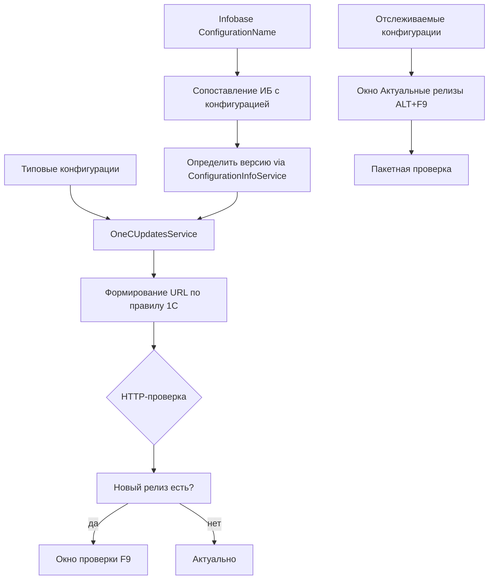

# План — Этап 1: Проверка обновлений конфигураций и «Актуальные релизы»

> Проект: «Управление конфигурациями 1С» (.NET 10, WPF на Windows / Avalonia 11 на Linux).
> Источник: [`plans/startmanager-features-roadmap.md`](startmanager-features-roadmap.md), раздел «Этап 1», функции №21, №22 StartManager.
> Текущая версия: `0.3.8.10`. После реализации поднять до **`0.3.8.11`**.
> Тип задачи: **декомпозиция в режиме Архитектора** → реализация в **режиме Code**. Этот документ — только план, кода здесь нет.

---

## 1. Цель и объём

Внедрить функционал StartManager №21 («Проверка обновлений конфигураций») и №22 («Актуальные релизы»):

1. Список типовых конфигураций 1С (предопределённый набор + редактирование пользователем).
2. Формирование web-адреса обновлений по правилу 1С
   `downloads.1c.ru/ipp/.../Configs/<Конфигурация>/<Ред>/<Подред>/`,
   ручная корректировка ссылки и проверка.
3. Проверка обновлений для выбранной ИБ (клавиша **F9**): окно проверки,
   подсветка нового релиза, кнопка загрузки.
4. Окно «Актуальные релизы» (**ALT+F9**): список отслеживаемых конфигураций,
   пакетная проверка.
5. Настройка связи ИБ ↔ конфигурация и определение релиза автоматически
   (кнопка «Определить версию», чтение из структуры конфигурации).

**Ограничения этапа:** не реализуются сценарии резервирования, блокировки сеансов,
закладки и прочие функции (это последующие этапы). Код пишется сразу для обеих
платформ (парные файлы `*.xaml`/`*.Avalonia.cs`).

---

## 2. Архитектурные выводы (что учтено из существующего кода)

- **Кросс-платформенность.** Windows = WPF (`net10.0-windows`, символ `#if WINDOWS`),
  Linux = Avalonia (`net10.0`, `#if LINUX`). Новые UI-окна нужны в парном виде.
  Чистые .NET модели/сервисы (без WPF/Avalonia) пишутся один раз — они используются
  обеими платформами. Разделение уже реализовано в
  [`Configuration Management.csproj`](../Configuration%20Management/Configuration%20Management.csproj)
  (блоки `ItemGroup Condition="BuildLinux"`).
- **MVVM + DI.** Регистрация сервисов в [`AppServices.cs`](../Configuration%20Management/AppServices.cs).
  Новые сервисы добавляются туда. Базовые VM — [`ViewModelBase.cs`](../Configuration%20Management/ViewModels/ViewModelBase.cs),
  команды — `RelayCommand`.
- **Чтение конфигурации уже есть.** [`ConfigurationInfoService`](../Configuration%20Management/Services/ConfigurationInfoService.cs:41)
  умеет читать имя и версию конфигурации (`ReadAndApply`) через COM-коннектор/эвристику
  и заполняет `Infobase.ConfigurationName`/`ConfigurationVersion`
  ([`Infobase.cs`](../Configuration%20Management/Models/Infobase.cs:177)). Это переиспользуется
  для кнопки «Определить версию».
- **Образец работы с сетью/загрузкой.** [`GitHubReleaseService`](../Configuration%20Management/Services/GitHubReleaseService.cs:45)
  (static `HttpClient`, User-Agent, timeout 15 с, устойчивый парсинг) и
  [`UpdateService.cs`](../Configuration%20Management/Services/UpdateService.cs:243)
  (загрузка с прогрессом, докачка). Новый сервис обновлений конфигураций повторяет эти паттерны.
- **Хоткеи.** Регистрируются в [`MainWindow.Hotkeys.cs`](../Configuration%20Management/Views/MainWindow.Hotkeys.cs:33)
  (`#if WINDOWS`) и [`MainWindow.Avalonia.Hotkeys.cs`](../Configuration%20Management/Views/MainWindow.Avalonia.Hotkeys.cs:29)
  (`#if LINUX`) из настроек `AppSettings.Hotkey*`. F9 и ALT+F9 добавляются по той же схеме.
- **Настройки.** `AppSettings` (`settings.json`) хранит глобальные коллекции; для новых
  списков нужны поля + правки в `NormalizeForLoad()`
  ([`AppSettings.cs`](../Configuration%20Management/Models/AppSettings.cs:512)) — иначе NRE при
  старых конфигах.
- **Локализация.** ru/en — JSON в [`Localization/Languages`](../Configuration%20Management/Localization/Languages).

---

## 3. Общая схема решения

---

## 4. Новые файлы (структура)

### 4.1. Модели (чистый .NET, кросс-платформенные)

| Файл | Назначение |
|------|-----------|
| `Models/OneCConfigType.cs` | Типовая конфигурация: код, имя, признак предопределённой, список редакций/каталогов релизов. |
| `Models/OneCConfigEdition.cs` | Редакция/каталог релиза: имя, сегменты URL `Ред`/`Подред`, переопределяемая ссылка. |
| `Models/ConfigUpdateCheckResult.cs` | Результат проверки одной ИБ/конфигурации: текущая версия, последняя версия, URL, признак «есть новое», статус/ошибка. |

Дополнительные свойства в существующих моделях:
- `Infobase` (`Models/Infobase.cs`): `string UpdateConfigCode` (код типовой конфигурации,
  связь ИБ ↔ конфигурация) и `string UpdateUrlOverride` (ручная ссылка; пусто — автоформирование).
- `AppSettings` (`Models/AppSettings.cs`): `List<OneCConfigType> CustomConfigTypes`
  (пользовательские конфигурации), `string HotkeyCheckUpdate = "F9"`,
  `string HotkeyActualReleases = "Alt+F9"`, а также кэш последних результатов проверки
  (необязательно). Дополнить `NormalizeForLoad()` строками `CustomConfigTypes ??= new()`.

### 4.2. Сервисы (чистый .NET, кросс-платформенные)

| Файл | Назначение |
|------|-----------|
| `Services/IOneCUpdatesService.cs` | Интерфейс. |
| `Services/OneCUpdatesService.cs` | Формирование URL по правилу 1С, HTTP-проверка наличия обновлений, загрузка файла с прогрессом, статический набор предопределённых конфигураций. |
| `Services/BuiltInConfigTypes.cs` | Предопределённый набор типовых конфигураций 1С (статический список). |

Регистрация в `AppServices.cs`: `services.AddSingleton<IOneCUpdatesService, OneCUpdatesService>();`
(в общем блоке — сервис не зависит от UI-фреймворка).

### 4.3. ViewModels

| Файл | Назначение |
|------|-----------|
| `ViewModels/ConfigTypeItemViewModel.cs` | Строка списка конфигураций (для окна редактирования): имя, коды, признак предопределённой, команды удаления/редактирования. |
| `ViewModels/UpdateCheckRowViewModel.cs` | Строка окна проверки F9: привязка к `Infobase`, текущая/последняя версия, признак новизны, ссылка, команда загрузки. |
| `ViewModels/ActualReleasesViewModel.cs` | Модель окна «Актуальные релизы»: список отслеживаемых конфигураций, команда пакетной проверки. |

Команды в `MainViewModel` (`MainViewModel.cs` / `MainViewModel.Avalonia.cs`):
`CheckUpdateCommand` (F9) и `ShowActualReleasesCommand` (ALT+F9). Свойства хоткеев
`HotkeyCheckUpdate`/`HotkeyActualReleases` — из настроек.

### 4.4. Окна (парные WPF + Avalonia)

| WPF | Avalonia | Назначение |
|-----|----------|-----------|
| `Views/ConfigTypesEditWindow.xaml` + `.xaml.cs` | `Views/ConfigTypesEditWindow.Avalonia.cs` | Редактирование списка типовых конфигураций (добавить/изменить/удалить, задать редакции и коды URL). |
| `Views/UpdateCheckWindow.xaml` + `.xaml.cs` | `Views/UpdateCheckWindow.Avalonia.cs` | Окно проверки обновлений для выбранной ИБ: текущая версия, подсветка нового релиза, кнопка загрузки. |
| `Views/ActualReleasesWindow.xaml` + `.xaml.cs` | `Views/ActualReleasesWindow.Avalonia.cs` | Окно «Актуальные релизы»: список отслеживаемых конфигураций, пакетная проверка, результаты по строкам. |
| `Views/ConfigUpdateLinkWindow.xaml` + `.xaml.cs` | `Views/ConfigUpdateLinkWindow.Avalonia.cs` | Настройка связи ИБ ↔ конфигурация: выбор типовой конфигурации/редакции, поле URL (авто/ручное), кнопка «Определить версию». |

> Окно настройки связи может быть открыто и как отдельный диалог из правой панели,
> и интегрировано в `AddEditWindow` — план предусматривает выделенное окно для простоты
> тестирования; интеграция в карточку базы опциональна.

### 4.5. Локализация

Добавить ключи (группа `Updates.*`) в:
- [`Localization/Languages/ru.json`](../Configuration%20Management/Localization/Languages/ru.json)
- [`Localization/Languages/en.json`](../Configuration%20Management/Localization/Languages/en.json)

Примерный набор: `Updates.CheckTitle`, `Updates.ActualReleasesTitle`, `Updates.ConfigTypesTitle`,
`Updates.CurrentVersion`, `Updates.LatestVersion`, `Updates.IsNewer`, `Updates.Download`,
`Updates.UpToDate`, `Updates.CheckFailed`, `Updates.DefineVersion`, `Updates.UrlAuto`,
`Updates.UrlManual`, `Updates.BatchCheck`, `Updates.NoneSelected`, `Updates.Loaded`.

---

## 5. Изменения существующих файлов

| Файл | Что меняется |
|------|--------------|
| [`AppServices.cs`](../Configuration%20Management/AppServices.cs) | Регистрация `IOneCUpdatesService` в общем блоке. |
| [`AppSettings.cs`](../Configuration%20Management/Models/AppSettings.cs) | Поля списка конфигураций, хоткеи F9/ALT+F9, правки `NormalizeForLoad()`. |
| [`Infobase.cs`](../Configuration%20Management/Models/Infobase.cs) | Свойства `UpdateConfigCode`, `UpdateUrlOverride`. |
| `MainViewModel.cs` + `MainViewModel.Avalonia.cs` | Команды `CheckUpdateCommand`, `ShowActualReleasesCommand`, свойства хоткеев, методы открытия окон. |
| [`MainWindow.Hotkeys.cs`](../Configuration%20Management/Views/MainWindow.Hotkeys.cs) | Регистрация F9 и ALT+F9. |
| [`MainWindow.Avalonia.Hotkeys.cs`](../Configuration%20Management/Views/MainWindow.Avalonia.Hotkeys.cs) | То же для Avalonia. |
| [`MainWindow.xaml` / `MainWindow.xaml.cs` / `MainWindow.Avalonia.*`] | Кнопки/пункты меню «Проверить обновления» (F9) и «Актуальные релизы» (ALT+F9), отображение индикатора «есть обновление» для выбранной ИБ. |
| `Configuration Management.csproj` | В Linux-блоке: `<Compile Remove>` для WPF-only `.xaml.cs` новых окон + `<Compile Include>` для `*Window.Avalonia.cs`, включение новых чистых ViewModels (как уже сделано для `DetectConfigRowViewModel`). Поднять версию до `0.3.8.11` в четырёх полях (строки 62–65). |
| [`CHANGELOG.md`](../CHANGELOG.md) / [`README.md`](../README.md) / `_release/0.3.8.11.md` | Описание этапа (см. раздел 9). |
| `ru.json` / `en.json` | Новые ключи `Updates.*`. |

---

## 6. Формирование URL по правилу 1С

Правило из дорожной карты: `downloads.1c.ru/ipp/.../Configs/<Конфигурация>/<Ред>/<Подред>/`.

- Базовый префикс `downloads.1c.ru/ipp/<сегмент>/` сделать константой/настройкой
  (`DefaultBaseUrl = "https://downloads.1c.ru/ipp/1cbsl/"` — сегмент `1cbsl` для типовых
  решений; при необходимости настраивается через `UpdateUrlOverride`).
- `OneCUpdatesService.BuildUpdateUrl(OneCConfigEdition)`:
  `<BaseUrl>Configs/<UrlCode>/<Red>/<SubRed>/` где `UrlCode` — сегмент конфигурации,
  `Red`/`SubRed` — редакции из `OneCConfigEdition`. Каждый сегмент проходит
  `Uri.EscapeDataString`, итог проверяется `Uri.TryCreate(..., UriKind.Absolute)`.
- Ручная корректировка: если задан `Infobase.UpdateUrlOverride` — используется он,
  иначе автоформирование. В окне настройки связи поле URL доступно для правки
  (переключатель «Авто/Вручную»).

**Проверка (CheckForUpdatesAsync):**
- `HEAD`/`GET` по сформированному URL (каталог релизов). Если каталог не существует —
  `404` → «обновления недоступны/неверная ссылка». Если существует — пробуем распарсить
  последнюю версию из страницы (устойчивый парсинг ссылок на архивы вида
  `*setup*.zip`, поиск максимальной версии). При невозможности распарсить — считаем
  «каталог доступен, точная версия не определена» (честный статус вместо ложного).
- Все сетевые операции в `try/catch`; ошибки не роняют UI (по образцу
  `GitHubReleaseService`/`UpdateService`).
- Сравнение версий: переиспользовать логику сравнения (аналог
  `GitHubReleaseService.TryParseVersion`/`IsNewerThan`), нормализовав к 3–5-частному `Version`.

---

## 7. Сценарии F9 и ALT+F9

### 7.1. F9 — Проверка обновлений для выбранной ИБ

1. Если база не выбрана — сообщение через `IDialogService`.
2. Открыть окно `UpdateCheckWindow` (модально, через `ModalWindowBase.ShowDialogSync` на Linux).
3. Окно: имя базы, текущая `ConfigurationVersion`, последняя версия с сайта, URL, статус.
4. Если `latest > current` — строка подсвечивается (кисть из темы, по образцу статусных
   цветов в `Infobase.StatusColorHex`), кнопка «Загрузить» активна.
5. «Загрузить» → `OneCUpdatesService.DownloadUpdateAsync(url, targetPath, progress)`
   с индикатором прогресса в окне (по образцу `UpdateProgressWindow.Avalonia.cs`).

### 7.2. ALT+F9 — Окно «Актуальные релизы»

1. Собрать список отслеживаемых конфигураций: пользовательские из `AppSettings.CustomConfigTypes`
   + предопределённые из `BuiltInConfigTypes` (можно добавить флаг «отслеживать»).
2. Кнопка «Проверить все» — пакетная проверка по каждой конфигурации через
   `IOneCUpdatesService`, прогресс по строкам (как `DetectConfigurationsWindow` обрабатывает
   строки в фоне).
3. По строкам: имя конфигурации, последняя версия, статус, кнопка загрузки.
4. Строки с новыми релизами подсвечиваются.

---

## 8. Связь ИБ ↔ конфигурация и «Определить версию»

- В окне `ConfigUpdateLinkWindow` выбирается типовая конфигурация (`UpdateConfigCode`)
  и редакция; URL формируется/правится.
- Кнопка «Определить версию» вызывает существующий
  [`ConfigurationInfoService.ReadAndApply`](../Configuration%20Management/Services/ConfigurationInfoService.cs:161)
  (перезапись = true) → заполняются `ConfigurationName`/`ConfigurationVersion`.
  По `ConfigurationName` авто-подставляется типовая конфигурация, если имя совпадает
  с одним из предопределённых (например «Бухгалтерия предприятия»).
- На Linux COM-чтения нет — работает эвристика по файлу `1Cv8.1CD` и пакетный режим
  конфигуратора (уже поддерживается `ConfigurationInfoService`).

---

## 9. Версия, CHANGELOG, README, release-заметка

После реализации в режиме Code (отдельные пункты todo):

1. **csproj**: четыре поля версии → `0.3.8.11` ([csproj:62–65](../Configuration%20Management/Configuration%20Management.csproj:62)).
2. **README.md**: обновить бейдж версии + добавить в раздел «Возможности»:
   «Проверка обновлений конфигураций 1С (F9)», «Окно „Актуальные релизы“ (ALT+F9)»,
   «Список типовых конфигураций и формирование ссылок обновлений по правилу 1С».
3. **CHANGELOG.md**: запись сверху `## [0.3.8.11] — <дата>` с разделом о функциях №21/№22
   и пометкой о сборке обеих платформ.
4. **`_release/0.3.8.11.md`**: заметка для GitHub Release (что нового, скриншоты окон,
   ограничения: парсинг каталога 1С может быть неустойчивым).

---

## 10. Риски и решения

| # | Риск | Митигация |
|---|------|-----------|
| 1 | Парсинг каталога `downloads.1c.ru` нестабилен/закрыт | Устойчивый парсинг, честные статусы, ручная ссылка `UpdateUrlOverride`, отсутствие падения при ошибках сети. |
| 2 | Некорректные сегменты URL (кириллица, пробелы) | `Uri.EscapeDataString` для каждого сегмента + валидация `Uri.TryCreate`. |
| 3 | Старые `settings.json` без новых коллекций → NRE | Дополнить `AppSettings.NormalizeForLoad()`. |
| 4 | Расхождение двух платформ (WPF/Avalonia) | Парные файлы, общие чистые сервисы/модели, кросс-сборка `-p:ForceLinux=true`. |
| 5 | Загрузка больших файлов обновлений | Прогресс-события, отмена через `CancellationToken`, докачка (паттерн `UpdateService`). |
| 6 | `ConfigurationVersion` пуста у ИБ | F9 без версии → предлагать «Определить версию»/указать вручную, не падать. |
| 7 | Хоткеи F9 конфликтуют | Хоткеи из `AppSettings` (по умолчанию F9 / Alt+F9), можно переназначить, регистрация по образцу существующих. |
| 8 | Сегмент `ipp/<сегмент>` меняется | Вынести базовый URL в константу/настройку; при изменении у 1С правится в одном месте. |

---

## 11. Todo-список для реализации в режиме Code

- [ ] Создать модели `OneCConfigType`, `OneCConfigEdition`, `ConfigUpdateCheckResult`.
- [ ] Добавить в `Infobase` свойства `UpdateConfigCode`, `UpdateUrlOverride`.
- [ ] Создать `Services/BuiltInConfigTypes.cs` (предопределённый набор типовых конфигураций).
- [ ] Создать `Services/IOneCUpdatesService.cs` и `Services/OneCUpdatesService.cs`
      (формирование URL по правилу 1С, `CheckForUpdatesAsync`, `DownloadUpdateAsync` с прогрессом).
- [ ] Зарегистрировать `IOneCUpdatesService` в `AppServices.cs`.
- [ ] Добавить в `AppSettings` поля `CustomConfigTypes`, `HotkeyCheckUpdate="F9"`,
      `HotkeyActualReleases="Alt+F9"` и правки `NormalizeForLoad()`.
- [ ] Создать ViewModels: `ConfigTypeItemViewModel`, `UpdateCheckRowViewModel`,
      `ActualReleasesViewModel`.
- [ ] Добавить в `MainViewModel` (обе платформы) команды `CheckUpdateCommand`,
      `ShowActualReleasesCommand` и свойства хоткеев.
- [ ] Создать окна (WPF + Avalonia): `ConfigTypesEditWindow`, `UpdateCheckWindow`,
      `ActualReleasesWindow`, `ConfigUpdateLinkWindow`.
- [ ] Зарегистрировать хоткеи F9 / ALT+F9 в `MainWindow.Hotkeys.cs` и
      `MainWindow.Avalonia.Hotkeys.cs`.
- [ ] Добавить кнопки/пункты меню «Проверить обновления» и «Актуальные релизы»
      в `MainWindow.xaml` и Avalonia-вариант; индикатор «есть обновление» для ИБ.
- [ ] Обновить `Configuration Management.csproj`: Linux-блок (Remove/Include новых файлов),
      версия → `0.3.8.11` в четырёх полях.
- [ ] Добавить ключи локализации `Updates.*` в `ru.json` и `en.json`.
- [ ] Обновить `README.md` (бейдж версии + раздел «Возможности»).
- [ ] Добавить запись в шапку `CHANGELOG.md` (`## [0.3.8.11]`).
- [ ] Создать `_release/0.3.8.11.md`.
- [ ] Проверить сборку обеих платформ (Windows WPF и Linux `-p:ForceLinux=true`).