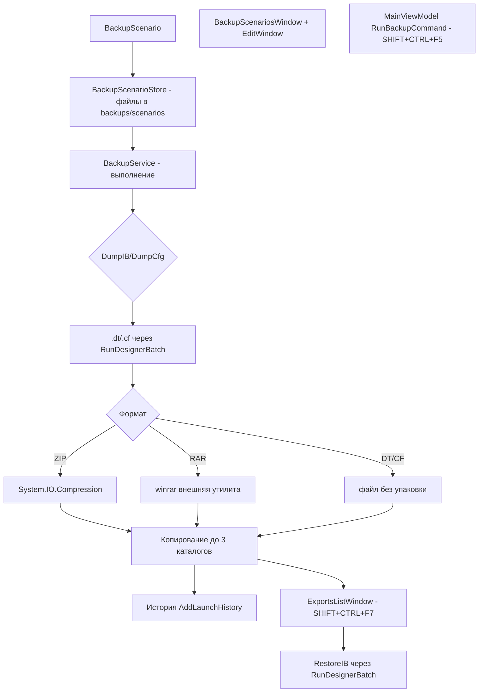

# План — Этап 2: Сценарии резервирования и восстановление

> Проект: «Управление конфигурациями 1С» (.NET 10, WPF на Windows / Avalonia 11 на Linux).
> Источник: [`plans/startmanager-features-roadmap.md`](startmanager-features-roadmap.md), раздел «Этап 2», функции №16, №18 StartManager.
> Текущая версия: `0.3.8.11`. После реализации поднять до **`0.3.8.12`**.
> Тип задачи: **декомпозиция в режиме Архитектора** → реализация в **режиме Code**. Этот документ — только план, кода здесь нет.

---

## 1. Цель и объём

Внедрить функционал StartManager №16 («Сценарии резервирования») и №18 («Список выгрузок / восстановление»):

1. Модель «Сценарий резервирования»: наименование, шаблон имени файла/архива,
   до 3 каталогов назначения, формат (DT/CF/ZIP/RAR), префикс базы, учётные данные.
2. Хранение сценариев в отдельных JSON-файлах, неограниченное количество.
3. Выполнение сценария для выбранной ИБ (**SHIFT+CTRL+F5**).
4. Форма «Список выгрузок» (**SHIFT+CTRL+F7**) с обзором созданных файлов
   и загрузкой данных обратно в ИБ (в т.ч. без интерактивного конфигуратора — `/RestoreIB`).
5. ZIP — через `System.IO.Compression`; RAR — через внешнюю утилиту (winrar),
   как опцию, зависящую от наличия архиватора.

**Ограничения этапа:** не реализуются блокировки сеансов (№19/№20), закладки и прочие
функции (это последующие этапы). Автозапуск сценариев по расписанию — вне объёма.
Код пишется сразу для обеих платформ (парные файлы `*.xaml`/`*.Avalonia.cs`);
чистые .NET модели/сервисы — один раз.

---

## 2. Архитектурные выводы (что учтено из существующего кода)

- **Существующая простая выгрузка уже есть.** [`OneCLauncher.RunDesignerBatch`](../Configuration%20Management/Services/OneCLauncher.DesignerBatch.cs:81)
  (Windows) и его парный вариант [`OneCLauncher.Linux.DesignerBatch.cs`](../Configuration%20Management/Services/OneCLauncher.Linux.DesignerBatch.cs:59)
  умеют пакетный запуск конфигуратора: `DumpIB` (`/DumpIB"path"`), `DumpCfg` (`/DumpCfg"path"`),
  `TestAndRepair` (`/IBCheckAndRepair -TestOnly`). Используют `BuildConnectionArgument`/`BuildAuthArgument`
  (авторизацию базы), лог `/Out`, события `DesignerBatchStarted`/`DesignerBatchCompleted`.
  **Нужно добавить операцию `RestoreIB`** (`/RestoreIB"path"`) — восстановление данных из `.dt`.
- **UI-индикатор выгрузки уже подключён.** `MainViewModel` подписан на события
  `DesignerBatchStarted`/`DesignerBatchCompleted` (см. [`MainViewModel.cs:211`](../Configuration%20Management/ViewModels/MainViewModel.cs:211))
  и ведёт `IsExporting`/`ExportIndicatorTooltip`. Новый сценарий переиспользует этот механизм,
  чтобы индикатор работал и для резервирования, и для восстановления.
- **Именование файлов.** `MainViewModel.BuildExportFileName` + `AddTimestampToExportFileName`
  /`ExportTimestampFormat` из [`AppSettings.cs`](../Configuration%20Management/Models/AppSettings.cs:445).
  В сценарии шаблон имени — свой, с подстановками: `{Base}` (префикс/имя базы),
  `{Timestamp}`, `{Date}`, `{Time}`.
- **Хранение данных.** Репозиторий держит файлы в каталоге активного профиля
  ([`InfobaseRepository.DataDirectory`](../Configuration%20Management/Services/InfobaseRepository.cs:72),
  `PlatformPaths.AppDataDirectory` или `profiles/<Id>/`). `AppSettings.NormalizeForLoad()`
  ([`AppSettings.cs:530`](../Configuration%20Management/Models/AppSettings.cs:530)) обязательно
  дополнить для новых коллекций, иначе NRE при старых конфигах.
- **Хоткеи.** Регистрируются в [`MainWindow.Hotkeys.cs`](../Configuration%20Management/Views/MainWindow.Hotkeys.cs:33)
  (`#if WINDOWS`, helper `Add`) и [`MainWindow.Avalonia.Hotkeys.cs`](../Configuration%20Management/Views/MainWindow.Avalonia.Hotkeys.cs:29)
  (`#if LINUX`, helper `AddHotkey`). Значения — из `AppSettings.Hotkey*`, наружу через свойства VM.
  SHIFT+CTRL+F5 / SHIFT+CTRL+F7 добавляются по этой же схеме (по образцу F9/ALT+F9 из Этапа 1).
- **Модель ИБ и авторизация.** [`Infobase`](../Configuration%20Management/Models/Infobase.cs:36)
  имеет `Name`, `Connection`, `ConfiguratorAuth` ([`InfobaseAuthSettings`](../Configuration%20Management/Models/InfobaseAuthSettings.cs:8): режим, `User`, `Password`),
  `AddLaunchHistory(mode, details)` ([`Infobase.cs:642`](../Configuration%20Management/Models/Infobase.cs:642)) —
  сюда писать записи о выполненном сценарии/восстановлении.
- **Параметры запуска.** `LaunchParametersWindow` — готовый диалог для строки параметров
  (пригодится при ручном указании `/RestoreIB` в карточке базы; сам механизм восстановления
  запускается через `RunDesignerBatch` без интерактивного окна конфигуратора).
  `OneCLaunchArgumentParser` уже знает `/RestoreIB` ([`OneCLaunchArgumentParser.cs:34`](../Configuration%20Management/Services/OneCLaunchArgumentParser.cs:34)).
- **MVVM + DI.** Регистрация сервисов в [`AppServices.cs`](../Configuration%20Management/AppServices.cs).
  Чистые сервисы (без UI-фреймворка) регистрируются в общем блоке.

---

## 3. Общая схема решения

---

## 4. Новые файлы (структура)

### 4.1. Модели (чистый .NET, кросс-платформенные)

| Файл | Назначение |
|------|-----------|
| `Models/BackupFormat.cs` | enum `BackupFormat { Dt, Cf, Zip, Rar }`. |
| `Models/BackupCredential.cs` | Опциональные учётные данные сценария: `User`, `Password`, `UseInfobaseAuth` (по умолчанию true). Пусто и `UseInfobaseAuth=true` → используется авторизация базы (`ConfiguratorAuth`). |
| `Models/BackupScenario.cs` | Сценарий: `Id` (GUID/строка), `Name`, `FileNameTemplate` (шаблон, по умолчанию `"{Base}_{Timestamp}"`), `TargetDirectories` (`List<string>`, от 1 до 3), `Format`, `BasePrefix` (префикс базы, подставляется в `{Base}` при пустом имени базы/для единообразия), `Credential` (`BackupCredential?`), `IncludeTimestamp` (bool, по умолчанию true). Метод `BuildFileName(string baseName, DateTime now)` для подстановки `{Base}`/`{Timestamp}`/`{Date}`/`{Time}`. |
| `Models/BackupExportItem.cs` | Строка «Списка выгрузок»: `FilePath`, `FileName`, `Directory`, `Extension`/`Format`, `SizeBytes`, `LastWriteTime`, `SourceScenarioName` (опц.), команда восстановления. |
| `Models/BackupRunResult.cs` | Результат выполнения сценария: `Success`, `CreatedFiles` (`IReadOnlyList<string>`), `ErrorMessage`, `ScenarioName`. |

> **Трактовка «пользователи».** В дорожной карте поле «пользователи». В контексте пакетного
> резервирования наиболее прикладной смысл — учётные данные (логин/пароль) для подключения
> к ИБ при выгрузке через конфигуратор. `BackupCredential` покрывает это, по умолчанию
> делегируя авторизации базы. При необходимости позже расширяется до списка пользователей
> (например, для массового применения к нескольким базам).

### 4.2. Сервисы (чистый .NET, кросс-платформенные)

| Файл | Назначение |
|------|-----------|
| `Services/IBackupScenarioStore.cs` | Интерфейс хранилища сценариев. |
| `Services/BackupScenarioStore.cs` | JSON-хранилище: `ScenariosDirectory = <DataDir>/backups/scenarios`; `LoadAll()` (по `*.json`), `Save(BackupScenario)`, `Delete(string id)`, `Get(string id)`. Имя файла — санитизированный `Id` (`.scenario.json`), чтобы избежать коллизий имён и кириллицы в пути. Сериализация — `JsonSerializerOptions` с отступами (по образцу `InfobaseRepository`). |
| `Services/IArchiveService.cs` | Интерфейс: `CreateArchive(string archivePath, IEnumerable<string> filesToAdd)`, `ExtractArchive(string archivePath, string targetDir)`, `bool CanProduce(BackupFormat format)`. |
| `Services/ArchiveService.cs` | Реализация: ZIP через `System.IO.Compression.ZipArchive` (файлы-думпы добавляются записями); RAR — вызов внешнего архиватора (winrar/rar): поиск exe в PATH + настройка `RarExecutablePath`; `CanProduce(Rar)` → наличие архиватора. Всё в try/catch, ошибки не роняют UI. |
| `Services/IBackupService.cs` | Интерфейс оркестратора. |
| `Services/BackupService.cs` | Выполнение сценария для `Infobase`: строит имя (`scenario.BuildFileName`), формирует первичный файл `.dt`/`.cf` через `OneCLauncher.RunDesignerBatch`, при формате ZIP/RAR пакует, копирует итог в каждый из `TargetDirectories`, возвращает `BackupRunResult`; подписан на `DesignerBatchCompleted`, чтобы дождаться успешного думпа перед упаковкой (асинхронность через TaskCompletionSource). Опциональный `BackupCredential` передаётся в новый overload `RunDesignerBatch`. |

Регистрация в `AppServices.cs` (общий блок, без UI-зависимостей):
`services.AddSingleton<IBackupScenarioStore, BackupScenarioStore>();`
`services.AddSingleton<IArchiveService, ArchiveService>();`
`services.AddSingleton<IBackupService, BackupService>();`

### 4.3. ViewModels

| Файл | Назначение |
|------|-----------|
| `ViewModels/BackupScenarioItemViewModel.cs` | Строка списка сценариев: `Name`, `Format`, `TargetSummary`, команды «Выполнить»/«Изменить»/«Удалить». |
| `ViewModels/BackupScenarioEditViewModel.cs` | Редактирование сценария (поля формы, валидация: имя непусто, 1–3 каталога, шаблон корректен). |
| `ViewModels/ExportsListViewModel.cs` | Модель «Списка выгрузок»: сканирование каталогов (`BackupTargetDirectories` из настроек + каталоги всех сценариев) на `.dt`/`.cf`/`.zip`/`.rar`, коллекция `ObservableCollection<BackupExportItem>`, команда «Обновить», «Восстановить», «Открыть папку». |

Команды в `MainViewModel` (обе платформы, по образцу `MainViewModel.Updates.cs` /
`MainViewModel.Avalonia.Updates.cs`):
- `ShowBackupScenariosCommand` — открыть окно «Сценарии резервирования».
- `RunBackupScenarioCommand` (SHIFT+CTRL+F5) — выполнить сценарий для выбранной ИБ
  (выбор сценария в диалоге, если их несколько; иначе сразу).
- `ShowExportsListCommand` (SHIFT+CTRL+F7) — открыть «Список выгрузок».
Свойства хоткеев `HotkeyRunBackup = "Ctrl+Shift+F5"`, `HotkeyExportsList = "Ctrl+Shift+F7"`.

### 4.4. Окна (парные WPF + Avalonia)

| WPF | Avalonia | Назначение |
|-----|----------|-----------|
| `Views/BackupScenariosWindow.xaml` + `.xaml.cs` | `Views/BackupScenariosWindow.Avalonia.cs` | Список сценариев: добавить/изменить/удалить/выполнить. |
| `Views/BackupScenarioEditWindow.xaml` + `.xaml.cs` | `Views/BackupScenarioEditWindow.Avalonia.cs` | Форма сценария: наименование, шаблон имени (+подсказка `{Base} {Timestamp}`), 1–3 каталога (список с добавлением/удалением), формат (ComboBox DT/CF/ZIP/RAR), префикс базы, учётные данные (чекбокс «из базы» + поля логин/пароль). |
| `Views/ExportsListWindow.xaml` + `.xaml.cs` | `Views/ExportsListWindow.Avalonia.cs` | «Список выгрузок»: таблица файлов (имя, каталог, размер, дата), кнопки «Обновить», «Восстановить» (подтверждение), «Открыть папку». |

> Модальные окна открываются как в Этапе 1: на WPF `ShowDialog()`, на Avalonia через
> `ModalWindowBase.ShowDialogSync` (см. [`MainViewModel.Avalonia.Launch.cs:76`](../Configuration%20Management/ViewModels/MainViewModel.Avalonia.Launch.cs:76)).

### 4.5. Локализация

Добавить ключи (группа `Backup.*` и `Restore.*`) в
[`Localization/Languages/ru.json`](../Configuration%20Management/Localization/Languages/ru.json)
и [`Localization/Languages/en.json`](../Configuration%20Management/Localization/Languages/en.json):

`Backup.ScenariosTitle`, `Backup.AddScenario`, `Backup.EditScenario`, `Backup.DeleteScenario`,
`Backup.Name`, `Backup.FileNameTemplate`, `Backup.TargetDirectories`, `Backup.Format`,
`Backup.BasePrefix`, `Backup.Credentials`, `Backup.UseInfobaseAuth`, `Backup.User`, `Backup.Password`,
`Backup.TemplateHint`, `Backup.RunTitle`, `Backup.SelectScenario`, `Backup.Running`,
`Backup.Done`, `Backup.Failed`, `Backup.NoBaseSelected`, `Backup.RarNotFound`,
`Restore.Title`, `Restore.Confirm`, `Restore.Running`, `Restore.Done`, `Restore.Failed`,
`Restore.OpenFolder`, `Restore.ExportFilter`.

---

## 5. Изменения существующих файлов

| Файл | Что меняется |
|------|--------------|
| [`OneCLauncher.DesignerBatch.cs`](../Configuration%20Management/Services/OneCLauncher.DesignerBatch.cs) (и `OneCLauncher.Linux.DesignerBatch.cs`) | Добавить `RestoreIB` в `DesignerBatchOperation`; ветку `RestoreIB => $"/RestoreIB\"{path}\""`; проверить наличие исходного файла и его корректность в `CompleteDesignerBatch`. Добавить overload `RunDesignerBatch(infobase, operation, outputPath, BackupCredential? credential = null)` и при `credential.UseInfobaseAuth == false` использовать `BuildAuthArgument` с переданными `User`/`Password`. |
| [`AppServices.cs`](../Configuration%20Management/AppServices.cs) | Регистрация `IBackupScenarioStore`, `IArchiveService`, `IBackupService` в общем блоке. |
| [`AppSettings.cs`](../Configuration%20Management/Models/AppSettings.cs) | Поля `HotkeyRunBackup = "Ctrl+Shift+F5"`, `HotkeyExportsList = "Ctrl+Shift+F7"`, `RarExecutablePath = ""`, `BackupTargetDirectories` (`List<string>`). Дополнить `NormalizeForLoad()`: `BackupTargetDirectories ??= new()`. |
| `MainViewModel.cs` + `MainViewModel.Avalonia.cs` | Команды сценариев/восстановления, свойства хоткеев, методы открытия окон, обработчик завершения операции (лог/индикатор), вызов `ib.AddLaunchHistory`. |
| `MainViewModel.Updates.cs` / `MainViewModel.Avalonia.Updates.cs` (или новый `MainViewModel.Backup.cs`) | Разместить новые команды и хоткеи по тому же паттерну. |
| [`MainWindow.Hotkeys.cs`](../Configuration%20Management/Views/MainWindow.Hotkeys.cs) | Регистрация `Ctrl+Shift+F5` и `Ctrl+Shift+F7`. |
| [`MainWindow.Avalonia.Hotkeys.cs`](../Configuration%20Management/Views/MainWindow.Avalonia.Hotkeys.cs) | То же для Avalonia. |
| `MainWindow.xaml` / `MainWindow.xaml.cs` / `MainWindow.Avalonia.*` | Кнопки/пункты меню «Сценарии резервирования» (SHIFT+CTRL+F5) и «Список выгрузок» (SHIFT+CTRL+F7) в панели инструментов/контекстном меню ИБ. |
| `Configuration Management.csproj` | В Linux-блоке `<Compile Remove>` для WPF-only `.xaml.cs` новых окон + `<Compile Include>` для `*Window.Avalonia.cs`, включение новых чистых ViewModels (по образцу Этапа 1). Поднять версию до `0.3.8.12` в четырёх полях (строки 62–65). |
| `ru.json` / `en.json` | Новые ключи `Backup.*`, `Restore.*`. |
| [`CHANGELOG.md`](../CHANGELOG.md) / [`README.md`](../README.md) / `_release/0.3.8.12.md` | Описание этапа (см. раздел 8). |

---

## 6. Выполнение сценария (SHIFT+CTRL+F5)

1. Если база не выбрана — сообщение через `IDialogService` (`Backup.NoBaseSelected`).
2. Открыть выбор сценария (диалог-список), если сценариев несколько; один — выполнить сразу.
3. `BackupService.RunAsync(infobase, scenario)`:
   - `fileName = scenario.BuildFileName(scenario.BasePrefix + infobase.Name, DateTime.Now)`
     с учётом `IncludeTimestamp` и `BackupScenarioStore`/настроек формата времени;
     расширение зависит от `Format` (`.dt`/`.cf`/`.zip`/`.rar`).
   - Основной файл формируется в первом из `TargetDirectories` (или во временном каталоге,
     если ни один не доступен — затем ошибка).
   - `OneCLauncher.RunDesignerBatch(ib, DumpIB|DumpCfg, primaryPath, credential)` → ждём
     `DesignerBatchCompleted` (TaskCompletionSource, таймаут). Если `!info.Success` — ошибка из лога.
   - Формат ZIP: `ArchiveService.CreateArchive(archivePath, [primaryPath])`; RAR: то же через
     внешний архиватор (`CanProduce(Rar)` иначе ошибка `Backup.RarNotFound`).
     Для DT/CF архив не создаём.
   - Копирование итогового файла в остальные `TargetDirectories` (перезапись).
   - `ib.AddLaunchHistory("Backup:<Scenario>", path)` + `SaveSilently()`.
4. Показать результат (список созданных файлов) через `IDialogService`.

---

## 7. «Список выгрузок» (SHIFT+CTRL+F7) и восстановление

### 7.1. Список выгрузок

- `ExportsListViewModel.Refresh()` сканирует: `AppSettings.BackupTargetDirectories`
  + каталоги назначения всех сценариев из `BackupScenarioStore`. Собирает файлы
  `.dt`, `.cf`, `.zip`, `.rar` (по рекурсии `Directory.GetFiles`), сортирует по дате убывания.
- Строки — `BackupExportItem` (имя, каталог, размер, дата, формат). Для ZIP/RAR формат
  определяется по расширению.
- Кнопки: «Обновить», «Открыть папку» (открыть проводник/файловый менеджер через
  `InfobaseMaintenanceService`-подобный вызов), «Восстановить».

### 7.2. Восстановление (в т.ч. без интерактивного конфигуратора — `/RestoreIB`)

1. Выбрать строку в списке (обычно `.dt`). Для `.zip`/`.rar` — распаковать во временный
   каталог через `ArchiveService.ExtractArchive`, взять первый `.dt`/`.cf`.
2. Подтверждение (`Restore.Confirm`): имя ИБ и файл.
3. `BackupService.RestoreAsync(infobase, dtFilePath)`:
   - `OneCLauncher.RunDesignerBatch(ib, DesignerBatchOperation.RestoreIB, dtFilePath, credential)`
     → ждёт завершения, проверяет `Success` (код 0; проверка «файл создан» для RestoreIB
     заменяется на «ошибка в логе отсутствует»).
   - `ib.AddLaunchHistory("RestoreIB", dtFilePath)` + `SaveSilently()`.
4. Показать результат через `IDialogService`.

> «Без открытия конфигуратора» обеспечено самим `/RestoreIB` в пакетном режиме DESIGNER
> (`/DisableStartupDialogs /DisableStartupMessages`), интерактивное окно 1С:Предприятия
> не открывается. Ручная альтернатива в карточке базы — строка `/RestoreIB"..."` в
> `LaunchParameters` через существующий `LaunchParametersWindow`.

---

## 8. Версия, CHANGELOG, README, release-заметка

После реализации в режиме Code (отдельные пункты todo):

1. **csproj**: четыре поля версии → `0.3.8.12` ([csproj:62–65](../Configuration%20Management/Configuration%20Management.csproj:62)).
2. **README.md**: обновить бейдж версии + добавить в раздел «Возможности»:
   «Сценарии резервирования (DT/CF/ZIP/RAR, до 3 каталогов)», «Выполнение сценария (SHIFT+CTRL+F5)»,
   «Список выгрузок и восстановление (SHIFT+CTRL+F7, /RestoreIB)».
3. **CHANGELOG.md**: запись сверху `## [0.3.8.12] — <дата>` с разделом о функциях №16/№18
   и пометкой о сборке обеих платформ.
4. **`_release/0.3.8.12.md`**: заметка для GitHub Release (что нового, скриншоты окон,
   ограничения: RAR требует установленного winrar; восстановление — только `.dt`).

---

## 9. Риски и решения

| # | Риск | Митигация |
|---|------|-----------|
| 1 | Асинхронность выгрузки: упаковка начинается до завершения думпа | `BackupService` ожидает `DesignerBatchCompleted` через TaskCompletionSource с таймаутом; при неуспехе — ошибка из лога `/Out`. |
| 2 | RAR отсутствует на машине | `ArchiveService.CanProduce(Rar)` проверяет `RarExecutablePath` + PATH; честный статус `Backup.RarNotFound`, предложение сменить формат на ZIP. |
| 3 | Путь/шаблон имени недопустим (кириллица, спецсимволы, `..`) | Санитизация имени из шаблона (`Path.GetInvalidFileNameChars`), валидация каталогов, `IsSafeCliValue` для аргументов `/DumpIB`/`/RestoreIB`. |
| 4 | Старые `settings.json` без новых полей → NRE | Дополнить `AppSettings.NormalizeForLoad()`. |
| 5 | Новая операция `RestoreIB` не попадает в Linux-ветку | Правка обоих парных файлов `OneCLauncher.DesignerBatch.cs` и `OneCLauncher.Linux.DesignerBatch.cs`; кросс-сборка `-p:ForceLinux=true`. |
| 6 | Расхождение двух платформ (WPF/Avalonia) | Парные файлы, общие чистые сервисы/модели, сборка обеих платформ в CI/локально. |
| 7 | Каталоги назначения недоступны (сетевой путь, отключён диск) | Проверка `Directory.Exists`/`CreateDirectory` перед записью, понятное сообщение об ошибке без падения. |
| 8 | Хоткеи Ctrl+Shift+F5/F7 конфликтуют | Значения из `AppSettings` (по умолчанию заданные), переназначаемы; регистрация по существующему образцу. |
| 9 | Восстановление большого `.dt` долгое | Индикатор выгрузки (`IsExporting`) уже работает через события `DesignerBatchStarted/Completed`; подтверждение перед восстановлением. |

---

## 10. Todo-список для реализации в режиме Code

- [ ] Создать модели `BackupFormat`, `BackupCredential`, `BackupScenario` (с `BuildFileName`),
      `BackupExportItem`, `BackupRunResult`.
- [ ] Создать `Services/IBackupScenarioStore.cs` и `Services/BackupScenarioStore.cs`
      (JSON-файлы в `backups/scenarios`, LoadAll/Save/Delete/Get).
- [ ] Создать `Services/IArchiveService.cs` и `Services/ArchiveService.cs`
      (ZIP через `System.IO.Compression`; RAR через внешний архиватор + `CanProduce`).
- [ ] Создать `Services/IBackupService.cs` и `Services/BackupService.cs`
      (выполнение сценария, ожидание DesignerBatch, упаковка, копирование в каталоги;
      `RestoreAsync` через `/RestoreIB`).
- [ ] Добавить `RestoreIB` в `DesignerBatchOperation` и ветку `/RestoreIB"path"` +
      overload с `BackupCredential` в `OneCLauncher.DesignerBatch.cs` и `OneCLauncher.Linux.DesignerBatch.cs`.
- [ ] Зарегистрировать сервисы в `AppServices.cs` (общий блок).
- [ ] Добавить в `AppSettings`: `HotkeyRunBackup="Ctrl+Shift+F5"`, `HotkeyExportsList="Ctrl+Shift+F7"`,
      `RarExecutablePath`, `BackupTargetDirectories` + правки `NormalizeForLoad()`.
- [ ] Создать ViewModels: `BackupScenarioItemViewModel`, `BackupScenarioEditViewModel`,
      `ExportsListViewModel`.
- [ ] Добавить в `MainViewModel` (обе платформы) команды `ShowBackupScenariosCommand`,
      `RunBackupScenarioCommand`, `ShowExportsListCommand` и свойства хоткеев.
- [ ] Создать окна (WPF + Avalonia): `BackupScenariosWindow`, `BackupScenarioEditWindow`,
      `ExportsListWindow`.
- [ ] Зарегистрировать хоткеи SHIFT+CTRL+F5 / SHIFT+CTRL+F7 в `MainWindow.Hotkeys.cs`
      и `MainWindow.Avalonia.Hotkeys.cs`.
- [ ] Добавить кнопки/пункты меню «Сценарии резервирования» и «Список выгрузок»
      в `MainWindow.xaml` и Avalonia-вариант.
- [ ] Обновить `Configuration Management.csproj`: Linux-блок (Remove/Include новых файлов),
      версия → `0.3.8.12` в четырёх полях.
- [ ] Добавить ключи локализации `Backup.*` и `Restore.*` в `ru.json` и `en.json`.
- [ ] Обновить `README.md` (бейдж версии + раздел «Возможности»).
- [ ] Добавить запись в шапку `CHANGELOG.md` (`## [0.3.8.12]`).
- [ ] Создать `_release/0.3.8.12.md`.
- [ ] Проверить сборку обеих платформ (Windows WPF и Linux `-p:ForceLinux=true`).