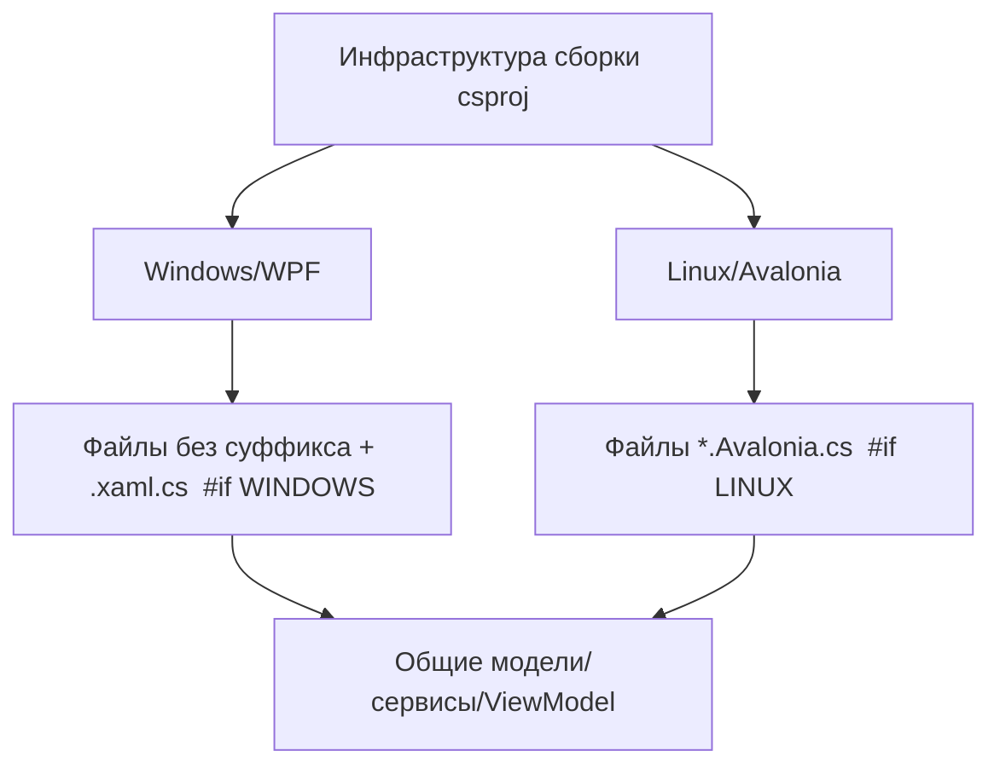

# План исправлений — версия 0.3.9.1

Репозиторий: `sivatorov/ConfigurationManagement`. Текущая версия: **0.3.9.0**.

План закрывает остаточные проблемы по 5 открытым issues (#250, #251, #252, #255, #260) по последним комментариям пользователя 7OH. Issues **не закрываются** — автор доносит правки и ждёт обратной связи.

---

## Выбор версии

**Новая версия: `0.3.9.1`** (патч).

Обоснование:
- Все изменения — только исправления багов в функциональности, уже заявленной в `0.3.9.0`. Новых возможностей нет → по semver это патч.
- Минорная цифра (`.9`) зарезервирована за «порцией» правок 0.3.9.0; предыдущий цикл правок шёл патчами (`0.3.8.x`), пока не накопился скачок функциональности. Этот выпуск — «доделывание» незакрытых issue, поэтому четвёртая цифра уместнее минорного скачка к `0.3.10.0`.
- `InformationalVersion` выводится в заголовок и используется сравнением обновлений ([`VersionInfo.Display()`](Configuration Management/VersionInfo.cs:16)), поэтому её нужно обновить одновременно со всеми 4 полями в csproj.

Файл: [`Configuration Management.csproj`](Configuration Management/Configuration Management.csproj:62)
- `Version`, `AssemblyVersion`, `FileVersion`, `InformationalVersion`: `0.3.9.0` → `0.3.9.1`.

---

## Архитектурная справка (как устроены две сборки)

Проект собирает две платформы из одних исходников:
- **Windows/WPF** — файлы без суффикса и `*.xaml.cs`, тела обёрнуты `#if WINDOWS` (пример: [`MainWindow.Events.cs`](Configuration Management/Views/MainWindow.Events.cs:1)).
- **Linux/Avalonia** — параллельные `*.Avalonia.cs`, тела обёрнуты `#if LINUX` (пример: [`MainWindow.Avalonia.Scroll.cs`](Configuration Management/Views/MainWindow.Avalonia.Scroll.cs:1)).
- **Общие файлы** (без суффикса, без `#if`) — модели, сервисы, ViewModel: используются обеими сборками (например [`PlatformVersionService.cs`](Configuration Management/Services/PlatformVersionService.cs), [`Infobase.cs`](Configuration Management/Models/Infobase.cs)).

Правило для правок: где баг проявляется в UI одного фреймворка — правим в конкретном файле этой сборки; где логика общая (разбор версии, модель разрядности) — правим общий файл, а применение раскидываем по обеим сборкам.



---

## ISSUE #260 — Закрытие окна «Определение конфигураций всех баз»

### Последний отзыв 7OH
«Похоже прошлый фикс ушел не туда — про линукс пока ни слова не было». Автор в 0.3.9.0 заявил, что исправил Linux/Avalonia, а Windows/WPF «уже была корректной». 7OH тестирует Windows → баг остался именно там.

### Корневая причина
- **Avalonia** (Linux) имеет полноценный подтверждающий обработчик с флагом повторного входа [`_closeConfirmed`](Configuration Management/Views/DetectConfigurationsWindow.Avalonia.cs:52) и логикой `e.Cancel = true` при ответе «Нет» ([`OnClosingConfirm`](Configuration Management/Views/DetectConfigurationsWindow.Avalonia.cs:277)) — здесь фикс реально ушёл.
- **WPF** (Windows) переопределяет [`OnClosing`](Configuration Management/Views/DetectConfigurationsWindow.xaml.cs:253) **без** `_closeConfirmed`: вопрос о подтверждении в сценарии повторного `Closing` может показываться повторно, а семантика отличается от Avalonia. Именно сюда, по словам 7OH, фикс «не ушёл».

### Правки

**Windows/WPF** — [`DetectConfigurationsWindow.xaml.cs`](Configuration Management/Views/DetectConfigurationsWindow.xaml.cs:253)
1. Добавить поле `private bool _closeConfirmed;`.
2. В `OnClosing`: при наличии отмеченных строк показать подтверждение; при согласии выставить `_closeConfirmed = true` и вызвать `base.OnClosing(e)`; при отказе — `e.Cancel = true; return;`. Ранний выход, если `e.Cancel` уже true или `_closeConfirmed == true`.
3. Кнопка «Закрыть» ([`OnClose_Click`](Configuration Management/Views/DetectConfigurationsWindow.xaml.cs:124)) продолжает идти через `Close()` → `OnClosing`, поэтому отдельной правки не требует; проверяем на регрессию.

**Linux/Avalonia** — [`DetectConfigurationsWindow.Avalonia.cs`](Configuration Management/Views/DetectConfigurationsWindow.Avalonia.cs:277)
- Оставить как есть (флаг и `e.Cancel` уже есть). Убедиться, что `_closeConfirmed` выставляется именно перед фактическим закрытием, чтобы повторный `Closing` не переспрашивал. Правки не требуются, только верификация.

**Тест (обе платформы):** отметить базы → нажать X и ответить «Нет» → окно остаётся, вопрос не повторяется; ответить «Да» → окно закрывается. Пустой список закрывается без вопроса.

---

## ISSUE #255 — «Список колбасит» (производительность/прыжки при прокрутке)

### Последний отзыв 7OH
«Размер скрола видно, что меняется при прокрутке… Перескок резко вниз при долистывании до нижней папки курсором… При запуске появляется горизонтальный не обоснованный ничем скрол. Похоже оно пытается восстановить строку и что-то выходит совсем не так».

### Корневая причина
Дерево [`MainTree`](Configuration Management/Views/MainWindow.xaml:1043) настроено на **пиксельную виртуализацию**: `CanContentScroll=True`, `ScrollUnit="Pixel"`, `VirtualizationMode="Recycling"`, `VirtualizingStackPanel`. При этом внутренний `ScrollViewer`:
1. **ExtentHeight/ExtentWidth флуктуируют** по мере материализации/ресайкла строк → встроенная вертикальная полоса меняет размер во время прокрутки.
2. ExtentWidth в моменты материализации **транзиентно превышает viewport** → появляется «лишний» горизонтальный скрол. Дополнительно `RevealAndSelectAfterRebuild` вызывает `item.BringIntoView()`, который умеет скроллить и по горизонтали.
3. «Перескок вниз» на нижней папке — `BringIntoView`/авто-скрол к выбранной строке при пиксельной виртуализации прыгает на произвольный offset.

### Правки

**Windows/WPF**
- [`MainWindow.xaml`](Configuration Management/Views/MainWindow.xaml:1057):
  - `ScrollViewer.HorizontalScrollBarVisibility="Disabled"` на `MainTree` (горизонталь ведёт внешний синхронизирующий `DbHeaderScroll`, строка независимо скроллить не должна). Это убирает «необоснованный горизонтальный скрол».
  - Для стабильности полосы рассмотреть `VirtualizingPanel.ScrollUnit="Item"` (extent = кол-во строк × фиксированная высота → полоса не «дышит»). Если строки с тегами имеют переменную высоту — оставить Pixel, но полосу пересчитывать по стабильной метрике (см. ниже).
- [`MainWindow.Scroll.cs`](Configuration Management/Views/MainWindow.Scroll.cs:109) `OnTreeScroll_ScrollChanged`:
  - Оставить реакцию только на изменение viewport (уже сделано). Дополнительно **отвязать** отображаемую полосу от флуктуирующего Extent: если используется внешняя/кастомная полоса — считать `Maximum = count × rowHeight − viewport`, `ViewportSize = viewport`, а не брать Extent напрямую.
- [`MainWindow.Tree.cs`](Configuration Management/Views/MainWindow.Tree.cs:313) `RevealAndSelectAfterRebuild`:
  - Заменить `item.BringIntoView()` на **вертикальную** прокрутку по индексу строки (без горизонтальной составляющей), либо после `BringIntoView` принудительно сбросить `HorizontalOffset = 0`.
- Проверить, что лишний горизонтальный скрол на старте не создаётся `RestoreTreeScrollAfterRebuild` — сбрасывать горизонтальную позицию при восстановлении.

**Linux/Avalonia**
- [`MainWindow.Avalonia.Scroll.cs`](Configuration Management/Views/MainWindow.Avalonia.Scroll.cs:56) `Sync()`: `bar.Maximum = Extent.Height − Viewport.Height` флуктуирует при изменении контента. Пересчитывать диапазон по стабильной метрике (кол-во строк × высота строки) и кэшировать, обновлять только по существенным изменениям.
- [`MainWindow.Avalonia.Tree.cs`](Configuration Management/Views/MainWindow.Avalonia.Tree.cs:330): убедиться, что восстановление строки не скроллит горизонталь; на дереве горизонтальная полоса отключена (`ScrollBarVisibility.Disabled`, уже есть в `AttachVerticalScrollBar`).

**Тест:** прокрутка мышью и клавишами «вниз» до нижней папки не должна давать резких перескоков; размер полосы стабилен; при старте нет горизонтального скрола.

---

## ISSUE #252 — «Скачет список»

### Последний отзыв 7OH
«Скачет меньше, остаётся в зоне видимости, но всё ещё пролистывает вверх и вниз со смещением, хотя это вообще не требуется же».

### Корневая причина
Восстановление позиции после пересборки дерева неточное:
- [`RestoreTreeScrollAfterRebuild`](Configuration Management/Views/MainWindow.Scroll.cs:56) восстанавливает **сырой пиксельный offset**, снятый до пересборки. После пересборки виртуализированное дерево имеет другой контент/высоты → сырой offset «садится не туда».
- В [`RestoreTreeKeyboardFocus`](Configuration Management/Views/MainWindow.Tree.cs:211) восстановление запускается **дважды** (Loaded + ApplicationIdle); второй проход вызывает `BringIntoView` и затирает восстановленную позицию.
- Восстановление выполняется сразу после раскрытия предков, когда layout ещё не устоялся.

### Правки

**Windows/WPF**
- [`MainWindow.Scroll.cs`](Configuration Management/Views/MainWindow.Scroll.cs:43) `RememberTreeScroll`:
  - Запоминать не только `VerticalOffset`, но и **ссылку на верхнюю видимую строку** (или её индекс), чтобы после пересборки восстановить позицию по этой строке, а не по «сырым» пикселям.
- [`RestoreTreeScrollAfterRebuild`](Configuration Management/Views/MainWindow.Scroll.cs:56):
  - Восстанавливать на **последнем** проходе (ApplicationIdle), а не на обоих; clamp `offset` к `[0, ScrollableHeight]`.
  - Применять после того, как предки раскрыты и layout устоялся (`UpdateLayout`).
- [`MainWindow.Tree.cs`](Configuration Management/Views/MainWindow.Tree.cs:219): восстановление прокрутки выполнять только на втором проходе (ApplicationIdle), первый (Loaded) оставить для выделения/фокуса.

**Linux/Avalonia**
- [`MainWindow.Avalonia.Scroll.cs`](Configuration Management/Views/MainWindow.Avalonia.Scroll.cs:94) `RememberTreeScroll` / [`RestoreTreeSelection`](Configuration Management/Views/MainWindow.Avalonia.Scroll.cs:109):
  - Запоминать верхний видимый узел и его offset; при восстановлении прокручивать к этому узлу, а не к абсолютному значению.
  - Clamp позиции к диапазону и применять один раз (текущий `DispatcherPriority.Background` — проверить, что не дублируется).

**Тест:** редактирование свойств базы, создание/удаление/регистрация базы не должны смещать список вверх/вниз; позиция остаётся там, где был пользователь.

---

## ISSUE #251 — Приоритет платформы для папки (частичной версии)

### Последний отзыв 7OH
«Пункт 2 и 3 исправлены. Пункт 1 пока ещё подставляет разрядность: сама версия остаётся ровной в свойствах, но оно зачем-то ставит "Приоритет 32"».

### Корневая причина (подтверждена кодом)
[`PlatformVersionService.ParseVariant`](Configuration Management/Services/PlatformVersionService.cs:593) **по умолчанию возвращает `architecture = "32"`**, если в строке нет суффикса «(32)/(64)»:

```csharp
version = variant;
architecture = "32";          // <-- дефолт x86 даже без суффикса
...
if (arch == "64" || arch == "32") { ... architecture = arch; }
```

Инлайн-пути выбора версии **не** проверяют явный суффикс и потому пишут x86 в поле `Architecture` базы при выборе «папки» (частичной версии «8.3» / «8.3.27»):
- WPF: [`OpenPlatformVersionPicker`](Configuration Management/Views/MainWindow.Events.cs:513) → `if (arch == "32" || arch == "64") ib.Architecture = arch;`
- Avalonia: [`PickPlatformVersionFor`](Configuration Management/ViewModels/MainViewModel.Avalonia.Tools.cs:555) → `if (arch is "32" or "64") infobase.Architecture = arch;`

Окно свойств ([`ConnectionSettingsWindow.xaml.cs`](Configuration Management/Views/ConnectionSettingsWindow.xaml.cs:386)) уже защищено проверкой `result.Contains('(')` — поэтому там не воспроизводится; баг именно в инлайн-выборе.

### Правки

**Общий файл** — [`PlatformVersionService.cs`](Configuration Management/Services/PlatformVersionService.cs:593) (+ зеркально [`PlatformVersionService.Linux.cs`](Configuration Management/Services/PlatformVersionService.Linux.cs:501)):
- Добавить хелпер, отличающий «разрядность задана явно» от «не задана», например `public static bool HasExplicitArchitecture(string variant)` (ищет подстроку `"(32)"`/`"(64)"`). Альтернатива — изменить дефолт `ParseVariant` на `""`, но это рискованно (много вызовов полагаются на «32» по умолчанию), поэтому предпочтителен отдельный хелпер.
- Существующий `ParseVariant` не менять (обратная совместимость).

**Windows/WPF** — [`MainWindow.Events.cs`](Configuration Management/Views/MainWindow.Events.cs:520):
- Записывать `ib.Architecture = arch` только если `arch` задан явно: `if ((arch is "32" or "64") && PlatformVersionService.HasExplicitArchitecture(selected))`.

**Linux/Avalonia** — [`MainViewModel.Avalonia.Tools.cs`](Configuration Management/ViewModels/MainViewModel.Avalonia.Tools.cs:562):
- Аналогичный guard: `if ((arch is "32" or "64") && PlatformVersionService.HasExplicitArchitecture(selected))`.

**Поведение:** выбор папки/частичной версии оставляет `Architecture` базы нетронутым (разрядность разрешается лаунчером — сессия/приоритет базы), не подставляя x86.

**Тест:** у базы с частичной версией («8.3.27») через инлайн-выбор сменить/подтвердить версию → разрядность не меняется, надпись «Приоритет 32»/«x86» не появляется; полная версия с явным «(64)» по-прежнему пишет x64.

---

## ISSUE #250 — Место для двойного клика (колонка «Платформа»)

### Последний отзыв 7OH
«Всё ещё запускает базу, если мимо надписи двойной клик». Фикс 0.3.9.0 с определением колонки по `Tag="PlatformVersion"` не сработал.

### Корневая причина
- Ячейка платформы — это [`TextBlock`](Configuration Management/Views/MainWindow.xaml:1578) с `HorizontalAlignment="Left"` и `Tag="PlatformVersion"`. `TextBlock` попадает под хит-тест **только по области текста**, пустая часть колонки не является целью.
- Обработчик двойного клика [`OnInfobaseTree_PreviewMouseDoubleClick`](Configuration Management/Views/MainWindow.Events.cs:366) для пустой области опирается на хрупкую связку: `OriginalSource` → поиск `InfobaseRowGrid` → `FindDescendantWithTag` + `GetColumnIndexAt(ibGrid, pos.X)`. На пустой области этот путь срабатывает не всегда, и событие проваливается в ветку «запустить базу».

### Правки

**Windows/WPF**
- [`MainWindow.xaml`](Configuration Management/Views/MainWindow.xaml:1578): обернуть TextBlock колонки платформы в растягивающийся на всю ячейку контейнер-хиттаргет:
  - `<Border Grid.Column="…" Tag="PlatformVersion" Background="Transparent" HorizontalAlignment="Stretch" Cursor="Hand">` с вложенным TextBlock (`HorizontalAlignment="Left"`).
  - Важно: у обёртки `Grid.ColumnSpan="1"`, чтобы [`ReorderGridColumns`](Configuration Management/Views/MainWindow.Columns.cs:135) корректно перемещал её через `Grid.SetColumn` (проверить, что attached-ключ `GetColumnKey/SetColumnKey` переносится на обёртку).
- [`MainWindow.Events.cs`](Configuration Management/Views/MainWindow.Events.cs:366):
  - Добавить обработчик `MouseDoubleClick`/`PreviewMouseLeftButtonDown` с подсчётом `ClickCount == 2` на обёртке, который сразу открывает `OpenPlatformVersionPicker` и ставит `e.Handled = true` (ветка «запустить базу» не достигается).
  - Блок динамического определения колонки ([`MainWindow.Events.cs`](Configuration Management/Views/MainWindow.Events.cs:391)) становится резервным/может быть удалён — теперь вся ячейка ловится по `Tag` на обёртке (существующие ветки с `FindAncestorWithTag` уже отработают по пустой области).

**Linux/Avalonia**
- [`MainWindow.Avalonia.Tree.cs`](Configuration Management/Views/MainWindow.Avalonia.Tree.cs:328): там ячейка уже растянута (`HorizontalAlignment=Stretch`) и имеет `DoubleTapped` с `e.Handled=true`. Проверить, что двойной клик по пустой части колонки не пробрасывается в `card.DoubleTapped` строки (приоритет/порядок событий) — при необходимости добавить признак «обработано колонкой версии».

**Тест:** двойной клик и по надписи версии, и по пустому месту колонки «Платформа» открывает выбор версии и НЕ запускает базу; двойной клик по другим колонкам/имени по-прежнему запускает базу по правилу действия.

---

## Сводная таблица файлов и платформ

| Issue | Общий файл | Windows/WPF | Linux/Avalonia |
|---|---|---|---|
| #260 | — | [`DetectConfigurationsWindow.xaml.cs`](Configuration Management/Views/DetectConfigurationsWindow.xaml.cs:253) (добавить `_closeConfirmed`) | [`DetectConfigurationsWindow.Avalonia.cs`](Configuration Management/Views/DetectConfigurationsWindow.Avalonia.cs:277) (верификация) |
| #255 | — | [`MainWindow.xaml`](Configuration Management/Views/MainWindow.xaml:1057), [`MainWindow.Scroll.cs`](Configuration Management/Views/MainWindow.Scroll.cs:109), [`MainWindow.Tree.cs`](Configuration Management/Views/MainWindow.Tree.cs:313) | [`MainWindow.Avalonia.Scroll.cs`](Configuration Management/Views/MainWindow.Avalonia.Scroll.cs:56), [`MainWindow.Avalonia.Tree.cs`](Configuration Management/Views/MainWindow.Avalonia.Tree.cs:330) |
| #252 | — | [`MainWindow.Scroll.cs`](Configuration Management/Views/MainWindow.Scroll.cs:43), [`MainWindow.Tree.cs`](Configuration Management/Views/MainWindow.Tree.cs:219) | [`MainWindow.Avalonia.Scroll.cs`](Configuration Management/Views/MainWindow.Avalonia.Scroll.cs:94) |
| #251 | [`PlatformVersionService.cs`](Configuration Management/Services/PlatformVersionService.cs:593), [`PlatformVersionService.Linux.cs`](Configuration Management/Services/PlatformVersionService.Linux.cs:501) | [`MainWindow.Events.cs`](Configuration Management/Views/MainWindow.Events.cs:520) | [`MainViewModel.Avalonia.Tools.cs`](Configuration Management/ViewModels/MainViewModel.Avalonia.Tools.cs:562) |
| #250 | — | [`MainWindow.xaml`](Configuration Management/Views/MainWindow.xaml:1578), [`MainWindow.Events.cs`](Configuration Management/Views/MainWindow.Events.cs:366) | [`MainWindow.Avalonia.Tree.cs`](Configuration Management/Views/MainWindow.Avalonia.Tree.cs:328) (верификация) |
| Версия | [`Configuration Management.csproj`](Configuration Management/Configuration Management.csproj:62) | общее | общее |

---

## Порядок работ и верификация

1. Поднять версию в csproj до `0.3.9.1`.
2. Внести правки по каждому issue (WPF и Avalonia параллельно, где применимо).
3. Собрать обе сборки без ошибок (как в фикс-комментариях автора).
4. Ручной чек-лист по каждой платформе:
   - #260 — подтверждение закрытия окна определения конфигураций (обе сборки).
   - #255 — стабильная полоса, нет горизонтального скрола, нет перескока к нижней папке.
   - #252 — позиция списка не «скачет» после пересборки дерева.
   - #251 — выбор папки не подставляет x86/приоритет 32.
   - #250 — двойной клик по пустой части колонки платформы открывает выбор версии.
5. Записать изменения в `_release/0.3.9.1.md`, обновить `CHANGELOG.md`.
6. Issues **не закрывать** — оставить открытыми до подтверждения 7OH.