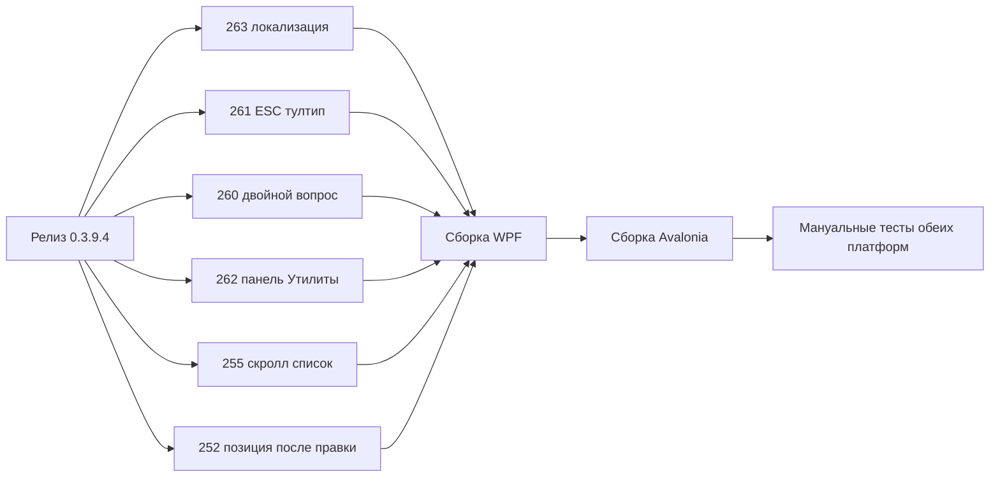

# План исправлений — релиз 0.3.9.4

Репозиторий: `sivatorov/ConfigurationManagement`
Целевая версия после исправлений: **0.3.9.4**
Платформы: Windows/WPF (`#if WINDOWS`) + Linux/Avalonia (`#if LINUX`), единая база кода.
Автор issues: 7OH (Semion). Актуальные issues: #263, #262, #261, #260, #255, #252.

> Принцип: каждый issue правится сразу в обеих платформенных реализациях (WPF и Avalonia),
> чтобы не разошлись по поведению. Порядок в плане — от «быстрых и изолированных» к
> «глубоким» (прокрутка/пересборка списка). Все правки затем сводятся в один релиз 0.3.9.4.

---

## Сводка правок по файлам

| Файл | Issues |
|---|---|
| `Configuration Management/Views/DetectConfigurationsWindow.xaml.cs` | #260 (WPF) |
| `Configuration Management/Views/DetectConfigurationsWindow.Avalonia.cs` | #260 (Avalonia) |
| `Configuration Management/Views/MainWindow.Hotkeys.cs` | #261 (WPF ESC) |
| `Configuration Management/Views/MainWindow.Avalonia.Hotkeys.cs` | #261 (Avalonia ESC) |
| `Configuration Management/Views/MainWindow.xaml` (+ контекстное меню) | #262 (WPF панель) |
| `Configuration Management/Views/MainWindow.Avalonia.cs` | #262 (Avalonia панель) |
| `Configuration Management/Views/MainWindow.Avalonia.Tree.cs` | #262 (перенос пункта), #255 |
| `Configuration Management/Views/MainWindow.Tree.cs` | #255, #252 (WPF) |
| `Configuration Management/Views/MainWindow.Scroll.cs` | #255, #252 (WPF) |
| `Configuration Management/Views/MainWindow.Avalonia.Scroll.cs` | #252 (Avalonia) |
| `Configuration Management/Controls/LeveledTreeView.Avalonia.cs` | #255 (Avalonia навигация) |
| `Configuration Management/Controls/LeveledTreeView.cs` | #255 (WPF, при необходимости) |
| `Configuration Management/Localization/Languages/ru.json` / `en.json` | #263, #262 |
| `Configuration Management/Views/SettingsWindow.xaml(.cs)` | #263 |

---

## Issue #263 — «Нужны пояснения к режиму функциональности»

**Суть (по тексту issue, скриншот):** появилась новая функциональность, но вместо
человекочитаемого описания пользователь видит «ключ к описанию» (сырую строку ключа
локализации).

**Предполагаемый источник:** в сборку ветки `reorder/scroll/fixes` попали новые элементы
UI (режим функциональности, тултипы колонок/панели), чьи ключи локализации отсутствуют
или подставлены как литералы. Кандидаты по коду:
- блок «Режим функциональности» в [`SettingsWindow.xaml`](Configuration Management/Views/SettingsWindow.xaml:1435) — комбобокс `FunctionalModeComboBox` и хинты `FunctionalMode.UserHint / .LaunchConfigPresent / .LaunchConfigAbsent / .Portable`;
- тултипы колонок через `ColumnHeaderTooltipKey` в [`MainWindow.Avalonia.Columns.cs`](Configuration Management/Views/MainWindow.Avalonia.Columns.cs:348);
- тултипы сегментов списка `Main.AllBasesTooltip / FavoritesTooltip / RecentTooltip` и правой панели `Main.CurrentSessionHelp`.

**Шаги:**
1. Воспроизвести: открыть главное окно и окно «Настройки», навести на элементы с тултипами
   (сегменты «Все/Избранное/Недавние», колонки таблицы, поле «Режим функциональности»).
2. Найти элемент, где вместо текста виден ключ. Проверить наличие ключа в обоих словарях
   [`ru.json`](Configuration Management/Localization/Languages/ru.json) и [`en.json`](Configuration Management/Localization/Languages/en.json).
3. Если ключ отсутствует — добавить описание в **оба** файла (ru + en) с той же семантикой.
   Примеры недостающих вероятных ключей для режима функциональности:
   - `FunctionalMode.SpecialistHint` — пояснение режима «Специалист» (полный набор операций со списком без разработческих инструментов);
   - `FunctionalMode.DeveloperHint` — пояснение «Разработчик» (все возможности, включая инструменты конфигуратора);
   - при необходимости `FunctionalMode.LabelTooltip` для самого GroupBox/комбобокса.
4. Добавить защитный fallback в [`LocalizationManager.T()`](Configuration Management/Localization/LocalizationManager.cs):
   если ключ не найден и не является зарегистрированным — возвращать не «сырой» ключ, а пустую
   строку или текст из default-языка, чтобы UI никогда не показывал ключ буквально.
5. Связать подсказку выбранного режима в [`SettingsWindow.xaml.cs`](Configuration Management/Views/SettingsWindow.xaml.cs:286)
   (`InitializeFunctionalModeUi`): выводить описательный хинт для любого режима (User / Specialist / Developer),
   а не только для «Пользователь».

**Критерий готовности:** ни один тултип/подпись в главном окне и настройках не содержит
видимых «сырых» ключей; у каждого режима функциональности есть пояснение на ru и en.

---

## Issue #262 — «Кнопки общих команд»

**Суть:** кнопка «Актуальные релизы» сейчас живёт в контекстном меню конкретной базы,
хотя команда глобальная. Предлагается вынести её на общую панель (где настройки) и
спроектировать подменю «Утилиты» для будущих общих команд.

**Текущее размещение:**
- Avalonia: [`MainWindow.Avalonia.Tree.cs`](Configuration Management/Views/MainWindow.Avalonia.Tree.cs:1569) `BuildRowContextMenu()` → `MenuAction("Updates.ActualReleasesTitle", _vm.ShowActualReleasesCommand, ...)`.
- WPF: аналогичный пункт в контекстном меню строки (конструктор меню в code-behind главного окна).
- Горячая клавиша Alt+F9 уже работает из панели команд ViewModel (`ShowActualReleasesCommand`,
  [`MainWindow.Avalonia.Hotkeys.cs`](Configuration Management/Views/MainWindow.Avalonia.Hotkeys.cs:83)).

**Шаги:**
1. **Добавить кнопку «Актуальные релизы» на верхнюю панель команд** рядом с настройками:
   - Avalonia — в [`BuildCommandPanel()`](Configuration Management/Views/MainWindow.Avalonia.cs:432)
     перед блоком «Настройки» (после `CommandPanelSeparator()`), кнопка `IconCloudDownload`,
     `ToolTip = Updates.ActualReleasesTitle`, `Command = ShowActualReleasesCommand`.
   - WPF — в разметке [`MainWindow.xaml`](Configuration Management/Views/MainWindow.xaml) на той же панели
     (рядом с кнопкой настроек), та же команда и тултип.
2. **Спроектировать подменю «Утилиты»** для общих команд (этот шаг — каркас, не перегружать):
   - Avalonia: на панели создать кнопку/выпадающий `Button` со стрелкой «Утилиты»
     (`Main.Utilities`), открывающий `ContextMenu`/`Flyout`, в котором собрать глобальные команды.
   - WPF: `MenuItem` «Утилиты» в том же месте панели.
3. **Перенести глобальные пункты из контекстного меню строки в «Утилиты»:**
   - «Актуальные релизы» — обязательно убрать из `BuildRowContextMenu()` и перенести в «Утилиты» + отдельную кнопку.
   - Кандидаты на перенос (по тексту issue: «список типовых, блокировка приложения и прочие»):
     `Updates.ManageList` (список типовых), `AppLock.LockTitle` (блокировка приложения),
     `SessionLock.Title`, `Restore.Title` (список выгрузок), `Backup.ScenariosTitle` (сценарии),
     очистка кешей `cacheMenu`. Решение о полном составе зафиксировать отдельно; минимальный
     объём релиза — перенос «Актуальных релизов» + создание подменю «Утилиты».
4. **Новые ключи локализации** (`Main.Utilities`, `Main.UtilitiesTooltip`, при необходимости
   `Updates.ActualReleasesShort`) в [`ru.json`](Configuration Management/Localization/Languages/ru.json)
   и [`en.json`](Configuration Management/Localization/Languages/en.json).
5. Учесть компактный режим: переносить общие команды в скрываемую область/подменю, чтобы
   верхняя панель не «распухала» (переиспользовать существующий механизм `UiMetrics`/compact).

**Критерий готовности:** «Актуальные релизы» доступны с общей панели на обеих платформах,
в контекстном меню базы пункта больше нет; подменю «Утилиты» создано и содержит перенесённые
глобальные команды; горячая клавиша Alt+F9 продолжает работать.

---

## Issue #261 — «ESC и открытая подсказка»

**Суть:** если открыт любой ToolTip в главном окне, то ESC закрывает/сворачивает окно,
а подсказка остаётся «висеть». Ожидается: первый ESC закрывает подсказку, последующие —
окно.

**Текущая обработка ESC:**
- WPF: [`MainWindow.Hotkeys.cs`](Configuration Management/Views/MainWindow.Hotkeys.cs:258) `Window_PreviewKeyDown` — ветка `Esc → в трей` (`MinimizeToTray()`).
- Avalonia: [`MainWindow.Avalonia.Hotkeys.cs`](Configuration Management/Views/MainWindow.Avalonia.Hotkeys.cs:166)
  — сначала закрытие модального диалога, затем `Esc → в трей` (`Hide()`).

**Шаги:**
1. Добавить хелпер **`CloseOpenToolTips()`**, который находит и закрывает открытую подсказку:
   - WPF: обойти `Application.Current.Windows` и визуальные деревья контролов,
     где `System.Windows.Controls.ToolTip.IsOpen == true` (или через `ToolTipService.GetIsOpen`),
     и выставить `IsOpen = false`.
   - Avalonia: обойти `TopLevel`/визуальное дерево и для элементов с
     `Avalonia.Controls.ToolTip.GetIsOpen(el) == true` вызвать `ToolTip.SetIsOpen(el, false)`
     (наблюдение за `ToolTip.IsOpenProperty` не требуется, достаточно разового закрытия).
2. **Вставить вызов перед логикой «Esc в трей»**:
   - WPF: в [`Window_PreviewKeyDown`](Configuration Management/Views/MainWindow.Hotkeys.cs:259)
     на ветке `Key.Escape` — если `CloseOpenToolTips()` вернул true (подсказка была открыта),
     то `e.Handled = true; return;` — окно не прячем.
   - Avalonia: в [`OnPreviewKeyDown`](Configuration Management/Views/MainWindow.Avalonia.Hotkeys.cs:176)
     перед веткой `EscapeToTray` — аналогично: закрыть подсказку, пометить обработанным,
     не уводить окно в трей.
3. Убедиться, что подсказки в модальных диалогах не затрагиваются (хелпер применяется только
   к главному окну), и что поведение не конфликтует с закрытием модального диалога по ESC
   (ветка «диалог» остаётся первой).

**Критерий готовности:** при открытой подсказке первый ESC закрывает только подсказку;
второй ESC сворачивает/прячет окно (в трей) — на обеих платформах.

---

## Issue #260 — «Закрытие окна Определения конфигураций всех баз»

**Суть:** при досрочном закрытии окна вопрос подтверждения появляется дважды: пользователь
нажимает «Нет», и этот же вопрос возникает второй раз. Фиксы 0.3.9.0/0.3.9.1 не помогли.

**Анализ кода:**
- WPF [`OnClosing`](Configuration Management/Views/DetectConfigurationsWindow.xaml.cs:257):
  флаг `_closeConfirmed` ставится только при `Confirm(...) == true`; при «Нет» → `e.Cancel = true; return;`
  без guard-флага «вопрос уже показан».
- Avalonia [`OnClosingConfirm`](Configuration Management/Views/DetectConfigurationsWindow.Avalonia.cs:277):
  аналогично — только `_closeConfirmed`, guard-флага «показываем вопрос» нет.
- `IDialogService.Confirm` показывает модальное окно в **вложенном цикле сообщений**
  ([`WpfDialogService`](Configuration Management/Services/WpfDialogService.cs:24) `ShowDialog()`,
  [`AvaloniaDialogService`](Configuration Management/Services/AvaloniaDialogService.cs:35) → `PushFrame`).

**Первопричина повторного вопроса:** пока вопрос показан, работает вложенный цикл сообщений.
Повторный `Closing` (например, ещё одно нажатие на «крест»/повторный запрос закрытия,
приходящий во время модального показа) снова попадает в обработчик, `_closeConfirmed` ещё
false, строки ещё отмечены → вопрос показывается снова. Guard-флаг должен стоять **до**
показа вопроса, а не после согласия.

**Шаги:**
1. Добавить поле **`_closePromptOpen`** (признак «вопрос сейчас на экране») в обе версии окна.
2. В начале обработчика закрытия:
   ```
   if (e.Cancel || _closeConfirmed || _closePromptOpen)
       return;
   ```
3. Обернуть показ вопроса в `try/finally`:
   ```
   if (_rows.Any(r => r.IsChecked))
   {
       _closePromptOpen = true;
       try
       {
           if (_dialogs.Confirm(CloseConfirm, Title))
               _closeConfirmed = true;
           else
           {
               e.Cancel = true;
               return;
           }
       }
       finally
       {
           _closePromptOpen = false;
       }
   }
   base.OnClosing(e);   // WPF
   ```
   Avalonia: вместо `base.OnClosing` — просто не выставлять `e.Cancel`, когда согласие получено.
4. Дополнительно: при выборе «Нет» гарантировать, что запрос закрытия полностью «проглочен»
   (WPF — `e.Cancel = true` и `return`; Avalonia — `e.Cancel = true`). Это уже есть, но проверить,
   что повторный `Closing` не приходит из-за самого модального окна (валидно для обоих случаев
   после guard-флага).

**Критерий готовности:** досрочное закрытие окна при отмеченных строках показывает вопрос
ровно один раз; «Нет» отменяет закрытие без повторного вопроса; «Да» закрывает окно один раз.

---

## Issue #255 — «Проблемы построения списка баз»

Два оставшихся бага:
- **(а) горизонтальный необоснованный скролл при запуске;**
- **(б) перескок вниз при медленном листании клавишами на папке (группе).**

Известные узкие места (по комментарию ksv47): `ReorderGridColumns`, `QueueHeaderAlign`,
`GetTreeScrollViewer`, `OnTreeScroll_ScrollChanged`, `ScrollSelectedIntoView`,
`RequestBringIntoView`, `ScrollUnit`.

### Баг (а) — горизонтальный скролл при запуске

**Анализ:** внутренний `ScrollViewer` дерева настроен на `VirtualizingPanel.ScrollUnit="Pixel"`
([`MainWindow.xaml`](Configuration Management/Views/MainWindow.xaml:1062)), а
`OnTreeScroll_ScrollChanged` синхронизирует горизонталь из внешнего `DbHeaderScroll`
([`MainWindow.Scroll.cs`](Configuration Management/Views/MainWindow.Scroll.cs:150)). На старте
ширина заголовка/контента до устоявшейся раскладки может превышать вьюпорт, и горизонтальный
offset дерева уезжает вправо. `RestoreTreeScrollAfterRebuild` уже сбрасывает горизонталь
([`MainWindow.Scroll.cs`](Configuration Management/Views/MainWindow.Scroll.cs:95)), но только
после пересборки, а на самом старте этого недостаточно.

**Шаги:**
1. В [`OnTreeScroll_ScrollChanged`](Configuration Management/Views/MainWindow.Scroll.cs:150):
   гасить горизонтальную синхронизацию, пока вертикальная раскладка не устоялась — не применять
   `ScrollToHorizontalOffset`, если дерево ещё не доведено (`MainTree.IsLoaded` false / ширина
   вьюпорта 0). Либо всегда принудительно держать `treeScroll.HorizontalOffset = 0`, поскольку
   горизонтальная прокрутка дерева не используется (колонки синхронизирует внешний заголовок).
2. В [`AttachTreeScrollHandler`](Configuration Management/Views/MainWindow.Scroll.cs:141) при
   подписке сразу `ScrollToHorizontalOffset(0)`.
3. На старте (Loaded) добавлять сброс горизонтали после первого `QueueHeaderAlign`.
4. Проверить `ReorderGridColumns` ранний выход (уже есть, [`MainWindow.Columns.cs`](Configuration Management/Views/MainWindow.Columns.cs:208)):
   не даёт ли `QueueHeaderAlign` пересборку сеток до устоявшейся ширины — при необходимости
   дополнительно склеивать вызовы флагом (аналог `_headerAlignQueued`).

### Баг (б) — перескок вниз при листании на папке

**Анализ:** [`ScrollSelectedIntoView`](Configuration Management/Views/MainWindow.Tree.cs:375)
считает `bottom = top + item.ActualHeight`. Для **контейнера группы** `ActualHeight` включает
высоту ВСЕХ дочерних строк (subtree). При листании на группу с большим числом баз
`bottom >> viewportBottom`, и список «перепрыгивает» вниз на огромную величину. Для баз-строк
проблемы нет, поэтому баг проявляется именно «на папке». Аналогично в Avalonia
[`LeveledTreeView.Avalonia.cs`](Configuration Management/Controls/LeveledTreeView.Avalonia.cs:155)
`rows[target].BringIntoView()` тоже может уводить список на высоту всей группы.

**Шаги:**
1. В WPF `ScrollSelectedIntoView`: для узла-группы прокручивать по **шапке группы**, а не по
   полной высоте контейнера:
   - взять высоту первой строки/заголовка группы (например, первый `TreeViewItem`-потомок или
     высоту шапки без учёта `ItemsHost`), либо
   - ограничить дельту прокрутки: `delta = Clamp(bottom - viewportBottom, 0, viewportHeight)`.
2. Аналогично для Avalonia: в `OnNavigationKeyDown`/`BringIntoView` для группы использовать
   прокрутку, рассчитанную по верхнему краю/шапке, а не по полному `Bounds.Height` контейнера
   (`PageStep` уже считает по координатам — распространить тот же подход на шаг ↓).
3. Держать `QueueScrollSelectedIntoView` склеенной по флагу (уже есть) — проверить, что
   автоповтор клавиши не накапливает отложенные вызовы с «грязными» целями.
4. Проверить `OnMainTree_RequestBringIntoView` (`e.Handled = true`, [`MainWindow.Tree.cs`](Configuration Management/Views/MainWindow.Tree.cs:542))
   — он глушит штатный BringIntoView; убедиться, что ручной расчёт в `ScrollSelectedIntoView`
   корректен для групп после ограничения дельты.

**Критерий готовности:** при запуске нет горизонтальной полосы/смещения; медленное листание
клавишами по группе перемещает выделение по одной строке без скачка вниз — на обеих платформах.

---

## Issue #252 — «Прокрутка списка после правки свойств»

**Суть:** смещение списка сохраняется/остаётся после сохранения свойств базы. Требование:
если ключевое не изменилось (группа, видимость) — позицию не пересчитывать. Фиксы
0.3.8.28/0.3.9.0/0.3.9.1 не решили.

**Анализ:** после сохранения свойств дерево пересобирается. WPF:
`RestoreTreeKeyboardFocus` → два прохода `RevealAndSelectAfterRebuild(restoreScroll: false/true)`
([`MainWindow.Tree.cs`](Configuration Management/Views/MainWindow.Tree.cs:211));
прокрутка восстанавливается в `RestoreTreeScrollAfterRebuild` по верхней видимой строке
([`MainWindow.Scroll.cs`](Configuration Management/Views/MainWindow.Scroll.cs:73)).
Avalonia: `TreeRebuilding → RememberTreeScroll`, `TreeRebuilt → RestoreTreeSelection`
([`MainWindow.Avalonia.cs`](Configuration Management/Views/MainWindow.Avalonia.cs:159)).

**Причина остаточного смещения:** `item.BringIntoView()` в
[`RevealAndSelectAfterRebuild`](Configuration Management/Views/MainWindow.Tree.cs:316) двигает
список к строке, а восстановление по «якорной» строке/offset после пересборки не совпадает
с исходной позицией из-за изменения высот/виртуализации. Если база не меняла группу и
осталась видимой, правильнее вообще не трогать позицию.

**Шаги:**
1. **Захват «ключевого состояния» до пересборки** (`RememberTreeScroll`):
   - сохранить `_treeScrollAnchorData` (уже есть);
   - дополнительно запомнить для выбранной базы: её группу (по ссылке/NodeKey) и признак
     видимости (не в свёрнутой группе, не скрыта фильтром поиска) — поля вида
     `_treeScrollAnchorGroup`, `_treeScrollAnchorVisible`.
2. **В `RevealAndSelectAfterRebuild`/`RestoreTreeScrollAfterRebuild`:** если
   группа не изменилась И база всё ещё видима — **пропустить `item.BringIntoView()`** и
   восстановить точный `VerticalOffset` (`_treeScrollOffset`), а не «якорную» строку; если
   группа/видимость изменились — выполнять BringIntoView (как сейчас).
3. Avalonia: в `RestoreTreeSelection` ([`MainWindow.Avalonia.Scroll.cs`](Configuration Management/Views/MainWindow.Avalonia.Scroll.cs:109))
   аналогично: если ключевое не изменилось, не делать BringIntoView-подтяжку, сразу
   `scroll.Offset = offset`.
4. Убедиться, что установка выбора `_tree.SelectedItem` не тянет строку автоматически
   (`AutoScrollToSelectedItem`) при неизменной позиции — при необходимости временно отключать
   автоскролл на время восстановления неизменной позиции.
5. Тестовый сценарий: редактирование свойств базы (без смены группы) в обеих платформах —
   позиция прокрутки не сдвигается.

**Критерий готовности:** после сохранения свойств базы без смены группы/видимости положение
списка идентично прежнему; при смене группы — корректный BringIntoView к строке.

---

## Порядок реализации и проверки

1. #263 — локализация (самое изолированное).
2. #261 — ESC и тултип (изолированный хоткей).
3. #260 — guard-флаг в окне определения конфигураций (изолированное окно).
4. #262 — перенос кнопки + подменю «Утилиты» (UI-изменение, требует мануальной проверки).
5. #255 — горизонтальный скролл + перескок на папке (прокрутка списка).
6. #252 — восстановление позиции после правки свойств (пересборка дерева).
7. Обновить версию до 0.3.9.4, подготовить release-notes.



---

## Рекомендуемые проверочные сценарии (для релиза)

- [#263] Открыть «Настройки» → «Режим функциональности»; навести на элементы — нигде нет «сырых» ключей; у каждого режима есть подсказка.
- [#262] С верхней панели открывается «Актуальные релизы»; в контекстном меню базы пункта больше нет; подменю «Утилиты» работает; Alt+F9 работает.
- [#261] Открыть любую подсказку в главном окне, нажать ESC — закрывается подсказка, окно остаётся; второй ESC — в трей.
- [#260] В окне «Определение конфигураций» отметить строки, закрыть окно → вопрос один раз; «Нет» — окно остаётся без повторного вопроса; «Да» — закрывается.
- [#255] Запуск — нет горизонтальной полосы/смещения; листание клавишами по папке с множеством баз — без скачка вниз.
- [#252] Правка свойств базы без смены группы — позиция списка не сдвигается; со сменой группы — корректный переход к строке.