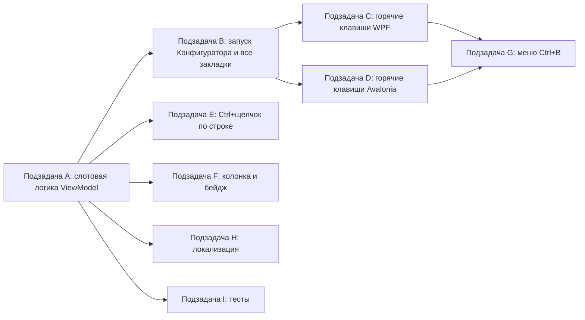

# План: «Доработать горячие клавиши для избранных» (закладки 1–9)

> Только планирование и декомпозиция. Код в рамках этого документа не пишется.
> Проект — .NET (Avalonia + WPF), две параллельные реализации через директивы
> `#if WINDOWS` (WPF) и `#if LINUX` (Avalonia) в одних и тех же файлах, либо
> файлы-пары `*.cs` / `*.Avalonia.cs`.

---

## 1. Обзор архитектуры существующего кода

### Модель данных
- [`Infobase.cs`](Configuration%20Management/Models/Infobase.cs) — `INotifyPropertyChanged`. Уже содержит поля для закладок:
  - `IsFavorite` (bool, строка 50);
  - `FavoriteHotkeyNumber` (int, 1–9, 0 = не назначен, строка 62) + вычисляемое `FavoriteHotkeyDisplay` («1»…«9» или пусто, строка 73).
- [`AppSettings.cs`](Configuration%20Management/Models/AppSettings.cs) — сохраняемые настройки. Уже содержит:
  - `HotkeyFavorite` (string, «F8», строка 341) — хоткей переключения избранного;
  - `FavoriteHotkeyIds` (`List<string>`, строка 403) — упорядоченный список ключей слотов закладок (до 9);
  - `ShowFavoritesButton`, `ShowFavoritesOnly` и ширины колонок;
  - нормализация null → пустой список в `EnsureDefaults` (строка 649).

### ViewModel (`MainViewModel`, partial, два билда)
- Общие поля/события — [`MainViewModel.cs`](Configuration%20Management/ViewModels/MainViewModel.cs): `_favoriteHotkeyIds`, событие `FavoriteHotkeysChanged`, `_hotkeyFavorite`.
- Слоты избранного живут в [`MainViewModel.Commands.cs`](Configuration%20Management/ViewModels/MainViewModel.Commands.cs) (WPF) и [`MainViewModel.Avalonia.Launch.cs`](Configuration%20Management/ViewModels/MainViewModel.Avalonia.Launch.cs) (Avalonia):
  - `FavoriteKey(ib)` — стабильный ключ: `Id` или `"name:" + Name`;
  - `SyncFavoriteHotkeys()` — пересчёт слотов (добавляет избранные без слота в порядке имени, назначает `FavoriteHotkeyNumber = idx+1`, удаляет слоты не-избранных);
  - `SetFavoriteHotkeyOrder(...)` — ручная перенумерация из окна настроек;
  - `FindByFavoriteKey(key)`;
  - `LaunchFavoriteByHotkey(int number)` — запуск Предприятия по Alt+N:
    - WPF: напрямую `_launcher.Launch(ib, OneCLaunchMode.Enterprise)` (строки 645–669);
    - Avalonia: `SelectedInfobase = ib; Launch(_launchVm.LaunchCommand, LaunchKind.Enterprise)` (строки 440–452).
  - `GetFavoriteHotkeyNumber(ib)` (WPF, строка 672).
- Команды: `ToggleFavoriteCommand`, `ToggleFavoriteForCommand`, `TogglePinCommand` (конструкторы в `MainViewModel.cs` и `MainViewModel.Avalonia.Commands.cs`).
- Модель запуска: [`LaunchKind.cs`](Configuration%20Management/Models/LaunchKind.cs) (`Enterprise/Configurator/Thin*/Thick*`), режим `OneCLaunchMode`.

### Горячие клавиши (главное окно)
- **WPF** — [`MainWindow.Hotkeys.cs`](Configuration%20Management/Views/MainWindow.Hotkeys.cs):
  - `RegisterLaunchHotkeys()` — регистрирует пользовательские хоткеи в `InputBindings` (удаляет всё, кроме Alt+1…9);
  - `RegisterFavoriteHotkeys()` (строка 187) — регистрирует Alt+1…9 → `LaunchFavoriteByHotkey(i)`;
  - `Window_PreviewKeyDown` (строка 212) — надёжный fallback для Alt+1…9 и Ctrl+Shift+±;
  - `TryParseKeyGesture`, `IsAllowedWithoutModifier`.
- **Avalonia** — [`MainWindow.Avalonia.Hotkeys.cs`](Configuration%20Management/Views/MainWindow.Avalonia.Hotkeys.cs):
  - `RegisterHotkeys()` (строка 30) — очищает `KeyBindings`, первыми добавляет Alt+1…9, затем пользовательские `AddHotkey(...)`; отдельный Preview-обработчик в `.Events.cs`.
- Перерегистрация при смене состава слотов: WPF подписан на `FavoriteHotkeysChanged` → `RegisterFavoriteHotkeys()` ([`MainWindow.xaml.cs`](Configuration%20Management/Views/MainWindow.xaml.cs:255)).

### UI списка баз / колонок
- **Avalonia**: строки строятся кодом в [`MainWindow.Avalonia.Tree.cs`](Configuration%20Management/Views/MainWindow.Avalonia.Tree.cs) — `RowMarkButton(...)` (звезда/булавка) + `FavoriteSlotBadge(card, ib)` (плашка с номером, видимость по `FavoriteHotkeyDisplay`, строки 240–258); колонки в [`MainWindow.Avalonia.Columns.cs`](Configuration%20Management/Views/MainWindow.Avalonia.Columns.cs) (`AddListColumns`, `ListColumns`, `ActionsOffsetInColumns`).
- **WPF**: разметка строки в [`MainWindow.xaml`](Configuration%20Management/Views/MainWindow.xaml) + код в [`MainWindow.Columns.cs`](Configuration%20Management/Views/MainWindow.Columns.cs) и `MainWindow.Tree.cs`.
- Контрол строки: [`InfobaseRowCard.Avalonia.cs`](Configuration%20Management/Controls/InfobaseRowCard.Avalonia.cs) (Avalonia) и `InfobaseRowCard.xaml` (WPF) — Border/карточка, PointerEntered/PointerExited, подписки на тему.

### Настройки окна «Закладки»
- [`SettingsWindow.Hotkeys.cs`](Configuration%20Management/Views/SettingsWindow.Hotkeys.cs) и [`SettingsWindow.Avalonia.cs`](Configuration%20Management/Views/SettingsWindow.Avalonia.cs) — список `FavoriteHotkeyIds` с возможностью переупорядочивания (`SetFavoriteHotkeyOrder`).

### Тесты
- [`Etap13ListStateTests.cs`](ConfigurationManagement.Tests/Etap13ListStateTests.cs) — xUnit, тестируют чистые свойства модели и дефолты `AppSettings`.

---

## 2. Что уже реализовано и что «дорабатываем»

Уже работает (база для доработки):
- Хранение слотов закладок (`FavoriteHotkeyIds`) и присвоение номера (`FavoriteHotkeyNumber`);
- Колонка с иконкой + плашкой номера у избранных баз;
- Запуск Предприятия по Alt+1…9;
- Переупорядочивание слотов в окне настроек.

Доработка по ТЗ (основной объём):
- Явная установка номера и «установка/снятие» закладки через Ctrl+щелчок, Ctrl+Shift+P, Ctrl+Shift+[1..9];
- Навигация по закладкам Ctrl+[1..9] + раскрытие свёрнутой группы; меню Ctrl+B;
- Очистка: Ctrl+щелчок (снять), Ctrl+Alt+X (все), удаление конкретной закладки;
- Запуск: Alt+N — Предприятие (есть), Ctrl+Alt+N — Конфигуратор, Alt+E — все закладки.

---

## 3. Модель хранения закладок

**Рекомендация: переиспользовать существующие `AppSettings.FavoriteHotkeyIds` + `Infobase.FavoriteHotkeyNumber`.** Термин «закладка» трактуем как «избранная база с назначенным слотом». Это минимизирует изменения и сохраняет обратную совместимость с уже сохранёнными настройками.

Ключевые решения:
1. Номер слота хранится только в `FavoriteHotkeyIds` (индекс+1); `Infobase.FavoriteHotkeyNumber` — производное значение, которое выставляет `SyncFavoriteHotkeys()`. НЕ хранить номер в самой базе как источник истины, чтобы избежать рассинхрона.
2. Ключ слота — `FavoriteKey(ib)` (`Id` либо `"name:" + Name`). Сохраняется в `AppSettings.FavoriteHotkeyIds`.
3. Правила уникальности:
   - `AssignSlot(ib, n)`: если слот `n` занят другой базой — освободить её (перевести на свободный слот или оставить без номера); новую базу пометить `IsFavorite = true`.
   - `AssignNextFreeSlot(ib)`: первый свободный слот 1..9; если все заняты — замена самого младшего по времени добавления либо отказ (решить на этапе реализации; рекомендую отказ с подсказкой).
   - `RemoveFromSlot(ib)`: убрать ключ из списка; `IsFavorite` при этом НЕ сбрасывать (чтобы «звезда» осталась, а номер ушёл), либо решить: ТЗ «снять закладку» = снять номер. Рекомендуется: снять номер, сохранив избранность.
   - `ClearAllSlots()`: очистить список (номера сбросить), избранность сохранить.
4. Сохранение — через существующие `SaveSilently()`/`ScheduleSaveSettings()`; во всех мутациях вызывать `SyncFavoriteHotkeys()`.

Изменения в модели:
- В `Infobase` при необходимости добавить только вспомогательное свойство (например, `HasBookmark` = `FavoriteHotkeyNumber >= 1`) — опционально, для UI-привязок колонки «Закладка».

---

## 4. Декомпозиция на подзадачи

### Подзадача A. Расширение ViewModel (общая логика слотов)
Файлы (обе версии):
- [`MainViewModel.Commands.cs`](Configuration%20Management/ViewModels/MainViewModel.Commands.cs) (WPF);
- [`MainViewModel.Avalonia.Launch.cs`](Configuration%20Management/ViewModels/MainViewModel.Avalonia.Launch.cs) и `MainViewModel.Avalonia.Commands.cs` (Avalonia);
- `MainViewModel.cs` — регистрация новых команд в конструкторе.

Шаги:
1. Добавить методы работы со слотами:
   - `AssignBookmarkSlot(Infobase? ib, int number)` — явная установка номера (п. 3.3);
   - `AssignNextFreeSlot(Infobase? ib)` — для Ctrl+Shift+P и Ctrl+щелчка;
   - `RemoveBookmark(Infobase? ib)` — снять номер;
   - `ClearAllBookmarks()` — очистить все слоты;
   - `NavigateToBookmark(int number)` — выбрать базу и раскрыть ветку (см. шаг 3);
   - `LaunchBookmark(int number, bool configurator)` — единая точка запуска (Предприятие/Конфигуратор);
   - `LaunchAllBookmarks()` — запуск всех занятых слотов.
2. Все методы в конце вызывают `SyncFavoriteHotkeys()` и сохраняют настройки.
3. `NavigateToBookmark` использует раскрытие ветки по образцу `PrepareLastSelectionExpansion()` ([`MainViewModel.cs`](Configuration%20Management/ViewModels/MainViewModel.cs:765)): найти группу базы, развернуть цепочку `SetExpandedSilent(true)`, затем `SelectedInfobase = ib`; в Avalonia при необходимости пересобрать дерево (`RebuildTree()`) и проскроллить к строке; в WPF — выделить элемент в TreeView.
4. Добавить команды (`RelayCommand`):
   - `SetBookmarkForCommand` (параметр `Infobase` или `null` = выбранная) → следующий свободный слот;
   - `AssignBookmarkSlotCommand` (параметр int) → явный номер;
   - `RemoveBookmarkCommand` (параметр `Infobase`);
   - `ClearAllBookmarksCommand`;
   - `NavigateBookmarkCommand` (параметр int);
   - `LaunchBookmarkEnterpriseCommand` / `LaunchBookmarkConfiguratorCommand` (параметр int);
   - `LaunchAllBookmarksCommand`;
   - `ShowBookmarksMenuCommand` (для Ctrl+B).

### Подзадача B. Запуск Конфигуратора и «запуск всех»
Файлы: те же файлы ViewModel + проверка механизмов запуска.
Шаги:
1. `LaunchBookmark(number, isConfigurator)`:
   - WPF: `_launcher.Launch(ib, isConfigurator ? OneCLaunchMode.Configurator : OneCLaunchMode.Enterprise)` (по образцу строк 645–669); обновлять `LastLaunchDate`, `ScheduleSave()`, `NotifyAfterLaunch()`.
   - Avalonia: `SelectedInfobase = ib; Launch(_launchVm.LaunchCommand, isConfigurator ? LaunchKind.Configurator : LaunchKind.Enterprise)`.
2. `LaunchAllBookmarks()`:
   - Получить список баз по `_favoriteHotkeyIds` в порядке слотов.
   - WPF: последовательный прямой вызов `_launcher.Launch(...)`.
   - Avalonia: отметить асимметрию (запуск идёт через UI-команду). Либо реализовать последовательный запуск через тот же `Launch(...)` с передачей каждой базы, либо добавить прямой путь лаунчера. На этапе реализации зафиксировать поведение (лучше — единый цикл с прямым вызовом лаунчера на обеих платформах, если это позволяет архитектура Avalonia).
   - Ограничить/подтверждать массовый запуск (опционально) подсказкой.

### Подзадача C. Горячие клавиши (WPF)
Файлы: [`MainWindow.Hotkeys.cs`](Configuration%20Management/Views/MainWindow.Hotkeys.cs), [`MainWindow.xaml.cs`](Configuration%20Management/Views/MainWindow.xaml.cs).
Шаги:
1. Расширить `RegisterLaunchHotkeys()`/новый метод `RegisterBookmarkHotkeys()`:
   - Ctrl+Shift+P → `SetBookmarkForCommand` (выбранная база);
   - Ctrl+Shift+D1..D9 → `AssignBookmarkSlotCommand` с номером;
   - Ctrl+D1..D9 → `NavigateBookmarkCommand`;
   - Ctrl+Alt+X → `ClearAllBookmarksCommand`;
   - Ctrl+Alt+D1..D9 → `LaunchBookmarkConfiguratorCommand`;
   - Alt+E → `LaunchAllBookmarksCommand`;
   - Ctrl+B → `ShowBookmarksMenuCommand`.
2. Учесть резервирование: эти сочетания «системные» — их надо удалять из `InputBindings` и ставить ПЕРЕД пользовательскими, как это делается для Alt+1…9 в `RegisterFavoriteHotkeys()` (иначе пользовательский хоткей перебьёт).
3. В `Window_PreviewKeyDown` добавить надёжный fallback для новых сочетаний (по аналогии с блоком Alt+1…9, строка 294+), особенно для Ctrl+Alt+D1..D9 и Ctrl+D1..D9 (наборы цифр могут перехватываться фокусом).
4. Подписку `FavoriteHotkeysChanged` расширить на перерегистрацию новых привязок.

### Подзадача D. Горячие клавиши (Avalonia)
Файлы: [`MainWindow.Avalonia.Hotkeys.cs`](Configuration%20Management/Views/MainWindow.Avalonia.Hotkeys.cs), `MainWindow.Avalonia.Events.cs`.
Шаги:
1. В `RegisterHotkeys()` после блока Alt+1…9 и ПЕРЕД `AddHotkey(...)` добавить новые `KeyBinding` (Ctrl+Shift+P, Ctrl+Shift+D1..D9, Ctrl+D1..D9, Ctrl+Alt+X, Ctrl+Alt+D1..D9, Alt+E, Ctrl+B).
2. В Preview-обработчике `.Events.cs` добавить fallback (особенно наборы с Ctrl/Ctrl+Alt на цифрах), с проверкой фокуса, чтобы не мешать полю поиска.
3. Проверить, что `RegisterHotkeys()` вызывается (перерегистрируется) при `FavoriteHotkeysChanged` так же, как в WPF.

### Подзадача E. Ctrl+щелчок по строке базы
Файлы:
- Avalonia: [`InfobaseRowCard.Avalonia.cs`](Configuration%20Management/Controls/InfobaseRowCard.Avalonia.cs) или обработчик клика в `MainWindow.Avalonia.Tree.cs`;
- WPF: `InfobaseRowCard.xaml` / `MainWindow.xaml` (обработчик `PreviewMouseLeftButtonDown`).
Шаги:
1. Определить Ctrl+щелчок по строке (не по кнопке звезды/булавки): проверить модификатор `Ctrl` и факт щелчка по телу карточки.
2. Логика: если у базы есть номер — `RemoveBookmark(ib)`, иначе `AssignNextFreeSlot(ib)`. `e.Handled = true`.
3. Убедиться, что Ctrl+щелчок не конфликтует с Ctrl+щелчком множественного выделения (если такое используется в дереве) — проверить существующее поведение.

### Подзадача F. Колонка/бейдж закладки в UI
Файлы:
- Avalonia: [`MainWindow.Avalonia.Tree.cs`](Configuration%20Management/Views/MainWindow.Avalonia.Tree.cs), [`MainWindow.Avalonia.Columns.cs`](Configuration%20Management/Views/MainWindow.Avalonia.Columns.cs);
- WPF: `MainWindow.xaml`, [`MainWindow.Columns.cs`](Configuration%20Management/Views/MainWindow.Columns.cs).
Шаги:
1. Колонка закладок уже есть через `ShowFavoritesButton` (звезда + плашка номера). При необходимости переименовать в «Закладка», гарантировать показ номера 1..9 иконкой для всех баз с назначенным слотом.
2. Обновить `ActionsOffsetInColumns`/`ListColumns` при изменении числа ведущих колонок.
3. Добавить строку-счётчик закладок (например, в тултип кнопки или заголовок колонки) — опционально.

### Подзадача G. Меню Ctrl+B (список закладок)
Файлы:
- WPF: `MainWindow.xaml` / `MainWindow.xaml.cs`, [`MainWindow.Hotkeys.cs`](Configuration%20Management/Views/MainWindow.Hotkeys.cs);
- Avalonia: `MainWindow.Avalonia.cs` / `.Tree.cs`.
Шаги:
1. `ShowBookmarksMenuCommand`: построить динамическое `ContextMenu`/`Popup` с пунктами «1. Имя базы — Предприятие / Конфигуратор», «Очистить все» (Ctrl+Alt+X), «Без закладок».
2. Пункты строятся из `_favoriteHotkeyIds` + `FindByFavoriteKey`.
3. Подключить показ относительно текущей позиции курсора или центра окна; горячие клавиши пунктов — Alt+N/Ctrl+Alt+N.

### Подзадача H. Локализация
Файлы: ресурсы локализации (`Resources/*.resx`/LocalizationManager).
Шаги:
1. Добавить строки: названия новых пунктов меню, тултипы, сообщения («Все закладки очищены», «Все 9 слотов заняты»), подписи горячих клавиш.
2. Добавить настраиваемые хоткеи (если требуется) в `AppSettings` + секцию настроек (`SettingsWindow.Hotkeys.cs`/`.Avalonia.Hotkeys.cs`).

### Подзадача I. Тесты
Файлы: `ConfigurationManagement.Tests/` — новый файл (например `EtapHotkeysFavoritesTests.cs`).
Шаги:
1. `FavoriteHotkeyDisplay`: 0 → «», 1..9 → цифра, 10/‑1 → «».
2. `AppSettings.FavoriteHotkeyIds`: дефолт пустой; нормализация null (уже есть в `EnsureDefaults`, закрепить тестом).
3. Если слотовая логика вынесена в чистый статический помощник — протестировать: `AssignSlot` (конфликт слотов), `AssignNextFreeSlot` (первый свободный, переполнение), `RemoveFromSlot`, `ClearAllSlots`.
4. `FavoriteKey`: `Id` предпочтительнее `name:`-фолбэка.

---

## 5. Стратегия горячих клавиш (сводно)

| Действие | Сочетание | Где регистрируется | Команда/метод |
|---|---|---|---|
| Установить закладку (след. свободный слот) | Ctrl+Shift+P, Ctrl+щелчок | Hotkeys + обработчик строки | `SetBookmarkForCommand` |
| Установить конкретный номер | Ctrl+Shift+[1..9] | Hotkeys | `AssignBookmarkSlotCommand` |
| Перейти к закладке (раскрыть группу) | Ctrl+[1..9] | Hotkeys (+Preview) | `NavigateBookmarkCommand` |
| Меню закладок | Ctrl+B | Hotkeys | `ShowBookmarksMenuCommand` |
| Снять закладку | Ctrl+щелчок | обработчик строки | `RemoveBookmarkCommand` |
| Очистить все | Ctrl+Alt+X | Hotkeys | `ClearAllBookmarksCommand` |
| Запустить Предприятие | Alt+[1..9] (уже есть) | RegisterFavoriteHotkeys | `LaunchFavoriteByHotkey` |
| Запустить Конфигуратор | Ctrl+Alt+[1..9] | Hotkeys (+Preview) | `LaunchBookmarkConfiguratorCommand` |
| Запустить все закладки | Alt+E | Hotkeys | `LaunchAllBookmarksCommand` |

Принципы подключения:
- Системные (резервированные) сочетания удаляются/перерегистрируются и ставятся ПЕРЕД пользовательскими (как в `RegisterFavoriteHotkeys`/порядке `RegisterHotkeys` в Avalonia).
- Для сочетаний с цифрами и Alt использовать `PreviewKeyDown`-fallback (WPF `Window_PreviewKeyDown`, Avalonia аналог в `.Events.cs`), т.к. `KeyBinding` с Alt/Ctrl на цифрах может перехватываться фокусом или системой.
- Пользовательские настраиваемые хоткеи не должны конфликтовать с системными — при изменении настроек проверять/исключать зарезервированные.

---

## 6. Рекомендации по тестам

- Тестировать чистую логику слотов, а не UI-привязки (xUnit, как в `Etap13ListStateTests`).
- Кандидаты на вынос в тестируемый статический класс: `AssignSlot`, `AssignNextFreeSlot`, `RemoveFromSlot`, `ClearAllSlots`, `FavoriteKey`.
- Закрепить дефолты и сериализацию `AppSettings.FavoriteHotkeyIds` (включая миграцию null → пустой список).
- Не тестировать горячие клавиши напрямую (среда Avalonia/WPF не гоняется в тестах проекта).

---

## 7. Порядок выполнения подзадач

Рекомендуемый порядок:
1. **A** — ядро (слотовая логика + команды), чтобы всё остальное могло вызывать готовые методы.
2. **B** — запуск Конфигуратора/всех (зависит от A).
3. **C** и **D** — горячие клавиши на обеих платформах (параллельно, от A/B).
4. **E** — Ctrl+щелчок по строке (от A).
5. **F** — колонка/бейдж (можно раньше, от A).
6. **G** — меню Ctrl+B (от A, C/D).
7. **H** — локализация (по мере добавления UI).
8. **I** — тесты (в конце, но писать по мере появления чистых методов).

---

## 8. Риски и открытые вопросы

- **Семантика «закладка vs избранное»**: решение — закладка = избранная база с номером. Требует подтверждения пользователя/ТЗ.
- **«Снять закладку»**: сбрасывать только номер или и `IsFavorite`? Рекомендуется — только номер.
- **Ctrl+щелчок и множественное выделение**: проверить, используется ли Ctrl+клик для мультивыбора в дереве, чтобы не сломать.
- **Конфликт Ctrl+Alt+[1..9] / Ctrl+[1..9] с пользовательскими хоткеями**: нужна защита резервированных сочетаний при сохранении настроек.
- **Массовый запуск в Avalonia** (Alt+E): архитектурное расхождение механизмов запуска WPF/Avalonia — потребуется единый подход или документированное отличие.
- **Ctrl+Shift+P** может конфликтовать с системными/будущими сочетаниями — проверить на этапе интеграции.
- **Перерегистрация**: убедиться, что новые привязки перерегистрируются по `FavoriteHotkeysChanged` в обеих версиях.