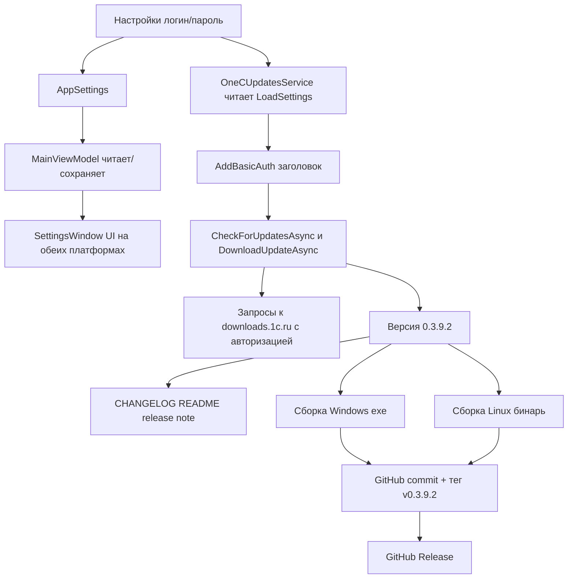

# План: настройки логина/пароля для авторизации на сайте 1С при проверке обновлений конфигураций

## Проблема

В версии `0.3.8.11` добавлена проверка обновлений типовых конфигураций 1С по web-ресурсу
`downloads.1c.ru` ([`OneCUpdatesService`](Configuration Management/Services/OneCUpdatesService.cs)).
В заметках релиза указано ограничение: «Для доступа к части каталогов 1С может требоваться
авторизация на сайте 1С». Однако настроек логина/пароля нет: [`OneCUpdatesService`](Configuration Management/Services/OneCUpdatesService.cs:44)
использует статический `HttpClient` без учётных данных.

## Цель

Добавить в приложение настройки логина/пароля для доступа к защищённым каталогам
`downloads.1c.ru` и передавать их в виде **HTTP Basic Auth** заголовка
(`Authorization: Basic base64(логин:пароль)`) при проверке обновлений и скачивании дистрибутива.

Текущая версия приложения: `0.3.9.1`. Новая версия: **`0.3.9.2`**.

## Решение

### 1. Модель настроек

В [`AppSettings`](Configuration Management/Models/AppSettings.cs) добавить два поля рядом
с существующими настройками проверки обновлений (`HotkeyCheckUpdate` / `HotkeyActualReleases`):

- `string UpdatesLogin { get; set; } = ""` — логин учётной записи сайта 1С.
- `string UpdatesPassword { get; set; } = ""` — пароль.

Пароль хранится в `settings.json` так же, как остальные пароли приложения
(например `Connection.Password` / `BackupCredential.Password`) — открытой строкой,
что соответствует существующей практике проекта.

### 2. Передача учётных данных в OneCUpdatesService

[`OneCUpdatesService`](Configuration Management/Services/OneCUpdatesService.cs) регистрируется
в DI как singleton ([`AppServices`](Configuration Management/AppServices.cs:29)). Внедрить
в его конструктор `IInfobaseRepository` (тоже singleton) для чтения настроек через `LoadSettings()`.

Добавить приватный метод добавления Basic-заголовка:

```
AddBasicAuth(HttpRequestMessage request)
    settings = _repository.LoadSettings()
    if заданы UpdatesLogin (непустой):
        token = Base64("UpdatesLogin:UpdatesPassword")
        request.Headers.Authorization = new("Basic", token)
```

Применить в обоих сетевых методах:

- [`CheckForUpdatesAsync`](Configuration Management/Services/OneCUpdatesService.cs:90) — заменить
  `HttpClient.GetAsync(url, ct)` на создание `HttpRequestMessage(HttpMethod.Get, url)` +
  `AddBasicAuth` + `HttpClient.SendAsync`.
- [`DownloadUpdateAsync`](Configuration Management/Services/OneCUpdatesService.cs:283) — в уже
  создаваемый `HttpRequestMessage` добавить `AddBasicAuth(request)` перед `SendAsync`.

Замечания:
- Basic-заголовок добавляется только при непустом логине; при пустом — запросы идут без
  авторизации (обратная совместимость).
- Не сохранять учётные данные в статический `HttpClient` глобально: логин/пароль читаются
  на каждый запрос, поэтому смена настроек не требует перезапуска.
- Не логировать заголовок Authorization и пароль (не расширять URL/логи сообщения).

### 3. UI настроек

Добавить секцию «Авторизация на сайте 1С» в окно настроек в блок, где уже настраиваются
параметры проверки обновлений. Поля: «Логин» (TextBox) и «Пароль» (PasswordBox).
Реализовать для обеих платформ:

- **Windows/WPF:** [`SettingsWindow.xaml`](Configuration Management/Views/SettingsWindow.xaml) + код-бихайнд.
- **Linux/Avalonia:** [`SettingsWindow.Avalonia.cs`](Configuration Management/Views/SettingsWindow.Avalonia.cs).

Протянуть значения через `MainViewModel` (поля `_updatesLogin` / `_updatesPassword`,
чтение из `AppSettings` в конструкторе, запись в `SaveSettings`).

### 4. Локализация

В [`ru.json`](Configuration Management/Localization/Languages/ru.json) и
[`en.json`](Configuration Management/Localization/Languages/en.json) добавить ключи:
`Updates.AuthGroupTitle`, `Updates.Login`, `Updates.Password`, опционально подсказку.

### 5. Версия, CHANGELOG, README

- В [`csproj`](Configuration Management/Configuration Management.csproj:62): поднять
  `Version`/`AssemblyVersion`/`FileVersion`/`InformationalVersion` на `0.3.9.2`.
- В [`OneCUpdatesService`](Configuration Management/Services/OneCUpdatesService.cs:55) обновить
  User-Agent `0.3.8.11` → `0.3.9.2`.
- В [`CHANGELOG.md`](CHANGELOG.md) добавить запись о версии `0.3.9.2`.
- В [`README.md`](README.md) обновить бейдж версии и при необходимости описание функции.
- Создать заметку релиза [`_release/0.3.9.2.md`](_release/0.3.9.2.md).

### 6. Сборка single-file

- Windows: [`build-windows-single-file.ps1`](Configuration Management/build-windows-single-file.ps1)
  → `dist/win-x64/ConfigurationManagement.exe`.
- Linux: [`build-linux-single-file.sh`](Configuration Management/build-linux-single-file.sh)
  → `dist/linux-x64/ConfigurationManagement`.

### 7. Релиз на GitHub

- Зафиксировать изменения (commit), создать тег `v0.3.9.2` и запушить в
  `https://github.com/sivatorov/ConfigurationManagement`.
- [`.github/workflows/release.yml`](.github/workflows/release.yml) собирает Linux-версию
  на push тега и прикрепляет её asset'ом. Windows-версию собрать локально и прикрепить
  к релизу вручную (или через CLI `gh release`).

## Декомпозиция на задачи (каждый пункт — отдельная задача)

1. Внедрить изменения: модель настроек + OneCUpdatesService (Basic Auth) + UI + локализация.
2. Обновить версию `0.3.9.2`, CHANGELOG, README, заметку релиза.
3. Собрать 1 исполняемый файл для Windows.
4. Собрать 1 исполняемый файл для Linux.
5. Выложить изменения на GitHub, создать тег и новый релиз.

## Схема потока



## Риски

- Каталоги 1С могут использовать не только Basic, но и форму/cookie-авторизацию — на текущем
  этапе ограничиваемся Basic (по согласованию). При неверных/отсутствующих учётных данных
  служба честно возвращает статус `Failed`/`Unavailable`, UI не падает.
- Статический `HttpClient` не настраивается динамически — решено через per-request заголовок.